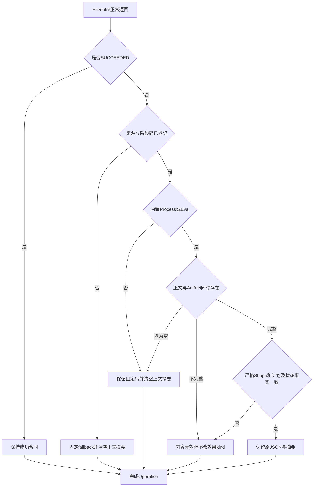
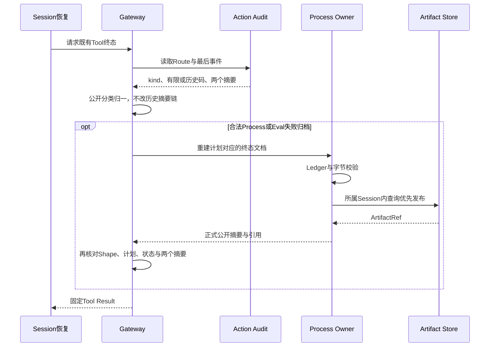

# 0.9.4a 结构化失败结果公开边界详细设计

## 1. 需求背景与源码证据

[Gateway回调专项](m09-4a-gateway-callback-error-boundary.md)只治理抛出的异常。执行器正常返回
`ActionExecutionOutcome(kind="failed", error_code=任意格式合法字符串, output=任意JSON)`时，
Pydantic往返只证明数据格式合法，不证明公开权限。执行器本身受宿主绑定，其正文可能来自外部系统。

当前调用链中，Router将返回码写入Action Audit，再由Gateway把正文放入Tool Result。模型后续历史、
Session与Agent Protocol事件回放因此能够看到未经公开合同验证的数据。整改前10个负例均失败：
Execute的FAILED/UNKNOWN及Reconcile的FAILED/UNKNOWN/MANUAL各注入未知码与跨来源Process码。
测试只使用合成式样，不使用真实凭据或模型接口。

源码依据：

| 源码 | 现状与设计约束 |
|---|---|
| [`ActionExecutionOutcome`](../../src/harnessix/trusted_actions/contracts.py) | 码只受格式约束；失败正文为任意JsonValue；v1计划和Binding已有持久指纹。 |
| [`execute_action / reconcile_action`](../../src/harnessix/trusted_actions/operation_router.py) | 正常返回值在身份验证后直接完成Audit；异常路径已有固定分类。 |
| [`terminal_result / build_result`](../../src/harnessix/trusted_actions/agent_gateway_output.py) | 执行和恢复共用投影，Output Provider返回的JSON原先直接公开。 |
| [`_project_status`](../../src/harnessix/trusted_actions/agent_gateway_support.py) | 恢复从旧Audit重建Outcome，正文为空，Artifact摘要可能存在。 |
| [`Product Process`](../../src/harnessix/product_config/process_action.py) | 失败可有合法Lease摘要及输出归档；没有Lease时只返回固定码。 |
| [`Eval`](../../src/harnessix/product_config/eval_action.py) | 非零测试退出是业务结果，仍SUCCEEDED且passed=false；基础设施失败才走失败合同。 |
| [`MCP`](../../src/harnessix/mcp/actions.py) | 只读远端错误使用固定码；写请求发送后不确定效果进入UNKNOWN；自定义Reconciler可能返回任意码和正文。 |
| [`Skill`](../../src/harnessix/skills/actions.py) | 正文读取受Secret Guard约束，失败只需固定分类，不需要正文。 |
| [`Patch`](../../src/harnessix/delivery/trusted_action.py)、[`Git`](../../src/harnessix/delivery/git_push.py) | 失败只需有限分类；成功Diff与Push Receipt不属于本次失败正文整改。 |

## 2. 设计目标、非目标与验收范围

### 2.1 目标

- 在Audit新写入之前归一正常返回的失败码与正文，不能仅在最终UI遮盖。
- 在Gateway执行、恢复和Provider返回之后再验证公开边界，兼容旧Audit且不重写摘要链。
- FAILED、UNKNOWN、MANUAL及外部Action ID保持原事实，不把公开内容错误解释为外部效果回滚。
- 自定义执行器默认只公开固定分类，无动态码注册、前缀放行或任意失败正文。
- Process/Eval保留正式有界摘要与受控Artifact；不整体删除合法测试输出与错误诊断。
- 不迁移Binding/Route/Store Schema，不改变既有审批指纹，不增加独立服务。

### 2.2 非目标

不清洗成功业务输出、历史Session中已经公开的内容、任意自定义Gateway或独立Store错误。
不证明Owner归档正文不含敏感业务数据，不允许用摘要Shape校验替代Artifact所属Session与内容完整性检查。
不宣称有界摘要校验解决执行器返回巨大JSON的所有CPU/内存风险；执行前JSON往返预算仍需独立治理。

## 3. 总体架构、决策及取舍

采用内核持有、随源码版本演进的静态公开失败策略。该策略只收紧公开结果，不改变可执行资源、输入、
执行器或批准权限，因此不向v1 Binding加入新的可配置输出策略字段。否则既有Binding Digest、Route
Fingerprint及审批恢复将发生兼容性变化，需要真正的版本迁移，而不是添加默认字段后假装兼容。

来源选择必须同时匹配Binding.source与内置source_id/executor_id；MCP执行器身份格式匹配已冻结
的mcp摘要身份；Skill匹配固定操作身份。码表按Execute与Reconcile分组，模型和Provider不能动态扩表。
自定义宿主可以执行自己的工具，但失败结果使用通用固定码；未来需要新的公开合同必须提交正式设计、
源码码表和回归，不以格式合法或前缀相同证明可信。

架构保持Agent Runtime → Gateway → Router → Owner。新增函数是进程内边界，不是第二条执行路径。


执行器身份可信与输出数据可信分离。N在效果已发生后运行，只控制可公开内容；A记录归一后摘要，
并不额外保存被丢弃的诊断。R不会执行历史迁移写入；旧Audit中的未知码在G重新映射。

## 4. 接口设计、类与数据结构

### 4.1 失败结果归一接口

`normalize_failure_outcome(plan, outcome, stage, allow_pending_output=False)`返回新的Outcome或原成功Outcome。
输入plan已完成Router身份验证。stage为execute/reconcile；公开恢复可使用两阶段有限表的并集，
以便终态投影不改变已归一的分类。allow_pending_output仅允许恢复等待受信Owner重建正文。

| 字段 | 处理规则 |
|---|---|
| kind | 原样保持；首次执行不能MANUAL仍由Router拒绝。 |
| error_code | 当前有限表中保留；否则FAILED→action_failed，UNKNOWN→action_effect_unknown，MANUAL→action_manual_intervention。 |
| output | 默认None；仅Process/Eval已登记失败码且符合正式摘要和计划事实时保留。 |
| artifact_sha256 | 默认None；只随通过校验的Process/Eval摘要或恢复待重建事实保留。 |
| external_action_id | 原样保持；不以内容拒绝抹去外部效果身份。 |

### 4.2 Process/Eval公开摘要

公开摘要与内部JSONL归档Summary分开定义；不修改现有公开JSON形状或canonical_digest。

| 字段 | 约束及源码关联 |
|---|---|
| version | 固定trusted-process-output/v1。 |
| profile | 有界标识，必须等于计划invocation.arguments.profile。 |
| process_id | 固定UUID文字，必须等于plan.execution.plan_id。 |
| state / returncode | exited才允许退出码；failed/unknown不允许伪造退出码。 |
| stop_reason | 只允许ProcessStopReason有限集合，不能携带自由诊断。 |
| stdout / stderr | 只公开observed_bytes、observed_sha256、persisted_bytes、truncated、eof；禁止text、argv、路径等扩展字段。 |
| complete | true必须双方EOF且无持久截断；false不能反推流损坏，内部归档截断也可能导致false。 |
| passed | 仅Eval允许且必填，由exited/exited/returncode=0派生。 |
| artifact | 仅Gateway投影阶段允许；正式ArtifactRef，摘要必须等于Audit期望，所属域仍由Artifact Store保证。 |

失败码与摘要事实必须一致：unknown Lease只能对应process_state_unknown并保持UNKNOWN或MANUAL；
failed Lease对应process_launch_failed；普通Process非零正常退出对应process_nonzero_exit；超时等停止
对应有限stop_reason映射。Eval非零正常退出不得伪装成基础设施失败。未通过正式摘要校验时使用
action_failure_output_invalid并丢弃正文/Artifact，原kind不变。

## 5. 核心流程及伪代码



```text
execute:
  prepare + claim + await executor under deadline
  JSON合同往返 + identity核对 + 禁止首次MANUAL
  normalize_failure_outcome
  audit.complete_operation(normalized摘要)
  原取消信号仍在完成保守记账后重抛

terminal_result:
  normalize失败公开分类；恢复允许Process等待Owner重建
  无合法Artifact资格 -> 直接固定Tool Result，不调用Provider
  核对Audit事件、状态、正文摘要及Artifact摘要
  await受信Provider，经原CancelToken管理
  对失败投影验证strict摘要、canonical_digest及ArtifactRef摘要
  构建Tool Result，不回写Audit、不重执行
```

### 5.1 恢复时序、持久化与事务一致性



Runtime崩溃窗口的FAILED对账结果可使Turn保持FAILED，不必再次请求模型；直接执行的确定失败可反馈模型继续处理。
UNKNOWN或MANUAL仍使Turn保守中断。本专项按真实生命周期验证，不强制所有失败进入COMPLETED。

恢复不能以公开内容不合法为由再次Execute。UNKNOWN只允许既有Reconcile路径；已结算的UNKNOWN
Tool Result不因本次整改增加自动对账。历史Audit仍为私有不可变事实，新公开清洗不代表旧存储已消除。

## 6. 失败、取消、安全、可观测性与部署

- 返回非法Action ID仍走既有Router异常归一；内容验证必须在身份验证之后，不掩盖身份错误。
- 失败摘要无效不抛新的执行错误，不把已证明FAILED升级或把UNKNOWN降为FAILED。
- Provider失败投影无效使用固定trusted_action_output_mismatch；Audit终态不变，Session使用既有保守恢复策略。
- 不捕获BaseException；Task取消与TurnCancelled继续传播，不构造虚假成功。
- 默认失败正文不保存，不添加第二份包含敏感诊断的日志；Owner诊断归档延续原权限、配额与分页合同。
- 仅进程内源码变更，无数据库部署或服务器变更；v1计划、Binding Digest及审批无需迁移。
- 不为通过CI修改LGPL拒绝策略；许可证失败与本专项结果分开记录。

## 7. 测试、证据与完成判定

| 场景 | 必须证明 |
|---|---|
| 未知码与跨来源码、3失败kind、2阶段 | 固定分类、无失败正文、无Artifact摘要、无重复执行。 |
| 已登记码附带任意诊断 | 码表资格不赋予正文公开资格。 |
| 正式Process/Eval失败摘要 | 原JSON及摘要不变，诊断Artifact仍可发布。 |
| 错Profile/ID/额外字段/停止原因/退出码/测试结论 | 拒绝公开，kind不变。 |
| Provider正常返回的失败投影 | 验证Shape与两个摘要，不仅验证异常。 |
| 旧Audit终态恢复 | 不公开未知码，不调用不具备正文资格的Provider，不改旧事件链。 |
| 真实Runtime五公开面 | 模型实际后续历史、Session回放、Protocol事件、非空OTel、Audit及SQLite字节均验证。 |
| 成功业务与取消回归 | Eval非零退出仍是成功业务结果；原取消/Deadline/身份栅栏未回归。 |

整改前负例结果为10 failed；整改后107项专项通过，完整本地回归4220 passed/32 skipped（356.65秒）。
完整回归显式排除未验收的tests/security草稿；专项含既有Schema一致性1项，本次新增106项。
真实Runtime指SQLite/Agent Runtime/Protocol/OTel实际集成，模型使用ScriptedProvider；无真实模型API请求。
Sourcefamily相关首次回归为504 passed/5 skipped，后续正式来源/摘要/Runtime均纳入完整回归。
0.9.4a及整个0.9是否完成仍由各自完整发布门禁判定，本专项不替代供应链、攻击测试或三平台验收。

## 8. 源码与测试映射、实施结果及风险

| 组件 | 源码 | 验证 |
|---|---|---|
| 有限策略与归一 | [`public_outcomes.py`](../../src/harnessix/trusted_actions/public_outcomes.py) | [来源/阶段码表](../../tests/trusted_actions/test_failure_policy_sources.py)、[返回与旧链](../../tests/trusted_actions/test_returned_failure_boundaries.py) |
| Process DTO | [`public_output.py`](../../src/harnessix/processes/public_output.py) | [正式投影](../../tests/trusted_actions/test_process_failure_projection.py) |
| 新写记账 | [`operation_router.py`](../../src/harnessix/trusted_actions/operation_router.py) | [真实Runtime](../../tests/trusted_actions/test_returned_failure_runtime.py) |
| Gateway恢复与Provider返回 | [`agent_gateway_output.py`](../../src/harnessix/trusted_actions/agent_gateway_output.py) | [正文与摘要负例](../../tests/trusted_actions/test_process_failure_projection.py) |

结构治理新增两条DTO只读依赖边的理由、版本兼容、替代方案与回滚风险见[ADR 0093](../adr/0093-kernel-owned-public-failure-contract.md)。
不新增复杂度豁免。Ruff、Mypy（330源码文件）、合同/任务包、SBOM Schema/漂移、结构治理、文档与变化Mermaid真实渲染均通过。
静态检查同样排除未跟踪tests/security草稿，未修改草稿，也未把其作为TM攻击验收。
许可证门禁保持失败（12个Archive），因此make check和整体0.9不标记通过。
首次正式Process夹具调用不存在的approve接口以及启动失败Lease身份未清空产生测试失败，
均依据实际decide与ProcessLease合同修正夹具，不放宽生产状态机或Owner身份约束。
Runtime崩溃恢复FAILED不一定进入COMPLETED，测试按实际恢复合同修正断言，未修改Runtime实现。
