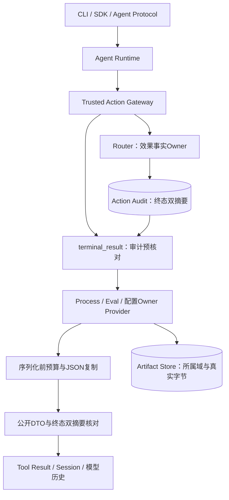
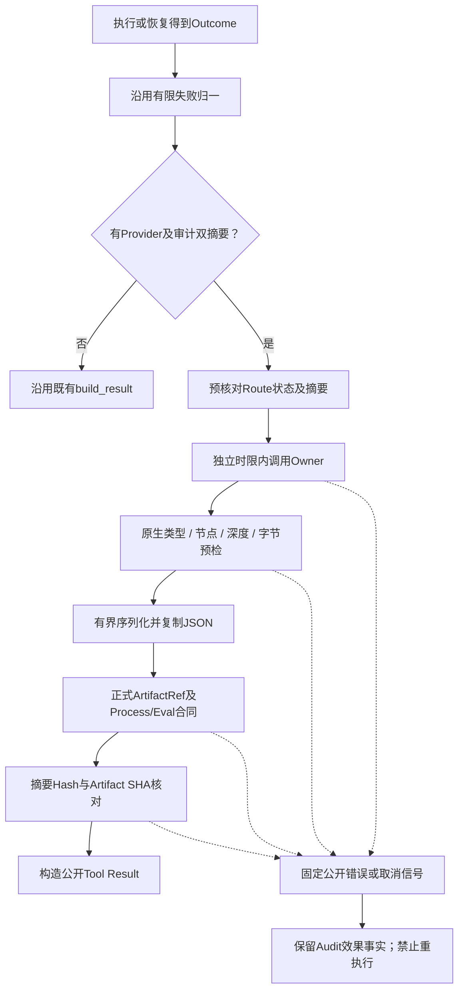
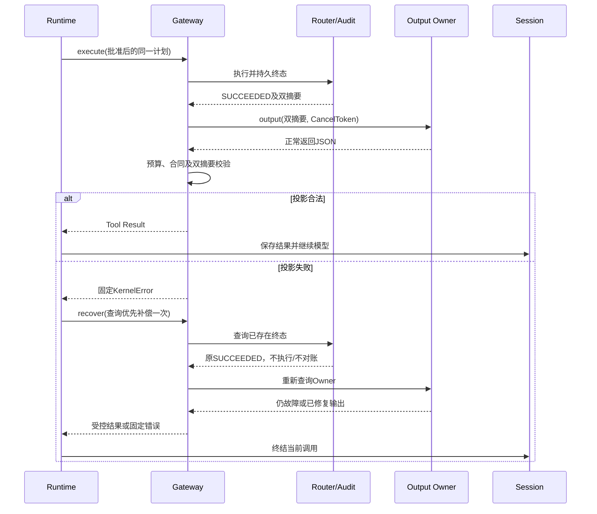
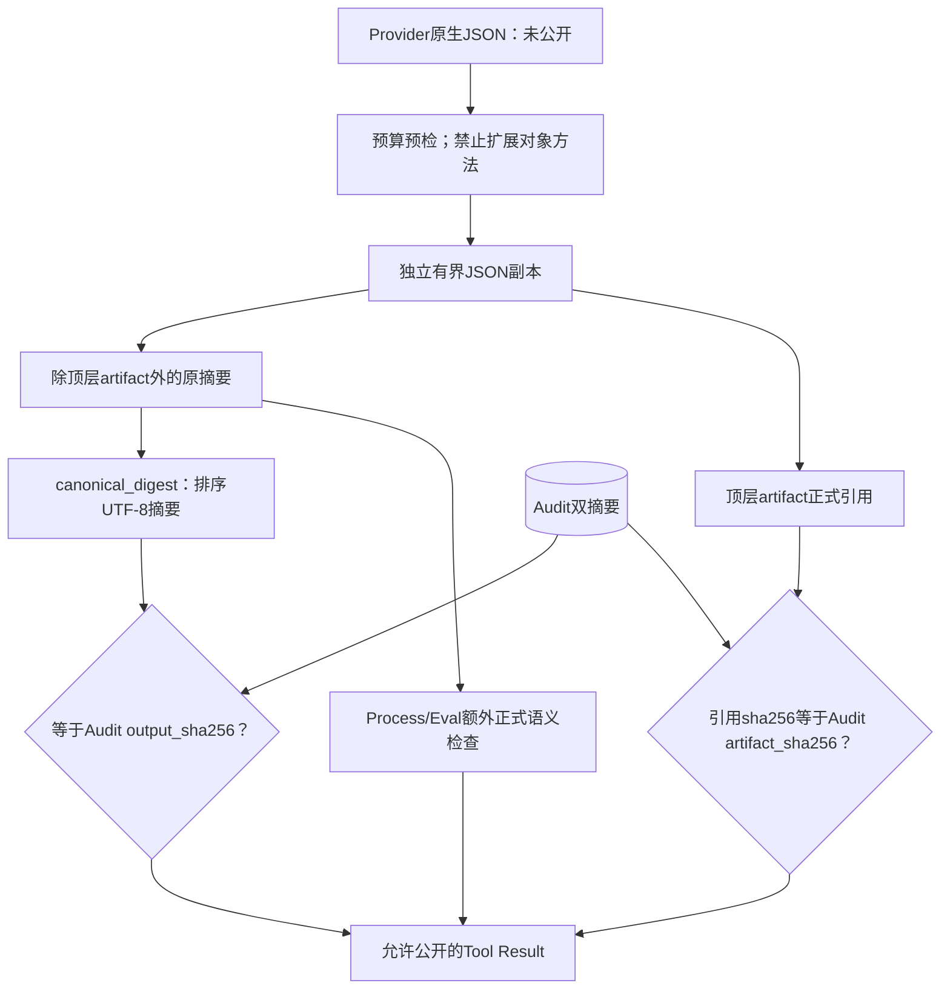

# 0.9.4a 成功输出投影与有界Owner回调详细设计

## 1. 需求背景、问题复现与需求边界

[结构化失败合同](m09-4a-returned-failure-boundary.md)已限制失败正文，但原有
`validate_failure_projection`对`kind=succeeded`直接返回。成功执行不代表后续Owner Provider
可以追加任意诊断内容；Provider返回的JSON必须与已发生动作的审计摘要一致。

在前序版本`e748a7d6dcae9fd35291d6c0f3a4045959e3d9bc`，执行和恢复各有7个负例：
追加诊断、替换摘要、错Artifact SHA、缺Artifact、仅SHA的不完整引用、标量正文、引用额外字段。
14个负例均未得到预期拒绝。另一个缺口是Provider await没有独立时限，返回后的JSON序列化、
严格DTO及哈希之前也没有资源预检。无界输入先进入通用序列化器，再检查大小不构成资源边界。

### 1.1 设计目标

1. 配置Owner Provider的成功和失败投影共用摘要/引用校验，执行和恢复采用同一逻辑。
2. 原生JSON在序列化前检查字节、深度、节点和标量范围；阻断循环与扩展对象回调。
3. Provider异步操作、返回值预检、复制和合同校验共用独立投影时限，传播领域和父Task取消。
4. 投影失败不能把已发生动作改写成FAILED，不能重执行动作或重新审批。
5. 保留真实Process诊断归档和Eval非零退出的业务反馈，不把测试失败误写成基础设施失败。

### 1.2 非目标与明确未关闭项

- 不治理`operation_router`对执行器原始Outcome的无界Pydantic往返及CPU预算；该路径在本预算之前。
- 不为未配置Provider的成功业务JSON创建新的输出合同，也不证明成功正文全部经过Secret Guard。
- 不接管Provider内部读取、缓存、脱敏和Artifact发布的内存预算。Provider先分配大对象后返回时，
  本层只能阻断进一步公开及序列化，不能追溯撤销该分配。
- 10秒为协作式异步期限，不是任意同步扩展代码的进程级硬中断；无await阻塞与吞取消的恶意Provider
  必须由宿主隔离治理，不能宣称本切片可以硬终止。
- 不用摘要相等替代Owner真实字节验证或Artifact所属Thread/Workspace/用途验证。
- 不修改旧Audit链、计划/审批Fingerprint或数据库Schema，不关闭整体0.9.4a或0.9发布门禁。

## 2. 源码研究与架构决策

| 源码及入口 | 本切片采用的事实和约束 |
|---|---|
| [`terminal_result / _project_output`](../../src/harnessix/trusted_actions/agent_gateway_output.py) | Provider只有在Router终态双摘要存在且一致时被调用；执行和恢复共享入口。 |
| [`validate_public_projection`](../../src/harnessix/trusted_actions/public_outcomes.py) | 取代只校验失败的入口；对原始摘要做Hash，不插入DTO默认字段。 |
| [`canonical_digest`](../../src/harnessix/execution/contracts.py) | UTF-8、键排序、紧凑分隔符、禁止NaN；必须在资源预检后使用。 |
| [`bounded_projection`](../../src/harnessix/trusted_actions/output_budget.py) | 本层新增序列化前预检及独立JSON复制；不引入MCP运行时依赖。 |
| [`MCP JSON边界`](../../src/harnessix/mcp/schema.py) | 现有1MiB/64层/10000节点提供默认容量依据；其正文处理不由本切片追认关闭。 |
| [`Protocol codec`](../../src/harnessix/protocol/codec.py) | 现有消息1MiB/64层提供传输容量参考；本预算只约束投影，不保证整个响应封套也小于1MiB。 |
| [`ArtifactRef`](../../src/harnessix/artifacts/contracts.py) | UUID、SHA、大小、记录数、格式、完整性和有时区过期时间为正式字段。 |
| [`PublicProcessOutputSummary / PublicEvalOutputSummary`](../../src/harnessix/processes/public_output.py) | 元数据无正文；额外字段、强制类型转换、错误终态和伪造passed均拒绝。 |
| [`CancelToken.run`](../../src/harnessix/agent/cancellation.py) | 始终回收操作Task和取消等待Task；父Task取消和领域取消语义不同。 |
| [`recover_action`](../../src/harnessix/agent/trusted_action_session.py) | Runtime在首次故障后查询优先补偿一次；已保存终态后resume不再重投影。 |
| [`Product Process Owner`](../../src/harnessix/product_config/process_action.py)、[`Eval Owner`](../../src/harnessix/product_config/eval_action.py) | 保持既有重建、双摘要核对、Artifact发布职责，不新增独立服务。 |

长期取舍见[ADR 0094](../adr/0094-audit-bound-bounded-owner-projection.md)。复用既有计划、审计、
正式DTO与取消机制，新增局部预算合同，不增加部署单元、公共API快照或一级包依赖豁免。

## 3. 总体架构与模块职责



Router负责动作已发生事实，Gateway负责是否允许公开投影，Owner负责真实输出重建，Artifact Store
负责发布和所属域。预算失败或DTO不匹配只拒绝当前Tool Result输出，不回滚外部动作，不重写Audit。
本层不是Action HTTP/Worker服务，也不增加产品旁路。

## 4. 核心流程、时序和数据流

### 4.1 投影决策流程



“无Provider”分支保持现状，不表示已经通过本预算或正式输出合同。失败无合法Artifact的分支沿用
既有正文删除策略。成功有Provider时，不再因`kind=succeeded`跳过后置验证。

### 4.2 执行与查询优先恢复时序



低层Gateway专项一次失败只调用Provider一次。真实Runtime专项中，故障终结会再查询Provider一次，
因此对应计数为2；两者不混为统计冲突。动作执行次数保持1，对账次数保持0。若Session尚未保存
Tool Result，恢复可重查询；Session保存终态后再次resume是幂等查询，不重复发布。

### 4.3 数据流与信任边界



预算通过只证明有界JSON；双摘要通过只证明审计内容绑定；Process DTO通过只证明元数据与计划/
终态语义相符。三者均不能证明引用的真实正文所属域，仍由既有Owner和Artifact Store负责。

## 5. 关键类、接口、数据结构与字段

### 5.1 预算合同

[`ActionOutputBudget`](../../src/harnessix/trusted_actions/output_budget.py)继承严格不可变
`ExecutionContract`，生成[正式Schema](../../spec/action-output-budget-v1.schema.json)。
当前仅由宿主代码持有`DEFAULT_OUTPUT_BUDGET`，不增加模型可传参数或用户运行时配置入口。

| 字段/约束 | 默认值与硬上限 | 解释 |
|---|---|---|
| spec_version | harnessix.action-output-budget/v1 | 局部投影预算版本，不进入旧计划Fingerprint。 |
| max_bytes | 1MiB；可收紧至1字节 | 整个投影JSON的紧凑UTF-8大小，含键名、转义、标点和Artifact引用。 |
| max_depth | 64；可收紧至1 | 根节点深度为1，字典键也计入下一层。 |
| max_nodes | 10256；可收紧至1 | 根、每个键、每个值、数组元素都计数；相同子树每次出现都计数。参考MCP 10000节点，额外256为引用/封套余量，不是任意扩容。 |
| timeout_seconds | 10.0秒；0.001～30.0秒 | 内部收紧用于测试；默认产品路径固定10秒，覆盖回调及返回后验证。 |
| 整数范围 | bit_length≤128 | 在str/json调用前检查，避免任意大整数转换；负数按绝对值bit_length计。 |
| 标量与容器 | 精确dict/list/str/int/float/bool/None | 非有限浮点、孤立代理项、tuple、bytes、非字符串键、子类和循环均拒绝。 |

### 5.2 接口设计

| 接口 | 输入 | 返回和不变量 |
|---|---|---|
| `_project_output` | Provider、Route、Thread/Turn/Call、Outcome、双SHA、CancelToken | 只返回预算及合同通过的JsonValue；取消不转普通错误；不修改Router。 |
| `bounded_projection` | object、宿主预算、CancelToken、单调deadline | 拒绝后只给固定KernelError；通过后返回独立原生JSON副本。 |
| `_inspect_projection` | 同上 | 迭代预检；扩展栈前检查容器节点数；active集合和退出标记区分环与共享子树。 |
| `projection_checkpoint` | CancelToken、deadline | 优先领域取消，再检查同步时限；不依赖event loop timer立即得到调度。 |
| `validate_public_projection` | 计划、Outcome、JSON副本、审计双SHA | 所有Provider输出要求对象和正式ArtifactRef；Process/Eval另验计划身份及终态语义。 |
| `_process_summary` | 计划、原摘要JSON | 共用严格DTO及profile/process_id绑定，不把默认字段写回原JSON。 |

### 5.3 成功Process与Eval语义

Process成功：`state=exited`、`stop_reason=exited`、`returncode=0`，profile等于规划输入，process_id
等于plan UUID，Process executor_id与profile匹配。Eval成功允许非零returncode，因为基础设施
已完成测试；passed必须由正式DTO派生，非零退出只能passed=false。故障元数据即使与Audit SHA
一致也必须拒绝，避免“哈希相等即业务合法”。失败仍沿用ADR0093，不放宽任何失败正文权限。

## 6. 核心业务逻辑伪代码

```text
project_owner_output(route, outcome, cancel):
  budget = 宿主固定预算
  deadline = 单调时间 + 10秒
  在协作式asyncio期限中:
    raw = CancelToken托管Owner输出，退出时回收全部子Task
    迭代遍历raw:
      检查取消和deadline
      拒绝扩展类型、循环、无效键与标量
      先核对计划扩展的节点数，再把子节点加入栈
      先核对字符数，再计算JSON转义UTF-8长度
      累加括号、逗号、冒号和键/值长度，拒绝越界
    cloned = 有界原生JSON序列化后解析的独立副本
    对正式ArtifactRef和Process/Eval摘要进行严格验证
    对原摘要计算规范Hash；核对Audit双SHA
    再检查取消和deadline
    返回cloned
  真正触发本层超时 -> trusted_action_output_timeout
  Provider自身抛TimeoutError但本层timer未过期 -> 沿用固定output_failed
  领域取消或父Task取消 -> 原样传播，不继承异常正文
  其他异常 -> 按output阶段有限公开码表重建
```

预检不会先将20万个节点推入遍历栈，字符串检查不会先复制超预算字符串。完整编码后再独立核对
字节数，用于防止预检计数实现错误；这不是以事后检查替代预检。字节预算限制进一步序列化内存，
不声称总RSS等于1MiB，转义临时字符串和JSON副本仍有有限常数开销。

## 7. 异常、取消、恢复、持久化和可观测性

| 场景 | 公开行为 | 动作事实和恢复 |
|---|---|---|
| 摘要/引用不匹配、DTO非法、循环或扩展类型 | trusted_action_output_mismatch，固定消息 | 保留Audit原终态。 |
| 字节/节点/深度/整数越界 | trusted_action_output_limit，固定消息 | 不公开大对象，不重执行。 |
| 本层期限届满 | trusted_action_output_timeout，固定消息 | CancelToken.run回收子Task；Owner内部取消职责仍有效。 |
| Owner自身TimeoutError但本层未到期 | 原有限output_failed | 不将内部时限与本层期限混为一谈。 |
| CancelToken或父Task取消 | TurnCancelled或CancelledError | 不替换取消类型，不将取消错误正文写入公开面。 |
| 成功动作但投影失败 | 读动作Turn FAILED；写动作Turn INTERRUPTED、结果UNKNOWN | UNKNOWN指反馈未确认，Audit仍SUCCEEDED，不伪称动作未发生。 |
| Session未保存Tool Result | 查询Audit/Owner重建 | 不复用旧执行入口。 |
| Session已保存当前失败结果 | resume不重复Provider | 避免无限查询/发布。 |

不新增存储表；预算合同为宿主执行策略，Action Audit继续记录动作终态双摘要，Session记录受控
Tool Result。协议回放、实际模型请求和非空OTel Span/Metric验证使用现有基础设施，不新增高基数
错误正文属性。三平台默认值相同，采用单调时钟，不受系统墙钟变动影响。

## 8. 测试计划与验证责任域

| 测试文件 | 覆盖内容 | 证据边界 |
|---|---|---|
| [success_projection_boundaries](../../tests/trusted_actions/test_success_projection_boundaries.py) | 14项执行/恢复错误正文及引用负例，已复现整改前失效 | 合成Executor/Provider配真实Router/SQLite，不是Owner字节证明。 |
| [output_budget](../../tests/trusted_actions/test_output_budget.py) | UTF-8/转义精确字节、节点、深度、宽树、环、共享子树、整数、非法类型、子类、取消/期限、严格预算 | 纯预算测试；不证明Owner内部RSS。 |
| [projection_lifecycle](../../tests/trusted_actions/test_projection_lifecycle.py) | 期限/领域/父Task取消进入与关闭握手，资源拒绝及修复后恢复 | 无固定sleep猜测，动作1次、对账0次。 |
| [process_success_projection](../../tests/trusted_actions/test_process_success_projection.py) | 正式Lease生成DTO，Process零退出和Eval零/非零；即使Audit Hash吻合仍拒绝语义错 | Lease/执行器为合成形状；生产Owner链由完整集成回归覆盖。 |
| [success_projection_runtime](../../tests/trusted_actions/test_success_projection_runtime.py) | 实际AgentRuntime、SQLite Session、模型历史、协议SDK、非空遥测，读写失败关闭与稳定resume | ScriptedProvider，真实收费模型请求为0。 |
| [既有失败投影](../../tests/trusted_actions/test_process_failure_projection.py)、[Gateway](../../tests/trusted_actions/test_agent_gateway.py) | 失败兼容和合法Provider；旧仅SHA夹具升级为完整ArtifactRef | 不降低引用合同来迎合夹具。 |
| [Schema](../../tests/trusted_actions/test_schemas.py) | 新预算及既有正式DTO生成一致性 | 不额外引入开放动态预算配置。 |

专项与完整回归有重叠，不能相加成独立测试总数。未跟踪攻击草稿不修改、不提交、不作为TM验收。
本切片完整证据需冻结代码Revision、日志Hash、负例回放、完整回归、文档图形渲染、Review Packet和
清单；前序CI不能当作新代码的矩阵验收。CI可后台运行，正式发布仍必须取得终态且版本绑定的证据。

## 9. 部署、兼容与后续风险

无新中间件或服务，Linux/macOS/Windows沿用本地Agent Runtime及SQLite部署。首次超预算投影将
从原先允许公开改为固定错误；不为兼容目的裁剪摘要、伪造Artifact或改写审计Hash。Process/Eval
现有有界元数据正常工作，大正文继续进入Owner管理的Artifact，而不是顶层Tool Result。

剩余风险：执行器原始返回值预算、未配置Provider的成功JSON、Owner内部同步阻塞/发布预算、其他
Store/公共回调面、许可证12件、编号攻击验收、远端MCP、三平台实际安装/Beta与真实Provider发布
验证。该专项不满足整体0.9完成条件，不允许绕过现有发布阻断。
