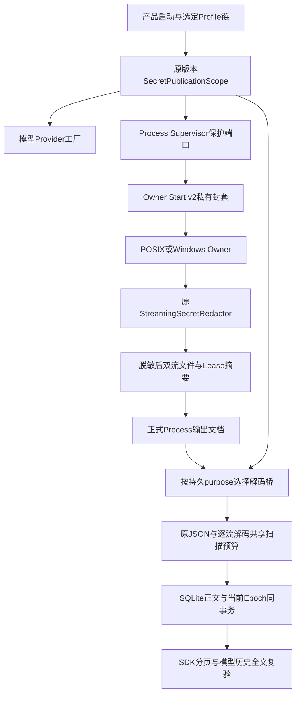
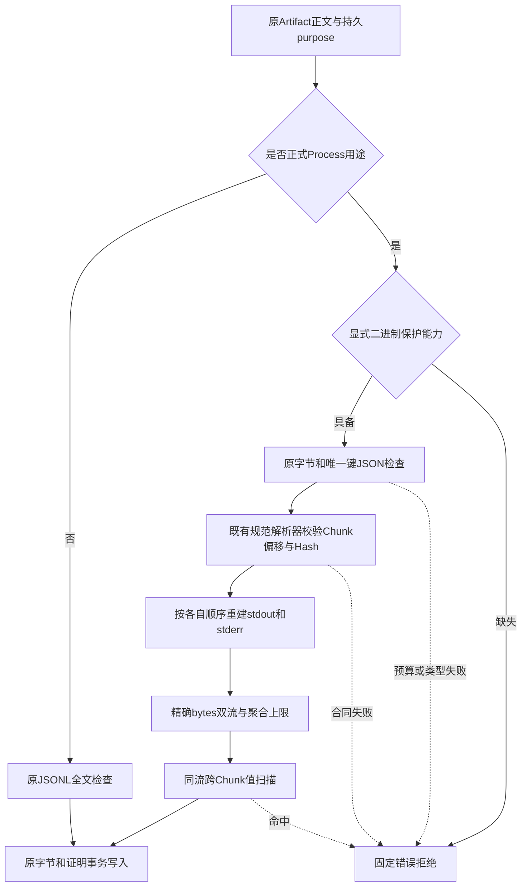
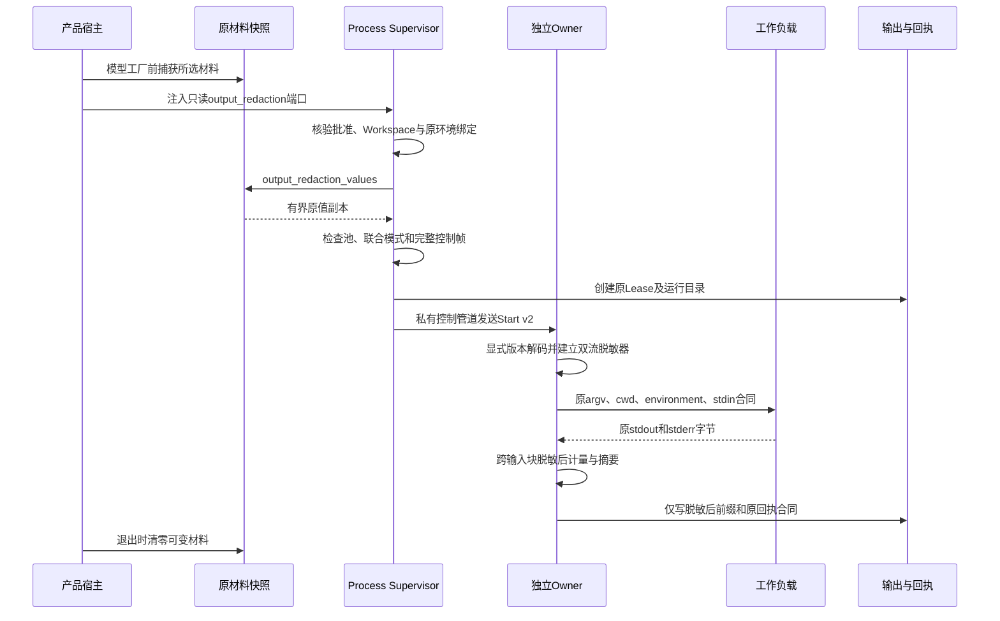
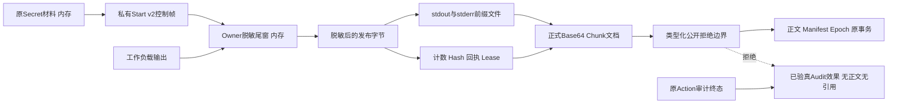

# 0.9.4a 正式二进制输出公开与Owner持久前保护详细设计

## 1. 需求背景与源码研究

[前序固定版本观察](../validation/product-publication-2026-09-27-v1/README.md)已确认：
正式Process输出使用Base64 Chunk；在登记Secret前增加1或2字节后，整值Base64模式扫描通过，
但SDK返回页的正式解码结果包含原值。跨12KiB Chunk分割同样不能用独立字符串扫描证明安全。
这不是未知自定义编码，而是产品自身已定义、可解析的正式输出合同。

当前流程存在两个不同的发布面：

- [Owner捕获](../../src/harnessix/processes/owner_output.py)在生成流计数、摘要和`.bin`之前脱敏，
  原来仅接收已批准的环境注入Secret，没有模型凭据的保护材料。
- [Artifact公开边界](../../src/harnessix/artifacts/publication.py)检查原JSONL，但未重建正式二进制双流。
  只加分页过滤仍会把敏感字节先存入Owner状态目录；只加Owner脱敏又不能防止其他正式生产者提交泄漏正文。

源码研究复用并核验本地Codex `a0dcfe2ada3f5bbd5059a34c0fc6fac244741a67`的
`codex-rs/secrets/src/sanitizer.rs`及OpenCode `69c172e8a7c0086887b1f93ed5a162f14b6aa0c5`的
`packages/http-recorder/src/redactor.ts`。有限模式用于指定出口，不等于任意二进制投影安全。
本实现复用本项目现有规范Base64、连续偏移、Hash与流式窗口，不复制上游代码或增加独立服务。

## 2. 设计目标、非目标与取舍

1. 按持久用途选择正式解码器，扫描同一流的完整归档前缀，不猜测任意JSON字段。
2. 原JSON、正式解码及扫描共同受取消、期限、工作量和聚合字节边界约束。
3. 已配置保护但缺少二进制能力时默认拒绝；独立无保护宿主保留旧兼容行为。
4. 将产品原版本模型材料用于Owner持久前保护，绝不新增工作负载环境注入权限。
5. 新Owner私有封套显式版本化，原v1 Schema、目标argv/environment及批准合同不变。
6. 拒绝正文与确认效果分离：不篡改原Audit，不重执行，不授予被拒Artifact引用。

| 备选方案 | 决策与理由 |
|---|---|
| 解码所有名为`data_base64`的字段 | 否决：名称不是合同，任意嵌套和编码扩大资源与信任边界。 |
| 按页或单个Chunk检查 | 否决：遗漏其他页和同流跨Chunk值。 |
| 把stdout和stderr拼成单流 | 否决：不同流无连续字节语义，会制造误判。 |
| 将模型key加进Process环境 | 否决：保护材料不等于批准的工作负载凭据。 |
| 修改已归档正文并沿用原Hash | 否决：破坏Lease、Audit、Manifest的字节绑定。 |
| 持久保存原值供重启恢复 | 否决：扩大敏感状态面；本切片不设计凭据保险库。 |
| 正式解码拒绝＋Owner原始捕获前脱敏 | 采用：覆盖公开与持久两个边界，保留原合同及摘要生成顺序。 |

不声明任意变换、未登记Secret、任意自定义二进制Schema、跨stdout/stderr推断、历史数据清理、
跨重启安全Seal或完整C端生产发布已完成。Host Owner能力也不等于OS文件/网络隔离。

## 3. 总体架构与模块边界



| 模块 | 职责与不拥有的能力 |
|---|---|
| `agent.publication` | 纯二进制保护端口、统一公开失败、父Task取消及10秒期限；不导入Secrets或Process解析器。 |
| `secrets.publication` | 原材料生命周期与同一预算扫描；不持久化原值，不新增注入target。 |
| `artifacts.binary_projection` | 只桥接两个正式Process解析器，重建最多双流；不重写正文。 |
| `processes.owner_protocol` | v1/v2私有控制合同、池/帧/模式前置检查；不存储新保护值。 |
| `processes.owner_output` | 双平台共用流式脱敏、计量、摘要与落盘顺序；不解释业务成功。 |
| `product_config` | 将模型快照传至真实Supervisor生命周期；原Process Secret Provider仍独立。 |
| `trusted_actions` | 保持已验真效果，恢复时允许只投影无正文元数据；不授权被拒Artifact。 |

没有Action Plane HTTP/Worker服务、第二Agent Loop或新中间件；默认产品仍为同一Coding Agent Runtime。

## 4. 核心流程与完整文字描述



1. `insert_artifact`传入其实际`purpose`，读取、单件验证、批量历史验证也使用数据库行的用途。
2. `action_output`选择`parse_trusted_process_output`；`process_output`选择旧版只读解析器。
   其他用途走原JSONL检查，不因为字段名相似获得正式二进制语义。
3. Scope先验证完整原JSONL的类型、UTF-8、唯一键、原生树与规范JSON，再调用受信解码桥。
4. 解析器保持原Chunk数量、大小、规范Base64、连续偏移、顺序、流摘要及Artifact字节上限校验。
5. 桥接器逐Chunk检查取消，分别重建stdout/stderr；Scope要求返回精确`tuple[bytes,...]`，
   最多两流、聚合不超过1MiB。原JSON和解码字节使用同一个工作量计数器，不为每流或Chunk重置。
6. 二进制按bytes匹配，不要求UTF-8。同一流跨Chunk连续值可被检查；不同流不合并。
7. 通过后提交原body和原Manifest；命中或预算失败不插入正文，也不计算一个替代Hash。

## 5. 持久前保护时序与生命周期



父进程在`LeaseStore.create`及`_spawn_owner`之前验证材料。失败为确定性前置失败，不能标为已经发生的未知效果。
模型保护值只在产品内存和Owner私有启动管道中瞬时传输，不进入目标环境、argv或产品配置持久快照。
测试工作负载可通过已批准stdin接收合成输入，这不由产品自动注入模型凭据。

Owner先构造`StreamingSecretRedactor`再打开文件FD；第二流创建失败关闭第一流FD。
原输入的所有Chunk通过最长模式尾窗，EOF、超时、取消后排空仍按原策略处理。
流计数、Hash、持久前缀与回执均基于脱敏后的发布字节；这不伪称是工作负载原始字节Hash。

## 6. 接口设计与重点类

| 接口/类 | 输入、输出和关键约束 |
|---|---|
| `PublicOutputProtection` | 原JSON/JSONL端口保持不变，已有普通宿主不被强制修改签名。 |
| `PublicBinaryOutputProtection.assert_public_binary_jsonl` | 原body、受信decoder、checkpoint；无返回正文、只允许通过或拒绝。 |
| `BinaryStreamDecoder` | `(bytes, checkpoint) -> tuple[bytes,...]`；桥接器由Artifact层提供，不接受模型动态注册。 |
| `SecretPublicationScope.output_redaction_values` | 当前原材料的bytes副本；关闭后拒绝，不包含任何注入target或环境权限。 |
| `OutputRedactionSource` | Process层最小只读结构端口；不依赖具体Scope类。 |
| `protected_owner_start` | 原v1 Start和可选保护源；无保护返回原对象，保护失败归一固定前置码。 |
| `decode_owner_start` | 按`spec_version`显式分派，返回原Start与保护tuple；旧Owner不能静默接受v2。 |
| `ArtifactPublicationGuard.check_body` | body和持久purpose；普通/二进制路径共用当前Epoch与统一失败边界。 |
| `terminal_result` | 原Router终态和双Hash验真后投影；仅明确的恢复调用允许公开拒绝后的无正文元数据。 |

`metadata_only_on_rejection`是内部恢复策略，不是公开API或模型参数。
`TrustedActionEffect.origin`表示事实来源，终态重投影仍可为`execution`；不能据此猜测本次调用是否属于恢复。
未知错误、Hash不匹配、非终态或未核验计划不因这个开关转为成功。

## 7. 数据结构与重点字段

| 结构/字段 | 含义、边界与持久性 |
|---|---|
| `ProcessOwnerStartV2.spec_version` | 固定`harnessix.process-owner-start/v2`，与原v1通过判别联合显式区分。 |
| `start` | 完整嵌套原`ProcessOwnerStart`，环境注入仍受原`secret_names`和批准计划限制。 |
| `output_redaction_base64` | 最多32项；原材料总计≤64KiB，每项≥4字节且无NUL，规范Base64；仅私有控制管道瞬时值。 |
| 编码聚合预算 | 解码前≤`4 * floor((65536 + 2 * 项数)/3)`；给规范填充留余量，拒绝先分配超大池。 |
| 完整控制帧 | 序列化后含换行≤1MiB；材料与原注入值联合有限模式≤256。 |
| `_ScanBudget.work` | 所有原字节、JSON投影及解码流的模式匹配累计工作量≤64MiB。 |
| 原JSONL预算 | 原body≤1MiB；原生键值累计≤1MiB；深度≤64；JSONL节点按原有全文规则。 |
| 解码聚合预算 | 精确tuple、最多双流、总计≤1MiB；不会给每个流各自额外1MiB。 |
| `publication_epoch/policy` | 沿用Migration 0028当前Store证明；本切片不增加迁移，不将Epoch提升为跨重启Seal。 |

[Owner v1 Schema](../../spec/process-owner-start-v1.schema.json)保持原字节，
另增[Owner v2 Schema](../../spec/process-owner-start-v2.schema.json)。
Process Lease、Owner Receipt、Execution Plan、Agent Protocol和正式Process Output Schema没有改写。

## 8. 持久化与数据流程



数据不变性：不更换Plan/审批指纹，不改变原目标环境和执行身份，不事后改写Owner文件、正文或Hash。
Artifact全文检查在原事务INSERT前；读路径仍执行归属、Manifest、TTL、Hash、当前证明及全文复验。
动作已确认后发生正文拒绝，Audit仍为原终态；Session记录无正文效果元数据，Turn保留公开拒绝失败。
恢复不再Execute或Reconcile已终态动作，也不返回被拒Artifact Hash/引用。
旧运行下的未脱敏Owner文件、旧Session与不同Epoch正文不会在此切片清洗或重签。

## 9. 核心业务逻辑伪代码

```text
公开正式Process正文(body, purpose):
    要求显式二进制保护能力
    budget = 检查完整原JSONL和唯一键原生值
    streams = 原正式解析器校验并逐流重建(body)
    要求最多双流、精确bytes、聚合有界
    对每个stream:
        使用同一budget扫描全部登记模式
    成功后按原事务写入原body及当前证明

启动受监督进程(plan, original_start, scope):
    核验批准、Workspace、能力、原环境与声明的注入Secret
    values = scope原材料副本
    核验整个池、编码池、联合模式及控制帧
    此后才创建Lease并启动Owner
    Owner解码v2，建立原脱敏器，再启动原目标环境
    输出先跨块脱敏，再计量、Hash及落盘

恢复已终态动作:
    核验原Router计划、终态与原双Hash
    尝试原受控公开投影
    若命中有限公开保护拒绝码:
        仅返回原效果，无output、无artifact_sha256、无Artifact引用
    其他错误维持原保守失败/UNKNOWN语义
```

## 10. 失败、恢复、取消与超时

| 失败 | 公开分类与效果语义 |
|---|---|
| 正式解码值包含原材料 | `public_output_secret_leak`；拒绝正文，已确认动作保留原效果。 |
| 超大原JSON/双流/累计工作量 | `public_output_limit`；不授予正文。 |
| 缺少二进制能力 | `public_output_binary_capability_missing`；不降级到普通字符串扫描。 |
| Scope已关闭 | `public_output_secret_unavailable`；不能用当前环境新值代替原版本值。 |
| 非规范合同/未知回调诊断 | `public_output_protection_failed`；不透传原异常正文。 |
| 整体保护超时 | `public_output_timeout`；解码前后及逐Chunk均有checkpoint。 |
| Owner保护源/池/帧不合法 | `process_output_protection_unavailable`；创建Lease之前拒绝。 |
| 原材料联合模式超限 | 同上前置失败；不能让Owner启动工作负载后才发现保护无效。 |
| 父Task取消或CancelToken | 原取消信号继续传播，Owner按原进程树生命周期回收。 |

六个`public_output_*`固定拒绝码仅在Gateway output阶段保留，context/review阶段不借用该白名单。
同步解析器在进入和返回以及逐Chunk之间检查期限；非协作同步阻塞不具有硬抢占保证，这一限制仍开放。

## 11. 安全、权限与信任边界

解码器和Start封套来自受信宿主，不来自模型参数。保护材料不参与工作负载批准的环境绑定、
Lease、回执、Audit、配置快照或外部日志。Base64是传输表示，不是加密或保密手段。
产品仍需原状态目录权限、私有FD传递及Owner生命周期边界；拥有同用户进程内存读取能力不在此切片防护范围。
清零可变材料不承诺Python不可变bytes副本已被擦除。

当前Epoch证明不是签名。已配置Scope的当前读路径重新检查正文，但跨重启缺少原材料证明仍会保守拒绝。
旧Process用途仅补读取检查，不恢复其已删除的执行入口。

## 12. 可观测性与错误分类

沿用Turn固定失败、ToolResult效果元数据、Action Audit与Process Lease，不增加含材料值的新遥测字段。
终态输出拒绝后，Run次数必须保持1，Reconcile次数保持0，原Audit事件和原效果不改。
失败报告可包含固定码、用途、计数、版本和Hash，不能包含原材料或Decoder异常文本。

## 13. 测试、真实验证与验收边界

| 测试入口 | 证明内容 |
|---|---|
| [二进制公开测试](../../tests/artifacts/test_binary_publication.py) | 两用途、双流、0/1/2字节对齐及跨12KiB Chunk、非UTF8、合同篡改、缺能力默认拒绝、共享预算/取消/期限。 |
| [同事务测试](../../tests/artifacts/test_publication_persistence.py) | 正式body拒绝时不INSERT，安全body与证明同事务；其他普通用途保持。 |
| [Owner测试](../../tests/processes/test_output_protection.py) | v1原样、v2严格解析、解码前编码池限制、FD回收及真实OS退出/超时/取消三场景的持久前保护。 |
| [产品Process链](../../tests/product_config/test_process_action.py) | 实际审批、Router、Agent、SQLite、分页；Owner终态为合同替身，安全确认丢失与泄漏后元数据恢复不重执行。 |
| [产品启动与依赖](../../tests/product_config/test_publication_scope.py) | 模型工厂前原值捕获、旋转不改变快照、实际Supervisor装配同一保护端口、退出清理。 |
| [恢复分类测试](../../tests/trusted_actions/test_publication_recovery.py) | 六个有限拒绝码执行失败与恢复只返元数据、保持原execution来源、跨阶段码不被接受。 |

独立旧版探针使用干净`d09f58d`归档，不能从新代码关闭检查冒充旧版负例。
专项、相关回归和完整回归均存在重叠，不加总。固定源码、测试树、构建物、日志摘要及Hash见
[集中验收目录](../validation/typed-binary-publication-2026-09-28-v1/README.md)。
本地真实Owner只证明本机平台，不推导Windows Job/ConPTY、真实容器安装、网络模型或全产品字节级stdio验收。

## 14. 源码映射与阅读顺序

1. [产品装配](../../src/harnessix/product_config/server.py)：`_serve_product_stdio`捕获原模型Scope，向Action Runtime传保护端口。
2. [依赖生命周期](../../src/harnessix/product_config/action_runtime.py)：`_open_action_dependencies`→`_process_supervisor`。
3. [批准与物化](../../src/harnessix/processes/supervisor.py)：`_start_bound`在Lease创建前调用`protected_owner_start`。
4. [纯物化步骤](../../src/harnessix/processes/supervision_planner.py)：`materialize_owner_environment`保留原绑定校验。
5. [私有封套](../../src/harnessix/processes/owner_protocol.py)：`ProcessOwnerStartV2`、`protected_owner_start`、`decode_owner_start`。
6. [POSIX Owner](../../src/harnessix/processes/posix_owner.py)与[Windows Owner](../../src/harnessix/processes/windows_owner.py)：读取v1/v2后复用原目标启动。
7. [持久捕获](../../src/harnessix/processes/owner_output.py)：`capture_process_streams`和`CapturedProcessOutput`。
8. [Artifact解码桥](../../src/harnessix/artifacts/binary_projection.py)：`decode_process_artifact`→既有正式解析器。
9. [公开纯端口](../../src/harnessix/agent/publication.py)：`protect_binary_jsonl`与`_protect`。
10. [共享预算](../../src/harnessix/secrets/publication.py)：`_assert_binary_jsonl`、`_ScanBudget.scan_bytes`。
11. [集中写入](../../src/harnessix/artifacts/persistence.py)、[单件读验](../../src/harnessix/artifacts/sqlite.py)、[批量历史](../../src/harnessix/artifacts/batch_verify.py)：传实际purpose。
12. [输出恢复](../../src/harnessix/trusted_actions/agent_gateway_output.py)与[恢复调用](../../src/harnessix/trusted_actions/agent_gateway_support.py)：显式metadata策略独立于origin。
13. [固定错误表](../../src/harnessix/trusted_actions/public_errors.py)：output阶段有限公开保护拒绝码。

## 15. 部署、兼容、回退与风险

仅升级同一发行版本的父宿主与Owner；不将v2封套发给旧Owner。无保护源仍发送原v1。
新增Schema由[合同生成器](../../scripts/generate_specs.py)独立导出，旧公开合同不改；没有新数据库迁移或外部部署步骤。
回退不能让带当前证明的正文跳过检查；旧版本仍存在已确认位移缺口，不作为安全发布替代品。

历史Session和其他公开出口、跨重启原材料证明、Owner/Store内部资源归属、许可证12件、
TM编号化攻击、远端MCP身份/OAuth/受管出口、三平台真实安装/Beta和真实Provider成本与发布验证仍开放。
本切片实现不关闭0.9.4a、0.9.4或0.9整体完成状态。
