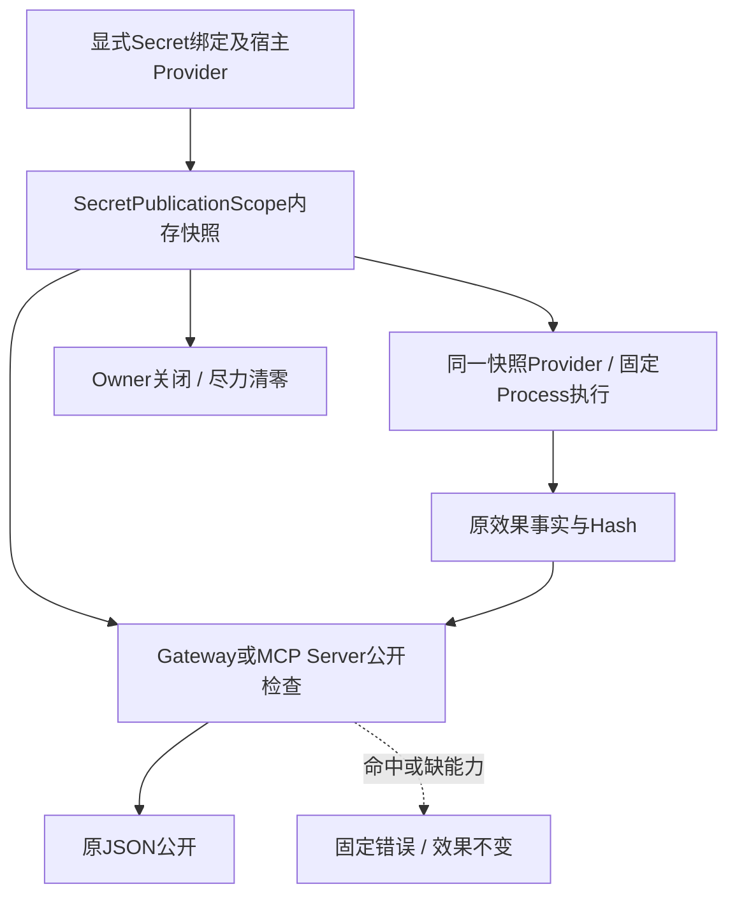
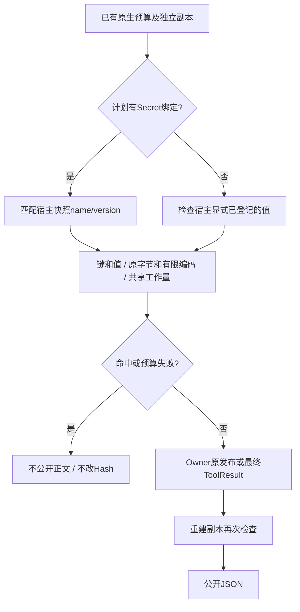
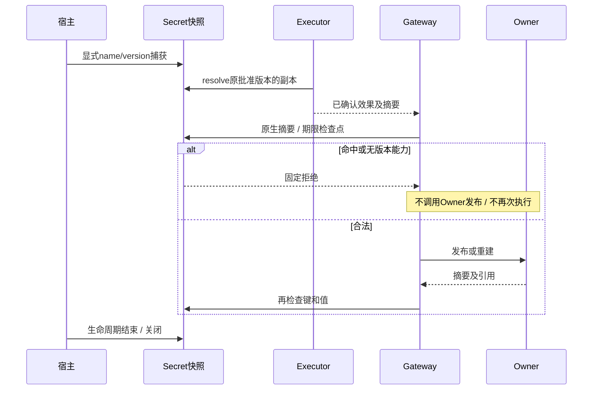
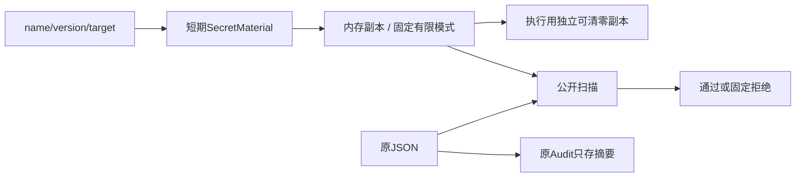

# 0.9.4a 版本化Secret公开保护作用域详细设计

## 1. 需求背景与源码研究

[前序验收](../validation/custom-success-2026-09-27-v1/README.md)以真实SecretVersionBinding、
EnvironmentSecretProvider和SQLite Runtime复现：合法summary字段携带绑定Canary，进入Session、
下一次Scripted请求和SDK协议回放。字段和Hash正确不等于值安全。Snapshot不含该正文，Audit仅存
Hash，非空遥测无值；不得把一个公开面的缺失作为全部保护通过。

当前[Secret Provider](../../src/harnessix/secrets/provider.py)每次读取当前宿主值，作用域可清零但
不保存旧版本；[Guard](../../src/harnessix/secrets/guard.py)先序列化再检查大小，不能直接接收
任意执行器对象。[Process](../../src/harnessix/product_config/process_action.py)已有流式脱敏，
[MCP Client](../../src/harnessix/mcp/runtime.py)已有目标值检查，两者均不能证明独立Gateway或
MCP Server的公开值安全。原有实现和事实保留，不机械重复两套脱敏器。

本地上游研究：Codex `a0dcfe2ada3f5bbd5059a34c0fc6fac244741a67` 的
`codex-rs/utils/redacted-string/src/lib.rs`只隐藏Debug，Serialize透明；
`codex-rs/secrets/src/sanitizer.rs`是有限模式的best-effort替换。OpenCode
`69c172e8a7c0086887b1f93ed5a162f14b6aa0c5`的
`packages/http-recorder/src/redactor.ts`按HTTP边界和敏感字段名处理。
这些局部保护不代替明确值/版本/效果/公开边界；本实现不复制其代码。

## 2. 设计目标、非目标与取舍

建立显式、短生命周期的宿主SecretPublicationScope：同一内存快照同时作为Process执行SecretProvider
和公开检查器。仅解析传入的name/version绑定，不枚举环境或持久化明文；输出不得改变已冻结Hash。
命中只拒绝公开正文，不修改已确认Audit或再次Execute/Reconcile。

| 方案 | 决策及原因 |
|---|---|
| 合法字段直接公开 | 否决：前序真实Runtime负例。 |
| 发布时重新读取当前环境 | 否决：执行中旋转可能漏掉原值，同版本新值也不能证明旧值。 |
| 对所有环境变量启用正则 | 否决：扩大凭据权限、隐含来源，不具备版本合同。 |
| 修改正文为REDACTED并保留旧Hash | 否决：破坏Audit绑定；原执行器内部的流式脱敏仍保留。 |
| 同一显式快照供执行与公开检查 | 采用：有限内存和生命周期，不增加网络服务或Plan迁移。 |
| 重启后相同版本即可恢复旧Secret正文 | 否决：无旧原值证明；仅Hash恢复不调用Owner并只补效果元数据，不拒绝已确认效果元数据。 |

不关闭历史Session正文治理、任意编码/隐写/结构化拆分、全部模型Provider凭据、Owner内部Artifact字节/归属、
跨重启Secret正文安全恢复及整个0.9.4a。作用域外Secret不是已受保护值；各宿主必须显式登记。

## 3. 总体架构与模块边界



Secrets只提供有界快照、版本匹配和原生树扫描，不导入Router或产品装配；Gateway决定期限、
取消和交付顺序；Product Composition持有作用域并为执行与公开配置同一实例。MCP Server显式
接受宿主作用域，不借用Gateway的实际验收。

## 4. 流程及文字说明



缺少作用域且计划绑定Secret时默认拒绝，不把SecretProvider原始异常公开。无绑定且无显式
作用域维持既有行为，不声称发现未登记Secret。检查字段名、字符串和标量规范字节，树检查后独立检查有界规范JSON，保留原JSON；不调用
自定义items/编码/序列化钩子。只支持已有有限secret_patterns形式，不推断业务敏感字符串。

## 5. 时序图与交付失败语义



原始摘要在Owner发布前检查，重建副本再检查。只有Hash的历史Secret结果不具备原值证明，
恢复时不调用Owner，只补经Audit核验的无正文元数据，避免把成功效果误标为UNKNOWN或再次执行。

## 6. 数据流程及持久化



不新增数据库表、Plan/Binding/Audit字段或持久Secret副本。target仍由ExecutionPlan冻结，
快照按name/version复用材料而不扩大注入目标。新旧指纹保持；跨重启原值证明缺失明确拒绝正文。

## 7. 类设计、接口设计及数据结构设计

| 类/接口 | 入参、结果、职责和源码 |
|---|---|
| SecretPublicationScope | 显式SecretVersionBinding序列和SecretProvider；捕获、版本匹配、resolve副本、原生扫描和close。实现于[纯快照](../../src/harnessix/secrets/publication.py)。 |
| RouterBackedAgentActionGateway | 可选secret_scope及所有权；继承原预算，原摘要和Owner重建双检查。见[入口](../../src/harnessix/trusted_actions/agent_gateway.py)。 |
| SecretOutputProtection | 宿主保护能力的纯Protocol（assert_safe/close），声明在[投影边界](../../src/harnessix/trusted_actions/agent_gateway_output.py)，避免Trusted Actions新增Secrets实现依赖。 |
| GatewayOutputState | 持有作用域，不让Executor/模型正文自报公开能力。见[投影](../../src/harnessix/trusted_actions/agent_gateway_output.py)。 |
| ProductActionComposition | 对已验证Profile捕获一次，执行器和Gateway使用同一作用域；构造失败清理，Gateway关闭回收。见[装配](../../src/harnessix/product_config/action_composition.py)。 |
| HarnessixMcpServer | 显式作用域检查合法原生成功正文；已有只读/低风险约束不放宽。见[服务](../../src/harnessix/mcp/server.py)。 |

字段：材料name/version保持原合同；value仅内存bytearray且不进入repr/文档/审计；材料仅从最多1024个显式绑定中按32个名称去重；模式集合为有限
原字节及编码副本；closed拒绝resolve及扫描，重复close幂等。上限：32个名称、64KiB总材料、
256模式及2MiB模式总字节；扫描1MiB原生键/值规范字节及独立1MiB规范JSON、64层、10256节点、64MiB工作量。
每节点与每模式均检查既有同步取消/期限检查点，原投影检查点同时识别父Task待取消状态，不承诺强制终止阻塞的宿主Provider。

## 8. 核心业务伪代码

```text
capture显式绑定：拒绝同名称版本冲突、错来源、短值、过大值和模式超限
保存独立快照；Provider原材料finally清零
execute：只从快照resolve副本；容器仍只注入冻结target
publish：先原生预算复制、Hash和字段合同
若有Secret绑定但无匹配快照：固定拒绝
对所有已登记模式检查键和字符串值；每一步扣工作量和检查期限
Owner已有原摘要先检查，再调用；重建再检查，禁止更改正文重签Hash
恢复只有Hash且有Secret绑定：不调用Owner；保留效果元数据
close：清零可变材料、丢弃模式引用；不得声称Python全部不可变副本已擦除
```

## 9. 异常、超时、取消与恢复

公开码为内核有限trusted_action_secret_unavailable、trusted_action_secret_leak及原输出limit/timeout；
固定消息不得包含名称、版本、值或原异常。Token/父Task取消原样传播，已确认效果不逆转。
恢复拒绝无原值证明的Secret Owner正文不等于丢失效果；后续安全Seal/历史迁移须独立设计和验收。

## 10. 安全、部署与可观测性

无网络或新依赖，macOS/Linux/Windows同一Python合同。宿主负责显式绑定和关闭，不能静默
遍历os.environ。关闭仅尽力清零可变数组，不保证不可变副本或运行库内存擦除。违规Provider返回超过64KiB的材料不进入快照、不二次全量复制或清零，仍由宿主回收；有界合法材料原副本finally清零。
产品Owner用AsyncExitStack登记两套候选/恢复Gateway的关闭，启动故障也清理；SDK宿主默认保有传入作用域所有权，必须显式关闭。
实际Runtime验证Model历史、SQLite Session、Audit、SDK回放和非空OTel；不得仅测扫描器对象。

## 11. 完整测试及验收矩阵

负例先在独立前序实现复现：正式Secret绑定的合法字段泄漏。正负矩阵必须覆盖缺作用域、
错/缺版本、键与嵌套值、有限编码、合法反馈、原材料清零、同一快照执行及环境旋转、关闭、
原生树/循环/钩子/预算、检查点取消/超时、Owner发布前和重建后、Hash恢复拒绝、批准写不重放。
MCP独立Client与真实产品Process装配分别验证；完整回归、干净源码构建、文档真实渲染、版本
输入Manifest和许可证仍失败的事实必须冻结，不以专项通过关闭整体发布。

## 12. 现行用例与剩余边界

专项62项，56新增及6原MCP项：纯快照30、Gateway16、实际Runtime3、实际MCP新增3、产品组合4。
两项组合替身仅隔离能力构造，实际Owner/SQLite/Gateway/Scope验证无AgentRuntime时正常和启动失败退出均清理材料。
产品组合同时覆盖快照关闭后原执行Provider前置失败：无Lease时failed/process_preflight_failed，run/reconcile均为0，不误标未知效果。
独立58e51aa归档的4个未配置能力负例均DID NOT RAISE（0.26秒）；构造、导入或配置失配失败不计证据。
旧归档为选择False参数的四项而省去未选择新作用域的导入，实际Gateway模块路径已核实。
产品组合使用实际Router/Executor/Plan/Audit/SQLite与Secret解析，Container Owner为Lease合同替身，
不得宣称真实容器或Windows安装验收。历史Session/Artifact字节、API Provider密钥全局作用域、
跨重启正文安全恢复、许可证及其他0.9.4～0.9.6项仍未关闭。

## 13. 父Task取消计数与后续对账的独立语义

首次完整回归发现：Task.cancelling()是累计请求计数，不是“尚未交付取消”的布尔值。
补丁操作捕获CancelledError后，同一Task合法继续Reconcile时仍可能计数为1；将全局非零视为
待取消会阻断已确认前缀效果的观察，不能修改测试以清除计数掩盖回归。

[projection_checkpointer](../../src/harnessix/trusted_actions/output_budget.py)在一次公开处理进入时
捕获当前Task和initial_count。异步入口先sleep(0)交付此前仍待交付的取消；原生树、字段、
Secret扫描和Owner前后检查，只在当前累计计数大于基线时传播新增父取消。Token及期限继续
走projection_checkpoint。不开私有Task字段、不调用uncancel，也不把历史计数当作新请求。

Router原始返回验证仍使用Token和期限；不以已处理的父取消污染后续只对账恢复。
新增两个纯检查点正负例和两个实际Gateway内联/Owner用例，分别验证已处理计数不触发、
基线后的新取消会触发，以及原效果/一次执行/Owner调用不变；原补丁取消后对账用例必须通过。

限定作用域[验收](../validation/secret-publication-2026-09-27-v1/README.md)冻结62专项、814相关和4701 passed/32 skipped完整回归，实际图渲染已复核。模型凭据经只读Artifact分页与历史传播的新观察保持开放，不将该缺口追认通过。
