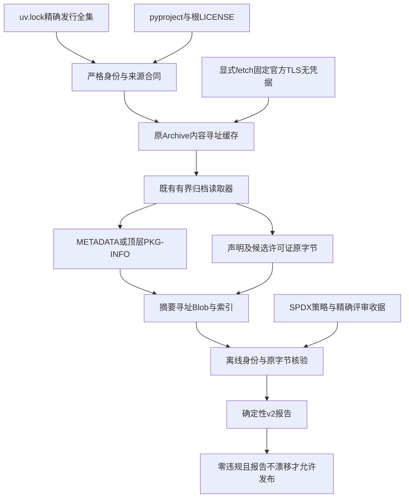
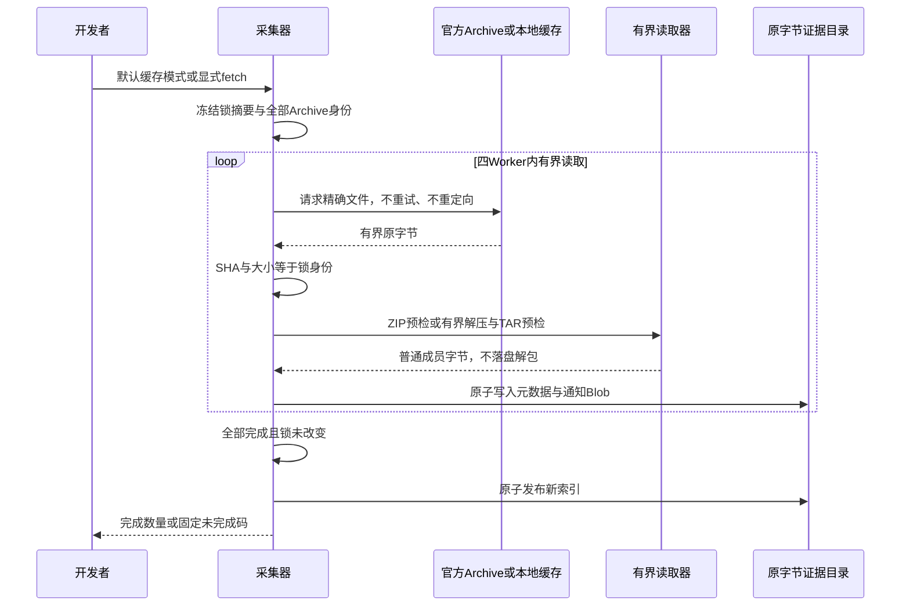
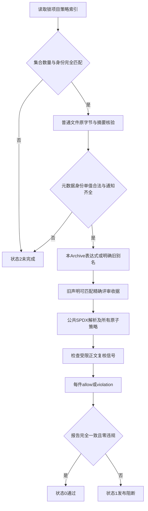

# 0.9.4b 锁定发行物许可证据与离线门禁详细设计

## 1. 需求背景与已确认缺陷

SEC-094-B3属于发行供应链控制，不是Coding Agent运行时权限，也不引入独立HTTP服务、数据库或后台调度。
原[`license_scan.py`](../../scripts/license_scan.py)丢弃锁定版本/来源，只以包名查当前解释器的安装元数据，
再用包名级`overrides`补全Windows条件包。缺失发行物、不同版本或不同平台的声明可能沿用同一许可结论。

三个负例在v1全部失败：`pytest`虚构版本`0.0.0`、`999.0.0`都被本机实际安装版本的MIT声明放行；
不存在来源证据的`evil-lib`也能通过名称级人工覆盖。源码安装与上游Archive身份没有建立验证关系。

### 1.1 设计目标

1. 第三方身份同时包含规范包名、锁定版本、Registry、Archive种类、精确URL、SHA-256和大小。
2. 检查锁中全部平台/Extra/开发依赖的**每一份发行Archive**，不能用一个sdist推定全部Wheel声明。
3. 保存实际METADATA/PKG-INFO及许可证/通知原字节，正常CI离线核对这些已评审证据。
4. SPDX语法由明确锁定的`packaging`解析；不再以字符串拆分或多Classifier猜测AND表达式。
5. 人工解释只适用于精确Archive、元数据和通知摘要，旧版本收据不能复用。
6. 缺件、畸形、读取失败、取消、预算超限和证据漂移均阻断；工具正确运行不等于依赖获准发布。

### 1.2 非目标与审计边界

- 当前库存是pre-build锁全集，不是实际安装集合、已发布Wheel内容清单或完整版权权属证明。
- `--check`验证已提交原字节、身份和收据，不重新下载1.16GB发行件；索引的Archive→成员关联仍依赖
  受评审采集器和Git提交可信度。独立复核必须重新运行采集器，不能仅凭索引哈希声称密码学证明成员来自归档。
- 原字节通知集合并不证明全部文件级许可、静态链接义务、商标、历史贡献或商业再授权义务已完成。
- 受限正文标题只是复核信号，不能自动推导`-only`/`-or-later`或将全部项目判定为某种许可证。
- 不执行上游构建脚本，不安装采集对象，不跟随TAR链接，不落盘解包，不接受任意Registry/下载主机。
- 项目AGPL/商业授权政策不因第三方元数据解析而改变；未知声明不以扩大白名单自动修复。

## 2. 源码研究、选型与取舍

研究基线：2026-09-27实际`uv.lock`，74个包（含根应用）、73个第三方组件、777个发行件，
声明总大小1,160,324,884字节，最大单件16,093,956字节。增加直接开发依赖`packaging>=26.3,<27`，
锁定仍为26.3，原第三方版本未升级；只增加根开发依赖关系，SBOM必须同步重生成。

| 第一方规范/源码 | 求证事实 | 实施决策 |
|---|---|---|
| [PyPA Core Metadata](https://packaging.python.org/en/latest/specifications/core-metadata/)（2.6） | Name/Version/Metadata-Version为必需字段，归档元数据不保证与相邻Wheel相同。 | 验证每个Archive的实际身份，不按项目名或一个代表件扩展结论。 |
| [PyPA License Expression](https://packaging.python.org/en/latest/specifications/license-expression/) | 声明是SPDX表达式，包含组合、例外及自定义引用。 | 使用公共`packaging.licenses`接口；未知原子和未审批WITH组合阻断。 |
| [Packaging许可证接口](https://packaging.pypa.io/en/stable/licenses.html) | 提供规范化与无效表达式异常。 | 不自建SPDX语法解析器；解析器本身进入锁、SBOM和许可证库存。 |
| [`secret_scan_archives.py`](../../scripts/secret_scan_archives.py) | 已有有界ZIP/TAR/压缩流预检、CRC与尾部检查。 | 复用既有读取器，不重复构建归档解析器，不降低Secret默认限制。 |
| 真实`referencing` sdist | CHANGELOG为无载荷符号链接，不属于目标许可证据。 | 许可证采集可以明确跳过TAR链接，但不解析目标；许可成员若是链接则视为缺失。 |
| 真实旧Wheel | Metadata 2.1的License-File既有dist-info根位置，也有licenses子目录。 | 2.4起严格使用licenses；旧版本只接受两个候选中恰好一处实际存在。 |

拒绝“增加报告version字段但继续读本机元数据”：只有报告身份改变，来源仍然错误。
拒绝“每包取一个Wheel并标记全部平台完成”：跨归档差异会再次漏审。
拒绝正常CI重新联网采集：网络、上游可用性及重复1GB下载会影响反馈时延；离线门禁与显式重采集分开。

## 3. 总体架构与模块边界



用户只运行Coding Agent时不会启动采集器。Make与CI显式调用许可证离线门禁；开发者仅在锁定输入变更时采集和评审。
原Archive保存在忽略的`build/license-archives/`；提交的原字节证据位于
[`governance/license-evidence-v2/index.json`](../../governance/license-evidence-v2/index.json)和同目录`blobs/`。

| 模块 | 唯一职责 | 关键源码接口 |
|---|---|---|
| [`license_contracts.py`](../../scripts/license_contracts.py) | 身份、普通文件读取、JSON及Blob合同。 | `LockedArchive`、`locked_inventory`、`read_blob`、`EvidenceBlobs`、`LicenseEvidenceError`。 |
| [`license_inventory.py`](../../scripts/license_inventory.py) | 从精确Archive采集原字节证据。 | `download_archive`、`archive_evidence`、`collect_inventory`、`write_atomic`。 |
| [`license_decisions.py`](../../scripts/license_decisions.py) | 解释本Archive元数据、SPDX与收据。 | `declared_notice_members`、`metadata_facts`、`validate_policy`、`decide`、`reviewed_expression`、`notice_signals`。 |
| [`license_scan.py`](../../scripts/license_scan.py) | 形成确定性报告和CLI失败门禁。 | `build_report`、`main`。 |
| [`secret_scan_archives.py`](../../scripts/secret_scan_archives.py) | 通用有界成员字节读取。 | TAR私有读取支持显式`skip_links=True`；Secret调用不传该参数，仍拒绝链接。 |

## 4. 核心流程、时序与数据流说明

### 4.1 采集时序



缓存存在时仍验证哈希和大小，损坏缓存不能当网络失败降级处理。任一失败后通知排队任务停止，
最多等待已经运行的有界请求收尾；不继续为后续排队件下载。未完成批次可以留下Blob/cache用于复验，
但不会发布新索引或覆盖旧完整索引。取消并非毫秒级硬抢占所有阻塞I/O，网络请求有20秒socket超时和60秒检查点。

### 4.2 离线决策流程



1. 锁清单只支持根editable与第三方官方PyPI来源；重复包名、缺少Archive、不受支持URL和超预算阻断。
2. 索引必须覆盖锁中全部发行件，URL/Hash/Size/Name/Version/Registry/Kind逐字段匹配，无缺件或重复摘要。
3. 原字节文件名仅从SHA生成，不使用成员名称拼接宿主路径；链接、读取异常和扫描期间变更失败关闭。
4. 单值字段重复、元数据名/版本不匹配、License与License-Expression冲突或License-File缺件均为未完成。
5. 优先实际License-Expression，其次完整明确旧字段/别名；不能取许可证正文第一行，不能把多个Classifier拼成AND。
6. SPDX规范化后，AND和OR都要求每个原子获准；WITH还需明确组合。当前保守策略不替用户选择OR分支。
7. 旧声明收据必须命中本Archive全身份及元数据/全部通知摘要；不能覆盖正式SPDX声明。过期或重复收据阻断。
8. 输出v2报告；完整检查但有违规仍返回1。`--check`只读，不自动生成报告或修复缺件。

### 4.3 核心伪代码

```text
collect:
  freeze(lock_bytes)
  validate(all_archive_identities)
  for each archive with at most 4 active workers:
    bytes = verified_cache OR explicit_fixed_origin_download
    require size/hash == locked_identity
    members = bounded_reader_without_extraction(bytes)
    require exactly one primary_metadata
    collect declared_license_files and candidate_notice_bytes
    write digest-addressed blobs atomically
  require all workers succeeded AND lock_bytes unchanged
  publish complete index atomically

report:
  require index identities == locked identities
  for each archive:
    verify metadata and notices from bounded shared blob store
    require metadata identity and declared notice paths valid
    expression = archive_declaration OR exact_archive_review
    result = SPDX_policy(expression)
    if restricted_notice_signal: result = violation
  require every review used exactly once
  bind root/project/lock/policy/index digests
  return complete report with violations; never substitute installed_metadata
```

## 5. 数据结构、字段与接口合同

### 5.1 LockedArchive与索引

| 字段 | 含义与约束 |
|---|---|
| `name`、`version` | 锁中的规范PEP 503包名及合法PEP 440版本；元数据按规范名/语义版本核对。 |
| `registry` | 当前仅支持`https://pypi.org/simple`，不能把另一来源的同名同版本视为同一许可证据。 |
| `kind` | `wheel`或`sdist`；平台变体以具体URL/SHA独立登记。 |
| `url` | 固定HTTPS `files.pythonhosted.org/packages/`，禁止认证信息、非标准端口、query、fragment和重定向。 |
| `sha256`、`size_bytes` | 原Archive原字节摘要和大小；不是安装后组件哈希。 |
| `metadata` | `member`、`sha256`、`size_bytes`三字段，绑定实际主元数据原字节。 |
| `notices` | 同样的Blob记录列表；包含License-File声明的任意名称，以及LICENSE/LICENCE/COPYING/NOTICE或licenses目录候选。 |
| `lock_sha256` | 整个锁原字节身份；开发关系改变也需要重采集索引，不能自动迁移。 |

Wheel仅接受顶层`*.dist-info/METADATA`；sdist仅接受一个顶层目录下的PKG-INFO。
vendored/egg-info附属元数据不能冒充主身份，目录、重复成员、稀疏或不支持形式不能借由跳过得到完整证据。
TAR普通成员可读取，无载荷链接可以在**许可证采集范围内**跳过，但声明许可文件若由链接提供会失败，
不会跟随`../`目标读取宿主内容。

### 5.2 策略与人工收据

[`license-policy-v2.json`](../../governance/license-policy-v2.json)包含明确SPDX原子allow/deny、WITH组合及reviews。
不再支持`self_packages`或`overrides`。根应用依据pyproject与锁editable身份及LICENSE摘要单独登记。

`reviews[]`包含`review_id`、`expression`、`basis`和`binding`。binding含完整七项Archive身份、
`metadata_sha256`及排序后的所有`notice_sha256`；任何版本、文件或来源改变都失配，不允许名称级继承。
colorama两个Archive各自的BSD三条款原字节复核形成两张收据，不给pywin32登记虚假的PSF覆盖。

### 5.3 接口设计、报告与错误分类

| 接口/状态 | 行为 |
|---|---|
| `collect_inventory(..., fetch=False)` | 默认只用内容寻址缓存；返回完整索引，失败不发布索引。 |
| `archive_evidence(body, archive)` | 校验原包身份后返回索引记录与去重原字节Blob；不执行或安装。 |
| `build_report(lock, policy, project_path=..., evidence_directory=...)` | 返回完整确定性v2报告；畸形/缺件抛固定`LicenseEvidenceError`。 |
| CLI `0` | 完整核对、报告未漂移、每件获准；只表示该策略和该库存范围。 |
| CLI `1` | 完整核对但许可违规，或`--check`报告缺失/漂移；生成模式有违规也返回1。 |
| CLI `2` | 缺件、未支持、无效身份、读取失败、超预算、取消或内部未完成；不能打印通过。 |

报告绑定锁、项目、规范化策略JSON、索引和根LICENSE摘要，记录Archive决策及通知复核信号。
`archive_reextraction_performed=false`和`legal_rights_or_notice_completeness_claimed=false`明确不能外推的范围。
公开诊断只输出固定错误码和数量，不输出URL、成员名、许可证原文、网络异常或私有路径。

## 6. 预算、失败、取消、恢复与安全持久化

- 锁最多512包、4096Archive、2GiB声明总下载量；单件32MiB。
- 每Archive复用归档解析限制：成员64MiB、膨胀256MiB、累计512MiB、中央目录8MiB、实际记录20000。
  这些是第三方采集预算，不修改Secret扫描16/8/64/256MiB默认合同。
- 单条证据1MiB、每件128条且最多8MiB；批次最多4096个不同Blob、64MiB。
- 四Worker，批次开始后600秒检查点阻止新工作；每请求20秒socket超时、60秒读取检查点；不自动重试。
- 锁、项目、索引和根LICENSE形成一次报告的固定输入组，结束前再次比较；跨文件编辑导致固定license_inputs_changed，不能把旧决策绑定到新哈希。
- 离线报告去重Blob共享4096项、64MiB和60秒预算；相同SHA的大小声明仍单独核对，不能缓存后绕过。
- 原子临时文件写入、flush/fsync和replace；索引最后发布。没有业务数据库Schema迁移或后台恢复任务。
- 输出只使用摘要文件名，拒绝输出目录链接/Windows reparse；不把Archive成员当路径或可执行资源。
- Git `.gitattributes`保存证据和v2报告原字节，Windows CRLF转换不得改变哈希；Blob禁止文本diff/merge，原始CRLF或RST分隔符不做格式清洗。该属性不是Secret扫描豁免，原字节仍全部检查。
- 正常CI不访问采集网络；受评审原字节证据不应被泛化为第三方所有法律权利的自动证明。

## 7. 验证方案、当前风险与发布条件

[`test_license_archive_evidence.py`](../../tests/governance/test_license_archive_evidence.py)覆盖三项v1负例、
完整离线确定性、本机安装/网络禁止、版本/来源/根身份/URL漂移、缺件/重复/Blob篡改、元数据冲突、
任意License-File名称、SPDX AND/OR/WITH/未知引用、收据过期/非法覆盖、限制正文信号、下载失败不重试、
归档链接边界、批次失败保留旧索引、共享预算、取消及只读CLI。已有Secret归档回归继续保留。

实际采集777件均核对锁定SHA与大小；随后从完整本地缓存独立重新读取并生成同一索引，
不将第一次失败残留Blob算作完成。采集对象总量与执行过程不代表项目部署规模或商业可用性。

### 7.1 当前真实发布阻断

MCP的Windows条件依赖引入`pywin32 312`。其12个Wheel实际包含`adodbapi/license.txt`，
原字节SHA为`5ea2f23c7f00c3006bacf267183e816d8d4b6dc95ea57a4ddb0ff81de6d8719e`，
正文包含GNU LESSER GENERAL PUBLIC LICENSE及Version 2.1。元数据仅写`PSF`不足以覆盖附属许可。
当前拒绝策略保持不变，12件均为`license_notice_review_required`，不得生成零违规结论。

经锁SHA核验的MCP 2.2.0 Wheel包含`mcp/os/win32/utilities.py`，
模块SHA为`98e87c776a14cf326e63f8da007119156d3ad643ae7fbf27e9b6e6ef1dc534bf`。
其Windows标准句柄重定向及进程Job Object创建/归属/终止真实调用win32api、win32con和win32job。
不能仅从锁文件删除pywin32而声称保留相同Windows进程树契约，也不得取消Windows支持来绕过许可审查。

后续必须完成依赖替换可行性评估，或精确发行物例外与实际分发义务评审；未经决策不得改变拒绝策略。
扫描器测试通过但`make supply-chain`/CI许可发布步骤失败是正确的失败关闭，不把失败改成continue-on-error。
历史v1报告保留仅作旧证据，不能作为发布输入。0.9.4b、0.9.4及0.9仍未完成。

### 7.2 部署、兼容、回退与复核

```bash
uv sync --locked --all-extras --dev
uv run python scripts/license_inventory.py --fetch
uv run python scripts/license_inventory.py
uv run python scripts/license_scan.py
uv run python scripts/license_scan.py --check
uv run pytest tests/governance/test_license_archive_evidence.py tests/governance/test_secret_scan.py
```

前两条采集命令分别是显式联网与缓存独立重采集；后两条报告命令在当前pywin32策略下必须返回1。
v1 JSON仅保留历史证据，默认CLI切到v2；CI无需凭据或1GB原包缓存。回退扫描器不能撤销已发现的许可阻断。
正常代码开发无需每次重采集；锁变更需同步索引、收据、v2报告、SBOM、第三方通知和证据记录。
Docker镜像/安装链不可变输入、权利链独立核查、0.9.4a剩余公开边界、编号攻击套件和远端MCP仍为独立门禁。
