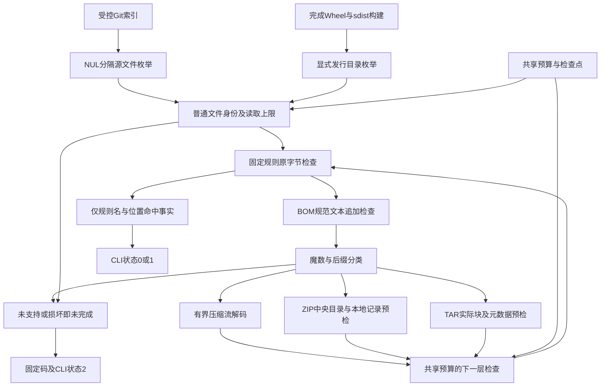
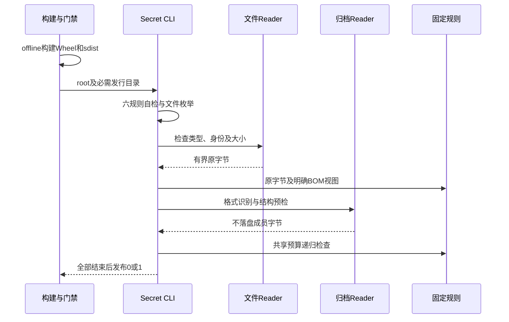
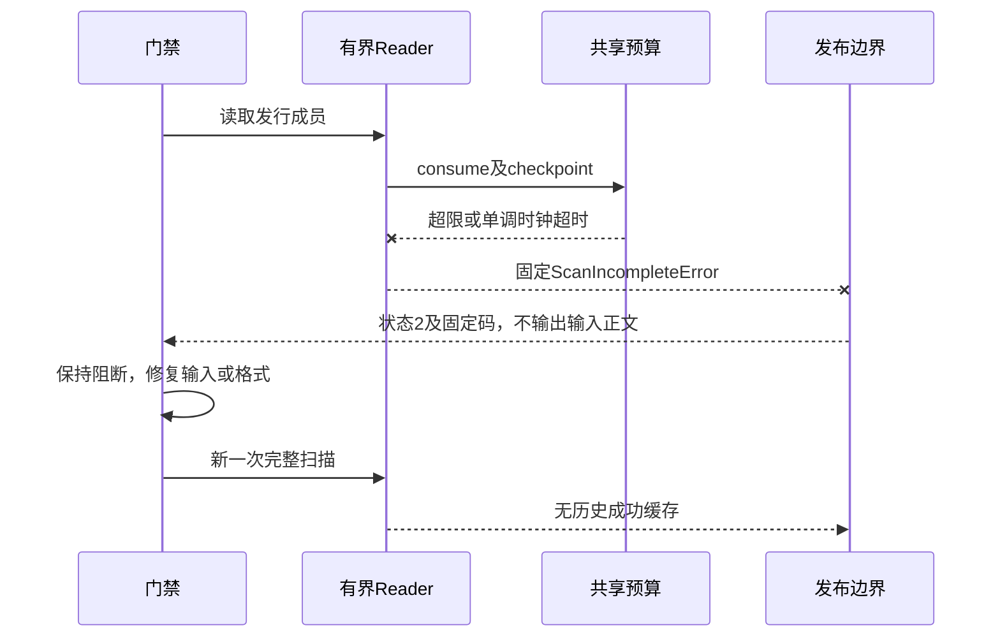

# 0.9.4b 仓库与发行物有界Secret扫描详细设计

## 1. 需求背景、原行为与源码证据

Secret扫描是发行门禁，不是Coding Agent执行工具。它检查公开仓库和打包产物，防止开发配置、测试夹具、
生成文件中的固定敏感模式进入发布内容。它不接管运行时Secret Provider、模型Context脱敏或Action审批。
现有入口为[`secret_scan.py`](../../scripts/secret_scan.py)，上游由[Makefile](../../Makefile)
和[CI](../../.github/workflows/ci.yml)装配。SEC-094-B2登记在[安全与供应链总体设计](m09-4-security-and-supply-chain.md)。

v1存在四个已用内存合成值确认的缺陷：

| 原路径 | 漏扫根因 | 用户或发布风险 | v2验收 |
|---|---|---|---|
| `.env.example` | 整个后缀文件直接continue。 | 示例配置被误填真实值后仍放行。 | 无整文件豁免；合法环境引用自然不命中固定规则。 |
| 包含NUL的文件 | 前4096字节有NUL即continue。 | 字节资产中的明文或BOM文本永不检查。 | 原字节必查；明确UTF-16/32 BOM追加规范UTF-8视图。 |
| 压缩Wheel成员 | 只对压缩包原始字节运行正则，不读取成员。 | 配置内容压缩后不出现原文字节。 | 支持的成员完整、有界读取及递归检查。 |
| 缺失/不可读/链接输入 | 异常或不支持类型被忽略，空列表与成功覆盖混用。 | 未覆盖的范围被标成零命中。 | 固定`ScanIncompleteError`、CLI状态2，不能打印通过。 |

新增回归的四项在v1均失败，不以已有仓库的零命中当作这些缺陷的反证。

## 2. 设计目标、非目标与取舍

### 2.1 设计目标

1. 固定六条规则不变，覆盖语义升级为`harnessix.secret-scan/v2`；每条规则单独正反例自检。
2. 没有缺失、不可读、异常跳过、未支持归档或预算超限时，才返回完整扫描结果。
3. 不把归档成员写入宿主文件系统，不跟随链接，不执行解包成员或加载代码。
4. 对文件、成员、中央目录、TAR元数据、递归、累计字节、命中及时间设置预算；内部异常正文不进入CLI。
5. Make与三平台CI构建真实Wheel和sdist后检查显式发行目录，不能以没有dist的源码检查看作发行验收。
6. module/script两种启动方式保留，中文stdout/stderr统一UTF-8，命中、未完成具有不同非零状态。

### 2.2 非目标和边界

- 不是通用凭据识别器，不判断凭据有效性，不扫描Git历史、提交说明或索引文件名中的凭据。
- 六条规则不能证明所有Secret都不存在；未带BOM的UTF-16、Base64/自定义混淆、嵌入可执行文件的任意容器不在解码合同内。
- 不实现ZIP64、多卷、加密、未知ZIP算法、RAR/7z/Zstandard/Brotli；检测到这些形式即阻断，而非忽略。
- 不给扫描器增加HTTP服务、任务数据库、插件、用户可扩大上限的CLI配置或运行时Secret权限。
- 扫描要求输入在构建完成后保持静止；并非对同权限恶意宿主实施完整文件系统快照隔离。
- 构建后端的精确版本与来源绑定仍属供应链剩余门禁；`--offline`不等于锁定所有构建依赖，也不证明发行可重复构建。

### 2.3 源码研究与方案选择

| 来源 | 求证事实 | 设计决策 |
|---|---|---|
| [PKWARE APPNOTE](https://pkware.cachefly.net/webdocs/casestudies/APPNOTE.TXT) 4.3/4.4 | ZIP以EOCD登记中央目录位置/尺寸/数量，本地记录、中央记录及可选描述符有独立布局。 | 先验证实际中央目录和本地记录覆盖，再交标准库创建ZipInfo；不只相信声明count。 |
| [Python 3.12 zipfile](https://docs.python.org/3.12/library/zipfile.html) | 标准库持有成员元数据并提供CRC字段；解析中央目录发生在对象创建阶段。 | 中央目录最多2MiB、4096项的预检在ZipFile之前执行。 |
| [Python 3.12 tarfile](https://docs.python.org/3.12/library/tarfile.html) | 支持流式块读取和PAX/GNU元数据；从属成员可通过extractfile获得字节。 | 先限制膨胀和实际TAR头/元数据，再用`r|`读取，不调用extract/extractall。 |
| [Python zlib](https://docs.python.org/3.12/library/zlib.html)、[bz2](https://docs.python.org/3.12/library/bz2.html)、[lzma](https://docs.python.org/3.12/library/lzma.html) | 解压器提供max_length及eof/unused_data；LZMA可限制字典内存。 | 先控制输出，拒绝截断、多段流和隐藏尾部；XZ字典额外限制64MiB。 |
| v1实际调用者 | [`test_supply_chain`](../../tests/governance/test_supply_chain.py)依赖`scan_paths`列表输出。 | 保留成功列表格式；失败新增固定异常，删除历史continue放行。 |

不采用落盘解包再rglob：扩大链接/路径穿越和文件污染风险；不采用仅增加`.whl`后缀判断：改名归档仍漏扫；
不采用ZipFile之后才检查count：攻击输入已经驱动对象分配。严格受支持子集使失败语义可审查，不能把不支持伪装成干净。

## 3. 总体架构、模块边界与数据流程



职责分为三部分，而非新增执行框架：

- [`secret_scan.py`](../../scripts/secret_scan.py)：索引/目录发现、文件读取、规则、文本视图、递归及CLI发布。
- [`secret_scan_archives.py`](../../scripts/secret_scan_archives.py)：支持归档的结构预检、完整解码、成员字节Reader。
- [`secret_scan_contracts.py`](../../scripts/secret_scan_contracts.py)：固定预算、共享计数、固定未完成异常。

每个文件先扫原字节；归档元数据/填充区中的明文同样在该视图检查。归档成员只携带名字用于格式分类，
诊断位置使用成员序号，不把原成员名拼成宿主路径或输出到控制台。压缩TAR的展开整体先检查，再读取常规成员；
同一明文在不同视图可能多次命中，因此命中数是检查视图事件数，不是独立凭据数。

## 4. 接口设计、领域契约与数据结构

### 4.1 公开脚本和Reader接口

| 符号 | 输入 | 输出/失败 | 职责 |
|---|---|---|---|
| `main(argv)` | `--root`、可选`--artifact-dir`、`--self-check` | 状态0/1/2；固定中文诊断 | 默认dist缺失可做源码检查；显式目录缺失/为空不能放行。 |
| `scan_paths(paths, limits=None)` | 实际Path序列；内部测试可收紧预算 | 成功返回`list[dict[str, object]]`；未覆盖抛`ScanIncompleteError` | 完整覆盖后才允许返回结果。 |
| `archive_kind(body, name)` | 有界字节和格式提示 | zip/tar/gz/bz2/xz/None；未支持失败 | 魔数补改名检测；后缀补损坏检测。 |
| `archive_members(body, name, kind, budget)` | 当前归档和同一次Budget | 逐项`(member_name, bytes)` | 不写文件；异常映射固定码。 |
| `ScanBudget.consume/entry/hit/checkpoint` | 数量/字节/检查时刻 | 更新计数或阻断 | 嵌套层不能重置上限。 |

`ScanIncompleteError.code`只由脚本内部固定分支产生，不引入运行时KernelError或Action失败语义。
`scan_paths`成功结果仍有`rule/path/line`，现有源码调用者兼容；其`path`是内部文件位置加成员序号。
CLI不输出该原值，而输出位置串SHA-256的前16位。外部使用者不得自行将内部结果作为公开日志。

### 4.2 预算字段与精确口径

| ScanLimits字段 | 默认值 | 检查点与解释 |
|---|---|---|
| `file_bytes` | 16MiB | stat及读取limit+1，限制单个物理文件。 |
| `member_bytes` | 8MiB | ZIP/TAR声明和实际结果双检；TAR元数据单项另限64KiB。 |
| `expanded_bytes` | 64MiB | 单次gz/bz2/xz展开cap；输出limit+1用于检测溢出。 |
| `total_bytes` | 256MiB | 物理输入、规范文本、展开流、读取成员累计，视图重复计入，非唯一字节。 |
| `central_directory_bytes` | 2MiB | ZipFile构造前的实际中央目录上限。 |
| `entries` | 10000 | 物理文件和递归成员累计；元目录发现亦有限制。 |
| `archive_entries` | 4096 | 单归档中央记录/TAR头实际计数；TAR扩展元数据也计数。 |
| `archive_depth` | 3 | 根为depth=0；zip→gz→tar允许三层，第四个归档阻断。 |
| `findings` | 1000 | 超限即未完成；CLI最多显示20条安全位置，不截断后宣称通过。 |
| `seconds` | 60秒 | 单调时钟检查点；不是可中断任意系统调用的硬实时保证。 |

`ScanBudget.started`记录单调起点，`bytes_read/files/members/hits`只驻留当前进程。LZMA的64MiB字典上限
独立于字节输出上限。标准库临时对象、Git枚举stdout和文本规范化分配不等于这些计数，不能把预算数字宣称为
整个进程的严格RSS上限。Git子进程另有30秒timeout；CI的构建和扫描步骤各有两分钟硬兜底。

### 4.3 退出状态、错误分类和兼容变化

| 状态 | 条件 | 发布结论 |
|---|---|---|
| 0 | 六规则健康且全部声明输入完成；零命中 | 仅固定规则和此次输入范围通过。 |
| 1 | 全部完成且有命中 | 阻断；仅规则名、位置哈希和行号输出。 |
| 2 | 自检不完整、取消/超时、IO/格式/预算失败 | 阻断；覆盖结论无效，不能当零命中。 |

主要固定码：`scan_input_unreadable/input_unsupported/input_changed`、`scan_discovery_failed`、
`scan_artifact_missing`、`scan_archive_invalid/archive_unsupported/archive_entry_unsupported`、
`scan_file_limit/member_limit/byte_limit/entry_limit/archive_limit/archive_depth_limit/finding_limit`、
`scan_text_encoding_invalid`、`scan_timeout`、`scan_cancelled`，前缀均为`scan_`。
兼容变化是故意的：过去skip的输入现在阻断；规则自检失败由状态1改为状态2；受支持压缩形式受到严格合同约束。

## 5. 正常流程与时序



文件Reader检查Path及父链链接、Windows reparse属性、普通文件模式、大小及inode/dev身份。
POSIX读取使用可用的NOFOLLOW/NONBLOCK标记，Windows保留二进制模式；读取前后及路径当前身份/长度/mtime不一致
均阻断。该检查防止常规构建并发变化和常见链接竞态，不宣称等同于不可变文件系统快照。

## 6. 归档校验流程与核心伪代码

### 6.1 ZIP结构和完整压缩流

1. 在有限尾部范围定位EOCD；检查单卷、非ZIP64、中央尺寸、数量、注释和末端精确位置。
2. 遍历实际中央记录，先限制实际数量；固定支持Stored/Deflate，拒绝加密/未知算法/超限声明。
3. 将中央引用按本地offset排序，必须从0连续覆盖到中央目录；本地头、数据描述符和声明长度一致。
4. 所有预算预检通过后才创建ZipFile获取受支持成员元数据；拒绝链接、特殊类型、路径穿越或绝对路径声明。
5. 校验本地名字与中央名字一致，Stored读取完整数据，Deflate以max_length有界解码；必须eof且无unused_data。
6. 实际长度、CRC匹配后才提交成员字节；不能在合法Deflate流后藏另一份压缩载荷，也不能有未引用的本地成员。

### 6.2 TAR及压缩流

gz/bz2/xz先有界展开；截断、多段压缩流和未消费尾部失败，不只读取第一段。展开字节继续原规则检查，
再按格式提示/魔数识别TAR。TAR预检逐512字节头读取实际记录数量及八进制长度，仅允许常规文件、目录、
PAX局部/全局与GNU longname；元数据64KiB上限，拒绝链接/稀疏/设备/base-256长度与非零隐藏尾部。
两块零终止及剩余填充必须完整。随后`r|`解析并验证实际成员类型/大小/名字，`extractfile`只提供内存字节。

### 6.3 主要控制逻辑

```text
main:
    configure_utf8_console()
    validate_each_rule_positive_and_negative()
    paths = deduplicate(git_ls_files_nul() + discover_artifacts(required_if_explicit))
    try:
        findings = scan_paths(paths)
    on incomplete_or_cancel:
        publish_only_fixed_code(status=2)
        stop
    publish_zero_or_hashed_findings(status=0_or_1)

scan_body(body, hint, depth, shared_budget):
    check_rules(body)
    if explicit_bom:
        check_rules(strict_normalize(body))
    kind = classify_magic_and_suffix(body, hint)
    if archive:
        enforce_depth_and_structure_before_unbounded_metadata_parser()
        for name, member_bytes in bounded_members(kind):
            consume_shared_budget()
            scan_body(member_bytes, name, depth+1, shared_budget)
```

## 7. 失败、取消、超时与恢复时序



KeyboardInterrupt在扫描API与CLI发现阶段映射`scan_cancelled`，不返回部分结果；预算超时同理。
异常包含原始文件名或正文时，IO/归档边界通过`from None`切断公开异常文本传播，不渲染原error字符串。
修复后必须全范围重跑，不从已完成成员继续推断整个包干净。标准库调用或IO卡住仍需CI硬期限终止；
本设计没有创建能抢占任意同步系统调用的后台调度器。

## 8. 持久化、事务、并发与数据流程边界

本脚本无业务数据库、无Session/Effect Journal迁移，不产生Action或改变执行审批。命中与预算事实只在内存驻留；
只有完整覆盖后发布结论，未完成状态没有“干净”提交点。不落盘解包，无幂等写入或UNKNOWN副作用问题。
发行构建由上游写专用目录，扫描必须在构建完成后启动；不得对正在写入的包跑并行门禁。
历史验证报告是外部白名单投影，只保存版本、哈希、范围、统计和状态，不保存合成凭据内容或原始stderr。

## 9. 安全、隐私与可观测性

- 无整文件豁免、无测试目录豁免，无凭据验证网络请求。
- CLI只显示固定规则名、位置哈希和行号；原路径、原成员名、命中字节及库异常正文均不发布。
- `line`是当前原字节/规范文本/展开视图的换行序号，不保证等于宿主编辑器行号；成员序号供本地内部结果定位。
- 位置哈希是诊断标识而非匿名化安全证明；它含可能的本地路径，不作为跨环境业务身份或公开遥测标签。
- 不注册Agent OTel Span、不把扫描内容塞进运行时Trace；CI保留状态、规则版本、范围和退出码即可。
- 不支持格式、错误和预算上限必须可见且阻断，不能为了扫描通过而跳过文件或扩大默认上限。

## 10. 源码与测试映射、阅读顺序

| 阅读顺序/设计点 | 源码与符号 | 测试与具体断言 |
|---|---|---|
| 1. 门禁装配 | [Makefile](../../Makefile)、[CI](../../.github/workflows/ci.yml) | `test_gate_builds_real_artifacts_before_scanning`验证顺序及硬timeout。 |
| 2. 固定合同 | [contracts](../../scripts/secret_scan_contracts.py) `ScanLimits/ScanBudget/ScanIncompleteError` | 固定预算、递归预算和超时负例。 |
| 3. 发现及文件 | [scan](../../scripts/secret_scan.py) `_tracked_files/_artifact_files/_read_file` | 换行/中文名、缺失、不可读、链接/FIFO、变更、空显式目录。 |
| 4. 规则和BOM | [scan](../../scripts/secret_scan.py) `RULES/_scan_rules/_self_check` | 四类旧漏扫、四种BOM、逐条规则关闭自检必须失败。 |
| 5. ZIP预检 | [archives](../../scripts/secret_scan_archives.py) `_preflight_zip/_validate_zip_local_records` | count伪造、ZipFile前上限、ZIP64/加密/多卷/未知算法、孤立成员。 |
| 6. ZIP数据 | [archives](../../scripts/secret_scan_archives.py) `_zip_member_data` | CRC、名字不一致、数据描述符、压缩流隐藏尾部。 |
| 7. TAR及压缩 | [archives](../../scripts/secret_scan_archives.py) `_decompress/_preflight_tar/_tar_members` | 三算法膨胀/截断/多段、链接、路径声明、成员及元数据上限、隐藏尾部。 |
| 8. 发布和取消 | [scan](../../scripts/secret_scan.py) `scan_paths/main` | 真实module/script子进程、cp1252环境、退出1/2、无路径及正文、取消。 |

全部新增测试在[`test_secret_scan.py`](../../tests/governance/test_secret_scan.py)，既有成功列表兼容回归在
[`test_supply_chain.py`](../../tests/governance/test_supply_chain.py)，通用UTF-8流回归在
[`test_cli_console.py`](../../tests/governance/test_cli_console.py)。Windows禁止换行文件名和无POSIX FIFO的边界
明确跳过对应POSIX用例，创建符号链接需平台权限；不得跳过其余合同、压缩或中文管道用例。

## 11. 实施切片、测试验证与验收

1. 用v1复现四项漏扫，留下失败数量，不保存合成值内容。
2. 固定预算和归档Reader替换静默跳过；保持规则语义和现有成功列表，补失败分类与中文注释。
3. 合成包矩阵覆盖正常、损坏、恶意布局、资源预算、取消/超时、文件变更和CLI。
4. 三平台构建正式Wheel/sdist后扫描；本地另从提交的干净归档构建，记录实际SHA-256及成员数。
5. Ruff、现行治理、合同、可读性、相关测试、完整已跟踪回归和Mermaid渲染验证，保存白名单证据与Manifest。
6. CI后台终态按准确headSHA记录，不将前一批成功作为本候选的成功。

通过本切片不能关闭许可证版本/来源、不可变安装输入、完整攻击套件或远端MCP门禁，更不能标记0.9.4/0.9完成。

## 12. 部署、兼容、发布与回退

调用方式：

```bash
uv sync --locked --all-extras --dev
uv run python scripts/secret_scan.py --self-check
uv build --offline --out-dir dist/secret-gate
uv run python scripts/secret_scan.py --artifact-dir dist/secret-gate
make supply-chain
```

脚本仅依赖标准库，Python 3.12/3.13合同保持。离线构建要求uv sync已成功建立可用构建缓存；缺失缓存使构建失败，
不自动改成跳过发行物或在线下载后假装来源绑定。标准CLI不修改仓库/发行目录；产物由build命令写入。
回退是Git恢复脚本、Make和CI同一切片，不涉及数据迁移；回退至v1只可诊断，发行必须阻断，不恢复已知漏扫放行。

## 13. 风险、限制与剩余工作

扫描结果只覆盖六固定规则及所声明输入，输出上限不是整个进程RSS；同步IO需要外部硬timeout。
过度复杂或不支持的归档宁可失败；正常发行构建若出现这类格式，应先审查并增加正式合同及负例，而非新增路径豁免。
构建后端锁定、许可证来源版本证据、发行安装、Beta场景和完整威胁模型矩阵仍独立开放。
历史修复的[六作业CI](https://github.com/carrie1988/Harnessix/actions/runs/36286571536)属于`0601ede`，
只证实上一批Windows编码/合同导入与治理证据，不证明本扫描器已通过当前三平台CI。

## 14. 实现偏差与最终结论

与v1成功接口相容，失败行为按固定未完成合同收紧。新增归档预检没有单独服务或业务持久化；TAR仅支持受审查子集，
完整压缩流检查额外阻断了标准Reader可能忽略的隐藏尾部。当前为实现候选；准确源码版本、干净归档发行哈希、
测试统计及CI终态在后续独立证据包固定，未完成验收不得追认通过。

实现版本`ad2f8e2`的87专项、3996 passed/32 skipped及精确提交干净源码发行物已经完成本地验证；
[独立冻结报告](../validation/secret-scan-2026-09-27-v1/README.md)保留包哈希、原字节清单和当前CI未验收边界。
