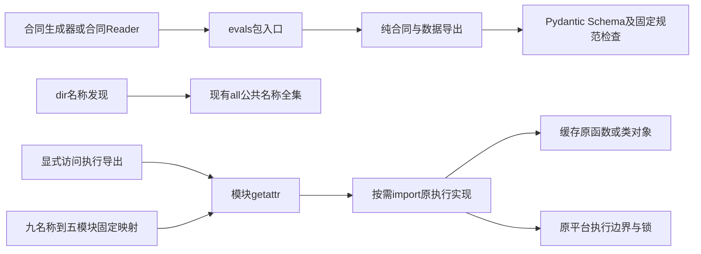
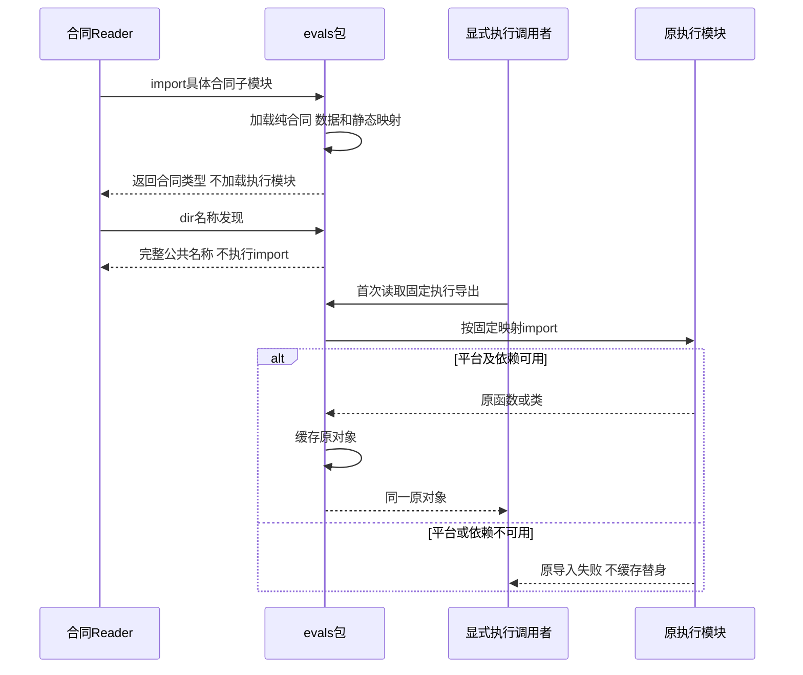

# 0.9.4b 平台无关合同与POSIX执行导入边界详细设计

## 1. 需求背景与实际失败

Revision `a5fd57e`的[CI 36285345506](https://github.com/carrie1988/Harnessix/actions/runs/36285345506)
Windows治理测试为2 failed、572 passed、45 skipped。原中文管道编码五个失败已消失；两个新失败来自
合同生成器的module/script启动方式。导入链为：

`generate_specs → evals.campaign_contracts → evals.__init__ → campaign_execution → runner
→ patches.agent_bridge → patches.managed → fcntl`。

[`evals.__init__`](../../src/harnessix/evals/__init__.py)还直接导入
[`evals.delivery`](../../src/harnessix/evals/delivery.py)，同样持有POSIX锁。
合同本身不需要锁、进程、Workspace写入或Provider请求，却被包级公共导出的立即加载污染。
这是源码层已登记的平台缺口，不是已修复UTF-8流边界的回归。

## 2. 设计目标、源码研究与取舍

### 2.1 目标和非目标

平台无关的Eval合同、公共名称发现、合同生成器help/check均不得加载平台执行模块。
保留现有公共导出名称、原函数/类对象及静态类型，不创建第二套Eval实现。
POSIX执行入口只在明确访问时加载原实现；错误不被吞掉，不生成成功替身。

本切片不实现Windows历史Eval运行、Delivery锁/ACL/事务、Git物化或Process全链，也不扩大产品能力广告。
不通过跳过Windows合同/CLI用例、注入假fcntl、删除Pydantic合同或关闭规范漂移检查获得绿灯。

### 2.2 求证与决策

| 来源 | 已确认事实 | 决策 |
|---|---|---|
| [`generate_specs.py`](../../scripts/generate_specs.py) | 所需的是campaign/delivery等Pydantic合同，不是历史Runner或专用文件交付执行器。 | 生成器的合同全集与规范字节不变，在包入口修复污染源。 |
| [`evals.__init__`](../../src/harnessix/evals/__init__.py) | 五组立即导入牵引九个执行相关公共导出；Python导入子模块也先运行包初始化。 | 只延迟这九个导出，其他现有纯数据入口保持原行为。 |
| [`campaign_execution`](../../src/harnessix/evals/campaign_execution.py)、[`runner`](../../src/harnessix/evals/runner.py)、[`delivery`](../../src/harnessix/evals/delivery.py) | 持有实际POSIX执行依赖，Windows目前不具备等价Owner实现。 | 原实现和平台约束保留，不捕获ImportError后假装支持。 |
| [PEP 562](https://peps.python.org/pep-0562/) | 模块缺失属性可通过__getattr__按需加载；__dir__可维护名称发现；返回原对象可保留身份。 | 使用标准模块属性机制，不替换sys.modules或定义万能代理。 |
| [`test_contract_import_boundary.py`](../../tests/governance/test_contract_import_boundary.py) | 新进程在导入六个已知执行模块时直接失败，旧合同导入立即触发该负例。 | 三平台都执行合同/help/check负例，不能依赖POSIX本机恰好存在fcntl。 |

没有采用给fcntl导入加try/except并设置None：该方式把平台差异推迟到锁调用时才暴露，无法保证执行失败关闭。
没有把全部公共导出改成动态插件系统：只处理已求证的五组依赖，影响边界保持有限。

## 3. 总体架构与数据流程



合同路径在包初始化后直接读取Pydantic类型，不访问九个延迟执行属性；名称发现只合并已有globals和
__all__，不触发import。显式执行属性访问按固定表加载原模块，成功才缓存同一对象。
TYPE_CHECKING路径仅服务静态分析，不成为运行时导入；Mypy仍能读取原函数签名和类。

## 4. 接口设计、数据结构与重点字段

| 接口/字段 | 职责与约束 |
|---|---|
| `_LAZY_EXECUTION_EXPORTS` | 源码固定九个公共名称到原模块路径的映射；不是用户配置，不接受动态插件条目。 |
| `__getattr__(name: str) -> object` | 正常属性查找缺失时选择固定模块，import后取同名原对象，成功才写globals；未知名抛AttributeError。 |
| `__dir__() -> list[str]` | 排序合并globals与既有__all__，不加载执行依赖，保留公共名称发现。 |
| `__all__` | 公共导出名称不变；不将契约Generator需要的类型删出以规避平台失败。 |
| `TYPE_CHECKING` | 保留九个真实静态导入和类型签名；运行时为false，不触发平台模块。 |
| 缓存对象 | 原函数或原类，不是包装器、Stub或替代实现；后续属性访问直接命中同一对象。 |

### 4.1 延迟导出表

| 原模块 | 名称 | 实际平台边界 |
|---|---|---|
| campaign_execution | run_coding_eval_campaign | 原历史Campaign及Runner约束。 |
| delivery | CodingEvalDeliveryStore、build_coding_eval_change_package、read_coding_eval_change_package、write_coding_eval_change_package | 原单文件交付、权限与POSIX锁约束。 |
| provider_suite_execution | run_task_pack_provider_suite | 原真实Provider Suite预算与执行能力约束。 |
| runner | HistoricalCodingEvalResult、run_historical_coding_eval | 原历史Coding Eval及Process约束。 |
| suite_execution | run_coding_eval_suite | 原Suite恢复、固定执行环境和Owner约束。 |

## 5. 核心流程、时序与伪代码



```text
包初始化:
    导入既有纯合同与数据入口
    静态类型分支不在运行时执行
    保存原all及九个固定延迟名称

getattr(name):
    不在固定表则AttributeError
    import原模块；失败直接传播
    取得同名原函数或类
    成功后缓存到globals并返回

dir():
    return 排序(globals名称 与 原all名称的并集)
```

## 6. 持久化、失败、取消、超时与恢复

无数据库/Session/Execution Plan/Artifact Schema变更，不启动Eval，不取凭据，不调用Provider、不创建进程或锁。
导入机制不是新的执行Owner，取消、超时、预算和恢复仍由原执行器处理。
合同/help/check测试的子进程有60秒外部期限；生成器检查仍只读，取消或失败不能写回规范以掩盖漂移。

依赖缺失或平台不支持时原异常传播，缓存仅在成功后写入，不存在失败缓存、自动重试或假成功。
未创建持久状态，无迁移、回滚数据库或恢复任务；代码回退会恢复原导入污染，因此不能作为Windows兼容修复的替代。

## 7. 错误分类、可观测性与安全边界

未知公共名称按Python属性合同产生AttributeError；显式加载原实现的导入失败仍是构建/应用装配故障，
不转换为产品成功结果。治理命令的成功/漂移退出码、中文UTF-8输出和规范全集不变。

名称与模块映射由源码固定，不从用户字段推导import路径；不加载模型指定模块。
合同导入不读取执行凭据，公开名称列表不证明对应平台具备执行能力。
`from harnessix.evals import *`或枚举后逐个getattr仍可显式加载全部执行导出；这不属于平台无关合同读取路径。
宿主需要只读取合同应直接导入对应合同子模块，而不是请求全部执行对象。

## 8. 测试验证、源码映射与证据

| 用例/门禁 | 检查内容和证据边界 |
|---|---|
| 三个新进程负例 | 合同导入及公共dir、Generator help、Generator check；加载六个执行模块即失败，旧实现已复现失败。三平台均运行，不因Windows跳过。 |
| POSIX导出对象身份 | 九个名称逐个核对原模块同名对象、重复访问身份和未知名称拒绝；仅原执行实现支持的平台运行，Windows明确不作为执行能力证明。 |
| 十个CLI启动正例及两个流边界测试 | 沿用cp1252强制环境，module/direct-script均需启动成功；未取消Windows的合同生成器启动检查。 |
| 原Eval回归 | 对原Campaign/Suite/Provider/Delivery调用行为、报告和恢复进行回归，不只检查导入不报错。 |
| 原规范漂移回归 | 生成器check、历史规范保留、缺失/变化检测；规范字节必须保持不变。 |
| Ruff/Mypy/Readability/文档门禁 | 维持类型与源码说明，同步结构统计而不降低原阈值。 |

Revision 21b5eb1的16条导入/控制台专项、214条Eval及相关专项、107条治理/计划错误回归在POSIX本机通过；这些组有重叠，不累计为不重复总数。修复版真实Windows CI终态另行登记。
缺少POSIX模块的子进程负例不是Windows实际系统测试，两种证据不能互相冒充。

## 9. 部署、兼容与风险

Python版本与依赖不变；无新增库、服务、配置或网络请求。包级函数/类身份及静态导出保持不变，
模块字典在首次访问执行名称前不包含该对象，这是有意的导入边界变化；公共dir仍返回完整名称。
原Windows执行链缺失的ACL、Lock、Path、Process和Git能力继续列为0.9.6门禁，不因为合同可导入而取消。

本切片只处理已求证的Eval包污染源，其他包的导入副作用需单独研究；不把一个Generator启动成功
推广为全产品或任意插件的Windows支持。只有完整相关回归、文档同步和修复版CI通过才可关闭专项。

## 10. 变更记录

| 文档版本 | 代码基线 | 日期 | 变更 |
|---|---|---|---|
| 1 | `a5fd57e` | 2026-09-27 | 登记真实Windows导入失败，隔离九个Eval执行导出，保留公共名称/原对象/类型；建立合同与执行的独立负例和兼容测试。 |
| 2 | `21b5eb1d57055f32ba2178c165b3ad46060ee7c7` | 2026-09-27 | 固定候选实现及本地专项结果，保留Windows执行缺口和提交后CI门禁 |
