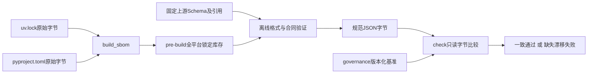
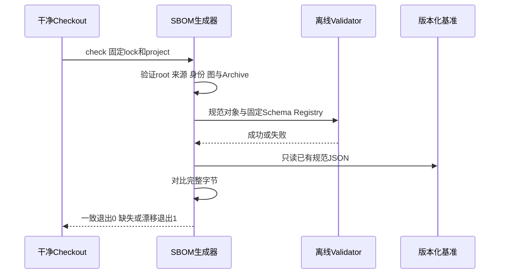
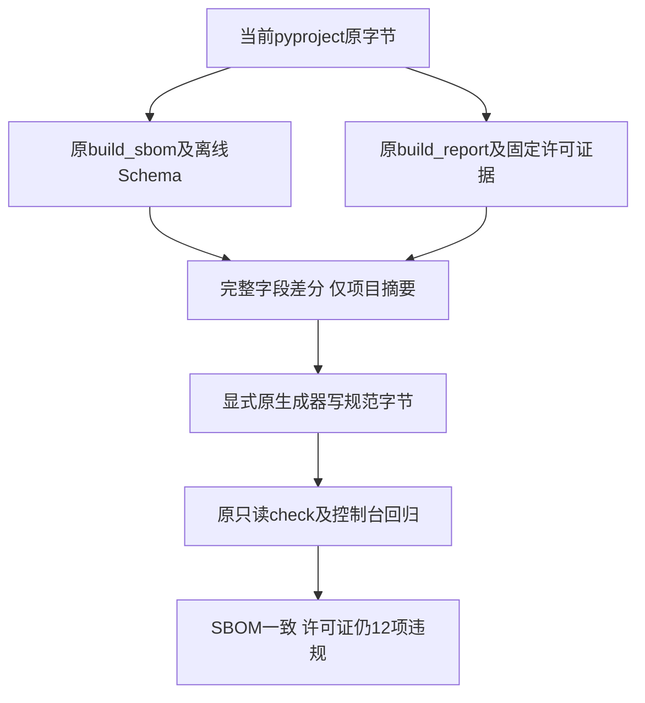

# 0.9.4b 可复现SBOM、来源固定与干净检出门禁详细设计

## 1. 需求背景、设计目标与非目标

Revision `880c3065482c00d4b0761c739c3ff94f7a7d00cb`的[CI 36129964234](https://github.com/carrie1988/Harnessix/actions/runs/36129964234)
在Linux、macOS、Windows及文档作业共同失败：许可证审查文档链接到被`.gitignore`排除的`dist/sbom.cyclonedx.json`，
干净Checkout没有该文件；后续`--check`也依赖本机已生成产物。源码检查同时发现格式不符合所声明的规范：
`serialNumber=urn:harnessix:sbom:uv-lock`不满足UUID URN，哈希算法`SHA256`不满足`SHA-256`枚举，
`pypi/name@version`不是Package URL，项目版本写死，且sdist摘要被误放到整个组件上。

本切片修复版本化基准、实际格式、锁定依赖与归档身份、离线来源、三平台字节一致性和干净检出回归。
不通过CI先生成文件再比较同一个文件来掩盖漂移，不把文件存在或`bomFormat`字符串正确当作格式验收。
非目标为已安装环境SBOM、Wheel/Container发行物SBOM、漏洞数据库匹配或完整许可证法律权利判定。
后续0.9.4b仍须核验许可证元数据的版本/平台绑定、Secret归档成员扫描及安装链固定；本切片不关闭0.9.4。

## 2. 源码研究、标准求证与决策

| 固定来源 | 已求证事实 | 决策与取舍 |
|---|---|---|
| [`sbom_generate.py`](../../scripts/sbom_generate.py)、[`.gitignore`](../../.gitignore)、[旧CI](https://github.com/carrie1988/Harnessix/actions/runs/36129964234) | 旧默认输出在忽略目录，已提交测试却声称检查committed文件；本机残留使失败延后到干净Checkout。 | 基准移到`governance`并提交规范字节；`--check`绝不写文件或自动补齐。 |
| [CycloneDX 1.5 JSON参考](https://cyclonedx.org/docs/1.5/json/)、[官方Schema固定Revision](https://github.com/CycloneDX/specification/tree/c320fc0f0b46873864927d9d5684eea7ba439728/schema) | `serialNumber`可省略，存在时必须为UUID URN；哈希算法与字段层次有固定约束；`specVersion`Schema本身仅检查字符串。 | 不生成随机时间或serial；使用固定上游Schema，加本地`specVersion=1.5`合同。省略可选serial，保持同输入同字节。 |
| [`uv.lock`](../../uv.lock)、[`pyproject.toml`](../../pyproject.toml) | 74个锁定身份，根应用可编辑来源，73个第三方来自固定PyPI Registry；锁包含可选、开发、平台条件依赖及777个发行Archive。 | root身份/版本与项目元数据对齐；列举全部锁定库存和依赖边，不推断某环境安装集合。 |
| [`secret_scan.py`](../../scripts/secret_scan.py)、[`test_supply_chain.py`](../../tests/governance/test_supply_chain.py) | 原正例字面量提交后被自身扫描命中；提交前未跟踪文件没有参与扫描。 | 正例在内存构造，不豁免扫描器或整个测试目录；保留真正的匹配能力与反例。 |

上游三个Schema和Apache-2.0许可证原字节放入[`schemas/cyclonedx-1.5`](../../governance/schemas/cyclonedx-1.5/PROVENANCE.json)，
固定提交、路径、SHA；不修改上游Schema，不在测试或CI中下载动态引用。第三方通知同步。

## 3. 总体架构与数据流程



`scripts`属于构建工程，不成为Agent运行时依赖。输出文件、上游Schema和来源Manifest全部是仓库事实。
`.gitattributes`固定锁文件/项目元数据为LF、规范JSON与上游原件为不转换字节，避免Windows Checkout
改写输入SHA或基准。发行流程可以显式指定`--output dist/...`复制库存，但不得把该副本解释为发行物真实组件证明。



## 4. 接口设计、数据结构与关键字段

| 接口/字段 | 含义、约束与失败 |
|---|---|
| `build_sbom(lock_path, project_path)` | 同输入同对象；从两份TOML原始字节生成；当前不支持同名多版本锁、不受审查Registry或非根可编辑来源，遇到时失败而不是猜身份。 |
| `_package_ref` | 规范PyPI名称与百分号编码版本形成`pkg:pypi/name@version`；同时为`bom-ref`图身份。 |
| `_archive_references` | 每个sdist/wheel的HTTPS URL和`sha256`摘要形成独立distribution引用；禁止URL凭据、query、fragment和不支持算法。摘要不冒充实际安装目录Hash。 |
| `_dependency_refs` | 合并依赖、各Extra和开发组，引用必须在锁定身份集合；排序去重，无孤儿边。条件边取全集，不声明运行时必需。 |
| `metadata.component` | root应用，name/version/license来自项目元数据并核对锁；不在components重复root。 |
| `components` / `dependencies` | 73个第三方与74个身份的图；空或未解析清单失败。 |
| `metadata.lifecycles` | `pre-build`，明确是构建前库存；不填写误导的required/excluded安装scope。 |
| `harnessix:lock_sha256` / `project_sha256` | 两份原始输入摘要，不能用包名集合替代版本、Archive或项目元数据身份。 |
| `validate_sbom` | 本地固定Registry与Draft7/FormatChecker，引用不动态下载；额外拒绝非1.5声明。 |
| `--check` | 缺失、格式错、输入错或字节漂移非零退出；不生成、不修复、不联网。 |

## 5. 核心逻辑伪代码

```text
read raw lock and project bytes
require exact root name/version/editable source
index every unique locked package by canonical package URL
for every third-party package:
    require reviewed public registry
    capture each immutable archive URL + SHA-256 as distribution reference
for every package:
    resolve all regular/optional/development dependency edges
emit root metadata, input digests and pre-build inventory
validate with pinned local schema and exact supported contract
encode sorted-key UTF-8 JSON + LF
if check:
    require committed baseline exists and bytes exactly equal
else:
    write explicitly selected output
```

## 6. 失败、安全、兼容与部署

### 6.1 错误分类与可观测性

输入身份、来源或依赖图错误在构造阶段失败；Schema和声明版本错误在校验阶段失败；
基准缺失或字节漂移由`--check`明确退出1。构建工具异常使CI非零停止，不进入产品Protocol错误码集合。
成功摘要只公开规范JSON的SHA及固定完成消息，检查不记录Prompt或用户State。输入文件和
Schema本身由源码评审与来源清单定位，不能凭成功消息推断已经扫描实际发行物。

旧`dist`路径不是权威，不作为兼容Reader继续使用；使用者需采用新版默认路径或显式`--output`。
改变Generator合同升为`harnessix.sbom/v2`，不存在运行时数据库迁移。旧未提交本机副本不删除，
也不能拿它证明旧CI通过。格式验证无网络，数据源只来自仓库；禁止凭据URL进入SBOM。
所有生成源固定且输出不包含用户名、宿主绝对路径、时间或模型数据。

构建脚本为短时同步任务，受现有CI进程期限取消；`--check`全程只读，取消不产生半个基准。
显式生成中断产生的文件可被后续完整字节检查识别为缺失/漂移，不能据文件存在放行。
SBOM字节Hash证明完整性，不等同来源签名或不存在上游漏洞。

### 6.2 Windows治理CLI输出边界

Revision `b06396a`的[CI 36284121012](https://github.com/carrie1988/Harnessix/actions/runs/36284121012)
已完成：两个Linux Python、macOS、文档和Container作业通过，Windows治理测试为5 failed、537 passed、
45 skipped。五个失败共同来自Python管道默认`cp1252`：SBOM、许可证、Secret扫描输出中文时发生
UnicodeEncodeError，stderr自动转义又使漂移消息断言失配。文件换行和SBOM Schema验证不是该失败的根因。

整改复用原文档/合同CLI已采用的UTF-8流重配行为，收敛到[`cli_console.configure_utf8_console`](../../scripts/cli_console.py)。
五个入口（SBOM、许可证、Secret、文档、合同生成）在`main`进入argparse和业务逻辑前调用公共函数；
module/direct-script两种启动模式均指向同一实现，动态importlib加载的治理测试也使用仓库模块入口。
共享函数不修改环境变量，不改变文件、Schema、JSON基准或Hash；仅重配可配置的stdout/stderr为UTF-8。
StringIO等嵌入式捕获流原样保留，不用替换全局流对象的方式破坏宿主。不可重配或已关闭流不被替换，
后续真实写失败仍会按原行为失败，不生成伪成功。

正式输出契约为UTF-8；接收方必须显式按UTF-8解码，而不能假设父进程本地代码页与子进程输出一致。
[`test_supply_chain.py`](../../tests/governance/test_supply_chain.py)的真实子进程Reader同步指定该编码。
成功结果退出0，库存缺失/漂移仍退出1并输出中文固定stderr；不把错误转换为英文或跳过Windows门禁。
干净目录测试同时复制SBOM脚本和公共控制台模块，不依赖已安装的Harnessix项目；无需新增运行时依赖。

[`test_cli_console.py`](../../tests/governance/test_cli_console.py)在子进程显式强制
`PYTHONIOENCODING=cp1252:strict`及`PYTHONUTF8=0`，覆盖五入口×两种启动方式、失败stderr/退出码、
不写缺失基准和StringIO嵌入行为。12条本地通过；真实Windows修复版CI结果另行登记，不将本机代码页模拟
描述为Windows系统验收，也不将旧失败改写为通过。

### 6.3 平台无关合同与执行依赖的进一步边界

Revision a5fd57e的Windows编码旧失败已消失，但新控制台测试发现合同生成器在help之前通过Eval包
导入POSIX执行模块，剩余两项失败。该导入污染及九个延迟执行导出的整改见
[专项详设](m09-4b-governance-contract-import-boundary.md)，不通过跳过Windows启动检查获得通过。
原Eval执行器的平台能力、锁与ACL仍是独立发行门禁；合同读取可启动不表示Windows历史执行已实现。

## 7. 测试、评审与验收

[`test_sbom.py`](../../tests/governance/test_sbom.py)覆盖固定上游Schema与来源SHA、非法serial/hash算法、
身份/版本/来源失配、孤儿图、含凭据URL、Archive全集、无`dist`与未安装自有项目的干净目录，
以及缺失基准时检查不写文件；既有`test_supply_chain.py`验证确定性、漂移和Secret正反例。
提交前需验证Windows自动换行Checkout仍复算同字节、真实干净Checkout文件存在、完整文档链接与
三平台CI。未通过这些门禁前不关闭此子切片，亦不关闭0.9.4b整体审计。

## 8. 风险、取舍、后续工作与完成边界

0.9.4b仍需固定许可证证据的包版本/来源而非只信本机安装名称，审查压缩发行物的Secret扫描覆盖，
纠正安装/镜像/动作的来源声明与实际锁定范围。0.9.4c攻击测试草稿和0.9.4d远端MCP尚未验收；
0.9.5安装与真实用户验证、0.9.6真实Provider发布证据独立评审。任何库存/Schema绿灯都不能替代这些门禁。

## 9. 变更记录

| 文档版本 | 代码基线 | 日期 | 变更 |
|---|---|---|---|
| 1 | `880c306` | 2026-09-27 | 固定版本化pre-build库存、上游Schema、图和Archive身份，建立只读干净检出门禁。 |
| 2 | `b06396a` | 2026-09-27 | 登记首轮真实CI的Windows管道编码失败；统一五个治理CLI的UTF-8输出、真实子进程Reader与干净目录依赖，补代码页正反例。 |
| 3 | `a5fd57eda953ba9f04f8e4673d1432306adac6a9` | 2026-09-27 | 登记Windows中文编码修复后仍存在的两项Eval包执行依赖污染；合同导入边界独立设计和验证，保留原失败证据。 |
| 4 | `21b5eb1d57055f32ba2178c165b3ad46060ee7c7` | 2026-09-27 | 固定导入隔离候选Revision；SBOM库存字节不变，许可证与Secret独立门禁不关闭 |
| 5 | `beda980fbeee90a36487b04eac5f1b493539b91f` | 2026-10-04 | 核验项目元数据摘要漂移与四个控制台回归失败，设计原生成器同步两个摘要字段；777件许可决定及12项违规保持，不关闭R2 |

## 10. 项目元数据摘要漂移的最小同步

### 10.1 需求背景、实证与设计目标

固定beda980的[CI Run37140137789](https://github.com/carrie1988/Harnessix/actions/runs/37140137789)
已通过原可读性检查。macOS前置Secret／控制台回归步骤失败，本机精确重跑两个文件复现四项失败：
SBOM的module／script检查返回漂移而非成功，许可证的module／script检查返回报告漂移而非原12项违规。
原编码输出已经是完整UTF-8，不是UnicodeEncodeError；不得修改控制台编码或将失败根因归于平台。

以原生成器在内存复算完整报告并逐字段比较：SBOM仅metadata.properties中
harnessix:project_sha256变化，许可证报告仅project_sha256变化；两者均由旧
`e4929170958bb3d104b0b45ac90cc1806b67c11fae6439d7add7e84eba734bd9`
变为当前pyproject.toml原字节摘要
`ba5fe71749748b17fcf36a77710dc37725d73401e3f3421225e4a1ca188404ad`。
SBOM components和dependencies全量相同，Schema有效；许可全部777 entries相同，违规仍为12。

目标仅恢复版本化报告与真实输入的字节一致性，不处置许可权利、不提高白名单、不跳过原R2发行门禁。
非目标为新CLI行为、依赖升级、许可自动批准或运行时SBOM。既有方法、Schema和报告生成契约不变。

### 10.2 总体流程、接口设计与数据字段



| 接口／字段 | 源码位置 | 约束与解释 |
|---|---|---|
| build_sbom／validate_sbom／canonical_bytes | [`scripts/sbom_generate.py`](../../scripts/sbom_generate.py) | 原锁和项目字节、固定Schema、排序与规范JSON；不下载Schema |
| build_report／main | [`scripts/license_scan.py`](../../scripts/license_scan.py) | 原777件Blob与policy离线验真，不使用本机安装元数据；违规仍退出1 |
| harnessix:project_sha256 | [`governance/sbom.cyclonedx.json`](../../governance/sbom.cyclonedx.json) | 当前完整pyproject原字节身份，不仅是包版本 |
| project_sha256 | [`governance/license-scan-v2.json`](../../governance/license-scan-v2.json) | 相同输入身份；不影响单Archive许可决定 |
| components／dependencies／entries | 同上两份报告 | 全量对象逐项相等，不以数量一致代替内容一致 |
| --check | 原两个main | 不写报告；缺失／漂移继续失败关闭，许可违规继续返回1 |

先比较完整报告及固定policy、锁和证据摘要，再执行原CLI显式生成。SBOM输出0才确认生成及Schema通过；
许可证显式生成即使写入报告，也因12项违规返回1，必须继续记录为R2 NO-GO，不使用成功包装忽略退出码。
随后分别调用只读--check并运行原Secret、控制台、SBOM、Supply Chain与许可证据测试。

### 10.3 核心伪代码、失败、安全与兼容

```text
使用原生成器从当前锁、项目、policy及证据构造完整报告
要求SBOM组件及边、许可777个完整决定与旧报告相同
要求两个差分都只有原项目摘要字段，不改依赖或许可规则
显式生成原规范JSON，不在CI自动重生成以掩盖未来漂移
原只读SBOM检查 -> 0
原只读许可证检查 -> 1，保留12项违规
原控制台回归 -> UTF-8诊断与上述原状态一致
```

如果出现更多字段变化、依赖漂移、许可决定变化或证据缺失，应停止本同步并另行核验，不能把它当作摘要刷新。
无产品源码、公开接口或数据库迁移；原输入及报告历史保留。原18个最低Git专项输入、policy和许可Blob不变，
没有模型调用、凭据提取、新诊断格式、真实费用变化或旧CI rerun。两份生成报告一致不证明R2权利处置完成，
也不能替代真实R3、完整Git交付、消费者安装、Beta或同候选R1～R6商用退出条件。

### 10.4 当前验证结果与本机构建目录边界

两个报告的实际Git差分各为一个摘要字段；SBOM只读检查返回0，许可证只读检查返回1并保留12项违规。
关联Secret、控制台、SBOM、许可证据四个文件169项通过。增加Supply Chain文件的完整五文件本机运行
发现scan_entry_limit：默认dist混有旧发行Wheel及旧sdist，计数达到4821文件／5180成员，超过原10000总项。
该失败保留，不能归为SBOM元数据修复失败，也不能直接认定干净CI仓库超限。

不删除存量构建件、不改ScanLimits、不排除仓库文件。完整复制原4814件跟踪输入及八件明确新增验证文件，
核对干净夹具4822件索引无遗漏、不含旧dist或外来未跟踪目录，再执行相同完整五文件选择：179通过，零跳过、
零失败／错误。当前仓库与显式本轮Wheel输出目录的原完整Secret扫描也通过，4816输入完整覆盖且零命中。
这是受管新制品目录与干净输入的证据，不保证包含任意历史构建件的默认dist仍能满足原有界预算。

同候选Windows后继Session认证回归仍failure，本机相同范围495项通过；本机成功不是Windows原生故障修复证据。
后继必须定位并闭环该平台失败，不能通过生成报告一致、安装成功或本机通过关闭R1／R4。
