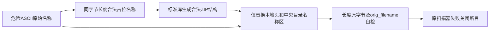

# 0.9.4b Secret归档测试夹具跨平台详细设计

## 1. 需求背景与原失败

[CI 36288580538](https://github.com/carrie1988/Harnessix/actions/runs/36288580538)准确对应
`747fe9b6a40bb6596c23772fab686b5df0b1db74`：六作业全部结束，五作业成功，Windows失败。
Windows构建和发行物Secret扫描已通过；治理测试为1 failed、661 passed、48 skipped、4 errors。
不能沿用前序版本六作业成功结论，也不能以重跑掩盖确定性夹具缺陷。

两类原因：

| 失败 | 源码根因 | 修复目标 |
|---|---|---|
| TAR正常用例setup/teardown四个错误 | Pytest自动把原始TAR bytes生成参数ID；`PYTEST_CURRENT_TEST`超过Windows单环境变量32767字符上限。 | 同一四个正常用例使用稳定短ID，保留完整TAR内容和断言。 |
| ZIP反斜杠路径未抛错 | Windows标准库写入器将反斜杠规范成正斜杠，夹具实际已经变成合法路径。 | 原包中央目录和本地记录直接写入相同原始名称，禁止写入器改变攻击输入。 |

修复只涉及[`test_secret_scan.py`](../../tests/governance/test_secret_scan.py)中的参数ID、夹具及新增夹具自检。
扫描器本来就检查`entry.orig_filename`，不修改其拒绝反斜杠、链接、绝对路径或穿越规则。

## 2. 设计目标、非目标与源码依据

- 正常、空成员、ZIP/TAR及四类危险路径用例均保留，不新增Windows skip、不改期望异常码。
- 危险夹具在解析前核验本地头和中央目录名称原字节一致，且标准库原始名称仍等于攻击输入。
- 新增四项夹具身份自检，不把“有一个名为攻击测试的函数”视为输入真实覆盖。
- 不改变Agent Runtime、Session、数据库、审批和Action语义，也不引入发布服务。

本机读取`zipfile.ZipInfo.__init__`与`writestr`实际源码确认规范化发生在写入器，
读取器保留`orig_filename`。Windows原始终态日志与当前源码互证，不能将合法化后的夹具当作扫描器漏洞。

## 3. 总体架构、流程与数据流



流程：`_zip_with_raw_name(name)`将ASCII名称编码，先以等长`a`名称构造ZIP，然后按本地头固定30字节、
中央记录固定46字节的名称起点替换两处名称区。长度不变，数据、CRC、压缩区和EOCD偏移不变；
夹具仍是结构一致的归档，唯一不受支持输入是成员路径声明。

数据不落盘解包；危险原包仅写到pytest临时文件。成员名称不拼接宿主路径。
测试最终断言临时目录只有`artifact.zip`或`artifact.tar`，证明没有创建穿越目标。

## 4. 接口设计、数据结构、字段与伪代码

没有新增生产类或公开接口。新增私有测试方法职责单一：保留ZIP攻击名称的原字节身份。

| 项目 | 解释 |
|---|---|
| `_zip_with_raw_name(name: str) -> bytes` | 输入仅当前四个固定ASCII危险名称，返回未被平台规范化的ZIP原字节。 |
| `encoded` | ASCII原始成员名；长度同时决定占位名称及两个替换区间，不允许变长破坏结构。 |
| `central` | 单成员合法夹具中中央记录签名偏移；不是对任意不可信发行物的通用解析接口。 |
| 短参数ID | `wheel-public`、`tar-public`、`zip-empty-member`、`tar-empty-member`，不包含TAR字节正文。 |
| `orig_filename` | 标准库保留的原始成员名，与平台规范化的`filename`不同。 |

```text
encoded = ascii(untrusted_name)
body = zip(public_data, name = repeat("a", len(encoded)))
central = locate_single_central_record(body)
replace_same_length(body, local_name_start, encoded)
replace_same_length(body, central_name_start, encoded)
assert raw_local_name == raw_central_name == encoded
assert parsed_orig_filename == untrusted_name
assert scanner raises fixed unsupported_entry
```

## 5. 错误分类、安全、持久化与部署

夹具构造错误必须使自检失败，不能被解释为扫描器正确拒绝。标准库或记录布局变更需同步明确夹具合同。
固定四个ASCII名称没有真实用户路径或Secret；不会接触Workspace、网络或凭据。
无配置迁移、状态持久化、运行时性能变化或用户安装变化；CI仍需实际Windows终态证明修复。

## 6. 测试、风险与验收边界

- 修复后本地91项Secret专项全部通过；正常用例ID均为短名，专项最长节点ID119字符。
- 与CLI编码及供应链相关组共113 passed，10.69秒；这些组重叠，不能相加作为独立总数。
- 这些本地结果不能替代真实Windows。[CI 36291475364](https://github.com/carrie1988/Harnessix/actions/runs/36291475364)
  精确对应6677e549e4883704856dbf55162b00b2ff7291b3：Windows作业终态成功；
  macOS、文档、容器作业也成功。Python 3.12因12件Archive许可违规exit 1，3.13矩阵取消；不能称全矩阵通过。
- 旧失败日志、前序冻结包和当时“CI未开始”事实保留；新证据单独冻结，不改写历史。

许可证专项复用TAR读取时新增的显式链接跳过仅适用于许可证采集，Secret默认仍拒绝，
相关合同见[锁定发行物许可证据详设](m09-4b-archive-license-evidence.md)。
