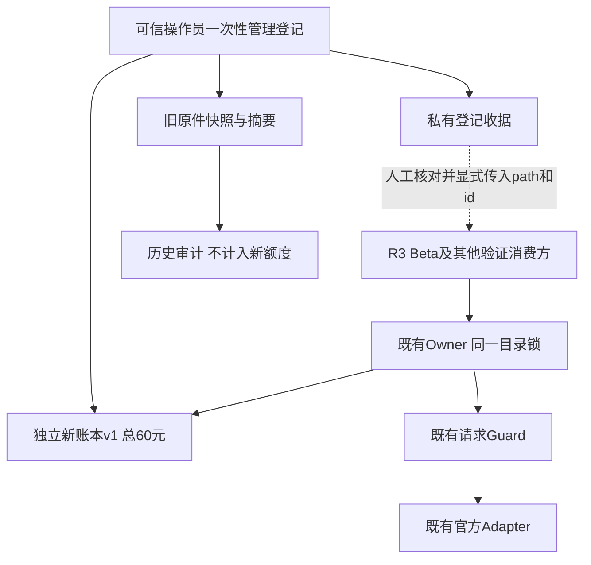
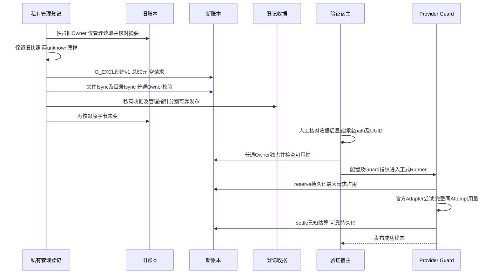
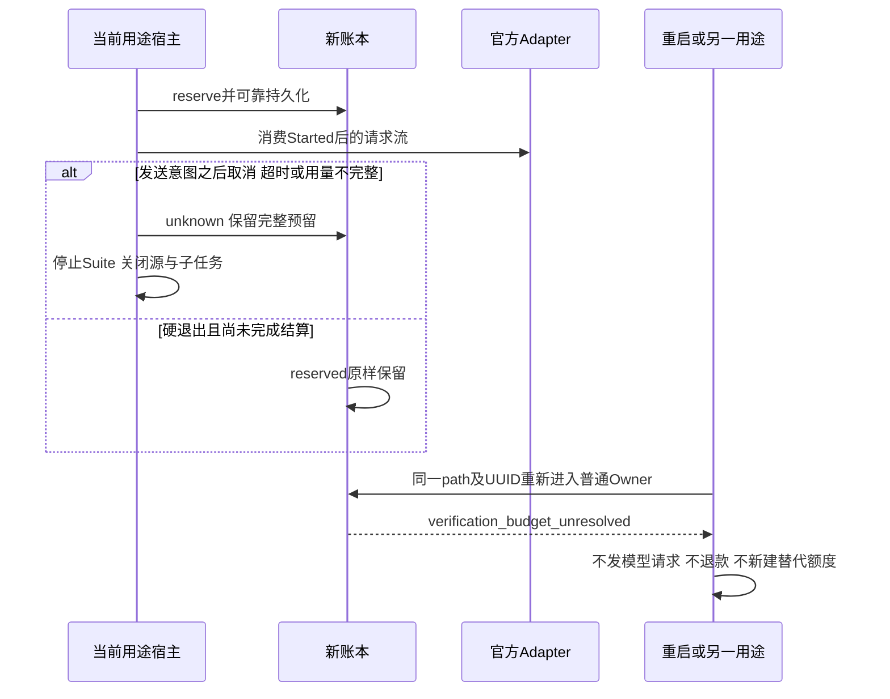
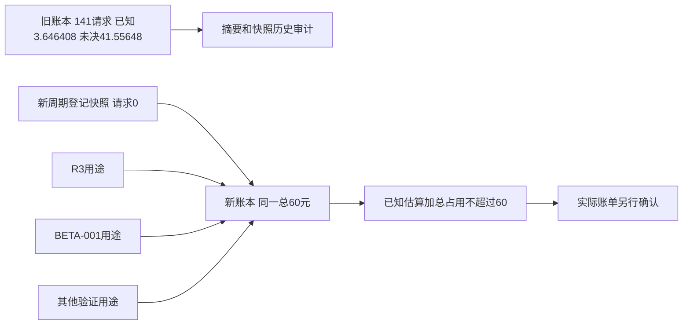

# 百炼独立验证预算周期登记与历史费用隔离

## 1. 变更摘要

| 项目 | 内容 |
|---|---|
| 需求/缺陷 | 将旧验证周期的费用历史与新授权的累计60元额度分离 |
| 当前问题 | 旧账本两条unknown继续占用41.55648元；复用旧路径或旧复验身份会继续触发原未决保护 |
| 目标结果 | R3、BETA-001及其他百炼验证显式消费同一独立路径、同一新周期，共享累计60元 |
| 影响模块 | 私有一次性管理登记、验证证据和隔离回归；运行时预算源码不变 |
| 兼容级别 | 既有账本v1和Owner接口复用；旧v3账本与旧复验授权保持原字节 |
| 发布/回滚单元 | 独立私有账本、登记收据及消费方显式path/id绑定；停止消费不等于退款或删账 |

本设计描述受控验证宿主的预算管理事实，不新增产品预算平台、重置API、自动周期选择或真实Beta能力。
登记完成不代表R3质量通过、消费者安装验收或Beta完成。

## 2. 需求背景与证据

权威私有证据根记为E，持久源码候选记为C。E为`bailian-budget-60-20261007-v1`验证目录，
C为其`candidate/Harnessix`；公开资料仅记录目录角色和文件名，不复制个人路径、密钥或完整请求历史。

`ACTIVATION_RECEIPT.json`记录登记时刻`2026-10-07T11:42:58.801882+00:00`，新周期
`bab39be6-7af6-4a77-9da6-fe0664e15f65`，币种CNY、额度`60`。初始账本SHA-256为
`34a944e91870ec6fa8662301892d801e2f83fe7a3650d45a12f64b3c24e2a0de`，当时请求0、已知估算0、占用0。
这三个零只说明登记快照，不说明登记后的真实R3没有请求或费用。

旧周期为`d973352f-0392-4d81-a324-8cb58f229a39`，旧原件及`previous-budget-snapshot.json`的SHA-256为
`d923d8e8812e9706229b290f362b472f3934086feb75a908534cd415f88b4385`：141条请求，139条completed，
两条unknown，已知费用估算`3.646408`元，占用`41.55648`元，原额度`70.00`元。
两条unknown各占用`20.77824`元，仍未获得权威账单确认；未知实际费用不是0。

旧原件内`status=active`保持不变；收据的`historical-no-new-requests`是操作管理状态，
不是对旧账本字段的迁移。旧费用不纳入新额度、不再作为新路径请求的前置阻塞；旧质量失败及费用历史仍保留。

既存`budget-tests.xml`与`budget-tests-wheel.xml`各有291 cases，失败/错误/跳过均0。
这两份属于已存证据，不作为新执行记录。独立执行证据、哈希和门禁见
[验证资料](../validation/bailian-budget-60-2026-10-07-v1/README.md)。

## 3. 设计目标、非目标与验收标准

1. 新Owner只读取显式新路径及新UUID；隔离旧两条unknown，不删除、结算或改写旧账。
2. R3/Beta共用同一60元总额，关闭重开后费用累计，不能每个用途分别获得60元。
3. 新周期reserved和unknown都阻止后续请求及重启；默认unknown STOP不改变。
4. 旧UUID选择新账本必须拒绝；不同用途不得并发拥有同一账本Owner。
5. not_sent仅释放自身未发送请求的预留，不减少之前的已知费用或擦除请求前缀。
6. 验证预算及文档不能宣告真实质量PASS，Beta完成数仍为0；账单未确认字段不得写为实际费用0。

验收绑定[周期隔离测试](../../tests/evals/test_provider_budget_period_isolation.py)的6个测试函数、7个参数化cases，
以及原5个预算、宿主、复验与候选链测试文件。总回归为291 cases；测试仅使用私有临时夹具与离线Adapter替身。

非目标：新增运行时代码、预算重置/加额API、自动周期轮换、供应商账户硬限额、账单对账系统、
新复验授权、跨Revision恢复旧Suite、修改Task Pack/评分器、真实模型调用或Beta运行。

## 4. 当前实现与根因


`VerificationBudgetLedger.__enter__`检查私有目录、锁、原字节和唯一active周期，再执行
`require_available`。默认存在reserved或unknown即拒绝；这一保护本身不是缺陷。
历史复验授权只允许精确原周期、原复验及原Suite范围，并不等价于新周期额度。

根因是预算管理边界：旧周期无法承载新独立授权而又不延续旧未决约束。
既有Owner已接受独立`path/period_id`，因此无需增加重置接口或放宽unknown规则。
消费新路径即可隔离历史，复制账本或偷偷替换旧身份则破坏单一累计额度的操作约束。

## 5. 方案与变更后总体架构



| 边界 | 唯一职责 | 明确不承担 |
|---|---|---|
| E中的`activate-budget.py` | 一次性私有管理登记、原件摘要核验、独立账本和收据发布 | 产品能力、常驻管理服务、自动恢复登记、模型IO |
| 激活收据 | 记录授权周期、路径、额度、用途和旧历史边界 | 自动路由、运行时配置源、价格授权、模型请求凭证 |
| `VerificationBudgetLedger` | 独占所选账本，校验、预留及结算累计费用 | 自动创建账本、读取激活收据、加额或清账 |
| 验证消费方 | 人工核对收据后，显式传入同一path/id | 私自建立用途独立额度、拷贝账本扩大余额 |
| `GuardedVerificationProvider` | 先持久预留，再托管Attempt/Usage/终态 | 账单确认、跨周期费用迁移、改变质量评分 |

收据和管理指针**不会被运行时自动读取**。管理登记使用既有Owner的私有`_registration_only`模式读取旧未决事实，
仅供这次受控管理脚本，不新增或推广为产品公共API；登记脚本不进入Wheel，也不得重复执行。
真实消费只使用普通Owner，不能以管理模式绕过默认unknown STOP。

### 5.1 替代方案与核心取舍

| 方案 | 优点 | 缺点/风险 | 结论 |
|---|---|---|---|
| 清零或删除旧unknown | 表面恢复可用额度 | 丢失费用责任、违反原件与未知保护 | 不采用 |
| 修改旧额度/周期或延用旧40元复验授权 | 路径不变 | 混淆历史、新授权及原候选身份 | 不采用 |
| R3/Beta各建60元账本 | 用途隔离 | 额度变为120元，违背总60元约束 | 不采用 |
| 新增自动重置/收据读取API | 自动化操作 | 扩大产品安全与兼容边界，非本次范围 | 不采用 |
| 独立账本并显式消费 | 复用现有Owner，历史不变，默认未决保护不变 | 消费方必须遵守单一路径，非账户级硬停止 | 采用 |

## 6. 正常、失败与恢复时序

### 6.1 一次性登记与正常消费



快照、账本、收据及管理指针的发布是分别创建、写入、文件同步及父目录同步，不是跨文件原子事务。
登记中断不得猜测已完成状态或重新执行脚本；必须检查实际文件、权限、摘要及收据一致性后人工处理。
未完成的登记不得进入真实请求消费。

### 6.2 新未决失败、取消与恢复



只有能证明没有发送意图的请求可标记not_sent并释放自有预留；Started后即使HTTP是否发出不明确，仍保守unknown。
结算同步失败不得发布成功；重启以实际可验证字节为准，不猜测退款。
旧周期切换为管理历史并不解除新周期任何未决保护，不能通过切换用途消除停止条件。

## 7. 接口设计、契约与数据结构

### 7.1 现有接口及消费绑定

| 接口/参数 | 合同 | 失败/兼容边界 |
|---|---|---|
| `VerificationBudgetLedger(path, period_id)` | 输入已有私有POSIX账本路径与明确UUID | 不初始化账本；唯一active周期必须匹配 |
| `run_budgeted_suite(..., budget_path, period_id)` | 显式选中登记路径和新UUID | 不读取收据；默认禁止网络 |
| CLI `--budget-ledger`、`--period-id` | 两参数都必须显式传入 | 不使用旧路径、旧UUID或旧`--reverification-id` |
| `BailianVerificationBounds.fingerprint` | 绑定账本路径摘要、UUID、额度、模型与价格窗口 | 同时进入Case和Suite恢复身份；新路径不允许恢复旧Suite |
| `reserve` / `settle` | 18位定点金额、最小用途元数据、唯一request UUID | 总额不足、未决、漂移或持久失败即拒绝 |

所有消费方显式传入E中同一个`budget.json`与`bab39be6-7af6-4a77-9da6-fe0664e15f65`。
`purpose`只记录用途，不是额度分区或认证凭据。Beta共享预算是一项操作绑定要求，
不意味着产品UI已实现自动读取收据或预算接线；真实Beta仍须另行验证消费接线与完整业务流程。

### 7.2 数据与兼容策略

| 结构/字段 | 登记结果 | 兼容与回退 |
|---|---|---|
| 新账本`schema/provider/currency` | `harnessix.provider-verification-budget/v1`、`aliyun-bailian`、`CNY` | 复用现行Reader，不改schema |
| 新`period_id/status/allocation` | 新UUID、`active`、字符串`60` | 普通Owner核验身份，不自动重置 |
| `known_cost/reserved_cost/requests` | 登记快照`0/0/[]` | 后续由真实请求累计，禁止重新发布空快照 |
| 请求状态 | `reserved → completed / unknown / not_sent` | unknown没有自动恢复发送路径 |
| 收据`shared_purposes` | `R3/BETA-001/provider-verification` | 共用总60，不构成三份额度 |
| 收据旧历史字段 | 141条、已知估算3.646408、占用41.55648及两unknown身份 | 审计边界；不迁移到新周期，不修改旧原件 |
| 原v3复验及候选链 | 完整保留旧账本内的原授权与绑定 | 新v1不继承旧40元单轮授权和旧Suite恢复资格 |
| 供应商实际账单 | `actual_bill_confirmed=false`、实际金额未知 | 未确认不是0；不能从已知估算或空账本推出免费 |



## 8. 状态、持久化、事务、并发与幂等

- 账本所在目录0700，账本和锁0600；Owner核验POSIX身份、链接、ACL及no-follow，限定可信单宿主协作边界。
- 锁文件为账本父目录中的`.provider-verification-budget.lock`，Owner持有整个生命周期；
  锁范围是该目录而不是`purpose`，不能删除锁或复制账本制造独立余额。
- `reserve`先校验`known_cost + reserved_cost + maximum <= allocation`，再可靠发布请求及占用；
  当前存在未决请求就拒绝继续预留。
- 运行时写入沿用原字节重验、同目录临时文件、文件fsync、replace及目录fsync；没有新增事务实现。
- 完整用量按当前价格边界估算，completed释放差额；unknown保留完整占用；not_sent仅释放当前request自身。
- 关闭Owner不删除历史或退还预留；重开继续累计。重复结算非reserved请求会拒绝，不通过重复操作获取退款。
- 私有登记的O_EXCL拒绝覆盖已存在的目标，脚本不是可重复执行的幂等API；异常后须人工核对，不自动补写或重登记。

## 9. 安全、隐私、可观测性与部署边界

登记脚本不联网、不读取模型凭据；回归只使用合成临时账本、离线Provider和MockTransport，
不取得真实账本Owner，也不读取密钥。公开资料只保存低敏摘要与哈希，私有证据根保存原文件和回归日志。
运行时仍在预算可用性检查之后读取短生命周期凭据，不改变既有信任边界。

错误分类保持现行`verification_budget_busy/unavailable/unresolved/exhausted/persist_failed`，
没有新增产品Trace、Metric、Event或高基数标签。用途不是新增授权边界。

消费参数形式如下；该示例只说明显式绑定，不作为执行真实请求的授权：

```text
现有预算宿主 --budget-ledger <E>/budget.json
             --period-id bab39be6-7af6-4a77-9da6-fe0664e15f65
             --config <受控配置>
```

同一新周期的合法恢复必须维持配置、Suite、Guard、源码和价格窗口身份；不能使用新path/id跨周期恢复旧候选。
固定镜像和认证预检PASS属于既存宿主证据，不替代真实完整20 Trial或账单验收。

## 10. 核心伪代码

```text
私有管理登记事实（已执行，不重跑）：
    核验旧原件摘要、141条请求及两条unknown
    保留旧快照；旧原件不改
    独立新路径创建v1账本：新UUID，总60元，空请求
    普通Owner核验新账本可用
    分别持久发布收据和管理指针，再核验旧原件不变
真实消费：
    人工核对收据；显式传入同一个新path/id
    普通Owner独占；未决、身份、权限或持久化失败即停止
    持久预留后才消费官方Adapter
    完整用量 -> 已知估算；发送后歧义 -> unknown并停止
    无发送意图 -> 仅释放自有预留；关闭或重启不重置累计费用
证据发布：
    登记快照、后续真实R3、离线回归分开记录
    未确认账单保持未知；不由离线PASS推断质量PASS或Beta完成
```

## 11. 实施切片与验证计划

| 顺序 | 代码/数据改动 | 行为保持或契约 | 测试/证据 | 可独立回退 |
|---|---|---|---|---|
| 1 | 既存私有一次性登记及收据 | 旧原件不变、新v1总60 | 收据及旧快照摘要 | 停止消费，保留事实 |
| 2 | 周期隔离回归文件 | 6函数7cases，不修改Owner | 旧未决隔离、累计、重启、身份、独占、not_sent | 删除新增测试不改变运行时 |
| 3 | 正式设计和五文件验证资料 | 证据分层、供应商账单未知 | XML重算、独立Wheel回归、结构及哈希检查 | 文档版本独立回退 |
| 4 | 后续真实消费验收 | R3/Beta显式共用同一总额 | 完整质量、接线、账单与业务证据 | 遇新未决停止，不清账 |

回归使用E中的`installed-venv/bin/python -I`及已装独立Wheel；scripts来自候选C，harnessix必须来自该venv的site-packages。
Wheel SHA-256为`85a8b90e367f6ab8f73235c8ec28012db5930f1f2f2bda0491c6c4deee8011ba`，
548个package成员、507个Python成员；安装内容、候选包源码与Wheel逐字节核验。
验证日志/XML及来源记录保存在E的`recovered-budget`私有0700目录。

## 12. 源码与测试映射

| 设计点 | 源码文件及关键符号 | 测试/证据 |
|---|---|---|
| 显式路径与UUID、未知默认停止 | [`provider_verification_budget.py`](../../scripts/provider_verification_budget.py)：`__init__/__enter__/_validate/require_available` | 周期隔离旧unknown、新reserved/unknown重启拒绝、旧UUID拒绝 |
| 共用总额与不退款重开 | 同文件：`reserve/settle/close` | 周期隔离跨重开60元累计、not_sent自有释放 |
| 用途间独占 | 同文件：`__enter__`；[`file_lock.py`](../../src/harnessix/file_lock.py)：`acquire_exclusive_file_lock` | 周期隔离R3/Beta Owner冲突；原预算权限及持久化反例 |
| 显式CLI及不自动读收据 | [`run_engineering_provider_suite_budgeted.py`](../../scripts/run_engineering_provider_suite_budgeted.py)：`main/run_budgeted_suite` | [`宿主测试`](../../tests/evals/test_provider_verification_host.py)：默认禁网、预算先于凭据 |
| 路径/周期进入恢复身份 | [`provider_verification_guard.py`](../../scripts/provider_verification_guard.py)：`BailianVerificationBounds.fingerprint`；[`provider_suite_execution.py`](../../src/harnessix/evals/provider_suite_execution.py)：`run_task_pack_provider_suite` | 原复验/重绑定/候选链测试及Factory恢复身份回归 |
| 预留先于发送、完整用量结算、取消 | `GuardedVerificationProvider.stream`；[`openai_chat.py`](../../src/harnessix/models/openai_chat.py)：`OpenAIChatProvider.stream` | [`预算Guard测试`](../../tests/evals/test_provider_verification_budget.py)：MockTransport及失败同步 |
| 私有一次性登记，非新增产品能力 | E中的既存`activate-budget.py`，仅证据引用、不纳入仓库源码 | `ACTIVATION_RECEIPT.json`、`previous-budget-snapshot.json`及原件摘要 |
| 六文件回归范围 | [`周期隔离`](../../tests/evals/test_provider_budget_period_isolation.py)、[`复验`](../../tests/evals/test_provider_reverification.py)、[`重绑定`](../../tests/evals/test_provider_reverification_rebinding.py)、[`候选链`](../../tests/evals/test_provider_reverification_chain.py)及上述两原文件 | 7 + 43 + 15 + 37 + 146 + 43 = 291 cases |

## 13. 风险、部署兼容、发布和回退

本方案限定既有POSIX验证宿主，不扩展Windows产品预算管理。并发锁与60元约束只覆盖使用同一账本的可信协作消费方，
不控制供应商账户内其他应用、同UID恶意写入、账本副本或账单调整；供应商实际费用必须单独核验。
固定价格窗口失效、镜像/认证/配置/源码漂移、新未决或持久化失败均必须停止消费。

尚未真实消费时，可停止选择该path/id并保留登记证据；发生请求后账本不可逆地成为费用事实，
回退只能停止新请求、保留全部历史并由预算负责人组织费用核对，不能删除账本、恢复初始空快照或将unknown记0。
旧周期不能因回退重新成为未决请求的免费恢复来源。

发布预算隔离证据不关闭完整20 Trial质量、完整Git交付、同候选安装、安全、跨平台及Beta门禁。
登记后的真实R3请求、部分成绩或失败必须由对应运行证据单独发布；本文不将其归为登记0请求，也不补造质量成绩。

## 14. 实现偏差与最终结论

运行时预算、Guard、宿主及产品接口均无改动；变更限于周期隔离测试、本文和五个验证资料文件。
`code_revision`表示候选Git基线，精确执行包由指定Wheel摘要和来源验证锁定，并非新增提交或已发布产品版本。

旧原件141条及两unknown保留，新周期只消费独立v1账本的同一总60元；默认unknown STOP继续生效。
管理登记已经存在，不新增重置API或自动收据读取能力。离线回归与资料一致性形成预算隔离验收，
不构成真实质量PASS；Beta完成数0，供应商账单仍未确认。
