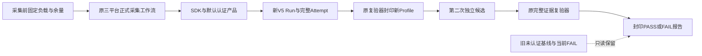
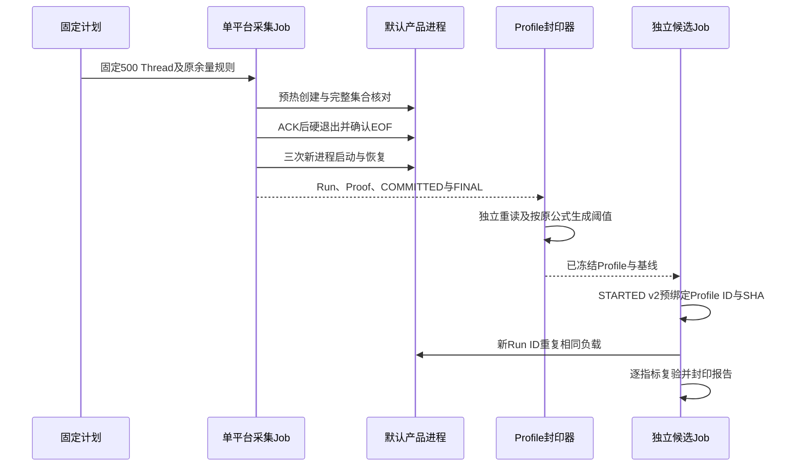
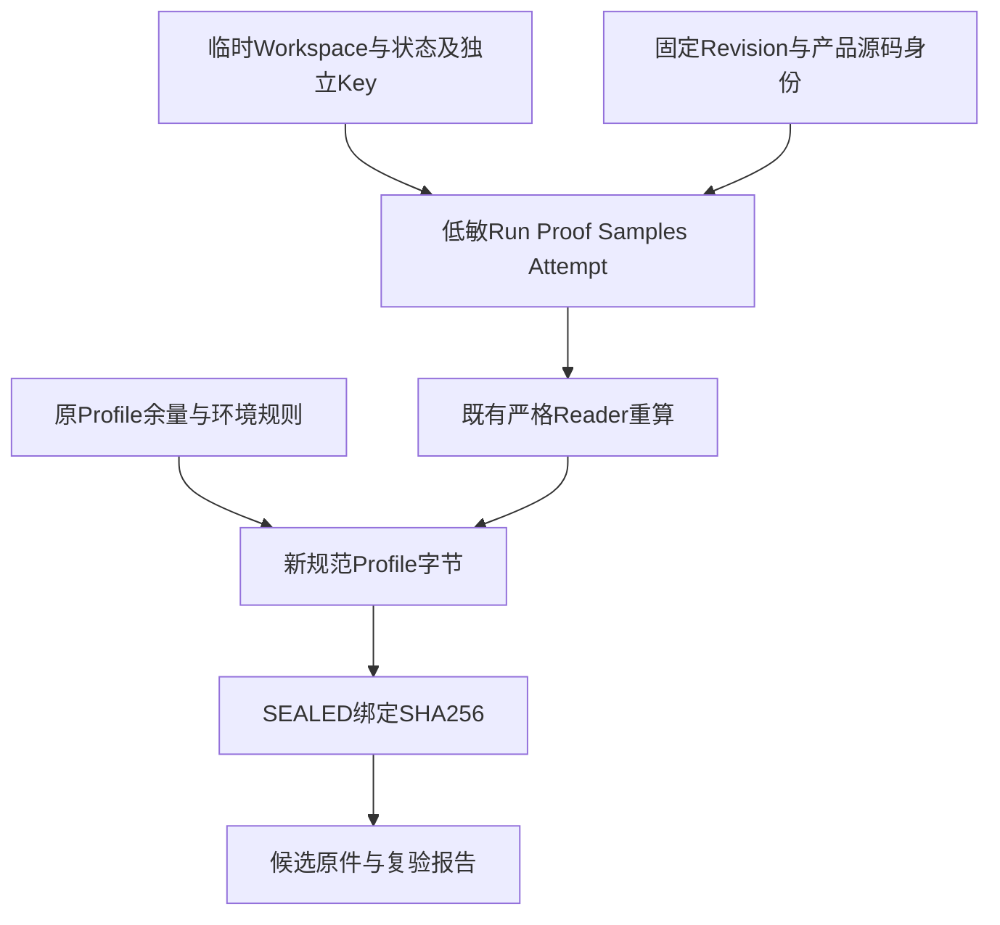

# R1认证存储重启基线与独立候选复验详细设计

## 1. 摘要与实现边界

本设计为已启用持久来源认证的默认产品建立独立、明确标识的新重启基线。
采集和阈值复验继续使用现有Runner、V5 Manifest、V1 Profile及封印机制；不修改产品数据格式、
认证算法或工程余量，不引入压缩编码、证明去重或新的基准平台。
采集完成后冻结三平台Profile，再运行第二次独立候选；尚未取得正式结果时不得登记PASS。
本专项不关闭R1整体、真实编码质量、消费者Windows 11、版本升级或独立用户Beta。

## 2. 需求背景与源码依据

[旧Profile下的当前产品复验](../validation/product-restart-release-boundary-2026-09-29-v1/README.md)
在三平台均因数据库增长FAIL，其他指标未越限。旧基线来自启用持久认证之前的实现。
只读诊断发现500份事件证明、500份投影证明和1份Store身份，没有证明行重复；
认证对象及索引占708,608字节，是新增容量的主要来源，但不能据此宣称长期无泄漏。

| 源码或证据 | 可核验事实及设计影响 |
|---|---|
| [迁移0029](../../src/harnessix/session/migrations/0029_authenticated_session_history.sql) | 事件证明、投影证明和Store身份是正式持久化数据，不应为满足未认证时期的空间上限而删除。 |
| [SQLite认证](../../src/harnessix/session/sqlite_publication.py)、[证明合同](../../src/harnessix/session/publication_seal.py) | 原正文、原证明和原Key绑定；重启不能补签未知历史。 |
| [默认产品组合根](../../src/harnessix/product_config/server.py)、[托管Key](../../src/harnessix/product_config/session_key.py) | 现行默认产品使用受管状态及持久Key；正式采集不直构造无保护Store。 |
| [原Runner](../../scripts/soak_restart.py)、[正式入口](../../scripts/run_restart_soak_release.py) | 实际SDK和独立产品子进程创建、恢复同一Thread集合；无Turn、无付费模型请求。 |
| [独立复验器](../../scripts/soak_threshold.py) | Profile必须由完整已提交基线生成；阈值按整数余量公式校验，不允许手调或赛后反推。 |

## 3. 设计目标、非目标、约束与取舍

目标：区分未认证历史负载与认证产品负载，保留旧FAIL；用相同规模和原余量规则建立可重复的认证容量护栏。
非目标：优化存储格式、调整认证安全性、扩大性能平台、采集真实模型时延、替代工程任务或用户Beta。

- 旧原件、Profile、报告及判定只读；不将旧FAIL改成PASS。
- 不以缩小Thread数、减少恢复周期、增加超时、降低故障标准或挑选成功运行解决越限。
- 新基线从现行默认产品独立采集，不复用旧失败候选作为新基线。
- 工程余量在采集前登记于[固定计划](m09-r1-authenticated-restart-baseline-plan.json)，候选不参与阈值计算。
- 新基线允许记录认证产品的实际容量，但不提供任意规模、消费者硬件或长期运行SLA。

保留原认证实现比为少量必要证明空间新增二进制编码、迁移和兼容Reader更简单，
且避免改变已经通过来源认证回归的持久化边界。未来存储优化须凭真实规模证据另行设计。

## 4. 总体架构、模块边界与依赖方向



产品组合根仍负责状态、Key、Owner与SQLite认证；采集器负责真实进程和低敏测量。
复验器只读已发布事实，不写业务库、不构造新证明、不请求Provider。
Profile归档与默认产品之间没有新的依赖，不能将实验阈值写入Agent运行逻辑。

## 5. 正常流程与执行时序



三个平台分别完成一次正式基线；仅全部基线有效后归档并生成各自Profile。
第二次候选使用新Run ID、独立临时状态根和同一正式负载，不沿用基线业务库。
若任何运行失败，保留Attempt或报告并按原因处理；重新运行必须登记为新运行，不覆盖失败。

## 6. 数据流程、接口设计、数据结构与领域契约



原Key、数据库、协议正文和Workspace内容不上传；公开数据仅包含原合同规定的计数、统计、水位、摘要和固定源码身份。
认证负载身份由固定产品源码及默认组合根标识，不把普通SHA或计数误称为新的业务来源认证。

| 接口或字段 | 正式语义 |
|---|---|
| `run_release(evidence_root)` | 现行完整产品500 Thread正式采集，返回平台、Revision、Run ID及Manifest SHA。 |
| `SoakManifestV5.code_revision` | 实际干净Checkout身份，不用计划中的参考提交冒充执行提交。 |
| `load` | `thread_count=500`、`warmup_count=1`、`turn_count=0`、`artifact_count=0`、`pending_limit=null`、`fault_matrix_version=product-restart-v1`。 |
| `sample_counts` | `product_startup=3`、`rss_peak=1`；硬退出不是正常启动时延样本。 |
| `baseline_run_id/manifest_sha256` | 新基线唯一ID和原字节摘要，Profile不得指向旧失败候选。 |
| `metric_limits` | 启动时延10000bp、RSS 5000bp；各分位按新基线及原整数公式展开。 |
| `growth_limits` | DB/WAL/Artifact均5000bp；基线增长0仍得到上限0。 |
| `threshold_profile_ref` | 候选运行前写入STARTED v2；最终Manifest同值，不允许事后补绑。 |
| `SoakVerificationReport` | 证据无效为unverified，可比但越限为FAIL，全量满足才PASS。 |

## 7. 核心伪代码与阈值生成

```text
for platform in linux, macos, windows:
    baseline = read_complete_new_baseline_and_attempt(platform)
    require baseline.source matches fixed authenticated product inputs
    require load, samples, faults, provider and Python match original policy
    original = read_original_profile(platform)
    for each metric and percentile:
        upper = ceil(new_baseline_value * (10000 + original_margin_bp) / 10000)
    for db, wal, artifact:
        growth = max(0, after - before)
        upper = ceil(growth * (10000 + original_margin_bp) / 10000)
    publish_profile_once(profile, baseline)
commit new baseline and sealed profiles before candidate dispatch
run independent candidate with prebound profile
re-read Run, Attempt and sealed report; preserve every result
```

数学公式直接复用既有`_margin_upper`及`publish_profile`校验；不新增另一套阈值计算合同。
候选值、历史FAIL差额或期望PASS不能作为输入。Profile生成时间必须早于候选STARTED时间。

## 8. 持久化、并发、幂等与兼容

业务状态仍在独立私有临时目录，产品正常关闭后由Runner清理；证据按Run ID单写发布。
COMMITTED、FINAL及SEALED的规范字节和文件集保持既有合同；同ID不可覆盖。
三平台并行采集但各自使用独立证据根，不跨平台共用Profile。
V5 Run和V1 Profile格式不变；认证与历史基线分目录、分Profile ID，禁止自动回退到历史Profile。
候选入口需要显式区分基线集合；历史读取保留，正式认证复验不得通过时间排序选择Profile。

## 9. 失败、取消、超时、错误分类与可观测性

- 负载前源码不干净、基线缺提交、Profile歧义或摘要错误：固定错误，禁止开始候选负载。
- SDK初始化、集合核对、Owner恢复或ACK/EOF失败：原失败Attempt保留，不伪造完整Run。
- 每阶段仍使用120秒上限，工作流仍有30分钟硬期限；不以增加超时解决失败。
- 额外超时、UNKNOWN、重复效果或孤儿计数不符合原合同：不得PASS。
- 候选越限：保留原FAIL及指标，排查根因；禁止重新冻结阈值追赶候选结果。
- 观察中断不代表Job终止；后继处理必须查询具体Run/Job当前状态，不能仅凭等待超时重启。

日志复用原固定错误码：源码读取失败`soak_revision_invalid`，基线不完整
`soak_profile_baseline_invalid`，运行或重读不一致`soak_run_invalid`；不打印私有路径或异常正文。
Run ID、Attempt终态、Manifest摘要、样本统计、逐库水位和Report violations分别记录执行身份、
完整性及越限原因。监控使用具体工作流Run/Job ID，单平台PASS不能汇总为商用发布PASS。

## 10. 安全、隐私与部署方案

只在隔离验收Checkout及GitHub三个原生托管Runner采集，不修改使用中的产品状态或用户Workspace。
配置仅包含合成凭据和保留域名，`turn_count=0`，付费模型请求为0。
Session Key由产品创建并留在临时私有状态，不写入Git、日志、Artifact或计划。
不改变Docker配置、远程服务器、操作系统权限及原生认证后端。
部署复用[原工作流](../../.github/workflows/restart-soak.yml)，候选复用
[既有候选工作流](../../.github/workflows/restart-soak-candidate.yml)和原封印读取器。

## 11. 验证矩阵与源码映射

| 验证 | 对应源码/用例与通过范围 |
|---|---|
| 真实SDK、五周期、集合、硬退出与失败Attempt | [test_soak_restart.py](../../tests/benchmarks/test_soak_restart.py)；小负载只证明实现合同，不计正式容量。 |
| Proof与样本/水位/Owner交叉核对 | [test_soak_restart_proof.py](../../tests/benchmarks/test_soak_restart_proof.py)。 |
| 原余量、规范封印、候选错环境/错负载/越限 | [test_soak_threshold.py](../../tests/benchmarks/test_soak_threshold.py)。 |
| Profile预绑定、正式规模及基线集合选择 | [test_run_restart_soak_candidate.py](../../tests/benchmarks/test_run_restart_soak_candidate.py)。 |
| 正式规模 | 三平台各500 Thread新基线、封印Profile及第二独立Run；逐原件独立重算。 |
| 不变边界 | 产品`src`、认证迁移与Validator未改；旧档案和FAIL原字节保持。 |

## 12. 发布、评审与完成标准

按“固定计划提交 → 三平台采集 → 原件复核及Profile冻结提交 → 独立候选 → 统一报告”推进。
交付目录须包含完整中文报告、结构化事实、Run/Attempt/Profile/Report、Manifest、Review Packet及验证日志。
报告明确执行Revision、负载身份、原余量、原FAIL、当前结果及未验证边界。
只有三平台独立报告PASS且相关合同回归通过，才能关闭本固定认证重启场景；其他R1～R6要求保持原状态。
