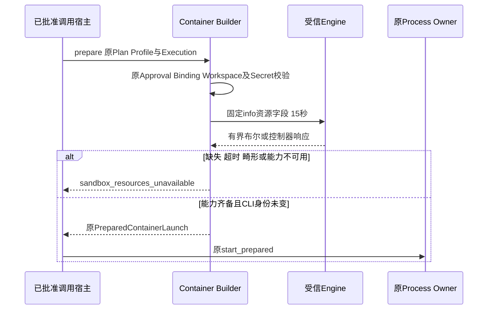
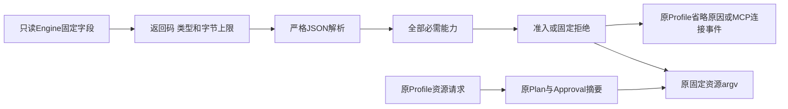

# R1：Container资源能力准入与启动前复核

## 1. 需求背景与变更边界

强Container承诺固定的CPU、物理内存和进程数上限。旧探测只读取Engine版本及Rootless信息，
Builder虽然传入`--cpus`、`--memory`、`--pids-limit`，却没有验证Daemon所依赖的内核控制能力。
因此，引擎可达、argv包含限制及进程退出成功都不能证明这些限制已经生效。

本变更只收紧既有Container执行准入，不新增Sandbox后端、远程执行池或维护平台。默认产品的
固定Process Profile与显式Container MCP都必须使用相同资源能力判定。Host Guarded不因拒绝
强Container而成为自动降级目标。

## 2. 源码研究、选型理由与风险取舍

1. [Docker资源限制文档](https://docs.docker.com/engine/containers/resource_constraints/)
   说明限制依赖内核能力，`--cpus`对应CFS Period/Quota。单独验证CPU Shares不是等价替代。
2. [Moby v28.3.2接口](https://github.com/moby/moby/blob/v28.3.2/api/types/system/info.go)
   定义`MemoryLimit`、`CPUCfsPeriod`、`CPUCfsQuota`和`PidsLimit`布尔字段；Go模板字段名与JSON大小写
   不混用，只输出四项布尔值，避免采集完整`docker info`里的宿主、Registry或代理配置。
3. [Podman v5.5.2 info接口](https://docs.podman.io/en/v5.5.2/markdown/podman-info.1.html)
   提供Host CgroupVersion/Controllers。该适配器要求v2及`cpu`、`memory`、`pids`控制器；v1或不完整
   信息失败关闭，不从Rootless状态或宿主总内存推断资源强制。

仅初次探测不足：缓存的Probe以及先准备后连接的MCP对象均可能在Daemon状态改变后使用。
因此保留一次探测契约，在每次Builder准备和MCP连接创建Client之前重新读取资源能力。
完整`info` JSON、实际内存耗尽测试、自动改内核及启动虚拟机均不是本变更所需方案。

## 3. 设计目标、约束与非目标

- 四项Docker能力必须为JSON字面量`true`；`1`、字符串`"true"`和缺失字段不能作为证明。
- Podman必须为v2，Controller列表有界且包含三个必需控制器。
- 非零退出、超时、畸形、超大或能力缺失响应均拒绝，无自动重试、Host回退或资源放宽。
- CLI可执行文件身份在启动前复核前后保持不变。
- 已获审批且参数未变仍不能绕过当前资源能力校验；拒绝发生于工作负载启动之前。
- 资源能力失效后，原按标签清理和对账仍可执行，不能因准入拒绝阻断孤儿Container回收。
- 无新增Schema、Migration、Key、Profile字段或单独资源证明Store。

非目标：验证恶意Daemon、CPU吞吐基准、Swap上限、Workspace磁盘Quota、全局Probe并发控制或
用户内核运维。资源探测依赖受信Engine报告，不是原子`info + run`或内核抗篡改证明。

## 4. 总体架构与模块边界

```mermaid
flowchart TD
    Config[固定Process Profile或显式Container宿主] --> Initial[Engine初次探测]
    Initial --> Query[固定字段只读资源查询]
    Query --> Validate[共享严格判定]
    Validate -->|有效| Probe[原v1 Probe与原能力绑定]
    Validate -->|无效| Reject[固定拒绝 不广告强能力]
    Probe --> Builder[ContainerCommandBuilder.prepare]
    Builder --> Fresh[启动前重新查询与判定]
    Fresh -->|有效| Owner[原Process Owner启动]
    Fresh -->|无效| Reject
    Builder --> Prepared[既有MCP Prepared启动对象]
    Prepared --> Connect[MCP连接前重新查询与判定]
    Connect -->|有效| Client[原stdio Client]
    Connect -->|无效| Reject
    Owner --> Cleanup[原按身份清理]
    Client --> Cleanup
```



**文字说明：** `sandbox`拥有命令及判定；`product_config`只把资源拒绝映射到既有Profile省略原因；
`mcp`在创建Client前调用同一Builder检查。清理不走资源准入，故Daemon仍可达但缺控制器时仍能回收原实例。

| 源码 | 职责与调用位置 |
|---|---|
| [`capabilities.py`](../../src/harnessix/sandbox/capabilities.py) | 构造固定资源查询、严格判定、初次Engine探测 |
| [`container.py`](../../src/harnessix/sandbox/container.py) | `verify_resource_limits()`复核CLI身份及实时资源；`prepare()`返回启动对象前调用 |
| [`process_runtime.py`](../../src/harnessix/sandbox/process_runtime.py) | 原`start()`重新调用`prepare()`，准入拒绝时不调用Owner启动 |
| [`process_profile.py`](../../src/harnessix/product_config/process_profile.py) | Doctor和产品装配复用原探测；映射`profile_limits_unenforceable` |
| [`mcp/runtime.py`](../../src/harnessix/mcp/runtime.py)、[`startup.py`](../../src/harnessix/mcp/startup.py) | `McpClientConnection.connect()`委托启动辅助模块，在Client创建前完成资源检查及取消结算 |

`_ContainerEngineAccess`分离CLI身份、资源探测及原控制IO；Builder只解释执行计划与固定argv。
MCP启动辅助模块持有准入与原失败清理，Runtime仍持有连接状态、目录及Tool调用；调用方显式传入
规范Container Target类型，不相信可覆盖的transport文字字段，避免类型标签绕过。

## 5. 类、接口与数据结构

### 5.1 接口设计

| 接口 | 输入/输出 | 关键语义 |
|---|---|---|
| `container_resource_probe_command(path, engine)` | 固定CLI路径与Engine → argv Tuple | Docker只读四布尔；Podman只读版本与控制器 |
| `verify_container_resource_support(engine, completed)` | 原CompletedProcess的text/bytes输出 → None或KernelError | 有界、严格类型、能力齐备才返回 |
| `probe_container_engine(...)` | 原参数 → 原`ContainerEngineProbe` | 原版本/安全检查之外增加资源准入 |
| `ContainerCommandBuilder.verify_resource_limits()` | 无额外输入 → None或KernelError | 每次使用现有InspectRunner实时查询；前后核对CLI身份 |
| MCP连接前检查 | 原Target → 完成或取消/拒绝 | 在后台线程执行只读查询；父取消等待原查询结算后传播，不创建Client |
| `build_preflight_client(target, stack, container_type)` | 原Target/ExitStack及规范Container类 → Client | 用真实类型而非可覆盖transport字段选择资源检查；不让辅助模块反向依赖Runtime编排 |

### 5.2 关键字段

| 字段 | 含义及判定 |
|---|---|
| Docker `MemoryLimit` | 物理内存硬限制可用，必须严格true |
| Docker `CPUCfsPeriod` / `CPUCfsQuota` | CPU CFS两项均可用，不能用Shares替代 |
| Docker `PidsLimit` | 进程数控制可用，必须严格true |
| Podman `version` | 查询自`.Host.CgroupVersion`，只接受`v2` |
| Podman `controllers` | `.Host.CgroupControllers`，最多32项，每项1～64字符；必须包含cpu/memory/pids |
| `ContainerEngineProbe.digest` | 原v1有效载荷的普通摘要；不新增字段，不把旧JSON独立解析当作实时资源证明 |
| `SandboxResourceLimits` | 原Profile里的请求值，继续绑定Profile/Plan摘要，不因拒绝而自动改写 |

只读命令每次期限15秒；stdout最多4096字节、stderr最多16384字节。stderr仅检查大小，不解析、不拼入
公开错误、不上传宿主原始信息。既有`capture_output`会先缓存后检查，不宣称已经解决恶意CLI大输出问题。

## 6. 核心流程、时序、持久化与数据流程



**时序说明：** 资源检查在原授权和参数校验后、返回启动对象前执行。Process Runtime每次启动都会重新
准备，不沿用上次成功查询。MCP可能保存Prepared对象，因此连接创建Client前另行复核；其父取消先结算
原只读工作，随后按原连接失败流程记录取消和清理，不重连、不启动工作负载。



**数据流说明：** 原始Engine正文仅驻当前调用；不持久化宿主路径、Daemon配置或整个info。准入结果只影响
是否进入原启动流程；原Probe/Plan/Profile合同不变。MCP拒绝按原Store保存稳定错误码，产品Doctor只输出省略原因。

```text
initial_probe:
    verify CLI identity; read original version and security fields
    query fixed resource fields once; validate strict bounded response
    return original v1 Probe only if all checks pass

prepare:
    verify original approval, capability, profile, workspace and secret binding
    build original fixed argv; reattest selective network if requested
    verify CLI identity; query resource fields once; reverify CLI identity
    require all requested resource mechanisms
    return original prepared launch

MCP_connect:
    begin original connection fact
    if Container target:
        run same Builder resource check in one owned readonly worker
        on cancellation wait for original worker then propagate cancellation
    only then build and enter original stdio Client
```

## 7. 错误分类、可观测性、失败恢复与安全

| 场景 | 对外结果 | 副作用及恢复 |
|---|---|---|
| 资源能力缺失/无效/超时 | `sandbox_resources_unavailable` | 不启动Container，不自动重试 |
| 初次Profile资源拒绝 | `profile_limits_unenforceable` | 不广告Process Tool，无Host替代 |
| CLI身份改变 | 原`sandbox_binding_changed` | 拒绝原Prepared对象；需重新探测及规划 |
| MCP资源拒绝 | 原连接失败事件记录固定码 | Client未创建；仍按原绑定证明清理 |
| MCP父取消 | 原`mcp_startup_cancelled`事实及原取消 | 等待原只读Probe结算，不创建Client、不重派 |
| 能力在旧实例创建后失效 | 新启动拒绝 | 原标签查询、清理及对账仍可用 |
| 错误响应含敏感正文 | 固定中文错误 | 原正文不进入错误、报告或数据库 |

没有新增可恢复写状态。信息查询与实际启动之间仍依赖受信Daemon；资源校验不证明镜像供应链、网络隔离、
磁盘Quota或任何真实编码任务成功。错误环境必须修复或更换，不能为了评测通过删除资源限制。

## 8. 测试、部署与完成边界

- 单元：Docker四项逐一缺失；false/null/数字/字符串/多余字段；Podman版本和控制器缺失；畸形/超限/超时；固定错误无正文。
- 执行：有效旧Probe不能越过实时资源拒绝；资源失败不调用Owner；既有审批/Workspace漂移原因不改变；能力失效后Cleanup仍能执行。
- 产品：Doctor及装配省略不可执行Profile，不解析后续镜像/Secret，不自动回退。
- MCP：Prepared后能力变化、取消及错误均发生于Client创建前；原只读任务结算及稳定失败事实可验证。
- 真Engine：本机只读能力正例；Linux固定镜像集成必须实际读取Memory/PIDs及CPU CFS cgroup文件，缺失文件不能跳过成功。
- 发布：复用原CI、生成规范、文档及Secret门禁；失败和未验证平台如实保留，不据此关闭R1/R3/R4。

部署不修改Docker配置、代理、系统包、用户内核或服务器启动项。Podman v1及未提供必需控制器的环境将被
正式拒绝；此处只有适配器判定回归，没有Podman实机或macOS/Windows完整强Container发行验收声明。
