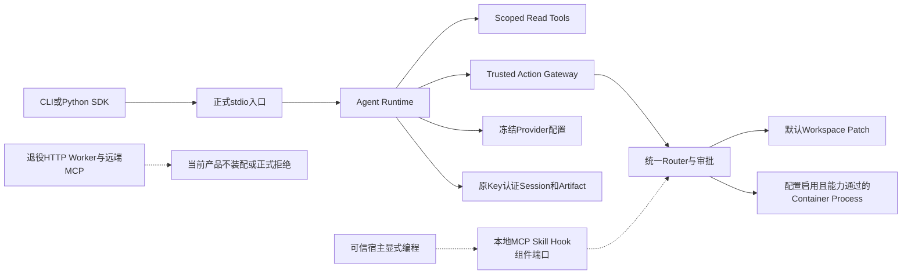
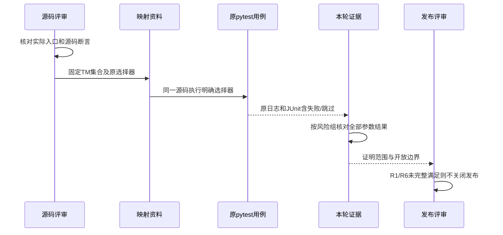
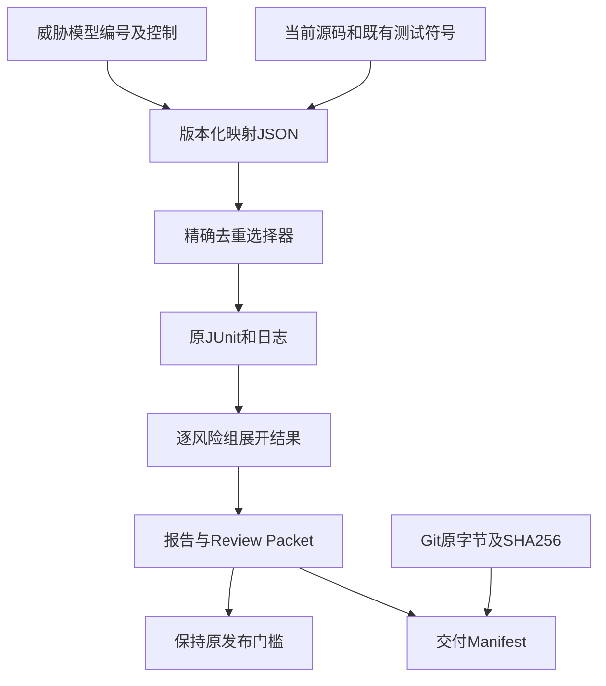

# R1首发安全边界与既有测试追踪详设

## 1. 摘要、需求背景与交付目标

现有威胁模型和分模块测试数量较多，但缺少统一的“当前入口 → 安全控制 → 源码 → 正反例 →
实际结果”追踪。旧0.9.4c计划曾按TM编号建立新的攻击套件；首发范围收敛后，应复用原测试，
只对实际缺失的可达控制补例，避免编号重命名、重复平台及未经求证的全覆盖声明。

本专项建立[版本化映射](../governance/v1-safety-coverage.json)：包含威胁模型第6节全部18个风险组，
对应54个已有测试函数选择器。每条映射保留当前可达性、实际源码、用例角色及证明边界。
映射覆盖表示存在可审阅的锚点，不表示该组所有攻击、所有平台或R1发布门禁已通过。
本专项不更改生产代码、权限、安全等级、预算、数据库Schema或既有测试身份。

## 2. 设计目标与非目标

### 2.1 需求与退出条件

1. 不遗漏TM-01～TM-13及五个A补充组；不能把“主编号13个”误计为18组已完整验收。
2. 每个控制至少有已有正例、负例锚点；逐个确认文件、函数和对应业务断言，不按测试名猜测。
3. 固定源码与选择器，执行后记录参数展开数量、失败和跳过；不同Python结果不累加。
4. 组件Mock、实际文件/进程、原生OS、真实Provider及真实用户证据分别计量。
5. 后续仅补已复现且缺失的首发可达控制；已延期或不装配能力不因旧历史计划重回首发。

### 2.2 非目标

- 不建设新的安全执行器、红队平台、认证平台或新的`tests/security`目录。
- 不改名或复制既有测试，不把Mock结果包装为真实引擎、云模型或消费者系统验收。
- 不以映射数量替代安全评审，不关闭R2许可输入、R3质量、R4消费者环境、R5真实Beta或R6封板。
- 不尝试证明任意Shell语义、所有Prompt Injection、完整DLP或同UID恶意主体防护。

## 3. 系统上下文与总体架构



### 3.1 装配依据与边界

[`_serve_product_stdio`](../../src/harnessix/product_config/server.py)先建立公开Secret Scope、原Key绑定、
Session、Provider和Coding Tools，再打开默认Action Owner，最后发布活动配置和stdio。
[`_compose_product_actions`](../../src/harnessix/product_config/action_composition.py)只构造Patch与已验证的
固定Process条目；没有从项目配置自动加载MCP、Skill或Hook。
[`AgentClient`](../../src/harnessix/sdk/agent_client.py)是协议Client，不是可以任意注入宿主对象的配置通道。

MCP、Skill、Hook已有独立组件API，但自动产品装配与宿主显式编程不是同一入口。
TM-07映射保留组件控制和剩余风险，不用其测试推导默认产品已启用扩展，也不抹去原模块风险。
旧HTTP/Worker和远端MCP/OAuth不属于首发执行路径，原历史设计不恢复生产入口。

### 3.2 可达性枚举

| 值 | 定义 | 结果可证明的范围 |
|---|---|---|
| `default_product` | 当前stdio/SDK主链直接使用 | 固定源码的正式入口相关控制；仍需对应平台和集成证据 |
| `conditional_process` | 仅显式配置及实际后端能力通过后启用 | 默认未启用不等于安全；启用时须验证原计划、能力和Owner |
| `native_windows` | 必须使用Windows实际名称/Handle语义 | 非Windows的逻辑合同测试不替代原生用例 |
| `explicit_host_extension` | 可信宿主显式编程装配组件API | 组件边界，不继承默认产品、发行来源签名或运行期授权证明 |
| `retired_entry` | 已删除服务及只读历史归档 | 当前源码没有旧执行路径，不防御主动构建旧版本 |
| `release_supply_chain` | 构建、依赖及实际发行物输入 | R1/R2交叉检查；单元测试不改写真实扫描拒绝 |

## 4. 接口设计、核心类与职责

| 类或入口 | 源码 | 责任与关键约束 |
|---|---|---|
| `_ProductRuntimeStartup` / `_serve_product_stdio` | [Product Server](../../src/harnessix/product_config/server.py) | 使用固定配置、原Root Owner和Secret来源装配正式生命周期；Store/Provider完成前不开放协议 |
| `ProductActionCatalog` | [Action Catalog](../../src/harnessix/product_config/action_catalog.py) | 条目、能力报告及定义一致；不把缺失能力条目部分安装 |
| `ExecutionPlanV2` | [Execution Contract](../../src/harnessix/execution/contracts.py) | 绑定执行事实、环境、Secret版本、Sandbox及指纹；不是批准事实本身 |
| `TrustedActionRouter` | [Router](../../src/harnessix/trusted_actions/router.py) | 计划、审批、执行与只对账恢复统一；未批准/计划漂移不得启动Executor |
| `SecretPublicationScope` | [Publication Scope](../../src/harnessix/secrets/publication.py) | 当前材料快照、有限编码和预算；不能据此声称任意压缩/加密DLP |
| `EventPublicationAuthority` | [原Key认证](../../src/harnessix/session/publication_seal.py) | 新事实和原正文验真；新Scope不是重新授权未知历史的依据 |
| `ContainerCommandBuilder` | [Container](../../src/harnessix/sandbox/container.py) | argv、挂载、资源及网络依原计划生成；不能以配置声称后端已落实 |

本专项没有新增运行时接口。原接口的详细字段、状态机和错误合同继续以相应
[模块设计](../README.md)及[威胁模型](../threat-model.md)为权威。

## 5. 追踪数据结构与重点字段

映射是版本化评审资料，不是产品可执行配置，不携带Secret、业务Payload或用户历史。

| 字段 | 类型 | 解释与校验 |
|---|---|---|
| `spec_version` | 固定字符串 | `harnessix.safety-coverage/v1`；仅本资料格式，不新增产品协议版本 |
| `source_revision` | 40位Git SHA | 源码和测试身份的固定快照；后继代码变更必须重新核对 |
| `scope` | 固定字符串 | 当前控制锚点，不是商用通过证书 |
| `risks[].risk_id` | TM编号 | 必须与威胁模型第6节编号精确集合相等 |
| `control` | 简体中文文字 | 本条可审阅的具体控制，不使用“全面安全”等无边界描述 |
| `reachability` | 第3.2节枚举 | 区分产品主链、条件执行、组件、原生、退役与发行边界 |
| `source_paths` | 路径数组 | 当前仓库内确实存在的生产文件或构建脚本 |
| `existing_tests[].role` | `positive` / `negative` | 对应本控制的业务断言；不是从函数名字推导 |
| `nodeid` | `file::function` | 既有pytest函数选择器；保留参数化展开，不用宽泛`-k` |
| `source_line` | 正整数 | 固定快照中的函数定义行，便于阅读；运行依稳定函数身份而非行号 |
| `boundary` | 简体中文文字 | 明确Mock、平台、后端和剩余风险的证明限制 |
| `status` | 固定字符串 | `mapped_pending_same_candidate_release_validation`；不因本地绿色变成发布完成 |
| `R1_complete` / `commercial_release` | 布尔 | 当前都为`false`，映射不能代替R1/R6验收 |

## 6. 持久化、数据流程与核验时序





第一幅图表达现有产品可达路径；时序图表达评审和原用例执行，数据流图表达来源与证据的关系。
图中的“资料/评审”节点不属于产品运行时，也不是新增服务。

## 7. 核心核验伪代码

~~~text
verify_mapping(snapshot):
    require mapping.risk_ids == threat_model.section_6.risk_ids
    for risk in mapping.risks:
        require all source paths exist in fixed snapshot
        require positive and negative anchors exist
        require each nodeid resolves to exactly one existing function
        read actual assertions; record scope and limitations
    selectors = exact unique nodeids; freeze before execution
    execute existing pytest on supported local Python environments
    for environment, risk:
        include every parameterized testcase for each selected function
        failed or errored -> local check failed
        native skip -> partial, not native PASS
    retain original failures; do not edit tests, thresholds or skips for green
    verify complete Manifest file set and staged bytes
    publish scope-limited result; never infer R1 or commercial GO
~~~

## 8. 风险到源码与测试映射

完整身份在[JSON映射](../governance/v1-safety-coverage.json)。下表只展示阅读入口；
参数化用例结果以本轮JUnit为准，不能用18组或54函数直接计算发布通过率。

| 风险 | 可达性及控制 | 既有用例锚点 | 证明边界 |
|---|---|---|---|
| TM-01 | `default_product`：项目内容不能提升信任或授予执行权限 | positive [`test_priority_rendering_is_deterministic_and_structurally_escaped`](../../tests/context/test_engine.py)<br/>negative [`test_source_trust_and_runtime_entry_are_fail_closed`](../../tests/context/test_sources.py) | 证明优先级及宿主信任检查，不证明模型在语义上免疫所有Prompt Injection。 |
| TM-02 | `default_product`：Workspace路径规范与实际读边界 | positive [`test_bounded_reads_run_in_parallel_and_descriptor_declares_capability`](../../tests/tools/test_runtime.py)<br/>negative [`test_logical_paths_reject_platform_prefix_and_traversal`](../../tests/workspace/test_paths.py)<br/>negative [`test_unsafe_instruction_file_fails_closed`](../../tests/context/test_sources.py) | 路径合同和实际受管读均有锚点；不是任意宿主Python文件I/O的安全保证。 |
| TM-02A | `native_windows`：Windows名称及Junction必须按原生语义拒绝 | positive [`test_windows_supports_long_logical_paths_without_legacy_260_limit`](../../tests/workspace/test_paths.py)<br/>negative [`test_windows_rejects_reserved_ads_and_collapsed_names`](../../tests/workspace/test_paths.py)<br/>negative [`test_windows_runtime_rejects_junction_and_relative_git`](../../tests/tools/test_windows_native_runtime.py)<br/>negative [`test_windows_runtime_rejects_ads_reserved_names_and_hardlinks`](../../tests/tools/test_windows_native_runtime.py) | 逻辑名称合同可在Mac执行；两个原生用例在非Windows跳过，不能替代Windows 11消费者验收。 |
| TM-03 | `conditional_process`：固定Process计划不能替换argv、环境或Owner | positive [`test_container_execution_materializes_exact_supervised_process`](../../tests/sandbox/test_process_runtime.py)<br/>negative [`test_container_execution_accepts_only_exact_public_intent_arguments`](../../tests/sandbox/test_process_runtime.py)<br/>negative [`test_container_execution_rejects_owner_or_plan_drift`](../../tests/sandbox/test_process_runtime.py) | 使用受控Container夹具验证装配与Owner合同；不证明真实引擎或任意Shell语义安全。 |
| TM-04 | `conditional_process`：网络策略身份与授权匹配 | positive [`test_resolution_is_pinned_sorted_and_expires`](../../tests/sandbox/test_network.py)<br/>negative [`test_none_policy_denies_gateway_authorization`](../../tests/sandbox/test_network.py)<br/>negative [`test_internal_network_attestation_fails_closed`](../../tests/sandbox/test_network_isolation.py) | 证明网关/拓扑合同，不将Host应用层规则或Mock结果宣称为DNS、IPv6和代理旁路均被内核阻断。 |
| TM-05 | `default_product`：Provider与公开输出不继承环境凭据或泄漏注册材料 | positive [`test_openai_adapter_uses_explicit_secret_without_environment_lookup`](../../tests/product_config/test_provider_credentials.py)<br/>negative [`test_native_keys_values_and_finite_encodings_are_rejected`](../../tests/secrets/test_publication.py)<br/>negative [`test_capture_wrong_material_and_callback_error_never_expose_original_text`](../../tests/secrets/test_publication.py) | 只保证已登记材料和有限编码的公开保护，不等于完整DLP或静态数据库加密。 |
| TM-05A | `conditional_process`：版本化注入及跨分块派生值保护 | positive [`test_versioned_secret_scope_injects_only_declared_target_and_closes`](../../tests/secrets/test_provider.py)<br/>positive [`test_streaming_redactor_covers_every_chunk_boundary_and_common_encodings`](../../tests/secrets/test_provider.py)<br/>negative [`test_redactor_fails_closed_for_too_short_secret_and_after_finish`](../../tests/secrets/test_provider.py) | 有限编码/短材料失败关闭有测试；任意加密、压缩及已许可进程主动外传不由字符串Guard证明。 |
| TM-06 | `default_product`：审批及实际Effect与计划指纹绑定 | positive [`test_plan_binds_every_execution_fact_without_secret_plaintext`](../../tests/execution/test_plans.py)<br/>negative [`test_plan_rejects_argument_environment_workspace_policy_and_capability_drift`](../../tests/execution/test_plans.py)<br/>negative [`test_write_requires_exact_approval_and_workspace_freshness`](../../tests/trusted_actions/test_router.py) | 负例证明未批准和Workspace漂移时Executor调用为零；任意Shell效果仍不是可穷尽摘要。 |
| TM-07 | `explicit_host_extension`：扩展不根据自报注解提升权限 | positive [`test_connection_captures_modern_catalog_and_executes_read_tool`](../../tests/mcp/test_runtime_actions.py)<br/>negative [`test_malicious_description_and_annotations_cannot_lower_write_policy`](../../tests/mcp/test_runtime_actions.py)<br/>negative [`test_non_bundled_hook_requires_exact_unexpired_definition_grant`](../../tests/hooks/test_runtime.py)<br/>negative [`test_content_change_after_catalog_is_rejected_and_audited`](../../tests/skills/test_runtime.py) | 当前stdio/SDK产品配置不自动装配这些端口；组件锚点不关闭Hook来源交叉校验、运行期授权及Owner恢复剩余风险。 |
| TM-08 | `default_product`：流式Provider仅发布完整且合法的ToolCall | positive [`test_sse_utf8_fragmentation_and_newlines`](../../tests/models/test_openai_chat.py)<br/>negative [`test_invalid_arguments_never_release_calls`](../../tests/models/test_openai_chat.py)<br/>negative [`test_wire_budgets`](../../tests/models/test_openai_chat.py) | 原Adapter和受控HTTP传输合同；不登记供应商生产服务或真实编码质量通过。 |
| TM-08A | `default_product`：Fallback只能发生于无输出暴露且有审计的失败 | positive [`test_zero_exposure_failure_falls_back_with_global_attempts_and_audit`](../../tests/product_config/test_runtime.py)<br/>negative [`test_never_falls_back_after_response_or_tool_exposure`](../../tests/product_config/test_runtime.py)<br/>negative [`test_rejects_malformed_or_ambiguous_json`](../../tests/product_config/test_contracts_and_codec.py) | 窗口拒绝不证明供应商零费用；环境声明版本不证明云端密钥版本。 |
| TM-09 | `default_product`：协议身份、消息预算及慢消费者边界 | positive [`test_agent_sdk_drives_turn_replay_and_duplicate_command`](../../tests/app_server/test_server_sdk.py)<br/>negative [`test_decode_enforces_frame_and_depth_limits`](../../tests/protocol/test_codec.py)<br/>negative [`test_stdio_closes_slow_client_without_session_damage`](../../tests/app_server/test_server_sdk.py) | stdio继承父进程信任；未登记公网HTTP或WebSocket认证能力。 |
| TM-09A | `retired_entry`：旧服务与历史Action状态不得成为执行入口 | positive [`test_inspect_and_archive_preserve_snapshot_without_payloads`](../../tests/governance/test_legacy_action_archive.py)<br/>negative [`test_legacy_action_runtime_has_no_production_callers_or_source_tree`](../../tests/governance/test_product_runtime_convergence.py) | 证明当前入口和只读归档；不能阻止部署者主动重新构建历史Git版本。 |
| TM-10 | `default_product`：原Key认证、状态Owner和坏备份拒绝 | positive [`test_real_scope_signed_event_survives_new_authority_and_new_scope`](../../tests/session/test_publication_seal.py)<br/>negative [`test_wrong_persistent_key_or_key_identity_cannot_authenticate`](../../tests/session/test_publication_seal.py)<br/>negative [`test_invalid_restore_never_changes_current_state`](../../tests/product_config/test_product_state_restore.py)<br/>negative [`test_second_process_cannot_acquire_root_even_after_root_rename`](../../tests/product_config/test_product_state_owner.py) | 同机同用户认证与恢复，不防御取得原Key的同UID主体；固定重启PASS不是所有恢复与长期容量SLO。 |
| TM-11 | `default_product`：UNKNOWN只对账且不重复执行外部写 | positive [`test_running_recovery_enters_unknown_then_reconciles_once`](../../tests/trusted_actions/test_router.py)<br/>negative [`test_real_host_exit_recovers_to_unknown_without_replaying_effect`](../../tests/trusted_actions/test_router.py)<br/>negative [`test_reconcile_attempts_are_bounded_without_reexecute`](../../tests/trusted_actions/test_router.py) | 只观察恢复合同可复现；没有幂等/查询的外部系统仍需人工核对。 |
| TM-12 | `conditional_process`：不可用后端不自动降级 | positive [`test_host_sandbox_probe_only_advertises_backend_after_preflight`](../../tests/sandbox/test_capabilities.py)<br/>negative [`test_container_probe_rejects_unparseable_security_evidence`](../../tests/sandbox/test_capabilities.py)<br/>negative [`test_container_probe_timeout_fails_closed_without_retry`](../../tests/sandbox/test_capabilities.py) | Host是显式弱等级，不冒充强隔离；真实引擎组合仍独立按R1/R4/R6验收。 |
| TM-12A | `conditional_process`：资源声明不足时在Owner启动前拒绝 | positive [`test_container_probe_uses_daemon_and_security_capability_evidence`](../../tests/sandbox/test_capabilities.py)<br/>negative [`test_container_probe_refuses_missing_resource_support`](../../tests/sandbox/test_capabilities.py)<br/>negative [`test_current_resource_failure_prevents_owner_start`](../../tests/sandbox/test_resource_admission.py) | 组件证明缺失内存/CPU/PIDs合同失败关闭；此前真实Linux专项单独保留，不由Mock继承其真实资源结果。 |
| TM-13 | `release_supply_chain`：发行输入与扫描完整性 | positive [`test_sbom_graph_and_archive_identity_matches_all_locked_inputs`](../../tests/governance/test_sbom.py)<br/>negative [`test_unreviewed_or_inconsistent_inputs_fail_closed`](../../tests/governance/test_sbom.py) | 发行签名/自动更新后置；pywin32许可输入的真实拒绝仍由R2处置，测试绿色不改写实际扫描失败。 |

## 9. 失败、取消、超时与恢复语义

- 符号不存在或TM集合不一致：映射无效，不能以相近文件或宽泛选择器替代。
- pytest失败：保留原日志和JUnit，先核对断言、环境及共享根因，不改预期掩盖。
- 原生用例跳过：保留原因，该平台仍未验；Mock/逻辑名称测试通过不覆盖这个缺口。
- 核验进程取消或超时：本次运行不完整，不能登记PASS；不触发产品效果重试或自动批准。
- 历史证据保持只读；新的完整运行生成新交付，不能改写旧FAIL、unverified或原参数记录。

## 10. 安全、部署、兼容与可观测性

本专项不部署中间件、不请求付费Provider、不改系统Docker设置、不读取业务状态或凭据。
所有运行发生在不含受保护用户自有测试目录的管理检出；只读源文件和明确列出的原测试。
日志、JUnit、映射及清单持久化为评审证据；不把控制资料写入Session或运行时配置。
新字段不影响任何现有Agent/Provider/Tool协议或SQLite迁移。

## 11. 本地复验方法

在管理检出、已经安装开发依赖的Python环境，从仓库根目录执行：

```bash
PYTHONPATH=src .venv/bin/python - <<'PY'
import json
import subprocess
import sys
from pathlib import Path

mapping = json.loads(Path("docs/governance/v1-safety-coverage.json").read_text())
selectors = sorted({entry["nodeid"] for risk in mapping["risks"] for entry in risk["existing_tests"]})
raise SystemExit(subprocess.call([sys.executable, "-m", "pytest", "-ra", *selectors]))
PY
```

命令不会启动新的安全平台，不执行未列出的测试，也不产生真实质量Trial。
Windows原生、真实Container禁网/资源及完整产品的跨平台结论仍要用各自真实环境验证。

## 12. 发布评审、开放项与维护规则

1. 18组映射和本地正反例结果不是R1完整验收；TM-07原组件剩余风险没有被映射消除。
2. 固定认证500 Thread重启已三平台PASS，但长期容量、复杂业务恢复和完整编码仍分别验收。
3. 真正缺失的可达控制必须先复现，再在原模块补最小负例和实现；不得新增重复测试体系。
4. 消费者Windows 11、不同版本升级、真实Provider质量和独立Beta不由这些单元/组件证据继承。
5. 改动生产源码或原用例后重新核对映射身份；最终R6同候选必须完成必要离线及真实门禁。

[固定交付报告](../validation/v1-safety-coverage-2026-09-29-v1/README.md)记录双Python各146通过/2原生Windows跳过；
本地锚点及资料完成，0.9.4c和R1发布验收保持开放。
