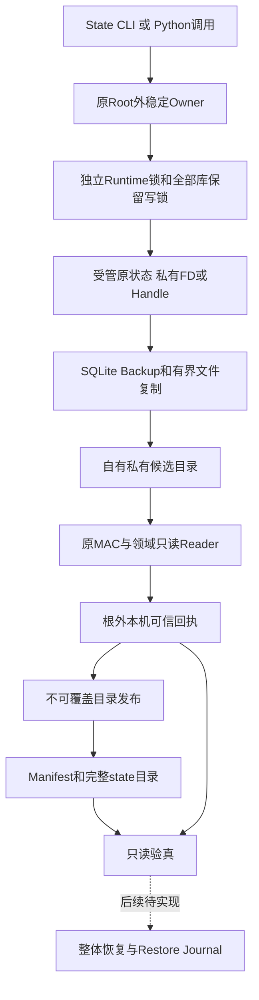
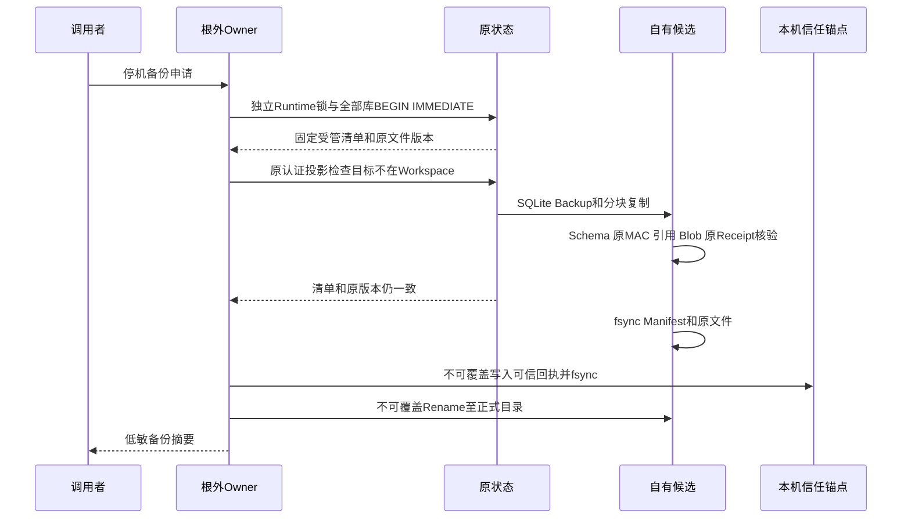
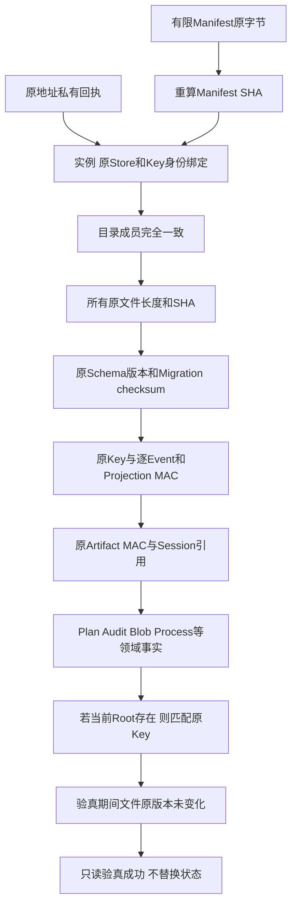
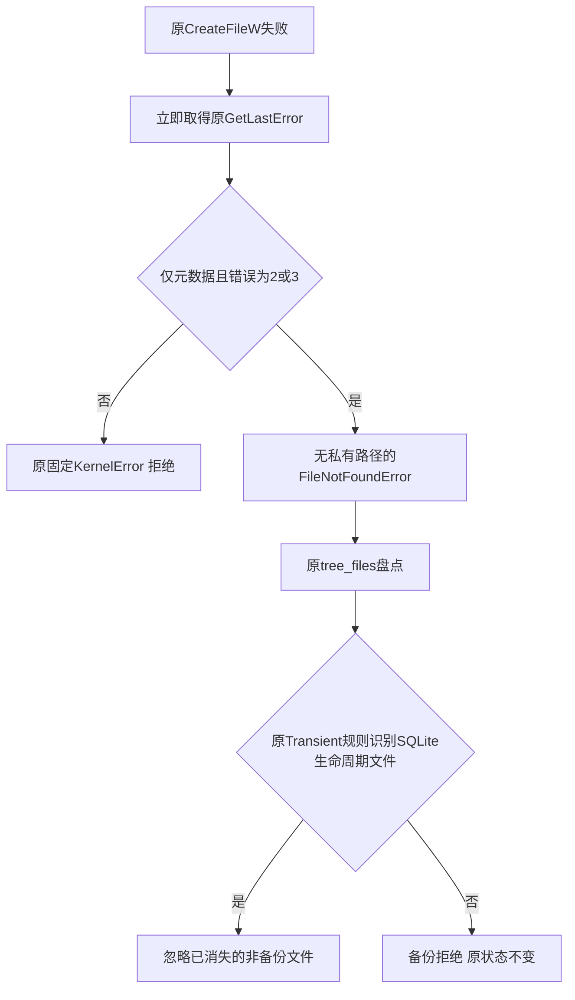

# R1：完整产品停机备份与原来源只读验真

## 1. 需求背景与交付边界

当前产品不是单个Session数据库。一次编码任务会同时产生配置事实、原认证事件、Artifact正文、
不可变执行计划、Action审计、Workspace Lease、事务Blob，以及可选的Process Lease、原Owner回执和输出。
直接复制`sessions.db`不能证明这些状态一致；盲目复制WAL也不能构成SQLite可恢复快照。
既有单库维护功能明确拒绝认证Store，不作为完整产品备份的替代方案。

本变更在[全状态Owner](m09-r1-product-state-ownership.md)之后交付：

- 停机条件下的完整受管状态捕获、SQLite Backup、私有目录不可覆盖发布；
- 原Key、Event/Projection/Artifact证明、Schema、领域记录及跨Store引用的只读核验；
- 原状态Root外的本机可信回执；原Root丢失后仍能核验已有备份；
- `harnessix state backup`和`harnessix state verify`两个正式入口。

**本固定备份切片不交付整体Root替换、Restore Journal或恢复命令。**
后继实现与原意图结算见[完整恢复详设](m09-r1-product-state-restore.md)；R1/R4整体仍开放。
POSIX和Windows复用同一完整业务状态Fixture与备份合同，实际结果按平台分别记录。
端口实现、源码存在和本机skip均不构成Windows完整产品验收。

## 2. 设计目标、不变量与非目标

| ID | 必须保持的不变量 | 原因 |
|---|---|---|
| BK-1 | 取得原根外Owner，结算唯一原工作线程后才释放 | 避免取消后残留无锁写入者 |
| BK-2 | 六个固定库全部存在；可选Process事实必须携带原Lease库 | 不允许以单库成功替代完整产品捕获 |
| BK-3 | 同时持有全部库的保留写锁；检查独立Runtime Owner | 默认产品锁不能自动约束嵌入式SQLite Writer |
| BK-4 | SQLite Backup消费已提交WAL，制品不包含WAL/SHM或OS锁 | 生命周期文件不是可恢复业务所有权 |
| BK-5 | 原MAC核验先于可信回执；不迁移、不补签、不修复孤儿事实 | 普通SHA和自带Key不能追认未知历史 |
| BK-6 | 必须从原地址根外私有锚点读取匹配回执 | 不接受备份自身提供的自签授权 |
| BK-7 | 发布目录不能覆盖已有目标；失败只清理身份仍匹配的自有候选 | 不破坏用户目录或已有可信回执 |
| BK-8 | 文件路径、目录、数量、容量与期限闭合且有限 | 禁止任意全树归档或无限文件操作 |
| BK-9 | 复制Key前拒绝与原认证Thread的Workspace重叠 | 私有备份不得落入受管Git工作区 |
| BK-10 | UNKNOWN事实原样保留；不构造Executor、不查询或杀旧PID | 备份不是效果重放或进程控制权限 |

非目标：在线备份、任意旧版本迁移、旧无证明历史重签、无可信回执自动追认、跨机或换用户Key迁移、
清理平台、远端存储服务、自动更新。首发仍必须继续实现整体停机恢复，不能以这些非目标取消R1的恢复要求。

## 3. 总体架构与信任边界



系统依然是单一Coding Agent。新增入口是停机维护命令，不是第二个服务或新的Action Plane。
根外Owner只负责合作宿主互斥；回执固定已由原Reader核验的完整备份，不是新Session身份或新Event Seal。
Manifest中的SHA用于复制完整性；回执的独立存放位置提供本机来源授权，两者不能混为一谈。

本机信任假设为当前用户私有文件、可信父目录和合作产品宿主；不把同UID恶意Python、手工复制全部Key和
信任锚点、管理员修改或非本地文件系统纳入保证。POSIX回执不是硬件绑定证明；Windows原Key仍由用户DPAPI保护。

## 4. 完整状态、布局与容量

```text
backup-directory/
  manifest.json
  state/
    product-config.db
    sessions.db
    execution-plans.db
    action-audit.db
    workspace-leases.db
    workspace-transactions/
      transactions.db
      blobs/<sha256>
    session-auth/key.v1
    process-owner/                    可选
      process-leases.db
      runs/<process-id>/
        receipt.json
        stdout.bin
        stderr.bin
```

`sessions.db`包含Protocol Request、Artifact正文、Manifest、原认证Seal和会话事件/投影，不只包含聊天记录。
Blob包括全部受管文件，已被事务引用的before/after版本必须存在并符合原长度与摘要；孤立但合法CAS Blob不被删除。
可选Process输出以原Lease和原签名回执核验，不从数字PID生成新控制权限。

原Root外的私有锚点存放`backup-<backup-id>.json`；不把此回执打包到备份作为自授权。
固定库的`-wal/-shm/-journal`、Session/Action Runtime锁、旧根内产品锁和Key初始化锁不进入制品。
这些已知生命周期文件可被最后一个只读连接合法删除；只容忍不存在，不容忍链接、宽权限或未知路径。

| 限制 | 固定值或处理 |
|---|---|
| 制品文件数 | 最多4096；扫描条目最多8192，目录也计入扫描上限 |
| 制品总大小 | 最多2 GiB，不能静默省略超限文件 |
| 单文件/单数据库 | 最多256 MiB，SQLite进度回调按页数检查 |
| Blob | 使用既有事务8 MiB单文件限制与原SHA |
| Manifest / 原Key | 最多1 MiB / 8192字节 |
| 领域行数 | 每表最多100000；受检JSON列每表合计最多64 MiB |
| 操作期限 | 默认120秒；必须有限且大于0、不超过300秒 |
| 目录/文件权限 | POSIX规范700/600、当前UID、无Darwin扩展ACL、文件单链；Windows原生私有DACL/Handle |

备份目标的父目录必须已存在且受信。备份不包含外部Workspace源码，因此不能代替用户Git仓库或代码备份。

## 5. 接口设计、类与源码导航

| 模块或接口 | 职责与调用位置 |
|---|---|
| [`state_backup.py`](../../src/harnessix/product_config/state_backup.py) | `backup_product_state`/`verify_product_backup`取得Owner，复用唯一维护IO线程，固定失败边界 |
| [`state_backup_contracts.py`](../../src/harnessix/product_config/state_backup_contracts.py) | 受管路径、闭合Manifest/Receipt、容量合同；不接受任意可执行归档 |
| [`state_backup_files.py`](../../src/harnessix/product_config/state_backup_files.py) | `PrivateStateTree`借用原Key私有对象检查；有限复制、版本核对、原生排他Rename |
| [`state_backup_validation.py`](../../src/harnessix/product_config/state_backup_validation.py) | 原Schema/Key/Session/Event/Artifact认证、Workspace目标边界；只读且不调用签发方法 |
| [`state_backup_records.py`](../../src/harnessix/product_config/state_backup_records.py) | 配置Hash链、Plan/Audit、Lease、Blob/事务、Process跨Store引用；不协调外部效果 |
| [`sqlite_readonly.py`](../../src/harnessix/sqlite_readonly.py) | `mode=ro`和`query_only`连接，既有领域Reader复用，不创建数据库或迁移 |
| [`state_backup_cli.py`](../../src/harnessix/product_config/state_backup_cli.py) | 只输出状态、备份ID、文件数、字节数；内部异常不写正文 |
| [`cli.py`](../../src/harnessix/cli.py) | 懒加载委派`state`，不改变Agent Protocol或在线产品装配 |

### 5.1 重点数据结构

| 合同/字段 | 含义与来源 |
|---|---|
| `ProductStateFile.path/kind` | 规范相对路径及其唯一受管类别；类别不能与路径不一致 |
| `size_bytes/sha256` | 自有候选的原文件长度与SHA；不是原历史公开授权 |
| `ProductStateBackupManifest.backup_id` | 独立备份实例UUID，不是Session Store ID或Owner Fence |
| `created_at/platform` | 创建时间及原Key后端类别；不能外推任意跨平台迁移 |
| `store_id/key_id` | 原Key和原Header核验后的身份，不接受制品随意指定新身份 |
| `files` | 排序且无重复的完整事实集合，六库和原Key不可缺失 |
| `ProductStateBackupReceipt.manifest_sha256` | 完整Manifest原字节摘要，来自已验证候选，固定所有成员摘要 |
| `PrivateStateTree._identity` | 当前目录对象身份；不使用目录mtime作为业务版本 |
| 原文件`revisions` | dev/inode、类型/模式、长度、链接数和修改版本；发现复制后或验真期间的漂移 |

### 5.2 只读Reader的设计决策

只读合同禁止业务写入、缺失数据库创建和Schema初始化，不承诺SQLite自身生命周期文件绝不变化。
读取已有WAL时，SQLite可能创建或删除SHM；不能使用`immutable=1`掩盖真实提交事实。
正式备份候选已规范为DELETE日志模式，验真仍核对闭合文件清单及原业务文件版本。

配置、Execution、Action Audit、Delivery及Process Store新增`read_only=True`。
该分支在父目录准备、WAL切换、Schema初始化、迁移及chmod之前返回只读连接。
领域读取继续使用原`load`、Hash链和解码器，避免复制一套Plan/Approval/Route校验实现。
完整备份验真先核对原Schema，再进入这些Reader；只读构造器本身不注册或追认未知库。
任何Writer在此连接上被SQLite拒绝，不是替代Policy或恶意同进程代码隔离。

共享端口仅依赖标准库。可读性策略明确登记五条到`sqlite_readonly`的依赖边；长度/复杂度阈值、
既有热点上限、依赖循环和公共导出限制不变。为避免既有大类增长，仅将原私有目录准备/验证函数移到
原模块，不改变Writer流程或新增第二套存储实现。

## 6. 核心流程、时序、持久化与事务数据流程





具体语义：独立Runtime锁不创建新Audit Generation；数据库保留写锁不提交业务变更；
SQLite Backup使用独立只读连接，避免从持有写事务的同一连接执行Backup造成锁冲突。
候选库切为DELETE日志模式，关闭连接后持久化单文件，再执行只读领域核验。
认证Reader验证逐Event MAC和连续Prefix，而不是只验证投影或普通SHA。
已发布Artifact校验原MAC、原Manifest与同一Thread结果引用及正文记录；已过期正文必须为NULL。

## 7. 核心业务伪代码

```text
backup(root, destination):
  validate_finite_budget()
  hold original_external_owner(root)
  run exactly_one_settled_io_worker:
    reject_existing_or_overlapping_destination()
    create_owned_private_candidate()
    list_complete_managed_layout()
    hold independent_runtime_locks_and_all_database_write_reservations:
      reject_destination_overlapping_original_authenticated_workspaces()
      capture_original_file_versions()
      backup_all_databases_and_copy_all_original_key_blobs_process_facts()
      require_unchanged_source_layout_and_versions()
      verify_original_schemas_authentication_and_cross_store_references()
    fsync_candidate_files_and_manifest()
    persist_nonoverwriting_external_trust_receipt()
    publish_directory_without_replacement()
  release_owner_only_after_original_worker_finishes()

verify(root, backup):
  hold original_external_owner(root)
  bounded_read_manifest_and_independent_local_receipt()
  require_exact_manifest_digest_identity_and_directory_members()
  require_all_file_lengths_hashes_original_schemas_and_proofs()
  require_all_references_and_no_active_workspace_or_process_lease()
  if current_root_exists: require_matching_original_key()
  require_original_file_versions_still_unchanged()
  return_summary_without_writing_or_resigning()
```

## 8. 错误分类、可观测性、取消与恢复边界

| 场景 | 行为与保留事实 |
|---|---|
| 活跃产品/独立Runtime/SQLite Writer | 拒绝；不构造Provider或Executor，不推进Owner Generation |
| 缺库、坏MAC、错Schema、缺Blob或跨Store孤儿引用 | 不发布正式目录或可信回执；原数据不修复、不补签 |
| 错当前Key/无独立回执/制品变更 | 验真拒绝，备份与当前逻辑状态不变 |
| WAL/SHM合法消失 | 仅在受管生命周期路径枚举时容忍ENOENT；SQLite仍自行消费实际提交事实 |
| 超时、父取消、重复取消 | 发送原停止信号并等待原线程及连接结算；Owner晚于原线程释放 |
| 目录/回执碰撞 | 不覆盖、不删除已有目标或已有回执；只清理身份匹配的自有目录 |
| 回执后、发布前普通异常 | 清理本次成功创建的回执和自有候选；不报告正式成功 |
| Rename已提交但fsync或返回确认失败 | 原候选地址已消失，不能证明未提交；保留原回执，不覆盖目标，使用verify判定完整事实 |
| 发布后响应前异常 | 完整备份和原回执已存在；使用verify核验，不盲目覆盖重试 |
| 强制进程终止、掉电 | 可能留下私有候选或独立回执；它们不代表恢复成功，正式验真仍需完整条件 |

取消和期限是合作期限；不能强杀内核IO。短提交段在回执耐久之后不再中途消费取消，
父任务仍先结算原线程；因此取消响应不保证正式备份一定不存在，必须依据原制品与回执核验实际结果。
磁盘不足或fsync失败不报告成功；当前状态不被替换。已有回执不因新实例ID碰撞而被清理。
清理以原候选目录身份仍在原地址为必要条件，不以发布函数是否正常返回判定Rename是否发生。
进程内验真成功只能证明当前可读完整事实，不替代掉电后的存储耐久性保证。

可观测性使用稳定Kernel错误及CLI的`status/backup_id/files/size_bytes`摘要，不输出文件正文、
原Key、Provider材料或内部异常。该状态仅表示备份/验真结果，不记录为恢复成功或商用门禁通过。
故障注入使用显式阶段回调，仅用于受管测试，正式CLI不提供此参数。

## 9. 安装部署、兼容、回退与安全操作

停止`harnessix code`、`agent-server`和直接使用同一状态的嵌入式Writer。
目标放在受信、已存在父目录下，不位于任何受管Workspace；命令不覆盖同名备份。

```bash
harnessix state backup --state-directory "$STATE_DIRECTORY" \
  --backup-directory "$BACKUP_DIRECTORY" --timeout 120
harnessix state verify --state-directory "$STATE_DIRECTORY" \
  --backup-directory "$BACKUP_DIRECTORY" --timeout 120
```

制品包含私有原Key、会话和Process事实，不进入Git、公共日志或普通诊断导出。
原Root外的信任锚点必须保留；只保留制品而丢失锚点，不会自动重新授权。
恢复使用后继正式`state restore/recover`合同，见[完整恢复详设](m09-r1-product-state-restore.md)；
不得手工逐库覆盖或用旧单库维护接口冒充完整恢复。
Windows要求规范私有DACL；完整业务状态回归与实际发行安装分别验收，
不能因几个文件端口用例或空会话恢复成功而宣称完整产品备份可用。

## 10. 测试、验收、风险与取舍

真实默认产品fixture通过正式Server、Client、Runtime、工具和认证Artifact生成六库；
真实事务产生before/after Blob；可选Process场景启动实际本机受监督子进程并核验原签名回执和输出。
Windows使用`WindowsProcessSupervisor`和原Windows执行Plan，POSIX使用原POSIX实现；
不得用POSIX能力字段替代实际Job Object及Windows Workspace事实。
不使用单库替身，不将Scripted Provider视作线上模型认证。

测试覆盖完整捕获、原证明逐字节保持、Root丢失、Key/回执拒绝、源损坏、
已提交WAL、只读连接关闭时SHM消失、复制后Blob漂移、目标不覆盖、回执碰撞、
Workspace拒绝、独立Writer拒绝、唯一线程重复取消、超时、三个普通发布故障窗口及只读Store禁止初始化。
另有真实原生Rename后确认丢失场景，验证回执保留和完整制品只读验真，不把函数返回异常视为发布未发生。
Windows端口用例继续单独验证大文件、不可覆盖目录、硬链接和Junction；macOS结果中的skip不得算作Windows通过。
完整备份与恢复两个模块不再整体跳过Windows；原生CI在宽范围回归前执行同一组84项业务用例及26项错误分类正反例，
任何平台实际失败均保留，不以新增选择器或源码存在代替实际通过。

### 10.1 Windows元数据缺失与合法错Key负对照

固定`c38e806`的[原生CI](https://github.com/carrie1988/Harnessix/actions/runs/36477355105)
实际为82通过、2失败：错Key测试破坏DPAPI密文而非生成合法错Key；
SHM在只读连接关闭后正常消失，却被底层统一转换为密钥不可用，无法进入已有的生命周期文件缺失分支。
这两个问题分别属于测试输入语义和生产错误分类，不能通过扩大允许错误码集合或吞掉所有KernelError处理。

[`WindowsKeyFiles.open`](../../src/harnessix/product_config/session_key_windows_files.py)
在CreateFileW失败后立即读取原GetLastError。只有`metadata_only=True`且错误码为2/3时返回
无文件名及私有路径的FileNotFoundError；普通密钥正文读取仍使用原固定拒绝，5/32/33等错误不会变成缺失。
错误码含义依据[Microsoft Win32官方定义](https://learn.microsoft.com/en-us/windows/win32/debug/system-error-codes--0-499-)。



**流程说明：** 原父链、Root身份、Reparse、单硬链接和DACL检查继续执行。
只有原Transient回调识别的WAL/SHM等生命周期文件可被忽略；数据库、Key、Blob及未声明文件缺失仍使备份失败。
权限或共享错误不能仅因文件后来消失而被追认为合法删除，不新增持久事实或恢复重放。

错Key测试通过原`create_private_tree`及`open_product_session_binding`创建另一临时实例的合法材料，
再替换被测当前Key文件；Windows采用原DPAPI编码，POSIX采用原明文封装。
两平台均要求原`product_backup_key_mismatch`且备份字节不变，不接受损坏格式作为错Key成功证据。
[`test_windows_metadata_contracts.py`](../../tests/product_config/test_windows_metadata_contracts.py)
覆盖两种无效Handle、缺失、普通密钥读取、权限/共享/参数错误和原排他冲突；适配器测试不替代Windows实机复验。

固定Source Revision、两种Python环境的精确结果、原RED、实际图示、Wheel字节证明、资料Manifest及评审包
见[集中验证目录](../validation/product-state-backup-2026-09-28-v1/README.md)。

后续必需：候选副本先验真、整体Root切换、原旧Root保留、Restore Journal、
崩溃结算、默认启动拒绝未决恢复以及三平台实际恢复。**本切片不关闭R1、R4或1.0。**
