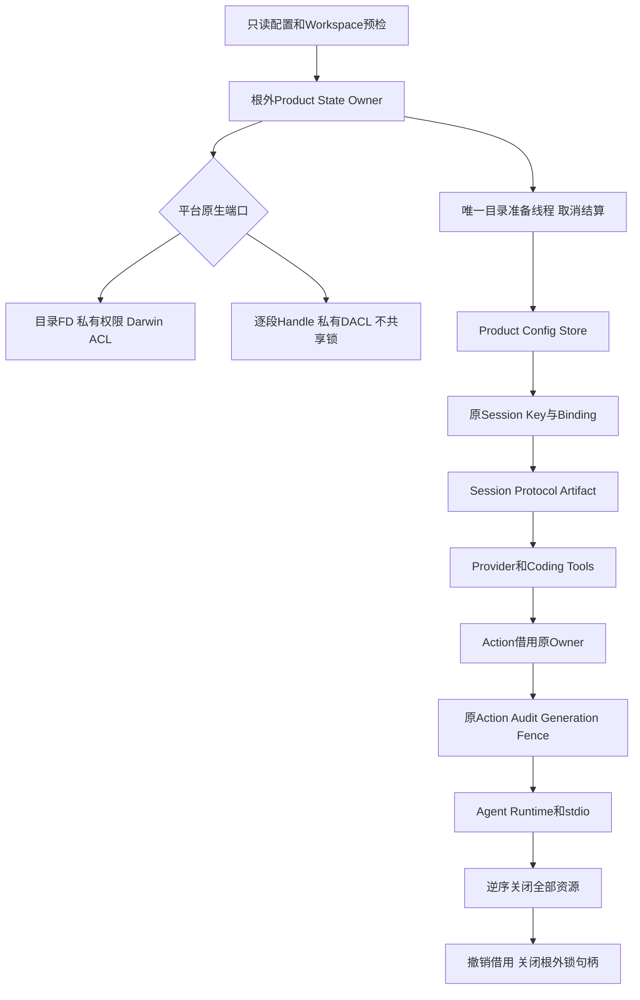
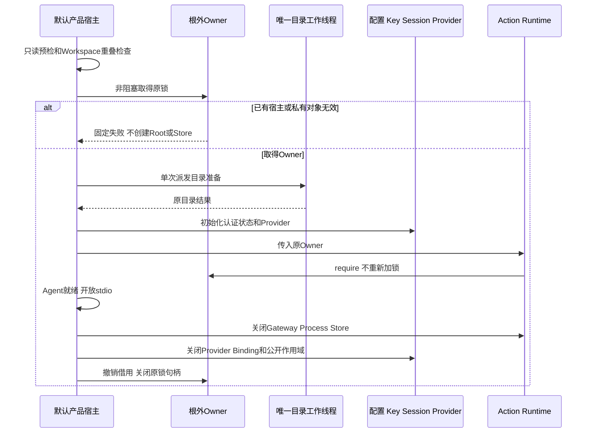
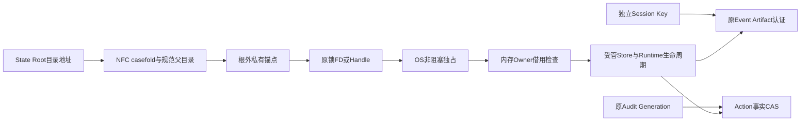

# R1：产品全状态Owner与停机静默窗口

## 1. 文档摘要与需求背景

完整产品恢复必须同时考虑配置、Session/Protocol/Artifact、执行计划、Action审计、Workspace Lease、
Delivery Blob和独立认证Key。旧产品锁位于State Root内部，并且直到Action组合根才取得。
在此之前，默认Server已经写入配置快照、加载或发布Session Key、初始化Session并构造Provider。
因此“Action锁排除了第二宿主”不能推导“全部产品状态已经静默”。

原缺口通过实际产品入口的回归复现：第一宿主持有旧Action锁，第二宿主仍到达
`SQLiteProductRuntimeConfigStore`构造。新的Owner必须覆盖这些更早的写入；根内锁也不能作为未来
完整目录切换的唯一互斥地址，否则新Root可能产生另一锁inode，或者Root暂时缺失时被重新初始化。

本变更交付根外稳定互斥、默认产品最外层装配、Action子生命周期借用和目录准备取消结算。
**它是完整备份恢复的必要前置实现，不是备份制品、恢复授权或恢复流程的完成声明。R1仍开放。**

## 2. 设计目标、约束与非目标

| 编号 | 不变量 | 约束原因 |
|---|---|---|
| OWN-1 | 默认产品在创建State Root、构造任一状态Store和Provider之前取得Owner | 不允许第二宿主先改配置或Key再发现竞争 |
| OWN-2 | 锁位于Root之外；退出不删除、替换或重建锁文件 | Root切换不能改变互斥对象，不能通过删锁绕过活跃宿主 |
| OWN-3 | Action使用默认产品的同一Owner；独立Action宿主取得同一根外锁 | 非重入文件锁不能在同一产品中重复取得，也不能保留第二套旧锁 |
| OWN-4 | 借用Owner只在原上下文存活；使用前复核互斥地址及原句柄 | 防止跨地址借用、已退出Owner复用及路径漂移 |
| OWN-5 | 父取消先结算唯一目录写入线程，再释放全状态Owner | 取消不能留下失去互斥保护的后台写入者 |
| OWN-6 | POSIX与Windows使用原生私有对象检查，不做宽权限修复或路径降级 | `chmod`不能代替DACL；符号链接、Junction和硬链接必须拒绝 |

首发约束：本机本地文件系统、同机同用户、可信父目录、合作产品宿主。新锁不建立网络服务、
运行时数据库表或新业务身份。原Session Key、Event/Artifact认证、Audit Generation及Session Runtime Owner保持独立。

非目标：在线快照、跨机器或跨用户Key迁移、旧历史补签、通用维护平台、任意嵌入式SQLite客户端自动停机、
不同程序版本并发运行、同UID恶意程序及网络/FUSE/云同步文件系统的对抗保证。

## 3. 总体架构与模块边界



| 模块 | 单一职责 | 不负责的事项 |
|---|---|---|
| [`state_owner.py`](../../src/harnessix/product_config/state_owner.py) | 地址归一、锁生命周期、非重入借用资格与固定错误 | SQLite事务、Key认证、备份来源证明 |
| [`state_owner_posix.py`](../../src/harnessix/product_config/state_owner_posix.py) | 根外父目录/锚点/锁文件原FD及权限、ACL、身份校验 | 通用文件复制、宽权限修复 |
| [`state_owner_windows.py`](../../src/harnessix/product_config/state_owner_windows.py) | 私有父目录创建、原生Handle链、DACL与独占文件 | POSIX权限模拟、Junction回退 |
| [`action_owner.py`](../../src/harnessix/product_config/action_owner.py) | 借用外层Owner或取得同一独立Owner，保留Action入口错误 | 第二套根内锁、关闭借用的外层Owner |
| [`server.py`](../../src/harnessix/product_config/server.py) | 最外层取得Owner，完整产品生命周期和目录写入线程结算 | 静默窗口内自动备份或恢复 |

私有FS校验复用现有[POSIX Key端口](../../src/harnessix/product_config/session_key_posix.py)、
[WindowsKeyFiles](../../src/harnessix/product_config/session_key_windows_files.py)及
[WindowsWorkspaceRoot](../../src/harnessix/workspace/windows.py)。锁原语仍是
[`acquire_exclusive_file_lock`](../../src/harnessix/domain/file_lock.py)，不创建通用分布式Owner平台。

## 4. 完整产品状态盘点与持久化边界

设`R`为State Root，`P`为其规范父目录。锚点为：

```text
P/.harnessix-state-owner-<SHA256(os.fsencode(NFC(R.name).casefold()))>/.lock
P/<R.name>/
    product-config.db
    sessions.db
    session-auth/key.v1
    execution-plans.db
    action-audit.db
    workspace-leases.db
    workspace-transactions/transactions.db
    workspace-transactions/blobs/<SHA256>
    process-owner/process-leases.db       # 仅装配Process Profile时存在
    process-owner/runs/<process-id>/...   # 回执和stdout/stderr二进制事实
```

| 状态 | 源码Owner | 完整备份恢复必须保留的含义 |
|---|---|---|
| Product配置库 | [`action_store.py`](../../src/harnessix/product_config/action_store.py) | 两类快照、活动指针及恢复报告，不能只导出当前配置JSON |
| Session库 | [`sqlite.py`](../../src/harnessix/session/sqlite.py)、[Artifact Store](../../src/harnessix/artifacts/sqlite.py) | 事件、投影、Protocol请求、Artifact正文/引用/原Seal；Artifact正文共用此库 |
| 独立Key | [`session_key_store.py`](../../src/harnessix/product_config/session_key_store.py) | 原Store/Key身份与认证材料；Windows为当前用户DPAPI，不从备份正文签发新信任 |
| Execution Plan | [`store.py`](../../src/harnessix/execution/store.py) | 冻结计划、批准检查点及摘要绑定 |
| Action Audit | [`store.py`](../../src/harnessix/trusted_actions/store.py) | Route、Hash链、原Operation和Owner Generation |
| Workspace Lease | [`leases.py`](../../src/harnessix/workspace/leases.py) | 原执行租约及Fencing事实 |
| Delivery | [`store.py`](../../src/harnessix/delivery/store.py) | 事务事实和全部引用Blob；只备份transactions.db会丢失正文 |
| 可选Process状态 | [`supervisor.py`](../../src/harnessix/processes/supervisor.py)、[Lease Store](../../src/harnessix/processes/supervision_store.py) | Lease、原输出和回执；历史PID不授予终止或重放权限 |

本变更不复制以上状态、不Checkpoint任何数据库、不创建备份Manifest，也不发布恢复候选。
OS锁、SQLite连接及内存Owner不属于待恢复业务事实；新互斥地址留在Root之外，不随未来备份目录复制。
既有`product-action-runtime.lock`不再取得或删除；它属于旧实现残留，不应作为当前静默证明。

## 5. 接口设计、类设计与领域契约

### 5.1 关键接口

| 接口 | 输入与输出 | 行为契约 |
|---|---|---|
| `product_state_owner(state_root)` | Root地址 → 上下文内`ProductStateOwner` | 非阻塞取得根外锁；不创建Root；退出撤销借用并关闭原句柄 |
| `state_owner_anchor(state_root)` | 已规范Root地址 → 根外锚点路径 | NFC及大小写折叠后派生；名称不是Store ID或认证证明 |
| `ProductStateOwner.state_root` | 无输入 → 取得锁时固定的Root地址 | 只读属性；不是当前Root inode或Session身份声明 |
| `owner.require(state_root)` | 待借用地址 → 无返回值 | 原上下文有效、相同互斥地址/父目录、原私有文件及句柄检查通过 |
| `product_action_runtime_lock(..., root_owner=None)` | Root及可选原Owner → 无返回值 | 默认产品只借用；独立调用取得同一锁，并保留Action竞争错误 |
| `open_default_product_action_runtime(..., root_owner=None)` | 原Action合同及可选原Owner | 新增可选宿主参数；默认产品显式传入，既有独立调用方式仍有效 |

`ProductStateOwner`不能通过普通构造器创建，也不进入JSON、公共Schema或数据库。
它不是针对同进程任意Python代码的安全沙箱；嵌入式宿主仍是受托代码。

### 5.2 重点字段和底层对象

| 字段/对象 | 含义 | 生命周期 |
|---|---|---|
| `_state_root` | 固定目录地址 | 从取得锁至上下文退出；Root inode可因受控切换变化 |
| `_active` | 借用有效性 | 退出时先设为false，再关闭底层资源 |
| `_checkpoint` | 原锁和私有目录复核闭包 | 不重新加锁，不创建文件，不读业务正文 |
| POSIX父目录FD | 锚点目录创建和路径身份的原父对象 | 当前用户拥有、Group/Other不可写；不因条目/时间变化误拒绝 |
| POSIX锚点FD | 私有700目录 | 当前用户、无Darwin扩展ACL；相对FD打开锁，拒绝最后段链接 |
| 锁文件FD/Handle | 唯一互斥对象 | 单链私有普通文件；空文件在锁内初始化为一个NUL字节，未知正文不覆盖 |
| Windows父链Handle | 原绝对路径链 | 拒绝Reparse；缺失父目录先验原存在父链再原生创建 |
| Windows私有DACL | 当前用户与SYSTEM的保护边界 | 复用现有Owner/DACL验证，不使用chmod替代 |
| `MaintenanceIOControl` | 原目录准备线程停止信号与单调期限 | 复用现有单任务结算；预算5秒，父取消优先传播原取消 |

折叠名称在区分大小写的文件系统上可能让两个不同Root共享同一锁，造成保守串行，不造成并发绕过。
不同正常目录名称可以独立运行。互斥地址不替代独立Key、Workspace Scope或数据库内容身份。

## 6. 核心流程、时序与伪代码

### 6.1 产品启动与关闭



```text
product_start:
    validate configuration and workspace without state writes
    reject lexical or resolved workspace/state overlap
    acquire external owner without creating state root
    prepare root through one shielded worker
    verify original owner
    open config -> original key/session -> provider -> tools
    enter action runtime with the same owner, not another OS lock
    activate exact product/action snapshots and open protocol
    close runtime -> action -> tools/provider -> binding/scope/config
    revoke owner -> close lock and directory handles
```

### 6.2 互斥与数据流程



地址Hash用于互斥定位，不授权Event、Artifact公开或恢复。OS锁不是可持久复制的所有权证明。
原Audit Fence仍负责旧宿主迟到提交；Root锁不替代Operation Deadline、UNKNOWN及Reconcile。

## 7. 失败、取消、超时与恢复语义

- 竞争：立即固定拒绝，不排队重试、不构造配置Store/Key/Provider、不创建State Root。
- 宽权限、ACL、链接、文件类型或未知锁正文：拒绝，保留原字节和权限，不静默修复。
- 启动失败及正常EOF：逆序关闭业务资源后释放Root Owner，锁inode及锚点保留。
- 父取消：设置原`MaintenanceIOControl`停止信号，反复取消也等待同一任务终结；不再派发另一线程。
- 目录准备完成后发现取消：允许已经完成的私有目录存在，但不打开Store；原线程终结先于锁释放。
- 5秒合作期限：在目录操作前后检查；系统内核文件调用不可强杀，故不宣称无条件5秒硬停止。
- 宿主进程死亡：OS关闭句柄并释放锁；另一个产品仍须按原Key、Schema及Action恢复合同启动。
- Root在锁内改名：原锁留在根外，第二进程仍被拒绝；这只证明互斥地址稳定，不证明恢复发布事务完整。
- 借用已关闭Owner或另一地址：固定拒绝，不重新加锁或自动生成Owner。

普通SQLite/AgentRuntime嵌入式调用不自动取得此Owner。未来备份宿主除全状态锁外，还必须确认已排空业务，
核对独立Store/Session Owner及可选Process事实，不能仅凭取得Root锁宣称所有写入者已停止。

## 8. 安全、权限与信任边界

POSIX父目录必须由当前UID拥有且Group/Other不可写，锚点700、锁600、单硬链接；Darwin扩展ACL独立检查。
校验绑定父目录、锚点及锁的原FD与当前名字；目录安全身份不绑定正常条目变化或mtime。

Windows沿用当前用户/SYSTEM私有DACL及逐段Handle链。缺失父目录通过`WindowsKeyFiles.create_directory`
创建，并立即核对DACL和类型；已有父段Junction必须在任何新目录创建之前拒绝。
锁以不共享原生Handle打开，再转换为CRT FD，关闭顺序防止句柄泄漏。

不将Root路径、锚点完整路径、Key、Provider材料、业务正文或原OS异常打印到公开错误。
可信父目录和合作宿主是显式约束；同UID恶意删除锚点、非合作原生客户端及管理员攻击不由此锁隔离。

## 9. 可观测性与错误分类

| 错误 | 意义 | 处置 |
|---|---|---|
| `product_state_busy` | 同互斥地址已有宿主 | 停止原产品并等待其退出；不得删除锁文件 |
| `product_state_owner_unavailable` | 路径/私有对象/原生端口不可用 | 检查目录归属、权限、ACL或链接；不自动修复 |
| `product_state_owner_invalid` | 借用已失效、地址不匹配或原对象漂移 | 终止当前装配，不借用新锁绕过 |
| `action_runtime_busy` | 独立Action宿主竞争 | 保持既有调用错误合同 |
| `action_runtime_owner_unavailable` | 独立Action取得Owner失败 | 保持既有调用错误合同 |
| `maintenance_io_timeout` | 目录准备工作超过合作期限 | 原工作结算后失败，不开放协议 |

业务自身抛出的错误不被映射为取得锁错误。借用资格不形成新公开诊断字段或新Schema版本。

## 10. 测试验证与验收边界

| 不变量/场景 | 测试 | 证据性质 |
|---|---|---|
| 第二产品先拒绝后Store | `test_second_product_startup_refuses_before_any_state_store` | 真实默认入口；原实现RED后新实现GREEN |
| 根外原inode、无Root创建 | `test_owner_does_not_create_root_and_keeps_same_external_lock_inode` | 实际本机OS锁和文件 |
| 借用不重入、不关闭外层Owner | `test_borrowed_action_scope_does_not_reacquire_or_close_product_owner` | 实际锁竞争 |
| Root改名仍拒绝第二进程 | `test_second_process_cannot_acquire_root_even_after_root_rename` | 实际独立子进程，不是假Owner |
| 进程死亡后释放 | `test_process_death_releases_lock_without_deleting_anchor` | 真实进程终止，不等于业务效果恢复 |
| 名称别名与不同地址 | case/Unicode及different-state测试 | 地址函数和实际互斥，不作业务身份认证 |
| 取消等待唯一原写入者 | `test_cancellation_settles_original_root_writer_before_releasing_owner` | 明确线程进入/释放同步，非固定sleep猜测 |
| POSIX宽权限/链接/漂移 | POSIX参数化测试及Darwin ACL测试 | 实际原生文件系统 |
| Windows DACL/Junction/硬链接/父链创建 | [Windows专项](../../tests/product_config/test_product_state_owner_windows.py) | 只在原生Windows运行；其他平台skip，不当作PASS |
| 原产品、Session及Action合同 | [Server](../../tests/product_config/test_server_and_cli.py)、[托管Root](../../tests/product_config/test_managed_session_root.py)、[Action恢复](../../tests/product_config/test_action_recovery.py) | 防止默认产品因重复加锁不可启动 |

回归、原失败、独立环境复验及资料Manifest须固定源码Revision。测试集合互有重叠，不累加为全仓数量。
没有完整备份制品、错Key/坏备份预检、整体Root发布崩溃恢复及三平台实际恢复证据，不关闭R1。

## 11. 源码阅读与逐步调用链

1. [`server.py`](../../src/harnessix/product_config/server.py)：从`run_product_stdio`查看只读预检、重叠拒绝、
   `product_state_owner`与`_validated_runtime_paths`，确认Owner早于Root写入。
2. [`state_owner.py`](../../src/harnessix/product_config/state_owner.py)：查看`_state_address`、
   `state_owner_anchor`、`product_state_owner`和`ProductStateOwner.require`，区分地址、互斥、业务身份。
3. 两个[POSIX端口](../../src/harnessix/product_config/state_owner_posix.py)/
   [Windows端口](../../src/harnessix/product_config/state_owner_windows.py)：查看原对象保留和权限检查，
   不将两种平台校验相互替代。
4. [`action_owner.py`](../../src/harnessix/product_config/action_owner.py)：查看借用与独立取得锁的分支，
   确认借用结束不关闭外层Owner，异常只在取得锁时转换。
5. [`action_runtime.py`](../../src/harnessix/product_config/action_runtime.py)：查看`root_owner`如何传入、
   Session初始化、独立Audit Generation及原恢复扫描；根外锁不改变Reconcile业务。
6. [`maintenance_io.py`](../../src/harnessix/session/maintenance_io.py)：查看父取消如何结算同一任务，
   再回到`server._prepare_state_root`核对停止/期限检查点。

## 12. 部署、兼容、回退与风险取舍

- 产品状态父目录必须在可信本地文件系统；POSIX当前用户拥有且不可由Group/Other写入。
- 更新前停止全部旧产品及嵌入式写入者；新旧版本不保证互斥兼容，不支持并发运行。
- 旧`product-action-runtime.lock`可保留原字节，不取得、不删除、不作为当前活跃性依据。
- 新锚点永久保持稳定地址及锁inode；卸载不应在另一个产品可能运行时删除它。
- 未修改Session/Key格式、Schema、迁移、配置合同、Task Pack或业务结果。
- Windows端口的源码实现、测试集合及本机skip不等于原生发行验收；R4仍要求实际原生核心闭环。
- 根外锁只有一个互斥对象，比外层/内层重复加锁简单；Audit Fence仍保留其不同的业务职责。
- 同机备份恢复后续必须组合全部状态和原Key、核对原来源、先验证私有候选，再在同一Owner内
  完成整体发布和崩溃结算。不得退化为逐库覆盖、普通SHA验真或仅复制Session数据库。
