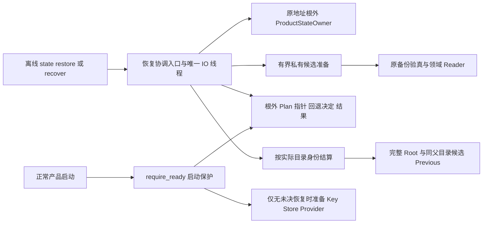
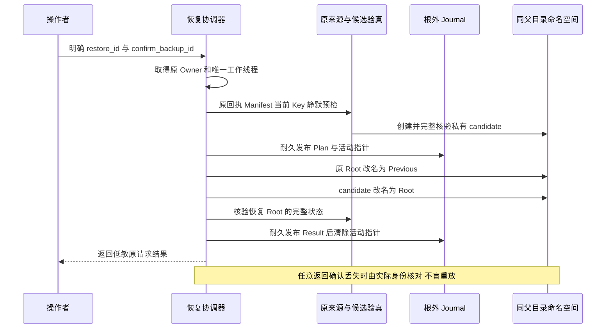
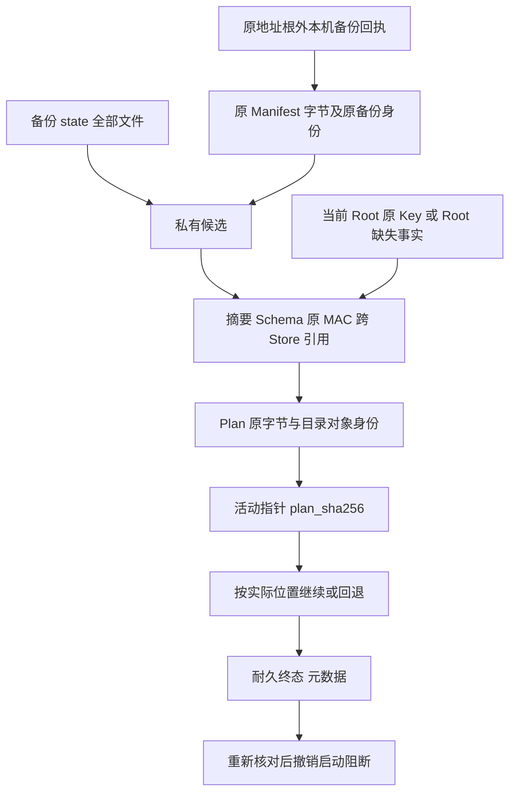

# R1：完整产品停机恢复、耐久Journal与显式回退

## 1. 需求背景、现状与交付边界

编码任务的状态由六个数据库、原独立Key、事务CAS Blob及可选Process事实共同构成。
[完整备份](m09-r1-product-state-backup.md)已建立原MAC、Schema、引用和根外回执验真，
但只读验真不能替代实际恢复。逐库覆盖可能留下新Session与旧Action Audit，或先丢失原Key再发现坏备份。
目录Rename已经提交但调用方未收到确认时，盲目重新执行又可能覆盖后继状态。

本变更交付同机同用户的**完整Root替换**、根外耐久恢复Journal、启动前未决恢复拒绝、
显式继续/回退和稳定请求ID的历史结果读取。不迁移Schema、不注册替代Key、不重签历史，
不构造Executor、不重放UNKNOWN、不控制备份中的旧PID。Workspace源码不在状态备份中；
产品状态回退不是项目代码回退。

POSIX和Windows复用完整产品恢复用例，平台文件端口另有原生负对照。共享代码和跳过用例不能证明Windows产品可用；
三平台实际安装、升级、恢复以及R1整体、R2～R6仍受各自发布退出条件约束。

## 2. 设计目标、不变量与非目标

| ID | 正式不变量 | 必要性 |
|---|---|---|
| RS-1 | 原地址根外Owner覆盖准备、目录切换、线程结算与结果记录 | Root暂时不存在时仍不能启动第二个宿主 |
| RS-2 | 原回执授权原Manifest字节；副本重新核对全部文件、Schema、MAC及引用 | 自带Key或普通SHA不能自行授予恢复权限 |
| RS-3 | 当前Root存在时必须匹配原Key；缺Key或错Key拒绝 | 不自动追认另一个实例或旧无证明状态 |
| RS-4 | 原Root改名前先耐久发布Plan及活动指针 | 任何切换中断都具有明确原意图 |
| RS-5 | 原Root整目录保留于Previous，不逐库覆盖或删除 | 可显式回到原目录对象，包括原损坏库字节 |
| RS-6 | 实际目录身份决定状态，不根据上一调用是否返回成功判断Rename | 确认丢失不等于操作没有提交 |
| RS-7 | 回退选择先落盘且粘性，不能中途改为继续恢复 | 防止跨中断出现相反方向的切换 |
| RS-8 | 活动指针存在时，正常启动先拒绝，再创建Root/Key/Store | 避免缺失窗口被误当成首次安装 |
| RS-9 | 终态结果先耐久发布，重验真实位置与完整性后才清除活动指针 | 结果文件存在不证明当前Root未损坏 |
| RS-10 | 完成且已清除指针的重复请求仅返回历史元数据 | 不用旧请求覆盖新业务状态 |
| RS-11 | 取消、超时先结算唯一原IO线程，再释放Owner | 不遗留无锁后台写入者 |
| RS-12 | 只清理尚未激活且身份匹配的自有候选 | 活动指针发布确认丢失后保留候选用于结算 |

非目标：在线一致性快照、跨机/跨用户恢复、任意旧版本迁移、自动回退、泛目录清理平台、
云服务、自动更新。非目标不能取消首发要求的停机恢复。

## 3. 总体架构、职责与源码位置



CLI复用现有`harnessix state`，没有增加HTTP/Worker服务。协调器只组织原Owner、维护IO和状态机；
准备层只负责复制和验真；Journal只负责有界不可覆盖记录；Flow只负责核对目录身份并执行必要Rename。
默认启动从同一根外活动指针得到保护，不另外引入数据库标记或恢复Daemon。

| 组件 | 源码位置 | 单一职责 |
|---|---|---|
| CLI与固定输出 | [`state_backup_cli.py`](../../src/harnessix/product_config/state_backup_cli.py) | 参数确认、调用正式API、低敏结果和固定错误 |
| 协调入口 | [`state_restore.py`](../../src/harnessix/product_config/state_restore.py) | UUID、模式、期限、Owner、重复请求及工作线程生命周期 |
| 正式合同 | [`state_restore_contracts.py`](../../src/harnessix/product_config/state_restore_contracts.py) | Plan、Pointer、RollbackDecision、Result的闭合字段 |
| 原意图持久化 | [`state_restore_journal.py`](../../src/harnessix/product_config/state_restore_journal.py) | 私有文件、计划摘要、来源授权、终态和指针清除 |
| 候选准备 | [`state_restore_prepare.py`](../../src/harnessix/product_config/state_restore_prepare.py) | 原备份复制、当前Key/Writer预检、固定私有路径 |
| 目录状态机 | [`state_restore_flow.py`](../../src/harnessix/product_config/state_restore_flow.py) | complete、rollback及终态重新核对 |
| 共享验真 | [`state_backup.py`](../../src/harnessix/product_config/state_backup.py) | 原回执、全量快照Reader、合作静默窗口 |
| Owner与启动保护 | [`state_owner.py`](../../src/harnessix/product_config/state_owner.py)、[`server.py`](../../src/harnessix/product_config/server.py)、[`action_owner.py`](../../src/harnessix/product_config/action_owner.py) | 活动指针检查先于正式宿主的状态初始化 |

## 4. 领域契约、数据结构与持久化布局

### 4.1 Plan

`ProductStateRestorePlan`由准备层创建，协调器在首次切换之前持久化；不是用户可任意提供的路径清单。

| 字段 | 类型与语义 | 来源及约束 |
|---|---|---|
| `spec_version` | 固定`harnessix.product-state-restore-plan/v1` | 未知版本拒绝 |
| `restore_id` | UUID，原请求身份 | 用户显式提供；重试沿用原ID |
| `owner_address_key` | 根外锚点名称 | 原Root叶名规范化摘要；与当前Owner匹配 |
| `parent_identity` | `(device, inode)` | 原父目录对象；恢复时不得换父目录 |
| `previous_identity` | 原Root对象身份或null | 原Root不存在时记录null，不创建空替代Root |
| `candidate_identity` | 验真后的候选对象身份 | 必须与原Root身份不同 |
| `manifest_json` | 原Manifest UTF-8字符串，最多1MiB | 保存原字节语义，不用重新序列化替代原回执摘要 |

### 4.2 Pointer、回退决定与结果

| 合同 | 重点字段 | 业务含义 |
|---|---|---|
| `ProductStateRestorePointer` | 固定版本、`restore_id`、`plan_sha256` | 原Plan字节Hash；指针与Plan必须共同有效 |
| `ProductStateRollbackDecision` | `restore_id`、`plan_sha256`、固定`mode=rollback` | 不可覆盖的方向选择，损坏不能当作未选择 |
| `ProductStateRestoreResult` | 固定版本、`restore_id`、`backup_id`、`status`、`retained_previous_state`、`completed_at` | 原请求耐久终态；时间须包含时区 |

`status`只有`restored`或`rolled_back`。`retained_previous_state=true`仅表示成功恢复保留原Root，
不表示原状态健康。`rolled_back`表示回到原目录位置；原Root原本缺失时回退后仍缺失，
原数据库损坏时仍保留原损坏字节，不伪报数据库已修复。

### 4.3 物理布局与写入边界

```text
原父目录/
  原状态Root/
  .harnessix-restore-<restore_id>.candidate/
  .harnessix-restore-<restore_id>.previous/
  .harnessix-state-owner-<原地址摘要>/
    .lock
    backup-<backup_id>.json
    restore-active.json
    restore-<restore_id>/
      plan.json
      rollback.json             # 仅明确选择回退时出现
      result.json               # 仅终态核对后出现
      record-<临时UUID>.pending  # 硬中断可能遗留，不自动泛清理
```

Owner锁文件复用既有`.lock`，Journal不重新实现锁。记录先写私有临时文件并fsync，
再复用原生不可覆盖`publish_tree`发布。Plan最大序列化记录3MiB；Pointer/Decision/Result读取上限4KiB。
POSIX清除活动指针后同步父目录。Windows复用原Handle、DACL和WRITE_THROUGH端口；
原生端口存在不构成完整Windows数据权限或实际恢复验收。

## 5. 核心流程、时序与数据流

### 5.1 正常恢复时序



准备先验原备份和当前Key，检查原Runtime锁及可读SQLite Writer，确认目标Root与候选不在原认证Workspace中。
复制所有Manifest成员到私有候选，再核对字节、Schema、原MAC和跨Store引用。
Plan及指针成功发布前不修改原Root地址。目录切换以后再次验真；终态先落盘，再解除启动阻断。

### 5.2 命名空间状态与回退

| 状态 | Root | Candidate | Previous | 可执行动作 |
|---|---|---|---|---|
| S0 已激活、未切换 | 原对象 | 验真候选 | 不存在 | complete先保留原对象；rollback维持原位置 |
| S1 原对象已保留 | 不存在 | 验真候选 | 原对象 | complete发布候选；rollback恢复原对象 |
| S2 候选已发布 | 原候选对象 | 不存在 | 原对象 | complete只验真；rollback先撤回候选再恢复原对象 |
| 终态仍有指针 | 依原结果核对 | 依原结果核对 | 依原结果核对 | 不执行新切换，验真后清除指针 |
| 终态且无指针 | 可能已有新业务 | 不作为当前事实推断 | 不作为当前事实推断 | 只返回原历史结果 |

原Root缺失时`previous_identity=null`，S0/S1均没有原对象，恢复完成不产生Previous；
回退只撤回新候选并保持Root缺失。任意陌生目录、链接、替换身份、计划Hash错配或来源回执缺失均拒绝，
不删陌生对象、不临时创建Root。回退决定先持久化，再执行S2→S1→S0；中断后只允许沿原回退方向继续。

### 5.3 授权与状态数据流



恢复权限由原根外回执授予，不由备份中的Key自签。Plan固定原Manifest，因此激活后原备份路径移动，
只要原回执和完整候选仍有效，显式结算可以继续；不存在从网上或任意文件重新获取授权的路径。
Result没有用户正文、文件内容、Key、内部路径或原始异常。

## 6. 类设计、接口设计、关键变量与核心伪代码

公共接口为`restore_product_state(root, backup, *, restore_id, confirm_backup_id, budget_seconds=120)`
及`recover_product_state_restore(root, *, confirm_restore_id, mode, budget_seconds=120)`；返回正式Result。
UUID必须为明确UUID对象，CLI完成字符串解析；期限有限且在零至300秒之间。`fault`仅为代码级故障注入端口，
不是配置选项、远程接口或运行时用户输入。

`directory_identity`返回原目录设备/对象身份，`None`明确表示缺失；`digest`固定原Plan字节；
`control`在原线程中消费取消/期限；`requested`表示已耐久选择回退，不是调用方临时偏好。

```text
restore(root, backup, stable_id, confirmed_backup):
    校验 UUID 与期限；取得根外 Owner，派发唯一 IO 线程
    require_ready：任何未决指针都要求使用显式 recover
    若 stable_id 已有结果：核对备份身份，只返回历史结果
    完整验真原备份和当前 Key；复制并验真 candidate
    发布 Plan 与 active；若失败且 active 确实不存在，仅清理原候选
    按真实目录对象身份继续完成，不按上一函数返回值推断
    保存 Result；清除 active；线程结算后释放 Owner

recover(root, confirmed_id, mode):
    若无 active：仅查询同 ID 原耐久结果；没有记录则拒绝
    核对 Pointer、Plan 原 Hash、原地址、父身份、原 Manifest 及备份回执
    若已有 Result 但 active 仍在：重验实际终态，再清除 active
    若 rollback 已选择：拒绝改为 complete
    若选择 rollback：先持久化决定，再还原原目录对象
    否则沿 S0/S1/S2 完成候选发布
    保存终态并清除 active；不执行 Agent、旧进程或未知效果
```

## 7. 失败、取消、超时、幂等与恢复语义

| 场景 | 公开行为 | 持久状态及后续操作 |
|---|---|---|
| 错备份确认、错/缺当前Key、坏备份或来源回执 | 固定拒绝，不修改原Root | 无活动指针；修正输入，不自动换Key |
| 准备复制取消/超时 | 等待唯一原线程结算 | 未激活候选按原身份清理，原Root保留 |
| Plan已写、指针未发布失败 | 不执行Root切换 | 原候选可清理；不自动删除或覆盖Journal，换新ID前核对实际状态 |
| 活动指针发布成功但确认丢失 | 保留候选和活动保护 | 使用原ID显式recover，不当作未提交清理 |
| 任一Root Rename后确认丢失 | 固定失败且保留活动保护 | 核对S0/S1/S2，只执行尚未发生的必要切换 |
| 回退中断 | 粘性决定仍在 | 原ID、`mode=rollback`继续；complete拒绝 |
| 结果已耐久，但Root丢失/损坏 | 继续拒绝，不清除保护 | 保留证据；终态文件不能追认未知状态 |
| Result已完成且无活动指针 | 返回原历史元数据 | 不核验或覆盖较新的Root，结果不是当前健康检查 |
| 强制进程退出 | OS释放原锁，记录和真实目录保留 | 新进程明确结算；准备前硬退出可能留下自有临时件 |

正常产品启动、独立Action Owner及备份/验真入口均通过`require_ready`拒绝未决恢复；
恢复入口只使用Owner基础身份检查。活动指针即使损坏也阻断启动，不将解析失败解释为可初始化状态。
Kernel固定错误保留；OS、SQLite、合同解析失败转换为固定`product_restore_invalid`，不公开原始异常。

## 8. 安全边界、取舍与替代方案

- **整体目录切换而非逐库覆盖**：保留跨库一致性和原对象，代价是同机同父目录及停机窗口。
- **根外Journal而非Root内恢复表**：Root缺失时仍有Owner和保护；不增加第二套数据库事务或控制服务。
- **显式稳定ID与显式回退而非自动重试**：确认丢失可查询原意图，不能凭一次报错重新执行。
- **原Manifest字节和原回执而非恢复时重签**：不会给旧未知历史授予新权限。
- **复用原Native发布与私有文件端口**：不重复实现平台Rename；Windows完整产品仍需原生验收。

Root Owner只约束遵守产品协议的合作宿主，静默探测在改名前关闭SQLite连接，以满足Windows文件句柄约束。
不合作的原始SQL Writer、同UID恶意程序、硬件掉电、损坏磁盘和远程/共享文件系统不被描述为已经隔离或验证。
当前损坏数据库只作为待保留原字节，不重新初始化；受支持故障测试包含非数据库字节与空文件。
候选及Previous可能包含凭据证明和业务正文，保持私有权限，不能提交到Git、上传公共诊断或直接移动至其他用户目录。

## 9. 安装、部署与正式操作

先停止使用原Root的产品实例。保留原备份与原地址根外Owner锚点，不单独移动Key或重建回执。
从`state backup`结果取得`backup_id`，为一次恢复明确生成并保存UUID，重复调用沿用同一ID。

```bash
harnessix state restore --state-directory "$STATE_ROOT" --backup-directory "$BACKUP" \
  --restore-id "$RESTORE_ID" --confirm-backup "$BACKUP_ID" --timeout 120
harnessix state recover --state-directory "$STATE_ROOT" \
  --confirm-restore "$RESTORE_ID" --mode complete --timeout 120
harnessix state recover --state-directory "$STATE_ROOT" \
  --confirm-restore "$RESTORE_ID" --mode rollback --timeout 120
```

两个recover命令是互斥方向示例，不应依次执行。未决恢复不可用新ID覆盖；明确结果后再启动产品。
成功恢复留下的Previous用于核对和保留原状态，当前没有自动GC或自动删除命令。
当前Root存在却丢Key时恢复明确拒绝；需要先在原地址之外显式保留完整原Root，
再依原地址根外回执执行缺失Root恢复，不能以删除损坏数据作为自动修复步骤。

## 10. 测试策略、源码映射与验收范围

专项[`test_product_state_restore.py`](../../tests/product_config/test_product_state_restore.py)
复用原默认stdio产品、Agent Client、真实SQLite、认证Artifact及事务CAS的Fixture，不使用单库替身。
该模块与原备份模块对POSIX/Windows均执行；Windows原生CI先运行两模块的84项完整业务状态用例及26项错误分类正反例，
再执行原宽范围回归。模型返回使用固定Scripted步骤，不访问供应商API，不降低恢复验真或私有权限要求。
原生结果需覆盖实际Artifact查询、事务Blob、可选本机Process回执及真实子进程硬退出；
源码外空会话恢复不能替代本组业务状态用例，Windows Server结果也不能外推Windows11消费者发行。
原生首轮82通过/2失败及严格元数据缺失修复见[备份详设](m09-r1-product-state-backup.md#101-windows元数据缺失与合法错key负对照)；
保留原失败，恢复本身的来源、Journal和目录切换合同不改变。

| 验证项 | 重点测试函数 | 对应组件 |
|---|---|---|
| 六库/Key/CAS整体切换和原目录保留 | `test_restore_switches_all_state_and_preserves_previous_root` | Prepare、Flow |
| 缺失Root、错/缺Key、坏备份拒绝 | `test_missing_root_restores_original_key_without_enrollment`、`test_wrong_confirmation_or_current_key_preserves_existing_root` | 原来源、当前Key |
| 启动先拒绝、四个切换中断窗口 | `test_interruption_blocks_startup_before_root_preparation_and_recovers` | require_ready、Journal、Flow |
| 实际子进程硬退出 | `test_real_process_hard_exit_recovers_original_journal` | OS锁释放及耐久记录 |
| 损坏与空库原字节保留 | `test_restore_can_replace_corrupt_current_database_without_repairing_previous` | 静默预检、Previous |
| 原始回退、缺失Root及粘性中断 | `test_explicit_rollback_returns_original_root_identity`、`test_interrupted_rollback_is_sticky_and_returns_original_identity` | 回退Decision、Flow |
| 计划/指针/来源/陌生目录拒绝 | `test_pending_recovery_rejects_tampered_source_or_foreign_directory` | Hash、原回执、对象身份 |
| 重复取消、期限与原线程结算 | `test_repeated_cancel_settles_original_worker_before_owner_release`、`test_prepare_timeout_cleans_private_candidate_and_preserves_root` | MaintenanceIOControl |
| Native Rename及指针确认丢失 | `test_native_rename_confirmation_loss_uses_actual_identity_not_retry`、`test_activation_failure_cleans_only_uncommitted_candidate` | 发布和有限清理 |
| 终态仍未解除保护 | `test_terminal_record_does_not_clear_pending_guard_for_lost_root`、`test_terminal_record_revalidates_snapshot_before_clearing_guard` | 终态再验真 |
| 历史结果不覆盖新业务 | `test_completed_request_never_overwrites_newer_state` | 稳定ID、Result |
| 产品重开及CLI双入口 | `test_restored_product_reopens_original_thread_and_artifact`、`test_cli_restore_and_recover_keep_stable_request_id` | 正式产品装配、SDK/CLI |

合作期限测试使用单维护线程受控时钟，避免依赖任意sleep；重复取消使用真实线程屏障，硬退出使用真实子进程。
这些故障注入不等于硬件断电验收。测试Provider为Scripted，仅证明恢复、引用与产品查询合同，
不作为线上模型认证、真实编码质量或Beta成绩。固定源码、独立检出、实际制品、图示和精确日志见本切片验证资料；
R1整体及R4完整三平台恢复不得从本机专项推导完成。

## 11. 兼容、可观测性与后继发布约束

旧`state backup/verify`输出合同保持；新命令不修改Agent Protocol、已有Schema、数据库迁移或效果账本。
恢复结果只输出稳定请求/备份ID、状态、原目录保留布尔值和终态时间；CLI执行期失败输出固定code/message，退出码2。
用户正文、原Key和私有日志不进入公开验证目录。只构建Wheel，不打包不受管测试或原用户状态。

后继规范Wheel专项已验证三平台实际私有权限、源码外安装、空编码场景完整恢复及卸载重装；
[原生复杂业务状态专项](../validation/windows-business-state-recovery-2026-09-29-v1/README.md)保留旧失败并取得修复后的原生业务步骤成功。
R4仍需消费者环境、真实编码闭环和不同版本升级/回退；R3仍需完整真实任务结果。
复用仍适用的既有Soak，受影响场景才重跑，不通过降低阈值或扩大支持声明关闭发布门禁。

固定源码的双Python专项/受影响回归、实际Wheel、保留失败、三图渲染与Review Packet集中于
[正式验证目录](../validation/product-state-restore-2026-09-28-v1/README.md)。
