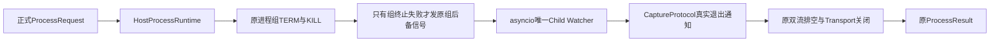
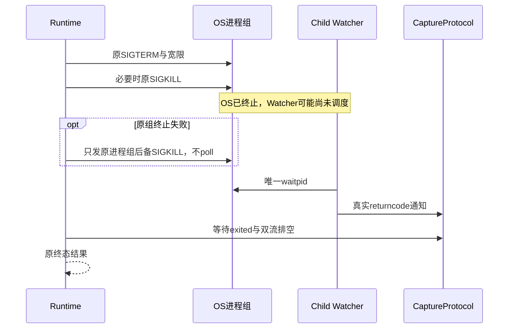
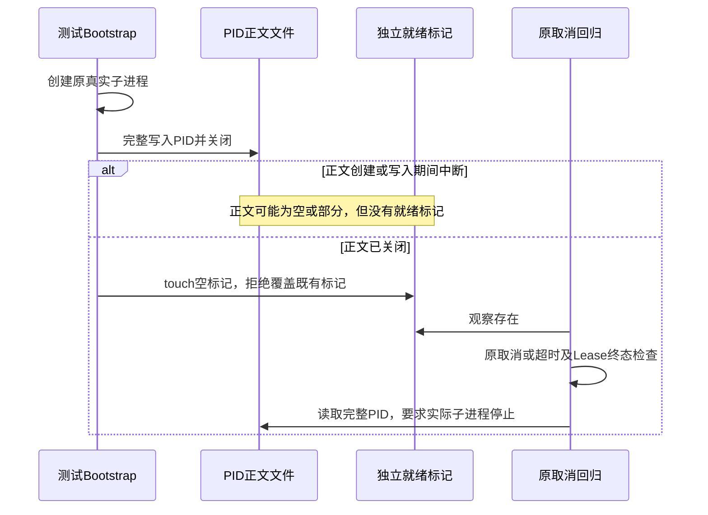
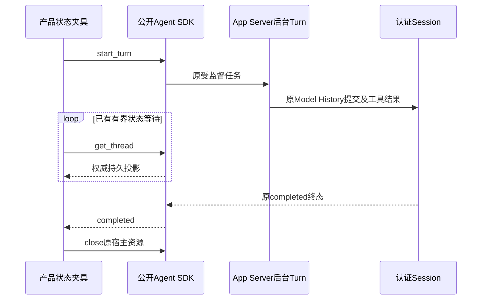

# POSIX直接子进程唯一回收与Windows独立就绪发布

## 1. 需求背景、设计目标与约束

固定`629b072`的macOS CI中，忽略SIGTERM的真实进程超时后已收到SIGKILL，但asyncio报告
`Unknown child process`并给出退出255，原测试要求真实`-SIGKILL`而失败。进程结束不等于退出状态可信；
不能将255改写成预期信号码或放宽断言。目标是保留唯一回收者、原取消排空和有界输出语义。

源码核对表明[CPython v3.12.12 BaseSubprocessTransport](https://github.com/python/cpython/blob/v3.12.12/Lib/asyncio/base_subprocess.py)
的`kill`经过`Popen.kill/send_signal`；后者可能调用`poll`并执行`waitpid`。
[ThreadedChildWatcher](https://github.com/python/cpython/blob/v3.12.12/Lib/asyncio/unix_events.py)
另以线程执行`waitpid`，若子进程已被其他路径回收，会给出255。正式代码先对进程组SIGKILL，
随后在Watcher通知尚未到达时调用Transport后备Kill，存在抢先回收窗口。

本机原生macOS3.12通过延迟实际Watcher、扩大OS终止至Watcher回收之间的窗口，稳定复现255。
这是该源码路径可产生原故障的实证，不宣称排除外部宿主自行回收的所有其他原因。

另一个固定`0813c58`的Windows CI在启动期取消测试中已完成Lease终态断言，却读取到空PID标记。
测试Bootstrap直接`write_text`，取消可发生在文件创建/截断后、正文写入前。目标是修复测试就绪事实的
发布完整性，而不是改变Windows Job Object、进程终止或可信Receipt。
固定`0cdad2b`改为临时文件Rename后，启动期取消通过，但timeout/token/task三项真实用例的Bootstrap
提前退出1；原生焦点116通过、5跳过、3失败。585字节stderr摘要不能证明具体系统错误，
因此后继原生探针只记录类别、errno与Win32数值码，不预先将其断言为共享冲突。

非目标：新增Child Watcher、改全局事件循环、推断退出码、改变Owner协议、取消预算或生产Windows执行策略。

## 2. 总体架构、模块边界、风险与取舍



[runtime.py](../../src/harnessix/processes/runtime.py)拥有原会话内PID、进程组信号和清理责任。
[CaptureProtocol](../../src/harnessix/processes/capture.py)只记录原Transport通知与有界输出。
`asyncio`拥有直接子进程的唯一`waitpid`及实际退出状态；产品不得另调`poll/wait/waitpid`。
Windows变更仅位于[原生Git取消测试Bootstrap](../../tests/tools/test_windows_git.py)及
[测试专用程序](../../tests/processes/child_ready.py)，没有修改生产Windows终止或文件系统端口。

选择失败后备复用原`os.killpg`只发信号；原组终止成功后只等待Watcher，不再重复信号。
不访问`transport._proc`或其他CPython私有句柄，不增加依赖或平台全局配置。
不改成裸`os.kill(pid)`：Watcher可能已回收而通知未被主循环处理，不能因此新增针对复用PID的直接控制路径。
它仍是既有POSIX兼容链，不提供跨重启PID安全控制；正式持久Process Owner仍使用其原身份合同。

## 3. 接口设计、数据结构与领域契约

| 元素 | 不变合同或新职责 |
|---|---|
| `_settle(transport, capture)` | 返回`none/term/kill/failed`；仍先处理原进程组、再等待退出与排空 |
| `transport.get_pid()` | 原活动子进程PID；只用于当前Runtime，不能保存后用于跨重启控制 |
| `capture.exited` | 唯一Child Watcher通知到达后完成；不是发送信号成功的证明 |
| `capture.closed` | 双流关闭完成；保持原有限排空期限和截断事实 |
| `ProcessResult.returncode` | 原Transport真实退出码；255不能伪造为0或负信号 |
| Windows测试`started.pid` | 写完整PID并关闭文件；单独存在不表示就绪，不是生产Lease或授权依据 |
| Windows测试`started` | 正文文件关闭后才创建的空标记；存在后必须读取完整PID，不能重试或忽略空正文 |

没有数据库、Schema或Fingerprint格式变化。唯一变化是后备终止调用的操作路径：
`Transport.kill → Popen.poll`改为失败后备只发原组信号，原组终止成功后直接等待Watcher。

## 4. 时序图、异常与核心伪代码



```text
沿用原进程组存在检查与TERM/KILL
原组终止成功或原组已消失：直接等待原Watcher，不再发信号
若capture.exited尚未完成且termination=failed：
    只向原会话进程组发送os.killpg(pid, SIGKILL)作为失败后备
    ProcessLookupError：目标已消失，仍等待原Watcher
    其他OSError：保持termination=failed，仍等待原Watcher与排空
等待capture.exited，不传播取消到回收任务
按原pipe_drain_seconds等待closed；必要时关闭管道但不宣称EOF
关闭Transport，等待closed；输出原ProcessResult

Windows测试Bootstrap：
    创建真实子进程
    写完整PID至started.pid并关闭文件
    创建独立空标记started，不执行路径Rename
    原测试只在started存在时读started.pid并验证子进程停止
```

后备信号权限失败仍返回`cleanup_failed/failed`并熔断实例，不变成成功；外部抢先回收仍可报告255，
本修正没有掩盖该错误。原取消、关闭、超时和输出限制继续走相同清理路径。

## 5. 安全、持久化、失败恢复与可观测性

不改变启动程序、argv、cwd、环境、FD关闭、进程组或运行时间。没有绕过审批、增加Capability或网络访问。
当前PID已存在的复用限制不扩展；跨重启控制继续由持久Owner身份负责，不能由这个兼容Runtime承诺。
等待内核回收仍不是硬实时保证，不将清理客户端结束当作OS终态。

原始CI失败、本机实际255复现及初次测试Fixture闭流未完成错误均保留。后者修正了测试双流已结束的构造，
没有删除生产排空步骤。有限公开证据不包含私有路径、Secret、进程参数正文或模型正文。

## 6. 测试设计、真实场景与源码追踪

| 场景 | 验证锚点及预期 |
|---|---|
| 后备信号成功/目标消失/权限失败/原组已消失 | `test_direct_child_fallback_preserves_single_asyncio_reaper`四参数；拒绝Transport.kill，成功回收不把原组失败改成成功 |
| 实际Watcher延迟及真实SIGKILL | `test_timeout_does_not_steal_delayed_native_child_watcher`；真实退出必须-9，且后续waitpid明确无子进程 |
| 超时、Token/Task重复取消、关闭、进程组及输出 | 原`tests/processes`和`tests/sandbox`完整关联回归 |
| Windows启动期取消与子进程停止 | 原`test_windows_git_owner_timeout_and_cancellation_leave_no_active_lease`全部四参数；原原生CI验证 |
| 正文完成前中断与独立就绪发布 | `test_child_pid_closes_before_separate_ready_marker`正常、空值、部分正文、完整正文后中断四参数；只有正常闭文件后发布就绪 |
| 实际绑定Workspace的发布前置 | `test_windows_git_readiness_publication_with_pinned_workspace`；旧路径Rename只诊断，新正文/标记必须真实通过 |
| 正式Process Action输入 | 原`tests/product_config/test_process_action.py`；Schema和审批边界不变 |

新五项焦点与关联回归须按后继实际结果记录，不是三平台完整回归或Windows消费者验收。
新原生矩阵的结果必须独立记录，不能继承原失败Job中已通过的其他步骤。

## 7. 部署、兼容与回退

随原Wheel发布，无新参数、状态迁移或进程服务。旧包仍可读原持久状态；回退恢复旧代码也恢复该竞争风险，
不能称为缺陷关闭。只再生成当前派生可读性报告；冻结策略、初始基线、类长度、Schema及公共API保持。
实际部署仍使用原安装、停机备份和版本回退流程。该专项不替代真实质量、消费者Windows11、独立Beta或最终同候选发布门禁。

## 8. Windows测试Bootstrap的两阶段就绪合同



就绪事实是发布顺序，不要求两个文件的事务性替换或跨崩溃持久提交。PID正文与标记均只属于新建测试Workspace。
PID正文关闭前没有标记；正文已关闭但标记尚未创建时仍未就绪。启动期取消可以留下正文，但不得据此读取PID。
发布标记后正文不再修改；消费者不轮询猜测部分数字，不跳过已就绪后的空值或退出检查。
这不是生产Receipt、State备份或通用文件发布算法，也没有改变Workspace的原生Share/DACL合同。

原生探针对固定Workspace与EXE持有与正式Git一致的句柄，再由独立解释器尝试旧路径Rename和新两阶段发布。
旧Rename的成功或系统拒绝是有限诊断事实，不能作为产品通过依据；新PID/标记的完整事实必须成功。
仅输出固定阶段、`status/error_type/errno/winerror`和布尔结果，不输出异常正文、路径、argv、环境或凭据。
探针没有长寿命后代，不替代原四模式Job树回收用例。所有生产代码、时间上限与退出断言保持不变。

## 9. 原生结果与产品测试观测边界

固定`850c7ba`的[原生CI](https://github.com/carrie1988/Harnessix/actions/runs/36634123881)
工具/Git/取消焦点138通过、5跳过，包含18项严格输入反馈测试。
低敏探针在同样固定Workspace下取得旧Rename的`PermissionError/errno=13/winerror=32`，
而完整PID关闭后的独立就绪标记真实成功。该探针明确当前旧Rename的分享冲突，不回推旧候选未保存的stderr正文。

同Job完整备份/恢复为109通过、1项SETUP错误，后续核心步骤未执行，因此不是完整Windows GO。
共享[`complete_state`](../../tests/product_config/test_product_state_backup.py)在执行恢复测试之前，
以五秒`asyncio.timeout`直接`gather` App Server私有`_tasks`；期限到达后把观察者取消传入后台Turn，
原生日志停在Model History的实际SQLite commit等待。
五秒是测试夹具自设观察期限，不是产品正式120秒Turn预算、存储SLA或恢复验收指标。
此证据不证明原生存储超过五秒的具体原因，也不将Windows失败归为已证实的数据库死锁。



后继两个同构产品夹具复用已有[`wait_for_turn_status`](../../tests/helpers.py)，
只观察公开持久投影，不读取或直接await私有任务表；观察失败不再通过gather取消业务任务。
已有30秒观察上限与失败/取消终态立即拒绝保持；只接受completed，不用close代替同步，
finally仍按原宿主close合同排空或终止任务。没有增加新等待平台、改产品预算或削减恢复断言。

[`test_state_fixture_readiness.py`](../../tests/product_config/test_state_fixture_readiness.py)
直接运行同一真实产品夹具，在Model History实际事务的commit await与Provider stream两处分别用屏障暂停。
保持超过原五秒窗口：旧夹具两项均RED，取消确实传播；后继必须不取消后台Task，释放后真实完成认证状态与Artifact。
这些控制实验验证观察者取消耦合和修正边界，不声称复现原生磁盘延迟的全部原因。
新测试纳入原生完整备份步骤，原109通过/1错误记录保留；新同候选Windows结果独立等待。
验证及原件摘要见[统一交付](../validation/chat-terminal-diagnostics-2026-09-30-v1/README.md)。

## 10. 原生验收进程分组与完整性

固定`65d7323`的[CI 36638990646](https://github.com/carrie1988/Harnessix/actions/runs/36638990646)
在旧五分钟组合步骤完成35项备份、2项观察者屏障、42项恢复，共79项通过，原未决恢复Manifest用例也通过。
此后在继续执行时被CI步骤总期限中断；26项元数据及剩余7项恢复没有完整结果，不能记为跳过或通过。
KeyboardInterrupt后的pytest清理异常不作为产品恢复算法根因；原完整Job仍失败。

后继仅拆分[同一工作流](../../.github/workflows/ci.yml)：备份/观察者37项，恢复/元数据75项。
两步分别保持原五分钟进程保护、60秒faulthandler诊断，全部原112个参数展开Node ID各出现一次。
单步CI进程期限是编排保护，不是产品120秒Turn预算、恢复Operation期限或商用SLA；产品与用例源码不变。
这不是取消故障测试、拉长业务期限、跳过慢例或将旧79项前缀登记为完整验收。

[工作流回归](../../tests/governance/test_installed_product_acceptance.py)
`test_windows_state_focus_preserves_all_files_and_original_step_deadlines`冻结两组文件、参数与原步骤期限。
实际pytest收集比较原组合与两组完整Node ID集合，要求112项全等、零重复；不凭文件名计数替代参数展开。
原生跟踪与收集原件摘要见[附录](../validation/chat-terminal-diagnostics-2026-09-30-v1/native-followup.json)。
