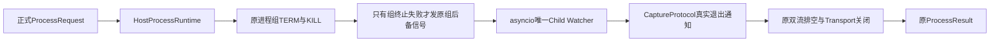
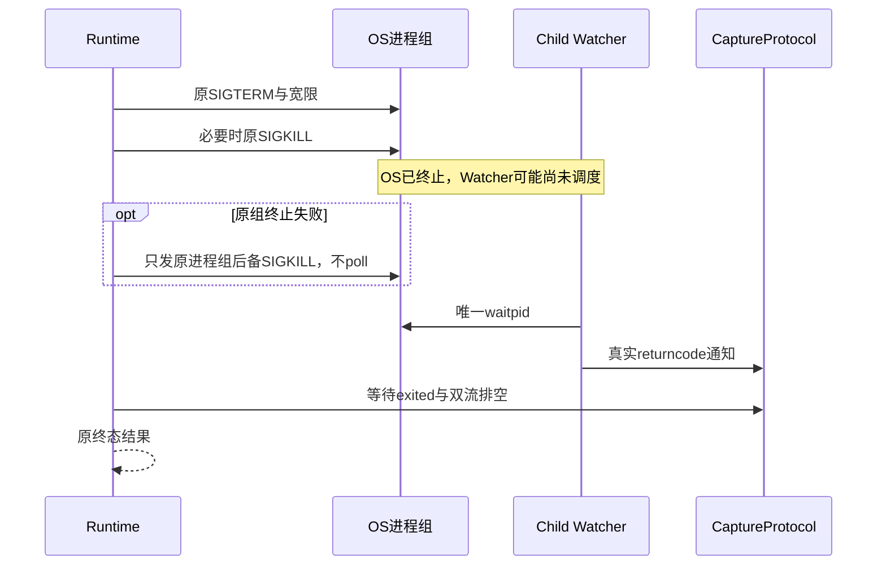

# POSIX直接子进程唯一回收与Windows测试标记原子发布

## 1. 需求背景、设计目标与约束

固定`629b072`的macOS CI中，忽略SIGTERM的真实进程超时后已收到SIGKILL，但asyncio报告
`Unknown child process`并给出退出255，原测试要求真实`-SIGKILL`而失败。进程结束不等于退出状态可信；
不能将255改写成预期信号码或放宽断言。目标是保留唯一回收者、原取消排空和有界输出语义。

源码核对表明[CPython v3.12.12 BaseSubprocessTransport](https://github.com/python/cpython/blob/v3.12.12/Lib/asyncio/base_subprocess.py)
的`kill`经过`Popen.kill/send_signal`；后者可能调用`poll`并执行`waitpid`。
[ThreadedChildWatcher](https://github.com/python/cpython/blob/v3.12.12/Lib/asyncio/unix_events.py)
另以线程执行`waitpid`，若子进程已被其他路径回收，会给出255。正式代码先对进程组SIGKILL，
随后在Watcher通知尚未到达时调用Transport后备Kill，存在抢先回收窗口。

本机原生macOS3.12通过延迟实际Watcher、扩大OS终止至Watcher回收之间的窗口，稳定复现255。
这是该源码路径可产生原故障的实证，不宣称排除外部宿主自行回收的所有其他原因。

另一个固定`0813c58`的Windows CI在启动期取消测试中已完成Lease终态断言，却读取到空PID标记。
测试Bootstrap直接`write_text`，取消可发生在文件创建/截断后、正文写入前。目标是修复测试就绪事实的
发布原子性，而不是改变Windows Job Object、进程终止或可信Receipt。

非目标：新增Child Watcher、改全局事件循环、推断退出码、改变Owner协议、取消预算或生产Windows执行策略。

## 2. 总体架构、模块边界、风险与取舍



[runtime.py](../../src/harnessix/processes/runtime.py)拥有原会话内PID、进程组信号和清理责任。
[CaptureProtocol](../../src/harnessix/processes/capture.py)只记录原Transport通知与有界输出。
`asyncio`拥有直接子进程的唯一`waitpid`及实际退出状态；产品不得另调`poll/wait/waitpid`。
Windows变更仅位于[原生Git取消测试Bootstrap](../../tests/tools/test_windows_git.py)。

选择失败后备复用原`os.killpg`只发信号；原组终止成功后只等待Watcher，不再重复信号。
不访问`transport._proc`或其他CPython私有句柄，不增加依赖或平台全局配置。
不改成裸`os.kill(pid)`：Watcher可能已回收而通知未被主循环处理，不能因此新增针对复用PID的直接控制路径。
它仍是既有POSIX兼容链，不提供跨重启PID安全控制；正式持久Process Owner仍使用其原身份合同。

## 3. 接口设计、数据结构与领域契约

| 元素 | 不变合同或新职责 |
|---|---|
| `_settle(transport, capture)` | 返回`none/term/kill/failed`；仍先处理原进程组、再等待退出与排空 |
| `transport.get_pid()` | 原活动子进程PID；只用于当前Runtime，不能保存后用于跨重启控制 |
| `capture.exited` | 唯一Child Watcher通知到达后完成；不是发送信号成功的证明 |
| `capture.closed` | 双流关闭完成；保持原有限排空期限和截断事实 |
| `ProcessResult.returncode` | 原Transport真实退出码；255不能伪造为0或负信号 |
| Windows测试`started` | 完整子进程PID正文经同目录Replace后才可见；不是生产Lease或授权依据 |
| 临时测试标记 | 只在测试Workspace；取消前未发布时可以残留，不能当作完整PID |

没有数据库、Schema或Fingerprint格式变化。唯一变化是后备终止调用的操作路径：
`Transport.kill → Popen.poll`改为失败后备只发原组信号，原组终止成功后直接等待Watcher。

## 4. 时序图、异常与核心伪代码



```text
沿用原进程组存在检查与TERM/KILL
原组终止成功或原组已消失：直接等待原Watcher，不再发信号
若capture.exited尚未完成且termination=failed：
    只向原会话进程组发送os.killpg(pid, SIGKILL)作为失败后备
    ProcessLookupError：目标已消失，仍等待原Watcher
    其他OSError：保持termination=failed，仍等待原Watcher与排空
等待capture.exited，不传播取消到回收任务
按原pipe_drain_seconds等待closed；必要时关闭管道但不宣称EOF
关闭Transport，等待closed；输出原ProcessResult

Windows测试Bootstrap：
    创建真实子进程
    同目录临时文件写完整PID
    Replace发布started
    原测试只在started存在时读完整PID并验证子进程停止
```

后备信号权限失败仍返回`cleanup_failed/failed`并熔断实例，不变成成功；外部抢先回收仍可报告255，
本修正没有掩盖该错误。原取消、关闭、超时和输出限制继续走相同清理路径。

## 5. 安全、持久化、失败恢复与可观测性

不改变启动程序、argv、cwd、环境、FD关闭、进程组或运行时间。没有绕过审批、增加Capability或网络访问。
当前PID已存在的复用限制不扩展；跨重启控制继续由持久Owner身份负责，不能由这个兼容Runtime承诺。
等待内核回收仍不是硬实时保证，不将清理客户端结束当作OS终态。

原始CI失败、本机实际255复现及初次测试Fixture闭流未完成错误均保留。后者修正了测试双流已结束的构造，
没有删除生产排空步骤。有限公开证据不包含私有路径、Secret、进程参数正文或模型正文。

## 6. 测试设计、真实场景与源码追踪

| 场景 | 验证锚点及预期 |
|---|---|
| 后备信号成功/目标消失/权限失败/原组已消失 | `test_direct_child_fallback_preserves_single_asyncio_reaper`四参数；拒绝Transport.kill，成功回收不把原组失败改成成功 |
| 实际Watcher延迟及真实SIGKILL | `test_timeout_does_not_steal_delayed_native_child_watcher`；真实退出必须-9，且后续waitpid明确无子进程 |
| 超时、Token/Task重复取消、关闭、进程组及输出 | 原`tests/processes`和`tests/sandbox`完整关联回归 |
| Windows启动期取消与子进程停止 | 原`test_windows_git_owner_timeout_and_cancellation_leave_no_active_lease`全部四参数；原原生CI验证 |
| 正式Process Action输入 | 原`tests/product_config/test_process_action.py`；Schema和审批边界不变 |

新五项焦点与关联回归须按后继实际结果记录，不是三平台完整回归或Windows消费者验收。
新原生矩阵的结果必须独立记录，不能继承原失败Job中已通过的其他步骤。

## 7. 部署、兼容与回退

随原Wheel发布，无新参数、状态迁移或进程服务。旧包仍可读原持久状态；回退恢复旧代码也恢复该竞争风险，
不能称为缺陷关闭。只再生成当前派生可读性报告；冻结策略、初始基线、类长度、Schema及公共API保持。
实际部署仍使用原安装、停机备份和版本回退流程。该专项不替代真实质量、消费者Windows11、独立Beta或最终同候选发布门禁。
