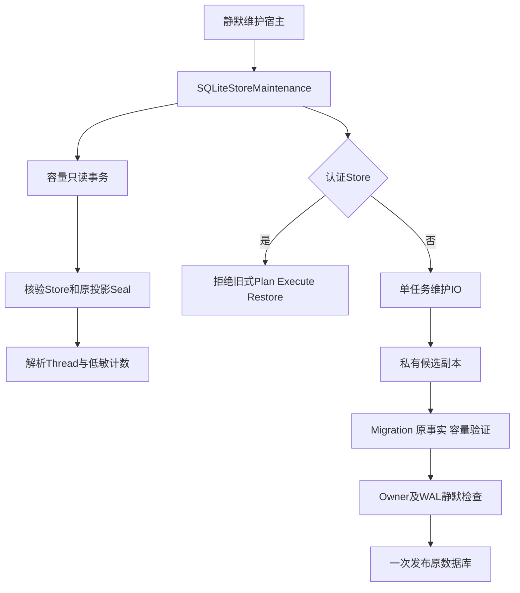
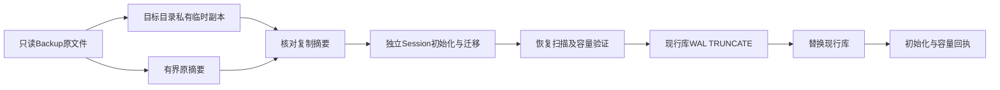
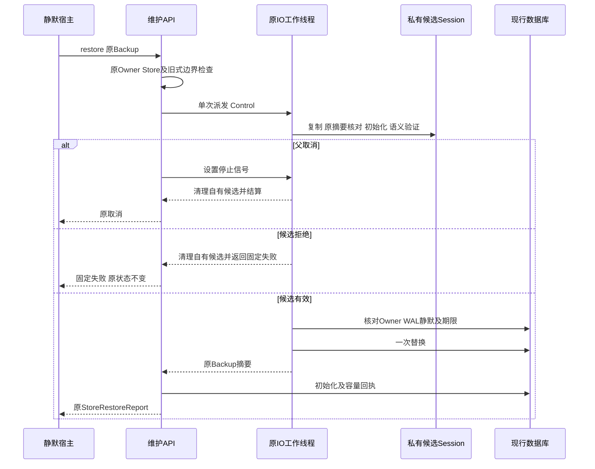

# R1：认证容量读取与旧式维护安全边界

## 1. 摘要与需求背景

默认产品已使用独立Session Key认证事件、Thread投影和新Artifact正文。早期维护模块只校验普通SHA，
其Plan、Progress和单SQLite备份没有匹配的独立来源证明；继续使用这些事实授权删除或恢复会绕过当前产品的数据边界。
旧式恢复还在候选Schema及Session事实验证之前替换现行数据库，异步调用取消也不能停止裸`to_thread`的文件工作。

本变更完成三项有限整改：认证容量先验原证明；认证Store拒绝旧式变更维护；旧式库恢复先在候选副本验证，
合作期限和父取消结算同一工作线程。它不新增通用维护平台，也不宣称默认产品的完整状态/Key备份已经交付。

## 2. 设计目标、约束与非目标

1. 容量诊断不得把重算普通SHA后的伪造投影当作真实Thread。
2. 认证Store仍可读取低敏容量；旧Plan/Progress不能成为删除、续跑或恢复授权。
3. 错误Key、认证备份、坏Migration或损坏投影在替换当前库之前拒绝。
4. 父取消后停止原工作并等待结算，不返回后仍留下写入者，不发起第二次复制。
5. 备份及SQLite操作有明确大小和合作期限；失败关闭，不覆盖竞争者发布的文件。
6. 复用现有认证和SQLite合同，不新增表、不签发旧历史的新证明。

非目标：认证Plan/GC、跨机恢复、Key导出/轮换、完整产品目录备份、在线恢复或新维护CLI。
旧式恢复仍要求单Runtime Owner和宿主已排空业务操作；单文件锁不能替代同进程静默窗口。

## 3. 总体架构与模块边界



| 源码 | 职责 | 不承担的职责 |
|---|---|---|
| [`capacity.py`](../../src/harnessix/session/capacity.py) | 在调用方读事务内核对事实、统计容量 | 重新签名、修复历史或清理数据 |
| [`maintenance.py`](../../src/harnessix/session/maintenance.py) | 原维护API、Owner及认证边界 | 文件复制和候选迁移细节 |
| [`maintenance_io.py`](../../src/harnessix/session/maintenance_io.py) | 原任务停止信号、合作期限及取消结算 | 派发重试或释放Runtime Owner |
| [`maintenance_restore.py`](../../src/harnessix/session/maintenance_restore.py) | 候选Session语义预检、宿主恢复流程 | 公共产品全状态恢复 |
| [`maintenance_backup.py`](../../src/harnessix/session/maintenance_backup.py) | 有界Hash、复制、SQLite备份及一次发布 | 授予备份来源信任 |
| [`maintenance_execution.py`](../../src/harnessix/session/maintenance_execution.py) | 原批次事务及防绕过拒绝 | 认证GC或新的维护状态机 |

正式认证来自[`sqlite_publication.py`](../../src/harnessix/session/sqlite_publication.py)和
[`SessionPublicationBinding`](../../src/harnessix/session/store_publication.py)，不复制HMAC实现。

## 4. 类设计、接口设计与数据结构

### 4.1 关键接口

| 接口 | 输入/输出 | 核心约束 |
|---|---|---|
| `snapshot()` | 原`StoreCapacityReport` | 无需Owner；认证Store使用原Binding，在解析前核验 |
| `plan/load_plan/progress/execute/restore` | 原维护合同 | 有Binding时固定拒绝；不返回未经证明的Plan事实 |
| `load_thread_facts(database, publication)` | 只读事务、可选原Binding → `ThreadFact`集合 | Store身份、孤立事件、每行原Seal先于Thread解析 |
| `run_maintenance_io(operation, budget_seconds=30)` | 合作工作 → 原结果 | 一次派发；取消后原任务结束才向父传播取消 |
| `restore_database(...)` | 源/目标、候选验证、Owner检查、Control、Fault → 原备份摘要 | 先复制验证，后静默检查及一次替换 |

这些端口不新增公共Schema。认证Store的旧式维护拒绝不是“清理成功”或“恢复完成”。

### 4.2 重点类与字段

| 类型/字段 | 含义与生命周期 |
|---|---|
| `MaintenanceIOControl._deadline` | 从单调时钟计算的原期限；阶段切换不刷新 |
| `MaintenanceIOControl._cancelled` | 父任务与原工作线程共享的`threading.Event`停止信号 |
| `checkpoint()` | 在分块、备份进度、候选验证和发布边界检查停止/期限 |
| `interrupt()` | SQLite进度回调返回0/1；中断后由上层转换为固定原因 |
| `ThreadFact.thread` | 原投影验真、普通摘要及事件序号检查后解析的领域对象 |
| `ThreadFact.snapshot_sha256` | 普通一致性摘要，不是独立来源证明 |
| `publication` | 原Store/Key/当前公开保护绑定；不能从数据库正文自动构造 |
| `owner` | 原Runtime Owner对象身份；候选验证后、发布前及返回前重新核对 |
| `MAX_BACKUP_BYTES` | 256 MiB旧式单库操作上限；超限固定拒绝，不无界Hash或复制 |
| `MAX_PROJECTION_BYTES` | 复用64 MiB原投影上限；认证查询截断超限输入，验真拒绝后不解析 |

### 4.3 持久化与数据流程



候选迁移只修改自有副本，原Backup不被迁移。现行库在候选通过之前不Checkpoint或替换。
认证Plan/Progress和Key格式不发生变化；原数据库迁移仍止于0030。
单文件SHA只证明复制一致，不能证明跨Store一致性、Key归属或恢复授权。

## 5. 核心流程、时序与伪代码

### 5.1 认证容量

```text
begin read transaction
verify original Store identity with supplied Binding
reject Event rows whose Thread projection is missing
stream bounded projection rows
    parse only row identity
    verify original projection Seal before Thread JSON parsing
    validate ordinary digest, event count and last sequence
    build ThreadFact
combine Session / Protocol / Artifact counters
return report without IDs, paths or business bodies
```

### 5.2 候选恢复与取消



```text
legacy_restore:
    reject current authenticated Binding
    verify current Store through original Session connection
    resolve source; reject source == target
    owned_worker:
        verify bounded Backup application_id / quick_check / digest
        copy to exclusive same-directory temporary file; fsync
        require copied digest == original digest
        initialize and validate candidate Session, recovery facts and capacity
        require original Owner; check cancellation/deadline
        require current WAL checkpoint is not busy
        recheck Owner and cancellation/deadline
        replace once; fsync parent where supported
        finally remove only owned temporary files
    recheck Owner; initialize current Store; return capacity
```

取消和确认丢失均不启动第二个恢复任务。发布后的确认故障可能已经改变当前库，宿主应读取当前持久事实；
不得因为客户端没收到回执而自动重放恢复。

## 6. 失败语义与安全边界

| 情形 | 固定判定 | 副作用约束 |
|---|---|---|
| 认证Store旧式维护 | `maintenance_authenticated_unavailable` | 不保存Plan，不创建Backup，不删除或替换 |
| 错Key/缺Binding/无来源证明 | 现有`publication_key_unavailable`或`publication_history_unproven` | 不降级为普通SHA校验 |
| 孤立Event/坏投影 | `projection_corrupt`等现有Session错误 | 不隐去孤立业务事实 |
| 坏Schema/Migration/Projection候选 | 原Session初始化/恢复错误 | 原库及原Backup不被候选迁移修改 |
| Backup缺失/损坏/复制漂移 | `maintenance_backup_missing/invalid` | 不发布候选 |
| 文件或SQLite备份超过上限 | `maintenance_backup_limit` | 清理自有候选，不无界读取 |
| 合作期限耗尽 | `maintenance_io_timeout` | 原任务退出，不能以重试刷新期限 |
| 父取消 | 原`CancelledError` | 等待原任务结束；重复取消不跳过清理 |
| 活跃WAL读者阻止静默 | `maintenance_restore_busy` | 不替换原数据库 |
| Owner关闭或漂移 | `maintenance_runtime_required` | 发布前拒绝；不取得第二Owner |
| 竞争者已发布Backup | 原存储错误 | `os.link`不覆盖竞争者目标，只清理自有临时文件 |
| 发布后确认丢失 | 原失败保留 | 已发布事实不回滚、不自动恢复第二次 |

`closing(sqlite3.connect(...))`关闭实际句柄，避免将SQLite连接上下文管理器误当作关闭操作；
URI使用`Path.as_uri()`编码空格、`#`、`%`等字符。POSIX临时文件为0600；旧式库路径由受信宿主提供，
这不是对同UID恶意进程、网络文件系统或任意外部备份的通用导入安全声明。

## 7. 可观测性与部署

沿用低敏容量、原摘要及固定错误，不输出Thread ID、路径、正文或Key。
认证Store的拒绝可定位为维护合同不受支持，不能把拒绝描述为容量或Session整体不可用。
本变更无额外服务、中间件、网络或环境变量；公开产品不新增维护命令。
认证产品的停机完整状态/原Key备份及实际三平台恢复继续属于R1/R4，不能使用本单库端口代替。

## 8. 测试用例、源码映射与验收

[`test_store_maintenance_boundary.py`](../../tests/agent/test_store_maintenance_boundary.py)使用真实SQLite、Runtime、
原认证Binding和实际WAL读视图；关键用例如下：

| 测试 | 验证内容 |
|---|---|
| `test_forged_projection_with_recomputed_plain_hash_is_rejected` | 合法/非法JSON且重算SHA，仍先由原Seal拒绝 |
| `test_authenticated_unproven_maintenance_is_refused_without_writes` | 五个入口均拒绝且Plan、数据库和Backup不变 |
| `test_capacity_without_binding_cannot_downgrade_authenticated_store` | 原认证库不能改用无Key读取 |
| `test_orphan_event_cannot_disappear_from_capacity_report` | 认证与旧式库的孤立Event均不能被计数隐藏 |
| `test_keyed_backup_is_refused_before_overwriting_legacy_target` | 认证备份不能降级导入旧式目标 |
| `test_invalid_restore_candidate_preserves_current_database` | Migration摘要、未来Schema、缺投影、坏摘要均不覆盖原库 |
| `test_restore_cancellation_settles_original_worker_and_cleans_stage` | 重复父取消仍结算原任务并清理候选 |
| `test_actual_wal_reader_prevents_restore_publication` | Runtime真实提交产生WAL，旧读者阻止替换；不是同值UPDATE替身 |
| `test_post_publication_fault_does_not_blindly_restore_again` | 发布确认丢失后原事实可读且没有自动重放 |
| `test_racing_backup_publication_never_overwrites_existing_file` | 竞争者目标原字节保留 |

认证Artifact两项集成夹具以`str(tools.workspace_root)`创建Thread，使用实际端口原生规范路径；
不以POSIX字符串冒充WindowsWorkspace身份，也不改变生产路径校验。

本地验收包含27项新增边界用例、804项Agent/Artifact回归、完整源码Mypy和可读性检查。
它不等于Windows当前Revision执行成功、完整产品备份、真实Provider或1.0发布通过；平台结果须绑定实际CI候选。

## 9. 兼容、回退与剩余风险

普通库保留原API及Plan-first合同；认证库明确拒绝原来没有来源证明的维护授权。
不向公共Schema增加维护功能开关，不通过配置让默认产品恢复未经证明的旧式GC。
回退代码不能撤销已知边界；需停机保留现行状态、原Key和原失败记录。
完整产品备份、R3真实编码质量、R2权利和三平台发行仍未关闭。

## 10. 变更记录

| 版本 | 日期 | 内容 |
|---|---|---|
| 1 | 2026-09-28 | 认证容量验真、旧式维护拒绝、候选副本预检、工作线程取消/期限与恢复故障回归 |
