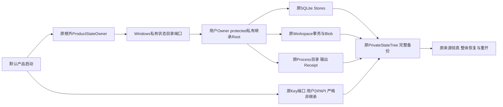
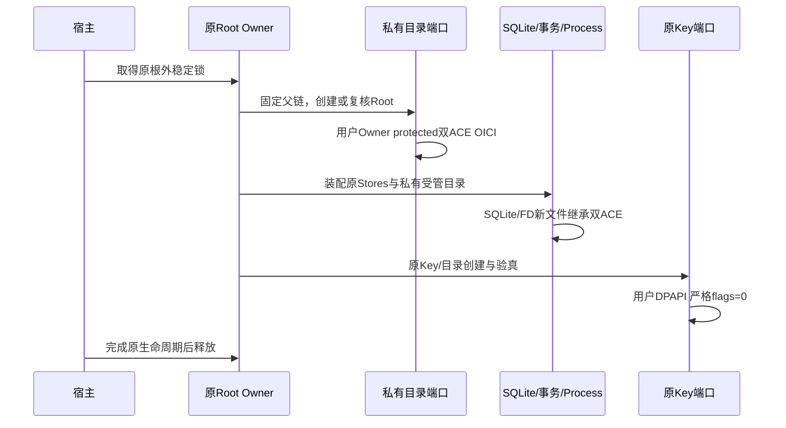
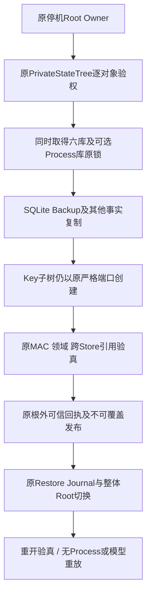
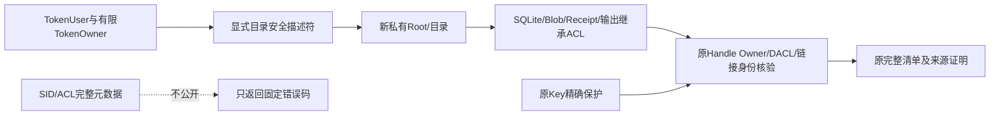
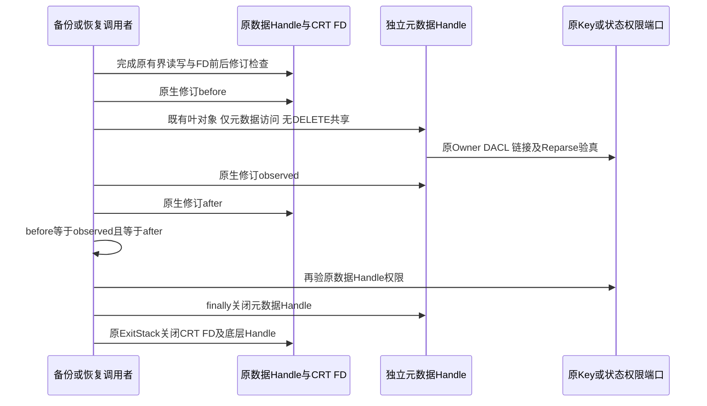

# R1：Windows私有状态创建、完整备份与同机恢复

## 1. 需求背景与问题证据

默认产品已将Windows只读Git通过原Supervisor、原Job Object和原Process事实接入编码链，
但完整停机备份在原Root的权限验证处失败。只保护Key、跳过失败的SDK断言或仅修Root而忽略
数据库、事务Blob与Process输出，都不能形成可恢复产品。

固定诊断实现`1b3c63f`的[原生Job](https://github.com/carrie1988/Harnessix/actions/runs/36432844625/job/108963154965)
为34通过、5跳过、1失败。实际Root和Process目录由Administrators所有，DACL为
SYSTEM、Administrators和Owner Rights三条可继承ACE；七个SQLite库及首个Run的三件文件继承三ACE。
Key目录与文件由当前用户所有，protected用户/SYSTEM双ACE且无继承，符合原Key合同。
故缺口是普通状态的创建与备份验权合同不一致，不是DPAPI密钥丢失。

[CPython 3.12.10的0700创建实现](https://github.com/python/cpython/blob/v3.12.10/Modules/posixmodule.c#L5024-L5040)
与该诊断一致；[新对象默认Owner规则](https://learn.microsoft.com/en-us/windows/win32/secauthz/owner-of-a-new-object)
表明TokenOwner与TokenUser有不同含义。
[文件权限与继承规则](https://learn.microsoft.com/en-us/windows/win32/fileio/file-security-and-access-rights)
还明确：父目录权限不代替子文件权限证明，改名并不重新创建安全描述符。

本切片只修私有状态契约及实际恢复链，不新增数据库、服务、执行状态机、公开协议或许可证流程。

## 2. 设计目标与非目标

| ID | 必须成立的不变量 |
|---|---|
| WS-1 | 运行Root由当前TokenUser所有，protected DACL，仅用户/SYSTEM FullAccess，向子对象继承 |
| WS-2 | 目录、数据库、Blob、输出、Receipt、SQLite生命周期文件逐对象验证，不能只验证Root |
| WS-3 | 不接受Administrators、Owner Rights、Everyone或其他身份的授权ACE |
| WS-4 | Key及`session-auth`目录仍要求原用户Owner、protected双ACE、flags=0；不得采用状态例外 |
| WS-5 | 普通状态子文件Owner仅当前用户或本Token默认Owner；默认Owner只有当前用户或Builtin Administrators合法 |
| WS-6 | 既有公开/旧式权限只拒绝，不自动改权、不重签历史、不生成替代Key |
| WS-7 | 原Root Owner及原SQLite锁保护一致性；读共享不授予Delete/替换权限 |
| WS-8 | 备份、验真、恢复后重开仍保留原Key、Store ID、Process事实，不重放Git或请求模型 |

WS-5是非密钥状态的显式平台合同，**不是密钥Owner合同放宽**。
Windows提升权限Token的默认Owner可为Administrators；该组本已具备系统级接管能力，
现有威胁模型不防管理员或同UID任意代码。新DACL不向该组授权读取或写入，
且不能把任意外部Owner或任意组Owner解释为可信。
Root和Key仍必须由当前用户所有；若TokenOwner不是用户或Builtin Administrators，状态端口失败关闭。

非目标：旧式Windows状态自动迁移、跨用户/跨机Key迁移、网络/云同步文件系统、管理员隔离、
SQLite自定义VFS、全局Token修改、公开远端执行服务。R1/R4整体验收仍包括其他未完成发布条件。

## 3. 总体架构与职责边界



- Workspace平台层承载原生安全描述符及私有目录创建，不反向依赖Product Config。
- `PrivateWindowsSecurity`复用原Key精确验权机制；产品`PrivateKeySecurity`保留原错误分类。
- `PrivateStateSecurity`仅服务非密钥状态，明确可继承形态及TokenOwner边界。
- `private_state_directory`在原Handle链上创建/复核目录，不使用chmod替代DACL，不修复存量。
- Product Root、Process Root/Run和Workspace Transaction/Blob目录均调用同一目录端口。
- SQLite、普通FD输出及原Receipt发布自然继承私有DACL；不替换其业务算法。
- `PrivateStateTree`为Key子树选择原严格端口；其他状态使用私有状态端口。

## 4. 核心流程、时序与数据流

### 4.1 创建顺序



既有目录通过同一Handle验权。CreateDirectory返回已存在时只允许`exist_ok=True`，
随后仍必须通过当前用户Owner、protected双ACE与flags=3验证；不存在隐式修复路径。
缺失父目录仅在原已有祖先链锚定后逐段创建，遇Junction、Reparse或相对路径拒绝。

### 4.2 备份与恢复顺序



恢复使用既有整体切换实现，不增加恢复分支；所有原生Handle必须在Root重命名前关闭。
原Root Owner锁只固定外部锚点，不持有待切换Root。

### 4.3 数据流



权限元数据只用于原对象验权，不进入Agent Context、Event、Artifact、模型请求或产品界面。
Key正文仍仅由原Key/备份私有流程处理，不增加日志输出。

## 5. 接口设计

| 接口 | 输入/输出 | 前置条件与副作用 |
|---|---|---|
| `private_state_directory(path, parents=False, exist_ok=False)` | 绝对Path → None | 固定原生父链；只创建缺失目录或验证既有目录；不改权 |
| `PrivateWindowsSecurity.verify(handle)` | 原Handle → None/KernelError | 原Key：仅用户Owner、protected、两条flags=0 FullAccess ACE |
| `PrivateStateSecurity.verify(handle)` | 原Handle → None/KernelError | 非Key：有限Owner、同形态双ACE、仅用户/SYSTEM |
| `PrivateStateSecurity.verify_root(handle, inheritable=False)` | 原Handle → None/KernelError | Root必须用户Owner及protected；运行Root额外要求flags=3 |
| `WindowsKeyFiles(..., security_factory, shared_reads)` | 内部原生端口 | Key默认工厂与share=READ不变；状态工厂显式使用share=READ|WRITE |
| `PrivateStateTree._windows_port(relative)` | 受管相对路径 → 原端口 | `session-auth`及后代强制Key端口；其他路径使用状态端口 |

这些是内部端口，不增加SDK/RPC字段、CLI参数或公开协议。WinAPI绑定、SID/ACL结构与原路径解析不重复实现。

## 6. 数据结构与领域契约

| 形态 | Owner | DACL保护位 | 两条ACE flags | 允许授权身份 |
|---|---|---|---|---|
| 运行Root/受管新目录 | 当前TokenUser | 必须protected | 3 = OI|CI | 用户及SYSTEM |
| 备份私有Root | 当前TokenUser | 必须protected | 0或3，同形态 | 用户及SYSTEM |
| 非Key显式状态对象 | 用户或合法本TokenOwner | protected | 0或3，同形态 | 用户及SYSTEM |
| 非Key继承子对象 | 用户或合法本TokenOwner | 非protected | 16或19，同形态 | 用户及SYSTEM |
| Key目录/Key/锁文件 | 当前TokenUser | 必须protected | 0 | 用户及SYSTEM |

每个DACL必须恰好两条ALLOW ACE、精确`0x1F01FF`，相同flags，且SID集合精确等于用户及SYSTEM。
拒绝空DACL、缺条目、额外/重复身份、DENY/其他ACE类型、INHERIT_ONLY/未知flags、不同flags及未知Owner。
`SYSTEM`角色不表示接受任意SYSTEM Owner：Key/Root要求用户，普通状态Owner仍受本Token约束。

原Process Lease、Receipt、HMAC、Plan、Session认证、备份Manifest及Restore Journal结构全部不变。

## 7. 核心业务伪代码

```text
prepare_running_directory:
    拒绝相对地址和Reparse父链
    创建当前用户Owner、protected用户/SYSTEM OICI双ACE
    若已存在且未授权exist_ok则拒绝
    原Handle链与观察Handle身份必须相同
    验证当前用户Owner、protected及精确双ACE flags=3

verify_key:
    Owner == TokenUser
    protected == true
    exactly 2 ALLOW/FullAccess ACE; flags == 0; 身份 == user+SYSTEM

verify_state:
    TokenOwner仅user或Builtin Administrators合法
    Owner属于TokenUser或合法TokenOwner
    protected/flags属于显式0或3、继承16或19的固定组合
    exactly 2 ALLOW/FullAccess ACE; 同flags; 身份 == user+SYSTEM

backup_open:
    Root先核验用户Owner及protected
    原链逐段核验，Key目录和Key文件使用verify_key
    其他文件使用verify_state；拒绝Reparse和多Hardlink
    普通状态读Handle允许READ/WRITE共享，不允许DELETE共享
    复制后复核原身份、权限、摘要及原跨Store证明
```

## 8. 持久化、事务与句柄归属

显式目录描述符在CreateDirectory调用前生成，使用后释放；不调用SetSecurityInfo修复存量。
Root与父链沿用原`WindowsWorkspaceRoot`句柄，补充READ_CONTROL/READ_ATTRIBUTES观察Handle。

SQLite生成WAL、SHM、Journal时继承父目录私有双ACE。备份保留原SQLite连接及`BEGIN IMMEDIATE`锁，
状态读句柄以READ/WRITE共享兼容这些连接，不采用DELETE共享；独占创建/Runtime锁仍使用share=0。
合作宿主一致性由原Root Owner、原Runtime锁和SQL锁证明，不声称阻止同UID非合作原生Writer。

Key读句柄仍为share=READ；Key目录仍protected且不继承状态Root授权；普通目录不能冒充Key子树。
原文件复制/不可覆盖目录发布、原意图状态机及`MaintenanceIOControl`取消结算不变。

## 9. 失败、恢复、取消与超时

- 无效运行Root在Store/Provider构造前失败关闭；产品错误归类为`product_state_invalid`。
- Process与Delivery目录保持原`process_state_invalid`/`delivery_store_invalid`错误分类。
- 低级非Key权限拒绝使用`private_state_invalid`，不暴露SID、路径或ACL正文。
- Key拒绝仍使用原`publication_key_unavailable`，没有明文或宽权限回退。
- 目录创建可能留下已成功创建的私有目录，但不写入业务状态；后续启动必须重新验权。
- 备份/恢复沿用原工作线程结算、原Owner释放与不可覆盖提交；取消或失败不能发布部分结果。
- Native焦点测试仍有3分钟外部期限，Owner取消各自保留原期限；不新增无限重试或修复重跑。

## 10. 安全与权限取舍

安全假设为当前用户、合作宿主及本地可信文件系统；管理员和同UID任意代码不在隔离保证内。
非Key的TokenOwner例外明确限定Builtin Administrators并与本Token匹配，不增加该组授权ACE。
Key严格Owner与DPAPI边界完全保留，这是身份秘密与普通状态文件的必要区别。

拒绝把Python0700、父目录通过、SHA摘要一致或SQLite完整性等同子对象安全证明。
既有旧式Windows目录需明确迁移设计，不能在新启动/备份入口自动修改ACL后宣称历史已可信。

## 11. 可观测性与错误分类

默认产品仅发布既有固定低敏错误，不输出Owner、SID、SDDL或路径正文。
测试失败诊断只保存有限角色和ACE位，原失败栈继续保留；实际新修复验收不得以诊断本身替代成功。
错误必须区分旧式权限拒绝、Key拒绝、Root身份漂移、SQLite繁忙、原来源失败及恢复意图失败。

## 12. 测试与验收矩阵

| 层次 | 正例 | 反例/边界 | 证据限制 |
|---|---|---|---|
| 模拟原生元数据 | 四形态、两个合法Owner、原Key精确形态 | 多/少/重复ACE、公开身份、未知Owner、掩码、flags、Key不采用状态例外、Root不采用Owner例外 | 可在macOS/Linux执行，不等于原生权限证明 |
| 原生目录与SQLite | 私有Root、真实数据库及未提交Journal、锁内读取 | 旧式mkdir、不修复Everyone授权、Key目录不接受继承形态 | 仅Windows执行 |
| 原有Key原生 | DPAPI与独立稳定Key | 改ACL、Hardlink、Junction、损坏拒绝 | 全部保留，不跳过或降门槛 |
| 原有备份文件端口 | 大文件、不可覆盖发布 | Hardlink、Junction | 全部保留 |
| 默认SDK完整链 | Git Turn、脱敏持久输出、完整备份、来源验真、Root恢复、原Key保留、重开读旧Thread | 新增Blob回退到旧备份、上一Root保留、无Git/模型重放 | 同一原生用例必须全程通过，部分断言通过不是用例通过 |
| 本地受影响回归 | 原工具/上下文/执行/事务/备份恢复行为 | 失败、取消、未知事实、原协议冻结 | 与Windows结果分别报告 |

本切片实现完成不表示R1/R4关闭：固定候选原生运行、安装升级、其他恢复失败场景及真实Beta仍需验收。

## 13. 源码映射与阅读顺序

| 需求 | 源码 | 重点 |
|---|---|---|
| 原Key合同机制复用 | [平台安全描述符](../../src/harnessix/workspace/windows_private_security.py)、[原Key包装](../../src/harnessix/product_config/session_key_windows_security.py) | 原`verify`及精确双ACE，状态策略与Key策略分离 |
| 状态根创建 | [原生私有目录](../../src/harnessix/workspace/windows_private_directory.py)、[产品启动](../../src/harnessix/product_config/server.py) | 原链、用户Owner、继承位、既有拒绝 |
| Process目录 | [状态目录归属](../../src/harnessix/processes/state_directory.py)、[原Supervisor](../../src/harnessix/processes/supervisor.py) | Root/Runs/UUID Run同策略，原FSM不变 |
| 事务目录 | [原Transaction Store](../../src/harnessix/delivery/store.py) | Root/Blobs创建，不改变CAS和Blob提交算法 |
| Key与普通状态分派 | [原生文件端口](../../src/harnessix/product_config/session_key_windows_files.py)、[原PrivateStateTree](../../src/harnessix/product_config/state_backup_files.py) | 默认Key工厂、状态读共享、逐段Key选择、原Handle关闭 |
| 原生完整闭环 | [默认SDK测试](../../tests/product_config/test_server_and_cli.py) | 恢复后重开，原Key/事实不重放 |
| 正反安全回归 | [模拟元数据测试](../../tests/workspace/test_windows_private_security_contracts.py)、[原生端口测试](../../tests/product_config/test_product_backup_files_windows.py) | 精确形态与失败不改权 |

建议先读需求与形态表，再读两个Security类，再从`server._private_root`进入目录端口，
最后沿`PrivateStateTree._windows_port`、备份与恢复原实现核对完整链。

## 14. 部署、兼容与回退

不增加安装依赖、公开参数或数据Schema。POSIX逻辑保持原700/600与ACL检查。
Windows默认产品新Root使用明确私有ACL，不依赖CPython0700的系统组策略。
已经存在的旧式WindowsRoot不自动接纳；该差异是失败关闭兼容边界，不是数据迁移实现。

仅支持本机、同用户、原Key和原根外回执的恢复；跨机迁移仍延期。
回退旧二进制不会把新Key改权或重签历史，恢复产品前必须按既有固定候选流程验真。

## 15. 风险与验证状态

原生诊断已确认旧式Root与子对象三ACE来源；新实现的本地模拟、POSIX回归和原生完整结果应分别归档。
已知管理员可接管对象、同UID恶意修改、非本地文件系统和硬件掉电均不得表述为已隔离。
不通过放宽Key合同、批准额外授权ACE、跳过失败或提高既有测试期限生成通过结果。

## 16. 原生候选失败与父链READ_CONTROL修复

实现`a894055`的[原生Job](https://github.com/carrie1988/Harnessix/actions/runs/36435366814/job/108971785462)
为80通过、5跳过、6失败；其中五项在`PrivateStateTree`父链验证调用`GetSecurityInfo`时失败，
另一个默认SDK用例在Git Turn失败，尚未进入完整备份。两套独立本地环境各1214通过、79跳过，
这些结果不能替代原生成功，旧失败必须保留。

原Workspace句柄链只有FILE_READ_ATTRIBUTES/data权限，用于身份和Reparse核验；
[GetSecurityInfo正式要求](https://learn.microsoft.com/en-us/windows/win32/api/aclapi/nf-aclapi-getsecurityinfo)
读取Owner/DACL的句柄必须在打开时拥有READ_CONTROL。已保护Root并不自动向先前句柄追加该权限。

`_verify_windows_parent_chain`对每个受管父段另用原私有文件端口打开READ_CONTROL句柄，
执行原Key/状态精确校验，并与原元数据句柄的对象身份逐一比较；全部新句柄归原ExitStack关闭。
原Workspace读取端口的权限及签名不变，不能为了备份扩大模型Workspace读取权限。
[父链正反合同测试](../../tests/product_config/test_state_windows_parent_contracts.py)
覆盖通过、身份变化拒绝、原句柄关闭及Key父段选路。默认SDK仅补固定公开失败码及Git端口固定错误码，
不输出工具正文或降低Turn、备份、恢复断言。

```text
for each managed parent in original metadata chain:
    permission_handle = original private port.open(parent, directory=True)
    original port performs Owner/DACL checks using READ_CONTROL
    bind permission_handle identity to original metadata handle identity
    register permission_handle closure with original ExitStack
identity mismatch -> refuse, without ACL repair or Workspace permission widening
```

## 17. Windows叶文件修订语义与资源回收

### 17.1 失败证据与源码根因

实现`2c285c0`的[原生Job](https://github.com/carrie1988/Harnessix/actions/runs/36436407837/job/108975370540)
为82通过、5跳过、4失败，前置NTFS事务与审批写链59通过。普通状态的Owner及私有双ACE创建已生效，
默认SDK已完成Git Turn，但在完整备份的叶文件读后检查失败；另三项为SQLite读取、大文件写入及硬链接准备。
两套本地Python环境各1216通过、79跳过，不能替代该原生失败。

旧叶检查直接比较`fstat(fd)`与`lstat(path)`的七项修订。CPython 3.12.10的
[FD转换](https://github.com/python/cpython/blob/v3.12.10/Python/fileutils.c#L1108-L1123)
将`st_ctime`取自`FILE_BASIC_INFO.ChangeTime`，而
[路径转换](https://github.com/python/cpython/blob/v3.12.10/Modules/posixmodule.c#L2143-L2149)
又将`st_ctime`覆写为创建时间。因此两者不是同一字段语义，不能以该比较证明对象发生变化。
该根因由实际失败位置与上游实现共同定位，不等于原生修复已经通过。

### 17.2 设计合同、字段与接口

Windows叶检查复用原`WindowsWorkspaceRoot._information/_revision_identity`：

| 字段组 | 含义与校验要求 |
|---|---|
| Volume Serial、File Index高/低位 | 同一原生API下的对象身份；禁止路径替换 |
| Attributes、Link Count | 文件形态与链接状态；Reparse、目录和多链接仍由原端口拒绝 |
| Size高/低位、LastWriteTime高/低位 | 内容长度及原生写入修订，不混用Python兼容字段 |
| CreationTime高/低位 | 补充原生创建修订；不与ChangeTime互相替代 |
| Owner/DACL | 每个观察句柄仍使用原Key或状态精确验证器；时间不是权限证明 |

内部接口`WindowsKeyFiles.open(path, metadata_only=True)`仅用于既有普通文件，
不允许创建、写入、排他或目录模式。访问权为READ_CONTROL|FILE_READ_ATTRIBUTES，
共享READ|WRITE且无DELETE；不取得正文读写权限，也不扩大原数据Handle的共享权。
[CreateFile共享合同](https://learn.microsoft.com/en-us/windows/win32/api/fileapi/nf-fileapi-createfilew)
允许元数据观察与原数据Handle同时存在。其他调用默认行为、Key保护、公开协议及POSIX检查不变。

### 17.3 时序、伪代码与失败语义



```text
before = native_revision(original_data_handle)
metadata_handle = original_private_port.open(path, metadata_only=True)
try:
    observed = native_revision(metadata_handle)
    after = native_revision(original_data_handle)
    require before == observed == after
    original_private_port.security.verify(original_data_handle)
finally:
    close(metadata_handle)
original ExitStack closes FD, permission parents and metadata chain
```

原数据流的`copy_file/file_digest/read_small/file_revisions`继续比较同一FD的修改修订，
包括ChangeTime，不删除读前后漂移保护。叶路径比较仅改为同一原生语义；错误仍为原固定错误码。
调用正文异常、路径变化、权限拒绝及最后验真异常均须释放原FD与原生Handle，不能持有句柄等待Root切换。

### 17.4 验证与硬链接准备边界

[平台合同测试](../../tests/product_config/test_state_windows_file_contracts.py)覆盖原路径及原Handle后继观察
分别发生十一种字段漂移、正常通过、权限拒绝，均检查独立元数据Handle关闭。
[原生端口测试](../../tests/product_config/test_product_backup_files_windows.py)补正文异常、正常关闭、验真异常
三条路径，并直接用GetFileInformationByHandle确认原文件Handle已失效，不以Path重开替代资源释放证据。

硬链接反例在关闭构造用受管树后建立既有多链接，再用新树拒绝读取。
Windows的[硬链接共享规则](https://learn.microsoft.com/en-us/windows/win32/api/winbase/nf-winbase-createhardlinkw)
使活跃句柄共享状态影响坏事实准备；准备阶段共享错误不能替代“已存在多链接必须拒绝”的断言。
新资源释放测试防止因移动准备步骤而掩盖文件Handle泄漏。旧原生失败保留，修复候选须重新实际运行。

### 17.5 原生后继结果与发布失败诊断

实现`8b5944d`的[原生Job](https://github.com/carrie1988/Harnessix/actions/runs/36438408439/job/108982218858)
为87通过、5跳过、2失败，前置写链59通过。SQLite及Journal读取、64KiB大文件读写、既有Hardlink拒绝、
三种退出路径的原FD/Handle关闭均通过；大文件用例在最终目录发布失败，默认SDK在完整备份后继步骤失败。
两套独立本地受影响回归各3344通过、81跳过，未执行用户未受管资料，也不代替Windows整体验收。

[有限失败诊断](../../tests/product_config/windows_backup_diagnostics.py)只在两个原生用例中装配，
在原异常映射之前记录固定位置、内部操作白名单、异常类别和数值Win32/SQLite错误码。
不记录错误消息、绝对路径、账号、SID、Key、数据库内容或模型数据，不返回成功、不修复状态、不吞异常。
[诊断回归](../../tests/product_config/test_windows_backup_diagnostics.py)验证原异常对象或原公开错误码保持，
以及带正文和路径的Canary不进入输出。目录发布与完整备份仍为发布阻塞，不能以诊断完成关闭R1/R4。
