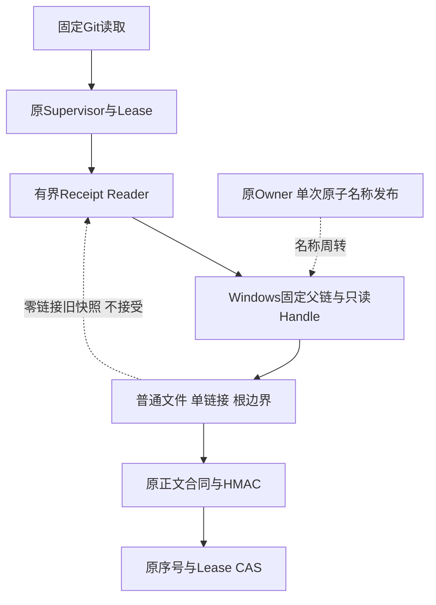
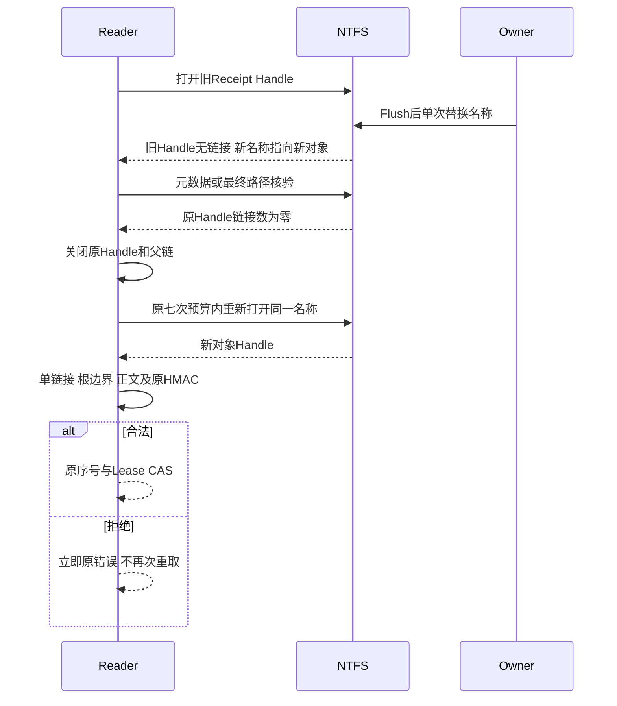
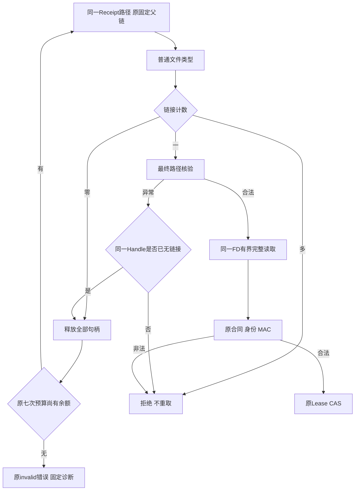

# Windows Owner回执名称周转与有界快照重取设计

## 1. 需求背景、设计目标与约束

固定`a80ea984`的原生Windows CI正式SDK Git链失败，错误为`process_owner_receipt_invalid`；
同一焦点137通过、5跳过、1失败。日志未提供MAC、文件类型、元数据还是IO分类，因此不能断言原失败的唯一根因。
后继`6d77b2c`原生NTFS和Git焦点步骤成功，完整Job仍需单独终结核验；一次后继成功不消除原失败。

源码存在一个具体竞争窗口：Reader通过`CreateFileW`打开旧回执，Owner随后以同目录
`FileRenameInformationEx`名称替换发布新回执，Reader尚未完成元数据和最终路径绑定。
原共享合同允许这种名称切换，却把旧Handle的`links != 1`一律归入不可重读的损坏。
该专项验证这个窗口，不将模拟端口证据冒充Windows原生复现。

目标是保留严格单链接快照与HMAC，允许未绑定、失去名称的旧快照在原读预算内重新绑定当前名称。
不接受无链接对象、不重启Git、不重放Process、不改变回执签名或序号、不扩大Write共享。
本实现为待原生核验的候选；当前本地证据和原生结果范围见[验证报告](../validation/windows-receipt-snapshot-2026-09-30-v1/README.md)。

参考求证：[Microsoft FILE_RENAME_INFORMATION](https://learn.microsoft.com/en-us/windows-hardware/drivers/ddi/ntifs/ns-ntifs-_file_rename_information)
说明POSIX替换允许旧Handle继续读取、后继打开取得新对象；
[BY_HANDLE_FILE_INFORMATION](https://learn.microsoft.com/en-us/windows/win32/api/fileapi/ns-fileapi-by_handle_file_information)
定义链接计数；[GetFinalPathNameByHandleW](https://learn.microsoft.com/en-us/windows/win32/api/fileapi/nf-fileapi-getfinalpathnamebyhandlew)
定义最终路径及错误查询。文档不直接证明本产品某次失败的内核结果，实际零链接须由原生负对照验证。

## 2. 总体架构、模块边界与取舍



`windows_receipt.py`只绑定父Root、打开Handle及释放资源；不拥有业务Lease和MAC。
`owner_receipt.py`拥有原七次读取保护和签名验证；只有端口的固定周转分类进入重取路径。
`SupervisedProcess.refresh`仍只在合法Receipt取得后推进Lease；重取不会另调`supervisor.start`。
Owner仍先同步输出、签名、Flush临时文件、单次NT Rename；发布失败或未决没有新增重试。

选择重取而非接受`links=0`，避免放宽原文件身份合同；选择原七次预算而非嵌套重试，避免延迟成倍增长。
不将全部`ValueError`、所有`ENOENT`、越界路径或MAC错误归入重取，以免掩盖损坏和错误来源。
不扩大通用`WindowsWorkspaceRoot`或Delivery文件端口的允许条件。

## 3. 接口设计、数据结构与领域契约

| 接口或字段 | 含义与规则 |
|---|---|
| `open_owner_receipt(path)` | 固定父链，ShareRead/Delete、无Write共享；只在绑定完成后移交CRT FD |
| `_verify_receipt_handle(root, handle)` | 普通文件且`links=1`、最终路径在原Root；零链接分类后不返回FD |
| 内部`process_owner_receipt_changed` | 只表示本次Handle无名称；不是发布成功证明，也不成为协议终态 |
| `read_owner_receipt(path, owner_token, process_id, owner_identity)` | 公共参数、返回`ProcessOwnerReceipt`和错误代码不变；重取当前同一路径 |
| `_WINDOWS_RECEIPT_READ_DELAYS` | 原`0/0.002/0.01/0.05/0.1/0.25/0.5`秒，至多七次、总等待0.912秒 |
| `attributes/links` | Reparse和目录先拒绝；`links=0`只触发重新观察，`links>1`保持拒绝 |
| `process_id/owner_identity/mac` | 仍由原HMAC正文及身份核验；不补签、不改写、不接受串线 |
| `sequence` | 原Supervisor只接受新序号；重取或读取旧合法快照不保证状态已是终态 |
| `receipt_snapshot_changed:attempt=N` | 全预算周转耗尽的固定诊断；不是路径或正文 |

不新增Pydantic模型、DB字段、Schema版本、执行计划或授权范围。
`process_owner_receipt_changed`只在内部读取循环消费；耗尽仍公开原`process_owner_receipt_invalid`。

## 4. 核心流程、时序与数据流





核心伪代码：

```text
handle = open_fixed_parent_receipt()
try:
    info = information(handle)
    reject_reparse_or_directory(info)
    if info.links == 0: raise snapshot_changed
    require info.links == 1
    try: require final_path(handle) under fixed_root
    except path_or_io_error:
        if information(same_handle).links == 0: raise snapshot_changed
        raise original_error
    transfer_exact_handle_to_readonly_fd()
finally:
    release_handle_or_transferred_fd_exactly_once()

for attempt in original_seven_attempts:
    try: receipt = read_one_fully_bound_snapshot(); break
    except snapshot_changed:
        if no_remaining_attempt: raise original_invalid_with_fixed_note
        continue
    except original_windows_sharing_error: use_original_bounded_rule
    except invalid_body_or_binding: fail_without_retry
return verify_original_identity_and_mac(receipt)
```

## 5. 持久化、事务、失败恢复、取消与超时

只变更读端瞬时观察，旧Handle未绑定时没有输出正文交付和Lease CAS。
合法旧快照仍按原MAC/序号核验；若新发布尚未读到，原`wait`继续观察，不强行推断终态。
重取不写DB、不改变控制FD、不启动或取消目标Process；原停止原因、EOF和输出摘要不变。
七次周转或共享冲突共用同一个计数，不能各获得七次预算。
全程周转耗尽后保留原错误，未知效果不自动再执行。
原取消机制和等待线程策略不变，最多0.912秒读端等待仍受原外层执行期限约束；不宣称即时OS原子取消。
备份、重启和产品恢复没有继承该候选的专项通过，仍须实际原生验收。

## 6. 安全、权限、信任边界与可观测性

固定父链、NTFS约束、Reparse/目录拒绝、单链接、最终路径、无Write共享以及原HMAC全部保留。
Path异常时的二次元数据仅用于证明本Handle已无名称；不沿后继路径删除或修改任何对象。
若新名称绑定非法正文、串线ID、错误Owner或MAC，则立即失败，不继续重读至偶然成功。
外部不兼容CRT Reader仍使发布失败，原临时证据保留，不使用路径fallback。
不将同UID攻击安全升级为已解决；原私有状态与OwnerToken威胁模型不变。

公开失败仍为原错误代码；附注仅含固定阶段、尝试次数及原数值IO码。
SDK原生焦点只输出严格白名单的附注，不输出异常正文、路径、回执、MAC或凭据。
原`a80`失败具体类别尚未确认，不能从后继通过或新增负对照推导排他性根因。

## 7. 测试验证、源码映射与验收

| 用例 | 来源与证明范围 |
|---|---|
| 1/6次周转后合法快照、7次耗尽 | 新快照测试；共用原总预算、不无限等候 |
| 周转后JSON/MAC/Process/Owner/根失败 | 新快照测试；非法来源不再次重读 |
| 零链接、硬链接、Reparse、目录、越界、IO | 分类测试；零链接不接受，非周转不改规则 |
| 原生打开后、元数据后立即名称替换 | 原生Barrier测试；无概率性Sleep，合法旧/新快照才可返回 |
| 原生固定旧绑定规则负对照 | 同一个NTFS替换窗口下观察原Handle零链接，并验证原规则确实拒绝 |
| 旧读者MAC快照、外部CRT拒绝、部分写入 | 原Receipt测试完整保留，不放宽写端语义 |
| 原SDK Git读取、脱敏与完整备份恢复 | 原产品测试保留；成功必须来自候选的实际Windows运行 |

新增读取循环测试在原源码8失败、2原生跳过；这是新契约的离线负对照，不能冒充原CI根因的原生复现。
实际测试数、原件SHA与当前源码字节见[事实](../validation/windows-receipt-snapshot-2026-09-30-v1/facts.json)。

源码阅读顺序：
[`windows_receipt.py`](../../src/harnessix/processes/windows_receipt.py) →
[`owner_receipt.py`](../../src/harnessix/processes/owner_receipt.py) →
[`supervisor.py`](../../src/harnessix/processes/supervisor.py) →
[`git_read_windows.py`](../../src/harnessix/processes/git_read_windows.py)。
回执生产者是[`windows_owner.py`](../../src/harnessix/processes/windows_owner.py)，
原生负对照见[`test_receipt_snapshot_transition.py`](../../tests/processes/test_receipt_snapshot_transition.py)，
正式SDK链见[`test_server_and_cli.py`](../../tests/product_config/test_server_and_cli.py)。

## 8. 部署兼容、回退及风险

无新依赖、安装参数、数据库迁移或版本变更；只部署固定新Wheel，不能用旧候选结果验收新字节。
回退还原这两个生产模块，不转换存量Receipt或输出文件；原源外安装/升级验收须单独固定候选。
原生CI焦点增加三个确定性Window案例，原选择器、三分钟保护及60秒堆栈观察保留。
本地Windows跳过、模拟端口、原代码后继成功均不能证明新候选原生通过；原生负对照若不成立，应修正假设而非放宽断言。
真实质量、Windows11消费者环境、独立Beta、产品Commit/Checkpoint/Rollback接线和最终R1～R6仍开放。
