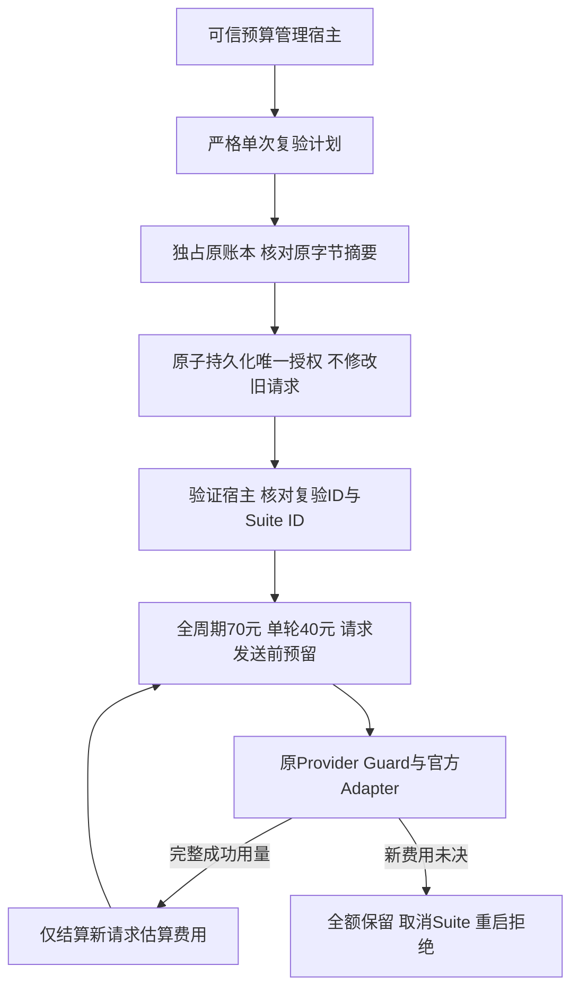
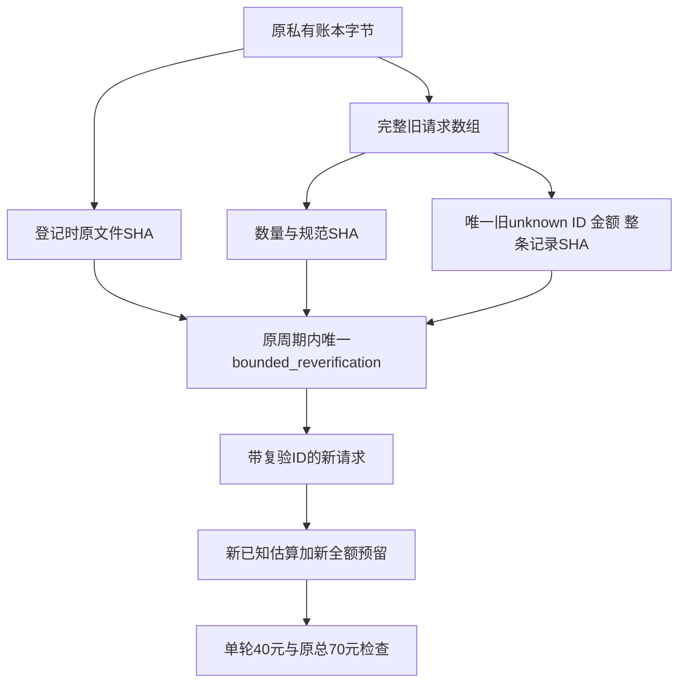
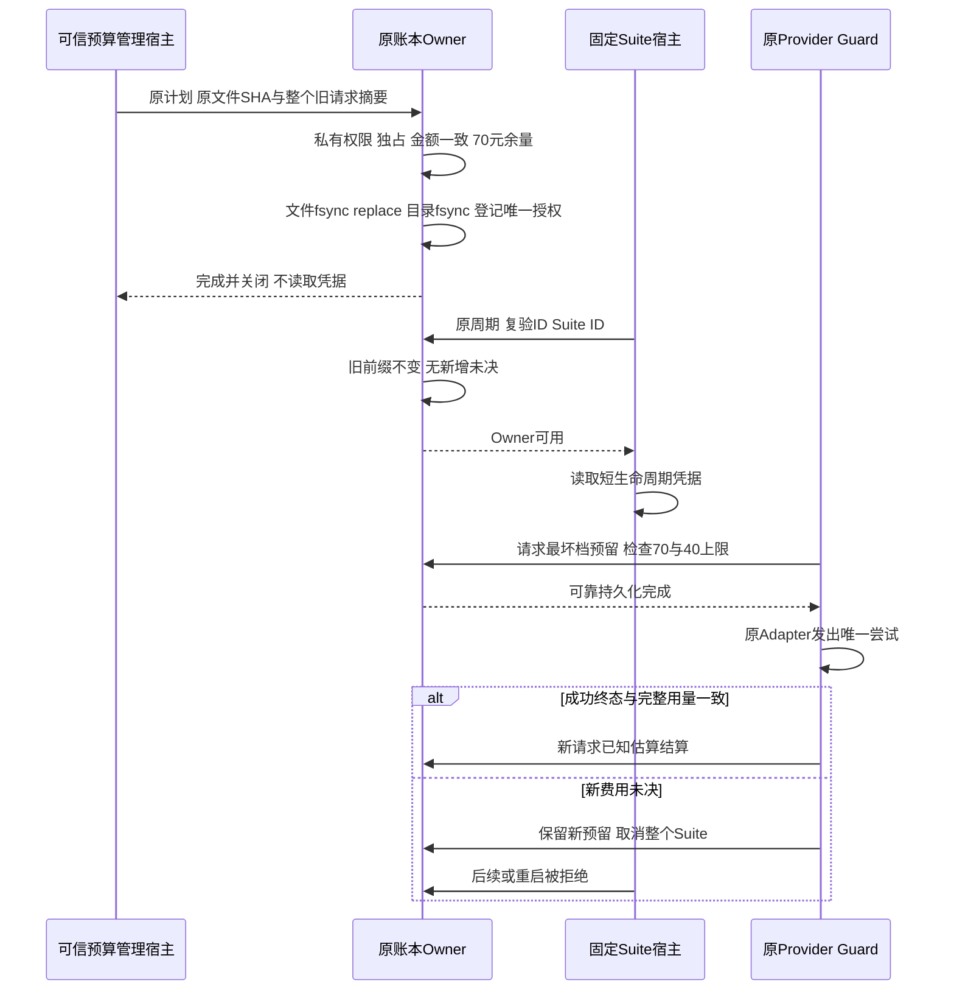

# R3 原未决全额保留的单次有界复验预算设计

本文保留原 v1 的 70／40 版本解释。当前脚本另提供封闭 v2 的 60／38 合同，
两者不混搭、不自动迁移、不替换已登记授权；完整增量及实际授权边界见
[版本化合同总体与详细设计](m09-r3-reverification-budget-v2.md)。

## 最新授权：新60元周期、Beta累计10元、无请求次数门

2026-10-09用户明确重置总预算为60元，Beta累计限额10元，不限制Beta请求次数。
这不是将旧四次许可恢复或将旧未决认作零费用：旧账本及132条请求原样保存，新空周期独立登记。
`VerificationBetaTaskBudgetPlan`使用`harnessix.provider-beta-task-budget/v1`，固定BETA-001、
60/10金额、零长度前缀及空承接集合；原60/5、70/40及历史次数合同不变。
登记复用`authorize_reverification`，请求仍先持久预留再发送，重开与多Turn累计不得归零。
没有次数门不等于无资源边界：原Turn步数、期限和Token限制保留；累计估算加全部未决预留不能超过10元，
新未决即停，无自动重试。登记后的任务账本也拒绝无身份Owner，避免绕过单任务控制。

Beta前序独立选用北京`qwen3-235b-a22b-instruct-2507`，不改变R3固定模型或评分。
[官方能力与价格](https://help.aliyun.com/zh/model-studio/qwen3-235b-a22b-instruct-2507)于2026-10-09核验：
北京支持Function Calling，完整输入上限129024，输入/输出为2/8元每百万Token。
宿主输出仍为3072，单请求最高预留`(129024×2＋3072×8)/1000000 = 0.282624`元；
不使用其他地域价格、不削减输入上限凑预算、不把官方能力声明当真实兼容或编码质量通过。
模型、价格窗口、原任务合同均进入指纹，返回模型不符、用量不完整或没有成功终态保留预留。

实际提案审阅发现Instruct生成的Java有编译、挑战绑定和并发边界缺陷，未批准写入。
后继仅Beta改用固定`qwen3-coder-flash-2025-07-28`，复用同一60/10周期，不追加额度或清零已消费。
[官方北京能力与价格](https://help.aliyun.com/zh/model-studio/qwen3-coder-flash)于2026-10-09核验，
快照支持Function Calling；输入上限997952，四档输入/输出单价为1/4、1.5/6、2.5/10、5/25元每百万Token。
宿主输出仍3072，最高档全输入预留`(997952×5＋3072×25)/1000000 = 5.06656`元。
`BailianBetaCoderFlashVerificationBounds`只提供独立模型/价格配置，沿用原Guard；余额不足全额预留则不调用。
预留不是实际消费；每次完整结算后才能再次预留，新未决立即停止，R3仍使用原固定模型与评分。

Flash两轮均产生不合格Java提案，拒绝后取消守卫，未继续收费；不能把Function Calling通过当作编码质量通过。
对各步认证历史的重建确认需求及修订提示完整，但这不是远端处理或网络抓包证据。
后继仅Beta增加固定`qwen3-max-2025-09-23`独立配置，不改变默认产品或R3。
[官方北京快照契约](https://help.aliyun.com/zh/model-studio/model-qwen3-max)于2026-10-09核验：
支持工具调用、非思考；完整输入258048，三档输入/输出为6/24、10/40、15/60元每百万Token。
仍预留3072输出，单次最高`(258048×15＋3072×60)/1000000 = 4.05504`元；沿用原累计账本和未决即停规则。

Max首请求有完整usage，但因缺失/无效工具名而无成功Provider终态；原规则保留4.05504元未决，未自动重试。
用户随后明确允许原Beta 10元内保留该预留继续。独立`provider-beta-budget-continuation/v1`承接记录
只追加到原账本，冻结59件请求前缀及未决原件；不结算旧请求、不重新登记60/10计划、不授予新的次数或金额。
仅`VerificationBetaTaskBudgetPlan`可配此记录；旧5元及1/4次合同原义不变，旧Owner/旧Reader拒绝新承接。
继续前仍足额预留，费用累计含1.341082元已知估算及4.05504元未决；新增未决立即停止。

该承接已登记，后继三轮实际增加3、3、1次请求。前两轮结算并拒绝不合格提案；第三轮再次缺失工具名，
按原规则停止。当前66请求、估算1.631434元、未决预留8.11008元，Beta余量0.258486元；旧记录未改写。
两笔协议失败均有完整用量，但原Guard要求成功Provider终态，不能据此自行释放预留。
“可信用量与工具调用成功分开核算”仅为待用户决定的方案；尚未实现、核定或恢复付费请求。
本轮11个预算/模型边界测试文件共449用例通过，不替代真实Beta或R3成绩。

下文是旧周期的完整历史记录，不再作为本轮金额或次数授权。

## 当前增量：BETA-001原五元上限内仅一次承接

2026-10-09预算所有者明确允许：原60元周期及Beta任务5元**累计**上限不变，
保留两笔合计21.32096元的原未知预留，新增最多一次请求；不自动重试，新未知立即停止。
原`VerificationBetaTaskReverificationPlan`及全部历史不覆盖、不改为新5元额度。
此授权仅用于定位真实SDK失败，不代表完整Beta整改或R3评测授权。

复用原Ledger独占、原子发布、Guard与定点计费，增加
[`VerificationTaskContinuation`](../../scripts/provider_task_continuation.py)封闭记录。
记录固定原period/task/reverification身份、最多1次、登记前字节SHA、完整请求前缀及全部旧unknown摘要；
没有可追加金额字段。`authority`仍只是可信管理宿主的授权记录，不是签名或模型可兑换的凭证。

```text
授权登记 → 原Owner独占 → 核对原计划和当前完整前缀 → 持久化task_continuation
显式携带continuation_id → 核对原task与旧未决 → 原5元累计及60元总限额 → 持久预留 → 原Adapter
有一笔新reserved即消耗唯一次数 → completed / not_sent / unknown均不得再次请求
```

接口为`VerificationBudgetLedger.authorize_task_continuation(path, record)`；运行Owner新增
`task_continuation_id`，缺少、错误或跨Suite身份一律拒绝。第一次登记后只允许完全相同记录幂等确认，
不能替换、追加第二次许可或改写历史；当前任务已有0.54272元预留继续计入5元，不从承接点重新计费。
账本显式升为`harnessix.provider-verification-budget/v4`，旧Reader拒绝，旧v1—v3合同不变。
恢复仍使用原请求记录：预留后即使未发送、进程重启、发送失败或正常完成，也不能恢复该一次许可。
任意新未决保留全部预留；取消、超时、持久化不确定及Secret保护继续沿用原Guard规则。

定向回归须覆盖旧前缀/计划/预留不可变、并发登记、精确一次、未发送不复用、旧Owner拒绝、
5元/60元最小货币单位越界、伪造类型、登记持久化失败和实际MockTransport发送次数。
新增98项及原预算/Guard/绑定关联集合合计734项离线通过；不计作真实编码质量或Beta完成。
该次承接已实际消耗：新请求因`parallel_tool_calls_disabled`失败并全额保留0.54272元，
旧130条请求及原计划未改写，累计预留21.86368元。该许可不能继续使用，
没有自动重试或追加额度；完整结果见[先导记录](../operations/pilot-beta.md#61-首个真实任务登记)。
下述章节保留原Suite合同说明，不把70/40数值套用到这项60/5任务授权。

### 后续明确授权：四请求追加记录，不替换旧许可

用户随后明确允许接收单响应多调用、Runtime保持串行1，在原60/5元累计限额内最多新增4次请求；
保留全部21.86368元预留、新未知立即停止，无自动重试。新记录使用
`VerificationTaskContinuationV2`（`harnessix.provider-task-continuation/v2`），
固定`maximum_requests=4`及`previous_continuation_id`，其他完整前缀／旧未知摘要约束复用V1。
没有新增金额或恢复旧次数的字段；V1仍严格只允许1，不把旧失败重新解释为可重用请求。

Ledger显式升为v5，在原`task_continuation`旁**追加**`task_continuation_chain`，不覆盖旧记录。
登记仍沿同一独占API，仅可链接当前末项；首次登记冻结全部当前请求，旧计划和费用不变。
Reader按各记录的前缀边界分段校验，只有末项ID能进入Owner，旧Owner及Suite拒绝。
每笔预留消耗一次，`completed/not_sent`也计次，第四次后重开或幂等登记不能再次发送；
出现新`reserved/unknown`时，即使尚有次数也立即拒绝后续请求。
原5元累计费用核验从最初任务计划计数，不从最新承接记录重新计算；旧Reader拒绝v5。
Guard的请求指纹同时绑定当前许可和完整追加链。该链只供可信验证宿主管理，不能由模型申请授权。

回归复用原临时账本、无网络/凭据约束，新增验收覆盖四次计数、第五次零发送、
旧Owner拒绝、历史不可变、未知即停与原金额上限。新候选与旧失败证据独立保存，
模型兼容性和完整登录整改仍以真实SDK任务结果判定，不以预算回归通过代替。
新增25项与原预算/Guard关联集合合计759项通过（警告视为错误）；未调整原测试或金额阈值。
真实执行仅1/4次，因工具名称完成校验失败新增0.54272元未决预留，已按规则停止余下3次。
累计预留22.40640元，原131条前缀、V1及V2授权记录不变；详见[当前先导记录](../operations/pilot-beta.md#61-首个真实任务登记)。

## 1. 需求背景、源码研究与设计目标

[原真实Suite中断](../validation/provider-suite-interruption-2026-09-30-v1/README.md)后，原70元周期
存在一项未知费用，保守预留20.77824元。Usage字段完整不等于Adapter成功终态，也不等于供应商账单；
原未知记录不能改为completed，不能释放差额，不能建立新周期绕开占用。

默认[请求预算保护](m09-r3-verification-request-budget.md)在任何未决请求存在时拒绝Owner进入。
单次有界复验允许预算所有者明确指定一个新Suite继续，但必须保持默认规则，以及新增未知立即停止的约束。
这是可信验证宿主的费用规则扩展，不是产品授权平台、Agent工具、生产API或账户级硬限额。

设计目标：原周期及整个旧请求前缀不可变；仅承接明确登记的一项旧unknown；新Suite已知估算与全部新预留
累计不超过40元；原周期已知估算与全部预留合计不超过70元。新reserved或unknown拒绝后续请求与重启。
原20 Trial、3仓库、12/20严格成功及每仓成功、零越界要求不改变。

## 2. 总体架构、流程图与数据流程



管理入口无Provider工厂、凭据读取或网络请求。其计划是可信宿主输入：`authority`字段是审计声明，
不是数字签名；源码摘要、UUID和私有文件权限也不替代预算所有者的明确授权。不得向模型或不可信用户暴露登记入口。
正式验证宿主只读取已登记计划，必须显式传入复验ID；不存在“忽略所有未知”的开关。



登记时核对原文件摘要；后续原文件必然因合法新请求而变化，因此每次读取改为核对完整旧请求前缀。
前缀摘要覆盖原时间、状态、金额及元数据，不只比较未知条目的金额。新请求必须全部带唯一复验ID。
整个前缀被固定，不能删除、重排、追加未经标记的历史，不能把原unknown改为reserved或已知费用。

## 3. 接口设计、类及数据结构

| 接口或字段 | 语义与约束 |
|---|---|
| `VerificationReverificationPlan` | 冻结、严格、extra-forbid，私有JSON版本`harnessix.provider-reverification-plan/v1` |
| `reverification_id` / `suite_id` / `period_id` | 唯一授权、新完整Suite及原预算周期的UUID；三者不能互换 |
| `authority` | 固定`budget-owner-explicit`，表示可信管理宿主已获得授权，不是可公开兑换的凭证 |
| `allocation` / `maximum_cost` | 固定字符串70/40；18位定点整数比较，不用浮点，不加额、不打折 |
| `ledger_before_sha256` | 登记前原文件完整字节SHA，阻止对漂移账本登记；不是永久文件SHA |
| `prior_request_count` / `prior_requests_sha256` | 原请求数组的精确长度与规范SHA，永久约束整个历史前缀 |
| `carried_requests` | 恰好一项旧unknown，含request_id、原reserved_cost字符串及原完整记录SHA |
| `VerificationBudgetLedger.authorize_reverification(path, plan)` | 独占原账本；只能首次登记或完全相同计划幂等确认；无模型IO |
| `VerificationBudgetLedger(..., reverification_id, suite_id)` | 默认参数为空，仍拒绝未决；匹配持久计划时仅允许明确旧unknown |
| `reserve(maximum_units, metadata)` | 沿用原发送前可靠预留；自动追加复验ID，调用方不能通过metadata伪造该字段 |
| `settle(request_id, cost_units, sent)` | 原语义不变；仅reserved可结算，发送后不完整费用保持unknown全额占用 |

调用链：
`run_budgeted_suite → VerificationBudgetLedger.__enter__ → require_available → _credential`
`→ 原Suite/Case Runner → GuardedVerificationProvider.stream → reserve → 官方Adapter → settle`。
凭据读取晚于范围及未决检查；新未知取消原Suite令牌，禁止成功终态发布。
完整授权加入原Guard恢复指纹；没有授权时旧指纹字段与字节语义不变，不改变旧默认Suite恢复身份。

## 4. 时序图与核心业务伪代码



```text
登记:
  取得原账本独占Owner，但仅允许管理操作
  若已有计划: 完全相同 → 幂等返回；不同 → 拒绝
  原文件SHA、前缀数量/摘要、唯一unknown原记录/金额全部一致
  原已知估算 + 原全部预留 + 40 <= 原70
  原子持久化bounded_reverification，关闭Owner
发送前:
  无显式复验身份 → 原默认未决即停
  显式身份必须与持久计划的复验ID及Suite ID都相同
  重新核对旧前缀；任何新reserved/unknown → 停止
  新已知估算 + 新全额预留 + 下一请求最坏档 <= 40
  原已知估算 + 原全部预留 + 下一请求最坏档 <= 70
  添加带复验ID的reserved记录，可靠持久化后才允许原Adapter发送
完成:
  原完整成功及一致Usage → 只结算该新请求
  可能已发送且费用未知 → 原Guard取消Suite并保留全额预留
```

## 5. 持久化、事务、失败恢复、取消与超时

沿用原0600账本、0700目录、no-follow/ACL/硬链接检查、稳定根/锁身份、独占文件锁、1 MiB有界读取。
不新增数据库、锁目录、货币实现或原子发布器。唯一授权是原active周期中的可选严格字段；旧账本不自动升级。
登记前必须容纳完整40元上限；之后按已知估算和实际尚未释放的保守预留累计，不累计已经释放的历史最大预留。

| 失败 | 行为和恢复边界 |
|---|---|
| 旧摘要、记录、金额、周期或原字节不匹配 | 不登记、不修复原件、不读取凭据 |
| 第二项授权或替换Suite | 拒绝替换；不是自动续期额度 |
| 任意新reserved，包括硬退出遗留 | 同进程及重启拒绝，不推断是否未发送 |
| 任意新unknown | 原Guard立即取消Suite，全部新旧预留保持，不重复尝试 |
| 单轮或总预算不足 | 下一请求发送次数为0，原文件不因该拒绝变化 |
| 文件/目录fsync失败 | 不发布成功；可能已replace的授权/预留保持，默认入口依然拒绝旧unknown |
| Suite取消、父任务取消或Adapter超时 | 原迭代器回收和原结算finally执行；不能借取消退款 |

取消/期限由原CancelToken、Adapter IO期限、Suite/Trial预算和有界同步文件操作承担，不增加后台重试或独立计时器。
复验可以在原配置、原授权和原恢复身份下继续已知费用中断，但新的未决费用始终阻止继续；不能跨Revision拼接成绩。

## 6. 安全、可观测性、部署、兼容及取舍

[登记脚本](../../scripts/authorize_provider_reverification.py)只读取私有计划和原账本；
[运行脚本](../../scripts/run_engineering_provider_suite_budgeted.py)新增可选`--reverification-id`，默认禁网不变。
管理与运行两入口都不接收API Key值，例示路径和UUID为非生产占位值：

```bash
uv run python -m scripts.authorize_provider_reverification \
  --plan /private/verification/reverification-plan.json \
  --budget-ledger /private/verification/budget.json
uv run python -m scripts.run_engineering_provider_suite_budgeted \
  --config /private/verification/new-full-suite.json \
  --budget-ledger /private/verification/budget.json \
  --period-id 00000000-0000-0000-0000-000000000001 \
  --reverification-id 00000000-0000-0000-0000-000000000002 \
  --allow-network
```

登记后不应回退运行旧版预算脚本：旧版不了解新增范围上限。原默认产品、Wheel、Protocol、数据库及依赖不改变。
固定验证宿主限定POSIX，不外推为Windows产品认证。没有同时构造第二个Agent或绕过原Grader。
错误码沿用`verification_budget_unresolved/exhausted/unavailable/persist_failed/busy`，登记不一致使用
`verification_reverification_invalid`。公开结果只有有限错误码或复验ID，不输出异常正文、账本正文、凭据或模型输入输出。

预留20.77824元是保守占用，不是实际扣费；已知估算也不等于账单。应同时报告已知估算、原未知预留、新未知预留和新费用完整性。
费用估算继续采用[官方北京价格](https://help.aliyun.com/zh/model-studio/qwen3-coder-plus)，不改变Token、上下文或输出上限。
取舍是限定一个已明确授权的旧unknown和一个Suite，不建立通用授权平台、批量费用豁免或后台对账功能。

## 7. 测试验证、源码映射与剩余风险

| 源码 | 验证责任 |
|---|---|
| [计划合同与前缀核验](../../scripts/provider_reverification_plan.py) | 严格字段、完整旧前缀、唯一旧unknown及新40元累计 |
| [原预算Owner](../../scripts/provider_verification_budget.py) | 单次登记、独占与原字节、双上限、默认拒绝、原子持久化 |
| [原Provider Guard](../../scripts/provider_verification_guard.py) | 完整授权恢复绑定；原尝试、Usage、取消及结算语义不改变 |
| [有界复验回归](../../tests/evals/test_provider_reverification.py) | 来源/金额篡改、跨Suite、重复授权、40元精确边界、新未知、取消、硬退出、同步故障 |
| [宿主及实际Adapter回归](../../tests/evals/test_provider_verification_host.py) | 新范围接线、错误Suite在凭据前拒绝、原MockTransport和默认入口保持 |

[独立验证资料](../validation/bounded-reverification-2026-09-30-v1/README.md)绑定实际测试与源码摘要。
离线通过不证明真实20 Trial质量、供应商收费、消费者Windows11或独立Beta；R1～R6仍开放。
只允许在新干净Revision上创建完整预注册Suite，复验结果不替代或改写旧中断和历史完整0/20。
