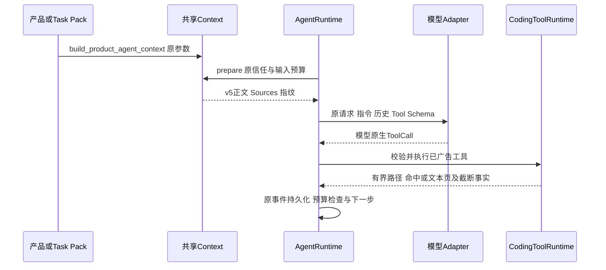
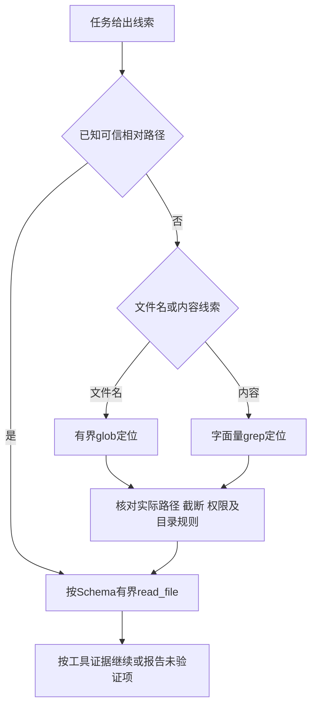

# 有界源码定位与深目录导航指令整改

## 1. 需求背景与实际根因

[BETA-001只读分析](../validation/beta-001-readonly-analysis-2026-10-07-v1/README.md)的四个模型步骤
分别调用`list_files`读取`.`、`backend`、`backend/src`、`backend/src/main`，全部成功。
每次只下降一级，没有`read_file`调用、参数错误、未知工具或失败重试；四步用尽后原Turn以`budget_exceeded`失败。
实际累计输入14,921、输出823、共15,744 Token，原16,000上限仅余256，但直接拒绝分支为步骤耗尽。
模型尝试及用量都完整，不把SDK握手、Context刷新或费用结算算为额外模型步骤。

WorkspaceContextSource按现有合同只给有界一级布局；`list_files`也是非递归目录页。
已有`glob`可以有界定位深层文件，`grep`可以按字面量检索内容；共享指令未说明定位工具的选择优先级。
这是实际导航效率缺口，不是工具命名、Schema或Provider适配故障。工具层反例一次`glob`取得12件路径，
再`read_file`成功取得经审阅文件，不能据此认定原模型已经阅读或完成业务分析。

## 2. 源码研究与架构决策

本次只参考本机可核对的公开源实现，不引入第三方代码或私有业务答案：

| 本机源码定位 | 求证结论与Harnessix取舍 |
|---|---|
| OpenCode `packages/opencode/src/tool/glob.txt` | 将文件名模式定位交给Glob；只借鉴工具选择说明，不复制其Task或全局批量策略 |
| OpenCode `packages/opencode/src/tool/grep.txt` | 文件内容定位使用专用搜索；Harnessix仍是字面量搜索，不宣称支持正则 |
| Codex `codex-rs/core/gpt-5.2-codex_prompt.md`开头文件搜索规则 | 优先适合文件定位的搜索能力；Harnessix使用已广告原生`glob`，不因此装配Shell或ripgrep进程 |
| [sources.py](../../src/harnessix/context/sources.py) | 根目录概览设计为一级有界观察，不扩大为全仓隐式索引 |
| [runtime.py](../../src/harnessix/tools/runtime.py) | 原有`glob/grep/list_files/read_file`已足够，不新增工具或导航层 |

决策是**仅调整共享编码指令并提升内部指令版本至v5**。保留所有原生工具契约、权限、预算、审批、
Context/Compaction策略和评分规则。全仓文件索引、自动遍历器及任务专用路径提示均非必要项，不在本次实现。

## 3. 设计目标、非目标与验收

1. 实际送模的runtime片段明确：文件定位优先`glob`、内容定位优先`grep`，不使用非递归目录页逐级寻找源码。
2. CLI产品及正式Task Pack仍调用同一个Factory，新建和重开Session在两种Adapter映射中发布同一v5指令。
3. UTF-8正文不超过原2751字节护栏；Context输入、自动压缩阈值、任务步数、Token和期限不变。
4. 保留原四步失败、用量和费用，不把离线脚本、工具能力或指令包含断言当作模型自主分析证明。
5. 真实效果只能由后继独立候选和新Turn取得；未形成成功读取及可核对分析前，不标注BETA或R3通过。

非目标：新增工具、改变搜索算法、递归目录扫描、输入答案、业务整改、权限扩大、Provider替换、自动重试或新预算周期。

## 4. 变更后总体架构


新增内容只在Factory的固定指令正文；不新增模型后处理、工具自动替换或强制导航状态机。
模型仍可能不遵循，Runtime不会将`list_files`改写成`glob`；真实行为与安全拒绝分别判断。

## 5. 核心流程、时序与数据流





上图是通用建议策略，不是代码新增的控制流或完成强制保证。子目录AGENTS规则仍须按作用域核对。
示例`glob(pattern="**/*.java")`只说明原Schema；实际文件必须来自工具结果，不猜路径、摘要或隐含权限。

## 6. 接口设计与重点类

| 元素 | 当前职责与变化 |
|---|---|
| `build_product_agent_context(workspace, max_output_tokens)` | 原签名不变；构造固定Runtime片段及动态Source，不读取Provider Secret |
| `ProductAgentContext.context` | 原`SourcedContextEngine`；保留项目/Workspace/有限环境来源及信任 |
| `ProductAgentContext.compaction` | 原`CompactionRuntimeConfig`；所有阈值及策略不变 |
| `CODING_INSTRUCTIONS_VERSION` | v4→v5，标识新的固定正文，不是工具、公共协议或SQLiteSchema版本 |
| `CodingToolRuntime` | 不变；按已广告名称与Schema校验，再执行有界只读工具 |

没有新增类、接口或后端。指令不授权任意Shell、联网、安装或Git写入，也不把正则搜索加入现有字面量`grep`。

## 7. 数据结构与字段契约

Runtime片段仍包含`kind=runtime_instruction`、`source=harnessix.coding-instructions/v5`、
`trust=runtime`和固定`content`；原指纹算法覆盖实际发送内容，新指纹预期不同。
Tool Schema、EffectClass、风险、幂等、审批及WorkspaceScope保持原定义。
只对重复措辞作等义精简，使新正文2747字节不突破2751字节护栏；所有安全与工程闭环规则保留。

核心逻辑伪代码：

```text
构造原ProductAgentContext
加入原Runtime片段，新source为v5、content为固定通用正文
刷新原三类Source并执行原信任与预算校验
向原Adapter发布实际指令、历史和原Tool Schema
按模型实际选择调用原工具；不改写、不代执行、不注入答案
依原事实持久化并检查预算；不根据指令内容直接标记完成
```

## 8. 失败、取消、超时与恢复

搜索拒绝、文件漂移、截断、无完整摘要、无效参数仍使用原稳定错误；不绕过路径策略，不忽略失败。
取消、期限、步数及Token在原Runtime检查点生效，原四步失败不修改。
Session重开后新请求读取当前版本正文，历史保留原指纹与调用事实，不重放原副作用或重写旧终态。
Context缺失、预算超限或保护失败仍在原发送边界拒绝；指令不能消除这些约束。

## 9. 持久化、事务与数据流程

复用原Session事件、Context Inspection与输入指纹；新正文影响后继请求的指纹，不迁移历史记录。
没有数据库迁移、Writer、事务或新缓存。原ToolCall/ToolResult、Attempt与Usage保存路径不变。
原SQLite保护历史的只读诊断另留侧车观察，不把SQL只读误称全部物理文件零变化。

## 10. 安全与信任边界

项目及工具材料仍为低信任，不能覆盖Runtime指令、扩大权限或绕过审批。
不含业务文件路径、口令、参考补丁、解题提示或未审阅源码。
`glob`输出只证明路径发现；`scan_complete=false`不等于全仓遍历完成，Ignore不是权限许可。
读取内容、子目录规则、链接和拒绝路径均沿用原后端；默认产品装配没有因本次变化获得测试进程。

## 11. 可观测性与错误分类

区分导航工具成功、源码读取成功、分析完成、整改完成和业务验收。
v5 Source与指纹可以在实际Adapter请求及持久Context Inspection中追踪；不新增正文日志。
原样保留`budget_exceeded`；零`read_file`与四次成功目录调用是诊断事实，不是参数错误或Provider失败。

## 12. 测试与验证

| 记录 | 实际结果与边界 |
|---|---|
| RED：新版发布与新增规则断言 | 18 cases中17失败、1通过，旧v4无法满足新增要求 |
| 首轮实现 | 64 cases中1失败；正文2771字节超原护栏，原失败保留，没有放宽测试 |
| 等义精简后 | 64 cases全部通过，正文2747字节，护栏仍2751 |
| 覆盖 | 实际Context片段、Chat/Anthropic映射、新建/重开指纹、原Source、搜索路径/链接/硬链接/截断/预算及取消合同 |
| 原真实失败回放 | 独立离线SDK夹具保持原4步、原用量、原四次目录调用，仍应失败；不是新模型请求 |
| 独立离线验证 | 40 cases通过，包含原预算内深层定位/读取、重开、取消、越界及预算负对照；是固定Provider能力，不是自主效果 |
| 真实行为改善 | [同条件v5复验](../validation/beta-001-readonly-analysis-2026-10-07-v2/README.md)仍四次逐级目录导航、零read_file、budget_exceeded；未观察到改善，不能计分析、任务完成或R3质量 |

执行日志/XML保存在受控证据根的`navigation-fix/`，原运行及诊断包分别封存，公开资料不复制业务源码或凭据。

## 13. 源码映射与阅读顺序

1. [agent_context.py](../../src/harnessix/product_config/agent_context.py)：版本、固定正文、`ProductAgentContext`及Factory；本次唯一产品源码改动。
2. [sources.py](../../src/harnessix/context/sources.py)：`WorkspaceContextSource`的一级布局，不要把建议策略误读为隐式全仓索引。
3. [runtime.py](../../src/harnessix/tools/runtime.py)及[search_contracts.py](../../src/harnessix/tools/search_contracts.py)：原工具能力、参数、截断及作用域。
4. [工作流指令测试](../../tests/product_config/test_coding_workflow_instructions.py)：实际送模正文、两Adapter及Session指纹；不是行为训练器。
5. [Context测试](../../tests/product_config/test_agent_context.py)、[搜索内核测试](../../tests/tools/test_search_kernel.py)、[搜索边界测试](../../tests/tools/test_search_boundaries.py)：原失败与安全边界回归。

## 14. 部署、兼容、回退与风险取舍

随原Wheel发布，无新依赖、配置项、公共协议或状态迁移；新候选必须独立冻结和安装，不能覆盖原失败运行的环境。
回退使用受控旧程序，不删除历史或复用新预算周期掩盖原请求。
指令只是通用策略；本样本同条件真实复验仍未被遵循，不再重复同条件请求。
后继正式分析可以明确现有受控输入的允许路径元数据与新的适当任务预算，但不得以新计划改写原失败或宣称v5因果改善。
是否需要有界索引须另据后继真实证据决策，而非先增加平台复杂度。
原BETA-001、真实R3、三平台、正式Git Writer及1.0发布门禁仍开放。
