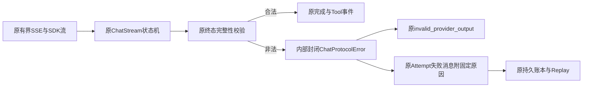
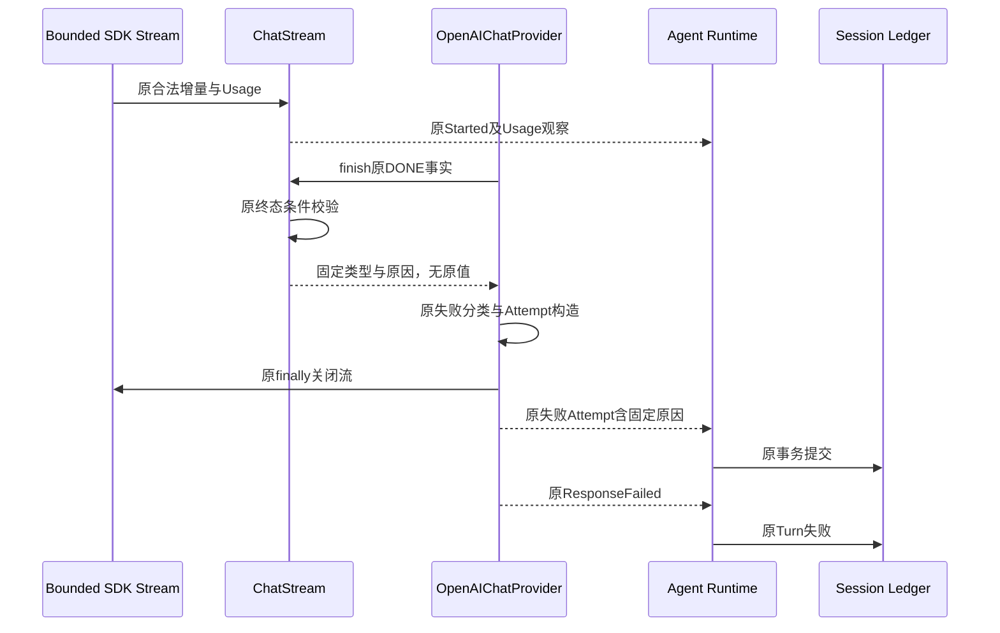
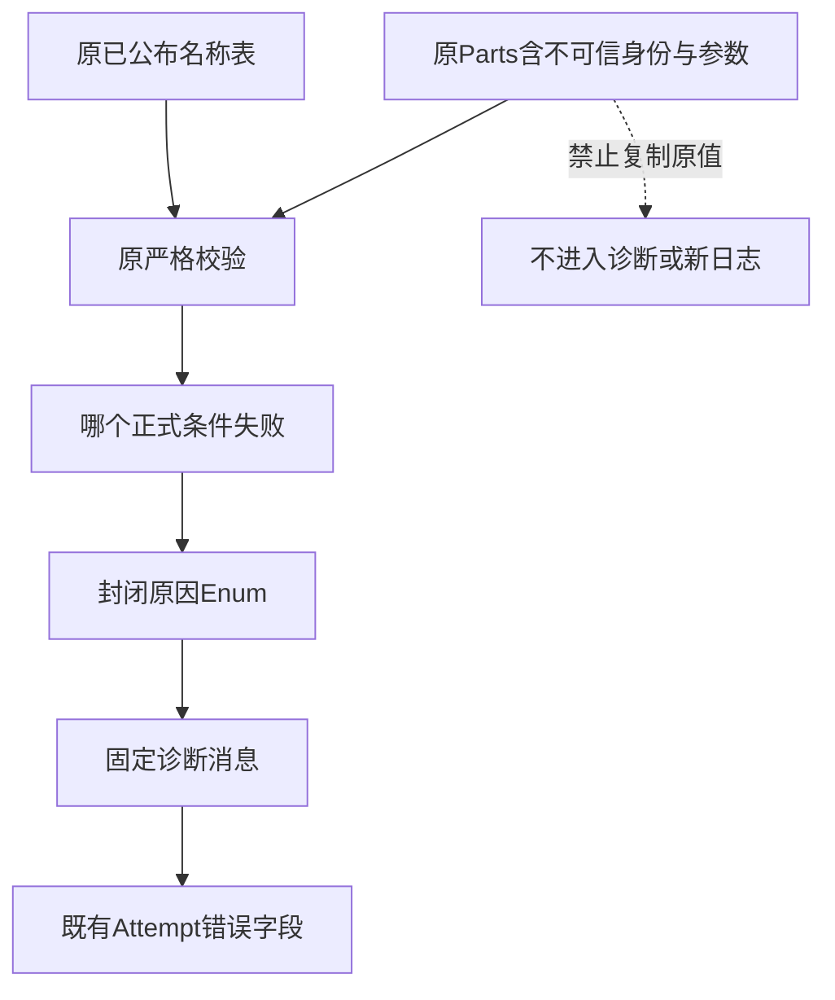

# Chat终态与传输失败的低敏尝试账本诊断

## 1. 需求背景、源码研究与设计目标

原固定`0813c58`的真实工程Suite最后一个请求已保留完整Usage，但协议失败仅记录
`provider_invalid_provider_output`与固定消息，没有原供应商正文，无法判断哪个终态条件失败。
这说明既有失败诊断粒度不足，不证明旧响应有未注册名称、重复ID或非法参数等任何具体原因。

[ChatStream.finish](../../src/harnessix/models/_chat_stream.py)在结束时核对DONE、结束原因、Usage、
语义内容、Tool index、ID、名称、类型及严格参数JSON；
[OpenAIChatProvider](../../src/harnessix/models/openai_chat.py)将这些失败归一为同一ResponseFailed，
[finish_attempt](../../src/harnessix/models/_provider_io.py)又生成相同尝试错误消息。
既有账本已允许受控错误消息，因此无须增加响应正文日志、遥测平台、公开字段或数据库迁移。

目标：后续Chat终态失败在原尝试账本中保留封闭原因，能够不读取原正文即定位正式拒绝条件。
非目标：重建旧请求原因、放宽协议、补工具ID/名称、自动重试、改变Alias/Prompt/模型、结算未知费用、
增加预算、修正历史事件或以离线诊断测试替代真实任务质量。

## 2. 总体架构、模块边界与取舍



- 内部[`_chat_errors.py`](../../src/harnessix/models/_chat_errors.py)只拥有封闭协议/传输原因、类型安全异常和既有尝试消息投影，不拥有HTTP、工具或重试。
- `_complete_calls`从原`finish`提取完整调用校验；全部校验完成后才返回本地事件列表，不提前yield工具。
  提取是为了单一职责和保持既有类热点上限，不修改治理阈值。
- 原`_failure`继续负责认证、Transport、Quota、Rate Limit、内容和协议错误归一。
- 原Runtime/Session继续提交尝试、Usage及Turn失败；公开ResponseFailed与Agent/Event Schema不变。

选择内部类型及封闭Enum，不用第三方异常文本推导诊断，不新增公开诊断字段。
协议细分只覆盖有直接源码证据的Chat终态条件；feed早期校验、未知SDK异常、Anthropic和其他Provider保持原消息，
不能将“无详细原因”误报为某种确定协议错误。

## 3. 接口设计、数据结构与重点字段

| 元素 | 来源、责任与约束 |
|---|---|
| `ChatProtocolReason` | 内部封闭Enum，只含固定终态原因，不接受供应商自由文本 |
| `ChatTransportReason` | 内部封闭Enum，只依据已知原生异常类型及核验状态码，不推测超时来源 |
| `ChatProtocolError(reason)` | 继承原InvalidWireData；构造要求准确Enum类型，异常正文固定且不含输入 |
| `_complete_calls(calls, names)` | 输入原增量Parts和已公布名称表；返回全量合法Tool事件或抛受控错误 |
| `diagnostic_failure(error, attempt)` | 只细化原`provider_invalid_provider_output`或`provider_transport`的尝试message；其余字段不变 |
| `_failed_response(attempt_id, error)` | 复用原失败分类和finish_attempt，返回原ResponseFailed与尝试终态 |
| `ModelAttemptFinished.error.message` | 固定前缀加`chat_protocol/v1:<reason>`或`chat_transport/v1:<reason>`，不增加字段 |

Turn的通用失败消息仍由原ResponseFailed生成；详细原因属于单次Attempt，不强行复制为所有Turn、重试
或Fallback的唯一根因。原Attempt与Turn的code/category/retryable仍相同；发生此细化时message可不同。

封闭原因：`completion_incomplete`、`finish_reason_unsupported`、`finish_tool_mismatch`、
`semantic_output_missing`、`tool_index_gap`、`tool_id_missing`、`tool_id_duplicate`、
`tool_name_unknown`、`tool_type_invalid`、`tool_arguments_invalid`、`tool_arguments_not_object`。
`tool_arguments_invalid`表示未通过既有严格JSON合同，含语法、重复键及非有限数值，不推断具体子原因。

诊断只认原异常的准确内部类型，或原SDK APIError直接cause的准确内部类型，并要求准确Enum类型。
任意字符串、未知异常、子类伪造或被改写的原因都沿用通用失败；不调用第三方异常`str/repr`，不遍历栈。

传输细分区分HTTPX connect/read/write/pool timeout、connect/read/write/proxy/protocol failure及
核验绑定Response状态码的408/409；SDK连接异常只检查一层受控`__cause__`，未知仍用原通用消息。
直接原生`TimeoutError`只记`timeout_origin_unknown`，不能证明是async deadline；不保存异常文本、URL、
Header或Body。原失败分类、retryable、Attempt身份、Usage、重试及费用Guard不变；429仍由原分类处理。

## 4. 核心流程、时序与数据流程





```text
finish：
    原DONE、finish、Usage缺少 -> completion_incomplete
    保持原finish reason、内容与tool一致性判断
    对原stop/tool_calls分支：
        _complete_calls验证index、ID、重复、名称、类型及严格JSON object
        全部通过才返回Tool事件列表
    保持原ResponseCompleted与max_output/content_filter行为
catch Exception：
    failure = 原_failure(error)
    attempt = 原finish_attempt(id, failure)
    若是准确内部错误及原invalid_provider_output：仅替换为固定原因message
    原finally关闭资源后，发布attempt及原failure；原暴露/重试判断不变
```

## 5. 持久化、事务、恢复与费用

使用原AttemptFinished事件、AgentFailure字段、认证事件提交和Reducer；无新表、迁移或Schema。
旧失败保持原字节和原消息，不能补签旧请求的新原因。重开与Replay必须得到同一Attempt错误，
不重新解析旧流、不重发HTTP、不执行未释放Tool。
旧`provider_transport`事件不能据此追认HTTP429或限流。
先前合法Usage继续保留；诊断不改变完整性、金额估算或账本状态。失败请求即使Usage完整，
真实验证Guard仍沿用原未知预留/停止规则；原70元周期不退款、不重新结算、不新建周期。

## 6. 异常、安全、取消与可观测性

| 情况 | 正式语义 |
|---|---|
| 已知终态条件失败 | 原invalid_provider_output且不可自动重试；Attempt记录静态原因 |
| 原名称/ID/JSON含凭据或用户路径 | 不复制到诊断，Tool不释放；保留原严格拒绝 |
| 已通过前一个Tool、后一个Tool非法 | 所有完成事件仍在本地列表；失败时没有任何ToolCallCompleted被发布 |
| 未知异常或不可信“原因”字符串 | 原通用错误，不回显值，不构造假原因 |
| 提前feed或Framer失败 | 原失败分类，不扩大此次终态原因承诺 |
| 取消、IO超时、关闭失败、SDK重试 | 沿用原行为，详细原因不会触发额外请求 |
| Session提交失败 | 原Kernel存储/恢复语义，不伪装成供应商错误 |

可观测性复用Attempt字段及现有读取入口；不新增原始帧、日志正文、上传、回调或遥测部署。
消息是诊断数据，调用方继续按稳定错误code判断业务行为，不按中文消息或原因驱动自动重试。

## 7. 测试、部署、回退与退出条件

1. 原SDK MockTransport的非法终态RED；新实现分辨封闭条件但ResponseFailed、retryable和资源关闭不变。
2. 未注册名称、重复/缺少ID、缺少类型、index gap、无内容、缺Usage/DONE、finish不符、非法/非object
   JSON、混合合法与非法Tool；断言零工具释放、一尝试及先前Usage保留。
3. 正式SDK→Runtime→实际Session→重开与纯Replay；记录失败原因而不执行Tool或重发HTTP。
4. Enum构造/篡改/子类/SDK cause正反例及Secret Canary；拒绝不可信自由文本，公共事件与日志无正文。
5. 原Chat/Anthropic/Attempt/Compaction/预算保护回归、Schema、可读性、文档图实际渲染及发行物扫描。

无依赖、配置、用户安装步骤或数据迁移；随原Python Wheel发布。回退恢复通用消息，旧事件仍可读取。
专项退出仅证明诊断及严格协议不变，不证明旧请求根因、真实质量、消费者平台或商用1.0完成。

## 8. 固定源码验证

正式SDK Mock RED为21项中19失败、2通过；修复后33项新测试覆盖15种非法终态、4条实际Session
重开/回放链、准确类型安全与原成功/长度终态。关联1377项为1376通过、1项平台跳过。
首次关联的两个Attempt/Turn消息全等失败保留；后继只对确认Chat原因断言准确新消息及其余所有字段全等，
没有放松失败code、类别、重试、Usage或工具执行断言。

传输诊断后继以`timeout_origin_unknown`保留来源边界；最终原8个测试文件305通过、无失败或跳过，
含63个传输诊断节点，不与前304及25节点证据叠加，也不构成真实Provider或安装件验收。

正式源码SHA、原件摘要、图渲染、发行物及开放风险见
[统一验证包](../validation/chat-terminal-diagnostics-2026-09-30-v1/README.md)。
