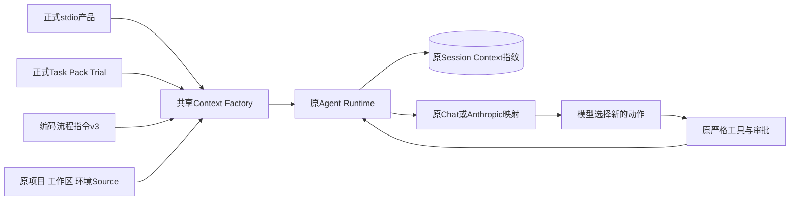
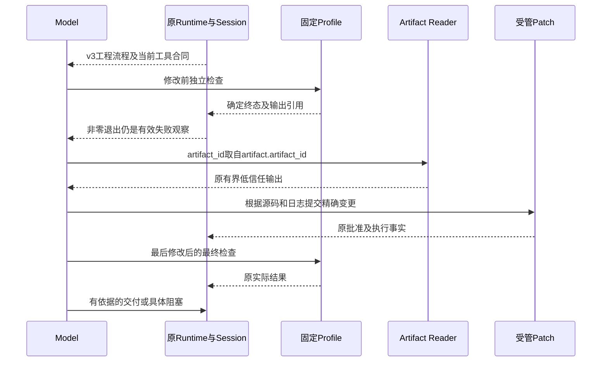

# R3：共享编码流程指令与失败后的有效观察

## 1. 需求背景与源码研究

固定`0813c58`的[原真实Suite中断](../validation/provider-suite-interruption-2026-09-30-v1/README.md)
形成8份报告：7份invalid、1份failed，另1份Session取消且没有Trial报告。原Session的纯Reducer回放
确认编码指令v2实际装配，但多个Trial先Patch后只运行一次Profile，缺少修改前基线；两Trial在失败
Profile后反复省略`read_artifact.artifact_id`。一个Trial具有有效失败基线、成功修改和通过的最终检查，
随后累计57752 Token超过原50000上限，严格结果仍是failed。不能将这些事实都归因为工具缺失或模型不会编码。

源码给出三个具体约束：

- [`process_action.py`](../../src/harnessix/product_config/process_action.py)将正常非零退出映射为
  `process_nonzero_exit`，仍发布包含`artifact.artifact_id`的输出引用；这不是Process无法启动。
- [`contracts.py`](../../src/harnessix/artifacts/contracts.py)要求`ReadArtifactInput.artifact_id`，
  `process_id`、路径和空参数不能替代；[安全字段反馈](m09-r3-safe-tool-argument-feedback.md)已保持严格校验。
- [`task_pack_trial.py`](../../src/harnessix/evals/task_pack_trial.py)从原实际调用提取首末Profile检查，
  不能把一次修改后检查补造为修改前基线与最终两次检查。

原`read_file`返回资源不存在或文件类型错误，不等同于工具目录没有公布该工具。原低敏投影中的
`unlisted_tool`是白名单未列入的工具分类，不能作为模型调用未知工具的证明；本次投影单独识别受管Patch。

## 2. 设计目标、非目标与约束

1. 在产品和正式评测共享的Runtime指令中明确首次修改前基线、正常测试失败与Artifact读取的衔接。
2. 明确最终验证必须对应最后一次修改后的工作区；单次检查不能承担两种阶段事实。
3. 对可纠正的参数/路径错误要求根据正式字段和只读目录证据修正，而非原样重复调用或过早退出。
4. 新指令UTF-8不超过原v2的2751字节；Context、Compaction、Tool Schema、批准及50000 Trial预算不变。
5. 记录新版本实际请求映射和Session指纹，但不把离线Prompt检查当作模型遵循率或R3质量提高。

非目标：新任务规划器、完成状态强制门禁、答案注入、自动调用测试、额外重试、改Task Pack/Grader、
扩大预算、重新结算原未知费用、自动重放原Suite或新增部署服务。

## 3. 总体架构与模块边界



只修改[`agent_context.py`](../../src/harnessix/product_config/agent_context.py)的指令版本与正文。
`build_product_agent_context`的签名、来源、窗口和压缩策略不变，产品与Eval没有第二份任务专用Prompt。
模型选择动作，原Runtime执行动作；自然语言规则不获得执行权限，也不成为外部结果的来源。

## 4. 核心流程、时序与数据流程



图表示指令要求的执行次序，不是新增强制状态机。模型仍可能忽略要求，只有真实完整Suite能验证行为。
基线与修改不能并发提交；独立只读检查可以由模型在同一步提出，不改变原执行并发上限或工具顺序合同。

核心逻辑伪代码：

```text
构造原Runtime片段(kind=runtime_instruction, source=v3, content=固定正文)
沿原Factory读取项目/工作区/环境并核对一致性
按原Context预算形成instructions与Inspection
将Inspection持久化；完整请求沿原公开保护送入原Adapter
模型自行提出Tool Call；原工具严格验证并执行
持久化真实结果；下一步骤保留失败反馈，不自动修正或伪造完成
```

## 5. 接口设计、领域契约与重点字段

| 元素 | 当前职责与限制 |
|---|---|
| `CODING_INSTRUCTIONS_VERSION` | 改为`harnessix.coding-instructions/v3`，绑定新固定正文；不是Tool版本 |
| `CODING_INSTRUCTIONS` | 中文工程流程；说明前后检查、引用取值与失败纠正，不包含Case答案或实例UUID |
| `ProductAgentContext.context` | 沿原`SourcedContextEngine`规划指令及动态来源，不额外读取模型或环境变量 |
| `ProductAgentContext.compaction` | 原触发阈值131072、目标65536、最近2组及最多2048摘要输出均保留 |
| `instruction_fingerprint` | 原完整instructions字节SHA-256；新请求包含v3，旧事件保留旧指纹 |
| `artifact.artifact_id` | 正式Profile输出中的引用字段，仅由模型原样转交`ReadArtifactInput.artifact_id` |
| `state/stop_reason/returncode/complete` | 原真实Process事实；非零退出、启动失败、截断和未知副作用不能混同 |

没有新增公开DTO、配置、数据库表或迁移。固定指令版本变更会改变Fragment身份与请求指纹，不能冒充
旧版本复验或跨版本拼接成绩。字节护栏是输入尺寸检查，不声明供应商精确Tokenizer用量下降。

## 6. 失败、恢复、取消与超时

- 正常退出且`process_nonzero_exit`：读取实际诊断并继续定位；不是把失败检查计为通过。
- `read_file`资源不存在/类型错误：使用已公布只读目录工具定位；不绕过路径策略或猜造路径。
- `tool_invalid_arguments`：按正式Schema与安全字段反馈纠正新调用；不自动补参数，不原样重复。
- 启动失败、未知状态、输出不完整：明确未验证结论，不能据此宣称测试通过。
- 审批拒绝、取消、超时、预算耗尽：沿原终态和停止合同，不产生额外模型请求或自动副作用重放。
- 重开Session：旧Turn/旧指纹不重写，后续新Turn使用当前共享v3；原Compaction恢复合同不变。

没有从提示词新增隐式重试，也没有新阶段状态可恢复；恢复权威仍是原持久事件、批准和效果事实。

## 7. 持久化、事务与可观测性

Context指纹、来源摘要与预算Inspection沿原`ContextPrepared`事件持久化，不保存新指令正文到审计快照。
Chat映射生成首个system消息，Anthropic映射生成system字段，两者必须与实际`ModelRequest.instructions`
逐字节一致。源码、指令摘要、RED/回归和只读原Session投影独立固定，原失败报告保持只读。

错误分类不改变：测试失败仍是Process/Tool失败，Task评分仍由原Grader决定；离线送模映射不是供应商
实际收包或费用证明。未决费用保持停止线，0次新增真实API请求。

## 8. 安全、权限与信任边界

Runtime规则仍高于项目来源；AGENTS目录作用域、用户原修改、Secret公开保护、固定Profile及受管Patch
保持原规则。工具/仓库/历史摘要属于低信任资料；日志建议不获得权限，不能跳过审批、预算和Sandbox。
模型只能使用当前目录公布的工具，不能自行获得Shell、联网、安装或公网Push能力。
前置内容摘要仍取自可信完整快照，分页revision不能替代SHA-256，缺少摘要时不得修改。

## 9. 测试设计、验证与验收

| 场景 | 验收依据 |
|---|---|
| 原v2与新流程要求不一致 | 同一新测试先在原实现RED，原件保留 |
| 9项实际失败衔接要求 | 从实际Factory产出的Runtime片段检查，不只测试源码字符串 |
| 大小和安全边界 | 原2751字节上限、可信摘要、目录作用域、批准、停止与Compaction断言 |
| 新建与重开Turn | 真实SQLite持久化、正式Runtime、两种请求映射及指纹逐字节核对 |
| 默认stdio产品与正式Eval | 既有组合根回归，保持同源Context与严格评分/批准 |
| 已有可纠正失败、Provider协议、费用保护 | 独立并行运行原测试，不改断言、预算或价格 |
| 完整R3质量 | 新干净候选、新预注册、3仓10 Case/20 Trial、至少12严格成功、每仓成功及零越界 |

完整Suite不执行前，不声明Prompt整改提高了成功率。真实测试必须先按原规则核对费用和宿主环境；
不得回填基线、挑选成功Trial、跨版本拼接或放宽原验收标准。

## 10. 源码映射、部署兼容、回退与风险取舍

推荐阅读：[`agent_context.py`](../../src/harnessix/product_config/agent_context.py) →
[`Context合同`](../../src/harnessix/context/contracts.py) →
[`Runtime`](../../src/harnessix/agent/runtime.py) →
[`Chat映射`](../../src/harnessix/models/_chat_mapping.py) /
[`Anthropic映射`](../../src/harnessix/models/_anthropic_mapping.py) →
[`流程回归`](../../tests/product_config/test_coding_workflow_instructions.py)。
产品接线见[`server.py`](../../src/harnessix/product_config/server.py)，正式评测见
[`task_pack_trial.py`](../../src/harnessix/evals/task_pack_trial.py)。

随原内部RC Wheel发布，无依赖、配置或Store升级。回退使用原受控候选程序，不改写旧Session或预算。
选择小范围共享指令整改而非新图编排/强制完成框架：可直接针对已观察行为，并保持产品架构收敛。
代价是不能硬保证模型遵循规则；真实质量、累计Token控制、原费用核对及商用门禁继续开放。
