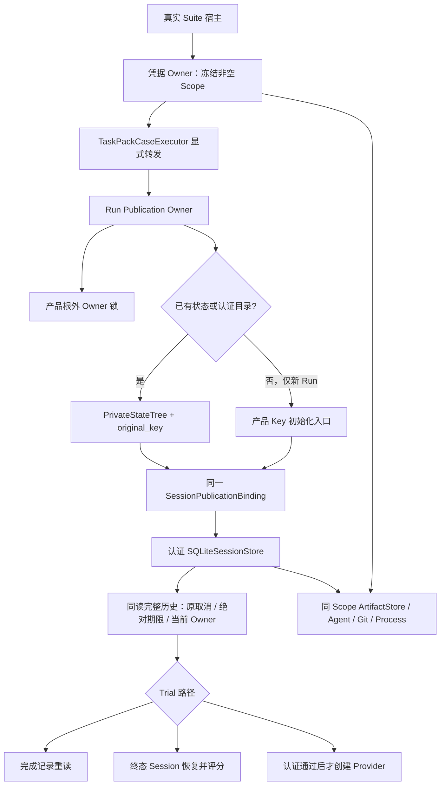
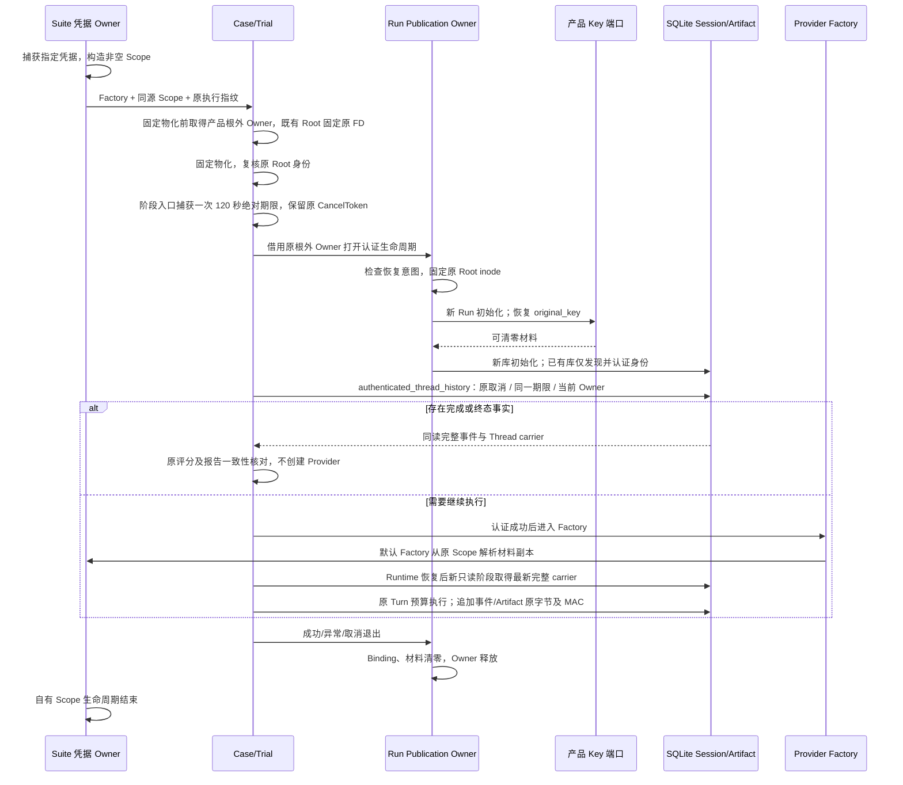
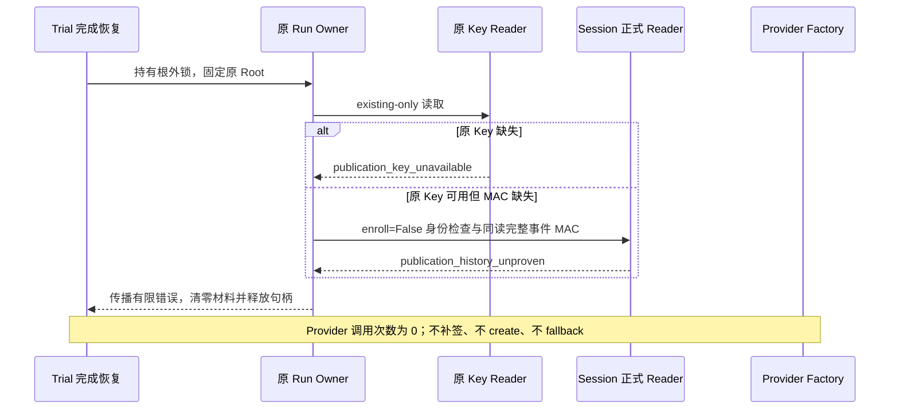
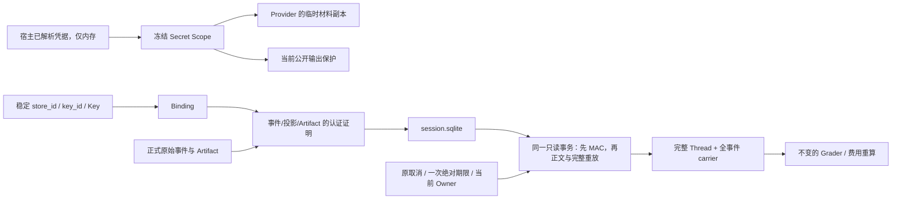

# M09：真实 Provider Suite 的 Session／Artifact 认证宿主接线详细设计

## 1. 状态与范围

设计基线：`dfba34e707ed845f3e9d844461e124015c22dca7`。本切片只整改 Task Pack Trial、Case 恢复与真实 Provider Suite 的认证装配。原装配切片基于该版本封存；完整历史消费在 `80c1dad13c98aaabb2db1630c62134a241df44aa` 集成输入实现，并在只新增不相交路径的 `730f0846641700c4c697d7cc6ba03cbf1a8364bc` 基线上冻结源码字节。当前源码尚未提交，精确身份由新验证包的源 SHA 确定；实现及验证状态见第 13 节。

不修改 Session 同读事务、Schema、Key 后端、费用 Guard、额度、登记规则、评分器、Pack、固定 Profile、模型配置或历史证据。离线验证不产生新的 R3 编码成绩，也不解除任何历史费用未决状态。

## 2. 需求背景与问题求证

默认产品宿主在 [server.py](../../src/harnessix/product_config/server.py) 的 `_serve_product_stdio` 中，先取得全状态 Owner，捕获 `SecretPublicationScope`，打开稳定 `SessionPublicationBinding` 并初始化认证 Session，然后才创建 Provider；Artifact、Git、Process、Agent 共用这个 Scope。

基线 [task_pack_trial.py](../../src/harnessix/evals/task_pack_trial.py) 的 `_run_agent`、`_completed_session_turn`、`_load_completed_run` 各自构造没有 Binding 的 `SQLiteSessionStore`。Artifact 也没有公开输出 Scope。[task_pack_execution.py](../../src/harnessix/evals/task_pack_execution.py) 的 `_completed_trial` 在恢复前缀和重算费用时再次走裸 Store。因此新真实 Suite 可能产生无法证明来源的事件与 Artifact；后续恢复不能用 UUID、摘要或正文相等替代 MAC。

低层 Store 的显式 legacy 兼容是既有契约，真实 Provider Suite 的裸装配不是本切片的目标形态。整改在宿主接线，不能重签旧记录或从未经认证的历史正文构造可信事实。

## 3. 设计目标与验收条件

1. 三条 Trial 路径由同一个 Run Owner 持有同一 Binding、Session Store、Artifact Store 与 Scope。
2. 新 Run 仅在没有 Session／报告／状态／认证目录时允许初始化稳定 Key；恢复只读原 Key。缺 Key、旧 MAC 缺失、身份不匹配和内容篡改都在创建 Provider 前拒绝。
3. 默认真实 Provider 使用非空、冻结的凭据 Scope；Provider 只从此快照取值。自定义 Factory 由凭据 Owner 显式传入同源 Scope，不窥探 Provider 私有字段。
4. 完成记录重读、终态 Session 恢复以及已完成 Trial 前缀恢复均保留，且不重新创建 Provider。
5. Run 退出、失败、超时或取消后释放 Owner，清零 Binding 与自有 Key 材料；受托线程必须结算，不丢弃迟到材料。
6. 使用真实临时 SQLite、合成 fixture Scope、合成 Key 和内置固定 Case 做离线回归；不得读取旧 Run、真实凭据或实际账本。
7. 非空原历史在 Provider Factory 和 AgentRuntime 恢复前完整同读验真；原取消、当前 Owner 与一次捕获的 120 秒认证读取期限贯穿该阶段，不延长 Turn 执行预算。

## 4. 存量端口、风险与取舍

### 4.1 初始化与恢复必须分开

[session_key.py](../../src/harnessix/product_config/session_key.py) 的 `open_product_session_binding` 调用 create-or-load 的 `load_session_key`。[POSIX 后端](../../src/harnessix/product_config/session_key_posix.py) 可创建目录、锁、pending、Key 并结算 pending；[Windows 后端](../../src/harnessix/product_config/session_key_windows.py) 可创建目录、锁及 DPAPI 封装 Key。两者的旧库创建保护检查的是 `sessions.db`，而 Eval 使用 `session.sqlite`，不能将它们直接用作 Eval 恢复入口。

已有 existing-only 端口为 [state_backup_validation.py](../../src/harnessix/product_config/state_backup_validation.py) 的 `original_key(tree)`，与 [state_backup_files.py](../../src/harnessix/product_config/state_backup_files.py) 的 `PrivateStateTree` 配合：

- POSIX：`open_file(create=False, writable=False)` 使用 `O_RDONLY | O_NOFOLLOW`，验证 uid、0700／0600、链接数、ACL、文件修订与路径身份。
- Windows：原严格 Key 目录及文件端口、父链句柄／DACL 验证、禁止替换共享、DPAPI 原平台原用户解封。
- 两平台均有界读取 `session-auth/key.v1`；不调用初始化 Loader，不创建替代材料、不修复 pending、不签发历史。

复用这个正式只读端口，不修改 Key backend，也不在 Eval 重写 Key 文件读取器。新 Run 才调用产品初始化入口。失去原 Key 的已初始化 Run 永远不退回新建分支。

### 4.2 Owner 与公开保护

复用 [state_owner.py](../../src/harnessix/product_config/state_owner.py) 的 `product_state_owner`，以根外稳定锁保护 Run 全生命周期；Action 的 `root_owner` 借用该 Owner，不重入 OS 锁。Owner 只覆盖一个 Run，不替代 Case／Suite 执行锁。Trial 在固定物化之前取得 `product_state_owner`；既有 Root 通过 `PrivateStateTree` 固定原 inode，并在物化返回后复核。认证 Owner 借用同一 `root_owner`，在 Key／Session 创建、读取、Provider 进入、Git 收集、报告及状态写入前后调用 `require_ready`。新 Root 在物化创建后取得私有目录 FD；已有 Root 的原目录 FD 贯穿物化和运行，不接受同址替换。

`TaskPackPublicationOwner.require_ready` 同时验证精确 Run 路径、根外锁和 `PrivateStateTree.checkpoint`；仅有锁文件并不证明 Root 身份。Session 叶文件通过存量严格 FD／Handle 端口固定，拒绝符号链接、宽权限和退出时的对象替换。`root_owner` 失效后不能继续借用。

取消结算复用边界：产品 `_load_owned(root)` 私有 helper 固定调用 create-or-load，不能用于恢复；`run_maintenance_io` 不提供返回 Key 取消后的材料销毁回调。因此恢复使用局部、仅服务 `OwnedSessionKey` 的单任务结算逻辑，保持产品的 shield／迟到材料清零语义，不引入通用异步或 Key 框架。

复用 [SecretPublicationScope](../../src/harnessix/secrets/publication.py)、[EnvironmentSecretProvider](../../src/harnessix/secrets/provider.py)、[SecretReference](../../src/harnessix/product_config/contracts.py)。固定逻辑引用 `eval.provider`／`1` 只表示宿主凭据身份，不包含值、Key 摘要、Keychain 位置，也不是 Process 环境目标。

## 5. 总体架构



Run Owner 建立 Binding 后，已有库只通过正式 `thread_ids()` Reader 的 `enroll=False` 认证检查，不调用初始化／迁移或 WAL 切换；新库才调用 `sessions.initialize()` 初始化认证 Header。非空 Thread 随后通过 `authenticated_thread_history` 全部验真。空 legacy 库也不能被补签 Header。路径读取仍走 Session 与 Artifact 原正式端口，MAC 必须在正文反序列化或返回前验证；本模块不重复实现验 MAC、迁移或 Reader。认证失败传播稳定错误，不转换为成功或费用完整。

## 6. 核心流程与时序



完成 Trial 前缀由 Case 适配器转发同源 Scope，再独立重开原 Run Owner 并只加载原 Key。它不是另一个独立裸 Reader，也不会调用 Provider。原费用重算只消费认证后的原 Attempt 事实，计算规则不变。

### 6.1 缺 Key／证明缺失的失败时序



缺 Key 和 Header／索引证明缺失在 Run 报告读取前拒绝；原事件正文篡改由完整历史端口拒绝，可能发生在读取未认证报告 JSON 之后，但一定先于可信报告结论、成本重算和 Provider 进入。Root Owner 锁锚可创建于 Run 根外；这不是旧正文认证，不生成旧库 Header，不修改旧记录，也不授予恢复执行权。SQLite 合法侧文件生命周期边界见第 14 节。

## 7. 接口设计、类设计与领域契约

新增单责模块 [task_pack_publication.py](../../src/harnessix/evals/task_pack_publication.py)，只承载 Eval 宿主装配，不提供通用安全平台。

| 接口／数据 | 职责与关键字段 |
|---|---|
| `TaskPackPublicationOwner` | 借用对象，包含 `run_root`、`root_owner`、`private_tree`、`binding`、`scope`、`sessions`、`artifacts`；不序列化、不持久化 Scope 或 Key |
| `open_task_pack_publication(run_root, publication_scope, existing_only=False, root_owner=None, history_read=None)` | 单 Run 生命周期；Trial 可显式借用已取得的产品 Owner；恢复显式 `existing_only=True`，不得初始化缺失的库／Key |
| `provider_publication_scope(api_key_env, api_key)` | 捕获凭据 Owner 已解析材料，返回非空标准 Scope；不读 Keychain、不枚举环境、不改变预算 |
| `TaskPackCaseExecutor.publication_scope` | Suite／低层离线调用的显式保护依赖；向执行与恢复前缀共同转发 |
| `run_task_pack_provider_suite(..., publication_scope=...)` | 自定义 Factory 必须提供非空 Scope；默认 Factory 的 Scope 由指定环境凭据冻结 |
| Trial 内部 `owner` 参数 | 三路径只能使用 Owner 提供的同一 Store／Binding／Scope，不能自行重建裸 Store |
| `TaskPackHistoryReadControl` | 仅含原 `cancel` 与绝对 `deadline`；`begin` 一次捕获默认 120 秒，`checkpoint` 按取消、期限、当前 Owner 顺序检查，不持有 Key、不授执行权 |
| `TaskPackPublicationOwner.authenticated_thread_ids(control)` | 正式身份发现用原 Token 托管并按同一绝对 deadline 的剩余时间取消结算；读取前后复核 Owner，不刷新 TTL |
| `TaskPackPublicationOwner.authenticated_thread_history(thread_id, control)` | 向正式 Session 同读端口传递原取消、同一期限与当前 Owner 回调；返回前后检查控制，直接交付原 carrier |
| 内部 `history_read` 参数 | 完成、终态和执行前门禁共用；Case 前缀多个 Run 共用一次读取阶段；独立低层调用才自行建立新的只读阶段 |

低层录制／无凭据 Fixture 允许显式空材料 Scope，但仍签发认证记录。它只用于不带真实凭据的低层评测，真实 Suite 不接受空材料。既有调用没有 Scope 时由低层 Owner 管理短生命周期空 Scope，绝不沿用到真实 Suite 默认路径。

## 8. 数据结构设计、数据流程与关键字段说明



- `store_id`、`key_id` 来自原受管 Key 文件，不从 Run UUID 或 Provider 凭据派生。
- `scope_id` 表示一次冻结材料生命周期，恢复可以使用新的当前 Scope，但原 MAC 仍验证原证明绑定的身份／正文；不能重写历史 Scope 声明。
- `provider_binding_sha256` 保留既有执行配置／费用控制指纹，不加入凭据值或其摘要，不改变恢复登记。
- Session 路径保持 `session.sqlite`；Artifact 共用 Session 库。新增 `session-auth/key.v1` 及产品根外 Owner 锁，不更名旧库或移动旧 Run。
- Scope 的 `bindings` 仅含 `name/version`；Key／凭据值不进入 Report、Manifest、日志或费用状态。

## 9. 核心逻辑伪代码

```text
open_run(root, scope, existing_only):
  借用调用方原产品根外锁；独立完成 Reader 才自行取得锁
  owner.require_ready(root)
  if existing_only and 原 Session 不存在: fail
  if existing_only or 任一 Session侧文件/Run报告/Run状态/认证目录存在:
    original = await 有期限、取消后结算的 original_key(PrivateStateTree(root))
    binding = SessionPublicationBinding(original, scope)
  else:
    binding = 产品 Key 初始化入口(root, scope)
  sessions = SQLiteSessionStore(root/session.sqlite, publication=binding)
  固定 Session 原叶 FD/Handle
  if 原库存在: await sessions.thread_ids()  # enroll=False，不补签空 legacy
  else: await sessions.initialize()  # 只初始化新库
  artifacts = SQLiteArtifactStore(sessions, public_output_protection=scope)
  yield 同一 Run Owner
  finally 清零材料、Binding，释放锁；自有空 Scope 关闭

run_trial(..., scope):
  with 产品根外 Run Owner:
    已有 Root 固定原 inode；固定 Case 物化；复核 Root（Pack/Profile/Archive 不变）
    history_read = begin(原 CancelToken)  # 唯一绝对 monotonic + 120 秒
    with open_run(root, scope, root_owner=原 Owner):
      if 完成报告状态存在: 完整 carrier -> 原 Turn -> 报告一致性核对
      elif 完整 carrier 的 Session 已终态: 原评分并发布，不创建 Provider
      else:
        沿同一 history_read 对非空原历史完整验真
        认证成功后创建 Provider，Agent/Tool/Action 共用 Owner 和 Scope
        Runtime 入口恢复开放 Turn后，新只读阶段取得最新完整 carrier
        原 remaining_seconds(turn) 控制执行，不使用只读阶段期限续期
```

## 10. 异常、取消与恢复边界

| 情形 | 行为 |
|---|---|
| 新 Run 首次启动 | 稳定 Key 与认证 Header 先于 Provider 建立 |
| 已有库缺 Key／仅 pending Key | existing-only 失败；不 create、不 fallback、不补签 |
| legacy 非空 Session 无 MAC | 原认证契约拒绝；不把历史正文迁移为可信事实 |
| Key 内容、权限、ACL、链接或身份漂移 | 原产品端口拒绝；不输出材料或原正文 |
| 事件／投影／Artifact 篡改或证明缺失 | 原 Reader 失败；不调用 Provider 重跑掩盖失败 |
| 完成报告窗口中断 | 保留终态 Session 路径，重建原报告，不重新调用 Provider |
| Case 前缀恢复 | 逐 Run 认证，再按原规则核对费用与报告 |
| Run Owner 竞争／恢复意图未决 | 原产品 Owner 错误，不能另建锁绕过 |
| 加载超时／重复取消 | 5 秒逻辑期限；唯一受托线程不能强杀，必须等待其收敛并清零迟到材料后传播取消 |
| 下游 Provider／运行时失败 | 原错误传播；清理本切片自有资源，不修改费用状态或历史 Run |

逻辑加载期限不等于操作系统故障时可强杀线程的硬期限。清零仅承诺本切片持有的可变材料／Binding 副本，不承诺清除 Python 字符串、SDK、OS 的全部副本。

## 11. 预算宿主与部署

[run_engineering_provider_suite_budgeted.py](../../scripts/run_engineering_provider_suite_budgeted.py) 的 `_credential` 是实际凭据 Owner，当前负责 Keychain／launchctl／环境读取。接线仅在其既有读取之后构造同源 Scope，并传入 Suite；Factory 使用相同原材料。预算 Ledger、Guard、费用登记、预留、额度、模型参数和预检次序保持不变。

本模块无需新数据库、中间件、网络权限或迁移命令。只对新认证 Run 生效；历史 legacy Run 不自动升级。POSIX／Windows 沿用产品端口，Windows 原生验收需独立目标平台测试，不能用 macOS 结果替代。

## 12. 测试验证与源码映射

全部测试只使用新临时目录、真实 SQLite、合成 Scope／Key 和录制事实；网络、模型请求、Docker、真实预算入口执行、旧 Run 及真实凭据访问均禁止。

| 测试组 | 必须核对 |
|---|---|
| 新 Run | 非空 Header；事件／投影／Artifact MAC；同一 Binding 与 Scope 对象；Owner 借用 |
| 原 Key 恢复 | store/key 身份稳定；拒绝缺 Key，不调用初始化 Loader；只读材料文件保持 SHA／修订 |
| 历史拒绝 | 非空 legacy 库、缺 Seal、错误 Key、损坏证明；Provider 调用数为零 |
| 三路径 | 完成记录重读、终态恢复、执行路径同一 Owner；保留报告窗口恢复与完成前缀 |
| Scope | 真实默认非空；冻结后环境漂移不改变 Provider 原材料；自定义 Factory 无 Scope／空 Scope 拒绝 |
| 输出保护 | Agent／Artifact／Git／Process 同 Scope；凭据片段不得签发为公开输出 |
| 生命周期 | 正常、异常、取消、加载超时、重复取消，迟到材料清零与锁释放 |
| 非回归 | 原 Task Pack 审批、成本未知、取消、报告一致性与证据缺失语义 |

验证包应包含实际命令与解释器／源码来源、测试结果、边界声明、修改文件精确 SHA256、基线输入 SHA、Manifest 与独立校验；只读代码检查不标为运行通过，Fixture 不标为真实 R3 通过。

## 13. 历史实现与当前集成验证状态

原 `dfba34e` 独立装配候选结果为 **114 passed，1 strict xfailed**；记录保存在[原冻结包](../validation/m09-r3-eval-publication-wiring-20261002-v1/REPORT.md)，其 48 个成员、原 SDD SHA 和 Manifest 不改写。`80c1dad` 输入的接线前复跑仍为 114 passed／1 xfailed。

当前完整历史消费已实现：五个原 Eval selector 连同必要新边界测试实测 **133 passed，0 xfailed，0 skipped**。原 `test_completed_recovery_requires_original_event_body_mac` 已移除 strict xfail 并断言 `publication_history_unproven`，不能以取消或超时伪装 MAC 拒绝。Ruff 八个指定输入通过；四个 Eval 源文件 Mypy 通过。

新证据位于[完整历史集成包](../validation/r3-authenticated-host-integration-2026-10-02-v1/REPORT.md)，包含原输入 SHA、最终源 SHA、准确 selectors、逐轮失败闭环、四图、校验记录及 Review Packet。测试使用固定集成解释器；`PYTHONPATH` 仅集成树 `src`，仓库根不在 `sys.path`。研究基线为 80，实际集成基线为 730；源码身份以冻结 SHA 为准。当前未提交，frontmatter 保持 `draft/pending`，不以基线提交冒充变更后的版本。

以上是离线认证接线验收，不是新 R3 编码质量成绩，也不验证 Windows 原生或真实 Provider。未执行模型、容器、网络、费用入口、CI、安装或发布。


## 14. 持久化、事务、并发与幂等

认证证明与事件、投影和 Artifact 原行仍由原 SQLite 事务原子提交；本模块不签发报告 MAC，也不改变报告／状态 JSON 合同。完成报告依赖经认证的 Session 事实重新核对，原事件完整同读验真通过正式 carrier 消费，不再以缓存投影独立构造恢复结论。

根外 Run Owner 从固定物化到认证宿主、执行与报告全过程持有；Case／Suite 原锁和指纹继续工作。恢复只加载原 Key，Run UUID 不是 Key 派生材料。已完成 Run／终态 Turn／Case 前缀保持查询优先，不重新执行模型或副作用。

恢复拒绝测试对新合成的静止旧夹具做全部文件 SHA 前后比较，包括 Session、Key、报告和状态。新的静止主库 SHA 回归只在自有合成夹具构造阶段显式结算 WAL 并设置 DELETE 日志模式，之后捕获所有文件摘要；已有库的 Owner 恢复不再初始化。此设置不改变产品持久化格式／MAC，也不用于任何实际历史 Run。夹具构造连接必须关闭：Python `sqlite3.Connection` 上下文只提交事务，并不会关闭连接。活跃 SQLite WAL／SHM 可发生合法生命周期变化，静止夹具 SHA 不变的证明不能推广为活跃 WAL／SHM 字节不可变承诺。没有访问、校正或补签实际历史 Run。

## 15. 安全、隐私与可观测性

新增稳定宿主错误：`eval_publication_session_missing`、`eval_publication_session_invalid`、`eval_publication_secret_denied`；复用 `publication_key_unavailable`、`publication_key_timeout`、`publication_history_unproven` 、`publication_history_timeout` 和产品 Owner 错误。只转换获得原 Session 叶句柄时的系统错误，不将下游 Provider／运行时 `OSError` 误报为认证失败。

沿用原 `Observability` 注入和原 Agent／Action 事件，不增加高基数凭据、Key、路径正文日志。Scope 名称／版本是有限公开声明；MAC 来源认证不授予 Root 执行权，也不代替当前输出保护。报告中不保存 Scope 材料、Key 字节或未认证事件正文。

默认真实 Suite 的来源只有配置指定环境变量；预算宿主的来源是既有 `_credential` Owner 已解析的原值。两者均先冻结后执行。低层 Fixture 的空 Scope 不与真实默认路径混用；自定义真实 Factory 没有非空 Scope 时直接失败。

## 16. 源码／测试追踪及实施切片

| 切片 | 源码与关键符号 | 测试与证据 | 回退边界 |
|---|---|---|---|
| Run 生命周期 | [task_pack_publication.py](../../src/harnessix/evals/task_pack_publication.py)：`open_task_pack_publication`、`TaskPackPublicationOwner.require_ready`、`_existing_binding` | [test_task_pack_publication.py](../../tests/evals/test_task_pack_publication.py)：新建、原 Key、缺 Key、legacy、原文件 SHA、Root 身份、取消／超时 | 可回退代码，不移除新 Run Key、不将新认证库降级为 legacy |
| 三路径共享 | [task_pack_trial.py](../../src/harnessix/evals/task_pack_trial.py)：`run_task_pack_coding_eval`、`_load_completed_run`、`_completed_session_turn`、`_run_agent`、`_grade_and_publish` | 完成状态重读、实际终态报告重建、创建 Provider 前拒绝、Agent／Git／Action／Artifact 依赖同一对象 | 恢复路径保留，不删难测分支 |
| 完成前缀 | [task_pack_execution.py](../../src/harnessix/evals/task_pack_execution.py)：`TaskPackCaseExecutor`、`_completed_trial` | 精确Scope转发；原费用／证据保护保持，非空前缀的原取消传播`TurnCancelled`，详见第18.3节 | 原费用重算与评分器保持，取消路径无Provider、重放或状态写入 |
| 真实默认 Scope | [provider_suite_execution.py](../../src/harnessix/evals/provider_suite_execution.py)：`TaskPackOpenAIChatProviderFactory`、`run_task_pack_provider_suite` | 冻结环境后漂移、默认非空、自定义 Scope 缺失拒绝、原指纹及 CLI 回归 | 不改变 Provider 模型参数或执行指纹 |
| 预算宿主转发 | [run_engineering_provider_suite_budgeted.py](../../scripts/run_engineering_provider_suite_budgeted.py)：`run_budgeted_suite` | AST 核对 Scope 原值、Guard Owner 与归一化基线等价；未执行实际预算入口 | 仅去掉 Scope 包装不改变额度／Guard／登记；实际运行前必须保留保护能力 |
| Session 依赖 | `SQLiteSessionStore.authenticated_thread_history`，不修改 Session 源文件 | 原正文 MAC 回归真实 PASS；同取消／deadline／Owner、期限、关闭及完整新快照 | 普通历史 carrier 不授执行权；实际 Provider 验收仍需独立许可 |

前述范围不增加 ADR 平台、Schema 迁移或新安全模块体系；既有长期 ADR 继续适用。改动只在指定的 Eval 宿主、同源预算转发、受影响测试和本详细设计／验证包。

## 17. 发布、兼容、回退与剩余风险

| 方案 | 取舍与结论 |
|---|---|
| 对旧库调用 create-or-load | 拒绝：库名护栏不同，且可创建／修复材料，不满足原 Key 恢复 |
| Eval 手写 Key 文件／通用认证平台 | 拒绝：重复平台权限、DPAPI、身份与清理实现，扩大边界 |
| 删除恢复路径或信任旧正文补签 | 拒绝：破坏恢复能力及来源边界 |
| 复用产品原 Key Reader、Owner 与 Scope | 采用：平台端口不变，宿主单责；完整来源验真依赖原 Session 读取切片 |

发布单元为上述 Eval 接线及同源宿主转发。新增认证 Run 不能再由旧裸 Reader 读取；回退程序必须保留新 Key 与原库并停止真实请求，不能删除 Key、重新初始化旧 Run 或把认证历史当 legacy。

尚未验证：Windows 原生行为、真实 Provider 编码质量和真实费用入口运行。完整 Session 同读验真消费已由本包离线回归覆盖，精确源码的独立集成复核与安装由发布流程另外验收。禁止以本包离线通过解锁真实模型请求、宣布 R3 通过或解除未决费用。合入时应在精确源码 SHA 上重新检查 Session 接缝用例，更新文档版本与状态，然后按既有真实复验许可单独执行验收。

## 18. 完整历史端口的集成设计与期限约束

### 18.1 已提供的正式领域契约

[sqlite.py](../../src/harnessix/session/sqlite.py) 的 `authenticated_thread_history(thread_id, *, cancel, deadline, checkpoint=None)` 返回 [sqlite_history.py](../../src/harnessix/session/sqlite_history.py) 的 `AuthenticatedThreadHistory`，字段为 `thread: Thread` 和 `events: tuple[AgentEvent, ...]`。端口在同一只读事务验证 Header、投影、完整原事件正文 MAC、连续前缀及语义重放一致性；退出原连接并复查控制信号后才返回。返回对象不授予 Run 执行权，也不包含 Key 或签发能力。

最小消费调用为 `await owner.sessions.authenticated_thread_history(thread_id, cancel=原CancelToken, deadline=原绝对monotonic期限, checkpoint=lambda: owner.require_ready(owner.run_root))`。`get_turn` 和审批／恢复判断只能消费该返回对象的 `thread`；不能把另一个 `get_thread`、末事件或独立 `events` 结果拼为完整认证事实。

### 18.2 实际接线与调用次序

1. `_load_completed_run` 用 `owner.authenticated_thread_history` 取得完整 carrier 的 Turn，再按原 `_require_completed_trial` 核对报告；认证错误不转换为费用未知。
2. `TaskPackPublicationOwner.authenticated_single_thread` 先沿控制检查、发现唯一 Thread、再次检查，然后对非空历史完整验真。空库返回 `None`，多 Thread 沿原 `eval_run_projection_invalid` 拒绝；`_completed_session_turn` 仅消费返回 Thread，验真后才判断终态或执行分支。
3. `_run_agent` 在 Provider Factory、Action Runtime 和 `AgentRuntime.__aenter__` 之前对非空原历史完整验真。原 Runtime 入口会主动恢复开放 Turn；之后 `_drive_turn` 在新的只读操作入口取得最新完整 carrier，不沿用入口前旧投影，也不调用另一个 `get_thread` 拼齐事实。
4. `_completed_trial` 转发控制；`_load_prefix` 在前缀入口捕获一次控制，多个 Run 的完成重读共用原 Case CancelToken 和一个 deadline。实际 Trial 执行后的完成重读是新的只读阶段，在调用边界捕获，不受已经结束的入口认证阶段限制。
5. 单次 Run 三分支共用同一 Owner／Binding／Scope。前缀独立重开原 Run Owner，Binding 对象可以重新建立，但原受管 Key 身份和显式 Scope 不变，不声称跨重开对象相同。

### 18.3 认证读取阶段与持久执行期限

当前 Eval 没有既有 Run 级 monotonic 预算。新增的 `TaskPackHistoryReadControl` 是有限的内部只读控制，不是新的 Run 执行预算。默认 `HISTORY_READ_TIMEOUT_SECONDS = 120.0`；`begin(cancel)` 在阶段入口一次计算 `deadline = monotonic() + 120.0`。同一阶段的发现、多个完整 carrier 读取、Session 回调和交付前检查传递同一个 float，不按行或底层调用刷新 TTL。

| 阶段入口 | 控制来源与共享范围 |
|---|---|
| `run_task_pack_coding_eval` | 固定物化之后、打开认证宿主之前捕获；完成读取、终态识别、执行前门禁共用原 Token 和 deadline |
| `_load_prefix` | Case 前缀入口一次捕获；全部原 Run 的重读共用同一期限与原 Case Token，各自回调当前 Run Owner |
| `_drive_turn` | Runtime 入口完成后新的历史只读操作；一次捕获后沿所有初始读取传递，取得最新同读快照 |
| 执行后 `_completed_trial` 调用边界 | Trial 真正结束后开启新的只读重验，继续使用原 Case Token |
| 独立低层完成／终态 helper | 仅无上层控制的独立操作创建自身 Token 和一次有界控制；正式 Case／Trial 路径显式转发原控制，不走此兜底 |

身份发现通过 Owner 的专用方法托管 `cancel.run(sessions.thread_ids())`；其 timeout 由同一绝对 deadline 的剩余时间计算，不创建新的 120 秒 TTL。已有库首次发现同样传入此控制；库／Key 初始化、已有 Key 的原 5 秒加载合同保持分立。

Session 原完整事件 Reader 内部 10 秒上限保持，不修改任何 Session 文件。120 秒限制整个认证阶段；单 Reader 10 秒仍可能先触发拒绝。底层线程与 SQLite 取消结算沿产品端口，不声称操作系统故障下可立即强杀。

持久执行时间继续由 `remaining_seconds(turn)` 计算 `turn.created_at + turn.budget.timeout_seconds`。预算早已过期的终态 Turn 可以重新进行只读验真，不获得执行续期。普通 carrier 本身不授权恢复动作；Case Budget、工具 Operation 预算、模型参数和费用合同均不变。

新增兼容／取消语义变化（不是纯夹具修正）：旧 durable-stop 路径允许已取消的非空前缀返回缓存停止结论；完整认证必须沿原取消执行，因此该组合现在传播 `TurnCancelled`。未取消的原停止／费用优先级不变，空前缀路径的原 stop 返回不变。回归显式断言原 Token 身份、0 Provider、0 Trial 重放、0 Campaign 状态写入、原静止已完成前缀全部文件 SHA 不变；首轮暴露该差异的 `pytest-v1.txt` FAIL 永久保留。

取消优先级：原 Token 已取消时，非空前缀认证传播 `TurnCancelled`，不能绕过认证返回缓存 stopped／completed 结论；没有历史读取的空前缀仍沿原停止结论。认证成功后完整报告优先、已停止原因优先于成本未知、前缀顺序／缺失／费用核对规则保持；只将原 `eval_baseline_invalid` 收敛为 `evidence_missing`。Session 检查点按取消、绝对期限、当前 Owner／Binding 失效顺序拒绝，Owner 原系统错误保持原类型，不吞取消或伪装为成本未知。

### 18.4 凭据版本与历史能力边界

默认 Suite 和预算宿主都通过 `provider_publication_scope` 构造 `eval.provider`／`1` 的冻结材料映射；Scope 构造验证所声明的 name/version 与实际材料元数据相同。`1` 是逻辑引用版本，不等于实际云端 API Key 轮换版本。自定义 Factory 依赖显式凭据 Owner 的同源约束，单纯非空 Scope 检查不证明任意闭包内的真实材料。

原事件 Seal 只保存经 MAC 保护的 `scope_sha256`，并不保存可由摘要反推出的完整 name/version 映射；新 carrier 也不增加原 Provider 凭据映射字段。默认 Factory 解析材料后核对其应用引用版本等于 `eval.provider/1`，不支持的版本沿 `publication_scope_unavailable` 拒绝并清零材料，不创建 Provider。该核对只针对当前明确映射，不从历史 opaque 摘要恢复任何映射。不能拿当前 Scope 声明充当历史原材料证明，不能补签旧记录或把 MAC 认证等同于 Root／执行授权。完整历史中的已认证领域 Secret Binding 如参与恢复执行，仍按产品原版本匹配端口核对，不降级为当前版本。


完整 Session 事务、控制信号与取消结算详见[单事务认证 Thread 历史详设](m09-r4-authenticated-thread-history.md)；模块依赖与生命周期决策见 [ADR0107](../adr/0107-authenticated-eval-host-and-history-read.md)。

## 19. 认证读取职责与结构约束

认证身份发现及完整历史读取归入既有`TaskPackPublicationOwner.authenticated_single_thread(control)`，
Trial模块只编排原业务分支，不再保留重复身份选择、未使用Store参数或独立读取函数，
不新增薄转发或第二套Reader。

| 输入及结果 | 处理 | 失败边界 |
|---|---|---|
| 原读取控制 | 检查原取消、捕获期限及Owner，沿原身份发现端口取得Thread ID | 不创建新的Token或TTL |
| 无Thread | 控制复查后返回`None` | 不调用完整Reader、Provider或恢复动作 |
| 多Thread | 保留`eval_run_projection_invalid` | 不擅自选择最新Thread，不读局部历史 |
| 唯一Thread | 复用`authenticated_thread_history`取得同读完整历史，返回其Thread | 不拼接`get_thread`缓存，不授予执行权 |

移动前Trial为609行，移动后589行，认证宿主264行；600/100/20结构阈值及全部旧热点上限不变。
原期限测试仅更新调用归属，断言不减少。新增真实SQLite空、唯一、多Thread三项测试，
明确Token/绝对期限身份、无缓存投影、拒绝时无完整Reader及原Key不变。
源身份与测试绑定使用新的集成记录；前序133项及其49成员封存资料保持历史原件，
不能把新源码伪称为该旧包所验证的字节。
