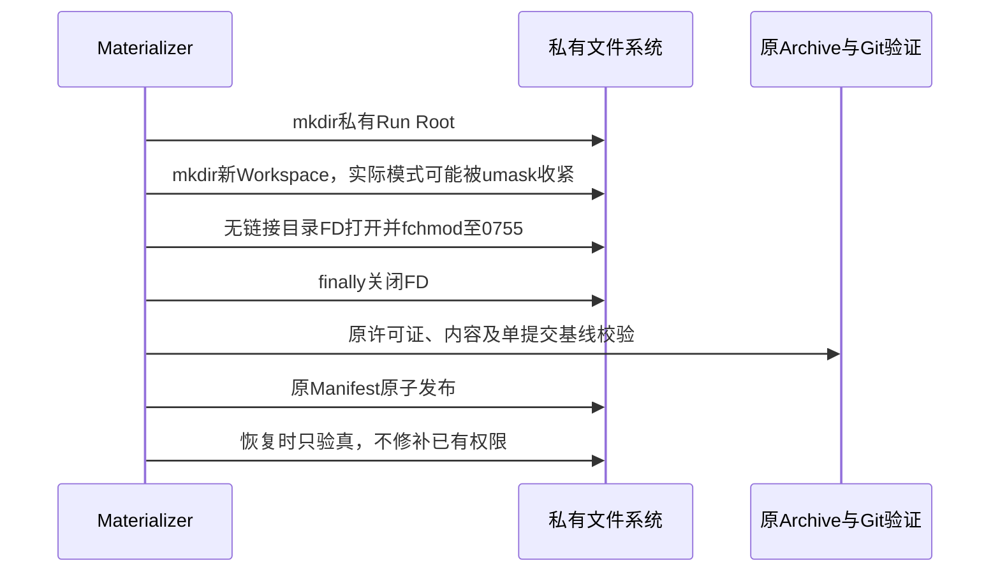

# Task Pack新建Workspace的精确权限与恢复一致性

## 1. 需求背景、设计目标与非目标

受控验证宿主使用`umask=077`时，原`os.mkdir(workspace, 0755)`实际创建0700目录。首次Trial仍可执行，
但报告写入后的正式崩溃恢复要求Workspace精确0755，因此失败为`eval_task_pack_materialization_incomplete`。
真实集成复验中两个参数形式均复现该失败；宿主模式022的原结果不能证明077下可恢复。

目标是在原私有Run Root内明确创建正式合同要求的目录权限，不依赖进程全局umask。
非目标：改变已有目录权限、修改用户工程、接受漂移的旧Workspace、放宽恢复检查或更改Pack/Grader。

## 2. 总体架构、模块边界、风险与取舍


[task_pack_materializer.py](../../src/harnessix/evals/task_pack_materializer.py)拥有物化与恢复。
新私有函数`_create_workspace_directory`只用于本次新建Run Root，不复用到任意用户Path或恢复分支。
父Root仍为0700；755是原固定非root容器读取Workspace的合同，不使根外其他用户获得整个运行目录访问。

不选择修改进程全局umask：它会影响并发状态库、Key和Artifact创建。
不选择恢复时chmod：已有权限漂移应拒绝，不能自动将旧目录提升到目标权限。
不选择接受700/755两种模式：这会把环境差异变成新的恢复身份语义，掩盖创建合同不一致。

## 3. 接口设计、数据结构与领域契约

| 元素 | 约束 |
|---|---|
| `_create_workspace_directory(path)` | 私有新建路径；先mkdir，再打开目录FD并fchmod，finally关闭FD |
| `O_DIRECTORY / O_NOFOLLOW` | 打开真实目录，不跟随符号链接去修改其他目标 |
| Run Root | 原0700及原Run ID；没有新Schema或Manifest字段 |
| Workspace | 原精确0755；Archive内容、源Revision、Git单提交和树摘要不变 |
| `_secured_directory` | 保持lstat、目录类型、非链接和精确模式验证；已有错误模式继续失败关闭 |

只改变一个原创建调用，提取明确职责避免冻结物化热点增长；不新增依赖、通用文件系统抽象或公共导出。

## 4. 时序、持久化与核心伪代码



```text
已存在Run Root → 原load_materialized分支，只验真
否则：
    原mkdir(Run Root, 0700)
    新mkdir(Workspace, 0755)
    fd = open(Workspace, O_RDONLY | O_DIRECTORY | O_NOFOLLOW)
    try: fchmod(fd, 0755)
    finally: close(fd)
    继续原Archive、Review Oracle、Git、树身份与Manifest发布
```

没有新的恢复日志。创建失败继续沿原KernelError/OSError映射及仅本次创建Root的清理流程，
不发布ready Manifest；原`ignore_errors`清理限制未扩大，也不宣称内核或文件系统故障必然可清理。

## 5. 异常、失败恢复、安全与可观测性

仅新建私有Root下的固定Workspace执行fchmod；恢复失败不改权、不重新展开Archive、不重放工具。
链接、错误类型、已有权限漂移、源内容/Manifest漂移均仍拒绝。
原容器nonroot、只读根、无网络、资源和Secret边界不变，临时目录不含生产凭据。
正式异常码不变；原077集成FAIL及模式正反例用于区分宿主模式问题和容器/模型问题。

## 6. 测试设计、真实场景与源码追踪

`test_new_workspace_mode_survives_umask_and_existing_wrong_mode_is_not_repaired`在022及077下分别验证
Root0700、Workspace0755、原Manifest一致恢复，然后将已有Workspace改为0700，必须拒绝且保持原模式不变。
原实现022通过、077失败；测试finally恢复本进程umask，避免影响后续用例。

原`tests/evals/test_task_pack.py`覆盖Archive路径、链接、精确许可证/树/单提交、Manifest和源漂移；
原实际Task Pack两Trial与报告/Campaign崩溃恢复分别覆盖显式及省略Selector。
后继实际集成必须在077下通过，不以022正例替代，不使用录制Provider结果作为模型质量。

### 6.1 录制Oracle采用Git权限语义，不继承宿主umask

Workspace恢复修正后，077实际集成进一步暴露录制Provider生成的Patch输入模式为0600；
原正式Patch合同正确拒绝该模式，不能通过扩充产品允许值来消除测试失败。
`git apply`重建Oracle文件受宿主umask影响，
[prepare_recorded_solution](../../scripts/recorded_task_pack.py)原先将宿主完整文件模式当作Git文件权限。
Git版本内容仅保留普通文件的可执行位；录制适配器现按该事实输出0755或0644。

这只修正离线录制适配器，不修改真实Provider、正式Patch允许值、Golden正文、Pack或Grader。
`test_recorded_golden_mode_uses_git_semantics_not_host_umask`分别覆盖022与077，
原077模式0600失败原件保留。实际容器复验继续使用相同冻结镜像和077，且必须包含两个Trial及恢复。

## 7. 部署、兼容与回退

随原Python包发布，无配置、数据库或合同迁移。修正不会自动修补已由077创建的旧运行目录。
已有不符合合同的运行保留失败证据，不能跨Revision续接真实成绩；后续新Suite使用新私有Root和ID，原预算周期不变。
回退恢复旧创建风险；此专项不关闭未知费用、完整真实质量或商用发布门禁。
