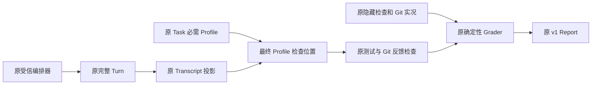
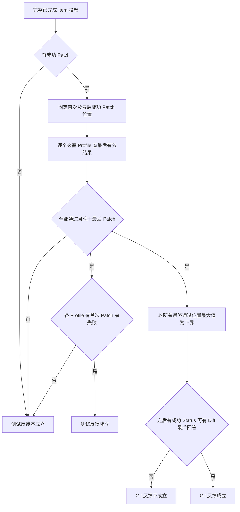
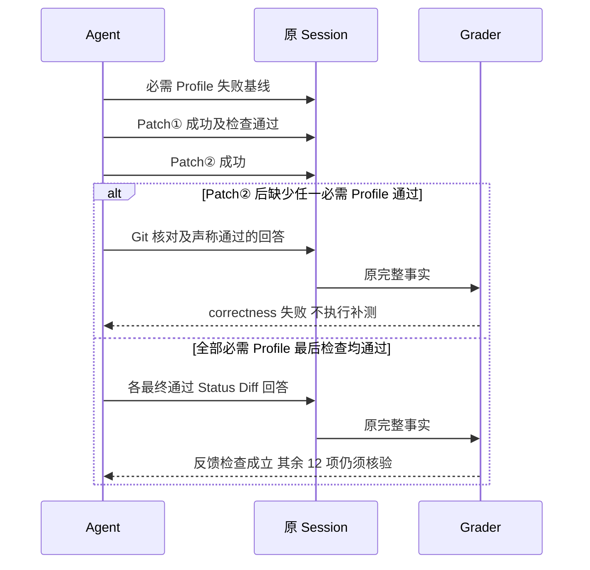

# 最后一次成功修改与可见验证反馈绑定整改

## 1. 需求背景

Coding Eval 的既有闭环要求是失败测试、已归因修改、再次测试、Git 状态/差异核对与最终回答。
原 `_feedback_order` 用首个成功 Patch 的位置核对全部后继通过结果；第二次成功修改可能发生在这些结果之后。
由此产生反例：失败基线 → Patch① → 测试通过 → Patch② → Git 核对 → 回答，没有验证 Patch②，却返回反馈顺序合格。
外部最终隐藏检查即使通过，也不能替代 Agent 在 Session 中完成的可见反馈闭环。
本整改关闭评分实现的误接受窗口，不修改历史成绩，也不声称解决模型不调用工具或默认工具装配的缺口。

## 2. 设计目标、非目标与验收条件

1. 每个必需 Profile 的失败基线仍位于首次成功 Patch 前，不要求每次修正前重复制造失败。
2. 每个必需 Profile 的最后有效检查均通过，且位于最后一次成功 Patch 后。
3. Git Status、Diff 按顺序位于上述全部最终检查之后，最终回答在 Diff 之后。
4. 未完成 Item、失败/拒绝 Patch、缺失结果不能形成成功修改或检查证据。
5. 原单修改成功场景、14 项检查顺序/分类、任务/报告 Schema、预算与持久化保持。

不新增 LLM Judge、网络调用、评分后自动重测、Runtime 自动工具调用、数据库表或补签旧记录。
评分器不能证明证据来源认证或并发外部写入下的物理版本一致性；来源验证仍属于原受信编排器。

## 3. 总体架构与模块边界



`_transcript` 保持原 Completed Item 和 Tool Call/Result 关联算法。
新增私有选择器只从原投影取得最后成功修改后的每个必需 Profile 最后有效检查位置。
`_feedback_order` 负责首次失败基线与最终通过；`_git_feedback_order` 负责同一组最终通过之后的 Status/Diff/回答。
`grade_coding_eval` 继续组合原 14 项结论，不接管测试执行或修改 Session。

## 4. 核心流程与失败语义



多次修改中，早期通过结果不能覆盖最新修改。某 Profile 最后失败或缺失时整体最终检查选择失败。
修正后再次通过是合法闭环，不要求只有一次 Patch 或一次测试；无关 Profile 不满足必需 Profile，也不重置其证据。
失败仍属于原 `correctness`，不把基线可复现的 Agent 失误改为 `eval_infrastructure`。

## 5. 多修改正常与反例时序



通过只表明反馈顺序条件成立，不能替代隐藏行为/回归、Git 变更边界、回答一致性、预算及完整 Turn 终态。
评分器不接受模型正文中的“已测试”代替 Tool Result。

## 6. 接口设计与源码阅读

公共 `grade_coding_eval(task, turn, *, run_id, environment, started_at, completed_at, baseline_observations, final_observations, git, required_review_finding_ids=())` 不变。
私有 `_final_test_positions(task, transcript) -> tuple[int, ...] | None` 返回按必需 Profile 顺序排列的最终通过位置；任一缺失、不通过或旧于最后 Patch 返回 `None`。
`_feedback_order` 和 `_git_feedback_order` 共用它，避免两个检查采用不同修改边界。
实际实现位置：[`_final_test_positions`](../../src/harnessix/evals/grader.py#L214-L226)、[`_feedback_order`](../../src/harnessix/evals/grader.py#L229-L240)、[`_git_feedback_order`](../../src/harnessix/evals/grader.py#L243-L264)。

| 阅读顺序 | 源码入口 | 职责 |
|---|---|---|
| 1 | [既有任务/报告合同](../../src/harnessix/evals/contracts.py) | 固定 Profile、14 项检查和 v1 Schema |
| 2 | [效果判定](../../src/harnessix/evals/grader.py#L74-L83)、[Transcript](../../src/harnessix/evals/grader.py#L138-L186) | 成功修改与 Completed Item 投影 |
| 3 | 同文件 `_final_test_positions`、`_feedback_order`、`_git_feedback_order` | 最后修改后的全部最终检查与 Git 下界 |
| 4 | [原评分回归](../../tests/evals/test_grader.py) | 单修改、隐藏检查、预算及报告兼容 |
| 5 | [多修改反馈回归](../../tests/evals/test_grader_final_feedback.py) | 正式报告层的误接受反例与多 Profile 矩阵 |

## 7. 数据结构与关键字段

| 原字段 | 含义 | 本次使用约束 |
|---|---|---|
| `_Transcript.patch_positions` | 按 Item 顺序的成功 Patch 结果位置 | 首项固定失败基线下界，末项固定最终检查下界；不从 Call 或回答猜测成功 |
| `_Transcript.tests` | 已关联正式工具结果的有序 `_TestResult` | 按 Profile 选最后有效项，不把最早通过当作最终通过 |
| `_TestResult.position/profile/passed` | 原 Item 序号、真实 Profile 和已解析执行结果 | 必需 Profile 的最后一项必须 passed 且严格晚于末 Patch |
| `git_status_positions/git_diff_positions` | 原成功只读结果序号 | Status 严格晚于全部最终检查，Diff 严格晚于该 Status |
| `final_position` | 原最后已完成 assistant_message 序号 | 严格晚于 Diff，正文声明仍由原回答一致性检查核对 |

序号只用于原 Turn 内的顺序，不是跨线程时钟、Workspace 版本、MAC 或执行权限。

## 8. 持久化、事务与版本兼容

此为原 v1 反馈闭环的实现缺陷修复：修正多次成功修改时选错参考位置，不新增检查、分类或评分策略。
原 Task/Report/Manifest 的版本、字段及全部 Schema 保持；实际实现通过 `environment.harnessix_revision` 区分。
新评分规则、分类或报告字段扩展仍须提升 Grader Version/Report Spec，不能借本修复引入新规则。
已冻结 v1 报告、Campaign、Suite 和原质量成绩不重算、不覆盖、不迁移；既有 Report Reader 保持原不可变事实。
后继复验必须冻结新候选输入并独立发布，不将修复回归成绩记入真实模型质量。

## 9. 安全、权限与信任边界

沿用原受信编排器取得真实 Session 与检查证据的边界；私有位置选择器不是认证器。
不读凭据，不发布模型正文、Diff 或测试日志，不自动授予 Patch/Git 权限。
失败、未知或未完成写效果仍由 Runtime/Trusted Action 的原语义处理，本纯函数不重放或对账。

## 10. 取消、超时与恢复

原评分为同步纯函数，按已经物化的有界 Task/Turn 遍历，不启动 Task、线程、Process、网络或计时器。
取消/超时 Turn 继续由原 `turn_completed` 等检查分类；本次不改变运行预算或将取消标记为任务成功。
报告持久化失败继续使用原 Report 原子写入错误；恢复读取原报告，不自动用新实现重算旧结果。

## 11. 核心业务伪代码

```text
最终检查位置(Task, Transcript):
    last_patch = 最后成功 Patch 位置，若没有则为 -1
    对每个必需 Profile:
        last = 有效 Tool Result 中该 Profile 的最后一个
        若缺失、未通过、position <= last_patch: 返回 None
        保存 position
    返回全部 position

测试反馈:
    没有成功 Patch -> False
    每个 Profile 缺少首个成功 Patch 前失败 -> False
    返回 最终检查位置非 None

Git 反馈:
    最终检查位置缺失 -> False
    选择 max(position) 之后的首个成功 Status
    选择 Status 之后的首个成功 Diff
    原最终回答必须严格晚于 Diff
```

## 12. 可观测性、测试与验收矩阵

报告沿用固定 `test_feedback_order` / `git_feedback_order`、原公开说明与 `correctness` 分类；不保存新增全文。
专项测试在正式 `grade_coding_eval` 层核对结论、分类和两个检查，不仅测试私有选择器。

| 场景 | 必须结果 |
|---|---|
| 单修改原闭环 | 原通过保持 |
| 再修改未重测但隐藏检查通过、回答声明通过 | 两个反馈检查失败、任务失败 |
| 最后修改后所有必需 Profile 通过并随后核对 Git | 反馈检查通过 |
| 多 Profile 只重测其中之一 | 不足以通过 |
| 某必需 Profile 最后结果失败 | 不以早期通过覆盖 |
| Patch 或检查未完成/没有结果 | 不伪造成功事实 |
| Git 在最终检查前、Diff 在 Status 前或回答在 Diff 前 | Git 反馈失败 |
| 失败/拒绝 Patch | 不计为成功新修改；其他原失败分类保持 |

回归另外覆盖原 Grader、Report、Suite/Task Pack 聚合及可读性/合同/文档门禁。测试集合存在交集时不累加唯一覆盖数。
本地 RED/修复后 GREEN、安装包身份与执行范围均独立留存；没有真实模型请求、Docker 或三平台结果时不得声明它们通过。

## 13. 部署、兼容与回退

仅替换候选 Wheel 中原评分器代码，无新依赖、配置、服务、DDL 或迁移。
运行先冻结 Revision；已开始的原 Suite 不替换其候选身份，新复验使用独立候选链。
回退程序不改写旧报告，不把旧误接受实现作为最新商业验收依据；新输入需按适用候选重新验证。

## 14. 风险、取舍与未完成范围

本规则依据可见 Session 结果顺序，不证明测试进程与文件写入物理瞬间的一致性或外部写者行为。
非必需 Profile 不强制加入任务条件，未记录为成功的 Patch 不推断发生过修改。
R3 最近完整成绩仍是严格 0/20、必需测试 1/20；后继中断没有新质量成绩。
两笔未知费用继续预留，未完成账单结算前不新增自动真实请求；评分修复不解除费用暂停。
真实编码质量、默认完整编码工具/Git 交付、同步响应性、三平台和独立 Beta 仍须单独闭合。
