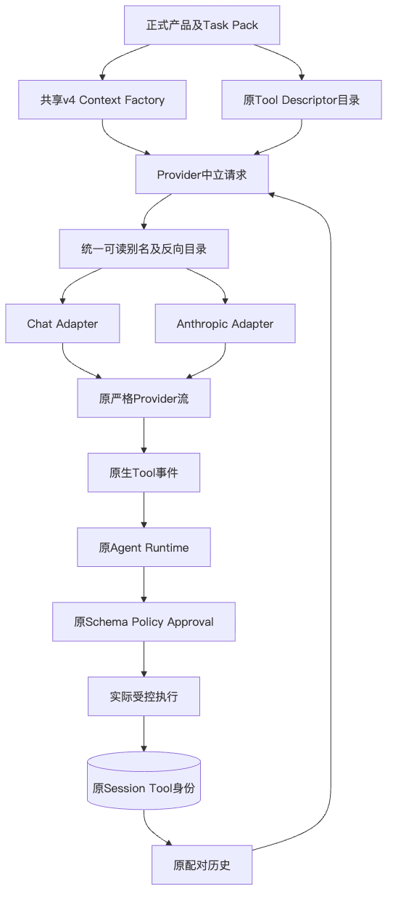
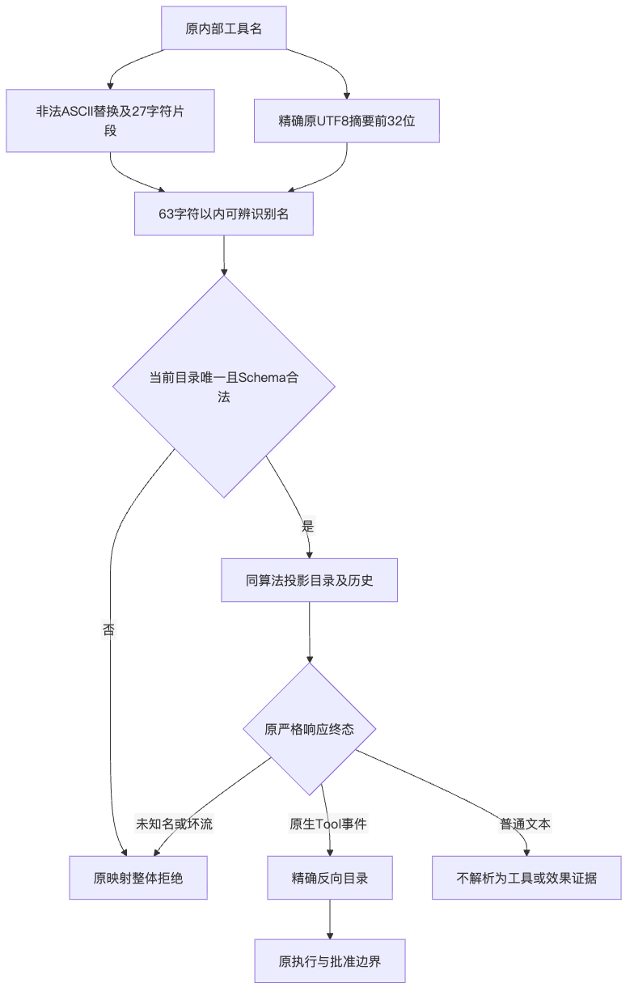
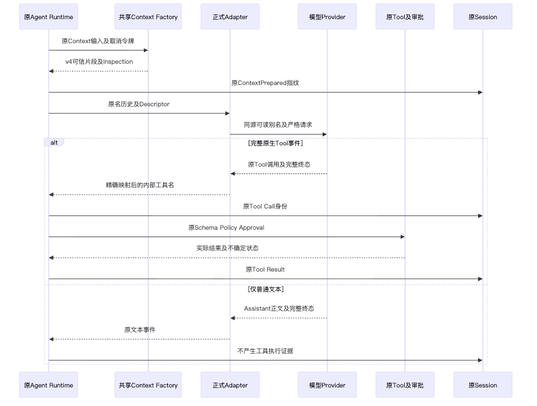
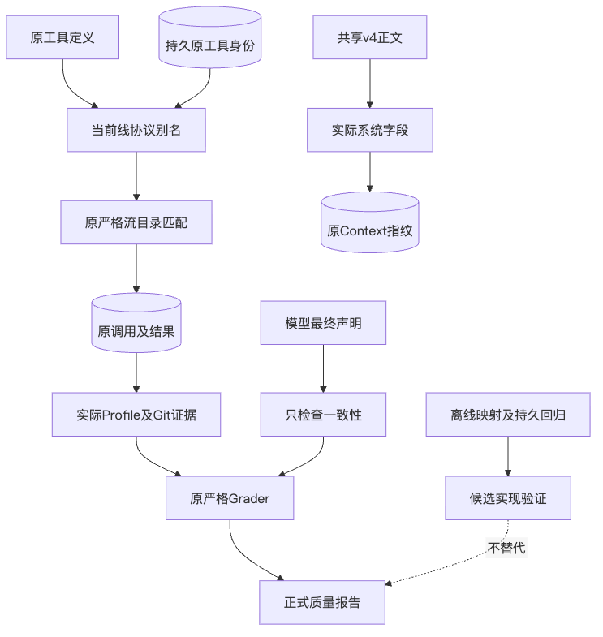

# R3：原生工具身份映射与实际执行指令

## 1. 摘要与验收边界

本变更调整共享工具线协议别名和正式编码指令，不新增执行器、权限、完成状态或自动修复循环。
实际源文件身份、测试和设计图见[统一验证包](../validation/r3-native-tool-invocation-2026-10-02-v1/README.md)。
本文`code_revision`是设计基线；新增实现以验证包的实际文件摘要为准，不能把基线Git blob当成候选新字节。

| 项目 | 当前合同 |
|---|---|
| 工具线协议名 | `hx_`、最多27字符ASCII语义片段、下划线、原名SHA-256前32个十六进制字符 |
| 持久工具身份 | 原`ToolCallContent.tool`不变；别名只存在于一次请求的映射视图 |
| 编码指令版本 | `harnessix.coding-instructions/v4`；正文2749 UTF-8字节，不超过原2751上限 |
| 正式执行 | 仅完整、严格验真的Provider工具事件进入原Runtime和审批链 |
| 文本中的工具标记 | 普通文本；不提升为Tool Call，不解析成执行许可 |
| 质量结论 | 原完整20 Trial仍为严格成功0/20、测试通过1/20；未取得新真实质量成绩 |

## 2. 需求背景与源码研究

固定`7bbce103`的[完整真实结果](m09-r3-real-suite-result.md)已形成20份正式报告。
使用原`SQLiteSessionStore.get_thread`读取全部原Session，读取前后数据库与相关源码字节均不变，得到：

- 11次只有一个模型步骤且没有Tool Call；
- 10次在没有实际Profile终结结果时，最终结构化正文声明测试通过；
- 3次将`<function=...>`或工具结束标记写入普通Assistant文本；
- 3次成功Patch之前没有Profile基线，之后仅执行一次Profile。

上述集合有交集，不能相加为27次失败。13次没有基线及最终观察，也不能说成13次均为单步零工具。
普通文本声称成功与持久Tool Result是不同事实；原Grader没有把这些声明计为成功。

在独立目录以离线记录Provider驱动同候选正式Task Pack首请求，确认10项工具及v3闭环指令均已装配，
排除了“请求未提供工具”这一假设。原别名全部为63字符`hx_`加不透明哈希。
该捕获没有模型网络请求或Profile执行，不是供应商实际收到HTTP正文的证明，也不是新编码成绩。

本地参考源码提供两项设计依据：Codex的`tools/handlers/apply_patch_spec.rs`发布可辨识的`apply_patch`名称；
OpenCode的`tool/registry.ts`及`session/llm.ts`以实际Tool ID构建工具目录。
Harnessix仍保留统一规范化和严格反向目录，不复制供应商修复、大小写回退或正文工具解析策略。
可辨识名称可能改善选择，但不能据此认定不透明别名是唯一根因。

## 3. 设计目标、非目标与取舍

1. 两种正式Adapter及历史投影复用同一纯函数，使工具语义可辨识且满足线协议字符/长度约束。
2. 相同规范化片段、超长共同前缀、Unicode及大小写不同的原名，仍由完整原名摘要区分。
3. 保留原目录碰撞拒绝、未知响应名拒绝、Schema和授权校验；不增加名称猜测回退。
4. 明确最终JSON格式只限制交付正文，不能取代工具执行、基线、修改和最终验证。
5. 原Trial步骤、Token、时间、Tool数量及输出上限不变，不改Task Pack、Grader或价格。

非目标：任务专用答案、自动补造测试证据、解析文本触发工具、Provider新增接口、强制完成状态机、
扩大模型上下文、额外自动请求、账本重置、历史Tool身份迁移。

采用语义前缀加128位摘要片段，而非直接替换所有非法字符后使用原名：后者会把`test.read`与`test_read`
合并。摘要不是授权证明；目录仍检测最终别名冲突，冲突时在发送前整体拒绝。
这是一项请求可用性改善，不保证模型遵循流程。尚未实现业务完成强制门禁，不得宣传其已实现。

## 4. 总体架构与模块边界



`models/_history.py`只负责消息配对及工具别名。两Adapter按当前Descriptor生成别名到原名的反向目录，
严格流解析器在响应终态完整后查该目录。`AgentRuntime`持久化原工具名，再交给既有工具及可信Action端口。
共享Context Factory为产品和Task Pack提供同一v4指令，没有第二套评测专用Prompt。

| 模块 | 职责 | 不承担的职责 |
|---|---|---|
| `_history.tool_alias` | 纯字符串规范化及原名摘要 | 权限、注册、历史迁移、文本工具识别 |
| Chat/Anthropic Mapping | 同源别名、目录、历史投影、请求大小 | 任意工具执行或名称猜测 |
| Provider Stream | 原严格事件、名称和终态校验 | 将模型正文提升为指令 |
| `agent_context` | 版本化可信编码规则及原Source/Compaction装配 | 自动执行、评分或强制完成门禁 |
| Agent/Trusted Action | 原持久执行、批准、取消与恢复 | 依据最终答案伪造效果 |
| Eval Grader | 从原实际证据评分 | 以模型声明补齐缺失基线 |

## 5. 核心流程与失败分支



1. 宿主发布原Descriptor和已配对的持久历史。
2. 别名函数对原工具名逐字符替换非法ASCII字符，截取27字符片段；摘要仍取精确原UTF-8，不做Unicode规范化。
3. Adapter用同一算法转换工具目录和历史Call名称，检查目录唯一性及原请求大小。
4. 仅完整原生Tool Call可反向映射；未知名、旧不透明别名或碰撞没有宽松回退。
5. 原Runtime以内部工具身份创建持久Item，原Schema/Policy/Approval仍独立验证。
6. 普通文本不产生Tool Call；最终结构化正文不能证明工作区修改或检查通过。



指令只影响模型决策，不增加宿主隐式调用。合法只读问题仍可产生纯文本回答；
`TurnStatus.COMPLETED`继续表示协议执行终态，而不是代码质量或任务验收通过。

## 6. 类设计、接口设计与数据结构

本变更不新增持久模型或公共请求字段，复用以下正式合同：

| 结构或接口 | 关键字段或签名 | 解释 |
|---|---|---|
| `ToolDescriptor` | `name/version/input_schema/effect_class/requires_approval` | 工具身份及执行合同不变；描述本来就公布原工具名 |
| `tool_alias` | `(name: str) -> str` | 纯映射；ASCII、最多63字符、稳定、无IO |
| `ModelRequest` | `history/tools/instructions/budget/remaining_tokens` | 只转换视图，不修改原请求对象 |
| Adapter返回目录 | `dict[alias, original_name]` | 当前响应名的唯一反向匹配依据；不是跨请求执行许可 |
| `ToolCallContent` | `call_id/provider_call_id/tool/arguments/tool_fingerprint` | 持久保存原工具名、调用身份和原参数；不写入新别名 |
| `ContextFragment` | `kind/source/content/trust` | v4为Runtime来源；项目、工具和历史仍低信任 |
| `ContextInspectionRecord` | `instruction_fingerprint` | 原事件保存实际送模指纹；不回写旧指纹 |

字段边界：ASCII片段不是安全展示脱敏器；原名已有Descriptor描述，不把别名当秘密屏障。
摘要使用原UTF-8，中文或其他非ASCII名称的片段可以只剩下划线；原名差异仍参与摘要。
同一名称在工具定义和历史Call上产生相同别名，不依赖进程、时间、随机数或Provider。

## 7. 核心伪代码

```text
tool_alias(original_name):
    stem = replace every character outside ASCII letters/digits/_/- with _
    if stem is empty: stem = tool
    identity_suffix = first 32 hex characters of SHA256(original_name UTF-8)
    return hx_ + first 27 characters of stem + _ + identity_suffix

map_request(request):
    validate completed history and unique paired Tool Call / Result groups
    project history names with the same tool_alias
    for each original descriptor:
        alias = tool_alias(descriptor.name)
        reject duplicate alias or invalid original descriptor/schema
        names[alias] = descriptor.name
        publish original schema and description with alias
    enforce original canonical request-byte limit

receive_response(frame):
    validate original stream identity, arguments, Usage and terminal reason
    for each native Tool Call:
        require exact current names-directory membership
        emit ToolCallCompleted with original internal name
    do not reinterpret assistant text as a Tool Call
```

## 8. 指令合同、持久化与恢复

v4增加“实际执行”规则：修改或验证代码必须经原生工具，不能直接生成完成JSON；最终格式仅限制交付正文；
XML工具标记不能代替调用。原修改前基线、最后修改后验证、可信`content_sha256`、Artifact ID、
错误观察、目录作用域、批准、预算及不确定效果停止规则保留。

正文压缩至2749字节，窗口、自动压缩触发值、保留最近组数、Token与输出预留不变。
Context仍由原`ContextPrepared`事件保存指纹；旧Turn指纹、Tool Call原名和历史事件不迁移、不重签。
重开后新请求使用当前映射，同一请求内历史和目录保持一致；不重放已执行效果或旧流。

## 9. 异常、安全与可观测性



| 场景 | 正式结果 |
|---|---|
| 两原名产生相同别名 | 原映射整体拒绝，不发送请求 |
| 响应使用未知名或旧别名 | 原Provider协议校验拒绝，不猜测原工具 |
| Assistant正文出现工具语法 | 仍是文本，不触发副作用或批准 |
| 没有实际工具/检查但正文宣称成功 | 声明不成为效果/检查证据；原严格质量门槛仍失败 |
| 输入Schema、可信摘要或批准无效 | 原执行入口拒绝，别名不能越权 |
| 取消、超时、预算耗尽或UNKNOWN | 原停止与恢复合同，不隐式新增模型请求 |

现有事件、Usage、上下文指纹和质量报告足够观察本变更，不新增原HTTP正文日志或秘密采集。
不能将没有完整证据的评分记录统称为模型能力失败，也不能用通过的映射测试宣称商业质量通过。

## 10. 验证、部署与回退

测试覆盖可辨识前缀、非法字符、Unicode、长共同前缀、大小写、原UTF-8摘要、长度、稳定性、碰撞拒绝、
两Adapter目录与历史一致、持久原名不变、原严格响应名拒绝；指令覆盖实际Factory、两Adapter及新建/重开Session。
RED、修正后的结果和本机版本范围分别固定在统一验证包，不相加重复模式执行为新用例。

实际关联组覆盖179个测试文件，5129通过、57跳过，432个生产源码文件及179个测试文件
执行前后字节未漂移；这是本机相关范围，不是全仓或三平台验收。
原首次关联组的两个失败来自验证宿主把仓库根加入子进程`PYTHONPATH`，
导致任务仓库的`unittest tests.*`被宿主tests包遮蔽；仅修正验证宿主导入范围后原选择器通过，
产品、任务和断言没有为此更改，原失败保留。
独立复审660项通过，限定输入无可复现P0/P1/P2；额外负对照确认伪造目录名被拒绝，
带工具标记及成功JSON的正文仍未执行工具、未形成检查证据，不被认定为质量通过。
以上与局部631／25项有交集，不合计为新增测试总数。

单次构建的同一Wheel在源码目录之外全新安装至Python3.12.7／3.13.8，
两版本各4819通过、57跳过，完整176个关联测试文件和原断言保持，运行时无源码回退。
原初轮两版本各两个宿主`PYTHONPATH`遮蔽失败及单项对照保留；
仅修私有验证环境后复验，不改依赖锁、产品、测试或跳过策略。
全部432个源码模块及包成员与冻结源逐字节相等，ZIP／RECORD完整验证；
该安装证明仍只覆盖本机及上述明确范围，不替代三平台消费者或真实模型结果。

沿原Wheel发布，无新依赖、配置或数据库迁移。回退使用受控旧版本程序；其重新构建的历史与工具目录
仍同源，不继续复用新版本正在进行的HTTP流，不回填旧Session或预算。

最终验收仍需修复后独立冻结的完整3仓10 Case/20 Trial，保持至少12严格成功、至少12测试通过及原安全门槛。
当前真实结果未达标；本变更不能关闭R3、Windows消费者、独立Beta或R1～R6商用门禁。

## 11. 源码与测试阅读索引

1. [`_history.py`](../../src/harnessix/models/_history.py)：`tool_alias`及`messages_for`；
2. [`_chat_mapping.py`](../../src/harnessix/models/_chat_mapping.py)与[`_anthropic_mapping.py`](../../src/harnessix/models/_anthropic_mapping.py)：目录和历史映射；
3. [`_chat_stream.py`](../../src/harnessix/models/_chat_stream.py)与[`_anthropic_stream.py`](../../src/harnessix/models/_anthropic_stream.py)：原严格响应名与终态；
4. [`agent_context.py`](../../src/harnessix/product_config/agent_context.py)：共享v4指令及原Factory；
5. [`runtime.py`](../../src/harnessix/agent/runtime.py)：`_sample`、`_close_model_step`，区分协议终态与质量；
6. [`task_pack_observations.py`](../../src/harnessix/evals/task_pack_observations.py)与[`grader.py`](../../src/harnessix/evals/grader.py)：真实检查证据及原严格评分；
7. [`身份回归`](../../tests/models/test_tool_alias_identity.py)与[`编码指令回归`](../../tests/product_config/test_coding_workflow_instructions.py)：实际跨Adapter和持久边界。
