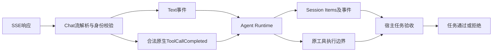
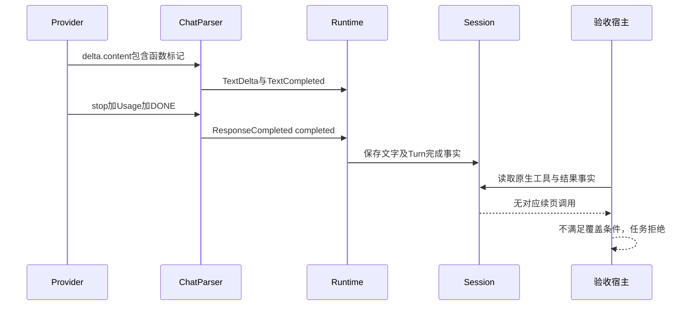
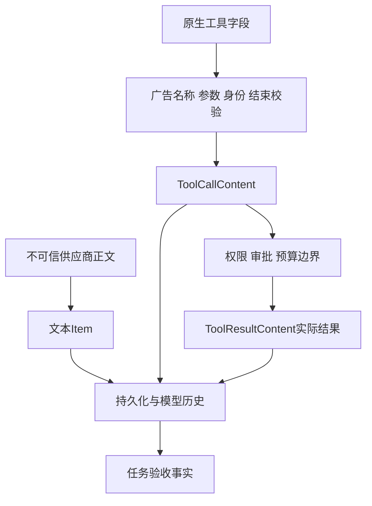

# R3 原生工具字段、工具形态正文与任务验收边界

## 1. 需求背景

[BETA-001 第四次限定分析](../validation/beta-001-readonly-analysis-2026-10-07-v4/README.md)
只产生一次原生文件首页读取，随后返回函数/参数形态的正文并结束。Provider请求和Runtime Turn均完成，
但核心源码覆盖仅1/5，宿主任务门拒绝；不能把协议完成算作需求完成。

原wire未保存，无法仅凭末段文字确定供应商解析、模型输出、工具别名或流式模式是根因。
本切片固化已有执行来源契约，防止将正文解析成额外工具调用来绕过问题；不以离线控制代替线上归因。

## 2. 设计目标与非目标

目标：明确执行来源、保留合法代码示例、验证协议不匹配拒绝、持久化与重开一致，并保持单次失败不自动重试。

非目标：实现XML解析器、检测所有疑似工具文字、强迫工具选择、隐藏重试、切换模型、改变预算、
新增通用任务评分层或修改Agent完成状态。函数标记可作为正常源码说明，不能一律视为非法响应。

## 3. 源码研究与架构决策

| 证据 | 实际结论 | 取舍 |
|---|---|---|
| [_chat_mapping.build_request](../../src/harnessix/models/_chat_mapping.py) | 工具按结构化Schema广告，别名由已有映射生成 | 不改名称或增加第二套工具注册 |
| [_chat_stream](../../src/harnessix/models/_chat_stream.py) | `delta.content`累积为文字；`delta.tool_calls`累积为原生调用 | 保留两种互不替代的来源 |
| [_bounded_http](../../src/harnessix/models/_bounded_http.py) | 原异步包装器观测传输终结符，Parser完成仍要求`seen_done` | 预消费Mock正文不冒充受管流式完成 |
| [_history.tool_alias](../../src/harnessix/models/_history.py) | 原名称与供应商别名映射用于工具身份校验 | 正文中出现同一别名仍不授予执行权 |
| [Runtime](../../src/harnessix/agent/runtime.py) | 根据已验证Provider事件驱动工具和结束；无待调用时允许正常完成 | 通用Runtime不猜测任意业务是否完成 |
| [SQLiteSessionStore](../../src/harnessix/session/sqlite.py)及[replay](../../src/harnessix/agent/reducer.py) | 已持久化Item与事件恢复历史 | 重开不能把历史文字升级为工具效果 |

[百炼官方示例](https://help.aliyun.com/zh/model-studio/qwen-coder)使用响应的结构化`tool_calls`；
[Qwen官方解析器](https://huggingface.co/Qwen/Qwen3-Coder-480B-A35B-Instruct/blob/main/qwen3coder_tool_parser.py)
说明该模型族的函数标记形式。这些资料不证明当前托管服务的解析实现，不作为本次供应商故障结论。

## 4. 总体架构与模块边界



Provider负责线协议、身份和Usage；Runtime负责事件驱动、预算及生命周期；工具Runtime负责权限与效果；
Session负责已发生事实；任务宿主依据预先确定的业务条件验收。正文与调用可以同时存在，但执行只取原生调用。

## 5. 核心流程

1. 已广告工具定义进入请求；现有名称映射、Schema和并行能力限制保持。
2. SSE文本分片产生`TextDelta`；跨标签拼接不触发调用。
3. 原生工具分片只在类型、名称、参数、身份与结束条件校验后产生`ToolCallCompleted`。
4. `stop`在内部映射为`completed`；有文字且无原生调用时正常结束。
5. `tool_calls`结束却没有原生调用，或有原生调用却以`stop`结束，按原`finish_tool_mismatch`拒绝。
6. 合法调用与相同函数标记正文同时出现，仅释放合法调用，不生成重复调用。
7. 已完成文字Turn重开后仍只有文字，无新增工具效果。任务质量另行判定。

## 6. 时序设计



该时序说明“没有额外调用”与“完成真实需求”是不同结论；宿主拒绝不倒写或伪造已完成Turn的原事实。

## 7. 数据流程、持久化与信任边界



正文不是授权指令；历史中的用户消息、助手文字、工具调用和工具结果分别有类型。
不能仅按`TextContent`类型将用户Prompt算作助手结论，也不能按别名字符串将文字算作调用。

## 8. 类与接口设计

| 类型或接口 | 责任 | 本切片变化 |
|---|---|---|
| `OpenAIChatProvider.stream` | 原线协议转换和尝试生命周期 | 无生产变更 |
| `TextCompleted` | 已完整接收的文本内容 | 不增加执行语义 |
| `ToolCallCompleted` | 校验后的原生工具来源 | 不由文本构造 |
| `ResponseCompleted` | 单次模型响应结束与Usage | `completed`不是业务成功状态 |
| `ModelAttemptFinished` | 原尝试完成或失败及类型化错误 | 不改重试语义 |
| `BoundedStream.seen_done` | 原包装器实际观测传输终结符 | 正文包含相同字节不等于包装器已观测 |
| `AgentRuntime.run_turn` | Turn生命周期与工具调用 | 不加入XML恢复或业务覆盖猜测 |
| `SQLiteSessionStore` | 持久化、重开和事件读取 | 无Schema或迁移变化 |
| `RecordingTools`测试夹具 | 记录实际执行调用 | 零调用负控与原生调用正控分开 |

## 9. 数据结构与重点字段

| 字段 | 语义 | 禁止推论 |
|---|---|---|
| `delta.content` | 供应商正文分片 | 包含`function`或JSON形态不等于调用 |
| `delta.tool_calls` | 原生调用分片 | 仍须通过原全部身份与参数校验 |
| wire `finish_reason` | 供应商结束类型 | 不能直接照搬为内部枚举 |
| 内部 `finish_reason=completed` | 语义响应合法结束 | 不证明源码已读、测试已跑或需求已完成 |
| `TextContent.kind` | `user_message`或`assistant_message` | 不能混淆Prompt与助手输出 |
| `Usage` | 已报告输入/输出Token | 不等于实际账单，也不弥补缺失工具效果 |
| `turn.status` | Runtime生命周期状态 | 独立宿主技术门仍可以拒绝该任务 |

## 10. 核心逻辑伪代码

```text
收到分片：
    若content非空：追加文字，发出文本事件
    若tool_calls存在：按原Schema和身份规则累积原生调用
结束：
    核对Usage、DONE、结束类型及调用一致性
    若不一致：原类型化失败，不重试，不释放工具
    若一致：释放已验证原生调用和/或完整文字
Runtime：
    只执行原生调用事件；保存原文字和效果事实
验收宿主：
    读取真实调用、结果及业务证据
    业务条件不足：拒绝任务，不补造工具或改写原Turn
```

这是现有源码的说明，不新增执行实现。

## 11. 错误分类、可观测性、取消与恢复

协议不匹配沿用`invalid_provider_output`及`chat_protocol/v1:finish_tool_mismatch`，失败不可重试，
不泄漏自由正文到诊断。普通函数示例仍是合法文字，不能因关键词拒绝正常回答。
本切片不修改既有取消、期限、输出限制、预算或恢复路径；相关完整回归位于现有Models测试。
新增重开用例确认Replay一致且工具记录为空，不声称覆盖取消途中所有时窗或完整SDK套件。
预消费Mock响应即使含完整原生字节，也因原包装器未观测DONE按`completion_incomplete`拒绝，
不释放调用、不重试；相同字节通过未消费异步流则原生调用正常释放。该对照不宣称所有自定义Transport的内存上界已验收。
可观测结果分别记录原生调用数、文字类型、Attempt终态、Usage与任务技术门；不保存或向公开诊断回显自由正文。

## 12. 安全与隐私

测试仅使用合成路径`fixture.py`、无业务含义的工具`test.read`及测试凭据；不保存客户代码、原Prompt、
真实API Key或未授权正文。原生正控仍使用正式别名映射，不绕过未知名称、参数和身份校验。
离线控制不能解释原wire中未观测字段；后继真实归因须先冻结合成输入、次数、费用及停止条件。

## 13. 测试、部署兼容与回退

新增[15项边界测试](../../tests/models/test_chat_text_tool_boundary.py)：5类正文保持文字、5类正文不能满足原生结束契约、
1项原生与正文并存只释放一次、2项Runtime持久化重开无工具效果、2项相同字节的预消费/异步流完成对照。
分片跨标签、完整与缺失开头形式均纳入；最终Models全量646项通过，不与旧644项或重叠分组相加。

首次运行5项失败源于测试将wire的`stop`误用为内部枚举；原件保留，修正测试使用现有`completed`契约，
不是发现或修复生产解析缺陷。首次静态检查的超长行及格式问题也单独保留。
新增文件与现有诊断、别名和Chat回归共同运行；最终计数与命令由独立验收目录封存，不累加重叠测试数量。

仅新增测试和文档，无安装输入、运行配置、数据库格式、Provider或产品命令变化。
撤销本切片只影响新增覆盖；不能撤销原执行来源边界或掩盖已有Beta失败。

## 14. 验收边界、风险与后续

本切片证明离线协议边界及重开事实，不证明固定模型线上可靠性、有效源码分析、密码整改、浏览器验收、
R3编码质量、三平台发行或商用发布。原真实分析失败保持，真实完成数仍为0。
后继[单变量合成Context配对](../validation/native-context-pair-2026-10-08-v1/README.md)在五工具不变时比较一个system包有无，
两臂均取得原生续页，不支持将产品Context或五工具认定为该合成场景必然失效的原因；旧v4仍未归因。
[完整未整改后端前测](../validation/beta-001-complete-baseline-2026-10-08-v1/README.md)保持FAIL，
后续须解决真实长结果/任务/历史适用性与业务测试失败；禁止同类第五次分析盲试。
详见[先导任务](../operations/pilot-tasks/001-login-password-protection.md)和[发布门禁](m09-to-v1-release-scope-convergence.md)。

## 15. 人工输入与语义门：接口完成不得追认为正确方案

[后继真实观察](../validation/release-followup-2026-10-08-v2/README.md)通过原SDK提交操作员提供的5完整文件，
单请求completed并经原Session认证重开一致；原五只读能力及动态Context不变，实际工具调用0。
人工提供的用户文本不是Agent自主读取证明，`ThreadView`公开元数据不是内部items；
助手结论只能从认证Thread的`assistant_message`取得。

本次没有原生/正文边界错误，但方案语义拒绝：字段编码格式不代表密码保护，传输类型改变不代表JSON接口兼容，
登录后Token不自动证明登录提交防重放。原模型正文及错误建议保留，不把文字转成工具、不批准无效Patch、
不以协议绿色降低任务语义门。生命周期、工具实际效果、正确方案、最终测试和人工接受分别判断。
验证Guard及生产Adapter/Runtime未变；用量由认证历史单独回读，缺账单仍null而非零。
