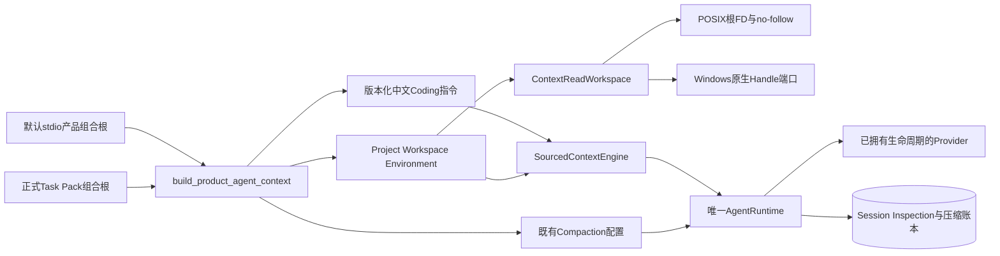
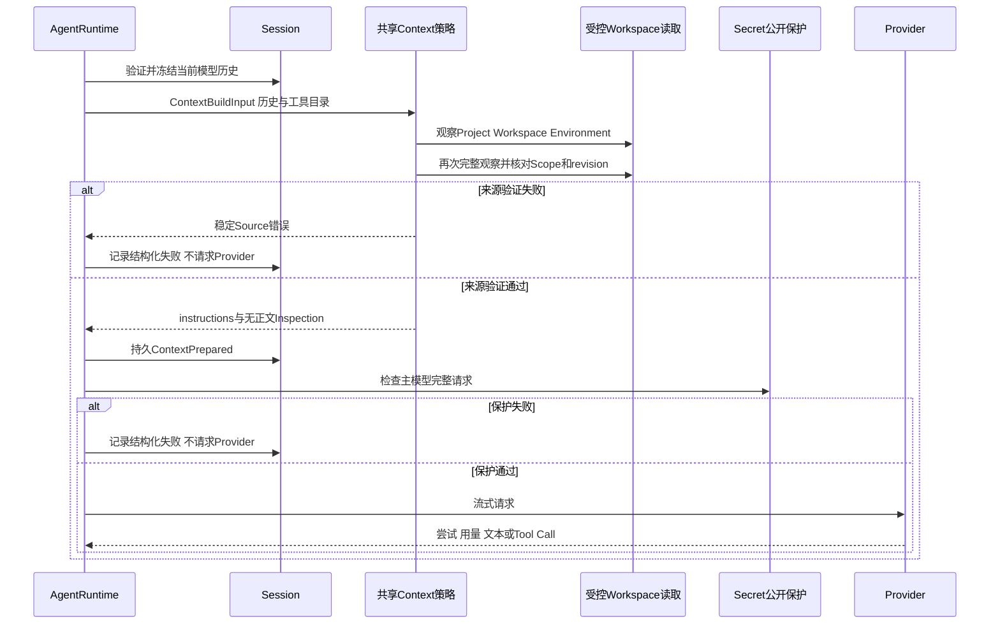
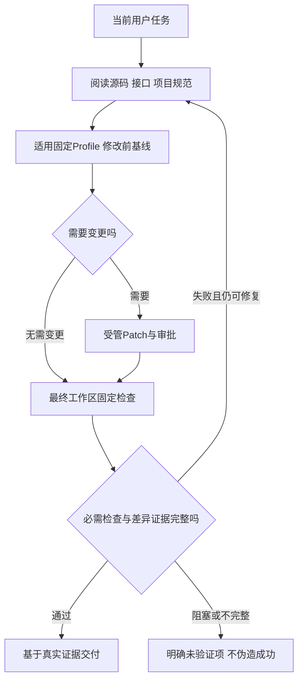

# R3：正式产品Context、编码指令与自动压缩统一装配

## 1. 文档摘要与需求背景

默认产品经stdio App Server构造`AgentRuntime`，正式Task Pack也经同一Runtime、Trusted Action、
Session和Artifact执行。然而在`d1e8d71`上，两处组合根都没有提供`context`、`async_context`或
`compaction`。`AgentRuntime._drive`因此创建`instructions=None`的模型请求；Chat Adapter不会插入
system消息，Anthropic Adapter也没有该字段。库中存在完整Context和压缩实现，并不等于用户获得了该能力。

真实工程Task Pack v2的历史严格成功率和必需检查通过率均为[0/20](../validation/provider-engineering-2026-09-20-v1/README.md)。
缺失编码指令、项目规范和最终检查流程是源码可证实的装配缺口，但尚不能认定为该结果的唯一原因。
整改不修改冻结Task Pack、评分器、成功阈值或历史报告，不补造模型没有执行的检查。

另一项已确认的开放缺口：现行[`ReadFileOutput`](../../src/harnessix/tools/contracts.py)的`revision`是
分页和Workspace观察指纹，不是完整文件内容SHA-256；而[`WorkspacePatchFile.expected_sha256`](../../src/harnessix/delivery/trusted_action_contracts.py)
要求完整内容摘要。当前默认读目录没有提供该摘要，模型不能凭空计算或用分页revision替代。
本次先避免指令混淆；可信完整摘要的模型可达读写闭环仍需独立合同与实现，必须在真实编码质量验收前补齐。

### 1.1 源码研究与架构依据

既有[Context研究](../research/context-planning-and-instructions.md)区分运行时指令、动态项目来源、
窗口预算和压缩。补充核验本地冻结源码：

- Codex `a0dcfe2`的[`session/session.rs`](https://github.com/openai/codex/blob/a0dcfe2ada3f5bbd5059a34c0fc6fac244741a67/codex-rs/core/src/session/session.rs)
  显式保存基础指令的自定义、继承或模型来源，不能把模型默认行为当作应用指令；
- OpenCode `69c172e`的[`session/llm/request.ts`](https://github.com/anomalyco/opencode/blob/69c172e8a7c0086887b1f93ed5a162f14b6aa0c5/packages/opencode/src/session/llm/request.ts)
  在模型请求准备阶段合并Agent基础指令和受控system上下文。

Harnessix采用独立编写的中文工程指令和既有信任合同，不复制第三方Prompt，也不引入第二个Agent Loop。

## 2. 设计目标、非目标与约束

1. 默认产品和正式评测复用一份编码指令及Context装配策略；评测不得使用含任务答案的专用system Prompt。
2. 每个模型步骤刷新项目、目录和有限环境事实，保留来源、信任、预算、revision和指纹证据。
3. 接通既有可恢复自动Compaction；主模型和摘要模型使用同一已拥有生命周期的Provider Bundle。
4. Windows动态Context复用原生Handle只读端口，不能退回普通`Path.read_text`或不安全POSIX替代。
5. 不改变审批、工具权限、执行命令、冻结数据合同或评分方式；来源错误、超限和凭据命中均失败关闭。

本次不实现模型容量动态发现、精确Tokenizer、语义检索、Git写入的Windows后端、全局用户配置指令，
也不宣布R3或1.0已完成。模型质量必须由新的完整、预注册真实Suite检验。

## 3. 总体架构与模块边界



| 源码位置 | 单一职责 | 明确不承担的职责 |
|---|---|---|
| [`agent_context.py`](../../src/harnessix/product_config/agent_context.py) | 构造编码指令、三类来源及压缩配置 | 不读取Key、创建Provider、修改Task或执行Tool |
| [`read_workspace.py`](../../src/harnessix/context/read_workspace.py) | 给Source提供跨平台受控读取门面 | 不扩大路径权限、不提供写入、不替代OS Sandbox |
| [`sources.py`](../../src/harnessix/context/sources.py) | 项目候选发现、双观察、来源合同 | 不接受来源自报Runtime/User信任 |
| [`server.py`](../../src/harnessix/product_config/server.py) | 默认产品生命周期与共享装配 | 不创建第二摘要Client、不跳过启动认证 |
| [`task_pack_trial.py`](../../src/harnessix/evals/task_pack_trial.py) | 正式Trial使用相同装配 | 不注入解题答案或额外评分事实 |
| [`runtime.py`](../../src/harnessix/agent/runtime.py) | 持久状态机、模型循环、压缩及授权 | 不把Prompt当作执行权限 |

新增门面是两个既有只读后端的薄适配器，不是第三个文件系统后端。POSIX目录revision保持原算法，
Windows目录revision来自原生稳定目录观察；Scope算法仍由原后端决定，保持与Coding Tool一致。
结构治理只登记组合根所需的`product_config -> context`精确依赖边，不放宽循环依赖、大小或复杂度门禁。

## 4. 核心流程、数据流与完整文字描述

### 4.1 每步骤准备与送模



1. Runtime先保持Tool Call/Result闭合组和既有Artifact验证；不以Context装配删除历史事实。
2. 三个动态Source按固定顺序观察两轮，要求同一Workspace Scope、稳定revision及相同观察正文。
3. Project在绑定根工作目录中优先选择`AGENTS.override.md`，缺失时选择`AGENTS.md`；
   仅“明确不存在”允许尝试下一个候选，错误类型、链接、权限或超限不能按空文件处理。
4. Workspace只提供有界一级目录概览，敏感名称仍被既有路径策略过滤。
5. Environment只提供OS、platform和工作目录事实；默认不传入`os.environ`、Allowlist或Secret引用。
6. Context Engine按固定信任优先级规划，必选Runtime指令不能省略。Inspection保存指纹而不是指令正文。
7. 所有主模型与摘要请求仍经过正式公开保护；项目指令中的活动凭据命中时阻止送模。

当前默认工作目录为Workspace根。子目录指令由Agent在处理该目录前通过受控只读工具检查；
默认装配没有自动随编辑目标改变Source工作目录。库仍支持宿主显式设置子目录，不宣称自动全仓指令加载。

### 4.2 编码闭环的数据流



中文编码指令明确修改前基线和最终验证是不同事实，工具必须以当前目录为准；分页revision与Patch要求的
完整内容SHA-256不同。缺少可信摘要时不能猜造，必须报告阻塞。
Profile仍由宿主固定命令、参数和隔离等级。模型不能通过文字获得任意Shell、联网、依赖安装或审批豁免。
Task Pack的首末Profile观察提取和严格Grader不变；模型只执行一次检查时，不能补成两份事实。

### 4.3 长会话持久化与重启

历史估算超过触发阈值时，在Context规划之前调用既有Compaction主链。计划、摘要请求意图、观测用量、
候选和活动窗口继续进入同一Session账本。摘要请求无Tool目录，不继承项目执行权限；摘要失败、取消、
超限或无法验证时不能激活窗口。重启复用已经持久的窗口，不重放可能计费的摘要尝试。

## 5. 类设计、接口设计与数据结构

| 类/函数 | 输入输出 | 核心字段与含义 |
|---|---|---|
| `ProductAgentContext` | 不可变内部装配值 | `context`是异步Planner；`compaction`是既有版本化配置；不包含Key或Client |
| `build_product_agent_context` | 绑定Workspace和输出预留 → 上述值 | `max_output_tokens`严格为1～1,000,000整数；产品取活动Fallback链最大输出上限 |
| `ContextReadWorkspace` | 根、拒绝路径 → 只读门面 | `_reader`是本机既有后端；`scope`保持后端身份；`parts`保持敏感路径策略 |
| `directory_revision` | 逻辑路径、协作ReadOperation → SHA-256 | POSIX根FD算法不变；Windows复用完整稳定目录页观察 |
| `read_file` / `list_files` | 已有输入合同 → 已有分页输出合同 | `expected_revision`、截断、下一页、字节限制不变 |
| `ContextInspectionV3` | 既有持久合同 | 三来源快照、双观察一致性、指令指纹、预算及省略决定；不存正文 |
| `CompactionRuntimeConfig` | 既有持久配置 | 触发与目标估算必须有滞回；摘要请求仍占Turn实际Token和deadline |

### 5.1 固定宿主预算

| 参数 | 默认值 | 选型原因与限制 |
|---|---:|---|
| Context可用输入估算 | 262,144 | 以`utf8-bytes/v1`计数；是宿主有界请求策略，不是Provider容量认证 |
| 输出预留 | 活动Fallback链最大值；库默认65,536 | 不低估链上可能切换的输出需求；不是额外可消费Token |
| Provider Overhead / Safety Margin | 512 / 1,024 | 沿用既有Context契约；总窗口由输入、预留及余量相加 |
| 自动压缩触发历史 | 131,072 | 给最多64 KiB项目指令、有限目录/环境和Tool Schema留下空间 |
| 目标历史 / 摘要估算预留 | 65,536 / 12,288 | 摘要和最近闭合组不超过目标；保留滞回避免每步压缩 |
| 摘要输入估算上限 | 262,144 | 仍有独立Source/Plan上限，不允许任意长摘要输入 |
| 摘要输出上限 | `min(max_output_tokens, 2048)` | 输出Token仍受Turn剩余预算和实际Provider配置约束 |
| 最近闭合组保留 | 2 | 沿用不拆Tool配对及固定当前用户的算法 |

估算Token不等于供应商计费Token。若必选历史、工具目录或不可拆保留组超限，仍显式失败；
自动压缩不保证任意巨大单步输出或全部Provider窗口均可接受。首发只承诺另行真实验证的认证组合。

### 5.2 核心业务伪代码

```text
product startup:
  先验证独立Key、原Session、Provider、只读工具和Action Owner
  shared = build_product_agent_context(bound workspace, fallback chain output reserve)
  AgentRuntime(async_context=shared.context,
               compaction=shared.compaction, summary_provider=owned bundle)

each model step:
  history = verify closed groups and Artifact bindings
  if history estimate > compaction trigger:
    history = existing durable summary/validate/activate pipeline
  observations = read all sources twice through owned no-follow/native readers
  require same scope and source revision
  instructions, inspection = bounded trust-aware Context Engine
  persist inspection without source body
  protect full outbound request against active secrets
  call owned provider with existing cancellation and attempt accounting

Task Pack:
  construct the same shared strategy, not a task-specific answer prompt
  collect actual calls/results; retain missing baseline/final as strict failure
```

## 6. 失败语义、取消、超时与恢复

| 边界 | 行为 | 不允许的降级 |
|---|---|---|
| 指令明确缺失或空白 | 保留empty来源快照及Runtime指令 | 不把读取异常当作缺失 |
| 硬链接、Symlink/Reparse、二进制、权限拒绝 | 稳定Source错误，停止送模 | 不用普通Path API重读 |
| 文件/目录页漂移、两轮Source变化 | 结构化失败，原事实不修改 | 不混合不同revision继续请求 |
| Project超过64 KiB | `context_source_too_large` | 不静默截断项目规范 |
| 固定输入超预算 | `context_budget_exceeded` | 不截断Tool Schema或拆开闭合历史组 |
| 活动凭据命中 | `public_output_secret_leak`，Provider未调用 | 不“清洗”后追认同一请求 |
| Source取消或超时 | 既有协作ReadOperation停止并回收线程和FD/Handle | 不遗留后台读取者 |
| 摘要失败、取消或未知尝试 | 既有压缩账本结算；不发布活动窗口 | 不绕过完整Usage或重放不确定付费请求 |
| 重启 | 重读原事实、指纹、窗口和Key | 不把新项目规范当作旧请求正文的历史证明 |

Context不是保密沙箱，Prompt也不是授权体系。读路径、凭据保护、Policy、Approval、Owner及进程监督仍是执行边界。

## 7. 安全、部署、迁移与可观测性

- 不新增SQLite迁移或公共Schema；已有Context Inspection和Compaction事件合同承载全部事实。
- 默认产品启用Context与压缩是行为变化：长会话可能新增一个计费用量已记账的摘要请求。
  摘要仍受同一Turn预算、deadline、取消和Provider无重试/受限重试配置约束。
- 只复用已有Provider生命周期，不双重关闭或创建脱离Owner的新HTTP Client。
- Windows源码接线及端口合同不等于Windows整条Coding Agent可商用；原生核心写入/测试/恢复仍属于R4。
- 不读取全局用户Keychain或进程环境以生成Context；测试凭据只由私有验证宿主取得并注入正式Provider。
- 既有Telemetry记录history、context、compaction和model阶段；Source正文不加入新的公开日志。

## 8. 测试验证、验收与源码追踪

| 测试 | 直接证明的边界 |
|---|---|
| [`test_server_and_cli.py`](../../tests/product_config/test_server_and_cli.py) | 真实默认产品组合根送模含Runtime及项目指令；整改前同一断言失败 |
| [`test_agent_context.py`](../../tests/product_config/test_agent_context.py) | 信任、三Source Scope、根Override、环境不采集、刷新指纹、输入限制、凭据出站拒绝、重启后自动压缩与完整尝试用量 |
| [`test_windows_sources.py`](../../tests/context/test_windows_sources.py) | 原生读取适配合同、候选缺失、Scope一致、敏感路径隐藏、错误和资源关闭；单独区分真实Windows宿主测试 |
| [`test_sources.py`](../../tests/context/test_sources.py) | 原POSIX分页、竞态、取消/超时、动态组合合同保持 |
| [`test_compaction_runtime_recovery.py`](../../tests/context/test_compaction_runtime_recovery.py) | 已有崩溃、恢复和摘要不重放语义保持 |
| [`test_task_pack_execution.py`](../../tests/evals/test_task_pack_execution.py) | 缺失Profile事实不得补造或改变适用分母 |

执行顺序为受影响单测、Context/Product/Eval回归、完整源码类型检查、Schema不变检查、文档/可读性门禁，
再在干净固定Revision中做Container集成和真实Suite。证据不覆盖未执行环境或真实Beta。

固定源码的受影响回归为666通过、7跳过；另一个干净工作树使用独立Python 3.12.7环境重复同一组回归，
同样为666通过、7跳过。完整环境、检查范围、费用及未执行项见[低敏验证报告](../validation/product-context-2026-09-28-v1/README.md)。

## 9. 限制、风险与发布门禁

1. 静态指令改善工程行为概率，不保证模型一定运行检查或生成正确Patch；真实质量仍须重新检验。
2. 本文不覆盖新的模型计价矩阵；费用按真实Usage和地域价格匹配，未知成本不得写为零。
3. 根指令自动加载不等于全部子目录规范已自动理解；仍需任务相关源码阅读和受控工具检查。
4. 认证备份、许可复核、三平台正式安装/核心链及真实Beta仍属于开放工作包；不得据此发布1.0标签。
5. 完整内容SHA-256的模型可达读取尚待补齐；当前装配不解决替换文件前置指纹来源，不能据此宣称可用编码闭环。

阅读顺序：共享Factory → Source双观察 → 跨平台Reader → Runtime Context提交 → 既有压缩账本 →
产品/Task Pack装配及测试。完整R1～R6退出条件见[发布范围计划](m09-to-v1-release-scope-convergence.md)。
