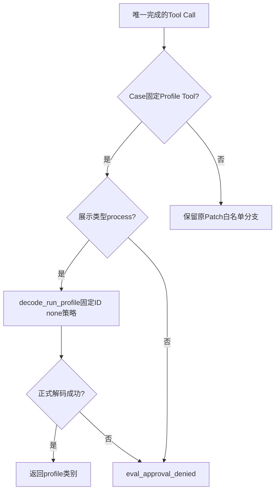
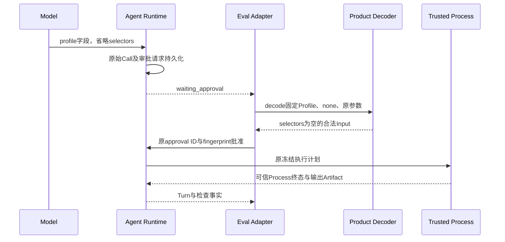

# Task Pack Profile审批复用正式输入解码器

## 1. 需求背景、实际故障与设计目标

Revision `629b072`的完整工程Suite预注册3仓10 Case/20 Trial后，在首个Trial两次模型请求后停止。
持久Session停在`waiting_approval`：模型调用固定`run_profile.agents-dump-compatible-refactor-check`，
只提供合法`profile`字段；产品公开Schema仅将该字段列为必填，`selectors`允许省略并默认为空。
评测审批器却比较原始JSON与包含显式`selectors=[]`的字典，因而返回`eval_approval_denied`。
验证CLI按既有公开错误白名单输出通用`verification_host_failed`，未形成Trial或完整Suite报告。

这是评测适配器与既有产品契约不一致，不是模型越界，不是Docker启动或Profile检查失败。
两次请求全部完成预算结算，增量估算CNY 0.042192；当前70元周期已知估算累计0.292216、未决占用0。
不将费用估算称为供应商账单，不将未完成Suite登记为0/20或完整质量成绩。历史完整0/20继续保持。

目标是复用产品正式解码器判定同一Profile、零Selector和禁止额外字段，消除合法默认输入的误拒绝。
非目标包括修改模型、Prompt、Tool Schema、原评分器、Task Pack、进程程序、镜像、资源、Secret或批准指纹。

## 2. 总体架构、模块边界与风险取舍


- [产品契约](../../src/harnessix/product_config/process_action.py)拥有`RunProfileInput`、公开Schema和
  `decode_run_profile`，决定默认值、类型、未知字段和选择器策略。
- [评测适配器](../../src/harnessix/evals/task_pack_trial.py)只决定Case对应的Tool、审批展示类型、Profile和Path白名单；
  不再实现另一份Profile输入规范。
- 原`AgentRuntime.reply_approval`负责审批请求Fingerprint和状态；原Trusted Action/Process负责执行与审计。
- [Task Pack装配](../../src/harnessix/evals/task_pack.py)仍从冻结Manifest构造固定Profile，强制`selector_policy=none`。

不选择“给真实模型Prompt强加显式空字段”：合法Schema输入必须可执行，额外措辞不能替代契约修复。
不选择“原字典自行补默认值”：这会复制产品默认逻辑并遗漏未知字段、类型和策略校验。
不选择“忽略审批错误继续评分”：未批准或未获得可信Process终态不能生成检查通过事实。

## 3. 接口设计、数据结构与领域契约

| 元素 | 输入/字段 | 责任及约束 |
|---|---|---|
| `run_profile_schema(profile_id)` | `required=[profile]`，`selectors.default=[]` | 既有公开契约，不修改 |
| `RunProfileInput` | `profile: str`，`selectors: tuple[str,...]=()` | 严格、冻结、未知字段拒绝；选择器最多32项且受安全规则限制 |
| `decode_run_profile` | Case Profile ID、`none`、原`call.arguments` | JSON严格解码；必须同一Profile，任何非空选择器拒绝 |
| `_approval_call` | Turn及Approval的`call_id` | 找到唯一已完成Tool Call；缺失或重复仍失败关闭 |
| `_require_allowed_approval` | 原Turn、Approval、冻结Case | 固定Tool及`presentation=process`后调用正式解码器；只返回`profile`或抛既有错误 |
| `request_fingerprint` | 原审批请求摘要 | 不重写、不替换；原Runtime继续验证并绑定执行 |

数据流是原始JSON→纯解码校验→语义白名单判断。Typed Input只用于校验，不回写Session、Tool Call、
Execution Plan或批准参数。省略字段和显式空字段可以具有不同请求Fingerprint，不能互换已批准的身份。



## 4. 时序、核心伪代码与持久化



```text
call = 由approval.call_id找到唯一完成Tool Call
若call.tool是Case固定Profile Tool：
    若presentation不是process：拒绝
    用decode_run_profile(case.profile_id, none, 原arguments)解码
    若ValueError：映射为原eval_approval_denied，无第三方错误正文
    返回profile
否则：继续原Patch合同及Path、文件数、禁止删除判断
```

没有新增表、迁移或恢复协议。原审批回复、Process Lease、检查Artifact、Campaign和Suite发布顺序不变。
已完成Trial恢复仍不能创建Provider；报告发布窗口崩溃仍从原Session重建，不重复执行或合成结果。

## 5. 失败语义、安全与可观测性

| 情况 | 处理 |
|---|---|
| 同一Profile，省略或显式空Selector | 合法默认输入，经过原审批及执行链 |
| 其他Profile、缺失Profile、非空/错误类型/Null Selector | 原`eval_approval_denied`，不执行 |
| 额外程序、环境或其他未声明字段 | 产品解码器拒绝，保持原错误 |
| 非process展示、审批缺少唯一Call | 保持原拒绝；不改变Patch或投影错误 |
| 已有Profile结果但无可信Process终态 | 保持`eval_baseline_invalid`，不降级为虚构通过 |
| 旧失败Suite跨代码Revision恢复 | 原源码绑定拒绝；必须新Suite ID、配置和私有运行根 |

不扩大执行白名单。仍由原SDK/Session/Audit记录Call、Approval、Process和Usage；没有自动批准任意Shell、
扩大选择器、读取Secret或解除容器网络隔离。公开验证只发布计数、稳定错误码及摘要，不输出Key、模型正文、
私有Workspace或第三方异常。原失败日志、预注册、预算结算和Session保持在私有验证根。

## 6. 测试与验收计划

1. [纯参数回归](../../tests/evals/test_task_pack_execution.py)验证两种空默认输入及缺字段、错Profile、
   非空/错误类型/Null Selector、程序、环境和展示类型负例。
2. [原产品输入测试](../../tests/product_config/test_process_action.py)继续证明Schema、默认值及策略，不修改产品合同。
3. [真实录制Agent链](../../tests/integration/test_task_pack_execution.py)参数化省略/显式Selector：
   只在测试中改录制事件的合法字段形式；两Trial必须仍有原Process检查、严格通过、自动审批计数和零成本。
   Report/Campaign崩溃恢复不能重新创建Provider或重放完成效果。
4. 完整关联Evals、Ruff、Mypy、Schema及文档门禁；固定候选统一CI，结果不从单项测试外推。
5. 新候选上重新预注册原3仓10 Case/20 Trial，由原70元周期持久预算宿主运行真实百炼；
   原阈值、每仓要求、安全限制、单次尝试和失败保留不变。旧未完成Suite不能拼接到新成绩。

合法参数回归通过不等于真实质量或商用发布通过。消费者Windows11、独立Beta和最终同候选R1～R6仍须独立验收。

## 7. 部署、兼容与回退

修正随原Python包发布，无新依赖、配置字段、数据库迁移或守护进程。旧显式空Selector仍合法；省略Selector
恢复既有产品Schema承诺。已保存请求、批准摘要和旧报告原字节不重签，不将不同JSON表示的批准互换。

验证先在干净已提交Revision上冻结原Pack和Engine绑定，再创建新的Suite配置及私有Work Root，复用原预算周期。
旧失败运行继续绑定`629b072`，不能通过`--resume`跨实现版本继续，也不能清除原预留或复用新周期增加额度。
回退按原停机/备份/旧包流程，不需要修改状态库；旧实现可能重现合法默认输入的误拒绝，应登记能力限制，
不能把回退称为该缺陷已修复。正式版本仍需最终同候选门禁，不创建提前商用Tag。

## 8. 源码与测试追踪映射

| 设计点 | 当前源码 | 验证锚点 |
|---|---|---|
| Schema必填及默认值 | [process_action.py](../../src/harnessix/product_config/process_action.py) `run_profile_schema`、`RunProfileInput` | 原`test_process_action.py`及默认输入正例 |
| 同一Profile及零Selector | 同文件`decode_run_profile` | `test_profile_approval_rejects_non_fixed_or_invalid_formal_inputs` |
| 审批分类及正式解码 | [task_pack_trial.py](../../src/harnessix/evals/task_pack_trial.py) `_approval_call`、`_require_allowed_approval` | `test_profile_approval_accepts_formal_empty_selector_defaults`及展示类型负例 |
| 原批准身份与执行 | 同文件`_drive_turn`；[agent/runtime.py](../../src/harnessix/agent/runtime.py) `reply_approval` | 两Trial实际审批、Process结果及恢复断言 |
| 参数表示差异与恢复 | [test_task_pack_execution.py](../../tests/integration/test_task_pack_execution.py) 测试内录制事件参数化 | `test_task_pack_case_runs_two_trials_through_formal_agent_campaign_and_reopens`的两个参数组合 |
| 固定Task Pack与宿主范围 | [task_pack.py](../../src/harnessix/evals/task_pack.py)、[预算宿主](../../scripts/run_engineering_provider_suite_budgeted.py) | 原Pack冻结检查、源Revision及RepoDigest预检 |

未来产品解码器语义变化会影响评测审批，因此默认值、未知字段、非空选择器及错Profile负例必须继续保留。
不能为了新模型成功率把`none`替换为宽选择器策略；这种变更需要独立任务合同与评审，不属于本修正。
