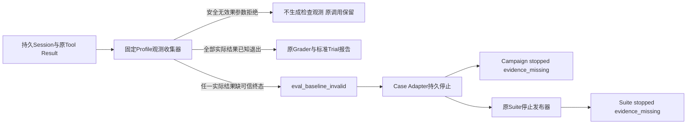
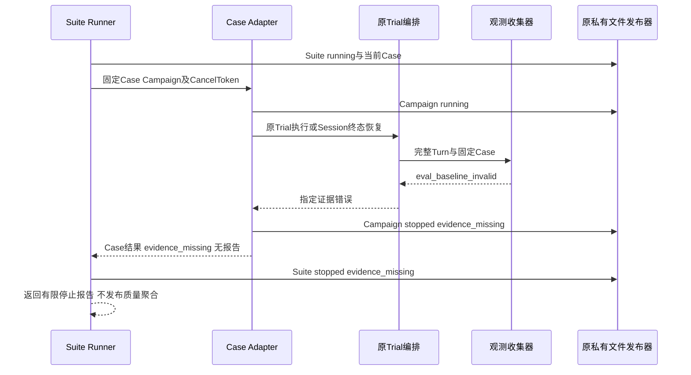
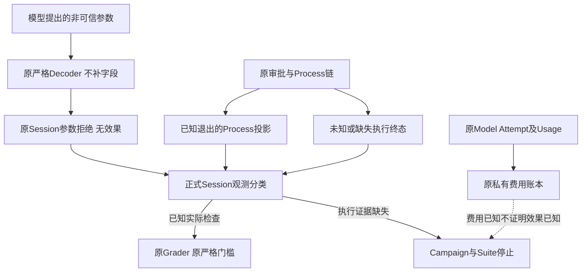

# R3 固定Profile观测分类与证据缺失停止：总体及详细设计

## 1. 需求背景与故障证据

真实编码评测应分别记录模型行为、实际检查结果、外部效果确定性和模型费用完整性。
这四类事实不能相互替代。参数被正式Decoder拒绝，表示未形成有效检查；不代表容器检查失败。
反之，工具效果未知时，不能从费用已结算或后续检查成功推断先前效果已确定。

[原真实复验](../validation/bounded-provider-suite-interruption-2026-09-30-v1/README.md)
首个Trial包含七次无效果参数拒绝和一次`unknown/uncertain_effect`，没有标准Trial报告。
后继从原SQLite只读备份读取Session，以白名单字段投影复现`eval_baseline_invalid`；原数据库字节不变。
故障链是：Profile收集器把首个参数拒绝加入实际检查序列，解析不到Process终态而抛错；
Case未将该特定错误转为停止结果，Suite的已发布`running`状态未进入原停止发布器。

**`INTERRUPTED`本身不是该异常的原因。**它已经属于Agent终态集合，`_drive_turn`可以返回该Turn。
这是对原材料中非排他源码推断的后继求证，不修改原运行记录、不补写旧报告，也不追认旧未知效果。

## 2. 设计目标、非目标与验收边界

### 2.1 目标

1. 只从实际固定Profile执行结果提取baseline/final检查，不把安全参数拒绝算作检查。
2. 所有剩余Profile结果逐项要求已知退出，不能让首尾选择掩盖中间未知。
3. 明确的Profile证据缺失进入`Campaign stopped/evidence_missing`和`Suite stopped/evidence_missing`。
4. 重开停止记录时只返回原原因，不打开Provider、不补跑检查、不推进完成前缀。
5. 原模型调用、错误、Token、工具计数和费用记录保留，严格评分不变。

### 2.2 非目标

不改变Agent终态、Token上限、审批、Process执行、Task Pack、Grader、价格或预算；
不增加自动重试、LLM Judge、通用异常归一化或后台恢复服务；不生成真实模型质量成绩。
原3仓库、10 Case、20 Trial、至少12严格成功、每仓成功及零越界门槛保持。

## 3. 总体架构、模块边界与源码映射



Session仍是模型交互事实来源；新收集器只承担检查证据分类，不执行工具或修改Session。
Case Adapter负责本Case的停止持久化，Suite复用已有Case停止接口和原子状态发布器。
Grader只接收完整、可解释的观测，不因本整改扩展成功定义。

| 源码 | 职责与接口 |
|---|---|
| [`task_pack_observations.py`](../../src/harnessix/evals/task_pack_observations.py) | 无IO的`profile_observations(turn, case)`；参数拒绝证明、逐项检查和首尾选择 |
| [`task_pack_trial.py`](../../src/harnessix/evals/task_pack_trial.py) | 物化、Agent执行/Session终态恢复、Git证据、评分和Trial发布；调用独立观测收集器 |
| [`task_pack_execution.py`](../../src/harnessix/evals/task_pack_execution.py) | `_execute_remaining`只转换指定证据错误；`_stop_case`持久化原因；`_run_locked_case`重开不重放 |
| [`campaign_execution_contracts.py`](../../src/harnessix/evals/campaign_execution_contracts.py) | 现有Campaign停止/运行原因增加`evidence_missing`，不新增独立状态模型 |
| [`suite_execution.py`](../../src/harnessix/evals/suite_execution.py) | 原Case停止结果和`_stop`链不变，接收已有`evidence_missing`枚举 |
| [`trusted_action_session.py`](../../src/harnessix/agent/trusted_action_session.py) | 原准备阶段拒绝产生无效果Tool Result，是分类依据，不在本整改范围修改 |

原私有`_profile_observations`导入位置保留为函数别名；实现不复制。
从接近600行的Trial编排文件提取单一观测职责，而不是放宽结构治理阈值。

## 4. 接口设计、数据结构与关键字段

`profile_observations(turn: Turn, case: CodingEvalTaskPackCase)`返回
`tuple[tuple[EvalTestObservation, ...], tuple[EvalTestObservation, ...]]`，分别为baseline/final。
成功空集合表示没有实际检查；抛`KernelError(eval_baseline_invalid)`表示存在不可接受的执行证据缺失。
它是同步纯函数，无取消等待、文件IO、Provider或Executor。

`_stop_case(context: _CaseExecution, state: CodingEvalCampaignExecutionState, reason: CampaignStopReason)`
返回无报告的`CodingEvalSuiteCaseRunResult`。只有原私有原子状态发布成功后才返回；
`context`包含原可信Case/计划/运行根，调用方不能通过任意模型字符串指定停止原因。
Suite端口和`TaskPackCaseExecutor.__call__`签名不变，取消仍传入原`CancelToken`。

| 类型/字段 | 说明 |
|---|---|
| `ToolCallContent.call_id` | 与Tool Result及审批记录关联的正式UUID，不按工具名称猜测执行次数 |
| `ToolCallContent.arguments` | 由原`decode_run_profile(profile_id, "none", ...)`复核；不自动补参数 |
| `ToolResultContent.outcome` | `failed`可能是前置拒绝，也可能是真实非零退出；`unknown/cancelled`不形成已知退出观测 |
| `error.code` | 仅`tool_invalid_arguments`候选可进入无效果拒绝判断，不按错误正文分类 |
| `output` | 安全拒绝必须为空；真实结果要求Profile身份、`state=exited`、`stop_reason=exited`及整数退出码 |
| `action_id`与各效果字段 | 安全拒绝要求全部为空；任何存在的执行、Patch、Trusted或差异效果都不能过滤 |
| 审批记录的`call_id` | 存在同调用审批即不按未执行参数拒绝处理，不依赖当前审批状态 |
| `EvalTestObservation` | 原check_id、phase、passed、returncode、输出投影SHA和耗时；不新增“模拟检查”字段 |
| `completed_run_ids` / `completed_case_ids` | 只有已发布报告的连续前缀可推进；证据缺失的当前Trial不追加 |
| `known_cost_amount` | 原已完成前缀成本，不声称包含未形成报告的当前Trial；实际请求费用仍由独立预算账本保留 |
| `stop_reason=evidence_missing` | 检查执行证据不完整，不等于`cost_unknown`或一个已评分失败Trial |

Campaign扩展同步至
[`execution-state Schema`](../../spec/coding-eval-campaign-execution-state-v1.schema.json)及
[`run-report Schema`](../../spec/coding-eval-campaign-run-report-v1.schema.json)。
字段、版本标签、状态机和原费用停止原因不变；增加有限枚举值属于读者兼容边界，不是任意字符串错误。

## 5. 核心流程及伪代码

```text
收集观测(turn, case):
  建立正式已完成Tool Call的call_id索引和同call审批集合
  按Session顺序遍历已完成的同Profile Tool Result
  若全部满足:
    outcome=failed，error.code=tool_invalid_arguments，output为空
    无Action身份、无任何效果或差异引用、无同call审批
    原正式Profile Decoder仍拒绝该call参数
  则只排除该结果作为检查观测；原Session记录不变
  否则要求已知结果、同Profile、exited状态及严格整数退出码
  任一不满足 → 抛原eval_baseline_invalid，不跳过、不取后续成功覆盖
  无实际检查 → baseline和final均为空，原Grader决定缺检查的结果
  一次实际检查 → 只有baseline
  两次及以上 → 实际首次baseline和实际末次final

Case执行当前Trial:
  先沿原发布器持久running，执行原Trial端口
  仅捕获eval_baseline_invalid:
    原子持久Campaign stopped/evidence_missing
    返回Suite已有的evidence_missing Case结果
  其他KernelError、取消、崩溃及存储异常保持传播
  Trial成功发布报告后才推进前缀及原已知成本

重开Case:
  原计划、执行身份及完整证据前缀校验
  若已有完整报告，按原恢复路径复算
  若stopped，返回原stop_reason；不执行任何新Trial
  否则沿原执行或未知费用停止路径继续
```

已知非零退出仍是真实检查失败，必须保留为`passed=false`，不能过滤所有failed结果。
参数拒绝后的第一次实际检查才是baseline；多次拒绝不改变这项顺序约束。

## 6. 持久化、事务、时序与发布顺序



Campaign停止先于Suite停止。若前者已可靠发布而后者窗口中硬退出，重新进入Case仍返回
同一停止原因，因此Suite可以完成停止发布，无需再次打开Provider。若持久化本身失败，
不得谎报可靠停止；保留异常及已存在的部分事实，后继按原身份和证据恢复边界处理。

## 7. 数据流与信任边界



低敏证据仅包括UUID、结果枚举、错误码、效果存在性、摘要和测试计数。
不复制模型正文、参数值、数据库内容、Workspace或凭据。原SQLite只读备份是诊断输入，
不是复验恢复授权；旧Suite保持原件，不能从新源码补写其报告。

## 8. 异常、取消、超时与恢复矩阵

### 8.1 可观测性与错误分类

正式可观测事实是原Session的调用/结果和两个持久停止文件，不是日志中的异常正文。
外部运行报告保留Suite身份、当前Case、已完成Case数、有限原因和已完成前缀成本。
`evidence_missing`必须与`cost_unknown`分开统计：前者是不完整检查执行证据，后者是费用完整性未知。
未知工具结果、七次输入拒绝及实际模型Usage仍保存在原Session，不为了成功率而删除。
公开诊断只投影错误码和效果存在性，不发布参数值、Secret、模型正文或私有路径。

| 场景 | 行为 |
|---|---|
| 全部为可证实无效果参数拒绝 | 空检查证据，原Grader仍检查缺少必需测试，不伪造成功 |
| 拒绝后出现正常检查 | 只以实际检查建立baseline/final，拒绝保留在工具计数和事件中 |
| 同码结果有输出、审批、Action身份或效果 | 不按安全拒绝过滤；缺退出证据则停止 |
| 真实进程非零退出 | 保留失败检查观测，按原Grader评分 |
| 首项、中间或末项unknown/cancelled/缺终态 | 全部拒绝，停止且不发布该Trial报告 |
| stopped重开，包括Suite显式resume | 原停止原因和完成前缀保持，Provider与Trial重放次数为零 |
| 原未知模型费用 | 原`cost_unknown`与预算停止边界不变，不改为检查证据缺失 |
| 外部取消或期限 | 沿原CancelToken及Agent/Process期限传播，不吞取消、不启动补偿检查 |
| 其他KernelError、IO异常、fault注入 | 不做宽泛转换；保持原异常及恢复窗口 |
| 停止文件发布失败 | 不宣称可靠停止，不改写为已完成或重算费用 |

本整改不增加恢复自动化。完整质量复验必须使用新的固定Revision和完整预注册Suite；
预算仍属于原70元周期，旧20.77824元预留不释放，同一40元额度累计已使用估算。
新Suite范围必须经原唯一授权的明确处置，不创建新周期或偷偷替换Suite身份。

## 9. 部署、兼容与验证方法

没有新依赖、中间件、数据库迁移或产品配置。随正常Python包发布；仅受控评测适配器行为变化。
原Campaign状态和报告都可读取；新`evidence_missing`状态应由本版本及之后的读者处理，
旧读者可能严格拒绝，不通过重签、改写或降级为`cost_unknown`绕过。
真实模型付费前置仍要求私有权限、原账本独占、固定完整Suite、Git源码Revision、固定镜像
及明确宿主身份。Recorded Provider或离线脚本结果不得声称为真实编码质量。

核心测试使用原生产Decoder、Session类型、Case/Suite状态发布和TempFS；仅在Trial端口注入
明确的错误用于发布窗口验证。原源码负对照验证新断言确实能发现故障。
完整源码回归、Schema生成一致性、治理、实际容器宿主前置及源码外安装分别记录，集合不相加。
执行命令、候选身份、失败保留、Review Packet和摘要清单见
[统一验证材料](../validation/profile-observation-stop-2026-09-30-v1/README.md)。

## 10. 风险与商用门禁

本整改防止模型参数错误污染检查证据，并使明确缺证路径可靠停止；不会使模型自动遵循Schema。
真实成功率、完整20 Trial报告、三平台消费者验收及独立Beta仍需各自证据。
R3以及R1～R6不因离线修复、宿主前置或停止记录发布而关闭。
