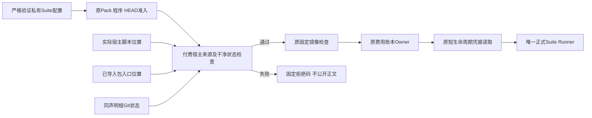
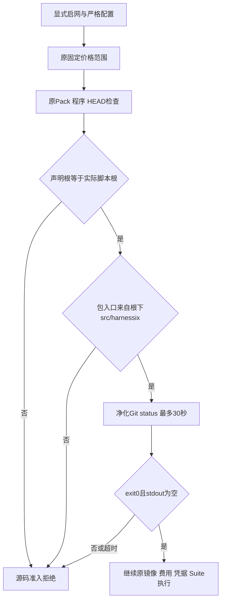
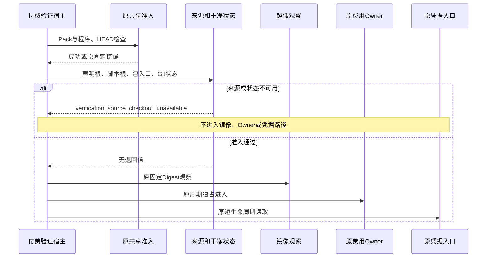

# R3 付费验证宿主源码来源与干净状态准入详细设计

## 1. 需求背景与变更摘要

真实编码结果必须能归属到已提交的候选源码。正式配置生成器已要求干净源码树，
但配置生成与实际付费执行之间可以发生未提交修改；另一个同HEAD副本也可能被填入配置，
而实际导入的宿主或包来自其他目录。只检查声明目录的HEAD不能发现这些差异。

本切片仅收紧[有限付费验证宿主](../../scripts/run_engineering_provider_suite_budgeted.py)的准入：
保持原Pack、程序、HEAD检查，额外确认声明根、实际宿主根、包入口来源相符，且Git状态为空。
不是新增产品功能，也不是独立执行平面、第二评测Runner或通用源码供应链平台。

## 2. 当前实现、源码研究与根因

- [`create_engineering_provider_suite_config._require_clean_revision`](../../scripts/create_engineering_provider_suite_config.py)
  在生成配置时调用`status --porcelain=v1 --untracked-files=all`。
- [`provider_suite_execution._require_source_revision`](../../src/harnessix/evals/provider_suite_execution.py)
  在执行入口核验声明目录HEAD，使用净化环境、30秒上限和固定错误码。
- 宿主原来只调用共享`_require_scope`，然后检查镜像并进入费用Owner。
  共享检查不负责证明脚本和包确实来自声明源码树，也不重复生成时的干净状态检查。

采用直接追加宿主准入，不修改共享Runner。源码证据说明必要缺口；本设计不据此宣称历史真实Run曾使用错误源码，
不重签旧报告，不将历史0/20归因于该缺口。

## 3. 设计目标、非目标与架构决策

目标：五种漂移在镜像、费用Owner、凭据和模型之前拒绝；干净且来源一致的自有副本继续原流程；
原Pack/可执行程序/HEAD失败码与优先级保持；错误不公开路径、Git状态正文或SDK异常。

非目标：源码执行期间的冻结、全部已加载模块的来源闭包、密码学证明、恶意管理员防护、忽略文件审计、
普通已安装Wheel消费者的源码树约束、模型质量提分、Docker修复与商用发布认证。

选择在宿主复用原净化Git环境，并增加一个单职责检查函数；不加配置字段或绕过开关。
共享Runner仍服务原调用者，产品Wheel运行不依赖Git源码树。准入是入口瞬时事实，不是持续不变性保证。

## 4. 总体架构、模块边界与数据流



新增代码只读取文件位置及Git状态，不创建或写入Suite、账本、Workspace、Key或镜像。
原费用Guard、Adapter、评分器、Task Pack及恢复身份不变。

## 5. 核心流程与流程图



修改已跟踪文件、已暂存修改、未跟踪非忽略文件都会得到非空状态；未知状态不能视为干净。
符号链接按`resolve(strict=True)`取得实际位置，缺失路径拒绝。Git输出仅在检查函数内判空，不传给错误或日志。

## 6. 时序设计



原共享检查先运行；错误不被新增错误替换。新增检查不能触发模型请求，成功仅表示可进入后续门禁。

## 7. 接口设计与重点函数

| 函数 | 输入/返回 | 职责与边界 |
|---|---|---|
| 宿主`_require_scope` | 原Config、`Observability \| None`；无返回值 | 调用原共享准入，再调用新增检查；私有接线，不替换共享Executor |
| `_require_source_checkout` | 严格Config；无返回值 | canonical来源比较和真实Git状态判空，失败抛固定`KernelError` |
| `run_budgeted_suite` | 原Config和原关键字参数 | 调用顺序不变；来源检查在原`_require_scope`位置内完成 |
| `main` | 原CLI参数；进程退出码 | 新错误仅公开`{"reason":"verification_source_checkout_unavailable"}`，退出1 |

没有新公共DTO、端点、配置字段、费用周期或ProviderFactory。
CLI不新增`--preflight-only`；不能通过调用正式执行入口来做不受控的凭据或模型探针。

## 8. 数据结构、关键字段与持久化边界

| 字段/事实 | 含义 | 不代表什么 |
|---|---|---|
| `source_root` | 原Config声明的提交源码根 | 不单独证明实际导入来源 |
| `suite.plan.environment.harnessix_revision` | 原计划冻结的Git HEAD | 不包含未提交工作区差异 |
| 宿主`__file__` | 实际加载脚本位置，取canonical上两级 | 不是模型声明或可配置身份 |
| `harnessix.__file__` | 当前已导入包入口位置 | 不证明全部子模块、动态加载或依赖的来源 |
| Git`returncode/stdout` | 命令成功且状态为空才可继续 | 不覆盖Git忽略文件或运行期间修改 |
| 新固定错误码 | 来源或干净状态不可用 | 不透露失败文件、私有目录或异常正文 |

本切片没有新增持久化结构、Schema迁移或Run指纹；新增准入无事务、并发写入或幂等提交，
费用与Suite持久化的事务和Owner仍由原实现负责。回归Fixture通过正式Suite Builder重建Case/Campaign身份，
不能只改Suite的HEAD而使测试停在身份校验前。

## 9. 核心业务逻辑伪代码

```text
run_budgeted_suite(config):
    require explicit network
    checked = strict_validate(config)
    check original fixed price
    original_scope(checked)                # 保留原失败优先级
    root = canonical(actual_script).parent.parent
    require canonical(checked.source_root) == root
    require canonical(package_entry).parent == canonical(root / src / harnessix)
    result = bounded_sanitized_git_status(root)
    require result.exit == 0 and result.stdout == empty
    check original images
    enter original budget Owner
    read original credential
    run original Suite with original Guard/Adapter
```

Git明确禁用可选锁、用户/系统配置、交互、Pager、Hooks和文件监视器；使用原30秒观察上限。
不是扩大模型IO上限，也不修改评分合同。

## 10. 异常、取消、超时与恢复

来源缺失、类型错误、路径访问失败、Git非零或超时统一安全拒绝。
30秒为同步外部观察的有界上限，不宣称该Git调用可被异步`CancelToken`即时抢占。
该检查在任何付费工作之前；未成功准入无需退款或生成恢复状态。

原Suite取消、费用预留、未知费用停止和恢复指纹保持。源码脏状态必须由可信维护流程修正，
而非删文件、跳过检查或重写旧证据。后继候选重新生成配置、新建Suite，不修改已冻结输入。

## 11. 安全、可观测性与性能

不记录Git stdout/stderr、完整路径、Key值或Key摘要；CLI仅公开固定码。
不进入真实账本Owner、不读取凭据的负控在测试中分别断言。该准入不会产生供应商费用。
额外成本为一次最多30秒的Git状态观察；结果不缓存，以免将旧干净状态视为当前事实。

执行账户仍信任源码和Git仓库配置。忽略文件、子模块配置、文件系统竞态和运行后源码修改不构成该检查的认证范围。
正式执行应使用仅含已提交源码的独立私有副本，并将所有配置、日志和运行输出放在副本之外。

## 12. 测试与源码映射

| 场景 | 源码/测试 | 证据范围 |
|---|---|---|
| 原范围与失败顺序 | [`provider_suite_execution.py`](../../src/harnessix/evals/provider_suite_execution.py)、[`test_provider_suite_execution.py`](../../tests/evals/test_provider_suite_execution.py) | 原Runner合同不扩大 |
| 五种漂移和干净路径 | [`test_provider_source_checkout.py`](../../tests/evals/test_provider_source_checkout.py) | 路径替身及自有真实Git，不是实际模型来源验收 |
| Git失败和CLI负控 | [`test_provider_source_checkout_failures.py`](../../tests/evals/test_provider_source_checkout_failures.py) | 固定错误与无费用/凭据副作用 |
| 既有付费宿主 | [`test_provider_verification_host.py`](../../tests/evals/test_provider_verification_host.py) | 原Factory、账本与凭据接线 |
| 实现入口 | [`run_engineering_provider_suite_budgeted.py`](../../scripts/run_engineering_provider_suite_budgeted.py) | 仅受控付费入口追加检查 |
| 生成时身份 | [`create_engineering_provider_suite_config.py`](../../scripts/create_engineering_provider_suite_config.py) | 原HEAD和干净状态检查 |

有效RED必须确认严格配置已通过，漂移漏检触及禁止的下游门禁；Fixture配置失败不算有效RED。
除回归外，还应在已提交的独立真实副本实际导入包和宿主，验证干净准入及脏状态拒绝。

## 13. 兼容、部署、发布与回退

脚本为POSIX受控验证宿主，Windows产品运行支持不变。实际导入必须来自声明根下`src/harnessix`，
从Wheel加载包同时运行源码宿主不满足该受控验证范围，但不禁止普通Wheel产品使用。
已有主源码树如含未跟踪并行工作，不清理或加入忽略名单来绕过；改用已提交源码的独立副本。

不改生产包，因此安装/恢复回归仍按其自身候选和发行物证明，不把宿主测试视为发行认证。
回退该脚本只能回退宿主准入，不能删除已发生费用、已冻结Suite或历史失败。

## 14. 验收结论、风险与未完成范围

本设计只关闭付费宿主源码准入实现及其独立验证子项，具体结果见
[统一交付报告](../validation/provider-source-checkout-2026-10-08-v1/README.md)。
固定实现为`e1aad041da7817eb5da20896cf092c296544ae25`；有效RED为5项失败/1项通过，
最终付费宿主回归304项通过，兼容回归61项通过，独立短负控5项通过，组间重叠不累加。
实际已提交源码副本及另一个真实包来源进程的7项观察符合预期，未使用路径替身。
初始Fixture身份错误、错误测试路径及观察脚本编译失败均保留；这些不是有效RED。
实现与本设计无产品合同偏差；实际观察只覆盖入口检查，不进入Docker、凭据、Owner或Provider。
不修改原R3严格0/20、必需测试1/20或真实Beta接受0；不宣称生产功能交付或1.0商用完成。
Docker默认Workspace挂载、固定10 Case Profile、完整真实20 Trial、Beta及其余R1～R6仍须分别验收。
