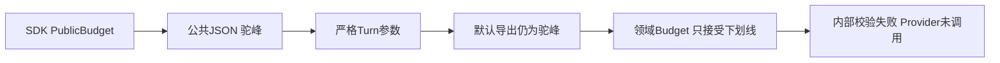
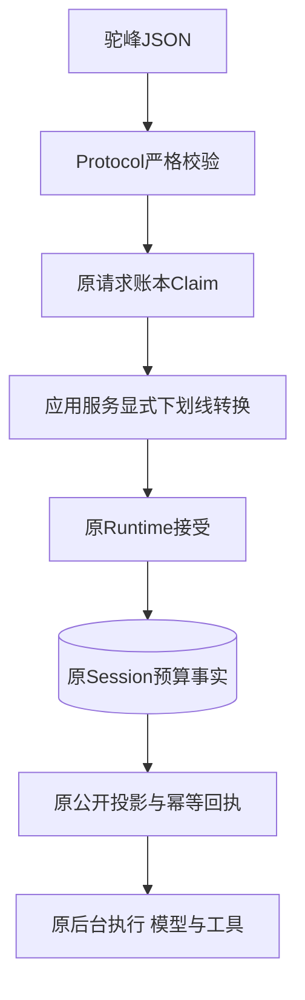
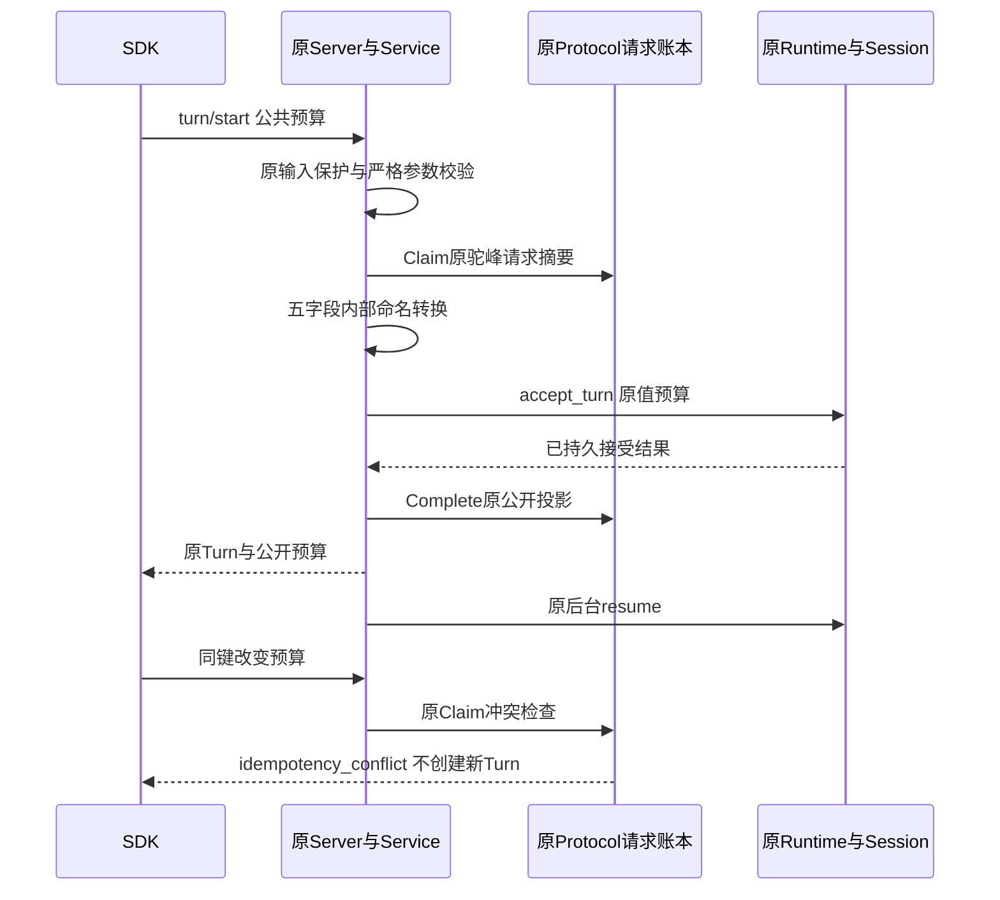

# R3公开预算到领域预算的无损转换

## 1. 变更摘要

| 项目 | 内容 |
|---|---|
| 缺陷 | SDK显式传入合法`PublicBudget`时，`turn/start`和`turn/retry`在领域调用前发生内部校验失败 |
| 用户影响 | 用户不能通过正式SDK为任务指定步骤、Token、时长、输出和每步工具数量上限 |
| 根因 | `ProtocolModel`默认驼峰序列化；应用服务误把该字典交给只接受下划线字段的`Budget` |
| 修复范围 | 只在`service._budget`显式选择`by_alias=False`；不修改公共JSON或领域契约 |
| 数据变更 | 无表、Schema、预算默认值、协议版本或迁移变更 |
| 发布判定 | 本项修复不关闭R3真实编码质量、R1安全、R4三平台或整体1.0 |

## 2. 需求背景与证据

固定基线`cfcbe2a6aaaf0454b11f86b35ce12c75717b1da1`上的真实子进程stdio验收在
`start_turn`返回`internal_error`，Provider调用为0。验证宿主仅记录异常类型、函数、源码相对位置，
不记录异常正文或局部变量；实际失败为`service._budget`产生的`extra_forbidden`。

纯契约重现和正式SDK启动/重试回归共有5个红例。未传预算的历史测试不能覆盖此路径，
只验证`PublicBudget`自身边界也不能证明它被正确传入领域层。

## 3. 设计目标、非目标与验收标准

1. 公开预算五个字段按原值进入领域预算，不能因为校验失败而改用默认值。
2. SDK启动、显式重试、公开返回、持久Session及重开读取保持相同预算。
3. 同请求及相同预算重放原Turn；同幂等键改变预算仍返回`idempotency_conflict`。
4. 非法预算仍在Claim和Turn创建前拒绝；不得调用Provider。
5. 默认产品的实际stdio读取、审批后修改和审批等待取消另行验证，不把Scripted结果当作线上模型认证。

非目标：不修改模型计价、请求Guard、预算账本、Agent策略、工具权限或20 Trial评分。
合法预算转换成功不代表模型请求、任务成功、费用估算或商用发布通过。

## 4. 当前实现与根因

[`ProtocolModel`](../../src/harnessix/protocol/contracts.py)使用`serialize_by_alias=True`和
驼峰生成器；[`Budget`](../../src/harnessix/agent/models.py)继承的`ContractModel`没有该别名。
原[`_budget`](../../src/harnessix/app_server/service.py)调用`value.model_dump()`后直接领域校验，
五个键均被识别为额外字段。公开协议层正确把非入站异常映射为固定内部错误，没有暴露原诊断。



图示说明：缺陷不在客户端封套，也不在模型鉴权；发生在公共DTO已校验之后、领域接受之前。

## 5. 总体架构、方案与变更后边界

只把原转换改为`Budget.model_validate(value.model_dump(by_alias=False))`。
显式选择内部字段名是应用服务的边界职责；公共请求、响应和请求指纹继续使用原驼峰。



图示说明：只替换`Map`中的序列化选项；Claim、领域接受、公开回执、后台驱动顺序不变。
公开输入保护仍先于Claim，公开输出保护仍先于回执持久化和发送。

| 替代方案 | 不采用原因 |
|---|---|
| 全局关闭Protocol别名 | 会改变正式JSON、SDK及幂等请求身份 |
| 给领域模型添加公共别名 | 把传输约定扩散到Session及业务事实，扩大兼容面 |
| 捕获异常后使用默认预算 | 丢弃用户限制，产生不可信执行边界 |
| 显式内部字段名转换 | 局部、可回归、五字段原值保留；采用 |

## 6. 正常、失败与恢复时序



非法值在入站校验前置边界返回`invalid_params`，没有Claim、Turn或Provider事实。
转换之后的取消、超时、断线及崩溃继续使用原领域状态和幂等恢复，不新增重试或补造执行结果。
旧失败可能已留下accepted请求回执；只有原Runtime及原请求身份允许的重放可以恢复，不能批量改写旧回执。

## 7. 接口设计、领域契约与重点字段

| 公共JSON字段 | Python/领域字段 | 原有约束 |
|---|---|---|
| `maxSteps` | `max_steps` | 严格整数1～1000 |
| `maxTokens` | `max_tokens` | 严格正整数 |
| `timeoutSeconds` | `timeout_seconds` | 有限正数，最多86400秒 |
| `maxOutputChars` | `max_output_chars` | 严格整数1～1,000,000 |
| `maxToolCallsPerStep` | `max_tool_calls_per_step` | 严格整数1～128 |

`None`仍传为`None`，由原Runtime选择默认`Budget`；显式预算不允许丢失字段或静默回退。
`turn/retry`绑定原来源终态，不重开来源Turn；新预算只属于新显式Retry。

## 8. 状态、事务、并发与幂等

本项不新增状态、锁、CAS或事务。Protocol请求摘要仍对原驼峰参数计算；Session仍保存原领域事件。
同参数重复调用返回原Turn ID且不增加模型请求。预算漂移仍是参数漂移，不能因为转换而绕过原指纹检查。
数据库与Key格式不变，升级不需要数据迁移；回退代码会重新暴露显式预算缺陷，不是修复手段。

## 9. 安全、隐私与可观测性

新增源码注释及固定测试，不新增产品日志或公开诊断字段。原异常正文不进入JSON-RPC。
受控模型验证继续借用原70元周期和原请求Guard，原Credential只驻子进程内存；不重置预算或退款未知预留。
本项不弱化凭据保护、审批、资源能力准入或原20 Trial门槛。

## 10. 核心伪代码

```text
to_domain_budget(public):
    if public is None: return None
    internal_fields = public.model_dump(by_alias=False)
    return original_Budget.model_validate(internal_fields)

start_or_retry(params):
    claim_original_public_request()
    domain_budget = to_domain_budget(params.budget)
    result = original_runtime_accept(domain_budget)
    persist_original_public_result()
    drive_original_background_turn()
```

## 11. 实施与测试

| 范围 | 断言 |
|---|---|
| 三组预算纯契约 | 最小、非默认和最大有界值全部保留；默认导出仍是五个驼峰字段 |
| SDK启动及重开 | 返回值、Session事实和重开读取相同；同请求仅执行一次 |
| SDK显式Retry | 新Turn持久原值；来源终态不变；重复Retry保持原ID |
| 五个非法字段 | 非法/布尔/越限入站拒绝，无请求回执、Turn或模型请求 |
| 无预算 | 不改变默认预算选择 |
| 实际默认stdio | 独立验证读取、可信SHA、完整Diff、原审批、效果及等待取消 |

## 12. 源码与测试映射

| 位置 | 关键符号与职责 |
|---|---|
| [`protocol/contracts.py`](../../src/harnessix/protocol/contracts.py) | `ProtocolModel`、`PublicBudget`、启动/Retry参数及线上别名；不修改 |
| [`app_server/service.py`](../../src/harnessix/app_server/service.py) | `_budget`是唯一修复点；两个原命令复用它 |
| [`command_runtime.py`](../../src/harnessix/app_server/command_runtime.py) | 原Claim、公开检查、Complete及冲突；不修改 |
| [`agent/models.py`](../../src/harnessix/agent/models.py) | 领域预算及事件；不修改 |
| [`test_budget_mapping.py`](../../tests/app_server/test_budget_mapping.py) | 11项无损转换、SDK持久及严格拒绝回归 |

## 13. 部署、兼容、风险和回退

修复后先运行SDK/Protocol/产品装配与Agent相关回归，再使用固定源码验证正式stdio。
实际三平台CI、线上模型认证、20 Trial和独立Beta仍分别验收；不得从本项通过推导全部通过。
不删除原红例日志，不调整别名、阈值或幂等合同以制造成功。

## 14. 实现偏差与结论

方案只修改一个转换表达式，并增加说明性中文注释及回归。
最终源码身份、实际结果、低敏证据和Review Packet在独立验证资料中冻结后登记；设计不作为验收结果替代。
