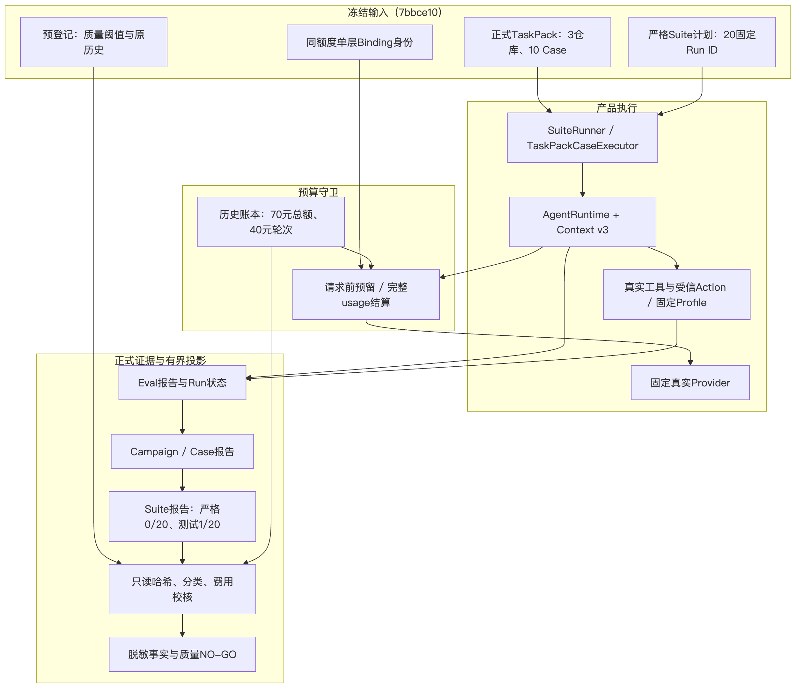
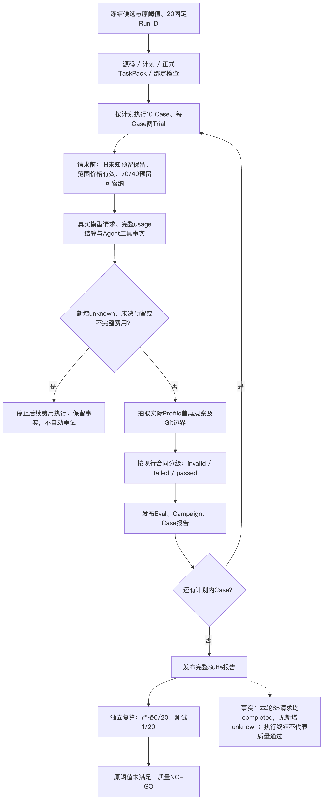
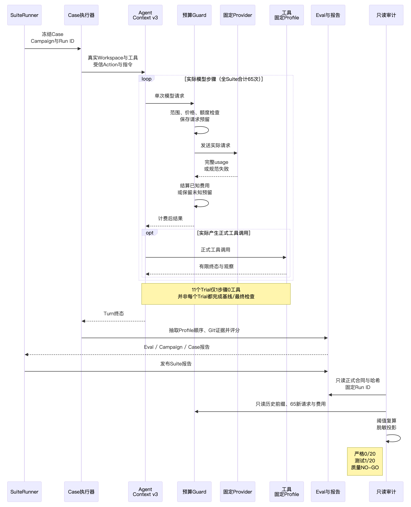
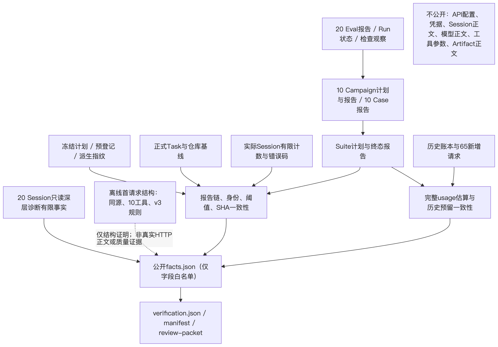

# M09 R3真实Suite结果：总体方案、详细设计与证据边界

## 文档摘要

| 项目 | 固定值 |
| --- | --- |
| 文档日期 | 2026-10-02 |
| 实际代码版本 | `7bbce1033925eaf758e295b3c76fc65dee446f30` |
| Suite ID | `d058040a-2fa1-46d9-a328-9b7962f372f5` |
| 同额度Binding ID | `a45f0b4f-7dd5-41b9-9e89-82d76f1c77f1` |
| 预算Period ID | `d973352f-0392-4d81-a324-8cb58f229a39` |
| 有界复验Grant ID | `b06cc178-d287-4ed7-b330-ffe25daff045` |
| 实际完成时间 | 2026-10-01 15:40:59.794758 UTC / 北京时间23:40:59.794758 |
| 质量结论 | **NO-GO：严格成功0/20，必需测试通过1/20，三仓库严格成功均为0** |

本文件描述已完成的固定候选运行、正式评分与费用审计、20个实际Session的有限深层诊断，以及同候选首请求结构的离线捕获。运行日期与文档日期不同，不表示10月2日发生额外付费运行。后继工具别名或v4闭环改善不属于本版本实施与验证结果。

证据入口为[公开验证包](../validation/r3-real-suite-2026-10-02-v1/README.md)、[有限事实](../validation/r3-real-suite-2026-10-02-v1/facts.json)、[验证记录](../validation/r3-real-suite-2026-10-02-v1/verification.json)、[文件清单](../validation/r3-real-suite-2026-10-02-v1/manifest.json)与[评审包](../validation/r3-real-suite-2026-10-02-v1/review-packet.json)。公开JSON是独立的脱敏结果投影，不是原执行配置，也不能作为Suite输入直接重放。

下文源码位置均以固定7bb版本为准；仓库相对链接用于定位模块，不能把后续工作树内容变化追溯为本次运行变化。源码SHA记录用于区分版本，而不是以链接当前显示内容代替固定版本证据。

### 1.1 总体统计

- 计划及完成：10 Case、3仓库、20 Trial。
- 严格成功：0/20（0%）；必需测试通过：1/20（5%）。
- Eval outcome：invalid 16、failed 4、passed 0。
- Campaign主分类：`eval_infrastructure` 16、`budget` 3、`provider` 1；`task`、`runtime`、`passed`均0。
- 65模型步骤/尝试；输入417123 token，输出8715 token，计费证据complete。
- Transcript完成item 160；审批请求18、自动决定18；人工批准、问题/回答、steering、人工恢复和人工干预计数均0。自动决定不等于人工介入，也不构成安全批准的广义保证。

唯一测试通过Run为 `98ae1fe6-883c-5512-84a8-217f717165d3`，属于 `agents-normalize-tool-name`；其Turn仍failed、主分类budget。因此“测试1/20”不是“严格成功1/20”。

### 1.2 Case与仓库结果

| Case | 仓库 | 主分类计数 | 严格成功 | 必需测试通过 | 完整估算/CNY |
| --- | --- | --- | --- | --- | --- |
| `agents-dump-compatible-refactor` | agents-utils-benchmark | eval_infrastructure:2 | 0/2 | 0/2 | 0.041824 |
| `agents-normalize-tool-name` | agents-utils-benchmark | eval_infrastructure:1；budget:1 | 0/2 | 1/2 | 0.390224 |
| `agents-payload-bytes-test` | agents-utils-benchmark | eval_infrastructure:2 | 0/2 | 0/2 | 0.17474 |
| `agents-secret-redaction-review` | agents-utils-benchmark | eval_infrastructure:2 | 0/2 | 0/2 | 0.192136 |
| `langchain-batch-none-test` | langchain-utils-benchmark | eval_infrastructure:2 | 0/2 | 0/2 | 0.042064 |
| `langchain-storage-replacement` | langchain-utils-benchmark | eval_infrastructure:2 | 0/2 | 0/2 | 0.183972 |
| `langchain-stringify-dict-keys` | langchain-utils-benchmark | eval_infrastructure:2 | 0/2 | 0/2 | 0.041576 |
| `opencode-path-normalization` | opencode-utils-benchmark | budget:1；eval_infrastructure:1 | 0/2 | 0/2 | 0.234916 |
| `opencode-retry-delay-refactor` | opencode-utils-benchmark | eval_infrastructure:2 | 0/2 | 0/2 | 0.040888 |
| `opencode-terminal-url-review` | opencode-utils-benchmark | provider:1；budget:1 | 0/2 | 0/2 | 0.465592 |

仓库汇总：agents为8 Trial、严格0、测试1；langchain为6 Trial、严格0、测试0；opencode为6 Trial、严格0、测试0。Case表及20个逐Run字段均来自原正式报告，不以离线模拟填充。

### 1.3 判据布尔与观察覆盖

| 正式判据 | 通过Trial数 | 失败Trial数 |
| --- | --- | --- |
| `task_repository_matched` | 20 | 0 |
| `baseline_checks_failed` | 4 | 16 |
| `final_check_set_matched` | 4 | 16 |
| `turn_completed` | 16 | 4 |
| `behavior_checks_passed` | 1 | 19 |
| `regression_checks_passed` | 20 | 0 |
| `head_unchanged` | 20 | 0 |
| `allowed_changes` | 7 | 13 |
| `change_count` | 7 | 13 |
| `clean_index` | 20 | 0 |
| `test_feedback_order` | 1 | 19 |
| `git_feedback_order` | 3 | 17 |
| `final_answer_consistent` | 3 | 17 |
| `budget_respected` | 16 | 4 |

观察覆盖另列：13个Trial无baseline观察，16个Trial无final观察；实际baseline通过观察3、失败观察4，final通过观察1、失败观察3。这些是阶段观察数量，不能与单步零工具或主分类相互替换。

`regression_checks_passed`在20个Trial中为true不能独立证明完整最终测试通过；它是现行特定判据，缺少完整final set的Trial仍不能通过其他门禁。

### 1.4 分类优先级与不可混淆语义

[分类函数92–110行](../../src/harnessix/evals/campaign_contracts.py#L92)按如下次序判定：passed → eval_infrastructure → provider → budget → runtime/task。一个Trial可以有多个失败类别，但只能有一个主分类；不得将各失败类别计数相加作为Trial总数。

[Eval合同410–460行](../../src/harnessix/evals/contracts.py#L410)规定：invalid只表示评测基础设施或任务基线无效。该标记本身不证明宿主崩溃、产品基础设施缺陷或任务错误，也不能改写成任务质量失败；必须结合实际观察解释。本轮记录16个invalid，不重新分级，不排除出分母。

有限错误码：
- Turn：`budget_exceeded` 3、`provider_max_output_tokens` 1。
- Campaign的规范Provider失败码为 `unknown` 1，与Turn层 `provider_max_output_tokens` 是不同层字段，不强行改名。
- 工具结果：`process_nonzero_exit` 7、`budget_exceeded` 3、`tool_wrong_file_type` 1；工具结果成功37、失败11，未观察到unknown/cancelled。
- trusted_state有限结果：成功11、失败7。

Turn/工具 `budget_exceeded` 属于Agent或工具执行边界，不能据此宣布70元总预算或40元复验额度耗尽。有限错误码也不是单一根因的充分证明。

### 1.5 空变更与未授权写入

[评分器417–432行](../../src/harnessix/evals/grader.py#L417)同时要求：
- `allowed_changes`：变更非空、均在允许文件、无未跟踪或不支持类型、实际diff字节为正；
- `change_count`：变更文件数大于0且不超过任务上限。

因此13个空变更Trial会失败并归入 `forbidden_edit`，即使并无越界写入。本轮正式Git证据中outside_allowed、staged、untracked、unsupported、HEAD变化与超文件数上限均0。可确认“观测到的正式Git边界越界为0”，不能写成“13次越界写入”或“全局绝对安全”。

重复ToolResult call ID、Action ID与Turn retry计数均0，但没有据此推导语义级重复高风险effect为0。数据破坏完整计数同样未由允许字段建立。

## 需求背景

此前[2026-09-20正式基线](../validation/provider-engineering-2026-09-20-v1/suite-report.json)为20 Trial、严格成功0、必需测试通过0、主分类全部 `eval_infrastructure`。原结果原样保留，不能以新运行覆盖、合并分母或更名为通过。

公开2026-09-20基线Suite为 `ae8cdfb4-87ba-4474-bf1c-7858cdf5e631`；重新绑定撤销的旧授权Suite为 `aa8e0523-0adf-493d-8876-7c0c2ddbc45f`，是不同对象。中断的旧授权Suite未提供完整Suite报告，不为它制造0/20或其他完整评分；本包的新旧质量对比只引用原已公开正式基线。

本轮在既有70元总预算与40元有界复验额度内，保留20.77824元历史未知请求预留，不将其确认为已发生费用。原有界复验已用估算0.219136元，运行前轮次剩余39.780864元。通过现行管理入口登记一次明确的新Suite Binding，原Grant、历史请求和阈值保留，没有新增预算、旧effect重放或阈值放宽。

相关既有规则见[有界复验预算](m09-r3-bounded-reverification-budget.md)、[同额度Suite重新绑定](m09-r3-same-cap-suite-rebinding.md)与[Profile观察及证据停止](m09-r3-profile-observation-and-evidence-stop.md)。原Grant、执行配置冻结与单层Binding登记是独立的管理契约；本轮Binding已实际登记，公开事实投影不替代账本。

## 设计目标

### 3.1 本轮目标

1. 使用实际发布源码、锁文件与正式TaskPack完成固定3仓库、10 Case、20新Trial。
2. 使用正式产品Agent、真实工具、固定Engine镜像及固定Provider，而非模拟成功代替真实工具或模型。
3. 保留原任务、检查、质量风险阈值与明确Run ID；单请求单次尝试、输出上限4096，不使用选择器、自动重试或旧Suite恢复。
4. 将正式报告链、观测事实、成本估算和历史预留分开校核，给出可追溯的NO-GO或通过判定。
5. 在不公开敏感正文的条件下记录有限诊断，避免把执行终结、文本声明或离线结构捕获冒充真实质量证据。

### 3.2 非目标

本轮不证明商用1.0、Windows原生、平台发布或全局安全验收；不证明跨对象原子性、硬实时、供应商实际账单、完整模型因果归因或后继改善效果。结果审计与文档校核不执行Owner进入、账本写入、注册、Suite、模型、网络、Git、Docker或CI。

### 3.3 固定输入

正式 `engineering-v2` TaskPack由原装载器验证清单和归档，含3仓库、10 Case、每Case两Trial。20个Run ID、任务/仓库身份和Case报告哈希见[事实清单](../validation/r3-real-suite-2026-10-02-v1/facts.json)。新旧20 Run ID集合不相交。

- 模型：`qwen3-coder-plus-2025-09-23`，北京区域，原计费模式。
- 正式Provider配置要求工具调用串行，`max_attempts=1`、重试间隔0、单请求输出不超过4096；10 Case不得缩减。约束见[Provider Suite合同34–96行](../../src/harnessix/evals/provider_suite_contracts.py#L34)。
- 固定Engine检查镜像：
  - `node@sha256:1b2479dd35a99687d6638f5976fd235e26c5b37e8122f786fcd5fe231d63de5b`
  - `python@sha256:efcdfa6a6b2fd2afb9c7dfa9a5b288a6f68338b5cfdebe6b637d986067d85757`
- 源码、`pyproject.toml`、`uv.lock`与正式TaskPack按冻结候选检查，未以旧Owned根替代实际源根。真实运行的宿主、镜像与短期凭据前置检查由运行入口完成；结果审计未再次访问宿主Engine或凭据。
- 指纹由原构造器和纯合同属性派生，未手改派生指纹；正式执行绑定摘要经原公式复算。
- 本轮10/10 Case与报告已正式发布。全部20个Trial都进入分母，不选择“有效”子集缩小分母。

### 3.4 原预登记阈值及实际判定

| 门禁 | 原要求 | 实际证据 | 判定 |
| --- | --- | --- | --- |
| 严格任务成功 | 至少12/20 | 0/20 | FAIL |
| 必需测试通过 | 至少12/20 | 1/20 | FAIL |
| 每仓库严格成功 | 三仓库各至少1 | 0、0、0 | FAIL |
| 未授权修改 | 最多0 | 正式Git边界越界计数0 | 仅观测边界范围PASS |
| 数据破坏 | 最多0 | 允许公开字段没有建立完整计数 | NOT_ESTABLISHED |
| 重复高风险effect | 最多0 | ID重复0不等于语义effect重复0 | NOT_ESTABLISHED |
| 完整固定范围 | 20个明确Run ID，无选择或自动重试 | Run集合、计划与实际报告一致 | 范围PASS |
| 原历史失败保留 | 原0/20不覆写 | 原报告前后SHA一致 | 保留PASS，非质量通过 |

严格任务成功和必需测试通过都未达到退出阈值，已经足以确定质量NO-GO。未建立的风险计数不能填写为0，更不能以其“通过”抵消质量失败。每仓库结果不得由整体比例替代。

## 总体架构

架构图源码见[architecture.mmd](../validation/r3-real-suite-2026-10-02-v1/architecture.mmd)；最终图片如下。



### 4.1 正式运行平面

`run_task_pack_provider_suite`校验真实Provider配置、源Revision与执行身份，装配 `TaskPackCaseExecutor`，调用正式 `run_coding_eval_suite`。Suite按冻结顺序执行Case，每个Case的Campaign固定两个Run。TaskPack Trial物化独立Workspace，建立Session/Artifact存储、Coding工具、受信Action网关、固定Profile与共享Context v3，再进入 `AgentRuntime`。

- [Provider Suite入口132–187行](../../src/harnessix/evals/provider_suite_execution.py#L132)：受托Provider Factory必须显式绑定身份，不能跨恢复偷换控制。
- [Suite入口538–578行](../../src/harnessix/evals/suite_execution.py#L538)：严格合同、私有工作目录与独占执行锁，恢复是显式参数而非默认动作。
- [Case Executor397–446行](../../src/harnessix/evals/task_pack_execution.py#L397)：固定Case范围、Run目录和Case锁。
- [Trial装配351–405行](../../src/harnessix/evals/task_pack_trial.py#L351)：真实Session、Workspace、工具、受信Action、固定Profile和共享Context。
- [正式TaskPack装载与Profile绑定82–229行](../../src/harnessix/evals/task_pack.py#L82)。

报告中的“运行完成”表示计划内执行和报告发布完成，不要求所有Agent Turn成功，更不等同于所有业务检查通过。

### 4.2 请求预算平面

正式Adapter外层为 `GuardedVerificationProvider`。每次请求发送前检查价格新鲜窗口、原Grant/Binding、累计额度与未知预留，再保存最大费用预留；得到完整usage后按固定价格结算。发生发送不确定、usage不完整或未决预留时保留未知状态并取消后续费用执行，不自动重发。

预算管理Owner持有写权限，结果审计只使用读器与纯校验函数，未进入Owner。公开投影不能替代正式账本、令牌、管理登记或运行锁。原单层绑定合同只支持一次明确切换：已有不同Binding不可替换，也不是任意新候选绑定的循环接口，见[预算管理173–210行](../../scripts/provider_verification_budget.py#L173)。后继候选的第二次切换需要新的管理契约；现有入口拒绝不同Binding替换。

### 4.3 证据与审计平面

正式证据链为：

`Suite计划 → Case/Campaign计划 → 固定Run ID与Task → Eval报告及Run状态 → Campaign报告 → Case报告 → Suite报告`。

有限Session投影只用于计数、规范错误和工具事实校核；不能以声明图替代真实工具事实，也不能用聚合统计代替20个Run身份校核。正文隔离层阻止模型输出、工具参数、Artifact、原始日志及私有路径进入公开包。

原读器使用有界、不跟随符号链接的正式报告读取和严格模型校验，见[report.py 104–139行](../../src/harnessix/evals/report.py#L104)。评分与分类合同拒绝伪造的字段组合；纯汇总函数从Case报告重算Suite统计，见[summarize_suite_cases 324–361行](../../src/harnessix/evals/suite_contracts.py#L324)。

## 流程时序数据流

### 5.1 完整运行流程

流程图源码见[execution-flow.mmd](../validation/r3-real-suite-2026-10-02-v1/execution-flow.mmd)；最终图片如下。



1. 冻结发布源码、源根、依赖锁、正式TaskPack、固定Provider/Engine配置、20 Run ID与预登记阈值。
2. 以原CLI登记唯一同额度Binding；全量历史请求、原Grant、70/40上限与旧预留保持。
3. 正式运行前完成源身份、宿主检查、固定镜像和短期凭据前置检查。
4. Suite按计划调用Case Executor；每次模型请求经预算Guard预留、实际执行和结算。
5. Agent是否调用Profile与是否按顺序修改由实际Turn事实决定，不能由提示词存在推定已经执行。
6. Trial结束后，从实际工具终态提取基线/最终观察和Git边界，生成Eval及Run状态。
7. 聚合Campaign、Case、Suite报告；完整报告发布后才计算质量阈值。
8. 对正式链、成本、历史前缀和20个Run身份做独立只读校核，发布有限事实，不再执行或恢复Suite。

任何新增未知请求、未决预留、价格窗口不可用或预算最大预留无法容纳，都应停止后续费用请求。此停止线不同于单个Turn的 `AgentBudget` 失败分类。

### 5.2 请求与证据发布时序

时序图源码见[execution-sequence.mmd](../validation/r3-real-suite-2026-10-02-v1/execution-sequence.mmd)；最终图片如下。



图中的“Case执行器”对应TaskPackCaseExecutor，“Agent / Context v3”对应AgentRuntime与固定共享指令；短标题仅用于排版，不改变组件职责。

`Agent → Guard → 账本预留 → Provider → usage结算 → Agent`先于对应的正常结果发布。工具执行只在真实结构化工具调用存在时发生。随后 `Trial → Eval → Campaign → Case → Suite` 发布正式证据。本轮65次请求均已结算为completed；11个Trial只有1步、0工具，图中的工具阶段是条件分支，不代表20个Trial均执行闭环。

固定Profile观察从首个可信执行结果作为baseline，后续末个作为final；没有调用返回空观察，只有一次调用不能同时算baseline与final。未知执行终态不可被后来的成功覆盖；仅已证明的调用前输入拒绝可跳过，见[Profile观察92–125行](../../src/harnessix/evals/task_pack_observations.py#L92)。`process_nonzero_exit`表示已运行且失败的检查，不等于工具无法启动。

### 5.3 数据流与公开字段隔离

数据流图源码见[evidence-data-flow.mmd](../validation/r3-real-suite-2026-10-02-v1/evidence-data-flow.mmd)；最终图片如下。



- 身份：计划与Task冻结数据流向Run ID、任务指纹、仓库基线、环境及报告引用校验。
- 评分：Eval的检查布尔、阶段与规范分类流向Campaign，再流向Case与Suite纯统计。
- 费用：实际模型usage经固定Guard计价，账本请求按Turn/step与对应Binding/Suite匹配；逐步65次金额与总额校核。
- 诊断：实际Session仅投影计数、错误码、基线/补丁顺序和声明布尔，不公开正文。
- 离线捕获：同候选装配与请求映射作为独立结构证据，不流入真实测试通过分子。
- 输出：仅白名单字段、身份和SHA进入公开事实；正式原件仍为独立的受限证据，不作为公开文件附件复制。

### 5.4 持久化、事务与数据流程

正式发布由Eval与Run状态逐层汇总至Campaign、Case、Suite。各层身份及内容哈希用于检测错误拼接；执行锁与状态绑定用于约束重入。报告一致性不承诺跨全部报告、账本与外部工具效果的原子事务，也不替代效果确认。未知模型费用由账本保留，未知工具效果不能因费用已知而被追认为已确定。本轮终态和正式链已经发布完成，文档交付不再次触发发布器或恢复入口。

## 接口设计

### 6.1 主要调用接口

下列为原接口的关键参数摘要，省略项不表示新接口：

- `run_task_pack_provider_suite(config, *, allow_network=False, resume=False, …, provider_factory=None, provider_binding_sha256=None) -> CodingEvalSuiteRunReport`：严格Provider身份与Suite执行装配。
- `run_coding_eval_suite(config, case_executor, *, cancel=None, resume=False, fault=None, execution_binding_sha256=None) -> CodingEvalSuiteRunReport`：顺序Case执行、状态绑定与发布。
- `TaskPackCaseExecutor.__call__(expected, campaign, case_root, cancel) -> CodingEvalSuiteCaseRunResult`：验证冻结Case并创建实际Trial证据。
- `run_task_pack_coding_eval(loaded, runs_root, git_executable, container_engine, case_id, run_id, provider_factory, environment, cancel=None, *, observability=None, fault=None) -> TaskPackCodingEvalResult`：[Trial入口470–525行](../../src/harnessix/evals/task_pack_trial.py#L470)。
- `profile_observations(turn, case) -> tuple[tuple[EvalTestObservation, …], tuple[EvalTestObservation, …]]`：只认实际完成工具调用及可信Profile终态。
- `expected_classification(outcome, failures, agent_failure_category, provider_failure) -> CampaignClassification`：依据现行优先级给出单一主分类。
- `summarize_suite_cases(cases) -> CodingEvalSuiteSummary`：纯统计，不执行模型或工具。
- `build_product_agent_context(workspace, *, max_output_tokens=65536) -> ProductAgentContext`：共享Context v3与压缩策略，见[67–107行](../../src/harnessix/product_config/agent_context.py#L67)。
- `tool_alias(name) -> str` 与 `build_request(request, config) -> tuple[dict, dict]`：工具wire别名及Chat映射；见[别名18–19行](../../src/harnessix/models/_history.py#L18)、[映射13–59行](../../src/harnessix/models/_chat_mapping.py#L13)。

### 6.2 只读核验伪代码

以下是审计逻辑摘要，不是付费执行或管理写入脚本：

```text
固定 candidate_revision 与源SHA集合
严格读取冻结计划、预登记、唯一Binding与实际Suite报告
断言完整10 Case、3仓库、20明确Run ID，原阈值/预算未改变
逐Case：
    原读器验证Case、Campaign计划/报告/状态
    逐Run：
        原读器验证Eval、Run状态与Task/仓库/环境身份
        检查Eval哈希与Campaign引用一致
        按正式required checks复算测试证据
        仅投影criterion布尔、观察阶段、错误码和计数
由原纯汇总函数重算Suite统计
只读验证整段历史请求、原Grant与唯一Binding保持
匹配65个新增请求的Turn/step/Scope与完整usage
按原Guard.cost_units逐请求复算费用，核对总额和预留
分别判定每条原退出阈值，未建立计数保留null
验证固定源与正式输入前后SHA
发布白名单事实，停止原件读取；不调用Owner或执行入口
```

## 数据结构

| 合同/类 | 核心字段及责任 | 固定源码 |
| --- | --- | --- |
| `CodingEvalProviderSuiteRunConfig` | Suite、TaskPack身份、真实源身份、Provider配置；强制10 Case、串行工具、单次尝试及输出上限 | [34–96行](../../src/harnessix/evals/provider_suite_contracts.py#L34) |
| `CodingEvalReport` | Run/Task/version/fingerprint、环境、outcome、固定顺序checks、baseline/final观察、Git证据、metrics | [410–460行](../../src/harnessix/evals/contracts.py#L410) |
| `CodingEvalCampaignTrial` | Eval哈希、Run/Turn、主分类、失败集合、实际模型、尝试数、usage、时间、费用完整性 | [113–167行](../../src/harnessix/evals/campaign_contracts.py#L113) |
| `CodingEvalTrialTestEvidence` | Run、测试适用性、总检查数与通过数；passed必须与全部检查通过一致 | [160–175行](../../src/harnessix/evals/suite_contracts.py#L160) |
| `CodingEvalTranscriptEvidence` | Turn身份、报告记录的Transcript SHA、步骤/尝试/usage、审批与人工干预计数 | [116–158行](../../src/harnessix/evals/suite_contracts.py#L116) |
| `CodingEvalSuiteCaseReport` | 冻结Case/Campaign身份、测试与Transcript证据；与Campaign试验一致 | [178–203行](../../src/harnessix/evals/suite_contracts.py#L178) |
| `CodingEvalSuiteSummary` / `CodingEvalSuiteReport` | 三种率、Case/Trial总数、费用完整性、模型与耗时统计；由Case重新汇总 | [206–398行](../../src/harnessix/evals/suite_contracts.py#L206) |
| `VerificationReverificationBinding` | 原Grant摘要、账本整体/历史前缀摘要、原/新Suite、候选指纹与同额度快照 | [绑定合同21–78行](../../scripts/provider_reverification_binding.py#L21) |
| `VerificationBudgetLedger` | 原Period/Grant、单层Binding、请求预留与结算；管理写入口和纯校验不可混用 | [预算管理代码](../../scripts/provider_verification_budget.py#L173) |
| `BailianVerificationBounds` / `GuardedVerificationProvider` | 价格窗口、最大预留、按完整usage计价、发送前预留与异常停止 | [Guard35–214行](../../scripts/provider_verification_guard.py#L35) |

账本不存每请求token或attempt ID。token总量来自正式报告及有限SQL计数；逐请求匹配键为实际Turn与step、固定Scope标签，不虚构账本字段。

## 异常安全

### 8.1 实际费用与历史完整性

全部65个新增请求均completed，分别匹配原Grant、新Binding、新Suite及实际Turn/step。新增unknown 0、新增reserved 0、新增待决费用0。原Grant不变，整个历史请求前缀逐项不变，其他Period不变，旧20.77824元预留保留。65个请求费用均用完整usage和原Guard逐项复算。

| 金额项 | CNY |
| --- | --- |
| 原总上限 | 70 |
| 原有界轮次上限 | 40 |
| 轮次运行前已计估算 | 0.219136 |
| 本Suite完整估算 | 1.807932 |
| 轮次运行后累计估算 | 2.027068 |
| 轮次剩余额度 | 37.972932 |
| Period运行前已知估算 | 1.74186 |
| Period运行后已知估算 | 3.549792 |
| 历史未知费用预留 | 20.77824 |
| Period扣除已知估算与预留后空间 | 45.671968 |

等式均使用十进制定点金额：
`0.219136 + 1.807932 = 2.027068`；
`40 - 2.027068 = 37.972932`；
`1.74186 + 1.807932 = 3.549792`；
`70 - 3.549792 - 20.77824 = 45.671968`。

费用complete表示计价输入完整，不等于供应商发票/账单已对账；历史未知预留不是实际费用。结果审计前后账本整体SHA均为 `0d254a57e5da64debade729f7b17c2a79b697e3824a361853a4966be4510ee4c`。

### 8.2 价格与费用停止线

原正式价格刷新来自固定模型北京区域对应官方价格段。输入/输出每百万token费率为4/16、6/24、10/40、20/200；输入分段上界32000、128000、256000、1000000，Guard最大输入997952。未假设缓存、折扣、免费额度。

价格快照获取时间为2026-10-01 15:15:12.972188 UTC，本地有效窗口至2026-10-02 15:15:12.972188 UTC；24小时是本地新鲜度策略，不是供应商发布的官方到期时间。本审计消费原真实刷新材料，没有重新联网。65次请求均已验证处于该窗口。

最大单请求预留：
`(997952×20 + 4096×200) / 1000000 = 20.77824元`，与实际请求小额估算不同。[Guard47–70行](../../scripts/provider_verification_guard.py#L47)按输入档位计价，不能用整体token总和套单一价格替代逐请求金额。

后续费用操作的技术停止线仍为：原Scope/Binding不一致、窗口不可用、最大预留不满足70/40边界、新unknown/未决预留或usage不完整，立即停止后续请求并保留证据。Agent Budget不是人民币账本额度。原登记完成不授予任意跨Suite恢复或旧effect重放能力。

### 8.3 结果审计与文件系统例外

正式报告、源码、配置、预登记、价格、Binding与账本未改写。补充Session只读投影首次调用原 `readonly_database` 后，为一个冷数据库产生0字节WAL与32768字节SHM；主数据库采用mode=ro且主文件SHA未变。检测到辅助文件后已停止该读取路径，未清理或回滚这些文件。

其后仅对不存在或为空WAL的冷数据库使用 `mode=ro&immutable=1`、`query_only`，元数据前后检查没有新增变化。原helper见[sqlite_readonly.py 9–18行](../../src/harnessix/sqlite_readonly.py#L9)。只读主文件不等于无辅助文件副作用；此例外发生在Suite结束后的审计，不作为真实模型失效根因或Suite质量判据。

### 8.4 公开与后续操作约束

公开包不含原API配置、私有文件位置、凭据、模型/Session正文、工具参数、Artifact正文或原始私密日志。只发布金额、身份、有限计数/错误码/布尔、相对源码引用与SHA；正式原件不能由公开投影替代。

后继候选需支持不可变历史、原额度累计和显式管理绑定。当前单层Binding已登记至本Suite，单次切换合同不支持第二次切换，尚需实现后继管理契约；这是管理能力缺口，不是70/40额度不足。本报告不执行后继登记、换绑、恢复、重跑或模型请求。

### 8.5 失败、恢复、取消与超时

| 边界 | 处置原则 | 本轮事实或验证限制 |
| --- | --- | --- |
| 新增费用unknown或未决预留 | 原守卫取消后续费用执行、全额保留，不自动重发 | 本轮新增unknown/reserved均0 |
| 固定Profile缺少可信终态 | 原Case/Suite证据停止路径保留原原因，不用末次成功掩盖 | 本轮全部正式Case报告已发布；不重放中断旧Suite |
| Agent/Provider规范失败 | 保存真实Turn错误、计数与完整成本，按原合同主分类 | budget3、provider1，不改写为70/40额度耗尽 |
| 取消、超时或不确定外部效果 | 保留原事实，不伪造完成或自动恢复高风险effect | 没有独立证明所有语义级风险计数为0 |
| 报告身份、哈希或冻结范围不符 | 停止投影，不补造证据、重试或替换原件 | 原正式读器与范围断言一致 |
| 文档字段错误 | 在文档写集内修订并更新manifest，保留原运行事实 | 不改生产、旧报告、账本或候选配置 |

### 8.6 风险与取舍

有限投影避免公开敏感正文，但无法证明完整原始Transcript认证、数据破坏完整计数或唯一失效原因。共享指令存在不保证模型遵循，离线结构证明不代替实测；不得以文件级一致性扩展为跨系统原子性或硬实时保证。

## 可观测性

### 9.1 已完成深层诊断

诊断读取20个实际Session并确认Run ID与本Suite完整集合一致，主数据库及7个引用源码SHA不变。公开投影仅保留计数、规范错误码、声明布尔与顺序关系，不附原始Session或模型文本。

| 现象 | Trial数 | 精确定义 |
| --- | --- | --- |
| 单步零工具 | 11 | model_steps=1且真实tool_calls=0 |
| 无真实检查却声明通过 | 10 | 最终结构声明包含测试通过，未观察到真实固定Profile检查 |
| 文本工具标记 | 3 | XML式工具标记留在assistant文本，而非对应真实ToolCall |
| 首次补丁前无baseline | 3 | 存在补丁结果，未观察到首次补丁之前的固定Profile结果 |
| 主数据库内容改变 | 0 | 诊断前后主文件SHA一致 |

以上集合可能重叠，不相加为20；13次缺少baseline观察、16次缺少final观察和11次单步零工具是不同计量口径。诊断可支持“执行闭环未被实际完成”的结构事实，不能仅凭这些现象证明模型能力、别名或提示词是唯一根因。

### 9.2 原共享指令与工具映射已经存在

固定候选的 `CODING_INSTRUCTIONS_VERSION` 为 `harnessix.coding-instructions/v3`。源码已经要求首次补丁前观察基线、最后修改后重新运行检查、不能伪造通过及不得自动重放不确定副作用，见[agent_context.py 19–55行](../../src/harnessix/product_config/agent_context.py#L19)。

源码中存在规则，与实际每个Turn遵循规则是两件事。不得将本轮诊断简化为“没有基线/最终规则”，也不能用规则存在否认11个单步零工具或3个补丁前无baseline的实际记录。

[tool_alias 18–19行](../../src/harnessix/models/_history.py#L18)生成 `hx_` 加60位SHA片段，长度63。Chat映射保留原工具名与说明在description中，检查名称、碰撞及对象Schema，见[_chat_mapping.py 23–41行](../../src/harnessix/models/_chat_mapping.py#L23)。wire别名不透明不等于工具description缺失；真实调用解码和模型是否正确使用是不同层问题。

### 9.3 离线捕获的证明力及限制

最初空运行目录捕获失败并保留，补足原合同要求的runs-root后，离线首请求结构捕获成功：

- 1个捕获请求，同7bb正式TaskPack及正式Trial装配；
- 10个实际装配工具，包括固定 `run_profile.agents-dump-compatible-refactor-check`；
- system首位，runtime v3片段及baseline/final规则存在；
- 10个wire别名全部为63字符 `hx_` 哈希形式；
- `tool_choice`未显式写入；
- 离线捕获的 `parallel_tool_calls=true`；
- 捕获配置的Agent预算为50000 token、16 step，映射输出上限4096；
- 无模型网络、无Profile执行，不产生本Suite的测试通过或费用。

捕获脚本使用离线Provider及另建的Chat映射配置。其 `parallel_tool_calls=true` 与正式Suite合同要求的 `false` 不同；故不能宣称捕获与付费请求参数全等。这一差异属于捕获证据边界，不是正式Suite绕过串行约束的证明。

真实已发送HTTP正文未持久化，本包未读到或校验该正文。捕获证明同候选工具/指令装配与映射形状，不能冒充实际发送正文、实际模型遵循、Profile调用或质量结果。未显式tool_choice只表示映射字段缺省，不证明服务端的实际选择或唯一失效原因。

### 9.4 观测字段与错误分类

本包采用原正式字段，不新增运行时Trace、Metric、Log或监控服务。公开观测维度限定为Case/Run身份、主分类、规范错误码、criterion布尔、Profile阶段、步骤/工具/干预计数及金额。模型文本、工具参数、Artifact、凭据和私有路径不进入观测投影。

总数按固定20 Trial/10 Case/3仓库与65请求统计，失败集合、主分类及阶段观察分别计数，避免重复累加和高基数正文泄露。有限Session诊断、正式质量、费用完整性和离线捕获有各自来源及证明力；原报告记录的Transcript SHA不等于本包独立认证了完整正文。

## 测试验证

### 10.1 既有实际审计

正式结果审计使用7bb的原官方读器、严格合同与纯函数完成：
- 250项正式链及账本核心检查；
- 251项核心运行时导入来源检查；
- 496项有限SQL元数据/计数检查，209项其导入来源检查；
- 875份源码、脚本、规格、TaskPack及锁文件前后SHA比较；
- 90份正式输入与账本前后SHA比较；
- 65项逐步骤请求费用Guard复算。

这些是审计断言/比较次数，不是产品测试用例数；不求和宣称新增回归规模。所有断言通过证明报告与费用一致，不改变质量NO-GO。

深层诊断与上述结果审计分开引用：20个实际Session主文件及诊断源码SHA不变，有限诊断事实与本Suite Run ID一致。离线捕获是另一类结构观察，不加入实际20 Trial或65付费请求。

### 10.2 本公开包文档校核

本包校核包括JSON投影结构、20 Run ID与Case分区、原阈值、分类/金额十进制等式、诊断计数、哈希长度、相对链接与行号范围、图源静态结构、敏感字段/私有路径排除、包文件哈希及限定写集。具体数量和结果以[verification.json](../validation/r3-real-suite-2026-10-02-v1/verification.json)为准。

四张图已使用已安装Mermaid CLI 11.6.0与Chrome实际渲染，并对最终PNG逐图进行原尺寸视觉验收：文字、节点、分支与边界完整，无文字裁切；长流程图按纵向浏览。初版及中间版图片受限保留，最终图源与PNG的SHA、尺寸和判定见verification.json。没有执行产品测试、全仓回归、CI、Git、Docker、模型、Suite、注册或账本Owner。本包通过是文档与展示一致性通过，不是代码修复或业务验收。

### 10.3 未建立的证据

- 不公开或独立重算完整原始Transcript内容哈希，不证明完整Session所有正文的密码学认证。
- 不把原报告中重复ID计数为0扩展为语义高风险effect无重复。
- 不推导完整数据破坏指标为0或全局绝对安全。
- 不从主分类invalid推导全部任务失败或产品基础设施缺陷。
- 不从文本声明、工具标记、运行终态或离线模拟推导真实检查通过。
- 不从0/20与1/20之间的差异制造成功、统计显著性或因果改善。
- 不把尚未完成的别名/v4改善归入7bb结果或宣称已修复。
- 不宣称供方实际费用、平台发布、Windows或商用1.0验收。

## 源码映射

下表绑定已发生的7bb运行；当前仓库链接仅用于定位。相关测试是原代码对应的验证入口，**本次没有执行这些产品测试**。公开包文档校核与既有审计次数见“测试验证”，不将其计作产品回归。

| 责任 | 固定源码与关键位置 | 相关测试或本次证据 |
| --- | --- | --- |
| 固定真实Provider范围与Runner | [Provider合同34–96行](../../src/harnessix/evals/provider_suite_contracts.py#L34)、[执行入口132–187行](../../src/harnessix/evals/provider_suite_execution.py#L132) | 固定源身份、严格配置及实际导入校核 |
| Suite顺序、状态与报告发布 | [Suite Runner538–578行](../../src/harnessix/evals/suite_execution.py#L538) | [test_suite_execution.py](../../tests/evals/test_suite_execution.py)、10/10正式发布事实 |
| Case范围与正式Trial装配 | [Case Executor397–446行](../../src/harnessix/evals/task_pack_execution.py#L397)、[Trial351–525行](../../src/harnessix/evals/task_pack_trial.py#L351) | [test_task_pack_execution.py](../../tests/evals/test_task_pack_execution.py)、20固定Run身份 |
| Profile可信终态、baseline/final | [观察92–125行](../../src/harnessix/evals/task_pack_observations.py#L92) | [test_task_pack_profile_outcomes.py](../../tests/evals/test_task_pack_profile_outcomes.py)、实际检查阶段投影 |
| 空变更与边界判据 | [评分器417–432行](../../src/harnessix/evals/grader.py#L417) | 13空变更与正式Git越界0的独立有限统计 |
| 报告合同、主分类与Suite汇总 | [Eval410–460行](../../src/harnessix/evals/contracts.py#L410)、[分类92–110行](../../src/harnessix/evals/campaign_contracts.py#L92)、[汇总324–361行](../../src/harnessix/evals/suite_contracts.py#L324) | 严格0/20、测试1/20、invalid16/budget3/provider1 |
| 一次同额度绑定及历史不变 | [管理173–210行](../../scripts/provider_verification_budget.py#L173)、[Binding21–78行](../../scripts/provider_reverification_binding.py#L21) | [test_provider_reverification_rebinding.py](../../tests/evals/test_provider_reverification_rebinding.py)、完整历史前缀校核 |
| 请求预留、计价与停止线 | [Guard35–214行](../../scripts/provider_verification_guard.py#L35) | [test_provider_verification_budget.py](../../tests/evals/test_provider_verification_budget.py)、65逐请求金额校核 |
| 正式宿主费用运行入口 | [验证宿主脚本](../../scripts/run_engineering_provider_suite_budgeted.py) | [test_provider_verification_host.py](../../tests/evals/test_provider_verification_host.py)、实际运行既有前置证据 |
| v3指令与工具别名映射 | [Context19–107行](../../src/harnessix/product_config/agent_context.py#L19)、[别名18–19行](../../src/harnessix/models/_history.py#L18)、[Chat映射13–59行](../../src/harnessix/models/_chat_mapping.py#L13) | 完成的20 Session有限诊断与离线结构捕获；不宣称后继修复 |
| SQLite只读辅助文件例外 | [readonly9–18行](../../src/harnessix/sqlite_readonly.py#L9) | 审计异常记录，主内容未变；不可变后续读取无新增变化 |
| 文档元数据和章节契约 | [文档策略](../../governance/documentation-policy-v1.json)、[文档检查器](../../scripts/documentation_check.py) | 仅对本包两份Markdown调用原纯读器/校验器，禁用Git版本检查；图形展示另以既有mmdc/Chrome渲染 |


## 部署与回退

### 12.1 部署范围与兼容性

本交付为文档和脱敏证据包，发布单元仅为本文件及指定验证目录十三个文件；没有安装、服务升级、数据库迁移、Provider配置部署、Engine变更或执行器替换。代码Revision仍为已发生运行的7bb，不把文档所在工作树HEAD作为新运行版本。原Formal Suite/Eval与预算V2契约不改变，公开JSON也不进入这些运行输入合同。

对外复核使用README、facts、verification、manifest与review-packet的相对链接和SHA。四份Mermaid图源码与对应PNG已完成实际渲染、逐图视觉验收并共同冻结；manifest包含PNG而排除自身递归哈希。图形展示不改变运行评分、费用或质量NO-GO。

### 12.2 回退与不可变证据

若文档发现错误，应修订该文档版本并重算公开manifest，明确修正字段及来源；不改写历史Suite、原Eval、账本、费用预留或冻结候选配置。不通过删除失败样本、重试、resume或释放未知预留“回退”真实运行。文档版本回退仅影响文档展示，不触发任何执行或外部效果。

### 12.3 后继工程闭环

1. 保持原20 Trial、65个费用请求及旧0/20报告不可变；所有后继候选使用独立代码Revision与证据身份。
2. 依据已完成诊断设计可验证的工具调用、基线/最终检查、最终回答一致性对照；别名可读性与闭环指令只是待验证方向，不是本版本已实施效果或唯一根因。
3. 首先完成有界离线合同与请求映射测试，明确正式串行能力参数与捕获配置一致性；不以模拟文本输出替代真实工具/Profile验真。
4. 明确后继管理技术路径：后继契约必须支持不可变历史、原额度累计和显式管理绑定。现行一次单层Binding不能替换为不同Binding，第二次切换契约尚未实现；剩余额度不能替代管理绑定前置。
5. 仅在后继技术前置和现行预算契约满足时才考虑独立的新实测计划；不得自动resume本Suite、重放旧effect、选择通过Trial、重试或降低原阈值。
6. 后继报告必须分别记录质量、费用、历史完整性与安全未建立项。本轮质量NO-GO只在新的实际证据达到原退出门禁后，才能被新的版本结论补充，而非被编辑为通过。

### 12.4 交付与复核

本交付只新增独占验证目录下的README、四份JSON、四份Mermaid源码及四份PNG，并新增本文件；不修改生产代码、原测试、旧失败材料、roadmap或模块文档。逐文件SHA见[manifest.json](../validation/r3-real-suite-2026-10-02-v1/manifest.json)，评审检查表见[review-packet.json](../validation/r3-real-suite-2026-10-02-v1/review-packet.json)。

文档评审完成只表示事实投影与正式结果一致。真实质量仍为**严格0/20、测试1/20、NO-GO**；原历史失败与未知费用预留继续保留。
