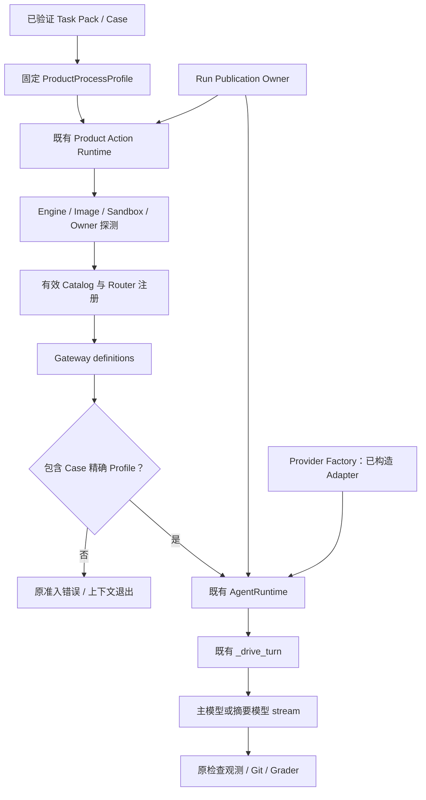
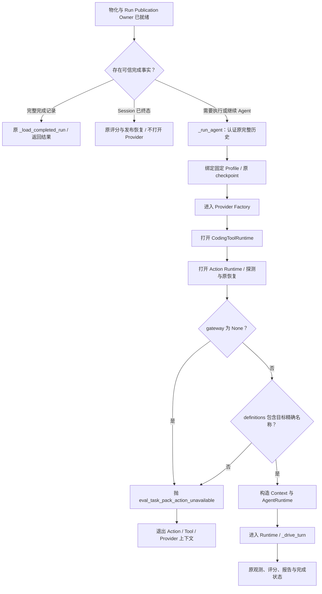
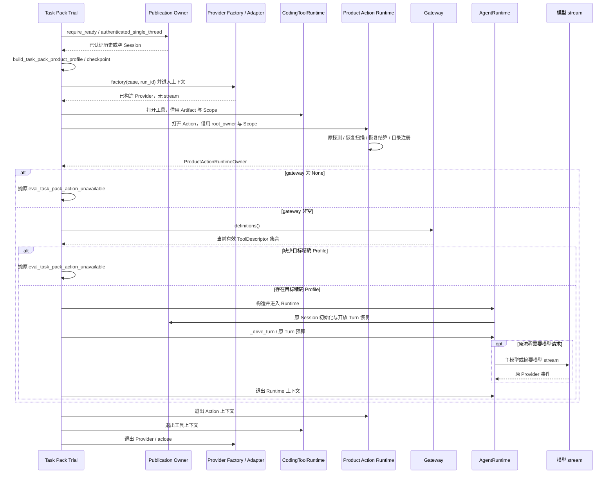
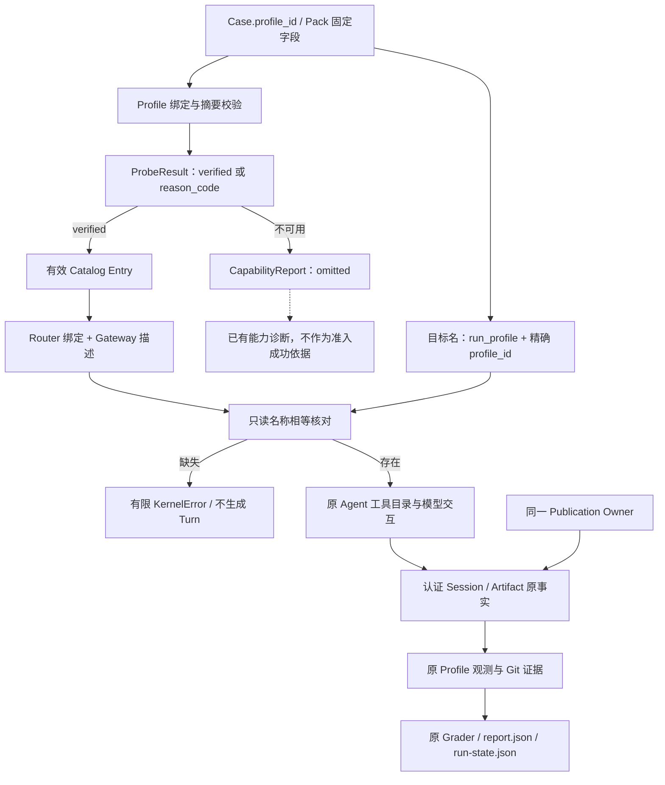

# M09 R3：Task Pack 固定 Profile 模型前准入详细设计

## 1. 文档基线与需求背景

### 1.1 设计范围与实现身份

本设计描述既有 Task Pack Trial 编排中的一项局部准入修复：**需要执行 Agent 的 Trial，必须先确认当前有效 Gateway 描述集合包含本 Case 精确指定的固定 Profile，随后才能构造、进入 AgentRuntime，驱动 Turn 或调用模型。**

提交基线为 `eea6c8ab650d389023b68c97596dec0f79bb1d6c`。本设计对应该基线上的固定 Profile 准入候选实现及其参数化测试，以源码摘要、冻结 Wheel 摘要和独立安装字节核对联合识别。`code_revision` 表示提交基线，不单独代替候选制品身份。设计审阅时的文件身份为：

| 文件 | SHA-256 |
|---|---|
| `src/harnessix/evals/task_pack_trial.py` | `ac9e5264f45f8988975e89713f557226543cb278561e10feddf2db3a18aa716e` |
| `tests/evals/test_task_pack_publication.py` | `024e2c276553a40f51cdf8c1a913a676c91ba901e2e533c20504976502494c11` |

文件后续变化时应重新核对实现与验证身份；提交号相同不能代替工作树或 Wheel 字节一致性证明。本文的“已实现”指源码存在对应逻辑，不等于 Wheel 回归、容器验收或真实模型运行已经通过。验证状态见第 13 节。

### 1.2 需求背景

Task Pack 将 Case、任务、仓库和固定容器检查 Profile 绑定。检查命令、镜像及资源约束由已校验 Pack 决定，模型不能选择其他 Profile、补充任意命令或改用宿主执行。实际准入不仅需要配置中存在 Profile，还需要当前宿主探测后将它注册为有效工具。

产品 Action 组合允许按能力分别发布：Workspace Patch 可以有效，容器 Process Profile 可以因 `container_unavailable` 被标记为 `omitted`。因此，非空 Gateway 仅证明至少有一项有效 Action，不证明本 Case 的必需检查能力可用。

旧 Trial 仅检查 `actions.gateway is None`。当 Patch 保持可用而所需容器 Profile 被省略时，仍可能进入模型交互；模型调用该 Profile 后得到 `unknown_tool`，终态评分前的 `_profile_observations` 再因缺少可信检查终态抛出 `eval_baseline_invalid`。这是执行前置条件未满足，不应依赖模型调用后或评分阶段才发现。

## 2. 源码研究与故障根因

### 2.1 源码阅读链

以下位置均为既有实现，不引入独立评测平台、Agent Loop 或能力管理服务。

| 源码与位置 | 已核对事实 |
|---|---|
| [`task_pack_contracts.py`](../../src/harnessix/evals/task_pack_contracts.py)：`CodingEvalTaskPackCase`、Pack 校验 | `case.profile_id` 绑定 Pack Profile；Pack 校验引用、唯一性与摘要，不从模型文本选择 Profile |
| [`task_pack.py`](../../src/harnessix/evals/task_pack.py)：`build_task_pack_product_profile`，约 192—229 行 | 从已验证内置 Pack 生成产品 Profile，校验 Engine 文件；固定 `selector_policy="none"`、`network_mode="none"`，保留镜像、命令、期限和资源参数 |
| [`action_runtime.py`](../../src/harnessix/product_config/action_runtime.py)：`_open_action_dependencies`、`open_default_product_action_runtime` | 探测 Profile，复用恢复扫描和恢复结算，发布产品能力组合；借用传入的根 Owner |
| [`process_profile.py`](../../src/harnessix/product_config/process_profile.py)：`_profile_probe_reason`、`probe_product_process_profile` | 将容器不可用等失败归入有限原因；无法取得完整证明时不给出 `verified` 执行组件，不降级到宿主 |
| [`action_composition.py`](../../src/harnessix/product_config/action_composition.py)：`_process_components`、`_compose_product_actions` | 无 `verified` 的 Profile 只产生 `omitted` 证据，不产生目录条目；有 Patch 等其他条目时仍创建 Gateway |
| [`action_catalog.py`](../../src/harnessix/product_config/action_catalog.py)：`ProductActionCatalog` | 目录只包含已验证条目；校验证据、描述、Schema 和指纹，再安装并复核 Router 绑定 |
| [`agent_gateway.py`](../../src/harnessix/trusted_actions/agent_gateway.py)：`definitions()` | 返回当前 Gateway 的正式描述集合，源自组合根传入的 Catalog 描述 |
| [`task_pack_trial.py`](../../src/harnessix/evals/task_pack_trial.py)：`_run_agent`，约 364—435 行 | 新准入位于 Action Runtime 已打开之后、`build_product_agent_context` 与 `AgentRuntime` 之前 |
| [`runtime.py`](../../src/harnessix/agent/runtime.py)：`__aenter__`、`_execute_tool`、模型流消费 | 入口会初始化并恢复 Session；未注册工具产生 `unknown_tool`；主模型和摘要模型均通过 Provider `stream` 进入 IO |
| [`task_pack_observations.py`](../../src/harnessix/evals/task_pack_observations.py)：`profile_observations` | 同 Profile 实际结果必须有可信终态；无法形成观测时抛 `eval_baseline_invalid` |

### 2.2 根因与错误链

旧判断将“容器 Profile 或 Patch 至少有一个有效”错误地当作“本 Case 固定 Profile 有效”。关键反例是：

1. Engine 文件存在且可执行，Pack Profile 构造成功。
2. 后续 Engine／Sandbox 能力探测失败，原因可为 `container_unavailable`。
3. `_process_components` 记录该 Profile 为 `omitted`，不注册 `run_profile.<profile_id>`。
4. Patch 有效，`entries` 非空，Gateway 仍非空。
5. 旧 `_run_agent` 放行，模型请求可能已经发送。
6. 模型若调用缺失 Profile，Agent 返回 `unknown_tool`。
7. 观测收集器不能把该失败解释成真实检查退出，触发 `eval_baseline_invalid`。

`unknown_tool` 不是所有省略场景必然产生的结果；它取决于模型是否调用缺失工具。正因不能依赖模型行为，拒绝必须前移到宿主侧确定性准入。

### 2.3 源码中的修复边界

修复仅扩展 `_run_agent` 原有拒绝条件：

```python
if actions.gateway is None or not any(
    item.name == f"run_profile.{case.profile_id}" for item in actions.gateway.definitions()
):
    raise KernelError(
        "eval_task_pack_action_unavailable",
        "Task Pack固定Profile或Workspace Patch能力不可用",
    )
```

错误码与错误文案保持原合同。判断使用 Gateway 实际可发布的描述集合，不使用配置存在性、报告中任意 Profile 的成功状态、名称前缀或可执行文件存在性替代。

## 3. 设计目标、非目标与验收条件

### 3.1 设计目标

1. Gateway 为空或其 `definitions()` 中无精确 `run_profile.{case.profile_id}` 时失败关闭。
2. 拒绝发生在 `AgentRuntime` 构造和进入之前，也先于 `_drive_turn`、主模型流和摘要模型流。
3. 保留原 Provider、工具和 Action 的上下文生命周期；拒绝仍退出已进入的 Provider 上下文。
4. 保持 Session、Artifact、公开输出 Scope 和根 Owner 的同一对象借用关系。
5. 仅对需要继续执行 Agent 的路径准入；已有可信完成报告或 Session 终态的恢复路径不额外要求当前容器能力，也不重新请求模型。
6. 不以放宽能力探测、替换工具名称或补造检查结果消除失败。

### 3.2 非目标

不新增重试、后台探测、Host fallback、自动拉取镜像或模型前实际运行测试；不修改 Pack、任务、提示词、评分器、成功门槛、金额、预算周期、价格、输出 Token 限额或费用结算逻辑；不修改 Session／Action 状态 Schema、存储格式、审批策略或原历史记录。

本规则只新增固定 Profile 精确核对，**不新增独立 Patch 名称存在性校验**。保留的错误文案不能被解读为“逐项证明所有 Case 能力齐备”。产品组合根仍按原逻辑处理 Patch；参数化测试的 `required` 分支仅提供目标 Profile 描述即可通过本规则。

### 3.3 验收判据

| 场景 | 必须观察到的结果 |
|---|---|
| 非空 Gateway 包含目标精确名称 | 沿原上下文和驱动路径继续，不新增模型请求或改变任务内容 |
| Gateway 为 `None` | 原 `eval_task_pack_action_unavailable`；不创建 AgentRuntime、不进入驱动 |
| Gateway 仅有 Patch | 同上，不把 Patch 存在视作固定 Profile 可用 |
| Gateway 仅有其他 Profile | 同上，不接受任意 `run_profile.*` 替代目标 Profile |
| 新空 Session 的缺失场景 | Provider 退出，Thread 数仍为零；不发布当前 Trial 完成报告或完成状态 |
| 已有 Session 的继续执行缺失场景 | 不进入 AgentRuntime 恢复，不创建新 Thread／Turn；不声称旧 Thread 数为零 |
| 安装包验收 | 已安装模块字节对应修复；四参数回归取得可审阅终态；容器复验状态独立登记 |

## 4. 总体架构与模块边界



Task Pack Trial 是宿主编排层，负责提出本 Case 的必需能力要求；产品配置层负责强能力探测、恢复和有效目录发布；Gateway 是目录至 Agent 的正式边界；AgentRuntime 负责后续 Turn 和模型交互。新增逻辑不承担探测、Router 注册、执行或评分职责。

Provider Factory 的进入时间仍早于 Action 装配和准入。图中的 Adapter 连接表示可被注入 Runtime，不表示构造时已调用模型。拒绝分支从未到达 Runtime，故也没有摘要模型的隐式绕行。

## 5. 核心准入流程



`run_task_pack_coding_eval` 在持有根 Owner 的窗口中物化 Workspace、打开认证宿主并选择恢复分支。仅当 `_completed_session_turn` 没有给出可信终态时调用 `_run_agent`。准入失败的异常直接终止当前执行路径，不返回伪造 Turn，因此不会进入 `_grade_and_publish`。

准入读取本次装配的有效目录，不重新执行探测，也不将 `omitted` 改写为成功。它证明“此刻已注册必需工具”，不证明容器在后续整个执行期间永远可用；执行时故障仍由原工具结果、恢复与观测合同处理。

## 6. 生命周期时序与资源退出



顺序来自 `_run_agent` 的嵌套 `async with`。内层拒绝会沿已建立的上下文反向退出；正式 `OpenAIChatProvider.__aexit__` 调用 `aclose()` 关闭拥有的 Client。`AgentRuntime.__aenter__` 会主动处理旧开放 Turn，因此准入必须先于 Runtime 构造与入口，而不能仅在第一次显式 `run_turn` 前检查。

此时 Action 启动恢复已执行，不能据图推导“准入失败前没有任何持久化或恢复行为”。Provider 构造、目录探测和资源清理也不是模型请求。

## 7. 数据流、领域事实与持久化边界



准入的输入只有可信 Case 的 `profile_id` 和当前 Gateway 正式描述集合；输出是继续原执行或抛原错误。没有新增配置字段、请求字段、数据库列、状态枚举、审批记录或持久化“已准入”标志。

`omitted` 是能力报告中的有效失败事实，但不是可执行目录条目。Catalog 已负责验证 Schema、Tool 指纹、证据与 Router 的同源性；Trial 不重复这些验证，只落实 Case 对特定工具的要求。

新 Run 在到达准入之前可能已有 Workspace、认证 Key、空 Session、Action Store 及启动恢复事实。缺失时不创建本次 Agent Thread／Turn、不执行本次模型流，不等于 Run 根零文件、预算账本零读取或 Action Store 零变化。已有 Run 的旧事件与费用记录保持原样。

## 8. 类、接口设计与数据结构字段对应

### 8.1 类与函数接口

| 类／函数 | 实际接口与职责 | 本修改是否改变 |
|---|---|---|
| `CodingEvalTaskPackCase` | 包含 `case_id`、`repository_id`、`profile_id`、`task`、可选 Review Oracle 的固定合同 | 否 |
| `build_task_pack_product_profile(loaded, profile_id, container_engine)` | 返回固定 `ProductProcessProfile`，只绑定 Engine，不完成全部容器能力证明 | 否 |
| `TaskPackProviderFactory` | `Callable[[CodingEvalTaskPackCase, UUID], AbstractAsyncContextManager[ModelProvider]]` | 否 |
| `_run_agent(..., owner, *, history_read=None)` | 返回 `tuple[UUID, Turn]`；复用认证、Provider、工具、Action 和 Agent 装配 | 仅扩展入口拒绝条件 |
| `open_default_product_action_runtime(...)` | 异步上下文；接收 Artifact、SecretProvider、Action 配置、Workspace Scope、输出保护与根 Owner | 否 |
| `ProductActionRuntimeOwner.gateway` | `RouterBackedAgentActionGateway \| None`；来自当前 `composition.gateway` | 否 |
| `RouterBackedAgentActionGateway.definitions()` | 返回 `tuple[ToolDescriptor, ...]`；检查 Gateway 开放状态后返回正式目录 | 否 |
| `AgentRuntime(...)` | 借用 Session、Provider、工具、Trusted Action、Artifact、公开保护和 Context | 否；调用受新增准入保护 |
| `_drive_turn(runtime, owner, case, workspace, run_id, cancel, fault)` | 创建或继续原请求 Turn，落实固定审批与原预算，返回 Thread ID 和终态 Turn | 否 |
| `_profile_observations(turn, case)` | 为 `profile_observations` 的原导入别名；返回 baseline／final 观测元组 | 否 |

### 8.2 关键字段与对象身份

| 字段／对象 | 来源及语义 | 准入使用或约束 |
|---|---|---|
| `materialized.case.profile_id` | 已校验 Pack 中本 Case 的固定引用 | 形成唯一目标名称，不允许替代 |
| `ToolDescriptor.name` | Catalog 的已验证描述，经 Gateway 发布 | 完整字符串相等；不按前缀、大小写归一化或子串匹配 |
| `probe.verified` | 完整强能力证明形成的可执行 Profile | `None` 时仅记录省略，不注册工具 |
| `ProductActionCapabilityEvidence.status/reason_code` | `verified` 或 `omitted` 及有限原因 | 用于原诊断；不是新判断直接读取的输入 |
| `owner.sessions / owner.artifacts` | 当前 Run 的认证 Store | 工具、Action、Agent 复用同一对象；不构造另一套裸 Store |
| `owner.scope` | 当前 Run 公开输出保护 Scope | 借用于 Git、Action 输出保护与 Agent；不从 Provider 私有字段猜测 |
| `owner.root_owner` | 外层已持有的产品根 Owner | Action Runtime 借用相同对象，不重入替代 OS Owner |
| `tools.workspace_scope` | 原工具宿主的 Workspace Scope | 原样传入 `artifact_workspace_scope`，不重新计算替代值 |
| `history_read.cancel / deadline` | 原历史认证阶段的取消与绝对期限 | 沿既有阶段传递，不以新增准入刷新期限 |
| `case.task.budget` | 已冻结任务预算 | 仍传入原 `runtime.run_turn`，不因 preflight 调整 |
| `KernelError.code` | `eval_task_pack_action_unavailable` | 原有限错误，不转换为评分结果或费用未知 |

正式 Workspace Patch 工具名为 `apply_patch_batch`，见 [`trusted_action.py`](../../src/harnessix/delivery/trusted_action.py)。测试 `patch_only` 使用的 `workspace.apply_patch` 是合成的非目标描述，用于证明“其他工具存在仍不放行”，不是产品接口重命名。

## 9. 业务伪代码与算法特性

以下伪代码对应原控制流；新增的业务判定只有“目标工具完整名称存在性”。

```text
运行 Task Pack Trial：
  持有原根 Owner，物化固定 Workspace，打开原认证 Publication Owner
  若完整完成记录存在：沿原认证读取与一致性核对返回
  若认证 Session 已有本 Run 终态：沿原评分／发布恢复，不创建 Provider
  否则：
    运行 Agent：
      require_ready，认证原全部历史
      从已验证 Pack 绑定本 Case 固定 Profile
      执行原历史控制 checkpoint
      进入 provider_factory(case, run_id)
      打开 CodingToolRuntime，借用原 Artifact 和 Scope
      打开默认 Action Runtime，借用原 root_owner 和 Scope
      令 gateway = actions.gateway
      若 gateway 为 None：抛原 eval_task_pack_action_unavailable
      若 gateway.definitions 中不存在
           name 完全等于 "run_profile." + case.profile_id 的描述：
        抛同一个原错误
      构造原 Context，构造并进入 AgentRuntime
      沿 _drive_turn 使用原 request_id、审批、任务预算和取消令牌
      返回原 Thread ID 与终态 Turn
    沿原观测、Git、Grader 发布报告与完成状态
  无论正常或异常，沿原上下文退出释放资源
```

`any(...)` 在首个精确匹配时停止，描述数量为 n 时最坏时间为 O(n)。名称比较不增加异步等待、网络、子进程、文件 IO 或预算预留。Gateway／Catalog 返回描述时既有实现可能生成副本，不能将整个 `definitions()` 调用笼统宣称为零分配；新增比较本身不构造额外索引或缓存。

`gateway is None or ...` 保持短路：空 Gateway 不访问 `definitions()`。非空但关闭、结构无效或抛异常的 Gateway 仍按既有端口错误传播；不吞掉异常、不自动改判成功。

## 10. 异常、取消、超时、持久化与恢复

### 10.1 错误分类与可观测边界

| 阶段／异常 | 当前行为 | 本设计禁止的改写 |
|---|---|---|
| 原历史认证或 Owner 校验失败 | 在原认证阶段拒绝；保留原有限错误 | 绕过认证、补签历史或更换 Owner |
| Profile 引用或 Engine 文件无效 | `eval_task_pack_profile_not_found` 或 `eval_task_pack_profile_invalid`，可先于 Factory 拒绝 | 将文件存在当作完整容器能力证明 |
| Profile 探测未验证 | 原报告记录 `omitted`；若目标不在有效 Gateway，Trial 抛 `eval_task_pack_action_unavailable` | 自动重试、Host fallback、放宽 probe |
| Action 启动恢复完整性失败 | 如 `product_action_recovery_integrity`，在 Action 上下文交付前拒绝 | 为通过新准入跳过旧恢复 |
| 有效 Gateway 缺少目标 Profile | 原准入错误在 Runtime 前传播 | 返回伪造 Turn、空检查成功或评分失败报告 |
| 准入后真实执行缺可信终态 | 原 `eval_baseline_invalid` 与证据缺失停止链继续生效 | 将后续执行故障视为已由 preflight 消除 |
| 已完成状态与报告不一致 | 原 `eval_report_mismatch` 等一致性错误 | 删除旧状态、重算并覆盖未认证事实 |

`_execute_remaining` 目前只将 `eval_baseline_invalid` 转为 `evidence_missing`；对本准入错误重新抛出。因而本文不宣称新增了 `action_unavailable` 的 Campaign／Suite 持久停止原因。Case 在调用 Trial 前可能已经发布 `running` 状态，准入拒绝也不自动将其标记为完成；上层错误呈现和恢复继续使用原机制。

公开诊断应使用稳定错误码与既有 Capability Report 的有限 `reason_code`，不复制第三方错误正文、私有运行路径或凭据。新增判断不提供新的遥测事件、指标或独立报告文件。

### 10.2 取消与超时

- `TaskPackHistoryReadControl` 保留原 `CancelToken` 与一次捕获的 120 秒历史认证绝对期限；准入前执行原 `control.checkpoint(owner)`。
- 该期限属于历史认证阶段，不是覆盖 Provider、工具、Action 探测和模型执行全过程的统一 120 秒超时。新名称核对不新增阶段期限或取消等待器。
- 容器探测沿原有探测期限运行；本修复不把后台线程探测变为立即可取消操作，也不承诺准入前所有资源操作无延迟。
- 进入 `_drive_turn` 后，原 `cancel.checkpoint`、`CancelToken.run`、`remaining_seconds(turn)`、Turn 预算及恢复分支不变。
- Python 异常或任务取消沿既有上下文退出；新增规则不吞掉取消、不重试退出、不将取消改判为工具可用。离线目标测试对正常缺失异常验证 Provider 退出，不等于覆盖所有平台、清理失败和取消竞态。

### 10.3 持久化、崩溃与恢复

新增准入本身无事务或持久化字段。原报告先写入、完成状态后发布的流程不变；Case 只有取得可信已完成 Trial 才推进 `completed_run_ids` 和费用前缀。准入失败不会发布该 Trial 的新完成记录。

| 原 Run 状态 | 恢复行为与准入关系 |
|---|---|
| 报告与完成状态俱全 | 原 `_load_completed_run` 认证和核对；不重新打开 Provider，也不重探测当前 Profile |
| Session 本 Run 已终态但发布未完成 | 原 `_completed_session_turn` 返回事实，继续原评分发布；不会回到模型执行来补检查 |
| Session 有未终态 Turn | 必须走 `_run_agent`；先认证原历史，再装配并核对本次有效 Profile，之后才允许 Runtime 的原恢复 |
| 上次准入失败，只有物化或初始化事实 | 再次正式执行时重新装配并检查当前能力，不使用缓存“已准入”结果；不构成内部自动重试 |
| 原认证 Key、历史或 Owner 身份失效 | 原恢复失败关闭，不新建替代 Key、不删除状态来规避 |

修复不重写旧 Run 的 `unknown_tool`、`eval_baseline_invalid`、未决费用或证据缺失停止记录。容器恢复可用只能支持后续合规执行，不能补证历史检查已经成功。

## 11. 安全、信任边界与费用控制

### 11.1 固定执行边界

1. Profile 来源是已验证 Pack，Case 引用在进入模型之前确定；目标名称不接受模型输入、任意命令或其他 Profile 替代。
2. 仍为固定容器执行、无网络、零选择器策略，镜像及资源证明沿原探测落实。名称核对是必要的 Case 准入条件，不替代强能力证明或执行时隔离。
3. `_NoSecrets.resolve` 继续拒绝 Task Pack Process Secret 解析。它约束检查执行的 SecretProvider，不表示模型 Provider 无凭据需求。
4. `_require_allowed_approval` 继续使用正式 Profile Decoder，限制固定无参数检查及允许路径内的 Patch；准入不会授予模型额外审批权限。
5. 原根 Owner、认证 Binding、Session、Artifact 和 Scope 保持同源；不构造旁路 Store，不扩大状态目录或输出保护范围。

### 11.2 Provider 构造与模型 IO 的精确边界

| 边界 | 源码事实与可保证内容 |
|---|---|
| 凭据获取 | 默认 `TaskPackOpenAIChatProviderFactory.__call__` 会从 Scope 解析材料；预算宿主也可能在进入 Suite 之前获取凭据。因此不保证零凭据读取 |
| Adapter 构造 | `OpenAIChatProvider.__init__` 校验配置和 Key、构造 HTTPX／OpenAI Client；`__aenter__` 只校验关闭状态并返回对象 |
| 模型 IO | `OpenAIChatProvider.stream` 内才进入 `chat.completions.create`。缺失 Profile 时不构造／进入 AgentRuntime、不进入 `_drive_turn`，因而不会由该 Trial 触发主模型或摘要模型流 |
| 单请求预留 | [`provider_verification_guard.py`](../../scripts/provider_verification_guard.py) 的 `GuardedVerificationProvider.stream` 内才调用 `ledger.reserve`；构造 Guard 不预留。缺失 Profile 的该执行分支不会触发新的模型请求预留 |
| 既有账本与费用 | 预算宿主可能已打开、核对账本；旧预留、未决与其他运行记录保留。本修复不是零账本访问、零历史费用或自动退款证明 |

预算宿主 Factory 见 [`run_engineering_provider_suite_budgeted.py`](../../scripts/run_engineering_provider_suite_budgeted.py)：进入官方 Adapter 上下文后仅构造 Guard 并交付 Provider。默认 Factory 与该受控 Factory 的构造期没有调用 `stream`；这一结论是本次调用链的源码边界，不是对任意注入 Factory 的无副作用保证。自定义 Factory 是受托宿主接口，其构造若自行发送请求，不由本名称核对机制拦截。

本修改不改变授权金额、预算周期、单次预留上界、价格、Case 停止线和未决处理。缺失能力提前拒绝避免的是本分支后续无效模型请求，不以预算重置、提高额度或放宽检查换取成功。

## 12. 安装、部署与运行维护

### 12.1 制品与环境要求

本修改仍随现有 Python 包交付，不增加服务、端口、容器编排平台或数据库迁移。当前 [`pyproject.toml`](../../pyproject.toml) 的包版本为 `1.0.0rc1`，要求 Python 3.12 及以上；Provider 依赖按原 `openai` extra 安装。源码依赖使用锁定文件，不因本规则升级依赖。

部署前必须区分提交基线、候选工作树和安装 Wheel：仅含基线提交的旧制品不能替代包含准入修复的冻结候选 Wheel。发布者应记录候选源文件摘要、Wheel SHA-256、安装后模块位置及摘要，证明安装包包含本实现。

参照 [安装规范](../operations/installation.md) 与 [安装产品验收工作流](../../.github/workflows/installed-product-acceptance.yml)，在独立候选环境构建、安装；不覆盖正在运行的旧环境。以下变量是部署角色占位符，不包含真实宿主路径：

```bash
# 仅在已核对的候选目录及独立交付目录中执行。
cd "$HX_CANDIDATE"
uv sync --locked --all-extras --dev
uv export --locked --no-dev --all-extras --no-emit-project \
  --format requirements.txt --output-file "$HX_DELIVERY/requirements.txt"
uv build --offline --wheel --out-dir "$HX_DELIVERY/wheel"
```

`HX_DELIVERY` 必须是预先准备的独立验收目录。按安装规范生成含精确 Wheel SHA-256 的 `wheel-requirement.txt`，创建独立 venv，再使用锁定依赖和离线 Wheel 安装，不借用开发环境：

```bash
uv pip install --python "$HX_PY" --require-hashes --no-deps \
  -r "$HX_DELIVERY/requirements.txt"
uv pip install --python "$HX_PY" --require-hashes --no-deps --offline \
  -r "$HX_DELIVERY/wheel-requirement.txt"
"$HX_PY" -I -c 'import harnessix.evals.task_pack_trial as m; print(m.__file__)'
"$HX_PY" -I -m harnessix --help
```

上述命令是安装复现规范，不单独构成验证记录；本候选已完成的制品身份与回归结果见第 13 节。CLI 导入或 Help 成功只证明包可导入，不证明固定 Profile 有效。Wheel 测试须证明未从源码树导入 `harnessix`，并比对安装模块字节；禁止用 `PYTHONPATH=src` 将源码回归冒充安装验收。

### 12.2 运行前检查与恢复操作

- 从原可信配置取得 Git、Engine、Pack、镜像 Digest、Suite 身份和预算绑定；Engine 文件可执行及 `docker version` 成功都只是部分前置证据，正式 Profile probe 仍必须验证全部条件。
- 所需镜像按原 Digest 准备；不为本修复新增自动拉取或用其他镜像替代。容器服务恢复后应重新执行正式能力装配，以新结果决定是否准入。
- 沿 [Provider Suite 运维手册](../operations/provider-suite-baseline.md) 使用受控预算宿主和原网络授权；不得切换到无 Guard 的入口规避预留保护。
- 凭据由既有 Secret Manager、launchctl 或显式 Keychain 引用提供；配置和运行记录不写明文值，不回显凭据，也不清理全局环境来改变解析行为。
- 准入失败时保留当前证据，诊断 `omitted` 与有限原因。修复环境后由操作员按原恢复合同显式执行；不得删除 Run 状态、重建账本、增加金额或重置未决来绕过边界。

### 12.3 上线顺序

完成候选 Wheel 身份核对和离线回归后，再取得目标宿主容器预检终态；二者符合要求后才考虑原授权范围内的真实执行。若容器仍不具备必需能力，正确产品行为就是模型前拒绝，不应把该拒绝认定为必须通过降级消除的缺陷。

## 13. 测试设计、验证状态与证据边界

### 13.1 四参数确定性回归

对应测试：[`test_task_pack_publication.py`](../../tests/evals/test_task_pack_publication.py) 中 `test_agent_tool_action_wiring_borrows_identical_scope_and_owner`，约 311—408 行。测试使用真实临时认证 SQLite 和合成 Scope；自动 fixture 禁止网络连接和子进程。Agent、驱动、工具和 Action 装配以局部 fixture 替代，不调用真实模型或容器。

| 参数 | 合成 Gateway | 预期调用序列与断言 | 旧判断表现 |
|---|---|---|---|
| `required` | 包含 `run_profile.{materialized.case.profile_id}` | `provider → agent → drive → provider_closed`；借用原 Store／Scope／Owner | 可通过 |
| `none` | `None` | 原错误；`provider → provider_closed`；Thread 数为零 | 可通过 |
| `patch_only` | 只有合成 `workspace.apply_patch` | 与 `none` 同样拒绝；绝不创建 Runtime 或驱动 | 错误放行，测试失败 |
| `other_profile` | 只有 `run_profile.other` | 与 `none` 同样拒绝，证明必须精确名称 | 错误放行，测试失败 |

对象身份断言覆盖：

- 工具的 `artifacts is owner.artifacts`、Git 输出保护为同一 Scope、Git 状态目录为当前 Run。
- Action 的 `root_owner is owner.root_owner`、输出保护为同一 Scope。
- 放行路径 Agent 使用 `owner.sessions`、同一 Artifact 与公开输出 Scope；驱动借用同一 Publication Owner。
- 缺失路径只记录 Factory 进入与退出；Agent／驱动 fixture 若被调用即失败，且 `owner.sessions.thread_ids()` 仍为空。

这证明的是控制流隔离和对象借用合同，不是实际 Adapter 凭据获取、真实容器探测或外部费用实测。模型 IO／预留不发生的结论还依赖第 11 节正式 Adapter 和 Guard 的源码位置。

### 13.2 相关回归与验收步骤

离线源代码回归至少包括：

```bash
uv run pytest -q \
  tests/evals/test_task_pack_publication.py::test_agent_tool_action_wiring_borrows_identical_scope_and_owner
uv run pytest -q \
  tests/evals/test_task_pack_publication.py \
  tests/evals/test_task_pack_execution.py \
  tests/evals/test_task_pack_profile_outcomes.py \
  tests/evals/test_task_pack_evidence_stop.py \
  tests/evals/test_provider_suite_execution.py \
  tests/product_config/test_action_catalog.py \
  tests/product_config/test_action_runtime.py
```

第一条验证四分支；第二条复核认证宿主、完成恢复、观测严格性、证据停止、目录同源与 Action 恢复没有退化。该命令清单用于复现，不与已登记的 13 文件、311 Case 的实际回归集合等同；已完成验证以第 13.3 节冻结制品和结果记录为准。

安装包验收须在独立 Wheel 环境复用这四分支及相关离线测试，保存测试节点、总数、终态、安装导入位置、Wheel 与模块摘要。容器预检使用正式 Profile、原镜像与资源约束，独立记录每项能力及省略原因；不是把合成 `required` 参数当作真实 Profile 已可用。

### 13.3 当前验证登记

状态截至 2026-10-07；验证结果按制品、离线、类型检查和具体容器入口分别登记。证据文件名为逻辑标识，不发布私有证据根路径。

| 验证层 | 当前状态与证据标识 | 可以支持的结论／不能支持的结论 |
|---|---|---|
| 候选源码核对 | 精确 `definitions()` 名称准入及四参数测试已核对；候选 Wheel 身份与独立安装一致性已验证 | 支持实现位置与修改范围；提交基线不代替候选字节身份 |
| 修复前红灯回归 | 四参数结果为 2 项失败、2 项通过；失败为 `patch_only`、`other_profile` | 支持旧非空 Gateway 判断存在漏检；不是修复后通过证据 |
| 冻结 Wheel 与安装身份 | Wheel SHA-256：`731396d93ed1f2e8ee21e1060531bf5ae44217d82e790767a8acb0e20c8fedde`；548 个成员、507 个 Python 文件，候选与独立安装内容逐字节一致 | 支持该冻结制品包含候选实现且安装来源一致；不证明全部容器入口可用 |
| 修复后离线 Wheel 回归 | 相关 13 个测试文件、311 个 Case 通过；`profile-required/profile-regression.xml` | 支持本候选准入及相关离线回归；合成能力目录不能替代真实容器证明 |
| 静态类型检查 | mypy 检查 507 个 Python 文件通过 | 支持该范围静态类型检查；不替代运行与模型质量验收 |
| 显式 Engine 端点的正式 Case 集成 | 既有受控 wrapper 显式端点的 Engine ID 与原 Engine 相同已核验；3 项真实正式挂载／Case 恢复录制集成通过；`container-engine-direct.xml`；0 个生成请求 | 支持该端点、该装配方式和三项集成场景；不证明默认 Desktop 路径，不形成真实模型质量成绩 |
| 默认 Desktop 容器路径 | 默认 Desktop 路径 3 项失败；`container-preflight.xml`，重启路径另保留 `container-reopened.log` | 该入口登记为失败；不能按显式端点的 3 项通过判定本入口通过 |
| engineering/v2 全十 Profile 录制集成 | `all-profiles.xml`：5 项通过、5 项失败；失败发生于最终检查，不是 missing Profile；原因定位尚未完成 | 证明这次全 Profile 验证不是 10 项通过；失败不能并入准入缺失，也不能用三项 Case 通过覆盖 |
| 真实 Task Pack／Suite 质量与费用验收 | 本修复没有新增真实生成请求完成成绩 | 不追认旧 Run，不宣称真实模型质量、费用或生产验收已闭环 |

随后在独立 Downloads 根和受控 Docker Desktop 重启后分别复验十 Profile，均为5项通过、5项失败。
宿主文件存在而Guest读取缺失或大小不一致的诊断另存，底层根因未确认；不能把
Engine连接、同ID或部分Case成功外推为Workspace一致性通过。重启后按精确原基线
恢复八个原运行容器，业务容器/数据/配置未删除或改写。四张设计图已渲染并完成可读性检查。


311 项离线通过、507 文件类型检查通过和三项显式端点集成通过是独立的已完成事实。十 Profile 的 5 项最终检查失败仍保留为失败；默认 Desktop 路径单独登记 3 项失败。显式端点 Engine ID 相同不等于 Workspace 挂载语义一致：guest 与 host 的 Workspace 不一致已识别，剩余挂载问题待整改。上述集成没有生成模型请求；不同入口、不同 Profile 集合、不同测试层次的结果不相互替代。

本次缺失 Profile 的控制流拒绝与全 Profile 录制集成的最终检查失败属于不同边界：准入证明工具已注册，不证明实际检查一定通过。后者的根因尚未形成已验证结论，本文不归因于模型、镜像、录制材料或此准入修复，也不为消除失败放宽原检查。

私有 XML 与日志仅保留上述文件标识，不发布其绝对路径、原始正文或凭据。本文不附加独立证据制品，不修改已有失败材料；后续定位应以新的正式验证记录补充，不阻塞本设计对已实现准入规则的审阅。

### 13.4 通过与未通过的边界

准入修复的冻结制品、相关离线回归与类型检查已取得第 13.3 节记录的通过结果。发布与目标宿主验收还必须分别核对实际入口的正式容器能力及检查结果；默认 Desktop 的 3 项失败、十 Profile 的 5 项最终检查失败及剩余 Workspace 挂载问题均不能视为清关。真实运行若被授权，应另外核对 Session／Artifact、检查终态、报告、费用账本与结果；不得从离线或录制集成通过推断真实模型任务成功。

文档结构或 Mermaid 语法检查只证明文档可解析，不证明图中 IO、容器或恢复行为已实际验收。未取得终态的验证保持待验；已失败材料不因重跑开始而变为通过。

## 14. 设计取舍、影响分析、风险与回滚

### 14.1 设计取舍

| 方案 | 选择与理由 |
|---|---|
| 仅判断 Gateway 非空 | 不采用；只能证明任意能力存在，漏掉 Patch 可用而目标 Profile 不可用 |
| 检查配置声明或任意 Profile 前缀 | 不采用；声明不等于已验证注册，其他 Profile 也不能替代 Case 固定检查 |
| 读取 Gateway 正式描述并精确比较 | 采用；落实 Case 最小必需能力，复用已与 Router 校验一致的有效 Catalog |
| 新增第二套 probe／注册缓存 | 不采用；造成事实重复、期限和恢复语义不一致；本判断复用当前装配结果 |
| 将 Factory 全部移到准入之后 | 本切片不采用；保持原装配与资源顺序，仅保证 Runtime／驱动／模型 IO 之前拒绝。零凭据读取不是本切片承诺 |
| 自动重试、拉镜像或 Host fallback | 不采用；会改变任务执行与费用边界，破坏固定容器检查前提 |
| 修改观测或评分来接受 unknown_tool | 不采用；把基础设施缺失误当实际检查，污染 Task Pack 成绩与历史证据 |
| 新增持久停止枚举或准入平台 | 不采用；本次仅复用原错误，不扩张上层状态合同或产品架构 |

### 14.2 影响与兼容性

实现影响范围是 `_run_agent` 的原拒绝分支及既有接线测试。公开函数签名、Tool Schema、Pack、任务、评分、金额和数据库格式均不变化，不需数据迁移。有效目标 Profile 场景沿原逻辑继续；缺失目标 Profile 场景从可能已发生模型交互的晚失败改为 Runtime 前确定拒绝。

错误码保持兼容，但错误出现阶段前移；运维工具必须按有限错误处理，不依赖其后必有 Thread、Turn、报告或模型费用。完成 Run 与可信终态恢复不要求当前容器重新可用，保持历史重读与恢复兼容性。

剩余风险包括：探测后环境仍可能变化；Action 装配或退出可独立失败；任意自定义 Factory 可能有构造期副作用；当前准入不新增 Patch 单项校验；上层对准入错误仍沿原传播而非新增持久停止分类。以上是实际实现边界，不以本修复宣称全面消除。

### 14.3 回滚与故障处置

1. 如安装回归失败，保持旧运行环境停止或不切换，在独立验收环境复核制品与来源，保留原证据，不在运行目录覆盖安装包。
2. 包级回滚只切换至已保存、可核验的旧 Wheel 和锁定环境；本修复无 Schema 迁移，不需要删除、重写或恢复覆盖 Session／Artifact／Action 数据。
3. 回滚会恢复“非空 Gateway 即放行”的旧缺陷，因此缺少必需 Profile 时必须暂停相关 Task Pack 的 Agent 执行，而不是依赖旧版本继续请求模型。
4. 源码回退应由维护者仅撤销本准入变更及对应测试增量，不使用工作树重置或批量还原覆盖其他改动；制品回滚与源码回退应分别登记身份。
5. 不通过回滚修改 Pack、评分、预算金额、周期或历史未决；旧失败报告与账本事实不可因换版本被重签、退款或追认为成功。

**结论：本设计是一项源码对应的 Case 必需能力前置核对。它复用产品有效 Catalog 与原错误，将缺失固定 Profile 的执行阻断在 AgentRuntime、Turn 驱动和模型 IO 之前；安装与容器验证仍按第 13 节的独立证据边界完成。**
