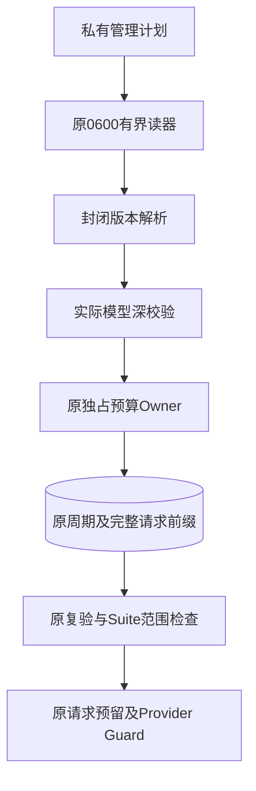
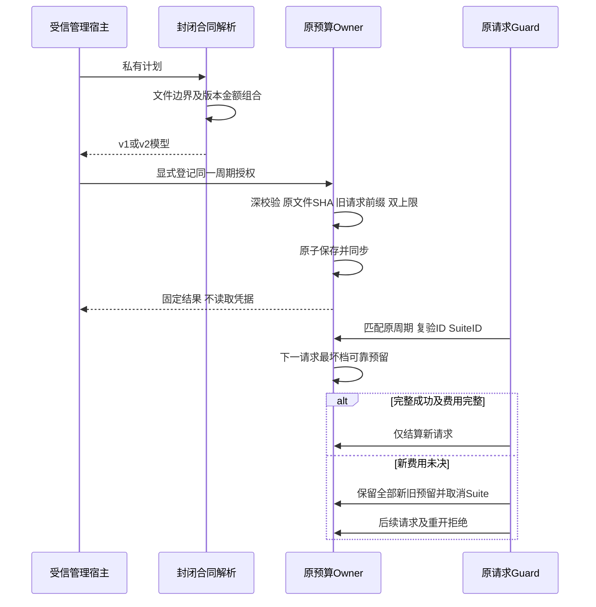
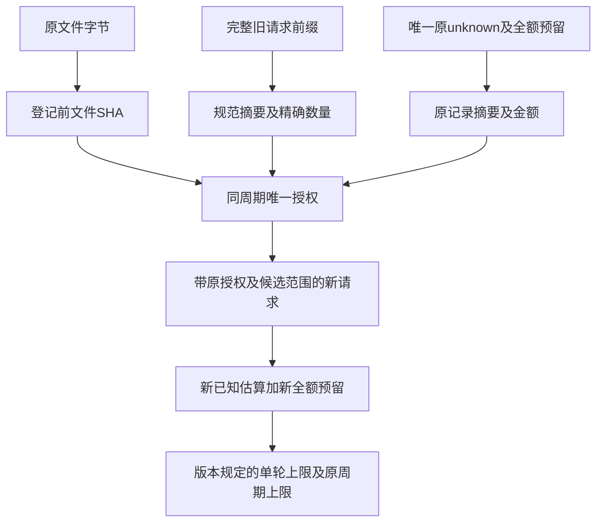

# R3 版本化复验预算合同总体与详细设计

## 1. 变更摘要

本切片提供封闭的私有管理合同 v2：在原 60 元周期内登记唯一的 38 元复验上限，
保留唯一旧未知请求的原预留及完整请求前缀。合同可用不表示授权已登记或真实请求已发出。
原 v1 的 70／40 组合、JSON 形状、字段顺序、Schema 与默认未决即停语义保持不变。
改变范围仅为验证宿主脚本；产品人民币计费、账户硬限额和公开 Agent 协议不受此合同影响。

## 2. 需求背景与源码研究

[原有界复验设计](m09-r3-bounded-reverification-budget.md)固定 `allocation="70"`、
`maximum_cost="40"`。当前验证周期额度为 60 元，旧合同不能表示该周期的有界复验。
将配置的 `fee_stop_amount` 改为 38 也不成立：它只在 Case 边界停止，不能替代每个请求的可靠预留。
原 [Owner](../../scripts/provider_verification_budget.py) 已提供独占、前缀验证、双上限和原子持久化，
故本切片复用这些机制，而不增加账本、预算周期或模型执行入口。

## 3. 设计目标、非目标与验收标准

目标是严格区分两种版本组合，在权限及费用检查之前拒绝版本／金额混搭；管理输入必须重新校验，
包括 `model_copy`、`model_construct` 和嵌套模型，不能通过序列化将错误 Python 类型洗成合法 JSON。
离线验收须覆盖 v1 兼容、v2 登记／重开／幂等、最小货币单位超限、错误范围、全部新增未决模式、
私有配置权限、链接、重复键以及旧绑定和候选链。

不修改实际账本，不产生实际预算授权，不访问凭据或网络，不修改 Task Pack、Grader、价格、
输出限制或请求最坏档预留。不把合同测试统计成真实编码 Trial 或 R3 质量改善。

## 4. 当前实现与根因

当前管理入口直接按单一 v1 模型解析。60 元周期填写 v1 的 70／40 会被原周期匹配拒绝；
填写 60／38 又会被 v1 Literal 拒绝。绑定及候选链只承接原授权，不能变更原上限。
根因是版本表达能力不足，不是预算算术、Docker、Provider 凭据或产品工具执行故障。

## 5. 总体架构与模块边界



读器仅负责文件边界和共用字段；共用模型为内部解析结构，不能直接登记。
版本解析只返回 v1 或 v2，管理 Owner 进一步重建实际模型。Owner、Guard 和 Suite 的职责不变。
`authority=budget-owner-explicit`是受信管理宿主的声明，不是签名或模型可兑换的执行凭证。

## 6. 正常、失败与恢复时序



解析失败发生在 Owner 进入前。登记成功仍不发送模型请求；正式运行入口先核对原范围与未决，
随后才读取短生命周期凭据。进程硬退出留下的新 reserved 仍阻止重开，不借 v2 自动续跑。

## 7. 接口设计与领域契约

| 接口 | 责任及边界 |
|---|---|
| `VerificationReverificationPlan` | 原 v1 公共类名及冻结 70／40 合同保留 |
| `VerificationReverificationPlanV2` | 新冻结 60／38 合同；不接受其他金额 |
| `VerificationReverificationPlanRecord` | 两种模型的封闭联合，不是任意额度配置 |
| `parse_reverification_plan(text)` | 严格 JSON、重复键拒绝、按版本判别并返回具体模型 |
| `read_reverification_plan(path)` | 复用原私有配置读器，64 KiB 上限，解析后才交付具体模型 |
| `snapshot_reverification_plan(value)` | 校验精确类、完整字段集、嵌套实际类型并严格重建 |
| `authorize_reverification(path, plan)` | 原登记入口；快照校验早于 Owner 和任何账本写入 |
| `reverification_plan` / `_validate` | 原账本读取及重开使用同一封闭解析，不静默改写历史 |

三个管理动作依然互斥：首次 `--plan`、一次 `--rebind-plan`、后继 `--append-binding-plan`。
不增加自动选版本、重置周期、忽略未知或读取凭据的管理选项。

## 8. 数据结构、重点字段与数据流程

| 字段 | v1 | v2 | 不变约束 |
|---|---|---|---|
| `spec_version` | `harnessix.provider-reverification-plan/v1` | `harnessix.provider-reverification-plan/v2` | 必须与对应金额完整配对 |
| `allocation` | 字符串 `70` | 字符串 `60` | 原 active 周期额度；不能加额 |
| `maximum_cost` | 字符串 `40` | 字符串 `38` | 该授权全部新估算及预留的累计上限 |
| `period_id` | UUID | UUID | 原周期身份，不得重建周期绕过占用 |
| `reverification_id` / `suite_id` | UUID | UUID | 唯一授权及新完整 Suite，必须显式匹配 |
| `ledger_before_sha256` | SHA-256 | SHA-256 | 登记前原文件字节；不同于规范请求摘要 |
| `prior_request_count` / `prior_requests_sha256` | 数量及 SHA | 数量及 SHA | 冻结完整旧前缀，不仅冻结未知金额 |
| `carried_requests` | 恰好一项 | 恰好一项 | 原未知 ID、原金额字符串、完整记录摘要均不变 |



金额采用原 18 位定点整数，不使用 float。版本、货币字符串及 UUID 不进行别名或类型强转。
新 v2 存储在原 `bounded_reverification` 字段，外层账本版本与既有绑定链结构不因计划 v2 自动升级。

## 9. 核心业务逻辑与持久化、事务、幂等

```text
parse: strict_json → version-discriminated v1|v2 → 完整对应金额
register:
  精确原模型类型及嵌套字段 → 严格快照
  独占原账本；已有完全相同计划则幂等返回，不同则拒绝
  原文件SHA、原前缀数量／摘要、唯一原unknown的记录／金额一致
  原已知 + 原全额预留 + 计划累计上限 <= 原周期额度
  沿原临时文件、fsync、replace、目录fsync登记；不发模型
reserve:
  匹配原周期／授权／当前Suite；原前缀不可变；新增未决则停止
  新已知 + 新预留 + 下一请求最坏档 <= 计划上限
  全周期已知 + 全周期预留 + 下一请求最坏档 <= 周期额度
  可靠保存reserved之后才允许Adapter发送
```

不新增数据库或发布器。账本仍为私有目录和普通文件，沿原锁、ACL、no-follow、身份稳定及同步发布。
旧完整授权不能被 v2 替换，绑定及候选追加承接原最大累计值，不创造第二份额度。

## 10. 失败、恢复、取消与超时

| 失败 | 正式行为 |
|---|---|
| 未知版本、金额混搭、数字金额、额外字段、重复键 | 固定登记错误，原账本零写，不读取凭据 |
| copy／construct／嵌套强转 | 登记前拒绝，不通过 JSON 洗类型 |
| 旧前缀、金额、原未知或原文件漂移 | 不登记、不修复原件 |
| 授权／Suite／周期不匹配 | 原范围拒绝，不能继承他人授权 |
| 超过38／60或40／70任一上限 | 下一请求不发送，原记录不因拒绝而改变 |
| 新 reserved／unknown | 同进程及重开停止，保留全部原预留 |
| 保存或目录同步失败 | 不发布成功，沿原未知结果与原件幂等确认边界 |

取消与期限继续由原 CancelToken、Adapter、Trial／Suite 预算及有界文件操作承担。
新合同不增加后台重试、独立超时续期、退款或真实费用推断。

## 11. 安全、权限、隐私及可观测性

管理入口只能由可信预算宿主在有效明确授权后调用。合同能力交付与实际权限授予分别审查，
禁止模型、Tool 或公开 API 自行登记。日志只输出有限 reason 与非敏感身份，
不输出原账本、配置、异常正文、凭据或模型输入输出。已知估算不是供应商账单，预留不是扣费。
默认未登记仍未决即停；新增未决不能借旧承接集合获得豁免。

## 12. 测试验证与源码映射

阅读顺序：
1. [封闭合同、解析与快照](../../scripts/provider_reverification_plan.py)：字段所有权及模型输入边界。
2. [登记 CLI](../../scripts/authorize_provider_reverification.py)：私有管理输入及固定输出。
3. [预算 Owner](../../scripts/provider_verification_budget.py)：登记、重开、双上限和可靠保存。
4. [原绑定](../../scripts/provider_reverification_binding.py)与[候选链](../../scripts/provider_reverification_chain.py)：同一累计额度传递。
5. [新离线回归](../../tests/evals/test_provider_reverification_v2.py)及[旧 v1 回归](../../tests/evals/test_provider_reverification.py)。

离线正控使用独立临时账本和 ObservedProvider；这是 Guard 持久顺序与错误语义测试，不是付费 API。
需保留首轮错误、最终终态原件、版本兼容摘要、结构化统计和 Review Packet；详见
[本切片交付报告](../validation/r3-budget-v2-runtime-lock-2026-10-08-v1/README.md)。

## 13. 部署、兼容、升级与回退

无新依赖、中间件、公开协议或 DDL。合同管理脚本仍限定 POSIX 私有验证宿主。
旧 v1 模型保留原 Schema 和序列化；旧仅支持 v1 的脚本读到 v2 必须拒绝，不能降写或删除授权。
登记后运行匹配当前脚本候选；源码 Suite 需独立干净 Git clone，不屏蔽主仓非忽略未跟踪文件。
源代码 Suite 和非 editable 安装态产品是不同证据，不能互相冒充。

## 14. 风险、取舍与发布边界

采用封闭 v2，而不是任意额度或放宽 v1，避免旧解释被静默改变。
共用字段类只用于受界读取，真正授权必须通过具体版本与深校验，避免复制读器或扩大生产通用接口。
预算足以登记某上限不保证完整20 Trial能执行完；每次最坏档预留和余额检查不能为凑成绩而缩减。
本切片不解除实际费用未知、不提高原0/20严格成功或1/20必需测试，不关闭 R3、R4 或商用发布门禁。
