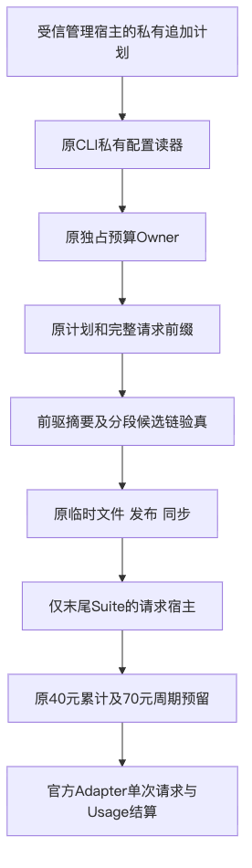
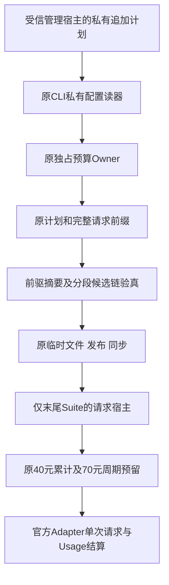
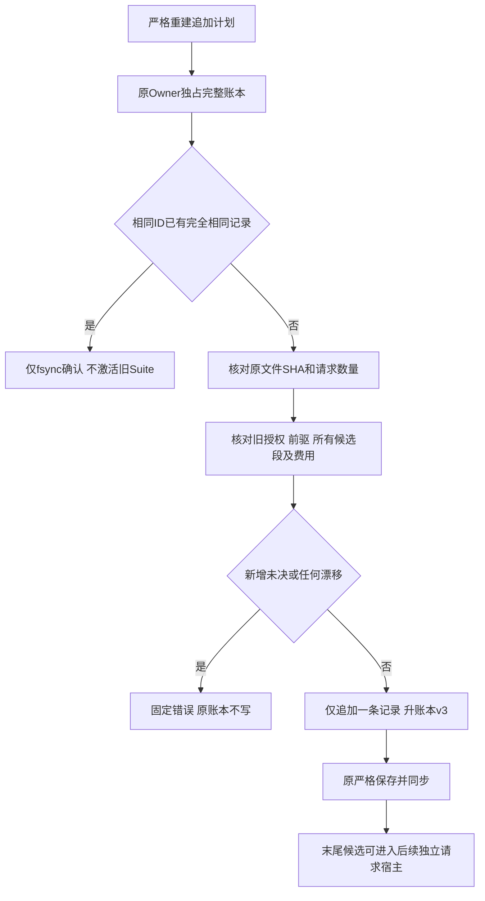
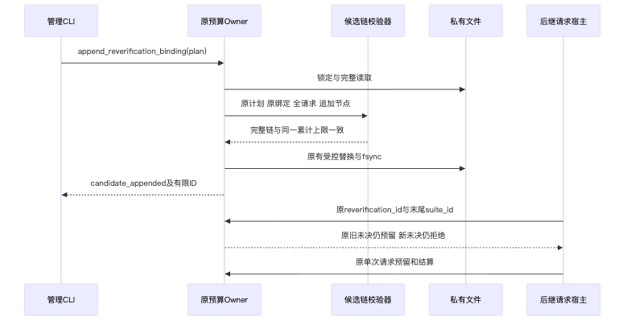
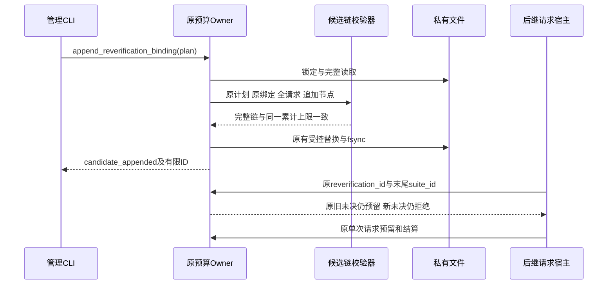
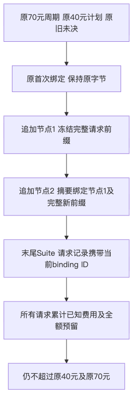
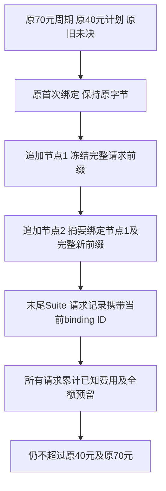

# R3 同一复验额度的不可变候选链总体与详细设计

## 1. 文档摘要与需求背景

原验证宿主账本v2允许一次显式Suite切换，切换记录不得替换。
完整真实任务失败后，后继修复必须使用新候选与新Suite，不能覆盖原结果或重放原Session。
单次管理合同因此不足以承载同一剩余费用范围内的后续完整复验；缺口不是新增预算额度。
本设计只扩展显式管理绑定，保持原70元周期、40元复验累计上限、20.77824元旧未决预留及原请求前缀。
本切片交付已验证的管理能力，不表示已登记实际账本、已发送模型请求或已改善真实编码质量。

## 2. 设计目标与非目标

目标是追加不可变候选、撤销旧候选请求资格、承接全部已用费用及预留，并在新增未决时立即停止。
既有v1授权和v1单次切换API不变；新管理入口默认不触发，只在明确提供追加计划时执行。
不新增周期、复验授权、模型重试、预算豁免、自动候选切换、通用计价或权限系统。
Task Pack、20 Trial、原评分和每个模型请求的单次预算保护均不变化。

## 3. 总体架构与模块边界





管理宿主只能追加管理记录，不执行Suite或读取模型凭据。
原Owner负责私有目录、ACL、锁、完整文件读取、有限大小和原子替换；新纯合同模块负责分段验真。
官方请求宿主仍先核对候选、执行绑定、价格和预算，最后才读取凭据。
原临时文件发布及目录fsync可能已产生效果；结果不确定时保留实际文件，幂等确认不重写原记录。

## 4. 核心流程与流程图




管理Owner注册时不采用默认未决即停入口，但纯合同只承接原授权冻结的旧未决集合。
请求前缀中任何新reserved或unknown均阻止追加；注册失败不退款、不补写费用、不替换原授权。
幂等确认历史记录只确认持久结果，不使其重新成为活动候选。

## 5. 时序图与持久化语义





注册与请求运行分别取得原Owner，不能在活跃Suite仍持锁时并发换绑。
保存不等待网络或模型；每次请求仍先持久预留，再发送，完整Usage才释放差额。
新增未决保留全部预留，当前Suite及重开均不得继续发送。

## 6. 类设计、接口设计与源码位置

| 类／接口 | 源码与职责 |
|---|---|
| `VerificationCandidateBinding` | [`provider_reverification_chain.py`](../../scripts/provider_reverification_chain.py)：冻结一次追加管理事实，不是新增Grant |
| `snapshot_candidate_binding` | 同上：实际模型类型、字段集合和原标量类型重建，拒绝伪造copy/construct内容 |
| `candidate_bindings` | 同上：完整有界读取追加列表，不回传可变原对象 |
| `validate_candidate_chain` | 同上：复用旧V1分段校验及原费用算法，验真完整候选历史 |
| `append_reverification_binding` | [`provider_verification_budget.py`](../../scripts/provider_verification_budget.py)：锁定原账本、幂等确认或追加一个节点 |
| `active_reverification_binding` | 同上：请求只取末尾节点，原`reverification_binding`仍返回未改写的首次切换 |
| `fingerprint` | [`provider_verification_guard.py`](../../scripts/provider_verification_guard.py)：实际活动绑定及完整链进入请求保护指纹；v1/v2指纹合同保持 |
| 管理CLI | [`authorize_provider_reverification.py`](../../scripts/authorize_provider_reverification.py)：新增互斥`--append-binding-plan`，无凭据或网络IO |

## 7. 数据结构、关键字段与数据流





新账本使用`harnessix.provider-verification-budget/v3`，原字段保留，增加
`reverification_binding_chain`列表。旧读器不认识v3必须拒绝，不能忽略新链后复活原Suite。

| 字段 | 类型／约束 | 解释 |
|---|---|---|
| `spec_version`／`authority` | 固定v2绑定版本／`budget-owner-explicit` | 追加管理用途，不是授权金额 |
| `binding_id`／`suite_id` | 原UUID实际类型，全链不重复 | 新候选独立身份，不能复用撤销的Suite |
| `reverification_id`／`period_id` | 原授权实际UUID | 引用唯一原Grant与原周期 |
| `previous_suite_id` | 与直接前驱完全相等 | 连续撤销和承接，不跨过历史候选 |
| `previous_binding_sha256` | 前驱完整模型规范摘要 | 第一个节点锚定原V1绑定，后续锚定直接前驱 |
| `sequence` | 原int，1～32连续 | 显式资源上限，拒绝遗漏、重排或额外节点 |
| `ledger_before_sha256` | 当前完整文件SHA | 只在管理发布时对原实际文件核对，不凭此自授权 |
| `original_plan_sha256` | 原完整Grant规范摘要 | 不替换原70/40或旧请求承接事实 |
| `prior_request_count`／`prior_requests_sha256` | 原int及完整前缀摘要 | 保留所有旧请求和费用事实，不能只挑当前Suite |
| `charged_cost`／`remaining_cost` | 18位定点金额字符串 | 全Grant累计已用及预留；两者之和必须仍为40 |

原账本1MiB及10000请求限额保持；链最多32个追加记录。
同一候选之后新增请求只能带该候选的binding ID和suite ID，直到下一个追加记录的前缀边界。
原首次绑定之前没有追加绑定标识；全部分段共同覆盖完整请求序列。

## 8. 核心业务逻辑伪代码

```text
append(candidate):
    strictly_snapshot(candidate)
    own_original_private_ledger_without_starting_requests()
    if exact_same_historical_node_already_exists:
        confirm_directory_sync_only()
        return_without_reactivating_history()
    require_current_file_SHA_and_complete_request_count()
    validate_original_V1_on_its_exact_segment()
    for each old_or_new_node_in_order:
        require_unique_ids_and_direct_predecessor_digest()
        require_complete_frozen_request_prefix()
        reject_any_new_unknown_or_reserved_in_prefix()
        require_charged_plus_remaining_equals_original_40()
        validate_all_requests_in_this_nodes_segment()
    append_one_node_only_and_publish_v3_with_original_save()

send_request():
    require_original_Grant_and_only_last_Suite()
    reject_new_unresolved_and_keep_old_hold()
    reserve_under_same_40_and_70_before_network()
    settle_only_with_original_complete_Usage()
```

## 9. 异常分类、取消、超时与恢复

非法管理输入、错误前驱、重复身份、旧请求漂移或金额不一致产生固定
`verification_reverification_invalid`，原文件不变。
原Owner冲突、私有文件不合格、费用不足及持久确认失败沿原固定错误返回，不输出路径或正文。
请求入口的新增未决产生`verification_budget_unresolved`，不请求模型或读取凭据。
管理保存是原有界同步文件操作，没有新增无限等待、网络重试或超时延长。
提交后fsync失败可能已发布，重开只读取实际完整文件并幂等确认；不回退到旧Suite或覆盖历史。

## 10. 安全与可观测性

模型不能提交追加管理计划；管理与模型工具目录没有连接。
私有POSIX验证宿主沿原ACL、无符号链接、物理身份与独占文件锁合同，不宣称账本可抵抗同用户任意篡改、
完整历史文件回滚或Python同进程恶意代码。预算管理文件不是硬件防回滚锚或模型执行权限。
默认未指定复验身份时仍被旧未决阻断，不增加`ignore_unknown`或自动管理员模式。
CLI只输出固定reason与有限binding ID，完整节点、金额原件和请求事实仍在私有账本。

## 11. 测试、部署与回退

新[候选链测试](../../tests/evals/test_provider_reverification_chain.py)使用真实临时私有Owner及原完整计划，
覆盖三候选承接、旧身份撤销、金额上限、原记录不变、每个字段漂移、严格标量、伪模型、
新增未决、保存失败幂等、Schema降级拒绝、默认Owner仍停止、保护指纹和有限CLI输出。
复用原授权、单次绑定、请求预算和实际请求宿主测试，不调用模型、Docker或实际预算文件。
通过的离线合同不作为R3真实成绩。

当前固定九项输入的关联组实际284通过、零失败／跳过，运行前后输入未漂移；
四项管理源码显式类型检查通过，五项变更源码／测试格式及静态检查通过。
初次未冻结输入的开发红态22失败、早期22通过及281关联通过分别保留，不替代最终固定输入组。
第一次类型检查因验证宿主分析已安装包和命名空间重复而拒绝；
后继明确本工作树源码及包基准后通过，不修改依赖、类型规则或产品断言。
完整输入及阶段结果见[验证资料](../validation/reverification-candidate-chain-2026-10-02-v1/README.md)。

新增入口仅用于受控研发验证宿主，无运行依赖或默认产品配置变更。
登记前应独立封存完整原文件和新私有管理计划，冻结候选执行配置；管理成功不代表Suite已经启动。
旧程序拒绝v3；不能删除链或将版本字面改回v2伪装回退。
原账本尚未实际登记本合同，后继模型请求仍需独立预检、登记和完整20 Trial验证。

## 12. 已知风险、取舍与验收边界

本合同不强制模型调用工具、不改变Task Pack或Grader，也不证明候选编码能力。
九项输入已经精确封存，独立审查77项补测与原43项共120通过，限定范围无P0/P1/P2。
尚须后继候选实际登记和原新完整复验；真实质量、Windows消费者、Git完整产品交付、
独立Beta和商用门禁均保持开放。

采用追加链而非覆盖单条活动绑定，代价是有界历史校验及显式v3升级；收益是旧事实和费用可完整复核。
采用原同步私有文件Owner而非新服务或新密钥体系，保持已有故障语义；不承诺跨主机并发或恶意整文件回滚检测。
32节点和1MiB文件上限属于验证宿主资源合同，达到上限必须停止管理发布，不能丢弃历史换取继续执行。
