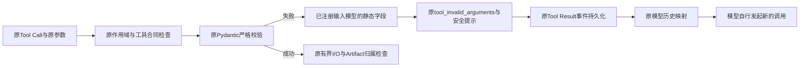
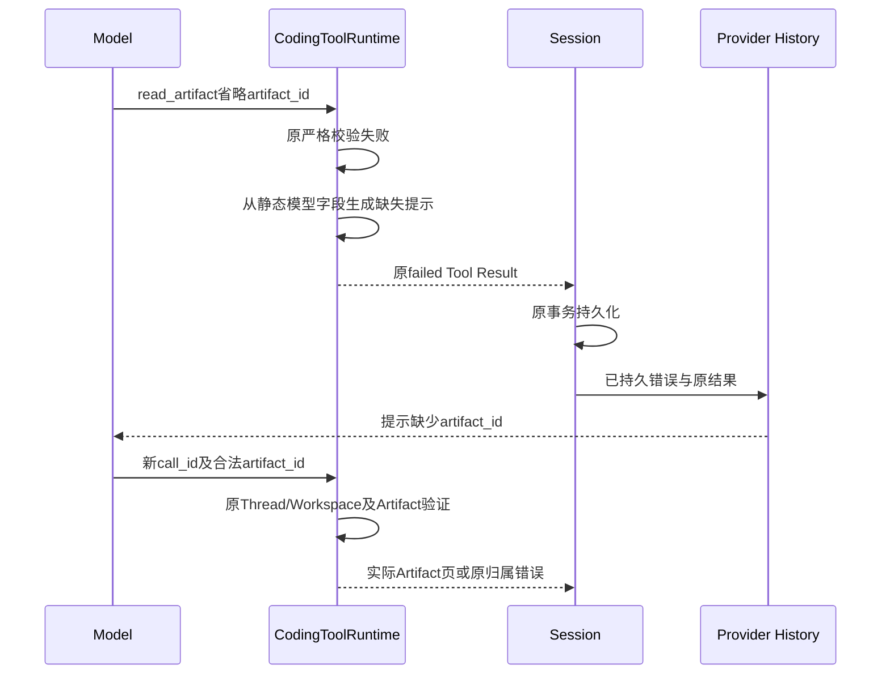
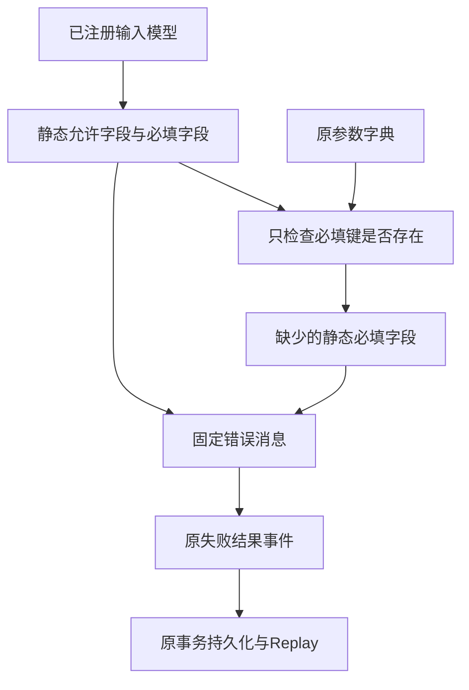

# 只读工具严格输入失败的安全字段反馈

## 1. 需求背景、源码研究与设计目标

固定`0813c58`的工程Suite在4 Case/8 Trial后中断。对9份原Session作只读事件解析和纯Reducer回放，
发现4次`read_artifact`调用均未提供正式必填字段`artifact_id`。运行时正确拒绝了调用，但只返回
“工具参数不符合契约”，不能告诉模型缺少哪个公开字段。该事实不等同于最后一次Provider输出失败的
原因；原响应正文未保存，具体解析失败原因仍未知。

源码核对排除了三项假设：产品与Eval共用`build_product_agent_context`，47次Context准备均包含
`harnessix.coding-instructions/v2`；Profile摘要已包含Artifact引用；Provider历史保留失败Tool Result
的`error`和`output`。Context记录证明宿主规划结果，不是供应商实际接收字节的独立证明。

目标：严格拒绝仍不变，只从已注册输入模型生成必填、缺失及允许字段提示，使下一次独立模型调用有
明确修正依据。非目标：自动补值、自动重试、修改Tool Alias/Prompt、放宽Schema/批准、增加Token预算、
改变Task Pack/Grader、推断未保存的Provider正文或将离线修正视为真实质量提高。

## 2. 总体架构、模块边界与选型取舍



- [CodingToolRuntime](../../src/harnessix/tools/runtime.py)拥有输入校验及预期错误映射。
- [ReadContract](../../src/harnessix/tools/contracts.py)、[搜索合同](../../src/harnessix/tools/search_contracts.py)、
  [Git合同](../../src/harnessix/tools/git_contracts.py)与[ReadArtifactInput](../../src/harnessix/artifacts/contracts.py)
  是字段来源；不增加第二份手写字段表。
- [AgentRuntime](../../src/harnessix/agent/runtime.py)与[SQLiteSessionStore](../../src/harnessix/session/sqlite.py)
  沿用事件提交和回放；[模型历史](../../src/harnessix/models/_history.py)沿用错误消息投影。
- 选择既有`AgentFailure.message`，不扩展公开Schema或数据库；静态反馈不改变执行计划、输入定义、
  Tool版本或批准Fingerprint。过去事件保留过去消息，新失败使用新消息。

不直接输出`ValidationError`或`.errors()`：它们可能含输入、异常文本、未知字段名及嵌套位置。
不新增通用工具注册框架或新跨模块依赖，仅在现有只读Runtime内复用一个私有纯函数。
本变更沿用[ADR 0050](../adr/0050-model-correctable-tool-validation.md)的可纠正失败、双Provider和
Fingerprint兼容决策，新增真实缺少Artifact字段证据后扩展一般消息；原专用分页分类不变。

## 3. 接口设计、数据结构与重点字段

| 元素 | 责任、来源与限制 |
|---|---|
| `_invalid_arguments(input_model, arguments)` | 私有纯函数；返回原code和安全消息，仅在严格校验失败后使用，不修改输入 |
| `input_model.model_fields` | 正式注册模型的静态字段；排序后形成允许字段列表 |
| `FieldInfo.is_required()` | 正式必填规则；不能把有默认值的字段误判为缺少 |
| `missing` | 必填静态字段且原字典中不存在；`null`或类型错误仍由校验器拒绝，不误称为缺失 |
| `tool_invalid_arguments` | 原固定code、`tool`类别、`retryable=false`和`outcome=failed`不变 |
| `AgentFailure.message` | 仅固定说明及正式字段名，遵守原2000字符限制 |
| `tool_expected_revision_required` | 保留文件/目录后续页专用反馈和优先级，不被一般提示覆盖 |

已注册模型字段总数有界；最长消息由全部正式字段构造，测试验证不超过2000字符。未知参数名、值、
路径、UUID内容、Token、异常正文、Pydantic错误位置和栈均不进入反馈。没有新增持久字段、表或迁移。

## 4. 核心流程、时序、数据流程与持久化



```text
输入校验失败后：
    allowed = 注册输入模型字段名排序
    required = allowed中正式必填字段
    missing = required中原arguments不存在的字段
    message = 固定说明 + required + missing + allowed + 查阅input_schema说明
    返回原tool_invalid_arguments
文件/目录满足原专用分页缺revision条件时：
    返回原tool_expected_revision_required，不使用一般反馈
```

数据流：静态模型→字段名；原参数→仅必填键存在性布尔；两者→原错误消息。
严格校验失败后不进入Workspace读取或Artifact查询。合法修正重新经过原作用域、审批和归属链，
绝不复用错误调用的执行事实。



消息生成不持久化新的分类实体；原错误在原事务中提交，重开时读取既有消息，不重新根据新版本分类。

## 5. 失败、取消、恢复、安全与可观测性

| 情况 | 正式语义 |
|---|---|
| 必填字段缺少 | 原拒绝；提示静态缺少字段，不推断值 |
| 字段为null、错误类型或超范围 | 原拒绝；缺失列表为空时仍提供正式字段及Schema修正说明 |
| 未声明字段含Secret或恶意名称 | 原拒绝；反馈不回显名称或值 |
| 专用后续页缺revision | 原专用code及原消息保持，不削弱版本绑定 |
| 已取消Token、工具合同漂移、Scope错配 | 仍先原检查，不发布“参数错误”掩盖受信故障 |
| 修正后Artifact属于其他Thread/Workspace | 原查询继续拒绝；反馈不扩大能力 |
| 失败事件已经提交后重开 | 原Replay重建同一错误，不重新执行失败工具 |
| Provider、时间、Token或CNY预算不足 | 原停止语义不变；无Runtime自动重试 |

反馈本身无I/O、线程、进程或取消窗口；执行生命周期由原Runtime负责。
可观测性复用原失败Tool Result及Context历史，无新增原始参数日志。
公开验证只保存白名单投影与原件摘要，模型正文、Prompt、私有路径和凭据不入库。

## 6. 验证方案、部署与验收边界

1. RED：真实Artifact读取缺少`artifact_id`，断言返回具体缺少字段；原实现必须失败。
2. 字段矩阵：文件、目录、搜索、Git、Artifact正式输入的必填与默认值；空值、错型、超限和未知字段
   仍失败，消息稳定、有界、不回显恶意字段/值；无效调用不进入I/O。
3. 两种正式Provider适配器（OpenAI Chat与Anthropic）使用MockTransport经过实际SDK帧解析→Kernel→
   文件搜索Artifact发布→失败反馈→模型新调用→实际Artifact读取→关闭资源→Session重开→纯Replay。
   该验证是离线正式链路，不调用真实模型，不证明泛化质量。
   新回归纳入Windows原生Git/工具焦点步骤；该CI结果必须绑定后继提交，不能继承`007839e`的通过事实。
4. 原分页、Scope、批准、Artifact归属、进程、Context和Provider回归；Schema、可读性与文档门禁。
5. 同步模块设计、路线图和完整专项交付包，保留旧Suite/RED及每轮FAIL；真实模型费用核对后才可用
   新冻结候选重新做完整20 Trial，不能跨Revision恢复或替换旧成绩。

无安装依赖或配置变更；随正常Python发行物部署。回退恢复原一般消息，不影响历史事件或Schema。
商用GO仍依赖真实质量、消费者三平台、安全/恢复、独立Beta及同候选发布门禁，不能由本专项替代。

## 7. 实际验证与交付

[完整验证交付](../validation/tool-argument-feedback-2026-09-30-v1/README.md)保留原Session低敏诊断、
固定原实现RED、最终源码关联测试、治理回归、实际Wheel、原生候选独立状态、Manifest与Review Packet。
6条双Provider离线SDK链实际读取Artifact并跨Session重开回放，不调用真实模型；真实质量改善仍未验证。
