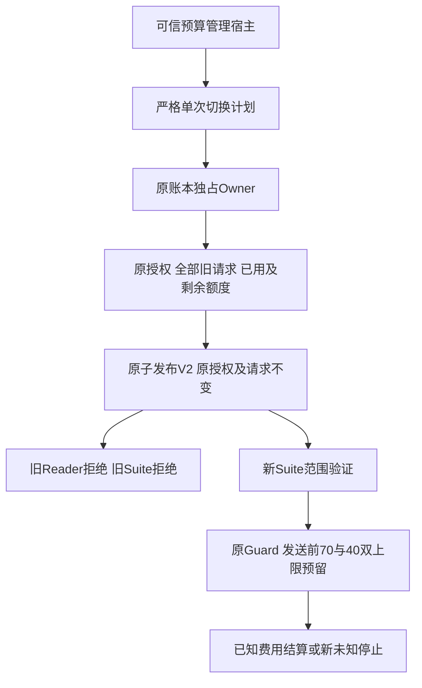
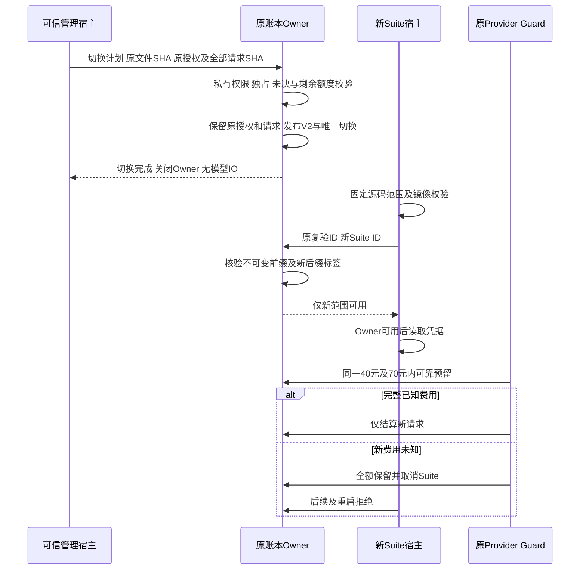
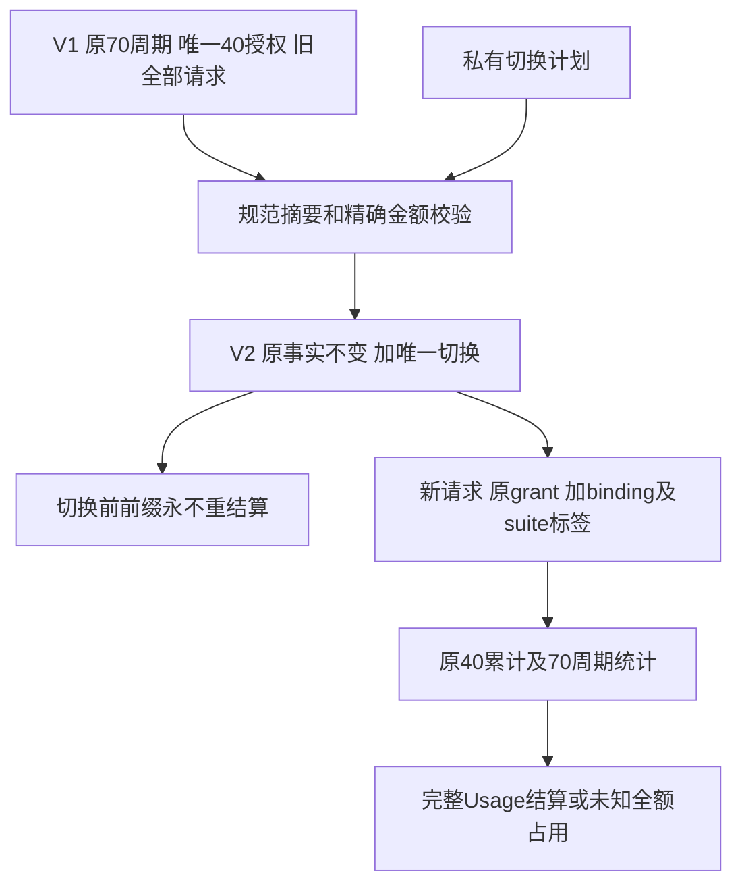

# R3 同一剩余额度的单次Suite切换总体与详细设计

## 1. 需求背景、源码研究与设计目标

[原单次有界复验](m09-r3-bounded-reverification-budget.md)将一个40元上限绑定唯一Suite，
原70元周期、一项旧unknown的全额预留及历史请求前缀保持不变。
后继评测实现修复后必须建立新Revision的新完整20 Trial，不能跨源码恢复或拼接旧成绩。
原`authorize_reverification`明确拒绝替换授权，原`require_available`只接受原Suite，
因此重建配置不等于能够开始付费复验。用新授权或清空已用费用解决身份变化会重复分配额度。

本设计只增加可信验证宿主的一次显式Suite切换，不是新增预算、自动续期、Agent工具或产品API。
原授权永久保留，切换前所有请求完整冻结，已用费用继续计入同一个40元上限。
示例：已用0.219136元，切换后只承接39.780864元；旧unknown仍保留20.77824元。
这些金额是费用估算及保守预留，不是供应商账单或已扣款。

设计目标：

1. 保持70/40双上限、原周期及复验ID，不生成第二轮40元额度。
2. 单次切换明确撤销旧Suite运行资格，只有新Suite可继续；默认入口仍拒绝旧未决。
3. 新unknown/reserved不能通过切换获豁免；切换后的新未决也立即停止后续请求与重启。
4. 私有格式明确升版，使旧Reader失败关闭，不因忽略新字段而误用旧Suite授权。
5. 沿用独占、私有文件校验及原子发布；管理入口不读取凭据、不调用模型。

非目标：账单对账、未知费用退款、一般授权平台、多次Suite切换、修改评分器或Task Pack、
自动登记、自动复验。实现可用不意味着实际账本已登记；真实执行仍需明确的预算规则及固定候选配置。

## 2. 总体架构、边界与流程图



只有管理入口能够登记。Reader支持未切换的V1及已切换的V2；V2必须有严格切换事实。
新Suite运行继续经过原`run_budgeted_suite → _require_scope → _require_images → Ledger`
再读取凭据，没有第二套Provider、锁或预算持久化器。
原授权的`suite_id`保留为历史来源；运行资格由单次切换的目标Suite决定，不能同时授权两个Suite。

| 模块 | 职责与源码 |
|---|---|
| 切换合同 | [`VerificationReverificationBinding`](../../scripts/provider_reverification_binding.py)，只负责字段及纯事实校验 |
| 原预算Owner | [`VerificationBudgetLedger`](../../scripts/provider_verification_budget.py)，独占、登记、范围拒绝及原子发布 |
| 管理入口 | [`main`](../../scripts/authorize_provider_reverification.py)，严格私有计划、有限结果，无网络IO |
| 请求Guard | [`BailianVerificationBounds.fingerprint`](../../scripts/provider_verification_guard.py)，完整切换事实绑定恢复身份 |
| 运行宿主 | [`run_budgeted_suite`](../../scripts/run_engineering_provider_suite_budgeted.py)，原顺序和凭据边界保持 |

## 3. 接口设计、领域契约、类与数据结构

`VerificationReverificationBinding`继承原`ContractModel`，冻结、strict、extra-forbid。
JSON合同版本为`harnessix.provider-reverification-binding/v1`；这与账本容器V2是不同版本域。

| 字段 | 类型 | 业务语义与校验 |
|---|---|---|
| `authority` | 固定字符串 | `budget-owner-explicit`，可信管理宿主已得到明确预算规则；不是公开兑换凭证 |
| `binding_id` | UUID | 单次切换身份；不能覆盖为第二个切换 |
| `reverification_id`、`period_id` | UUID | 必须与原授权一致，不创建周期或复验额度 |
| `previous_suite_id` | UUID | 必须等于原授权Suite |
| `suite_id` | UUID | 新唯一Suite，必须不同于原Suite |
| `ledger_before_sha256` | 64位SHA-256 | 管理登记前原文件字节摘要；用于拒绝漂移计划，不是永久账本摘要 |
| `original_plan_sha256` | 64位SHA-256 | 原授权完整规范JSON摘要，防止只凭授权ID承接不同合同 |
| `prior_request_count` | 1～10000整数 | 切换前完整请求数量，不只覆盖最初授权前缀 |
| `prior_requests_sha256` | 64位SHA-256 | 全部切换前请求的规范数组摘要，冻结原时间、状态、费用和元数据 |
| `charged_cost` | 18位定点金额字符串 | 原复验ID在切换前累计的已知估算；不能遗漏已完成请求 |
| `remaining_cost` | 同上 | 严格大于零，和已用之和恰为原40元；不是新增预算 |

`validate_reverification_binding(period, plan, binding)`依次检查：周期与原授权、Suite身份、原授权摘要、
完整前缀及原旧unknown集合、无新reserved、累计费用和剩余金额。其后缀每个请求都必须携带
`reverification_binding_id`与目标`suite_id`，且原授权校验仍要求原`reverification_id`。
后缀出现unknown可作为持久事实读取，但`require_available`禁止继续运行。

`VerificationBudgetLedger.rebind_reverification(path, binding)`使用原管理Owner进入，
仅允许首次登记或完全相同计划幂等确认；不同计划拒绝，第二个新Suite必须另行设计而不能自动切换。
`reserve`自动添加切换及Suite标签，调用方不能在`metadata`伪造这些字段。
`settle`保持原签名与已知/未知语义，不重新结算前缀。

## 4. 时序、核心业务逻辑与伪代码



图中管理登记与模型运行是两个独立调用，不因管理结果成功自动开启网络。
原Suite不是可恢复的目标；新配置的源码、固定Pack和预注册事实须独立冻结，不能继承旧Trial成绩。

```text
显式登记：
    严格验证切换合同，独占进入原账本，但不开放运行
    已有同一切换 → 核验整个持久事实并同步目录后幂等确认
    已有不同切换 → 拒绝，不改原件
    原授权存在，原文件SHA、完整前缀数量与摘要全部匹配
    只有原授权允许的旧unknown，切换前没有新reserved/unknown
    已用费用 = 原复验所有已完成请求的累计估算
    已用 + 剩余 = 原40，剩余 > 0
    原子发布schema V2及切换事实；原授权、请求和总额不改

新Suite运行：
    原复验ID + 目标Suite匹配；默认/旧Suite/其他Suite均拒绝
    全部切换前记录保持，切换后请求的三个身份标签匹配
    仍在同一个40元累计和70元总额内检查下一请求最大预留
    新reserved可靠持久后才发出请求
    新unknown保留全部预留，立即取消，重开仍拒绝
```

## 5. 数据流程、持久化与事务边界



统计仍使用原请求数组和18位定点整数，不新增数据库、金额实现或影子账本。
旧unknown不是新授权费用，但始终占用70元周期；旧复验已用费用同时占用70元和原40元。
切换事实只固定登记时的余额，之后动态可用余额由所有原复验请求重新累计，不修改绑定中的历史金额。

沿用0700根、0600账本、ACL/no-follow/硬链接检查、稳定根及锁身份、1 MiB上限、独占文件锁。
`_save`在原字节未变时写私有临时文件，文件fsync、原子replace、目录fsync后返回。
首次切换还核对原文件SHA及请求数组原样保持；后继发布禁止删除/修改切换、替换原授权或降级schema。
只读重开先验证V2事实，再决定调用范围；没有自动V1升级、退款或纠错。

## 6. 失败恢复、取消、超时与错误分类

| 场景 | 行为与恢复 |
|---|---|
| 原摘要、金额、周期、授权、Suite不匹配 | `verification_reverification_invalid`，不写账本、不读取凭据 |
| 新unknown或reserved存在 | 不登记切换，不修改状态或金额；旧例外不能豁免新的未决 |
| Owner已被其他进程持有 | `verification_budget_busy`，不抢锁、不启动第二个Provider |
| 文件fsync前失败 | 原V1保持，临时文件正常异常退出时清理，无模型IO |
| replace后目录fsync失败 | `verification_budget_persist_failed`；可能已发布V2，禁止回写V1；重开核验后相同计划幂等确认 |
| 硬退出或结果丢失 | 同一计划显式重开，核验原件；不生成第二个切换，不发模型请求作为确认 |
| 幂等确认目录fsync失败 | 返回持久化错误，不以读取到V2冒充已可靠确认 |
| 切换后请求产生新unknown | 原Guard取消Suite，后续与重启都拒绝；新旧预留不释放 |
| 未知合同、V2缺绑定、V1附绑定或标签伪造 | 失败关闭，不降级读取或自动修复 |
| 40元或70元余量不足 | 原请求保护在发送前拒绝，不能把每个新Suite重新当成40元 |

管理操作没有后台任务、Provider、自动重试或新的独立超时；同步文件IO保持原有有界文件规模及非阻塞独占。
取消和IO期限由原Suite/Trial、CancelToken和官方Adapter承担，新绑定不改变这些合同。
公开管理结果仅有限`reason`及UUID；底层异常、私有路径、账本和模型正文不输出。

## 7. 安全、部署、兼容与取舍

管理入口复用原脚本互斥选项，原`--plan`保持，新`--rebind-plan`不接收Key值：

```bash
python -m scripts.authorize_provider_reverification \
  --rebind-plan /private/verification/rebinding.json \
  --budget-ledger /private/verification/budget.json
```

计划须由可信宿主根据明确预算规则创建，0600文件和私有父目录校验保持。
合同的`authority`只是声明，不是自身证明；程序没有认证预算所有者的公网授权系统。
不变性由可信Owner和未被同UID任意重写的私有文件边界保证；本账本没有外部不可回滚锚点，
不能声称识别恶意恢复整个旧V1原件。禁止降级指Owner发布合同，不等于提供账户级防篡改服务。
运行仍使用原`--reverification-id`及目标Suite配置，并经网络显式开关。
凭据仍在Owner可用之后读取；切换登记本身读取凭据和模型请求次数为零。

旧Reader只接受V1，遇到V2明确拒绝，不能继续原Suite；新Reader可以读取未切换V1，原恢复指纹不变。
V2恢复指纹额外绑定完整切换合同；不能将旧Suite状态改名恢复为新Suite。
schema不能自动回退；若部署旧验证宿主，其拒绝是设计行为，不通过删字段或改版本字符串解决。
产品Wheel、公共协议、数据库和用户数据没有迁移。

采用唯一切换而非授权列表，避免多次转移与继承规则；采用V2而非V1可选字段，避免旧Reader忽略撤销。
这一有限取舍不提供无限次数换候选，也不改变任何商用质量门槛。

## 8. 测试、源码追踪、验收及开放风险

[`单次切换专项`](../../tests/evals/test_provider_reverification_rebinding.py)复用原私有临时账本和请求Guard，
验证全前缀保留、已用费用承接、精确上限、旧范围撤销、旧Reader拒绝、未知停止、同步故障及管理脱敏。
[`原授权回归`](../../tests/evals/test_provider_reverification.py)、
[`原请求预算`](../../tests/evals/test_provider_verification_budget.py)及
[`宿主接线`](../../tests/evals/test_provider_verification_host.py)验证未切换V1和凭据前拒绝保持。
所有账本写入使用独立TempFS，测试模型为原离线Provider/MockTransport，不操作生产私有账本。

验收证据须分别标明源码、旧Reader字节、预留与费用、故障注入、发行物范围和模型请求数。
实际账本未登记、完整20 Trial未运行时不能标记R3通过。
新完整Suite仍必须至少12/20严格成功、每仓成功且零越界，消费者平台、独立Beta及R1～R6继续开放。
