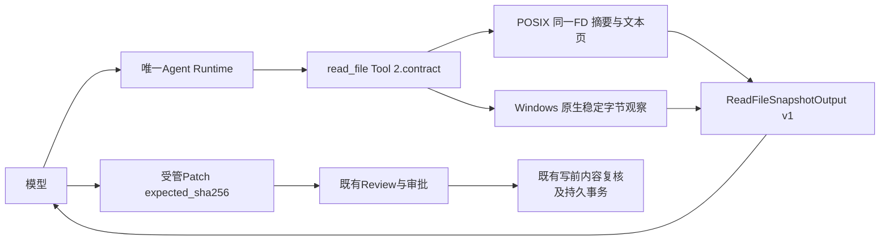
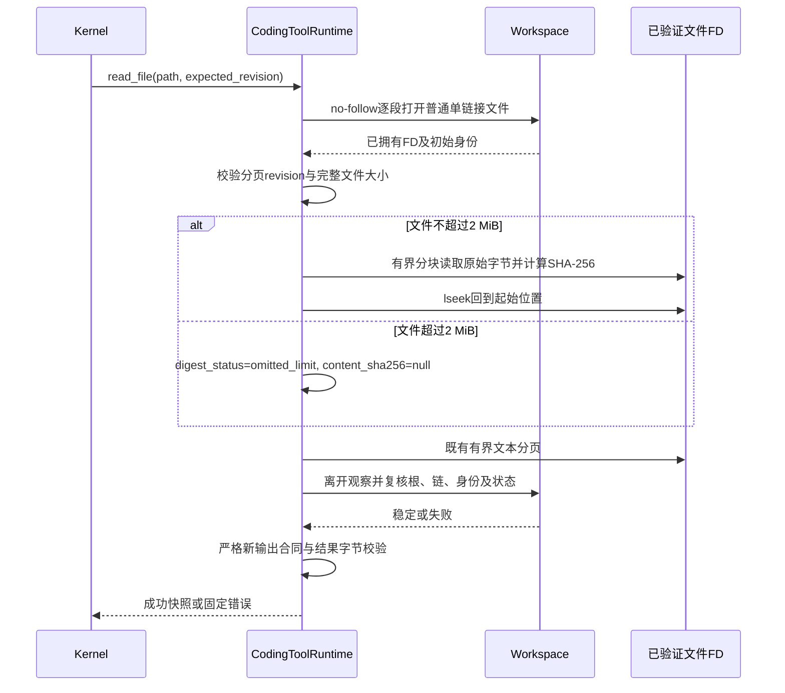
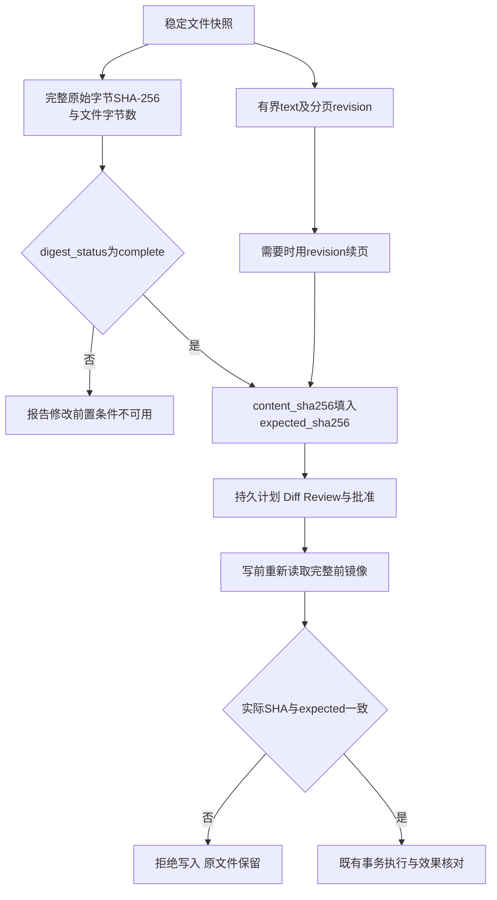

# R3：模型可达的可信文件快照与受管修改前置条件

## 1. 需求背景与源码研究

默认Coding Agent的`read_file`此前只返回文本页、行范围和分页`revision`。
[`WorkspacePatchFile.expected_sha256`](../../src/harnessix/delivery/trusted_action_contracts.py)
却要求完整原始文件字节的SHA-256。分页revision包含Workspace、路径及对象观察身份，不等于内容摘要；
可见文本页也不一定包含整个文件。模型不能仅通过原目录取得合法的替换/删除前置条件。

该问题独立于模型质量、Prompt策略及历史[0/20结果](../validation/provider-engineering-2026-09-20-v1/README.md)。
整改前新增的默认Runtime测试有6项因缺少快照字段失败；旧库级读取合同测试通过。
因此本切片解决确定的产品接口缺口，不宣称已解释历史全部失败。

沿用[Patch源码研究](../research/patch-runtime.md)的条件写原则。此次复核本地OpenCode固定基线
`69c172e8a7c0086887b1f93ed5a162f14b6aa0c5`的
[FileMutation.writeIfUnchanged](https://github.com/anomalyco/opencode/blob/69c172e8a7c0086887b1f93ed5a162f14b6aa0c5/packages/core/src/file-mutation.ts)：
其在进程内目标锁中重读完整字节、比对expected再写入。这里借鉴“完整前镜像复核”，不复制源码，
也不将其进程内锁解释为对不协作编辑器的内核CAS。本项目继续使用既有审批、Workspace租约、
持久事务及写前重新观察，不通过增加摘要削弱这些边界。

## 2. 设计目标、范围与取舍

1. 默认模型目录仍使用`read_file`名称，不另造`hash_file`工具；摘要与文本页来自同一稳定观察。
2. 提供独立版本化`ReadFileSnapshotOutput`，旧`ReadFileOutput`和两个平台的库级`read_file`保持原合同。
3. SHA-256计算原始完整字节，保留BOM、CRLF、末行及空文件语义；不计算重编码文本或可见片段摘要。
4. 完整摘要最多扫描2 MiB；正文仍最多24 KiB，分页、4 KiB行上限及5秒协作读取Deadline不变。
5. POSIX大文件仍可读取有界前页，但明确返回`omitted_limit`与空摘要；Windows现有完整观察上限
   保持不变，超2 MiB仍返回`tool_limit_exceeded`，不偷偷改成普通文件路径读取。
6. 文件变化、权限拒绝、取消及超时不能发布部分成功摘要；旧Tool指纹不得在新目录中继续执行。
7. 正式产品与Task Pack使用同一Runtime；不改Task Pack、评分器、阈值或审批策略。

非目标：扩大文件上限、处理任意二进制编辑、提供永久文件锁、开放Shell、补齐Windows写入后端、
自动放行审批或声明真实工程评测已通过。Windows正式核心编码链仍属于R4。

## 3. 总体架构与模块边界



| 源码位置 | 职责 | 不负责 |
|---|---|---|
| [`contracts.py`](../../src/harnessix/tools/contracts.py) | 新快照输出及跨字段校验 | 文件读取或写权限 |
| [`files.py`](../../src/harnessix/tools/files.py) | POSIX单FD快照、完整摘要与复用文本分页 | 第二套Workspace实现 |
| [`windows_file_read.py`](../../src/harnessix/tools/windows_file_read.py) | 原生观察字节上的文本页和完整摘要 | 普通Path回退或Windows写入 |
| [`windows_read.py`](../../src/harnessix/tools/windows_read.py) | 原生门面接入新快照；保留旧库级read_file | 自建Handle所有权协议 |
| [`runtime.py`](../../src/harnessix/tools/runtime.py) | Tool 2.x、合同指纹、结果验证及有界执行 | 数据库迁移或审批豁免 |
| [`agent_context.py`](../../src/harnessix/product_config/agent_context.py) | 编码指令明确选择完整摘要字段 | 授权或替模型补算摘要 |
| [`trusted_action.py`](../../src/harnessix/delivery/trusted_action.py) | 既有Patch准备、Review、授权及写前复核 | 信任模型自称内容未变 |

## 4. 领域契约、数据结构与接口设计

新合同`harnessix.read-file-snapshot/v1`继承既有分页字段，但作为独立公开Schema发行。
输入仍为`ReadFileInput`，保持第一页与后续页的严格参数校验。

| 字段 | 类型 | 来源和精确语义 |
|---|---|---|
| `spec_version` | 固定字符串 | `harnessix.read-file-snapshot/v1` |
| `text`、`utf8_bytes` | 原分页字段 | 仅可见文本页及其原UTF-8字节数；不代表整个文件 |
| `revision` | 64位hex | 平台原有对象观察算法；用于`expected_revision`续页，不用于Patch |
| `file_bytes` | 严格非负整数 | 同一观察的完整文件原始字节长度；与可见正文长度不同 |
| `digest_status` | `complete/omitted_limit` | 完整摘要已计算，或POSIX完整文件超过2 MiB未计算 |
| `content_sha256` | 64位hex或null | 完整原始字节SHA-256；只有`complete`时非空 |
| `truncated`、`next_line` | 原分页字段 | 仅表示文本页是否仍有后续，不决定摘要是否完整 |

跨字段不变量：

- `complete`当且仅当摘要非空；该状态要求`file_bytes <= MAX_SCAN_BYTES`。
- `omitted_limit`要求摘要为空且`file_bytes > MAX_SCAN_BYTES`；错误后不能伪装为该状态。
- 可见正文`utf8_bytes`不能大于`file_bytes`；继承的行范围、字节数和续页不变量仍成立。
- `truncated=true`与`digest_status=complete`可以同时成立；摘要完整不表示模型读到了全文件。

接口分工：`read_file`库级方法返回旧`ReadFileOutput`；新增`read_file_snapshot`返回新合同。
默认Runtime只将后者暴露给模型。`WindowsReadRuntime.execute`选择快照方法，Context继续直接调用
旧库级`read_file`，避免为项目指令读取引入额外全文件扫描或改变既有Context预算。

## 5. 核心流程、时序与数据流

### 5.1 POSIX同一FD的观察



只保留一个文件FD；摘要和分页共用该FD。完整摘要按64 KiB分块处理，不复制整个文件到内存。
摘要阶段与文本分页阶段各有原2 MiB扫描上限，不把两次读取误称为总共只读取2 MiB；
两阶段共享同一个5秒协作Deadline。大文件省略摘要时不执行这一额外全文件扫描。
摘要读取发现实际字节数不同于初始大小时失败；退出Workspace时继续使用既有ctime、mtime、大小、
对象身份、路径链及根身份复核。计算后文件发生变化的结果不发布。
该流程不提供全树原子快照，也不防御具有同等权限的恶意宿主；写入必须独立重验前镜像。

### 5.2 Windows稳定原始字节

Windows复用`WindowsReadPort.observe`的完整Handle观察：禁止链接/Reparse逃逸、限制2 MiB、
按已有规则复核Handle观察。文本页和摘要都由这一份不可变`bytes`计算，不再次按路径读取。
原`file_revision`算法不变；额外完整摘要不混入分页算法。观察字节数与声明大小不一致时拒绝输出。
摘要计算前后检查取消/Deadline；Handle资源仍由原生Root统一回收。

### 5.3 摘要至修改的数据流



分页revision证明的是续页观察一致；完整摘要是条件写前置数据，两者均不是权限。
读取返回后外部编辑器修改文件是正常竞态，既有Patch执行端必须拒绝旧前镜像。
模型仍应读完相关范围、生成准确变更、审查Diff并执行最终固定检查；摘要不能替代内容理解或测试。

### 5.4 持久化、事务与重启数据流程

| 事实 | 既有持久位置 | 本切片变化 |
|---|---|---|
| 成功读取与新快照字段 | Session的`ToolResultContent.output`及Item事件 | 既有JSON结果保存真实新字段；不新增表或回填历史 |
| 模型可见读取结果 | 已有Tool Result View决定及Model History Inspection | 默认64 KiB Inline上限内保留完整快照元数据；不按字符串前缀裁掉摘要 |
| Patch前置SHA与提案 | 既有Execution Plan及Workspace事务准备 | 模型从读取事实取值，规划端仍重验实际完整前镜像 |
| Review与审批决定 | 既有完整Diff Artifact、Action Audit和Session审批投影 | 不复用旧Tool指纹或游离批准，不改变跨Store提交顺序 |
| 写入与恢复 | 既有Workspace Transaction及Action效果核对 | 新摘要不触发自动Execute或UNKNOWN重放 |

默认读取结果仍受60,000字节输出上限保护，低于既有默认64 KiB模型Inline预算；纯读取页不新建结果Artifact。
宿主自定义更小模型视图预算时仍沿用现有失败关闭规则，不做不受支持的部分JSON裁剪。
重启读取历史保留原事实；新Turn从新Tool目录读取，旧未完成调用不能被补造新SHA或重绑定成新成功结果。

## 6. 核心业务逻辑伪代码

```text
read_file_snapshot(workspace, args, operation):
    用已授权Workspace打开单一文件FD
    初始状态 = fstat(FD)
    revision = 既有观察算法(Workspace, path, 初始状态)
    校验args.expected_revision
    if 初始大小 <= 2 MiB:
        分块读取FD；每块检查取消和Deadline
        读到EOF时长度必须等于初始大小
        content_sha256 = SHA256(全部原始字节)
        将同一FD偏移恢复至0
    else:
        content_sha256 = null
    page = 既有文本分页算法(FD, args, revision)
    快照 = 严格新输出(page, 初始大小, 摘要完整状态)
    退出Workspace观察并复核身份/状态；失败不得返回快照
    return 快照

propose_replacement(snapshot, new_content):
    要求snapshot.digest_status为complete
    不从text或revision推导摘要
    提交expected_sha256=snapshot.content_sha256及新内容
    等待既有审查批准；执行端再次校验完整前镜像
```

## 7. 失败、恢复、安全和可观测性

| 场景 | 行为及恢复 |
|---|---|
| 摘要扫描中内容增长、缩小、修改或对象被替换 | 固定`tool_workspace_changed`，不发布摘要；重新读取后才能再提案 |
| 后续页沿用失效revision | `tool_page_changed`；从首页重读，不拼接不同文件版本 |
| 取消、读取Deadline | 回收读取线程/FD/Handle后结束；不能留下计算任务并提前发布取消 |
| POSIX大文件 | 返回有界页与`omitted_limit`，不假装有完整摘要、不抬高资源上限 |
| Windows大文件 | 保持既有`tool_limit_exceeded`；不自动回退普通Path |
| 非法UTF-8、二进制或超长行 | 既有分页错误；摘要存在也不能把读取失败改为成功 |
| 输出字段不一致或伪造输出模型 | Kernel `tool_output_invalid`，不当作正常模型失败 |
| 旧Tool版本/指纹 | `tool_contract_changed`；历史调用不得重绑定成新成功事实 |
| 读取后、批准前文件变化 | 既有Patch前镜像复核拒绝；保持实际当前文件，不以旧读取覆盖 |

默认产品的批准后前镜像漂移目前沿用保守失败语义：Router未Claim或执行写入，实际文件保留；
Agent因非只读调用未取得可投影终态而进入`interrupted/uncertain_effect`，不会继续调用模型或自动重放。
这不是Patch成功或确定Router失败状态。本切片不修改既有跨Store恢复合同；后续R1恢复及支持说明
仍须覆盖该场景。测试按既有领域合同断言此状态，而不是将其改写为正常完成。

新字段进入既有成功Tool Result及其模型视图，不新增公开原始文件日志、凭据采集或数据库。
错误使用既有固定代码；不能输出底层路径和异常正文。恢复读取仍是只读操作；写入是否重放由已有
持久Action/Delivery状态决定，不因新摘要自动重试。纯SHA计算不增加模型请求或API费用。

## 8. 兼容、部署与迁移

- 新发行`read-file-snapshot-output-v1.schema.json`；既有输入/输出v1 Schema逐字保持。
- 默认`read_file`变为`2.<contract_sha256>`，输出Schema、算法边界和资源配置进入现有合同摘要。
  其他只读工具保持原版本算法；旧库级接口继续可用，不提供危险的强制旧版本执行开关。
- Agent Event/Thread版本和Session Migration不变；旧结果仍作为历史原事实保存，不回填新摘要。
- 新运行读取新目录；受管Patch输入/审批合同不变。跨重启未完成旧调用遵循既有失败/恢复语义。
- 原生Windows读快照接线不等于原生Windows写入已完成；三平台发行仍由R4独立验收。

## 9. 测试用例、验收与源码映射

| 范围 | 测试入口与要求 |
|---|---|
| 默认模型可见完整摘要 | [`test_file_snapshot.py`](../../tests/tools/test_file_snapshot.py)：空文件、Unicode、BOM、CRLF、末行、截断页、完整摘要与revision不同 |
| 有界性、竞态和兼容 | 同文件：恰好/超过2 MiB、扫描时变化、摘要与分页间变化、旧库级字段不变、新合同反例 |
| 线程和输出安全 | [`test_runtime.py`](../../tests/tools/test_runtime.py)：任务/Token取消排空、并发、关闭及输出合同错误 |
| Windows端口 | [`test_windows_read_adapter.py`](../../tests/tools/test_windows_read_adapter.py)与[`test_windows_native_runtime.py`](../../tests/tools/test_windows_native_runtime.py)：替身和真实宿主证据分开 |
| 产品真实组合根 | [`test_server_and_cli.py`](../../tests/product_config/test_server_and_cli.py)：Provider仅从历史读取结果取得摘要，SDK审查批准后修改；不得预埋文件SHA答案 |
| Provider线协议 | [`test_paging_feedback.py`](../../tests/tools/test_paging_feedback.py)：OpenAI和Anthropic实际Adapter的模型可见结果保留完整摘要，不从文本片段推导 |
| 既有Patch安全 | [`test_trusted_action_patch.py`](../../tests/delivery/test_trusted_action_patch.py)：前镜像变化、拒绝、取消和恢复回归 |

验证顺序：红测试复现 → 新合同与端口 → 默认产品SDK审批闭环 → 受影响回归 → 全源码类型检查、
旧Schema不变及文档治理 → 固定干净Revision独立复验。随后才能运行实际Provider完整质量Suite。
离线Provider只证明工具链与装配，不证明真实模型会正确编码；所有R1～R6退出条件仍以
[发布清单](m09-to-v1-release-scope-convergence.md)为准。

[统一验证目录](../validation/trusted-file-snapshot-2026-09-28-v1/README.md)保存合同事实、Review Packet、
Manifest及实际图示/回归原件摘录。快照源码固定为`812ae7c`；后继`8340ff1`仅修复独立回归识别的
POSIX密钥目录观察缺口。原Python 3.12批次FAIL和确定性复现均保留，后继PASS不覆盖原结果。

## 10. 风险与开放工作

1. 全文件摘要增加至多2 MiB顺序读取；协作Deadline不等于可强制中断的内核I/O硬时限。
2. POSIX两次读取的稳定性依赖已支持本地文件系统及观察状态；不能承诺管理员攻击或不稳定网络挂载。
3. 内容摘要不是完整权限令牌，也不证明模型已读完全部文本；模型行为质量仍由固定评测验证。
4. Windows写入、完整产品备份、许可证处置、正式三平台安装及独立Beta均不由本切片关闭。
5. 冻结Container镜像可用性和真实任务完整Suite仍须单独解决，不能用Fake Provider结果替代。
