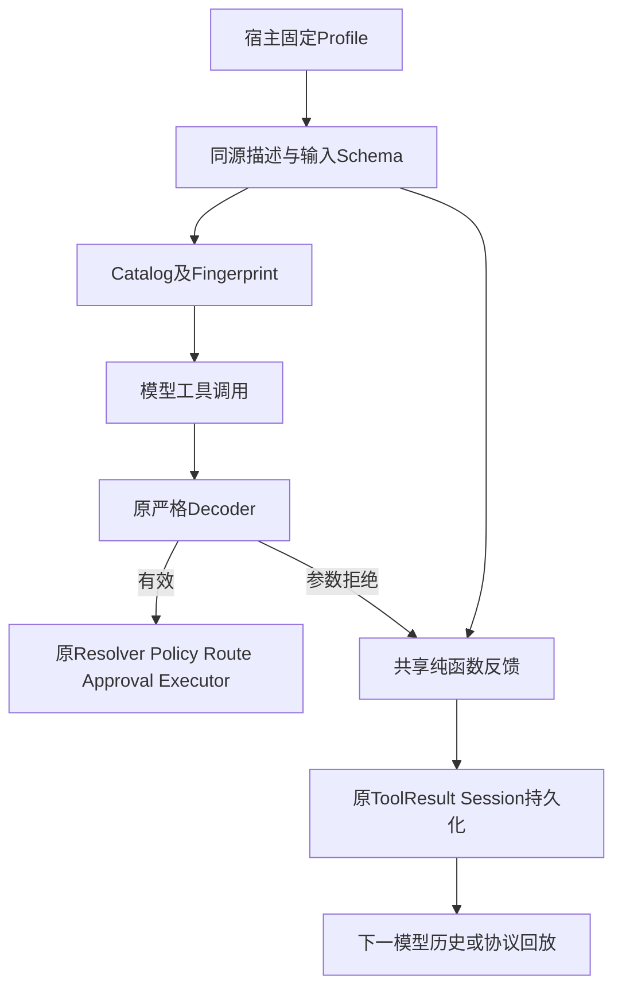
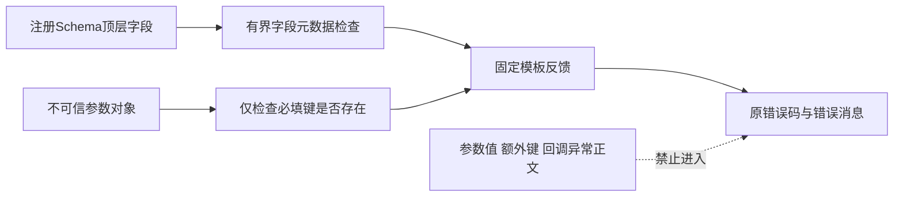
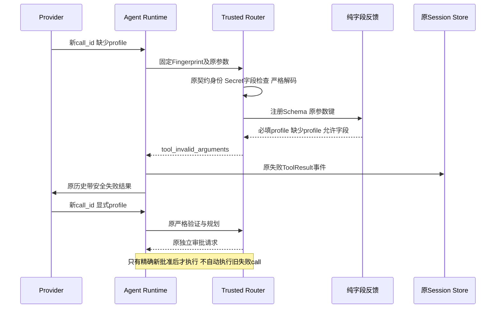

# R3 固定Profile契约说明与安全输入反馈设计

## 1. 需求背景、源码研究与设计目标

[原有界真实复验](../validation/bounded-provider-suite-interruption-2026-09-30-v1/README.md)
记录9次模型请求；首个Trial的8次固定Profile调用均缺少必填`profile`。未产生真实测试结果，
没有完整Trial报告，不能解释为代码质量通过。原广告Schema已包含`required: [profile]`及固定值，
但描述只强调选择器，严格Decoder失败后只公开通用消息。模型连续重复错误直到原Token限制中断。

源码链：`process_profile_descriptor → run_profile_schema → Catalog → Provider`；
`AgentRuntime → Gateway → TrustedActionRouter.plan → _normalize_invocation → decode_run_profile`。
普通只读工具已有字段反馈，Trusted Action没有复用。目标是提供可操作而不泄漏的契约事实，
不是预测下一次真实模型一定修正，也不是替代严格验证或编排器。

目标：说明固定`profile`必须显式传入；广告选择器策略与Decoder一致；参数拒绝只公开
注册Schema的字段名、必填字段及缺失事实；共享唯一反馈实现；失败发生在Resolver、Policy、
执行计划、审批及Executor之前。非目标：自动填充Profile、修正参数、重试副作用、放宽评分、
增加Token、改写历史中断、改变预算或新增产品模式。

## 2. 总体架构、流程图与数据流程





反馈函数归属`tools`的纯合同辅助，不持有Runtime、Router、Store、Provider、文件或凭据。
`trusted_actions`依赖该窄辅助，不依赖CodingToolRuntime的执行对象。普通工具保留原错误码、
字段排序及分页提示；Trusted Action保留原Callback错误分类。

## 3. 接口设计、类设计与数据结构

| 接口/字段 | 当前职责及变更约束 |
|---|---|
| `invalid_argument_message(schema, arguments, trusted_action=False)` | 返回单一有界消息；只使用Schema及键存在性；不执行Schema验证、不返回调用参数 |
| `schema.type / properties / required` | 仅支持可直接解释的顶层object；Schema组合或引用降级为通用安全反馈，不猜测必填字段 |
| `properties`字段名 | 最多64项、单项最多64个ASCII标识符字符；空字段合法；不公开Schema描述、枚举或默认值 |
| `required` | 必须是无重复且属于properties的字符串数组；不一致则降级，不误报“无必填” |
| `arguments` | 已有规范JSON对象；不遍历值、不输出额外键；存在但类型错误不标为缺失 |
| 返回消息 | 最多2000字符；超限返回通用模板；不截断后冒充完整允许列表 |
| `run_profile_schema` | 仍要求固定Profile、禁止额外字段；按实际selector_policy广告maxItems32或0 |
| `process_profile_descriptor` | 明确字段`profile`及固定值、工具名不能替代字段、选择器可省略；仍高风险、有审批、非幂等写 |
| `RunProfileInput / decode_run_profile` | 严格、冻结、extra-forbid；完整原验证逻辑不变，不自动补参数 |
| `TrustedActionDefinition` | 反馈优先使用已注册显式Schema；否则使用原Pydantic Schema，不能用通用输入模型替代固定Schema |

所有Profile和Tool绑定摘要继续由原算法生成。描述/Schema变化必然使Fingerprint变化，
旧工具调用必须拒绝；不得为复用旧审批保持伪旧摘要。

## 4. 时序图与核心业务伪代码



```text
字段反馈:
  若不是可直接解释的object或存在组合/引用 → 通用模板
  检查properties、required的形状、数量、名称及集合关系
  排序允许字段及必填字段
  缺少字段 = 必填字段中不在原参数键集合的字段
  固定模板拼接；超过消息上限 → 通用模板
Trusted规范化:
  原工具Version/Fingerprint检查及敏感字段拒绝保持优先
  执行原Decoder及原规范JSON转储
  ValidationError/ValueError/TypeError → 共享字段反馈的原参数错误
  其他回调异常 → 原sanitize_plan_exception，不公开异常正文
```

## 5. 持久化、事务、失败恢复、取消与超时

不新增持久化、迁移、锁或IO。消息沿原ToolResult事件写入Session、下一Provider历史、SDK及回放；
失败调用不产生Action Route、Execution Plan、Approval或进程事实。重复恢复不能重复执行。
有效修正使用新call_id和原完整批准链，不把旧失败调用转换为已执行。

取消、超时、步骤和Token上限保持Agent原行为；本函数有界同步计算，不延长执行期限。
已有`UNKNOWN`和历史中断仍仅按原Reconcile恢复，不能由新描述消除未知副作用。
异常分类保持：参数拒绝可进入下一模型步骤；不可信Callback正文仍被原白名单清理；
明文Secret字段仍首先得到`raw_secret_rejected`，不得用更具体字段提示绕过该拒绝。

## 6. 安全边界与可观测性

禁止参数值、额外字段名、嵌套对象、ValidationError正文、绝对路径、凭据或Callback消息进入反馈。
Schema来自宿主注册并经过原摘要校验；标识符限制和长度上限用于反馈，不放宽或改写有效合同。
Schema不适合字段投影时仍严格验证，只减少反馈精度。未知字段名不应从调用方复制到消息。
使用原`tool_invalid_arguments`、ToolResult、Trace/Metric，不新增正文日志或价格/遥测平台。

## 7. 测试验证与验收

先记录原负对照：固定Profile说明与none策略广告不一致；Trusted拒绝不含缺失字段。
后继测试覆盖Schema降级/上限/排序、空字段、Secret Canaries、必填存在但错误类型、
实际产品装配、连续错误及新调用修正、原独立审批、恰好一次Executor、SQLite重开与纯事件回放、
新旧Fingerprint拒绝和普通工具反馈兼容。关联回归覆盖Provider映射、审批/恢复/预算、
协议SDK、Process与产品装配；离线网络使用MockTransport或ScriptedProvider，不消耗费用。

发布材料保存原失败、测试清单、执行结果、源码与不变AST摘要、Manifest、Review Packet、
渲染图及门禁结果。真实20 Trial仍需固定后继代码、独立完整Suite和持久预算范围；
离线成功不构成R3通过，不认定供应商实际账单。

## 8. 源码映射与阅读顺序

1. [`process_action.py`](../../src/harnessix/product_config/process_action.py)：固定字段与解码器；
2. [`runtime.py`](../../src/harnessix/tools/runtime.py)：普通工具原字段反馈与分页兼容；
   [`argument_feedback.py`](../../src/harnessix/tools/argument_feedback.py)是共享字段投影唯一实现；
3. [`router.py`](../../src/harnessix/trusted_actions/router.py)：Schema注册及摘要冻结；
4. [`planning.py`](../../src/harnessix/trusted_actions/planning.py)：拒绝发生在规划前；
5. [`test_process_action.py`](../../tests/product_config/test_process_action.py)：原批准与执行链；
6. [`test_plan_error_boundaries.py`](../../tests/trusted_actions/test_plan_error_boundaries.py)：Callback泄漏边界。

## 9. 部署、兼容、回退与风险取舍

无需中间件或新增配置。重启Runtime后广告新目录；只读工具合同不变，固定Profile的广告
Fingerprint变化是有意的安全更新。已等待批准的旧调用不能套用新绑定，必须按原契约变化规则处理。
历史Session与事务无需重写，旧消息仍可回放。回退代码必须同时回退目录元数据，不篡改历史事件。

固定值已存在于Schema，此次描述及反馈只是降低契约歧义，不能保证真实模型会遵循，
也不能证明之前超限只有这一根因。严禁修改20 Trial/3仓库/至少12严格成功、每仓成功及零越界门槛。
原70元、旧20.77824元全额预留及已用费用保持；新Suite预算范围未重新绑定前不发真实请求。
