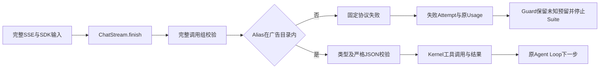
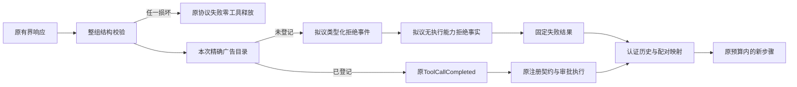
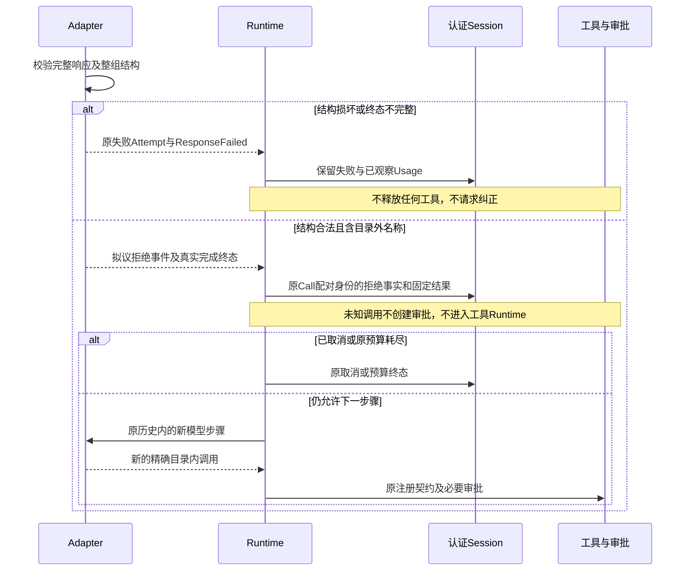
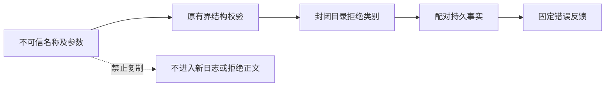

# 未登记工具调用的拒绝反馈与有界纠正设计

## 1. 变更摘要

| 项目 | 内容 |
|---|---|
| 缺陷 | 完整响应内的未登记工具名目前被归入协议失败，无法进入既有工具错误反馈循环 |
| 已确认事实 | 新真实Suite停止原因是`chat_protocol/v1:tool_name_unknown`；未保存原工具名和参数，不能推断具体拼写或原响应结构是否合法 |
| 当前实现状态 | 生产行为不变；新增15项离线边界测试。后述拒绝事件、持久合同和Adapter改造均未实现 |
| 拟议目标 | 结构完整但名称不在本次广告目录的调用永不执行；持久化有界拒绝事实，允许原Agent Loop消费错误后重新提案 |
| 影响模块 | Adapter完整响应校验、Provider中立事件、Session/Reducer、历史映射及原预算Guard |
| 兼容级别 | 可能新增Provider事件及Item正文变体；必须独立完成Schema、旧Reader及认证恢复验证，不以内部字段偷偷实现 |
| 发布/回滚单元 | 同一候选中的事件、Reducer、两种历史映射和回归；当前默认装配不启用新行为 |

本设计是待决语义方案，不是可恢复能力已经发布的声明。拒绝执行、结构校验、审批和错误纠正是不同边界。

## 2. 需求背景与源码研究

[实际环境及新Suite停止报告](../validation/r3-workspace-coherence-2026-10-08-v1/README.md)第13节记录：
Docker环境复验通过后，后继真实Suite仍因第二个模型请求的未知名称诊断停止，没有完整Trial质量报告。
它证明一次名称目录拒绝，不证明未知名称来自Alias、Prompt、模型幻觉或其他具体来源。

| 源码来源 | 固定版本与位置 | 求证结论及取舍 |
|---|---|---|
| Harnessix Adapter | [_chat_stream.py](../../src/harnessix/models/_chat_stream.py)：`_complete_calls`、`ChatStream.finish` | 全调用组通过后才释放工具；名称校验早于类型及JSON校验，因此原未知名称诊断不是结构完整证明 |
| Harnessix目录 | [_chat_mapping.py](../../src/harnessix/models/_chat_mapping.py)：`build_request`；[_history.py](../../src/harnessix/models/_history.py)：`tool_alias` | 本次广告使用精确Alias反向目录；不能把未知Wire字符串直接当原工具名传给Kernel |
| Harnessix Kernel | [runtime.py](../../src/harnessix/agent/runtime.py)：`_sample_events`、`_execute_tool` | 中立事件中未登记工具已有`unknown_tool`失败结果，原Loop可以消费后续新提案；真实SDK在此前拒绝 |
| Codex公开源码 | `a0dcfe2ada3f5bbd5059a34c0fc6fac244741a67`，[registry.rs](https://github.com/openai/codex/blob/a0dcfe2ada3f5bbd5059a34c0fc6fac244741a67/codex-rs/core/src/tools/registry.rs)：`dispatch`、`unsupported_tool_call_message` | 工具不存在时返回模型可见错误，不调用工具。借鉴“拒绝且反馈”，不移植其原参数日志或原名称回显 |
| OpenCode公开源码 | `69c172e8a7c0086887b1f93ed5a162f14b6aa0c5`，[llm.ts](https://github.com/anomalyco/opencode/blob/69c172e8a7c0086887b1f93ed5a162f14b6aa0c5/packages/opencode/src/session/llm.ts)中DWS `toolExecutor` | 特定Workflow桥在目录缺失时返回错误。只证明该分支，不推广为所有OpenCode Provider的统一合同 |

外部实现由本机公开源码核对，不调用模型，不读取业务参考答案，不复制第三方实现。

## 3. 设计目标、非目标与验收标准

1. **执行权限不增加**：未知名称不进入工具Runtime、Trusted Action、审批、进程、MCP或文件写入。
2. **仅语义错误可纠正**：DONE、Usage、结束原因、连续index、唯一ID、类型、严格JSON object全部合法后，才能认定未登记名称属于拒绝反馈，而非协议损坏。
3. **不自动修复身份**：原名、大小写变化、截断Alias、相近工具名及其他步骤目录都不能自动映射到已登记工具。
4. **沿原Loop有界纠正**：拒绝消耗原步骤、Token、调用数量、输出和Turn期限；后续必须是新的模型步骤和新的持久Call身份，不是重放原调用。
5. **可恢复且可审计**：拒绝事实和对应结果配对；重开与Replay一致；取消/崩溃不得重新发起旧模型请求或执行旧未知调用。
6. **费用规则不改变**：完成响应和完成Attempt须真实成立；旧失败与未知预留不重新结算。新的可恢复语义不豁免任何新费用歧义。

非目标：猜出旧未知名称、模糊匹配、名称降级、从文本/XML提取工具、自动请求重试、扩大预算、改评分或宣布R3通过。

## 4. 当前实现、流程与根因



图中Adapter拥有Wire完整性；Kernel拥有工具注册及执行权限；Guard拥有验证费用预留。
当前名称失败发生在类型/JSON验证之前，不能仅根据固定诊断跳过协议校验。
Kernel已有拒绝反馈不意味着SDK支持相同语义：两者输入合同与拒绝位置不同。

另一个风险是名称跨域：广告名称`tool_alias(original)`不等于持久工具原名。
若将目录外的Wire `original`直接透传，Kernel可能找到已注册的同名工具，从“未知”变成实际执行。
因此“捕获异常后透传名称”不是可接受方案。

## 5. 拟议方案与总体架构



先校验所有成员结构，再分类目录归属；分类结果暂存在Adapter内存，全部完整后才释放。
拟议拒绝事件没有工具名称和参数，不携带工具契约、EffectClass或Approval。
已登记工具仍走原流程；不能把拒绝编码为一个伪造已登记工具或人为“只读”能力。

### 5.1 替代方案与取舍

| 方案 | 优点 | 风险/缺点 | 结论 |
|---|---|---|---|
| 保持直接失败 | 最少变更，现行语义明确 | 一次可纠正名称错误结束任务 | 保留为当前行为及回滚边界 |
| 原名称透传 | 可复用现有Kernel未知工具分支 | Wire Alias与原名混淆；可能执行实际已登记工具；泄露原名称/参数 | 拒绝 |
| 模糊匹配或重算Alias | 看似提高成功率 | 根据未可信身份选择执行对象，扩大权限 | 拒绝 |
| 保留名伪工具/特殊版本 | 减少Schema变更 | 注册冲突、隐式分支、恢复误分类；拒绝与可执行调用混为同一合同 | 不采用 |
| 类型化拒绝事件和事实 | 明确零执行能力，恢复及审计可验证 | 需要持久合同、Reducer和历史映射配套 | 推荐待决方案 |

## 6. 正常、失败与恢复时序



时序描述的是拟议行为：完成Attempt必须来自真实完整响应，不是把旧失败改为成功。
新调用不能继承旧未知调用的身份、审批或执行权。任何取消、恢复或预算拒绝在新HTTP之前生效。
恢复读取已经提交的事实，不重新解析或重发旧Wire；提交中断须由原事件事务避免半条配对。

## 7. 拟议接口设计、领域契约与数据结构

| 元素 | 拟议责任与关键字段 | 不允许包含 |
|---|---|---|
| Provider拒绝事件 | 独立闭合变体；`call_id`为本响应原有界ID，`reason`为封闭`unregistered_tool` | 原工具名、原参数、自由异常正文、工具映射或执行能力 |
| 拒绝Item正文 | 独立闭合变体；新持久`call_id`、原`provider_call_id`、固定reason；保留响应成员顺序 | 注册指纹、EffectClass、Approval或假装成功的工具输出 |
| 拒绝结果 | 复用原失败结果的配对与固定`unknown_tool`类别；`retryable=false`不触发传输层重试 | 旧调用重试授权、相似工具建议、未可信原字段回显 |
| 历史映射 | 已完成拒绝及结果必须唯一配对；使用固定不可执行拒绝标记表达历史 | 反向补造原未知名称、把标记加入广告或映射至真实工具 |

事件和Item类型名、最终字段、Schema代际及旧Reader行为尚未冻结；不得在实现前标为正式契约。
历史标记只表达过去的拒绝，Adapter不得从标记签发工具能力；两种Provider的映射都须验证。
若不能完成明确配对和兼容设计，应保持原失败，不通过临时伪工具规避。

## 8. 状态、事务、并发与幂等

- 原响应成员顺序、调用数量限制和整组结构拒绝保持；不得提前执行流中的已登记成员。
- 拒绝事实及其结果应在原Session追加事务中成对形成，不开新账本或后台重试队列。
- 整个响应验证通过后，已登记成员可以进入原审批；未知成员没有副作用，不能占用或伪造高风险授权。
- 新模型步骤的提案是新调用，不重用旧Call身份；并行工具调度不能将拒绝当并行只读执行。
- 重复事件、ID重复、缺结果或状态不合法必须拒绝；`UNKNOWN`效果仍由原对账处理，拒绝不改变任何既有未知效果。

## 9. 安全、隐私与可观测性

未知名称、参数可能含Secret、路径或恶意指令；只保留原有界Call身份与封闭类别，不存原值或摘要。
公开输出继续经过原保护边界，原Call身份也不能跳过Secret检查。
诊断必须区分“协议损坏”和“结构合法但未登记”；原单一`tool_name_unknown`不能单独认定后者。
拒绝次数可从低基数事实统计，不建立原名称日志或新遥测平台。



图示的数据最小化不等于原响应未收费；费用和质量分别保留原事实。

## 10. 核心伪代码

```text
完成响应：
    验证原DONE、Usage、finish与响应身份
    对全部成员验证连续index、唯一有界ID、function类型、严格JSON object
    任一失败 -> 原协议失败；没有工具事件
    对全部结构合法成员按本次精确目录分类
        已登记 -> 原工具事件
        未登记 -> 不含名称/参数的类型化拒绝事件
    发布真实完成Attempt及响应终态

消费拒绝：
    检查原事件顺序、数量、输出和取消预算
    在原追加事务提交配对拒绝事实及固定失败结果
    不进入工具、审批或Trusted Action
    原Loop在下一HTTP之前核对原预算与取消

恢复：
    认证读取并重放原事实
    缺配对或损坏 -> 拒绝，不补造调用
    不重发原HTTP，不重执行未知调用，不重结算旧预留
```

## 11. 实施切片

| 顺序 | 工作 | 当前状态 | 验证 |
|---|---|---|---|
| 1 | 固定当前SDK、Kernel和诊断先后边界 | 已实现测试，生产行为不变 | 新15项离线场景 |
| 2 | 冻结拒绝事件、Item、配对及旧Reader合同 | 待决 | Schema/Reducer/History负控，不新增真实模型请求 |
| 3 | Adapter全结构校验后分类、Runtime拒绝消费 | 未实现 | 两Provider录制Wire；已登记写入仍须审批；畸形组零释放 |
| 4 | 取消、超时、崩溃恢复及Guard完整响应回归 | 未实现 | 原预算不刷新、无自动重试、未知预留仍停止 |
| 5 | 冻结同一候选并运行完整R3 | 未执行 | 原3仓10 Case/20 Trial及至少12/20门槛不变 |

## 12. 源码与测试映射

| 边界 | 实际源码 | 测试 |
|---|---|---|
| 原未知诊断不是结构证明 | [_chat_stream.py](../../src/harnessix/models/_chat_stream.py)：`_complete_calls` | [新边界测试](../../tests/models/test_unknown_tool_boundaries.py)：`test_unknown_name_diagnostic_alone_does_not_prove_legal_structure` |
| 写调用整组不部分释放 | 同上；[openai_chat.py](../../src/harnessix/models/openai_chat.py) | 同测试：`test_unknown_group_releases_no_registered_write_or_approval` |
| Kernel拒绝后新提案 | [runtime.py](../../src/harnessix/agent/runtime.py)：`_execute_tool` | 同测试：`test_normalized_unknown_error_can_be_corrected_only_by_a_new_registered_call` |
| 原步骤/取消边界 | 同上；[scripted.py](../../src/harnessix/models/scripted.py) | 同测试：`test_normalized_unknown_calls_consume_original_step_budget`、`test_cancel_after_normalized_rejection_does_not_request_correction_or_execute` |
| 未决费用拒绝 | [原Guard](../../scripts/provider_verification_guard.py)：`GuardedVerificationProvider.stream` | [原费用回归](../../tests/evals/test_provider_verification_budget.py) |
| 原Alias精确身份 | [_history.py](../../src/harnessix/models/_history.py) | [身份回归](../../tests/models/test_tool_alias_identity.py) |

## 13. 风险、部署、兼容与回退

最大风险是把未知名称透传为已登记原名，以及根据原诊断误认畸形参数可恢复。
其次是新增持久变体未配套认证、Reducer、历史映射和旧Reader。完成全部离线负控前不启用。
若采用方案，回滚必须保留新增事实并明确旧Reader拒绝，不删除或重签历史；不能只回退Adapter包而隐瞒不兼容状态。
真实R3仍须独立运行和评分；本设计和离线通过均不提高历史成功率、不关闭R3或商用发布门禁。

## 14. 实现偏差与当前结论

现行生产实现保持原拒绝及费用语义；本阶段只增加边界测试和详设。
离线验证新增15项全部通过，证明原边界及既有Kernel能力，不证明拟议Adapter恢复、模型纠正或真实编码质量。
下一实现必须先冻结持久拒绝合同，不能仅删除Alias目录判断或捕获`tool_name_unknown`异常继续执行。
