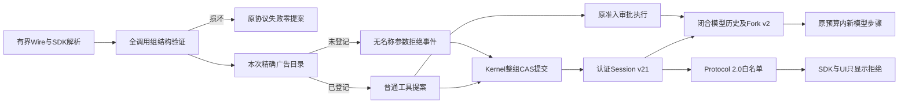
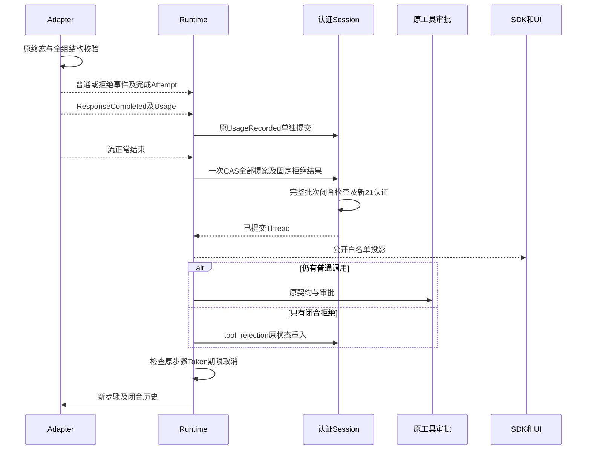
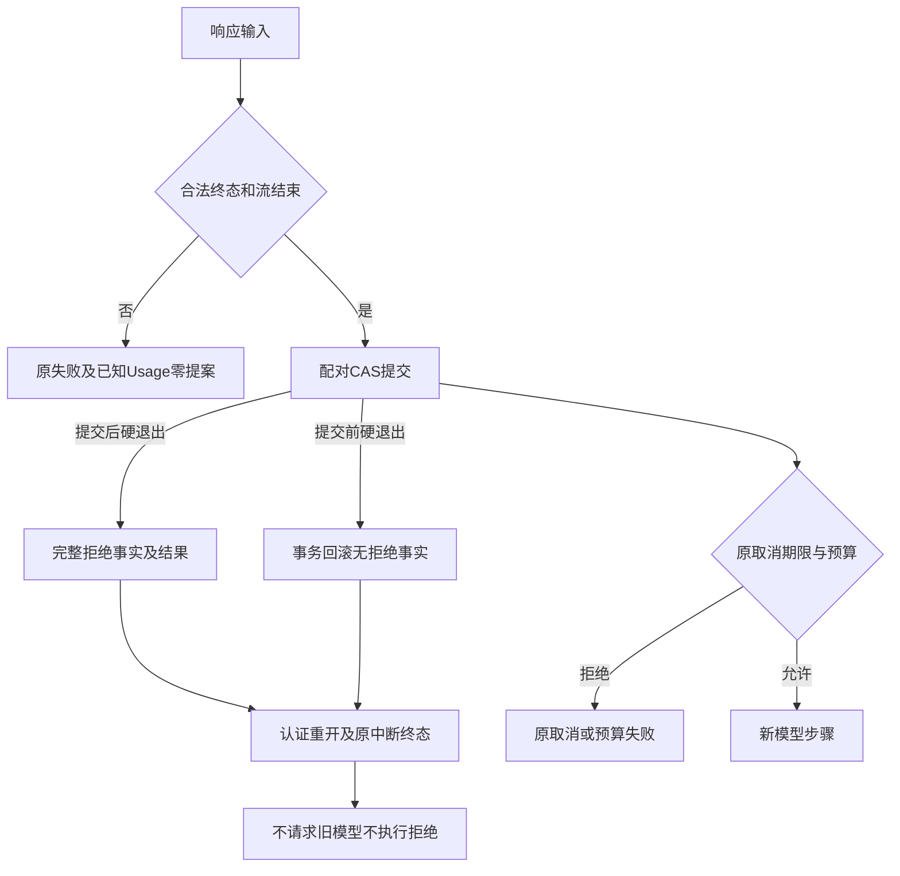
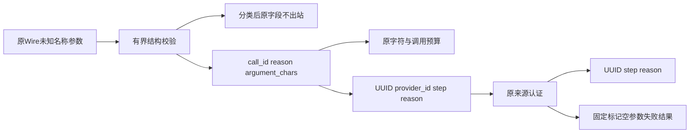

# 未登记工具调用的拒绝反馈与有界纠正详细设计

## 1. 变更摘要

| 项目 | 内容 |
|---|---|
| 背景 | 完整响应内未登记工具名原来终止整轮任务；原固定名称诊断不足以证明参数结构合法 |
| 目标 | 合法响应中的未知调用永不执行，产生持久拒绝事实及固定失败反馈，允许原预算内新步骤纠正 |
| 当前实现 | 两Adapter、中立事件、Kernel、认证Session、Context/Fork、Protocol 2.0与SDK/UI已配套实现；安装态回归及真实供应商、R3质量验收分别验证 |
| 版本 | Provider Event v4；Agent Event/Thread v21；Fork v2；Agent Protocol 2.0及六份公共Schema v2；migration31 |
| 权限 | 拒绝没有工具名、参数、契约、效果或审批权；已登记调用仍经过原准入和审批 |
| 非目标 | 模糊匹配、旧Wire重放、自动放宽授权/预算、费用冲销、修改质量门槛 |

离线固定Wire及脚本验证不构成真实编码质量。原R3严格0/20、必需测试1/20、真实Beta接受0保持原记录；
本切片不关闭R3、R4或商业发布门禁。源码身份及测试边界以独立验证包为准。

## 2. 需求背景与源码研究

[实际环境报告](../validation/r3-workspace-coherence-2026-10-08-v1/README.md)保留Docker复验后的真实Suite停止事实：
`chat_protocol/v1:tool_name_unknown`没有完整Trial结果。原工具名、参数均未采集，不能补推原错误拼写或结构是否合法。

| 来源 | 固定源码与结论 | 采用与舍弃 |
|---|---|---|
| Harnessix Chat | [_chat_stream.py](../../src/harnessix/models/_chat_stream.py)：`_complete_calls`、`ChatStream.finish` | 原名称判断早于JSON验证；改为全组结构先验，不能捕获名称异常直接放行 |
| Harnessix Anthropic | [_anthropic_stream.py](../../src/harnessix/models/_anthropic_stream.py)：`AnthropicStream` | 原起始块目录判断早于参数/终态；延至完整结构确认后分类 |
| Harnessix Kernel | [runtime.py](../../src/harnessix/agent/runtime.py)：`_sample_events`、`_close_model_step` | 旧普通未知Call可以反馈但不能表达零执行事实；新增独立拒绝Item，而不是伪只读工具 |
| Codex公开源码 | `a0dcfe2ada3f5bbd5059a34c0fc6fac244741a67`，[registry.rs](https://github.com/openai/codex/blob/a0dcfe2ada3f5bbd5059a34c0fc6fac244741a67/codex-rs/core/src/tools/registry.rs)的dispatch | 借鉴不存在工具的错误反馈；不移植其原名称/参数日志 |
| OpenCode公开源码 | `69c172e8a7c0086887b1f93ed5a162f14b6aa0c5`，[llm.ts](https://github.com/anomalyco/opencode/blob/69c172e8a7c0086887b1f93ed5a162f14b6aa0c5/packages/opencode/src/session/llm.ts)的DWS toolExecutor | 仅借鉴该分支的拒绝反馈，不推广为所有Provider行为 |

外部研究使用本地公开源码。未知Wire原名即使与Kernel注册原名一致，也不能绕过本次Alias广告目录。

## 3. 设计目标、约束与验收

1. 严格DONE、Usage、结束原因、响应身份、连续index、唯一有界ID、function类型、严格JSON object仍是先决条件。
2. 畸形组不释放任何普通调用或拒绝提案；合法未知名称只释放类型化拒绝。
3. 原步骤、Token、调用数量、输出字符与Turn期限不重置；下一步骤是新模型请求和新持久Call身份。
4. 拒绝及结果在一个CAS批次成对提交；正常调用只在完整响应结束后进入原执行/审批。
5. 追加批次、Replay尾、Snapshot和Fork都检查闭合及固定无效果结果。
6. 原20认证字节可读，新21签发准确绑定版本；旧Reader和旧SDK明确失败，不伪装兼容。
7. 取消、超时和进程硬退出后不自动发起旧请求、不执行拒绝、不改变未知费用预留。

## 4. 总体架构与模块边界



Adapter决定结构与精确目录分类；Kernel拥有持久身份、步骤和工具权限；Session认证来源但不授予公开或执行权；
Context保存闭合模型视图；Protocol移除Provider身份；UI不得将拒绝生成审批或重试按钮。

替代方案：直接失败可作为旧版本行为，但不足以处理可纠正语义错误；原名称透传存在跨域执行风险；
模糊匹配改变权限；伪工具混淆恢复和执行。采用独立拒绝合同，不新增队列、状态机或第二账本。

## 5. 接口设计、领域契约与数据结构

| 类型/源码 | 字段及不变量 | 禁止内容 |
|---|---|---|
| [ToolCallRejected](../../src/harnessix/models/contracts.py) | type固定；call_id严格1～256字符；reason固定unregistered_tool；argument_chars必填严格0～1,000,000 | name、arguments、工具契约、效果 |
| [ToolCallRejectionContent](../../src/harnessix/agent/models.py) | kind固定；call_id新UUID；provider_call_id严格1～256；model_step严格1～1000、等于当前步骤；reason固定 | EffectClass、指纹、审批、工具名及参数 |
| [rejection_result](../../src/harnessix/agent/tool_rejections.py) | 同call_id；outcome=failed；output=null；unknown_tool/工具未注册/tool/retryable=false；所有效果字段null | 假成功、可重试授权、Artifact/Action/Process/Patch效果 |
| [PublicToolCallRejectionContent](../../src/harnessix/protocol/contracts.py) | kind、callId、modelStep、reason四字段 | providerCallId、原名、参数、字符计数、执行能力 |

拒绝事实与结果Item均为completed、Item.error=null；这是“事实提交完成”，不是“工具成功”。
argument_chars只保留在中立事件中计入原输出预算，不进入持久或公共Item。
ToolCallCompleted/Rejected共用ID唯一性与调用数量预算。两个Adapter对名称执行1～256字符结构限制，空名/过长名不是可恢复目录错误。

## 6. 正常流程与时序



调用组保持响应顺序：先全部普通调用/拒绝事实，再全部固定拒绝结果。配对无需相邻，但结果不能先于事实。
正常调用在整组持久化后才可执行；合法混合组可以创建已登记写调用的原审批，拒绝成员永远不能创建审批。

原UsageRecorded仍在ResponseCompleted位置独立提交，保留已有“坏终态/异常尾仍保存已知Usage”的失败语义。
不将Usage移入新批次，否则完整用量可能因尾损坏丢失。新批次原子保证的是全部工具提案及拒绝配对。

## 7. 状态、事务、并发与幂等

`pending_calls`只包含普通ToolCallContent，拒绝从不进入执行或并行调度。
[turn_reducer.py](../../src/harnessix/agent/turn_reducer.py)的tool_rejection只允许CALLING_MODEL→PREPARING_CONTEXT：
当前usage_step=model_steps，存在当前步骤拒绝，配对闭合，无普通pending、开放Item/Attempt/Compaction，error为空。
混合组沿原工具执行状态继续；Steering存在时仍优先原Steering规则。

[sqlite_append.py](../../src/harnessix/session/sqlite_append.py)逐事件归约允许合法临时前缀，整个批次结束才检查闭合；
失败回滚原事务。重复事件沿原ID/CAS幂等检查；相同ID不同正文仍event_conflict。Thread验证与Replay末尾不接受半条拒绝。
固定结果不授予retry，后续新提案不能复用旧持久Call或审批。

## 8. 模型历史、Context、压缩与Fork

[统一历史](../../src/harnessix/models/_history.py)以harnessix_rejected_tool_v1、空参数和call_加持久UUID表达拒绝；
OpenAI映射assistant function/tool失败，Anthropic映射tool_use及同ID错误tool_result。
标记不进入广告、注册或反向目录；模型再次提出标记也会拒绝。不得恢复原未知名称。

[tool_result_view.py](../../src/harnessix/context/tool_result_view.py)对拒绝结果强制固定内容，不增加Artifact引用。
[compaction.py](../../src/harnessix/context/compaction.py)把拒绝/结果当闭合组；摘要序列只包含类型、Call身份、reason及model_step。

Fork v1保留原白名单。Fork v2复用只读、Item唯一、调用/结果唯一配对、冻结视图、Artifact原所有者和8 MiB上限，新增固定拒绝闭合检查。
[lifecycle.py](../../src/harnessix/agent/lifecycle.py)新建默认v2；验证旧快照显式重建v1，不静默转换。
Runtime保留harnessix.thread-fork/v1确定性UUID命名空间；已有目标按原快照版本核对来源后返回，保持原事件字节，不能产生第二个子Thread。
外层Agent Event<21拒绝所有Fork v2，包括空历史；v1在任何外层版本下都不允许新拒绝历史。

## 9. 认证、Schema、迁移与备份

| 边界 | 实现与兼容行为 |
|---|---|
| Schema | 新Provider v4、Agent Event/Thread v21、Fork v2及六份公共v2；全部旧文件原字节保留 |
| 事件认证 | 原MAC域不变；旧Seal默认20；新签发仅21，声明与完整正文身份及schema_version准确匹配 |
| 投影认证 | 原Seal缺省20可读；新写显式21；行、Seal声明相同且版本内容对应，旧20不得隐藏拒绝或空Fork v2 |
| Reader | [migration31](../../src/harnessix/session/migrations/0031_unknown_tool_rejection.sql)推进最低Reader，旧程序schema_too_new关闭 |
| 备份 | [state_backup_validation.py](../../src/harnessix/product_config/state_backup_validation.py)只接受完整冻结v30/v31 checksum集合，拒绝任意前缀、重复/混合集合、v30隐藏新事实 |
| 恢复 | 保留原备份字节，正式初始化升级；不重签旧事实、不把新内容伪装旧版本 |

旧v1公共Schema仍供历史合同识别，不表示新Server运行双栈。新SDK只发送Agent Protocol 2.0；
initialize.version为严格1～32字符串，通过结构校验后精确比较，1.0返回原unsupported_protocol_version且保持NEW。
坏类型/空值/过长值返回invalid_params。公共Event spec_version=v2；Thread/Turn摘要及Envelope/命令Schema没有新联合，保持v1。

## 10. 失败、取消、超时和崩溃恢复



只有名称目录归属是可纠正语义。坏JSON、非object、类型漂移、缺ID/重复ID、index缺口、异常尾、缺终态仍失败关闭。
名称及参数不进入日志、事件或公共正文；原有界ID仍经过Secret保护。
取消覆盖流等待与纠正步骤；原Turn期限跨步骤有效，超时保持time_budget_exceeded。
硬退出测试覆盖终态之前及Session after_events/after_projection/after_commit、Runtime after_tool_call：未提交零配对，已提交完整配对。
重开不自动重发模型、不回放未知调用。费用未知保持未知，不据离线恢复修改历史Attempt或预留。

## 11. 数据流程、安全与可观测性



Provider私有ID只在持久事实中保留，公共投影移除；字符数仅计预算；拒绝次数可从低基数事实计算。
使用原模型步骤、尝试、Usage与生命周期遥测，不新增原名称指标标签或正文日志。
来源认证、公开保护、执行许可与模型质量是四个独立证明。

## 12. 核心伪代码与源码定位

```text
Adapter完成：验证完整终态；全组结构先验；按当前精确目录分类；任一损坏不释放提案
Runtime采样：检查原事件顺序/预算；缓冲普通和拒绝提案；按原路径提交已知Usage
流正常关闭：构造新持久Call身份；先提案组后固定拒绝结果；一个原CAS批次提交
步骤结束：普通pending走原执行；仅拒绝按有证据tool_rejection重入；HTTP之前原Guard复核
恢复：认证完整原字节；重放闭合事实；无配对拒绝；不补造、不重发、不执行拒绝
Fork：保留确定性UUID；按已有快照版本重建并核对；新请求v2，只继承闭合只读历史
```

| 责任 | 源码入口 | 定向测试 |
|---|---|---|
| Adapter及历史 | [_chat_stream.py](../../src/harnessix/models/_chat_stream.py)、[_anthropic_stream.py](../../src/harnessix/models/_anthropic_stream.py)、[_history.py](../../src/harnessix/models/_history.py) | [两Provider正负控](../../tests/models/test_tool_rejection.py)、[原边界](../../tests/models/test_unknown_tool_boundaries.py) |
| 固定结果与Reducer | [tool_rejections.py](../../src/harnessix/agent/tool_rejections.py)、[item_reducer.py](../../src/harnessix/agent/item_reducer.py)、[turn_reducer.py](../../src/harnessix/agent/turn_reducer.py) | [Kernel合同](../../tests/agent/test_tool_rejection_runtime.py)、[取消/硬退出](../../tests/agent/test_rejection_recovery.py) |
| 认证与事务 | [publication_seal.py](../../src/harnessix/session/publication_seal.py)、[store_publication.py](../../src/harnessix/session/store_publication.py)、[sqlite_publication.py](../../src/harnessix/session/sqlite_publication.py) | [原20/新21](../../tests/session/test_rejection_publication_versions.py) |
| Fork及版本 | [models.py](../../src/harnessix/agent/models.py)、[lifecycle.py](../../src/harnessix/agent/lifecycle.py)、[event_compatibility.py](../../src/harnessix/agent/event_compatibility.py) | [Fork v2](../../tests/context/test_rejection_fork_v2.py) |
| 公共出口 | [contracts.py](../../src/harnessix/protocol/contracts.py)、[projection.py](../../src/harnessix/protocol/projection.py)、[handshake.py](../../src/harnessix/app_server/handshake.py)、[rendering.py](../../src/harnessix/product_ui/rendering.py) | [V2握手](../../tests/app_server/test_handshake_protocol_v2.py)、[认证SDK闭环](../../tests/app_server/test_rejection_sdk_chain.py) |
| 备份与冻结 | [state_backup_validation.py](../../src/harnessix/product_config/state_backup_validation.py)、[generate_specs.py](../../scripts/generate_specs.py) | [备份](../../tests/product_config/test_rejection_backup_versions.py)、[旧合同摘要](../../tests/protocol/test_v1_frozen_schemas.py) |

## 13. 部署、兼容风险、升级与回退

1. Server、SDK、CLI/UI使用同一候选安装包升级；旧客户端连接明确失败，没有隐式降级。
2. 状态写入v21/migration31前保留完整匹配版本备份。升级不重新编码或补签旧历史。
3. 新Reader可验证旧v20来源，旧Reader不能接管v31；回退使用原程序及其完整备份，不删除新拒绝记录。
4. 不只回退Adapter或客户端。固定标记是否被真实供应商接受须独立有界验证，失败不得将标记广告成真实工具。
5. 本地脚本、录制Wire和SDK测试不替代Windows/Linux/macOS安装态或真实用户编码任务。

## 14. 测试验证结论与遗留工作

离线验收覆盖严格结构、权限零增长、原预算、原认证/备份兼容、Fork身份、取消/超时/硬退出及公共出口。
测试统计、失败原件、源码/安装物摘要在独立交付包中记录，不拼接重复运行计数。
后续R3必须使用同一安装候选独立运行完整真实Trial并原样评分；R4仍需B4/B7、FD/锁归属、P1、approved Writer、默认Git完整授权写链及三平台。
本设计不提高原质量成绩，不宣布商业完成。

最终同一候选的安装回归、554成员字节身份、原失败、版本冻结及公开复核入口见
[正式交付报告](../validation/r3-rejection-runtime-2026-10-08-v1/README.md)。
旧迁移资源Reader测试与实际历史发行降级、离线SDK链与真实供应商质量分别记录，不扩大解释。
