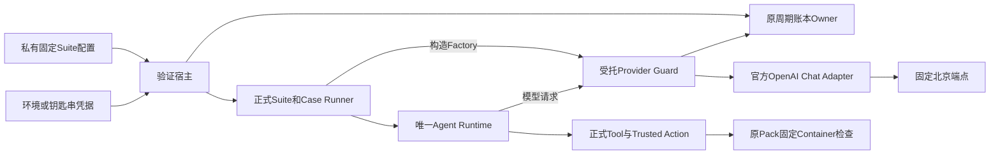
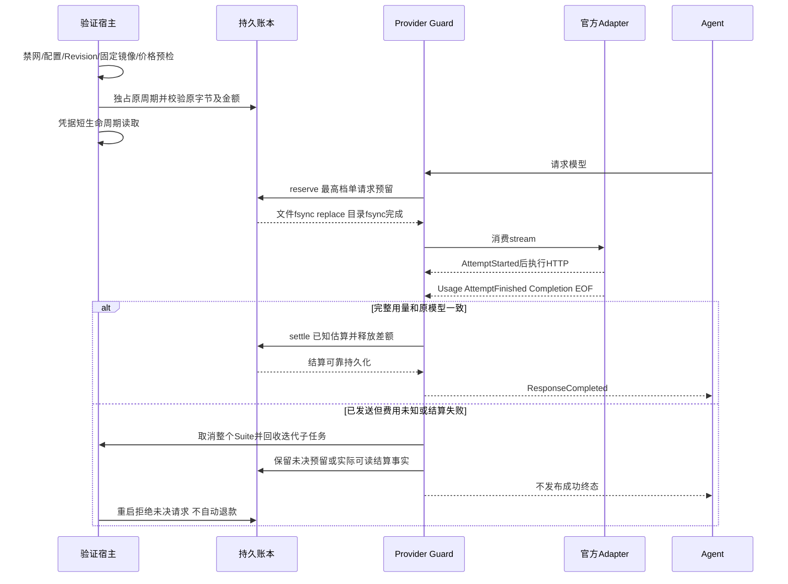
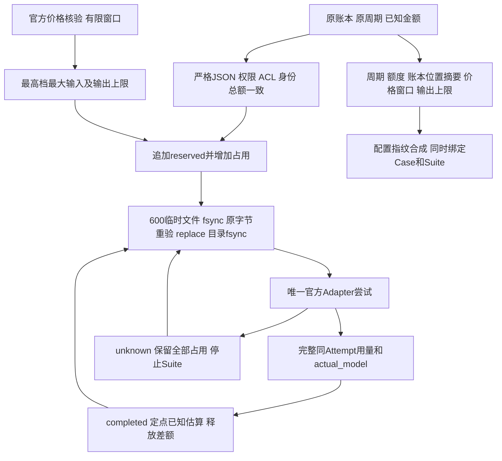

# R3 固定真实评测的持久请求预留与费用不确定性保护

## 1. 变更摘要与需求背景

正式Suite已固定工程Task Pack v2的3仓库、10 Case、每Case两次Trial。历史真实基线为0/20，
[共享Context整改](m09-r3-product-context-composition.md)和[可信文件快照](m09-r3-trusted-file-snapshot.md)
不替代整改后的完整真实验收。验证宿主必须在授权的有限累计费用内完成后续试验，
不能仅在整Case结束后检查金额，也不能因取消、用量缺失或进程重启把已发送请求当作免费。

变更只在受控验证宿主增加请求预留。产品通用价格平台、账户级人民币硬限额、账单对账和其他模型认证继续延期；
不新增Agent Loop、Grader、评测数据集、数据库Schema或公共Protocol。

## 2. 当前实现、根因与源码研究

[`provider_suite_execution.py`](../../src/harnessix/evals/provider_suite_execution.py)原来仅在内部构造
`TaskPackOpenAIChatProviderFactory`。宿主若另写Suite执行循环，会绕过已存在的计划冻结、Case绑定与恢复判断。
Case及Suite原有费用停止线在完成Trial后聚合，并不等价于发送前的持久请求预留。

核验[`OpenAIChatProvider.stream`](../../src/harnessix/models/openai_chat.py)：请求映射失败可返回
`ResponseFailed`而没有网络尝试；否则先产生`ModelAttemptStarted`，消费下一事件时才执行HTTP请求。
SDK自动重试为零，正式配置还要求`max_attempts=1`。用量来自实际Adapter的`ModelUsageObserved`，
不能从模型回答、空字段或事件缺失推断零费用。

采用已有`CancelToken.run`托管Suite取消与每次异步迭代；复用货币18位定点换算、严格JSON、
文件锁及POSIX私有文件权限/ACL检查，不复制第二套通用基础设施。

## 3. 设计目标、非目标与验收标准

1. 任何实际HTTP尝试之前，原账本已可靠持久化保守预留；预留失败发送次数为零。
2. 完整、同一模型及同一Attempt的用量才能结算；未知费用保留全部预留并取消整个Suite。
3. 成功终态必须晚于可靠结算；结算写入失败不发布`ResponseCompleted`。
4. 原预算周期、额度、历史请求与已知金额保持，不自动建立账本、加额、重置或清理未决请求。
5. 新Factory绑定同时进入Case与Suite恢复身份；不能恢复时偷换价格窗口、周期或输出上限。
6. 原默认Factory和执行指纹保持兼容；正式10 Case/20 Trial及严格评分不变。

非目标：供应商账户硬停止、优惠/缓存对账、任意第三方Provider插件、Windows验证宿主账本、
真实远端部署、自动下载镜像及已延期的产品预算平台。验证脚本限定POSIX，并不取消Windows产品R4承诺。

## 4. 总体架构与模块边界



| 模块/类 | 唯一职责 | 不承担职责 |
|---|---|---|
| `run_budgeted_suite` | 固定配置、程序/Revision、镜像和凭据预检；拥有账本及Factory生命周期 | 不执行工具、不修复任务、不自动重试 |
| `VerificationBudgetLedger` | 独占原账本、校验原金额、持久预留和结算 | 不调用模型、不创建预算、不签发价格 |
| `BailianVerificationBounds` | 可信宿主核验的有限价格窗口、保守预留与定点估算 | 不查询账单、不承诺未来价格 |
| `GuardedVerificationProvider` | Attempt/Usage语义验证、取消传播、延后成功发布 | 不修改Prompt或工具定义，不替换Agent状态机 |
| `run_task_pack_provider_suite` | 严格配置及原范围核验、绑定身份、调用正式Suite Runner | 不拥有账户余额、不接受未绑定的Factory |

## 5. 正常与失败恢复时序



`AttemptStarted`是官方Adapter的发送意图边界，不是供应商收款凭证。该事件后取消即便实际HTTP尚未发送，
仍保守记为费用未知。无Attempt且只有映射失败可以释放预留。截断流、别名模型、重试标记、
终态后事件及不完整用量均不能当作成功。Suite取消与Turn取消令牌不同；只检查入口会导致已在等IO的请求
无法停止，因此每次`anext`由Suite令牌托管，父Task退出也回收子任务并关闭源迭代器。

## 6. 数据流程及文字描述



账本只保存最小用途、模型、地域、上限、Thread/Turn/Step身份和费用事实；不保存凭据、
Prompt、工具参数、响应正文、代码或供应商错误。Suite证据继续由原发布器按白名单输出；
私有运行状态和账本不能复制到公开资料目录。

## 7. 接口设计、数据结构与重点字段

| 接口 | 输入/输出 | 失败及生命周期 |
|---|---|---|
| `run_task_pack_provider_suite`新增可选参数 | `provider_factory`和64位小写十六进制`provider_binding_sha256`必须成对 | 缺少/非法绑定在构造Client前拒绝；原None/None路径不变 |
| `VerificationBudgetLedger(path, period_id)` | 已有私有POSIX账本、明确UUID周期 | ContextManager独占整个Suite；关闭不退款、不删除锁 |
| `reserve(maximum_units, metadata)` | 正整数定点预留和最小元数据 → request UUID | 原账本/额度/权限变化、余额不足、未决请求均拒绝 |
| `settle(request_id, cost_units, sent=...)` | 完整已知金额或None；明确发送意图 | 类型和预留范围严格核验；未发送请求不能有正费用 |
| `BailianVerificationBounds` | 有时区起止时间、1～4096整数输出上限 | 每请求检查价格窗口；bool不作为整数输出上限 |
| `GuardedVerificationProvider.stream` | 原ModelRequest/Turn取消 → 原Provider事件 | 官方源关闭并可靠结算之后才发布成功 |

### 7.1 原账本v1字段与状态

| 字段 | 意义与权威来源 |
|---|---|
| `schema/provider/currency` | 固定原账本合同、`aliyun-bailian`、`CNY` |
| `period_id/status/allocation` | 原唯一active周期及原额度；不能由脚本新增或重置 |
| `known_cost` | 本周期completed/not_sent请求的已知估算之和，不是账单或账户余额 |
| `reserved_cost` | 全部reserved/unknown请求占用之和 |
| `request_id` | 本周期唯一请求UUID，不复用旧请求或补发未决请求 |
| `status` | `reserved → completed / unknown / not_sent`；unknown没有自动恢复发送路径 |
| `cost_estimate` | 18位定点金额字符串；未知不写零 |

金额输入拒绝JSON数字、指数、负数及超18位小数。历史原条目保留，但总额、UUID重复和状态占用不一致不能自动修复。
金额约束为`known_cost + reserved_cost <= allocation`。这只约束当前原账本合作Owner的验证请求，
不约束同账户其他应用、恶意同UID宿主、账本副本或供应商账单调整。

### 7.2 有限价格边界

2026-09-28核验[阿里云官方快照模型资料](https://help.aliyun.com/zh/model-studio/qwen3-coder-plus)：
北京`qwen3-coder-plus-2025-09-23`最大输入997952；四档输入/输出原价分别为4/16、6/24、10/40、20/200元每百万Token。
脚本以32000/128000/256000划分估算档位，不计优惠或缓存折扣；供应商计费结果仍需独立确认。

保守单请求预留为`(997952 × 20 + max_output_tokens × 200) / 1000000`元；
输出4096上限对应20.77824元。预留完整最高档，避免通过缩减模型输入/任务范围凑预算。
已知用量按对应档位结算；最大输入/输出越界、模型漂移或用量未知不释放预留。
原Campaign仍仅认证32k价格范围，超范围不能伪造原Campaign可结算成绩。

## 8. 持久化、事务、并发与幂等

- 700原父目录和600单硬链接账本/锁；no-follow、Owner、Darwin ACL及描述符/路径身份核对。
- 整个Suite持有既有文件锁；第二Owner非阻塞拒绝，不删除活跃锁制造新Owner。
- 单文件写入使用原字节比较、同目录600临时文件、文件fsync、发布前重验、replace及目录fsync。
- 发布前同步失败：不调用Provider；发布后同步失败：不继续请求，重开以实际可验证字节为准。
- 结算候选可能已replace但目录同步失败，不声称事务已提交，也不覆盖成伪造unknown。
  若重启读到reserved则拒绝；读到完整已知结算才沿原事实恢复。故障注入不等于真实断电实验。
- Factory指纹合成原配置和Guard身份；同时进入Suite与Case既有恢复判断，旧运行不得换Guard继续。

## 9. 安全、部署、可观测性与操作流程

验证脚本运行于可信POSIX开发/验证宿主，不进入Wheel产品CLI。原私有配置Reader负责600/no-follow有界读取。
价格、Pack、源码Revision、Git/Engine及固定镜像先检查，镜像只`inspect`，不自动`pull`或改代理。
随后独占原预算并读取凭据；macOS优先`launchctl`，显式钥匙串服务/账户只能从参数指定，不在仓库硬编码。
API Key通过Adapter `api_key=`注入，命令参数/环境变量不包含其值，不全局写入或清理用户环境。
显式钥匙串失败不回退到其他凭据。关闭HTTP日志，公开报告只含有限原因和原Suite低敏字段。

```bash
uv run python -m scripts.run_engineering_provider_suite_budgeted \
  --config /private/verification/suite-config.json \
  --budget-ledger /private/verification/budget.json \
  --period-id 00000000-0000-0000-0000-000000000001
```

默认不读取配置/账本/凭据或访问网络；只有显式增加`--allow-network`才允许预检与请求。
macOS钥匙串可增加`--keychain-service com.example.bailian --keychain-account agent-eval`。
恢复须复用原配置、周期、Guard和源码身份并显式`--resume`；有未决金额或过期价格时停止，
通过外部受控费用核对处理，不自动清零、重发或重新定价旧运行。

## 10. 核心业务伪代码

```text
默认禁网 -> 拒绝，不读取私有输入
核验固定配置、价格窗口、源码、程序和原Pack镜像
独占原预算账本 -> 校验原周期、历史及金额 -> 读取凭据
构造官方Adapter的受托Factory，并绑定到原Case和Suite身份
每次模型请求:
    校验Suite/Turn取消及价格窗口
    持久预留最高档完整请求费用；失败 -> 不发送，停止Suite
    用Suite取消托管原Adapter的异步迭代
    校验唯一Attempt、完整单调用量、模型和终态
    没有发送意图 -> 持久释放预留
    发送后未知 -> 保留占用，取消Suite，不发布成功
    已知 -> 持久结算后发布成功
关闭源迭代器、HTTP Client与账本Owner；不自动退款或删锁
```

## 11. 实施切片与验证计划

1. 受托Factory与双层恢复绑定：默认路径兼容、成对绑定、错误摘要和原恢复漂移回归。
2. 原账本Owner与预留：权限/链接、独占、金额一致、原字节漂移、同步故障、未知重开拒绝。
3. 请求Guard：已知/显式零/未发送/未知、价格档位、超限、模型漂移、重试、终态后事件和取消。
4. 验证宿主：禁网前置、固定模型/价格/镜像/源码拒绝、凭据预检、正式Runner接线。
5. 官方Adapter MockTransport线协议集成、受影响模块回归、独立Python3.12验证及设计/资料同步。

离线MockTransport只证明预算和实际Adapter线协议顺序，不证明百炼线上可用或模型编码成绩。
真实完整Suite只有固定镜像、凭据、预算、价格和源码全部就绪后才能执行。

## 12. 源码与测试映射

| 位置 | 关键符号/验证点 |
|---|---|
| [`provider_suite_execution.py`](../../src/harnessix/evals/provider_suite_execution.py) | `run_task_pack_provider_suite`、`_require_scope`及双层Factory绑定 |
| [`provider_verification_budget.py`](../../scripts/provider_verification_budget.py) | `VerificationBudgetLedger`、原字节预检、`reserve/settle` |
| [`provider_verification_guard.py`](../../scripts/provider_verification_guard.py) | `BailianVerificationBounds`、`GuardedVerificationProvider.stream` |
| [`run_engineering_provider_suite_budgeted.py`](../../scripts/run_engineering_provider_suite_budgeted.py) | 有限价格、镜像、凭据预检及正式Factory生命周期 |
| [`test_provider_verification_budget.py`](../../tests/evals/test_provider_verification_budget.py) | 持久同步、取消、原金额保持和官方Adapter线协议反例 |
| [`test_provider_verification_host.py`](../../tests/evals/test_provider_verification_host.py) | 默认禁网、固定范围、原生Adapter Factory接线与凭据来源顺序 |
| [`test_provider_suite_execution.py`](../../tests/evals/test_provider_suite_execution.py) | 默认兼容、成对摘要及Scope/Suite同指纹 |
| [`test_suite_execution.py`](../../tests/evals/test_suite_execution.py) | 已有Suite恢复身份漂移拒绝 |
| [`test_task_pack_execution.py`](../../tests/evals/test_task_pack_execution.py) | 已有Case恢复身份漂移先于Provider |

## 13. 风险、发布与回滚

仅受托宿主注入官方Adapter；任意第三方Provider可以违反Started-before-IO合同，不能通过Factory形状获认证。
价格来源和有效窗口由可信宿主核验，不由模型签发；供应商改价、返回超限或用量异常时此估算不是账户硬上限。
不更改已有公开Schema、Task Pack和Grader。移除本脚本可回滚验证接线，但已产生预留不得删除、清零或重放；
原默认Runner不允许用未绑定身份恢复Guard运行。完整商用门禁R1～R6仍需逐项关闭。

## 14. 实现偏差与最终结论

生产实现固定为`7b4219a15fe474c1721579fc30839a4206494036`，最终Canary测试候选为
`90de93f565ea88679e54242ee6f1771e9be721b7`；两者src/scripts原字节相同。
Python3.13.8及独立干净Python3.12.7受影响回归各2668项通过、13项跳过；最终专项两版本各65项通过。
三幅图已实际渲染并视觉检查，原红测试、扫描假值命中和可读性统计漂移均保留，规则不放宽。
[统一验证资料](../validation/provider-request-budget-2026-09-28-v1/README.md)包含结构化事实、Manifest与Review Packet。

当前实现与有限宿主设计一致；实际宿主因原固定镜像缺失先于账本/凭据拒绝，新增Provider请求和费用为零。
该结论关闭本切片的请求保护实现与离线/宿主预检边界，不是R3真实质量达标或1.0发布声明；
历史0/20、三平台发行、完整恢复、权利、Beta及全部未决发布门禁保留。
