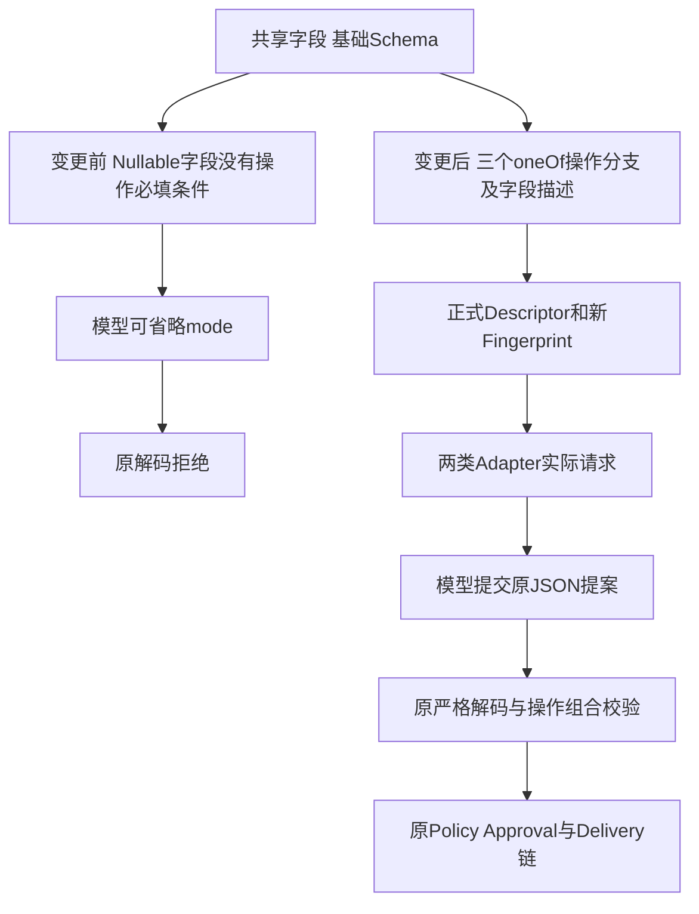
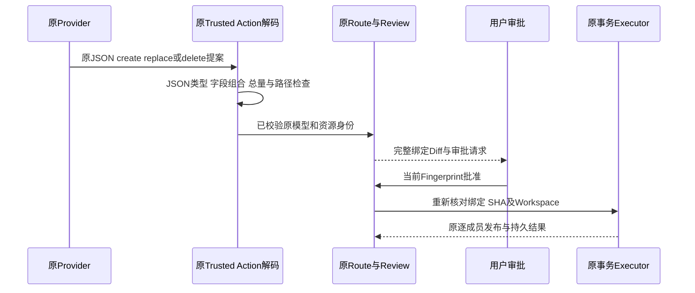
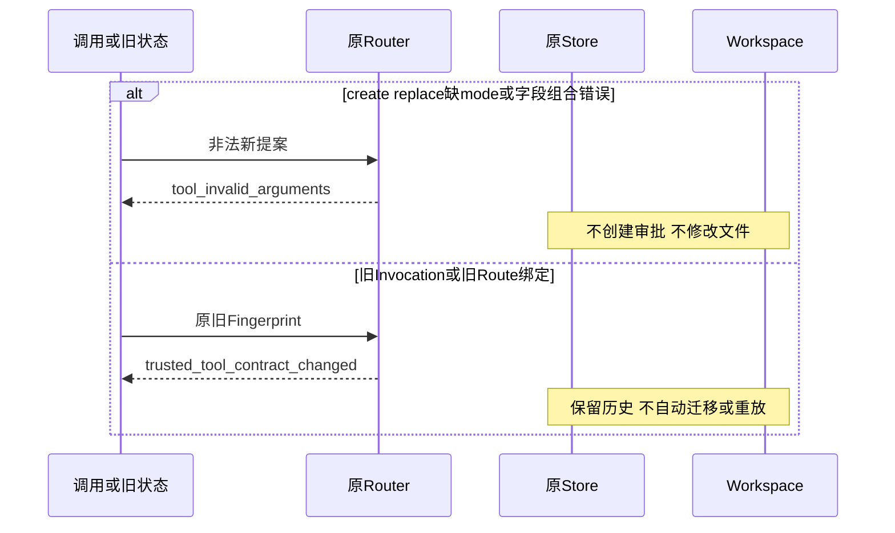

# R3 Workspace Patch操作组合的模型可见契约

## 1. 摘要与当前边界

本变更纠正模型可见JSON Schema与既有解码约束之间的表达缺口，不增加写入权限或新的文件事务后端。
原`WorkspacePatchFile.operation_shape`、参数JSON、Tool版本、审批、事务及恢复算法保持。
Schema和描述变化会改变Tool Fingerprint及Binding；旧身份不得自动获得新合同授权。
离线合同通过不代表线上模型能完成任务，有限Provider认证及完整20 Trial仍分别开放。

## 2. 需求背景与源码研究

[原真实失败](../validation/public-budget-product-provider-2026-09-29-v1/README.md)中，
模型三次替换提案均缺少`mode`，严格解码均拒绝；审批数量为0、工作区未改变。
前三次读取及Patch前置SHA正确，末次读取因累计Token预算拒绝。
这不是文件摘要损坏，也不能由宿主补值、改写提案或提高预算来掩盖。

[`WorkspacePatchFile`](../../src/harnessix/delivery/trusted_action_contracts.py)将三类操作共用字段表达为
nullable/default-null，再由运行时校验组合；原生成Schema只有`operation/path`必填。
[`workspace_patch_descriptor`](../../src/harnessix/delivery/trusted_action.py)只说明SHA前置条件，未说明mode。
因此模型能看到“mode可省略”，却看不到创建/替换时必填的条件。

既有[Tool Runtime研究](../research/tool-runtime.md)区分模型Schema与执行权限，本变更沿用此边界。
JSON Schema的[`oneOf`](https://json-schema.org/understanding-json-schema/reference/combining#oneof)
要求且仅允许一个分支成立；三个不同operation常量互斥，适合发布此条件。
两类Adapter的实际请求构造器直接传递Descriptor Schema，见下述源码映射；本地映射证明不等于远端接受或模型行为认证。

## 3. 设计目标、非目标与约束

1. 将create/replace/delete的原必填和不可用字段条件明确发布给模型。
2. 保留历史合法输入，包括空正文及可省略/显式null的非适用字段。
3. 原非法组合仍由正式解码器拒绝，不能创建Route、审批或文件效果。
4. Schema随正式Descriptor进入两类Adapter，不维护验证专用工具或Prompt。
5. 旧Invocation及旧持久Route使用原合同变化错误拒绝；不补签、迁移或自动重放。

非目标：不优化Agent策略、不新增Provider、修改价格/预算或降低20 Trial评分；
不修改SQLite Schema、Content Blob、NTFS/POSIX发布及Reconcile实现。
总UTF-8字节、控制字符、重复路径和平台能力仍属于运行时校验，不声称JSON Schema能表达全部约束。

## 4. 总体架构与变更前后



图示说明：新增部分只在模型合同发布侧；执行侧不加入默认mode或修复参数的中间件。
Adapter同步构造请求，Provider异步返回提案；提案仍在进入Route前重新解码。
源码映射：字段和分支位于`trusted_action_contracts.py`；Descriptor位于`trusted_action.py`；
Adapter位于`_chat_mapping.py/_anthropic_mapping.py`；严格准入位于`planning._normalize_invocation`。

## 5. 模块职责与禁止边界

| 模块 | 职责 | 禁止行为 |
|---|---|---|
| Delivery合同 | 原字段、组合校验和JSON Schema分支 | 将缺mode转为420；为模型扩权 |
| Descriptor | 操作说明、完整正文与十进制模式说明 | 在Prompt中隐藏验证专用标准答案 |
| Adapter | 原样发布同一Schema | 删除分支或维护供应商专用宽松Schema |
| Trusted Action | 原严格解码、来源、Fingerprint和资源规划 | 为旧指纹补签；忽略审批或SHA漂移 |
| Delivery Executor | 批准后按原事务发布，取消后只观察恢复 | 因Schema改变重放旧未知效果 |

## 6. 接口设计、类、字段与数据结构

`WorkspacePatchFile`仍是同一个Pydantic模型，不拆成三种Python类型，避免改变序列化和调用签名。
用`ConfigDict.json_schema_extra`增加三个互斥分支；根字段类型、长度及additionalProperties规则继续由原字段生成。
分支只补操作相关条件，保留原`operation_shape`作为执行权威。

| 操作 | 必填且非null | 必须省略或null | 其他要求 |
|---|---|---|---|
| create | operation、path、content、mode | expected_sha256 | content可为空；mode只允许420/493 |
| replace | operation、path、expected_sha256、content、mode | 无 | 前置SHA来自可信读取；content为完整新正文 |
| delete | operation、path、expected_sha256 | content、mode | 不允许以空字符串替代null正文 |

`operation/path`由根Schema声明必填，分支不重复；`content/mode/SHA`由各分支补required与非null类型。
mode为JSON十进制整数：420对应0644，493对应0755，不是字符串或八进制字面量。
POSIX原能力支持两种模式，Windows原受管写入只支持逻辑0644；Schema是跨平台合同，平台能力仍执行时检查。
路径最多4096字符、文件最多16个、总正文512 KiB等原限制不变。

## 7. 正常流程与数据流



图示说明：模型字段只表达意图；执行身份、租约、事务和Artifact由原宿主持有。
数据流为“模型Schema→Provider请求→提案JSON→校验→Route/Approval→效果事实”，不新建状态库。
正文仍只在原私有状态和受保护Review中流动，错误不公开原始参数。

## 8. 失败与恢复时序



图示说明：Invocation在规划前拒绝，持久Route在执行前由原`_matching_definition`拒绝。
已经发生的未知效果仍保留原记录，不能用新Schema重新生成Invocation来绕过原副作用身份。
旧未执行提案需结束原等待并从当前Workspace发起新任务、重新审批，不能继承旧批准。

## 9. 持久化、并发、幂等与兼容

不改业务数据结构、SQLite版本、字段默认值或规范JSON导出；v1 Tool和输入Spec版本保持。
这是既有运行时条件的公开表达纠正，不改变原接受集合，测试核对历史合法JSON。
Schema摘要和描述均参与Tool Fingerprint，Binding随之变化；变化不能伪装成原身份。
原Route/Approval持久事实保持；旧契约拒绝属于明确安全边界，不代表升级恢复已验收。
并发、写屏障、幂等键和Transaction ID全部复用原实现。

## 10. 取消、超时、错误与未知结果

仅合同发布及同步解码发生变化，无新增后台任务或超时设置。
缺mode保持`tool_invalid_arguments`，旧绑定保持`trusted_tool_contract_changed`。
既有超时/取消、Lease释放、UNKNOWN及成员级恢复回归必须继续通过；不以线上模型再次失败为理由自动重试。

## 11. 安全与隐私

不在Schema或描述放入密钥、用户路径或业务正文，不扩大平台权限。
SHA、完整Diff、审批后漂移及无重复发布仍由原控制保护；Schema合法不意味着已授权执行。
校验失败不返回参数正文、内部Validator错误或反事实修正值。

## 12. 可观测性

复用Tool Call/Result、固定错误码、Route、审批及Model Usage事实，不新增遥测。
归因应区分“模型字段未满足原合同”“平台不支持”“审批拒绝”和“执行失败”。
离线Schema矩阵、原失败及后继真实验证分别记录，不把模型响应改写成成功。

## 13. 测试设计与验收标准

| 验证 | 具体覆盖 | 完成条件 |
|---|---|---|
| 操作矩阵 | 3操作，每操作112种SHA/content/mode省略、null和合法/非法值组合，共336组合 | 模型可见Schema与原JSON解码对操作字段的判定一致 |
| 必填可发现性 | 实际Descriptor的三个分支与required | create/replace缺mode被Schema拒绝；delete条件正确 |
| 描述 | 完整正文、十进制420/493及Windows限制 | 不依赖验证宿主提示 |
| Adapter | 两类实际build_request | 正式Schema不被转换丢失 |
| 兼容 | 冻结旧Descriptor、历史合法JSON及新旧Fingerprint | 原字段导出不变，旧授权不继承 |
| 原主链 | 审批、真实文件事务、取消、SHA漂移、确认丢失与只观察恢复 | 受影响回归通过 |
| 线上 | 新固定源码与新计划的真实审批/取消认证 | 单独保留成功或失败，不能从离线成绩推导 |

离线336组合只检查所枚举操作字段；不冒充所有Unicode、总字节、重复路径或平台权限的完整Schema等价证明。

## 14. 源码与测试映射

| 元素 | 源码与符号 | 测试 |
|---|---|---|
| 条件发布与原解码 | [`trusted_action_contracts.py`](../../src/harnessix/delivery/trusted_action_contracts.py)：`WorkspacePatchFile.operation_shape` | [`test_patch_input_schema.py`](../../tests/delivery/test_patch_input_schema.py)：字段矩阵 |
| 正式描述与身份 | [`trusted_action.py`](../../src/harnessix/delivery/trusted_action.py)：`workspace_patch_descriptor/workspace_patch_binding` | 同一测试：旧Descriptor与Fingerprint |
| Chat映射 | [`_chat_mapping.py`](../../src/harnessix/models/_chat_mapping.py)：`build_request` | 同一测试：实际Provider Payload |
| Anthropic映射 | [`_anthropic_mapping.py`](../../src/harnessix/models/_anthropic_mapping.py)：`build_request` | 同一测试：实际Provider Payload |
| 严格入口 | [`planning.py`](../../src/harnessix/trusted_actions/planning.py)：`_normalize_invocation` | [`test_router.py`](../../tests/trusted_actions/test_router.py) |
| 旧持久绑定 | [`router.py`](../../src/harnessix/trusted_actions/router.py)：`_matching_definition` | [`test_trusted_action_patch.py`](../../tests/delivery/test_trusted_action_patch.py) |
| 原审批事务 | [`trusted_action.py`](../../src/harnessix/delivery/trusted_action.py)：`WorkspacePatchTransactionPlanner` | 同一测试：批准、漂移、取消及恢复 |

## 15. 核心业务逻辑伪代码

```text
公开合同：
    schema = 原字段生成的基础Schema
    schema.oneOf = create条件 / replace条件 / delete条件
    descriptor = 原Tool身份 + 具体操作说明 + schema
    fingerprint = 原完整Descriptor摘要
    两类Adapter原样发送schema

实际准入：
    原Invocation指纹不匹配 -> 原合同变化错误
    原JSON解码或operation_shape失败 -> 原参数错误，不创建Route
    合法 -> 原资源规划、审批及事务
    旧Route执行前Binding不匹配 -> 原合同变化错误，不写入
```

## 16. 风险、部署与后续

生成`spec/workspace-patch-input-v1.schema.json`并核对只有该公开合同变化。
无需数据库迁移或中间件安装；三平台部署仍使用单一Wheel。
Schema分支及描述增加输入Token，真实认证须核对实际用量与原预算，不复制旧请求成本。
部分Provider可能不接受此Schema形状，或模型仍产生非法提案；必须由新真实验证证明，不能回退为宽松解码。
当前变更不关闭R1、R3、R4或整体1.0，原0/20、Windows11、版本升级及独立Beta门禁保持。

## 17. 实施验证记录

基线上的8项新合同测试均为FAIL，证明缺失组合条件、操作说明及Adapter发布条件。
当前开发候选焦点17项通过，包含336个操作字段组合及真实持久旧批准拒绝。
原`operation_shape`、UTF-8正文和总量校验的AST逐项相同；严格入口、Router及文件发布源码逐字未变。
Schema生成仅改变`workspace-patch-input-v1.schema.json`；mypy检查392个源码文件通过。

Python3.12受影响2960项中2890通过、70项因平台/执行环境跳过。
Python3.13首轮同范围出现2项Task Pack导入失败，原日志保留；启动环境的PYTHONPATH同时含源码及
项目根目录，子进程继承后把Task Pack的tests解析成Harnessix测试包。
只保留源码路径的对照使原2项通过，随后完整相同2960项重新执行，2890通过、70项跳过。
没有修改Task Pack、原检查、Golden Solution或Grader；此环境对照不计真实质量成绩。

旧合同夹具的初次注册被原`trusted_tool_schema_mismatch`拒绝，说明注册门禁有效；
后继夹具使用既有成对Schema/Decoder端口登记冻结旧Schema，原解码约束不变。
错误的`tests/sdk`命令路径导致一次收集失败；SDK回归实际位于`tests/app_server`，收集失败不计通过。
所有原失败与后继结果分别保留，当前记录不关闭线上认证或商用发布。
