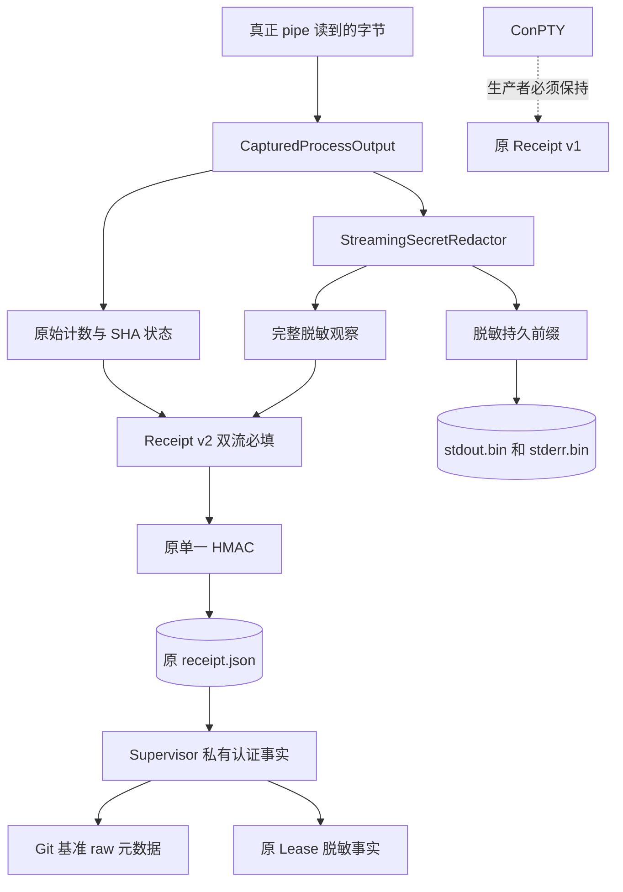
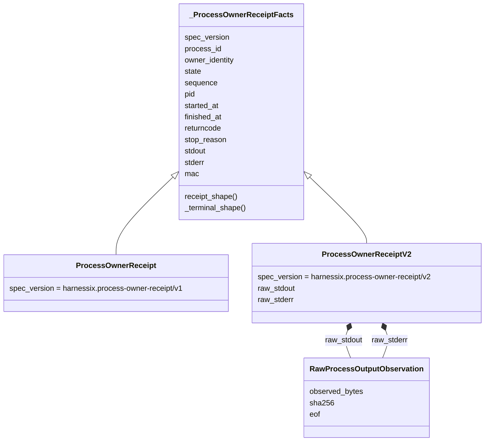
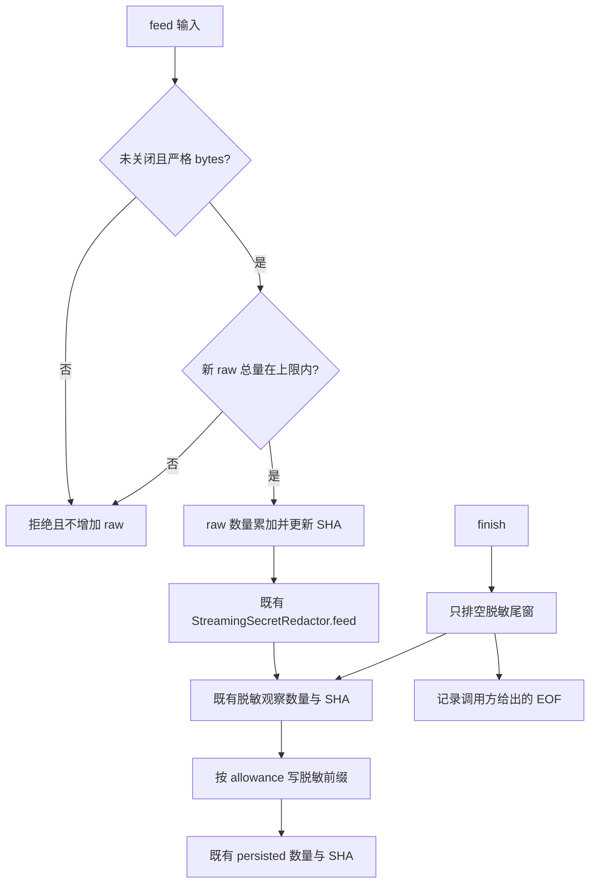
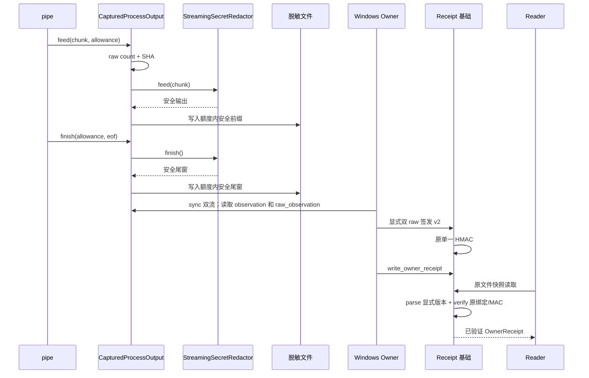
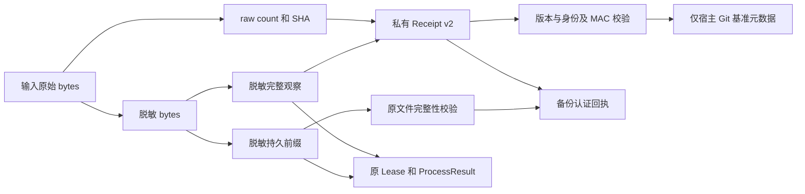
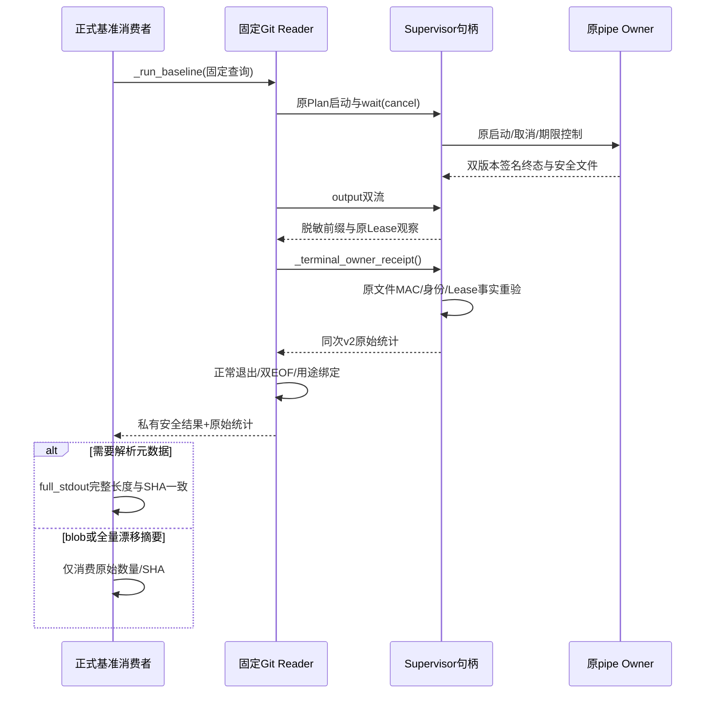

# R4：Windows Git 原始观察认证与安全发布分离

## 1. 需求背景与当前边界

Windows Git 读取经 `WindowsGitReadProcess`、`WindowsProcessSupervisor` 和 Windows Owner/Job
运行。初始基线中的 `CapturedProcessOutput.feed` 先调用 `StreamingSecretRedactor`，再对脱敏流累计
`observed_bytes/sha256`，仅将额度允许的脱敏前缀写入 `stdout.bin/stderr.bin`。
`ProcessOwnerReceipt` v1 用单一 HMAC 认证这些事实，Supervisor 将脱敏观察投影到原 Lease。
候选的新双版本行为见后续设计与接线状态。

Git 交付基准的 `product_config/git_baseline.py` 需要原始 Git blob 的完整长度与 SHA-256。
脱敏结果可能与 blob 不同，不能将其摘要当作原始摘要。初始基线中
`git_read_windows.py:WindowsGitReadProcess.run` 在 `for_delivery=True` 且配置
`output_redaction` 时返回 `git_baseline_raw_observation_required`，属于正确的失败关闭，
不是待删除的冗余保护。关闭脱敏会使秘密落盘，也不是解决方案。

本变更覆盖原始捕获、双版本签名、Windows pipe Owner、Supervisor 终态重验、Git 私有读取、
交付基准消费和完整状态备份。原始正文不新增落盘位置；公开输出与 Lease 继续只承载脱敏事实。
源码基线为 `dde77231beafcfb1a9eb46a670fe0f3ccafc9705`，测试证据必须绑定实际受测源码。
本机合同验证与 Windows 原生验收分别记录，不以接线存在或 macOS 通过关闭 R4。
本变更不修改 R3 的 Task Pack、质量门槛、模型调用或实际费用账本。

## 2. 设计目标、非目标与取舍

### 2.1 目标

1. 同一 feed 输入在脱敏前独立累计原始字节数和 SHA-256；内存中仅新增整数和哈希状态。
2. 原脱敏 `observed_*`、持久前缀、额度、二进制 FD、部分写入和持久摘要合同不变。
3. 原始观察仅包含严格有界的 `observed_bytes`、64 位小写十六进制 `sha256` 和严格布尔 `eof`。
4. 保留 v1 类型名字、字段顺序、默认值、规范 JSON、HMAC 和原调用结果字节；v2 必填双流原始观察。
5. 原 HMAC 同时覆盖版本、全部原事实和双流全部 raw 字段；不增加第二把密钥或单独签名。
6. 统一显式版本解析、读取、写入和验签；旧 v1 模型拒绝 v2，不容忍降级或补齐。

### 2.2 非目标

- 不修改既有公共合同、Agent Protocol、ProcessLease、公开 ProcessResult 或原 v1 schema；
  独立新增 v2 private-IPC machine schema，与原生成路径同步。
- 不修改 ProcessLease、ProcessResult、ProcessStream 或 SQLite；不增加迁移与旁路数据库。
- 不新增 raw 正文缓存、raw 文件、raw 内容返回端口、通用 Shell 或 Git 写入能力。
- 不提高原输出预算；pipe 的原始量与脱敏发布量分别受同一数值上限约束。
  取消、超时、Job 回收、恢复权限、旧 PID 处理及私有目录规则保持不变。
- 不使 ConPTY 获得双流 pipe 原始认证；其生产者必须继续签发 v1。
- 不增加独立服务、HTTP/Worker 接口或数据库迁移；不扩大产品首发平台支持范围。

### 2.3 取舍

共用事实 base 加独立 v1/v2 子类，避免覆写 `Literal[v1]` 为 `Literal[v2]` 的类型不兼容。
base 的版本字段无默认值，两个具体子类各自提供 Literal 和原序列化位置。
原始计数上限取 `2**63-1`，与有符号 64 位整数边界一致；消费方必须精确解析整数，不能经浮点取整。
它不是运行预算，不能代替
既有输出停止线。原始完整观察不能受 64 MiB 持久前缀上限约束，否则截断后的事实将丢失。

不比较 raw 与脱敏长度：四字节保护值替换成十字节 `[REDACTED]` 会变长；长保护值替换会变短。
不从脱敏长度、摘要或 EOF 推断任何 raw 字段；即使看似相同，也不构成原始认证证明。

## 3. 总体架构与源码映射

下表为完整生产链的源码职责映射。实现状态与验证范围分开：源码已接线不代表 Windows 原生通过。

| 文件 | 当前基础交付或后续职责 | 本次状态 |
|---|---|---|
| [`owner_output.py`](../../src/harnessix/processes/owner_output.py) | feed 前原始计量；`raw_observed`、`raw_observation()` | 实现 |
| [`owner_receipt.py`](../../src/harnessix/processes/owner_receipt.py) | raw 模型、v2、版本解析、原 HMAC、双版本读写验签 | 实现 |
| [`windows_owner.py`](../../src/harnessix/processes/windows_owner.py) | 真正 pipe 双 raw 签发、二进制读 FD、raw 进度、独立 raw/脱敏预算；ConPTY 保持 v1 | 配套接线已实现；专项验证独立 |
| [`supervisor.py`](../../src/harnessix/processes/supervisor.py) | OwnerReceipt 联合类型；`_terminal_owner_receipt()` 重验退出 Lease 原事实与 MAC，不重放；Lease 仍投影脱敏事实 | 配套接线已实现；专项验证独立 |
| [`receipt_projection.py`](../../src/harnessix/processes/receipt_projection.py) | 原始回执认证和原Lease字段投影；不执行Store状态提交 | 实现 |
| [`windows_owner_observation.py`](../../src/harnessix/processes/windows_owner_observation.py) | CRT输出FD、原始进度和启动失败输出回执；不启动/控制进程 | 实现 |
| [`git_read_windows.py`](../../src/harnessix/processes/git_read_windows.py) | `run_baseline` 在正常终态、双流 EOF、完整绑定下选择认证 raw；缺失 v2 时继续拒绝 | 独立 Git 集成候选已接线；专项验证独立 |
| [`git_observation.py`](../../src/harnessix/processes/git_observation.py) | 私有 `GitBaselineReadResult` 分离安全正文与原始统计；解析正文前核对完整原始摘要 | 实现 |
| [`git.py`](../../src/harnessix/tools/git.py) | `_run_baseline` 传递分离的 raw 元数据，不污染普通 Tool 输出合同 | 独立 Git 集成候选已接线；专项验证独立 |
| [`git_baseline.py`](../../src/harnessix/product_config/git_baseline.py) | blob 长度/摘要消费 `raw_stdout`；结构化正文须原始量／摘要一致 | 独立 Git 集成候选已接线；专项验证独立 |
| [`state_backup_records.py`](../../src/harnessix/product_config/state_backup_records.py) | 用 `parse_owner_receipt` 显式解析双版本并验原 MAC；文件仍只与 persisted 脱敏前缀比较 | 配套接线已实现；专项验证独立 |

新增 `git_observation.py` 定义私有 `GitBaselineReadResult`，将安全 `ProcessResult` 与双流 raw
元数据分离，禁止混入公开 `ProcessStream`。该结果不存储原始正文或认证密钥。
基线备份代码直接调用 `ProcessOwnerReceipt.model_validate_json`，只接受 v1；当前变更已使用
统一 parser。旧版本备份仍拒绝 v2，因此部署时必须保持生产者和双版本 Reader 同步升级。
POSIX Owner 的签名调用不传 raw，仍生成原 v1；POSIX Git 原有直接 capture 可提供完整原始统计，
但不得将这条适配路径用于 Windows 已脱敏的 `ProcessStream`。

机器合同目录原本登记 `ProcessOwnerReceipt`，候选生成脚本
`scripts/generate_specs.py` 另行登记 `ProcessOwnerReceiptV2`，生成
`spec/process-owner-receipt-v2.schema.json`。原 `spec/process-owner-receipt-v1.schema.json`
必须保持字节不变；新 schema 是独立私有 IPC 版本，不扩展 Agent Protocol 或公开结果形状。
生成器、独立 v2 schema 与双版本 Reader 必须一并交付，避免生产者升级而备份或消费者仍只识别 v1。

### 3.1 架构图



实线展示当前实现的数据关系；ConPTY 的虚线表示不同终端合同，不表示可回退为 pipe raw 证明。
候选 Windows pipe Owner 已调用 v2。原始正文只经过 feed 的
当前参数和既有脱敏器有界窗口，不在新增结构中保存。认证事实与文件摘要属于两个独立命名空间。

### 3.2 Owner、Supervisor 与备份的实现边界

- Windows Owner 的 `_start_reader` 调用 `configure_binary_output_reader`，以 `sys.platform == "win32"`
  进行 typeshed 可缩窄的平台门禁，
  仅对真正 pipe 的 stdout/stderr 调用 CRT 二进制模式，
  避免 LF/CRLF 与 Ctrl-Z 变换破坏 raw 事实；不修改 stdin 或 ConPTY 通道语义。
- `_output_position` 将双流 raw 进度加入发布进度，防止脱敏器尾窗使实际新增输入无法触发观察。
- `_check_output_limit` 独立检查双流 raw 总量与双流已发布脱敏总量，任一超预算都有效；
  raw 预算只用于 pipe，脱敏预算维持原行为。EOF 排空后的占位符也检查预算。
  `None/exited` 可转为 `output_limit`，但取消、超时等其他停止原因不被覆盖。
- `_terminal_owner_receipt()` 只接受已退出 Lease，重新读取并核对原 MAC、process、owner、
  PID、开始/结束时间、returncode、停止原因及双流脱敏观察；本句柄已记住原 Receipt 序号时
  还要求相同序号。不重放命令，不把 Lease 终态缓存作为 raw 身份认证。
- 备份 `_process_files` 经统一 parser 解析原 Receipt 后继续验原 MAC，物理文件仍核对
  Lease 中的 `persisted_bytes/persisted_sha256`，不将 raw hash 当成文件 hash。

原有长类不继续增长：`receipt_projection.py`只生成原Lease更新字段，CAS、Store提交、句柄锁与
控制关闭仍由Supervisor执行；`windows_owner_observation.py`隔离纯观察逻辑，Job控制仍由Owner执行。
`GitReadRuntime`保留原入口，普通工具固定命令调度与仓库根校验由同模块窄函数负责。
未提高可读性阈值、放宽批准热点或新增一级包依赖边；最终静态报告随实际源码刷新。

这些模块分别具有受影响专项验证；源码接线存在不等于 Windows 原生验证完成。

备份关联专项为 `test_raw_receipt_backup_and_restore_keep_signed_bytes`，使用完整默认产品状态、
真实宿主平台 Owner 和完整 Plan，再以已知无保护值的小输出夹具分别组装 v1/v2，
仅用于独立测试，不模拟生产补签或追认历史。正常场景执行完整 backup/verify/restore，
要求两个 Receipt 保持原字节；实际进程结束后将 `subprocess.Popen` 替换为禁止启动，证明不重放。
负例在不重签的情况下篡改 raw SHA，要求备份拒绝、源篡改字节保持不变且不发布备份目录。
这两项参数化场景和既有 backup/restore 回归验证状态闭合；真实 Windows 原生结果仍须另行记录。

## 4. 领域契约、数据结构与接口设计

### 4.1 RawProcessOutputObservation

定义于 `owner_receipt.py`，可直接导入；不进入公开 `supervision_contracts.py`。
继承既有严格、冻结、禁止额外字段的 `SupervisionContract`。
raw 模型启用实例重校验，签名时不能通过 `model_copy` 绕过字段约束。

| 字段 | 类型和约束 | 语义 |
|---|---|---|
| `observed_bytes` | 严格 int，`0 <= value <= MAX_RAW_PROCESS_OUTPUT_BYTES = 2**63-1` | 本流实际 feed 的原始字节总数 |
| `sha256` | 严格 str，长度 64，`[0-9a-f]{64}` | 全部已观察原始字节的 SHA-256 |
| `eof` | 严格 bool，无默认值 | 流结束事实；零字节不自动意味着 EOF |

零字节流必须使用 SHA-256 空摘要
`e3b0c44298fc1c149afbf4c8996fb92427ae41e4649b934ca495991b7852b855`。
非空摘要只能验证格式，正文不保留，所以 Reader 无法重新计算 raw SHA；真实性来自可信 Owner 的
增量捕获与 HMAC。原始数据的低熵哈希可能支持猜测，raw 元数据必须仍留在私有状态，不向模型发布。

### 4.2 Receipt 层级

共用事实字段保持原合同：

| 字段 | 类型／约束 | 含义 |
|---|---|---|
| `spec_version` | 具体子类固定 v1 或 v2 Literal | 与全部事实一起认证的显式版本 |
| `process_id` | UUID，必填 | 原 Process 身份 |
| `owner_identity` | Revision，64hex，必填 | 原 Owner 身份 |
| `state` | running/exited/failed/unknown，必填 | 原 Owner 状态 |
| `sequence` | 严格 int，最小 1，必填 | 原发布序号，不是 SQLite Lease CAS 序号 |
| `pid` | int 或 null，2 至 `2**32-1`，默认 null | 与 started_at 同时存在或同时缺失 |
| `started_at` | datetime 或 null，默认 null | 开始事实；终态校验要求有时区且不晚于结束时间 |
| `finished_at` | datetime 或 null，默认 null | 终态必填且必须有时区，运行态必须 null |
| `returncode` | int 或 null，`-(2**31)` 至 `2**32-1`，默认 null | exited 必填；其他状态禁止 |
| `stop_reason` | 原 ProcessStopReason 或 null，默认 null | 运行态禁止；终态必填并受状态约束 |
| `stdout/stderr` | 原 ProcessOutputObservation，各自必填 | 完整脱敏计量与持久前缀计量，不含 raw |
| `mac` | Revision，64hex，必填且 repr 隐藏 | 原唯一 HMAC |
| `raw_stdout/raw_stderr` | RawProcessOutputObservation，仅 v2 各自必填 | 原始 pipe 元数据，无默认和 null |

running 必须有 PID/started_at，不能有结束／停止／返回码；exited 还须 returncode。
failed 不得有运行身份，只允许 `launch_failed`；unknown 只允许 `cleanup_failed/unknown`。
原状态校验代码复用，不额外改变 v1 接受规则。原脱敏观察继续包含
`observed_bytes/persisted_bytes/sha256/persisted_sha256/truncated/eof`；持久量不超过完整脱敏量，
持久量上限仍为 64 MiB，截断位必须等于两者差异，零量摘要仍须为空摘要。



`OwnerReceipt = ProcessOwnerReceipt | ProcessOwnerReceiptV2`。v1 字段集合仍只有原事实；raw 字段在
v1 属于未知字段，必须拒绝。v2 双流 raw 字段无默认值，不可为 null；保留原事实状态校验。
运行中可能存在已观察但尚未由脱敏器发布的尾窗，故两个统计可暂时不同。
具体字段顺序仍从 `spec_version` 开始，至 `mac` 保持原 v1 顺序；v2 追加双 raw 字段。

### 4.3 接口设计

| 接口 | 输入／输出 | 行为 |
|---|---|---|
| `CapturedProcessOutput.raw_observed` | 只读 int | 获取当前 raw 累计量，不受 allowance 截断 |
| `CapturedProcessOutput.raw_observation()` | 返回 RawProcessOutputObservation | 原始 digest 当前快照与当前 eof，不含正文 |
| `CapturedProcessOutput.feed(data, allowance)` | 原 bytes、脱敏持久额度；返回脱敏发布量 | 拒绝关闭流、非 bytes 和 raw 越界后，先计 raw，再调脱敏器 |
| `finish(allowance, eof=...)` | 原接口 | 只排空脱敏尾窗；不再次计 raw；完成后两种观察使用同一 eof |
| `sign_owner_receipt(..., raw_stdout=None, raw_stderr=None)` | 原参数外增加两个可选 raw 参数 | 均未提供时原 v1；均提供时 v2；仅一个非 null 时拒绝 |
| `parse_owner_receipt(body)` | UTF-8 JSON bytes 或 str，最多 64 KiB；返回 OwnerReceipt | 必须显式存在合法 spec_version；按版本校验，无推断 |
| `owner_receipt_mac(receipt, owner_token)` | OwnerReceipt、原 32 字节 hex token | 原规范化算法，排除 mac，覆盖其余全部字段 |
| `verify_owner_receipt(receipt, owner_token, process_id, owner_identity)` | 原绑定参数；返回 OwnerReceipt | 先经版本 parser 重校验，再核对绑定和原 MAC |
| `read_owner_receipt(...)` | 原文件／身份参数；返回 OwnerReceipt | 原有界快照读取与 Windows 重试不变；解析后验签 |
| `write_owner_receipt(path, receipt)` | 原接口接收联合模型 | 先经 parser 重校验，原私有原子发布逻辑不变 |

签名函数的类型重载区分原 v1 调用和显式双 raw v2 调用，保留既有 v1 源码类型推断。
另提供显式双可空 raw 参数的联合返回重载，供 pipe/ConPTY 条件分支调用；不齐仍由运行时拒绝。
Reader 与验签返回联合类型，Supervisor 显式处理该类型，不以不准确的 v1 返回注解隐藏 v2。
parser 本身只完成语法／合同校验，**不代表验签**；使用方必须调用原 verify 或 read。

### 4.4 Git 私有结果与调用边界

[`GitBaselineReadResult`](../../src/harnessix/processes/git_observation.py) 是冻结且有 slots 的宿主内部
数据类，不是 Agent Protocol 消息，不进入模型工具 Schema，不提供持久化或跨调用缓存。

| 字段或方法 | 类型 | 业务含义与约束 |
|---|---|---|
| `result` | 原 `ProcessResult` | 安全正文与脱敏统计；隐藏 repr，正常退出、返回码 0、无终止信号、双 EOF |
| `raw_stdout/raw_stderr` | `RawProcessOutputObservation` | 同次调用认证的原始统计，必须双 EOF；隐藏 repr |
| `full_stdout()` | `bytes` | 仅接受未截断、正文长度等于 raw 数量且正文 SHA 等于 raw SHA 的完整元数据 |
| `from_posix_capture(result)` | 私有类方法 | 原 POSIX capture 的完整流统计转换；不得用于 Windows 脱敏结果 |

Windows `run_baseline()` 只允许 `for_delivery=True` 的固定宿主端口。普通 `run()` 保持原
`ProcessResult` 语义，不返回 raw。`GitReadRuntime._run_baseline()` 不接收模型任意命令，
其调用仅来自正式基准内部固定查询；原全部 Git 参数、环境、可执行文件与 Workspace 守卫仍生效。
交付 Reader 的绑定指纹增加 `git-raw/v2` 用途标记，Windows 底层用途为
`git-delivery-baseline/raw-v2`，防止不同证明能力被当作同一个旧 Reader 身份。

需要解析的根路径、配置键、Commit/Tree/Ref、选中 Tree/Index/flags/debug 条目均须
`full_stdout()` 成功。全量 Index 与 Status 只作原始摘要漂移观察，不解析安全正文，允许脱敏替换；
blob 只用于原来源完整长度/SHA 比较，不需要也不允许恢复被替换的秘密正文。
完整 Index/blob 的原 8 MiB 上限、stdout 原 1 MiB 前缀、stderr 原 16 KiB 前缀保持不变。

### 4.5 规范化及版本认证

规范签名字节为：模型 JSON 模式 dump，排除且仅排除 `mac`；`ensure_ascii=False`、
`sort_keys=True`、`separators=(",", ":")`、`allow_nan=False`，再 UTF-8 编码。
HMAC-SHA256 的密钥仍是原 owner token，长度必须为 32 字节。
v2 的 `spec_version`、`raw_stdout`、`raw_stderr` 和所有内层字段自然进入原规范化 payload。
任何版本改写、raw 修改或删除都不能沿用原 MAC 通过验证。

## 5. 持久化与数据流程、核心时序

### 5.1 捕获流程



feed 的持久前缀 allowance 仍以脱敏量为准；Owner 在每次 feed 及 EOF 排空后分别核验
原始总量和已发布脱敏总量，防止保护值替换压缩或膨胀绕过原输出预算。
写入失败发生在 raw 更新之后时，raw 如实包含已经接收的字节，但调用方必须走失败/未知路径，
不得把这份非完整观察作为成功的 Git 基准。finish 幂等，不再更新 raw 摘要或字节数。

### 5.2 捕获、认证与读取时序



基础层可独立构造、签名、写入并读回 v2；候选 Windows pipe Owner 的运行、退出、启动失败和未知
发布分支均已显式传入两个 raw 观察，ConPTY 和未更改的 POSIX Owner 仍签发 v1。
Caller 仍须先 fsync 输出再发布 Receipt，基础写入函数不越权替 Caller 同步输出文件。

### 5.3 数据流与公开边界



不得将脱敏前缀与 raw `observed_*` 塞进同一个原 `ProcessStream`：其等长摘要校验和
`captured_bytes <= observed_bytes` 对变长替换不成立。候选采用分离的私有 raw 观察端口。
结构化 status/config 正文的脱敏可能影响解析；认证元数据不能恢复被替换的正文，遇到该情况仍应
明确拒绝，不把可验证 SHA 误当作可安全解析的原始内容。

### 5.4 伪代码

```text
feed(data, allowance):
    校验未关闭、严格 bytes、raw 累加不越界
    raw_count += len(data)
    raw_sha.update(data)
    safe = 原 redactor.feed(data)
    return 原 publish(safe, allowance)

sign_owner_receipt(facts, token, raw_stdout=None, raw_stderr=None):
    若 raw 仅一个存在：拒绝
    若两个存在：构造 v2(facts, 两个 raw)
    否则：构造原 v1(facts)
    使用原规范化和原 HMAC 替换 mac；不生成独立 raw 签名

parse_owner_receipt(body):
    校验正文 UTF-8 字节边界和 JSON 对象
    version 必须显式为 v1 或 v2
    按版本调用对应具体模型的 JSON 严格校验

verify(receipt, token, process_id, owner_identity):
    checked = parse_owner_receipt(receipt 的 JSON)
    校验 process、可选 owner 与原 HMAC；失败不回显正文或 token
    返回 checked

WindowsGitReadProcess.run_baseline(request, cancel):
    要求原固定交付用途、程序/期限/身份守卫
    原 Supervisor/Plan 启动 Owner；等待原取消/超时/排空流程
    要求正常退出、返回码 0、无终止信号和公开双流 EOF
    通过同一个原句柄重新读取终态 receipt；核对 MAC/身份/原 Lease 全部事实
    要求 receipt 为 v2，且原始双流 EOF
    返回私有 GitBaselineReadResult(安全 result, 原始双流统计)

collect_product_git_baseline(...):
    原认证 Patch 来源和 Workspace 身份预检
    根路径与配置键完整原始正文检查
    before = 固定 Commit/Tree/Ref 与完整 Index/Status/config 原始观察
    对每个来源成员核对 Tree/选中 Index/flags 和原始 blob 长度/SHA
    after = 同一组原始观察；要求 after == before
    再验 Workspace 身份和期限；生成原正式基准领域合同
    失败不修正用户仓库，不写 Index/HEAD/Ref，不重放命令
```

### 5.5 Git 读取与基准时序



这条调用链没有把 raw 正文重新读出，也没有为恢复启动第二个进程。单次读取失败或取消后，
原 `_drain` 必须完成对应任务回收；新的调用不能凭上一份回执或终态缓存获得原始认证。

## 6. 错误分类、恢复、兼容与安全

| 情形 | 处理与恢复边界 |
|---|---|
| raw 越界、bool/float/string 计数、非法 SHA、非 bool EOF、未知字段 | 合同拒绝；不截断、不修正 |
| 空流配非空摘要 | 合同拒绝；空流 EOF 可真可假，必须显式给定 |
| v2 缺任一 raw 或 raw=null | 拒绝；禁止从 redacted 补齐，禁止回退 v1 |
| 版本缺失／未知／降级并残留 raw | parser 拒绝；v1 模型仍拒绝未知 raw |
| 改写版本并删 raw、改写任意 raw 字段 | 即使结构有效，原 HMAC 失败 |
| token 格式或长度错误 | 原 `process_owner_token_invalid` |
| token/process/owner 不匹配或回执正文损坏 | 原 `process_owner_receipt_invalid`；不回显敏感输入 |
| 原子发布失败 | 原 `process_owner_receipt_write_failed`；原临时文件清理不变 |
| Windows 名称周转或瞬时共享冲突 | 原有界重试次数与延迟不变；MAC/版本损坏不重试 |
| I/O 截断、无 EOF、异常退出、未知状态 | 仅认证已读前缀事实，不得认证完整 Git 结果；Git 私有结果拒绝 |
| Owner 崩溃／重启 | 仅验证已发布原 Receipt；raw SHA 不能从脱敏文件续算；禁止重放命令补齐 |
| 旧 v1 Reader 遇 v2 | 明确拒绝；不是可透明降级的格式 |

新 Reader 可读原规范 v1 和 v2；旧已发布的 v1 模型与字节保持兼容。
旧模型允许省略默认版本的 Python 构造不变，但统一 parser 要求 JSON 显式版本；原 writer 总会写版本。
不得使用 `model_copy` 绕过合同直接交付；verify/write 会重新解析并校验模型。
无需读取真实 token：所有测试只使用固定合成的 64hex token 与保护值。
共享的原 MAC 和原身份绑定避免平行认证链；该证明不独立授予进程控制、PID 清理或仓库写权限。

### 6.1 可观测性与错误分类

| 可定位事实或错误 | 处置 | 可公开范围 |
|---|---|---|
| `git_baseline_raw_observation_required` | 原回执不是 v2，拒绝原始证明；不得自动降级或补签 | 固定错误码，不含回执正文 |
| `git_baseline_metadata_changed` | 可解析安全正文被替换或与 raw 不一致，拒绝决策 | 固定错误码，不含原始或安全正文 |
| `process_owner_receipt_invalid` | MAC、版本或原 Lease 身份/事实不一致，停止消费 | 固定错误码，不含 token |
| `timeout` / `TurnCancelled` | 保持原期限、取消和回收链，不记成功基准 | 原正式停止语义 |
| `git_baseline_limit` | 原始完整量或可解析正文前缀不满足上限 | 原正式错误码 |
| `git_baseline_changed` | 前后仓库观察漂移，要求重新开始而非拼接旧结果 | 原正式错误码 |

私有 `receipt.json` 中可观察显式版本、原发布序号、过程身份及双流计量；原日志与公开
`ProcessResult` 不增加 raw 或密钥。可机读验证记录必须区分宿主模拟、原生 Windows、安装验证、
真实模型质量与完整发布门禁，不能将其中一种观察推断为另一种结果。

## 7. 测试方案与验证标准

新增测试覆盖：严格 raw 模型负例；空流；二进制/非 UTF-8；跨块秘密；短保护值替换变长；长保护值
替换变短；双流独立计量；共享持久额度截断；零额度仍完整计 raw；finish 幂等；非法 feed 和溢出
不污染计数；文件中不存在合成秘密；v2 正常读写；双 raw 缺失/null；raw 各字段及版本篡改；
错误 token/process/owner；v1 原字段、JSON、规范 payload 与固定 MAC 黄金对照；旧 v1 Reader 拒绝 v2。

受影响回归包括捕获/回执、监督、Git 私有结果、正式交付基准、完整状态 backup/restore。
各测试集的选择器、实际解释器、输入摘要及 JUnit 记录在验证包中；集合重叠不累加。
测试在隔离工作目录以 `pythonpath=src` 导入受测源码；启动 Owner 的验证使用同一源码安装环境，
防止子进程通过其他环境的 editable 安装导入未受测版本。Windows-only 跳过不能计为原生通过。

复现准备及限定回归示例：

```bash
# 在已检出的候选源码仓库根目录执行。
UV_PROJECT_ENVIRONMENT="$PWD/.venv" uv sync --offline --locked --all-extras --dev
umask 022
PYTHONDONTWRITEBYTECODE=1 .venv/bin/python -m pytest -o pythonpath=src -p no:cacheprovider \
  tests/processes/test_raw_output_receipt.py \
  tests/processes/test_output_protection.py \
  tests/processes/test_output_binary_contracts.py \
  tests/processes/test_supervision_contracts.py \
  tests/processes/test_windows_receipt_contracts.py \
  tests/processes/test_receipt_snapshot_transition.py
```

私有证据的逻辑定位为 `Harnessix/verification/windows-raw-receipt-20260930-v1`，
目录 0700、日志及结构化证据 0600。pytest 工作目录／临时输出均隔离，证据只记录合成数据与路径。
macOS 上的 Windows 标志、端口替身和模型测试仅证明合同；原生 NTFS、CRT、Job、ConPTY 与真实
Windows Git 基准需后续 Windows 环境验证，不将 skip 或本机通过计为 Windows 原生通过。

## 8. 部署、集成与验收边界

本实现无数据库迁移、用户配置变更或产品 UI 变更。
候选已具备双版本备份解析、Supervisor 私有终态认证端口与 pipe Owner 双 raw 签发。
Git 运行时分离传递与基准消费已接线；发布仍要求完整生产链复验、Windows 原生验证与受保护回退。
本机通过不代替这些发布门禁。
ConPTY 保持 v1；旧 v1 观察不得以无脱敏为由包装成 v2。

集成验收必须核对：完整原 process/owner/sequence 绑定；pipe 类型来源；双 EOF 和正常终态；
真正原始 blob 长度及 SHA；安全文件前缀和备份校验；取消/超时/UNKNOWN/重启/旧格式负例。
捕获基础通过只代表合同可用；监督、Git 消费者、备份与平台专项分别证明对应实现。
`git_baseline_raw_observation_required` 必须保留为缺少 v2 原始认证的拒绝门禁，
不得恢复为通过脱敏统计补齐 raw 的降级；R4 不能据基础通过宣告完成。

## 9. 分层验证记录与范围限制

当前验证宿主为 macOS，工作目录为专属 worktree，导入路径明确覆盖为 `src`。
新增基础专项执行记录为**94 passed**，后继显式双Python验证单独绑定实际解释器，
不从运行环境名称推断Python版本。
离线锁定的专属环境执行第 7 节列出的六个测试文件：**171 passed, 7 skipped**；
其中已包含同一组 94 个新增专项，不能将两个数字相加作为独立覆盖数。
七个跳过项均为原生 Windows 的 CRT／NTFS 路径，本机通过不替代 Windows 原生验收。

最终分层合同、真实Git、来源及Rollback焦点在显式Python3.12.7与3.13.8各336通过，无跳过。
固定最终源码和测试的受影响扩大回归945通过、53平台跳过；输入前后摘要相同。
独立源码外Wheel指定313项通过，450包成员与当前源码一致，409个Python模块全部包含。
原始基础、扩大回归、双Python及Wheel集合存在交集，不能相加为独立覆盖数。

全部源码Mypy strict覆盖409文件；受影响源码和测试Ruff与格式检查通过。
原可读性策略不修改，长类结构收敛后刷新正式报告；机器Schema保持旧v1原字节。
六个Mermaid图已用实际安装的Chrome渲染，架构图采用纵向布局保证文字可读。
新增19个Windows原生用例；macOS只验证合同和收集，真实CRT/Job/Git仍要求原生CI。
完整事实、输入绑定、失败原件、Review Packet及复验边界见
[统一验证交付](../validation/windows-raw-git-observation-2026-09-30-v1/README.md)。
本记录不包含真实模型质量、消费者Windows11或商用发布验收。
