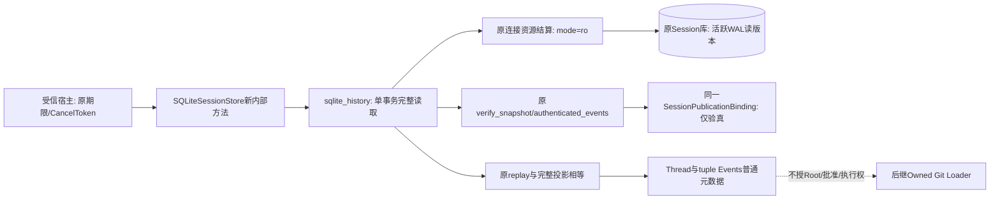
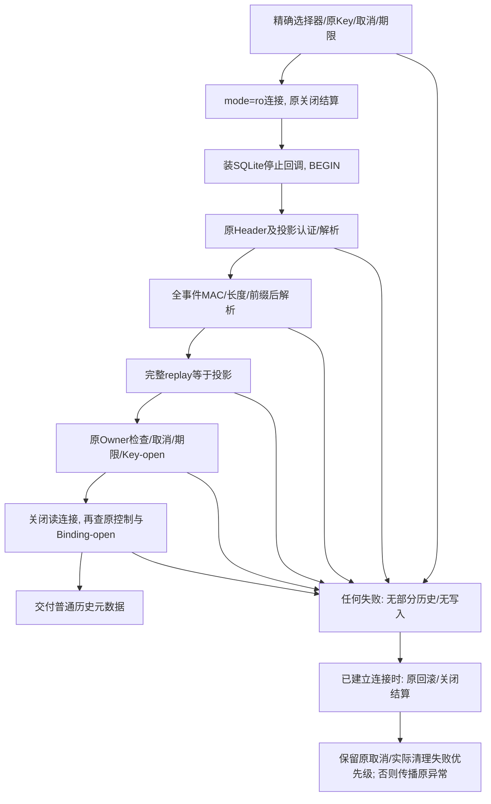
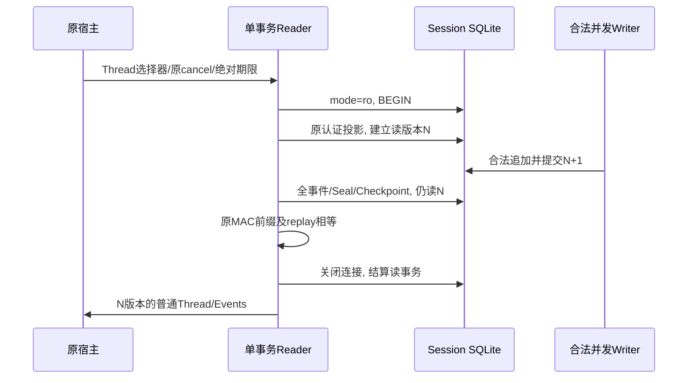
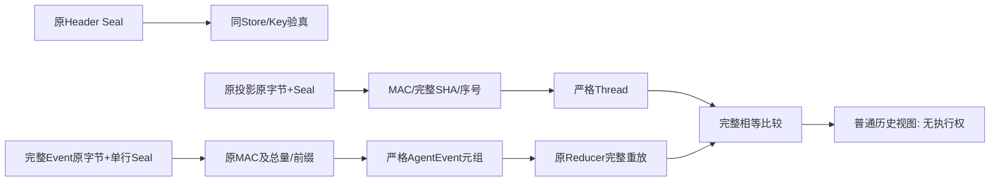

# 单事务认证Thread历史：总体与详细设计

## 1. 需求背景与当前边界

完整Git产品装载必须从原认证Session取得当前Thread的实际调用、批准和完整历史，不能接受调用者自行拼装的Thread。
现有[`get_thread`](../../src/harnessix/session/sqlite.py)与`events`分别建立独立连接和读事务。
两次调用之间允许合法追加；分别认证成功不表示两者属于相同SQLite读版本。
该缺口直接对应[完整Git交付设计](m09-r4-git-delivery-business-backup-closure.md)的来源与跨库核验前置。

本设计增加内部读取方法和普通元数据聚合，不增加模型Tool、SDK协议、Schema、Key、HMAC域或执行授权。
原接口继续保持行为。候选实现与62项正式新测试已落地；最新冻结输入的独立复审已闭环，安装验收尚待完成，不将组件通过当作产品交付完成。

## 2. 设计目标、非目标与不变量

1. 单连接、单`BEGIN`读事务内校验原Store Header、Thread投影和完整事件前缀。
2. 原MAC校验先于对应JSON解析；完整事件重放必须与已认证投影相等。
3. 原Key关闭、错误Key、缺证明、事件替换、投影替换和混合读版本不能返回部分结果。
4. 原`MAX_HISTORY_EVENTS/MAX_HISTORY_BYTES/MAX_PROJECTION_BYTES`及事件验证的10秒内部上限保持。
5. 调用者提供单一绝对单调期限和CancelToken；SQLite进度、每事件及交付前共用，不按步骤重置。
6. URI `mode=ro`不创建缺失主库；只读事务无DML、迁移、补签、修复或提交。
7. 父Task取消后结算原SQLite连接、回滚读事务并关闭；不留下后台数据库任务。

非目标：跨库原子快照、Fork祖先完整证明、当前物理Root所有权、Git对象归属、批准或执行能力。
合法恢复后的同Store/Key可读历史；旧Root、旧批准及返回对象本身均不能授权新执行。

## 3. 总体架构与模块边界



| 源码 | 职责 | 禁止承担 |
|---|---|---|
| [`sqlite.py`](../../src/harnessix/session/sqlite.py) | 扩展原连接为显式只读模式；增加薄委托方法 | 新认证算法、Git逻辑、默认迁移 |
| [`sqlite_history.py`](../../src/harnessix/session/sqlite_history.py) | 普通历史聚合、同事务读取、同一期限和取消、交付前核验 | Key托管、签发、公开输出、执行 |
| [`sqlite_publication.py`](../../src/harnessix/session/sqlite_publication.py) | 复用原MAC、完整前缀、原限额；增加可选`history_checkpoint`主线程检查点 | 第二套事件解析、替换旧证明 |
| [`reducer.py`](../../src/harnessix/agent/reducer.py) | 原事件语义重放 | 补签或推定执行所有权 |

部署仍使用原Wheel与原Session库；本接口不要求新的进程、服务、数据库或配置项。

## 4. 接口设计、类与字段

```python
await store.authenticated_thread_history(
    thread_id,
    cancel=original_cancel_token,
    deadline=original_absolute_monotonic_deadline,
    checkpoint=original_owner_checkpoint,  # 可省略；仅在调用方事件循环执行
)
```

| 参数/字段 | 类型与来源 | 核验及含义 |
|---|---|---|
| `thread_id` | 精确UUID，调用者选择器 | 仅选择原库Thread；UUID本身不是归属证明 |
| `cancel` | 原CancelToken | 领域取消，与父Task取消区分；不创建第二Owner |
| `deadline` | 有限float，`time.monotonic`绝对时间 | 原宿主统一期限；过期立即拒绝，不能传NaN/Inf/bool绕过 |
| `checkpoint` | 可选零参数函数 | 原Owner/Root等主线程检查；不在SQLite工作线程执行用户回调 |
| `AuthenticatedThreadHistory.thread` | 原严格Thread模型 | 已认证且与同一事务完整事件重放相等；仍是元数据 |
| `AuthenticatedThreadHistory.events` | 原AgentEvent元组 | 从序号1至当前序号完整、连续、原MAC前缀验证；无裁剪 |

聚合为冻结dataclass，无Key、MAC导出、issue、execute、resume或repair方法。
嵌套模型沿用原ContractModel；部分JSON字段仍包含普通容器，因此不声称抵御恶意同进程反射或修改。
每次读重新装载，消费者不能把copy/construct、对象身份或之前返回的元数据当作可转交执行凭据。

### 4.1 数据结构：内部控制对象与关键字段

| `_HistoryReadControl`字段 | 来源与职责 | 不变量 |
|---|---|---|
| `_store/_publication` | 原Store与入口捕获的实际Binding | 每次检查仍为同一实际Binding，调用原`_ensure_open`，不引入不存在的身份API |
| `_cancel/_deadline` | 原CancelToken与原绝对期限 | SQL、每事件和交付前共用；不新建Owner或重置预算 |
| `_owner_check` | 原可选同步检查点 | 只在调用方事件循环调用；正常返回后仍再查取消/期限/Binding |
| `_parent_check` | 原`parent_cancel_checkpointer` | 捕获入口Task取消计数，只传播本次新增取消；不清除父取消 |
| `_parent_aborted` | `threading.Event` | 父Task取消后先置位；SQLite线程据此停止，用户Owner回调不跨线程 |
| `_interrupted` | 原VM回调发现的首次停止异常 | 保留原异常对象，在稳定storage包装之前传播，不改写为SQL故障 |

`_OwnerCheckpointFailure`是仅在新Reader内使用的异常载体，不属于返回模型、存储字段或公共错误合同。
唯一字段`original`保存Owner回调抛出的原`OSError/sqlite3.Error`对象。载体本身不是驱动异常，
因此穿过原`storage_errors`而不被改写；只有原连接正常完成回滚/关闭、且最后传播的仍是该载体时，
Reader边界才恢复`original`。实际回滚/关闭失败仍由原驱动包装分类，不能被先前Owner异常覆盖。
Owner的`RuntimeError/KernelError`等其他异常保持原直接传播和资源结算语义，不做全局异常改写。

普通历史Frame不包含Seal或签发器。MAC只证明原字节和逻辑Store/Key，不能证明当前状态Root或授权执行。
历史Reader允许只验真Scope，不调用新输出保护；宿主公开正文仍须使用当前正式保护接口。

## 5. 核心业务流程与伪代码



```text
read(selector, 原cancel, 原absolute deadline, 原owner checkpoint):
  验选择器和deadline实际类型；认证Binding必须存在且open
  入口检查取消和期限
  用原资源结算代码打开mode=ro连接；不initialize
  原单连接安装SQLite进度停止回调；BEGIN
  取得并复用原_snapshot的认证投影读取
  复用原authenticated_events读取全部事件，注入同一主线程检查点
  所有MAC成功后，以原replay重放并完整比较投影
  取消/期限/原Owner及Key-open检查；无部分返回
  关闭连接并再次检查原控制与Key-open
  返回普通Thread/Events聚合
  若Owner抛OS/SQLite异常，以私有载体穿过原存储包装与原连接结算
  若原结算发生实际驱动失败或父Task取消，保留原最终异常
  仅当最终传播仍为载体，恢复原Owner异常对象
```

SQLite进度回调只观察线程安全停止信号、CancelToken状态和同一期限，不调用用户Owner回调。
回调发现停止原因后返回1，控制对象保存首次异常；上层在原storage_errors包装之前传播原原因。
父Task在等待SQLite时取消，先设置工作线程停止信号，再沿用原回滚和关闭结算。

## 6. 时序、并发与读取版本



WAL下合法Writer可在读者持有N版本时提交N+1；返回N版本不是漏读或损坏。
后继规划/执行须重新装载并逐项核对冻结Call/Approval/Source引用；不要求整个Thread永久停在N。
不以`immutable=1`忽略活跃WAL。SQLite可能维护WAL共享内存等辅助文件；“只读”指不创建缺失主库、无业务DML或主库提交，不承诺所有辅助文件字节永不变化。

## 7. 数据流、持久化与兼容



不写新表、认证旁表、Schema或版本行。旧`get_thread/events/rebuild/append`及连接默认写模式不变。
新接口在无独立PublicationBinding的旧式Store上拒绝，不升级、补签或伪称旧历史已认证。
回退只需停机切换一致源码版本，无数据库格式回退；不删除既有历史。

## 8. 异常、安全及可观测性

| 场景 | 稳定结果 | 必须保持 |
|---|---|---|
| 无Binding、错MAC、坏前缀、有效Seal但投影与重放不符 | 原`publication_history_unproven` | 不补签/修复、不交付部分结果 |
| Binding关闭 | 原`publication_key_unavailable` | 交付前再检查；不缓存旧身份替代 |
| 不存在Thread | 原`thread_not_found` | 不创建Thread或投影 |
| 缺失主库/SQLite故障 | 原稳定storage分类 | 不创建缺失库，不输出路径/SQL/原异常 |
| 原CancelToken停止 | 原TurnCancelled | SQLite工作线程结算，无后台读取 |
| 父Task取消 | 原asyncio.CancelledError | 原连接关闭完成，再向上传播 |
| 绝对期限或原事件10秒上限 | 原`publication_history_timeout` | 不重置期限、不降低总量计数 |
| 无效选择器/控制参数 | `invalid_history_request`，INPUT分类 | 连接打开前拒绝；不创建文件 |
| 原Owner检查抛异常，原清理成功 | 原对象向上传播 | 不替换为成功、包装错误或未知部分视图 |
| Owner异常后真实回滚/关闭失败 | 原稳定storage分类 | 不以早先Owner异常掩盖实际清理失败；仍关闭连接 |
| Owner异常展开期间父Task取消 | 原asyncio.CancelledError | 沿用原资源结算优先级，不恢复为较早Owner错误 |

没有新增运行日志、正文输出或指标平台。宿主仅可沿用既有低敏错误码和操作关联；不得输出Thread正文、事件、Key或Seal。
合作期限不等于硬实时终止：原SQLite busy timeout最多5秒，原资源关闭可能在停止后继续结算，但不得遗留后台任务。

## 9. 测试与交付门槛

- 真实SQLite/原Binding/原Scope：单线程完整读、重开和只验真历史；无Binding/错Key/关闭Key/缺库拒绝。
- 真实第二Writer在两阶段之间提交：仍取得同一旧读版本，下一读能见新版本。
- 替换中间Event、投影、普通摘要与合法但语义不一致的投影Seal，均拒绝且MAC先于对应JSON解析。
- 原CancelToken、父Task取消、期限、Owner回调及最后检查中关闭Key：无部分返回，连接可清理、原异常保持。
- 原事件/投影/历史限额不改，Fork历史视图不冒充祖先/来源执行归属。
- 主库/业务行无写入、缺库不创建；活跃WAL不以immutable忽略；特殊URI字符路径正确。
- 原认证Store和Session核心回归、Ruff/格式/Mypy、四图渲染与视觉校阅、正式完整验证包。

### 9.1 当前实际验证及保留失败

正式新文件原48项、追加9项Owner异常对照及5项实际驱动/取消优先级回归共62项均通过，涵盖真实WAL并发提交、原MAC先于对应事件JSON解析、合法Seal但语义投影不符、
只验真Scope、错误/关闭Key、特殊URI路径、原限额、原生SQLite虚拟机停止与连接关闭、真实Runtime及Fork元数据。
测试VM停止场景在原连接中注入有限递归SQL/Barrier，仅验证原驱动中断及资源结算；不宣称所有生产SQL都达到硬实时取消。
最新62项输入的Ruff/格式检查及435个实际生产源码文件Mypy通过；集成GitDB v2和Eval新模块后的文件数与类型结果须另行记录。

首轮三例暴露Binding并无`identity`接口及可选检查点遮蔽原`checkpoint`函数，均在候选内修正；原失败保留。
完整关联757项中755通过、2项旧Artifact批量Diff断言失败；原结果保持FAIL。
失败断言以整个模型消息字符串检查`patch_batch`，当前正式原生工具别名包含该可读前缀；
独立复审已在无新Reader的dfba源码上复现两例，确认仅合法`function.name`命中；
该旧结果不改写。字段守卫已按第9.2节整改，显式核验私有字段键和原正式tool_alias，
不修改产品别名、评分或原审批/效果检查。
首次新增测试的5项夹具错误保留：缺少原用户输入状态事实、失败DML引起的隐式事务、异常路径观察器未运行finally。
对应夹具修正不改变生产认证、只读或取消规则。

独立复审SH-PEER-01发现P2：连接内Owner的OS/SQLite异常被原驱动包装改写，私有对照1通过/2失败保持。
首个修复无条件恢复先前Owner错误，独立复审SH-PEER-02发现第二项P2：真实SQLite authorizer拒绝ROLLBACK时，
实际驱动清理失败被先前Owner错误覆盖；两项组合负例FAIL完整保留。最终实现改为第4.1节的私有异常载体，
不捕获或改写实际KernelError。原9项Owner对象身份检查保留，追加5项使用真实authorizer及原父Task取消的回归，
最新62项及原21个测试文件的780项关联回归均通过，无skip/failure/error。批次不累加成全仓成绩。
新冻结输入独立复核正式62及原私有8项均通过，SH-PEER-01/02闭环；同一新Wheel在macOS两独立Python3.12/3.13环境的原29个选择器各1376通过，包含本节62项。任何局部通过不关闭完整GitDB Writer/Loader、Backup v2、
R3、Windows或商用R1～R6。

### 9.2 Artifact模型历史字段守卫的既有回归整改

[批量Diff测试](../../tests/artifacts/test_batch_diff.py)的旧全文子串守卫将正式`tool_alias`中的
`apply_patch_batch`误判为私有字段泄露。独立复审在dfba未包含新Reader的实际源码上复现原两例，
并确认匹配仅位于已知合法`function.name`，四私有字段键在结构和明确JSON载体中均不存在。

整改只改测试：递归核对`patch_batch/approval_fingerprint/workspace_id/batch_id`字段键；
显式解析调用arguments和tool结果content JSON后复查；每个实际function.name必须精确等于原
[`tool_alias`](../../src/harnessix/models/_history.py)算法的结果，实际call_id集合完整相等。
原审批、效果、atomic refs、Artifact ID、重放/重建和Workspace快照断言全部保留。
四字段×顶层/嵌套共8拒绝负例及合法别名/应用文本1正例补足守卫的语义回归。
没有修改产品编码器、Provider别名、数据输出、评分或审批，不增加skip或重试。
追加守卫及资源优先级测试后的780项关联回归通过；原757项中的2FAIL不能改写。

## 10. 源码与测试追踪

| 设计责任 | 实现位置 | 真实回归与验证边界 |
|---|---|---|
| 内部API门面与参数分派 | [sqlite.py](../../src/harnessix/session/sqlite.py)：`authenticated_thread_history` | [正式Reader测试](../../tests/session/test_authenticated_history.py)：精确UUID/有限float、缺库不创建、输入分类 |
| 同读事务、MAC先解析与完整重放 | [sqlite_history.py](../../src/harnessix/session/sqlite_history.py)：`read_authenticated_thread_history`、`_read_in_transaction` | 真实WAL并发Writer、正文替换、合法但语义不一致Seal、完整历史容量 |
| 原事件正文和有界读取 | [sqlite_publication.py](../../src/harnessix/session/sqlite_publication.py)：`authenticated_events` | 原Header/单行Seal/连续前缀、10秒原上限、VM回调停止 |
| 原取消、Owner异常与驱动结算 | [sqlite_history.py](../../src/harnessix/session/sqlite_history.py)：`_HistoryReadControl`、`_OwnerCheckpointFailure` | 实际SQLite authorizer拒绝ROLLBACK、原异常对象、父Task取消；不是伪造驱动异常 |
| 原输入错误公开分类 | [errors.py](../../src/harnessix/agent/errors.py)：`invalid_history_request` | 正式选择器输入负例；不输出内部路径、SQL或正文 |
| 模型历史私有键守卫 | [test_batch_diff.py](../../tests/artifacts/test_batch_diff.py) | 四键×两层8拒绝及合法别名正例；原审批、Artifact及Workspace断言保留 |

集成29个去重测试文件共1376项通过、当前437个生产源码类型检查通过，
详见[同候选集成证据](../validation/authenticated-product-integration-2026-10-02-v1/README.md)。
上述组包含本节正式62项与原780项，不能累加。源码外安装和后继真实平台结论必须另取实际原件。

## 11. 风险与取舍

| 取舍 | 采用原因 | 保留风险或拒绝边界 |
|---|---|---|
| 单库只读事务而非两次独立调用 | 投影、事件和完整重放必须来自同一个WAL读版本 | 不证明六库原子快照或当前执行资格；消费者另作原能力复核 |
| 完整历史而非最后一行/缓存 | 中间正文与连续前缀不能被最新投影掩盖 | 原100k事件/64MiB历史及原时间上限仍拒超限，不裁剪为部分成功 |
| 原资源结算而非强杀SQLite线程 | 工作线程没有安全的任意强杀接口，取消后须结算连接 | busy/close可能延后完成；不声称硬实时停止，也不遗留后台任务 |
| 私有异常载体而非扩大storage包装规则 | 只区分宿主回调的系统异常，保留真实驱动失败优先级 | 实际关闭失败没有单独注入证明；其路径保持原资源实现，不外推已验证 |
| 原Key和原MAC域而非补签或迁移 | 历史来源不能由新本地初始化追认 | 旧无证明历史拒绝，新根/审批/Secret版本不由历史载体授权 |
