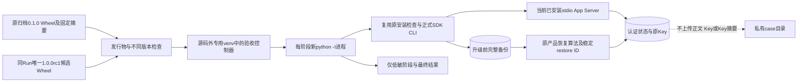
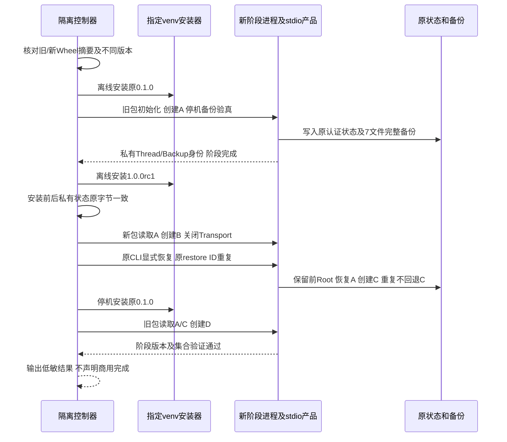
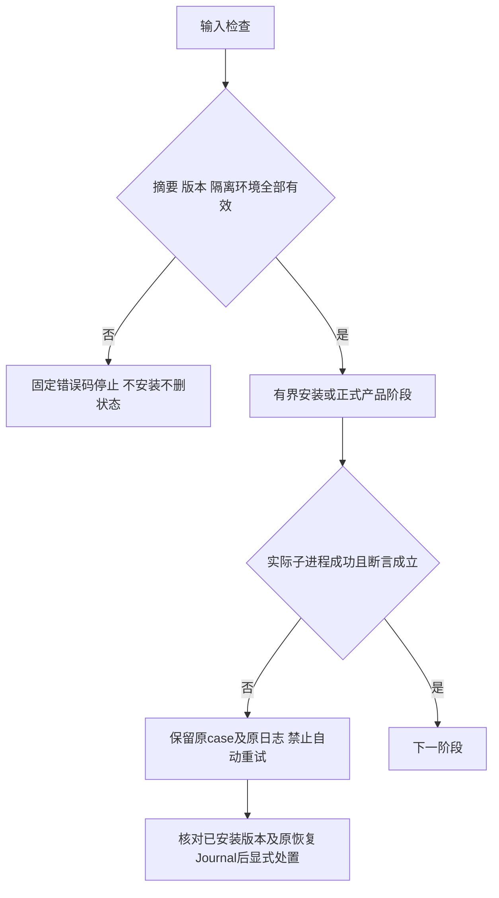

# R4 不同版本停机升级与完整状态回退详细设计

## 1. 文档摘要、需求背景与源码研究

已有[规范Wheel三平台安装证据](../validation/canonical-wheel-three-platform-2026-09-29-v1/README.md)
证明同一发行物的安装、完整状态恢复及卸载重装。包版本均为`0.1.0`，不能作为不同版本升级依据。
升级必须使用实际旧发行物创建状态，再由新发行物读取及写入；回退必须先恢复升级前完整备份，
不能假设旧版本能够读取任意新版本数据库，也不能使用重新标版本的旧代码伪造升级。

源码依据为[既有安装验收器](../../scripts/installed_product_acceptance.py)、
[正式停机CLI](../../src/harnessix/product_config/state_backup_cli.py)、
[整体恢复入口](../../src/harnessix/product_config/state_restore.py)及
[SDK初始化](../../src/harnessix/sdk/agent_client.py)。恢复依旧由原Owner、原Key和耐久Journal负责。
本切片不构建第二恢复算法，不新增生产Schema或自动更新平台。

## 2. 设计目标、非目标与验收条件

1. 使用已归档原`0.1.0`规范Wheel，来源Revision为`a4f7f33449bb897d84fe3a8e8262307943233fb4`，
   原字节SHA256为`5a6e144487dd79679f609b709743db176ee28bdca077084ac8901efdc9f2fe30`。
2. 新发行物版本为`1.0.0rc1`，仅表示内部预发行候选。候选来自实际当前源码，并与旧源码有真实实现差异；
   不创建稳定Tag、不发布正式商用Release，不关闭其他门禁。
3. 在源码外新建专用venv；每个阶段都使用新的隔离解释器，核对安装文件/Wheel原字节和握手版本。
   两份验收脚本的实际字节必须等于指定Revision内原件，不能用未提交驱动替代源码绑定。
4. 旧包创建认证Thread A并备份六库和原Key；升级安装不修改状态，候选读取A并创建B。
5. 候选通过正式CLI恢复升级前备份，证明B消失并创建C；同restore ID重复不回退C。
6. 停机安装原旧包，状态原字节不变；旧包读取A/C并创建D，证明回退后的读写能力。
7. 三平台消费同一个候选Wheel，分别出具事实；Windows Server结果不外推Windows11。

非目标：完整编码质量、真实模型Turn、任意历史版本升级、跨机Key迁移、消费者OS认证、独立Beta。
本专项PASS不等于R4或1.0整体通过；最终稳定版本仍须在同一最终候选完成必要门禁。

## 3. 总体架构、模块边界与数据流程



控制器只安排安装顺序、期限和判定，不承担产品状态迁移。阶段工作进程加载同目录既有安装验收辅助模块，
但不把源码加入`sys.path`；其中`harnessix`始终来自专用venv。阶段之间不复用已加载旧包的解释器执行产品操作。
依赖沿用候选锁定全集并按哈希安装，两份Wheel使用相同依赖集合；这是该固定版本对的验证范围，不证明所有依赖升级。

## 4. 正常时序、恢复与失败边界



所有阶段在返回前关闭Transport；只有停机后才切换包或取状态快照。安装前后比较整个自有case的文件集合及字节摘要，
Key原字节仅在控制器内存核对，不写入结果。升级后B是原产品实际写入，不能由验收器直接修改SQLite补造。



子进程60/120秒、阶段180秒，外层工作流20分钟硬期限。安装失败、阶段超时、Ctrl-C及恢复未决均不得输出PASS或自动重试。
自动取消不等于产品恢复已回退；如原restore已耐久提交，以原Journal和`state recover`显式结算。
验收case不可覆盖、不可自动删除，不自动修复ACL，不猜测新Key或忽略认证失败。

## 5. 接口设计与调用链

入口为`installed_product_upgrade_acceptance.py`，参数包括`--environment-root`、`--source-root`、
`--source-revision`、`--wheel`、`--wheel-sha256`、`--baseline-wheel`、`--baseline-sha256`、
`--baseline-source-revision`及`--uv`。阶段参数只用于控制器启动私有子进程，不是产品用户API。

| 符号 | 职责与前后条件 |
|---|---|
| `read_wheel_identity` | 安装前验证摘要、唯一METADATA及harnessix发行物名；失败不生成安装输入 |
| `check_upgrade_pair` | 拒绝同版本，只接受固定`0.1.0 → 1.0.0rc1`验收范围 |
| `require_phase_threads` | 校验完整Thread集合；非空或仅包含A不能替代精确一致 |
| `run_phase` | 新隔离解释器中运行正式SDK/CLI，私有阶段结果只经捕获管道返回 |
| `accept_upgrade` | 仅调度停机安装、私有快照及结果合并，不直接打开Store |
| 原`check_environment/check_package_members` | 验证专用venv、源码隔离与安装包原字节 |
| 原`prepare_case/cli/session` | 原Configure/Doctor、正式状态CLI及新stdio Server |

调用链为控制器→精确哈希离线安装→新阶段进程→原SDK/CLI→正式Server/Owner→原状态。
安装器不是状态Writer，且仅允许操作`environment-root/venv`，不调用全局pip或卸载开发环境。

## 6. 领域契约与数据结构设计

| 字段 | 类型与含义 | 公开边界 |
|---|---|---|
| `WheelIdentity.version` | 唯一发行物METADATA中的版本，不从文件名推断 | 可公开 |
| `WheelIdentity.sha256` | 输入原Wheel完整字节SHA256 | 可公开 |
| `baseline_source_revision` | 原归档Wheel的固定源码身份 | 可公开 |
| `source_revision` | 当前候选实际HEAD，候选包文件必须等于源码 | 可公开 |
| `phase` | baseline/upgraded/restore/rollback固定枚举 | 可公开 |
| Thread/Backup/Restore IDs | 夹具与原恢复身份，只在父子进程间传递 | 不进入最终公开结果 |
| 私有快照与原Key | 控制器内存中的自有case原字节证明 | 禁止输出或上传 |
| `commercial_release` | 恒为false，本验收不拥有发布决定 | 可公开 |
| `not_proven` | 模型/编码质量/消费者OS/Beta/稳定版本等未证明范围 | 必须公开 |

阶段结果是验证数据，不新增协议、表或生产数据格式。旧/新包状态兼容由真实读写和原认证验证证明，
不能仅比较Schema版本号就宣布完整业务兼容。

## 7. 持久化、事务、并发与幂等

产品事实仅存于原数据库、原Key及原恢复Journal；控制器不保存第二套恢复状态机。
同一case只能创建一次；全过程串行，原Owner拒绝活跃互斥冲突。恢复使用同一个UUID与同一个备份确认身份，
重复调用只返回原终态，不能再次覆盖后续C。包切换前所有Transport必须为closed。

回退是“候选恢复升级前整组状态，然后安装旧包”，不是直接把旧包指向任意候选新状态。
候选恢复后的原Root保留，升级后B保留在此前Root中，不偷偷删除用户升级后的工作。
Workspace始终独立于State恢复，原`preserved.txt`必须保持。

## 8. 安全、隐私与可观测性及错误分类

不使用真实模型Key，Provider地址为`provider.invalid`，模型Turn为0。每个阶段设置同一非秘密夹具环境变量，
不读取钥匙串或70元预算账本。源仓库只作为发行物/辅助脚本来源，不能出现在产品导入路径。
实际Wheel先通过原Secret扫描；安装日志不展开产品异常正文，阶段失败仅暴露固定码。

| 错误码 | 含义与动作 |
|---|---|
| `upgrade_versions_equal` | 同版本重装不得记为升级，安装前停止 |
| `upgrade_version_scope_invalid` | 版本对不在固定范围，安装前停止 |
| `upgrade_wheel_identity_invalid` | 摘要缺失/格式错误/字节漂移 |
| `upgrade_wheel_metadata_invalid` | 发行物不唯一、名称错误或版本重复 |
| `upgrade_thread_state_invalid` | 读写/回退后的精确集合不一致 |
| `upgrade_install_changed_state` | 包切换修改了case字节 |
| `upgrade_phase_failed` | 原CLI/SDK、阶段进程或期限未满足 |
| `upgrade_script_revision_mismatch` | 辅助脚本与指定Revision原字节不同，运行阶段前拒绝 |
| `upgrade_cancelled` | 控制器收到KeyboardInterrupt，固定退出130，不写成功结果 |

公开结果包含平台、Python、两份Wheel身份、安装/源码成员数和阶段断言；不包含正文、数据库、Key或Key摘要。
日志和结果均由既有CI精确白名单上传，不递归上传case。

## 9. 核心业务逻辑伪代码

```text
validate_isolated_environment_and_current_candidate_bytes()
validate_original_baseline_sha_and_fixed_different_versions()
install_baseline_with_hash_offline_to_the_specific_venv()
baseline = fresh_phase(create_A_and_backup_original_state)
retain_original_key_only_in_memory()
install_candidate_and_require_all_case_bytes_unchanged()
fresh_phase(read_A_and_create_B)
fresh_phase(restore_original_backup_create_C_repeat_same_restore_id)
require_original_key_unchanged()
install_baseline_and_require_all_case_bytes_unchanged()
fresh_phase(read_A_C_and_create_D)
require_workspace_unchanged()
publish_low_sensitive_result_without_commercial_claim()
on_any_failure: preserve_case_and_stop_without_automatic_retry()
```

## 10. 完整测试与真实验证计划

固定版本范围、错误摘要、重复METADATA、错误发行物、同版本及错误Thread集合必须先失败后通过。
既有环境越界/源码借用/专用venv/路径穿越/安装字节篡改/存量case拒绝测试继续执行。
阶段期限为180秒，超时只报告固定码且不重试；控制器取消测试验证固定退出和无成功输出，
不将该单元测试外推为整个进程树的原生取消验收。
三平台工作流保留旧安装生命周期，增加同候选不同版本验收，私有case不上传；两份实际Wheel均按哈希安装。
真实执行须核对原Key、A/B/C/D精确集合、活跃互斥、原Root保留、稳定restore ID和安装前后字节不变。
各平台原件、JUnit、Manifest和Review Packet归档，不用测试名称或脚本存在推导场景通过。

固定`1cda7ad`本机Python3.12/3.13受影响回归各422通过，macOS ARM64源码外实际不同版本生命周期通过，
两份Wheel分别校验原摘要，模型请求为0。原生Run `36517330074`的Windows测试读档暴露默认cp1252编码错误，
不能登记Windows升级成功；后继明确UTF-8读档并增加非UTF-8 locale复现，完整原生结果另行归档。

## 11. 源码与测试映射及阅读顺序

| 顺序 | 源码/资料 | 验证 |
|---|---|---|
| 1 | [升级控制器](../../scripts/installed_product_upgrade_acceptance.py) | [新正反例](../../tests/governance/test_installed_product_upgrade_acceptance.py) |
| 2 | [原安装辅助模块](../../scripts/installed_product_acceptance.py) | [原边界测例](../../tests/governance/test_installed_product_acceptance.py) |
| 3 | [原SDK](../../src/harnessix/sdk/agent_client.py)与[Transport](../../src/harnessix/sdk/subprocess.py) | [SDK测例](../../tests/app_server/test_server_sdk.py) |
| 4 | [原备份](../../src/harnessix/product_config/state_backup.py)与[恢复](../../src/harnessix/product_config/state_restore.py) | [原完整恢复测例](../../tests/product_config/test_product_state_restore.py) |
| 5 | [唯一Wheel工作流](../../.github/workflows/installed-product-acceptance.yml) | 新治理工作流输入和上传边界测例 |

## 12. 部署、兼容、回退、风险与取舍

该固定版本对不新增Schema；原`0.1.0`必须来自归档Wheel，不允许以当前源码重建旧标签替代。
`1.0.0rc1`仅用于内部验证，不改变正式支持矩阵或许可证政策；项目元数据、uv锁、SBOM与许可报告需同步版本身份，
原12件许可阻断不得因RC标记自动豁免。

选择复用原安装器/CLI/备份，而不新增自动更新服务，减少第二恢复状态机和隐式回滚风险。
代价是仅验收一个版本对及小规模认证会话；完整编码、实际消费者Windows11、独立Beta仍为后续必要证据。
稳定`1.0.0`不能继承RC全部门禁，需要最终同候选复核。本切片保持旧验证档案，不修改其结论。
